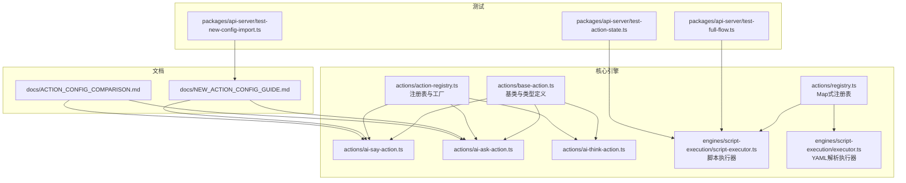
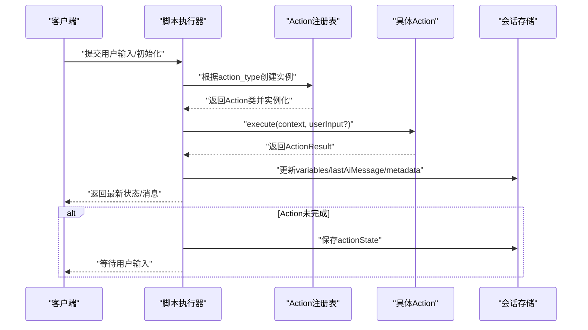
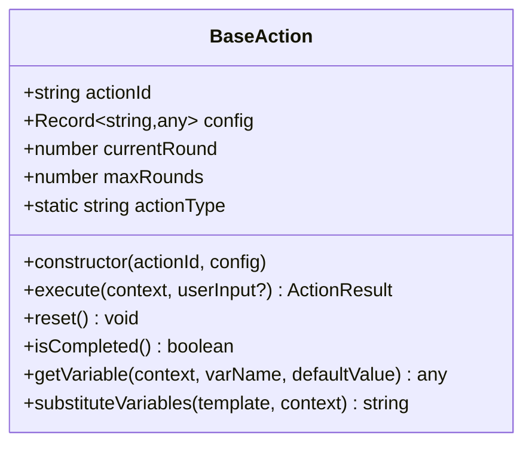
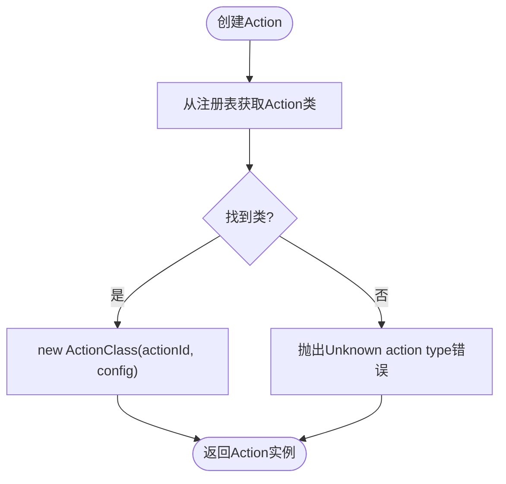
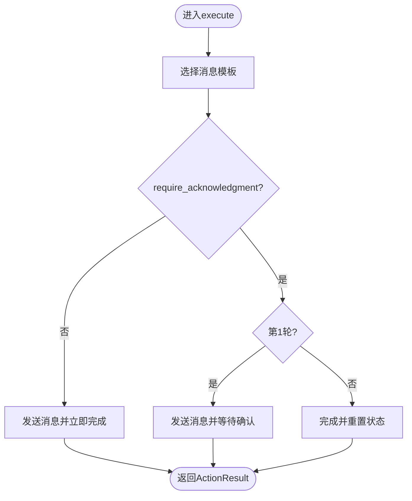
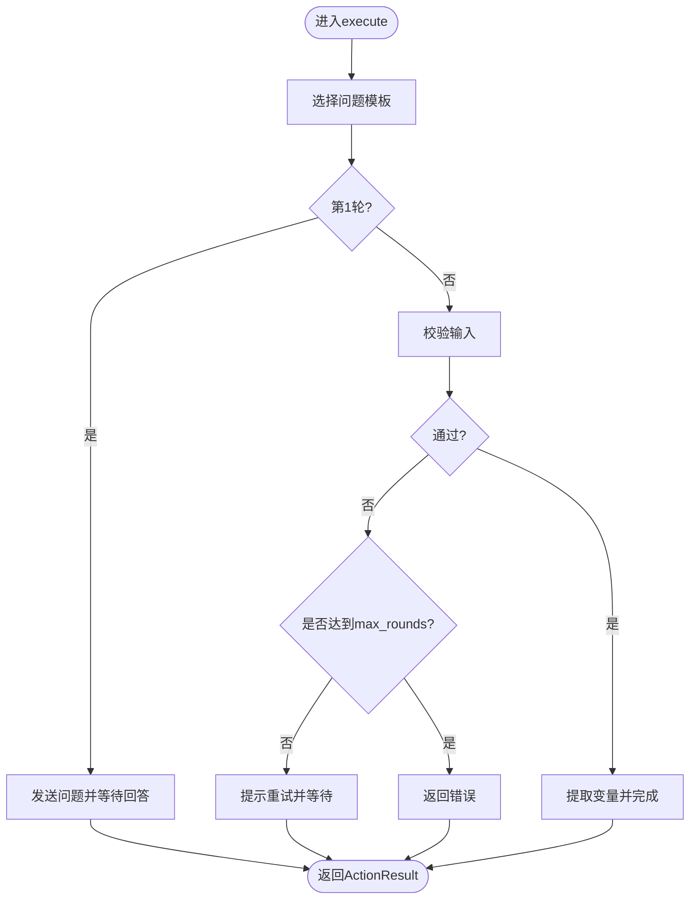
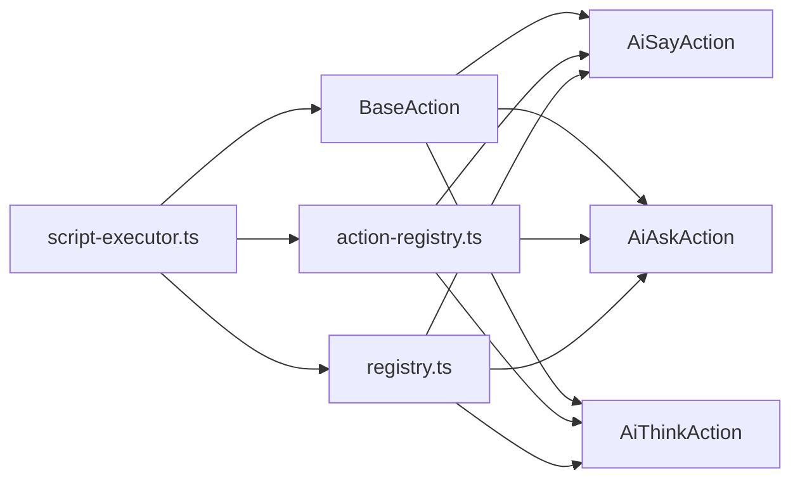

# 新Action开发

<cite>
**本文引用的文件**
- [base-action.ts](file://packages/core-engine/src/actions/base-action.ts)
- [action-registry.ts](file://packages/core-engine/src/actions/action-registry.ts)
- [registry.ts](file://packages/core-engine/src/actions/registry.ts)
- [ai-say-action.ts](file://packages/core-engine/src/actions/ai-say-action.ts)
- [ai-ask-action.ts](file://packages/core-engine/src/actions/ai-ask-action.ts)
- [ai-think-action.ts](file://packages/core-engine/src/actions/ai-think-action.ts)
- [executor.ts](file://packages/core-engine/src/engines/script-execution/executor.ts)
- [script-executor.ts](file://packages/core-engine/src/engines/script-execution/script-executor.ts)
- [NEW_ACTION_CONFIG_GUIDE.md](file://docs/NEW_ACTION_CONFIG_GUIDE.md)
- [ACTION_CONFIG_COMPARISON.md](file://docs/ACTION_CONFIG_COMPARISON.md)
- [test-full-flow.ts](file://packages/api-server/test-full-flow.ts)
- [test-action-state.ts](file://packages/api-server/test-action-state.ts)
- [test-new-config-import.ts](file://packages/api-server/test-new-config-import.ts)
</cite>

## 目录
1. [简介](#简介)
2. [项目结构](#项目结构)
3. [核心组件](#核心组件)
4. [架构总览](#架构总览)
5. [详细组件分析](#详细组件分析)
6. [依赖关系分析](#依赖关系分析)
7. [性能考量](#性能考量)
8. [故障排查指南](#故障排查指南)
9. [结论](#结论)
10. [附录](#附录)

## 简介
本指南面向希望为 HeartRule AI咨询引擎开发新 Action 的开发者，系统讲解 Action 基类设计、继承规范、Action 注册表工作机制、Action 配置文件格式与参数校验、错误处理与调试技巧，并提供从创建 Action 类文件、实现 execute 方法、注册与测试的完整流程。文中以内置 Action（ai_say、ai_ask、ai_think）为例，展示实现模式与最佳实践。

## 项目结构
与 Action 开发直接相关的核心目录与文件：
- 动作基类与内置动作：packages/core-engine/src/actions/
- 执行器与脚本执行：packages/core-engine/src/engines/script-execution/
- Action 配置与可视化编辑器文档：docs/

图表来源
- [base-action.ts](file://packages/core-engine/src/actions/base-action.ts#L1-L96)
- [action-registry.ts](file://packages/core-engine/src/actions/action-registry.ts#L1-L46)
- [registry.ts](file://packages/core-engine/src/actions/registry.ts#L1-L46)
- [ai-say-action.ts](file://packages/core-engine/src/actions/ai-say-action.ts#L1-L105)
- [ai-ask-action.ts](file://packages/core-engine/src/actions/ai-ask-action.ts#L1-L207)
- [ai-think-action.ts](file://packages/core-engine/src/actions/ai-think-action.ts#L1-L57)
- [script-executor.ts](file://packages/core-engine/src/engines/script-execution/script-executor.ts#L1-L511)
- [executor.ts](file://packages/core-engine/src/engines/script-execution/executor.ts#L1-L298)
- [NEW_ACTION_CONFIG_GUIDE.md](file://docs/NEW_ACTION_CONFIG_GUIDE.md#L1-L310)
- [ACTION_CONFIG_COMPARISON.md](file://docs/ACTION_CONFIG_COMPARISON.md#L1-L253)
- [test-full-flow.ts](file://packages/api-server/test-full-flow.ts#L1-L208)
- [test-action-state.ts](file://packages/api-server/test-action-state.ts#L122-L172)
- [test-new-config-import.ts](file://packages/api-server/test-new-config-import.ts#L95-L125)

章节来源
- [base-action.ts](file://packages/core-engine/src/actions/base-action.ts#L1-L96)
- [action-registry.ts](file://packages/core-engine/src/actions/action-registry.ts#L1-L46)
- [registry.ts](file://packages/core-engine/src/actions/registry.ts#L1-L46)
- [script-executor.ts](file://packages/core-engine/src/engines/script-execution/script-execution.ts#L1-L511)
- [executor.ts](file://packages/core-engine/src/engines/script-execution/executor.ts#L1-L298)

## 核心组件
- Action 基类与类型定义：定义 ActionContext、ActionResult、BaseAction 抽象类及通用工具方法（变量替换、轮次管理）。
- 内置 Action：ai_say、ai_ask、ai_think 的具体实现，展示不同交互模式与状态机。
- Action 注册表：两种注册表实现（对象映射与 Map），提供创建 Action 实例的工厂方法。
- 脚本执行器：负责解析脚本、驱动 Action 执行、维护执行状态与对话历史。

章节来源
- [base-action.ts](file://packages/core-engine/src/actions/base-action.ts#L7-L96)
- [ai-say-action.ts](file://packages/core-engine/src/actions/ai-say-action.ts#L16-L105)
- [ai-ask-action.ts](file://packages/core-engine/src/actions/ai-ask-action.ts#L19-L207)
- [ai-think-action.ts](file://packages/core-engine/src/actions/ai-think-action.ts#L11-L57)
- [action-registry.ts](file://packages/core-engine/src/actions/action-registry.ts#L17-L46)
- [registry.ts](file://packages/core-engine/src/actions/registry.ts#L6-L46)
- [script-executor.ts](file://packages/core-engine/src/engines/script-execution/script-executor.ts#L14-L55)

## 架构总览
Action 的生命周期由脚本执行器驱动：解析脚本 → 创建 Action 实例 → 执行 Action → 处理 ActionResult → 更新状态与对话历史 → 进入下一阶段。

图表来源
- [script-executor.ts](file://packages/core-engine/src/engines/script-execution/script-executor.ts#L63-L208)
- [executor.ts](file://packages/core-engine/src/engines/script-execution/executor.ts#L239-L298)
- [action-registry.ts](file://packages/core-engine/src/actions/action-registry.ts#L35-L45)
- [registry.ts](file://packages/core-engine/src/actions/registry.ts#L33-L45)

## 详细组件分析

### BaseAction 基类与接口规范
- ActionContext：包含会话ID、阶段/话题/动作ID、变量、对话历史、元数据。
- ActionResult：统一返回格式，包含 success/completed/aiMessage/extractedVariables/nextAction/error/metadata。
- BaseAction：
  - 静态属性 actionType 用于注册表识别。
  - 构造函数接收 actionId 与 config，并解析 maxRounds。
  - 抽象方法 execute(context, userInput?) 必须由子类实现。
  - 提供 reset/isCompleted 状态管理。
  - 提供 getVariable/substituteVariables 通用工具。

图表来源
- [base-action.ts](file://packages/core-engine/src/actions/base-action.ts#L37-L96)

章节来源
- [base-action.ts](file://packages/core-engine/src/actions/base-action.ts#L7-L96)

### Action 注册表机制
- 对象映射注册表（action-registry.ts）：以字符串类型映射到类构造器，提供 registerAction/createAction。
- Map 注册表（registry.ts）：以 Map 存储，提供 registerAction/getActionClass/createAction。
- 执行器通过注册表创建 Action 实例；若类型未知抛出错误。

图表来源
- [action-registry.ts](file://packages/core-engine/src/actions/action-registry.ts#L28-L45)
- [registry.ts](file://packages/core-engine/src/actions/registry.ts#L16-L45)

章节来源
- [action-registry.ts](file://packages/core-engine/src/actions/action-registry.ts#L17-L46)
- [registry.ts](file://packages/core-engine/src/actions/registry.ts#L6-L46)

### 内置 Action 实现模式

#### AiSayAction（AI传达信息）
- 行为要点：支持 require_acknowledgment 控制是否等待用户确认；支持 max_rounds；消息模板优先级：prompt_template/promptTemplate/content_template/contentTemplate/content。
- 状态机：第1轮发送消息并等待确认；第2轮收到确认后完成。
- 返回：completed=false 表示等待输入；completed=true 表示完成。

图表来源
- [ai-say-action.ts](file://packages/core-engine/src/actions/ai-say-action.ts#L19-L105)

章节来源
- [ai-say-action.ts](file://packages/core-engine/src/actions/ai-say-action.ts#L16-L105)

#### AiAskAction（AI提问并提取答案）
- 行为要点：支持 question_template/target_variable/extraction_prompt/validation（required/min_length/max_length/pattern）/retry_message/max_rounds。
- 状态机：第1轮发送问题；后续轮次处理用户输入，进行校验与重试，达到 max_rounds 后失败。
- 返回：成功时返回 extractedVariables；失败时返回 error。

图表来源
- [ai-ask-action.ts](file://packages/core-engine/src/actions/ai-ask-action.ts#L27-L207)

章节来源
- [ai-ask-action.ts](file://packages/core-engine/src/actions/ai-ask-action.ts#L19-L207)

#### AiThinkAction（AI内部思考）
- 行为要点：MVP版本直接生成占位符变量值，不实际调用LLM；支持 think_goal/output_variables。
- 返回：completed=true，无 aiMessage，仅返回 extractedVariables。

章节来源
- [ai-think-action.ts](file://packages/core-engine/src/actions/ai-think-action.ts#L11-L57)

### Action 开发全流程

#### 步骤一：创建 Action 类文件
- 在 packages/core-engine/src/actions/ 下新建文件，例如 my-action.ts。
- 导入 BaseAction 并声明静态 actionType。
- 实现 execute(context, userInput?)，遵循 ActionResult 返回规范。

章节来源
- [base-action.ts](file://packages/core-engine/src/actions/base-action.ts#L37-L57)

#### 步骤二：实现 execute 方法
- 读取 config 中的必要字段，进行参数校验与默认值处理。
- 使用 this.substituteVariables 替换模板中的变量占位符。
- 根据业务逻辑构建 ActionResult：
  - completed=false：表示需要等待用户输入（如 ai_ask 发送问题）。
  - completed=true：表示完成，可能包含 extractedVariables、aiMessage、metadata。
  - success=false：表示失败，返回 error 字段。

章节来源
- [ai-say-action.ts](file://packages/core-engine/src/actions/ai-say-action.ts#L19-L105)
- [ai-ask-action.ts](file://packages/core-engine/src/actions/ai-ask-action.ts#L27-L207)
- [ai-think-action.ts](file://packages/core-engine/src/actions/ai-think-action.ts#L18-L57)

#### 步骤三：注册 Action
- 方案A（对象映射注册表）：在 action-registry.ts 的 ACTION_REGISTRY 中添加映射，并在 registerAction 中注册。
- 方案B（Map注册表）：在 registry.ts 中使用 registerAction 注册。

章节来源
- [action-registry.ts](file://packages/core-engine/src/actions/action-registry.ts#L17-L30)
- [registry.ts](file://packages/core-engine/src/actions/registry.ts#L16-L21)

#### 步骤四：在脚本中使用
- 在 YAML/JSON 脚本中定义 action_type 与 action_id，并提供 config。
- 执行器将根据 action_type 从注册表创建实例并执行。

章节来源
- [script-executor.ts](file://packages/core-engine/src/engines/script-execution/script-executor.ts#L453-L468)
- [executor.ts](file://packages/core-engine/src/engines/script-execution/executor.ts#L285-L296)

#### 步骤五：测试与验证
- 使用 test-full-flow.ts 验证完整会话流程与状态推进。
- 使用 test-action-state.ts 验证 Action 状态持久化与恢复。
- 使用 test-new-config-import.ts 验证新配置项的解析与映射。

章节来源
- [test-full-flow.ts](file://packages/api-server/test-full-flow.ts#L16-L208)
- [test-action-state.ts](file://packages/api-server/test-action-state.ts#L122-L172)
- [test-new-config-import.ts](file://packages/api-server/test-new-config-import.ts#L95-L125)

## 依赖关系分析
- BaseAction 是所有 Action 的抽象基类，提供统一接口与工具方法。
- 注册表负责将 action_type 与具体类关联，执行器通过注册表创建实例。
- 执行器负责驱动 Action 执行、维护执行状态、更新变量与对话历史。
- 内置 Action 展示了不同交互模式：单轮消息（ai_say）、多轮问答（ai_ask）、内部思考（ai_think）。

图表来源
- [base-action.ts](file://packages/core-engine/src/actions/base-action.ts#L37-L96)
- [action-registry.ts](file://packages/core-engine/src/actions/action-registry.ts#L17-L46)
- [registry.ts](file://packages/core-engine/src/actions/registry.ts#L11-L46)
- [script-executor.ts](file://packages/core-engine/src/engines/script-execution/script-executor.ts#L453-L468)

章节来源
- [base-action.ts](file://packages/core-engine/src/actions/base-action.ts#L37-L96)
- [action-registry.ts](file://packages/core-engine/src/actions/action-registry.ts#L17-L46)
- [registry.ts](file://packages/core-engine/src/actions/registry.ts#L11-L46)
- [script-executor.ts](file://packages/core-engine/src/engines/script-execution/script-executor.ts#L453-L468)

## 性能考量
- Action 执行应尽量保持幂等与无副作用，避免在 execute 中进行昂贵的外部调用。
- 使用变量替换时注意模板大小与变量数量，避免过长的字符串拼接。
- 对于需要多次轮次的 Action（如 ai_ask），合理设置 max_rounds，防止无限等待。
- 执行器对 Action 状态进行序列化/反序列化，确保状态恢复时不会丢失关键信息。

## 故障排查指南
- Unknown action type：检查 action_type 是否已在注册表中注册。
- Action 未完成却无消息：确认 ActionResult.completed 与 aiMessage 的组合是否正确。
- 输入校验失败：检查 AiAskAction 的 validation 配置（required/min_length/max_length/pattern）与 retry_message。
- 状态未推进：核对执行器对 variables/conversationHistory/metadata 的更新逻辑。
- 调试技巧：
  - 在 Action 与执行器中添加日志，定位执行位置与状态变化。
  - 使用 test-full-flow.ts 与 test-action-state.ts 验证状态持久化与推进。
  - 使用 test-new-config-import.ts 验证新配置项的解析与映射。

章节来源
- [action-registry.ts](file://packages/core-engine/src/actions/action-registry.ts#L40-L43)
- [registry.ts](file://packages/core-engine/src/actions/registry.ts#L38-L44)
- [executor.ts](file://packages/core-engine/src/engines/script-execution/executor.ts#L290-L296)
- [script-executor.ts](file://packages/core-engine/src/engines/script-execution/script-executor.ts#L459-L468)
- [test-full-flow.ts](file://packages/api-server/test-full-flow.ts#L122-L172)
- [test-action-state.ts](file://packages/api-server/test-action-state.ts#L122-L172)
- [test-new-config-import.ts](file://packages/api-server/test-new-config-import.ts#L95-L125)

## 结论
通过遵循 BaseAction 的接口规范、正确实现 execute 方法、在注册表中注册 Action 类型，并结合脚本执行器的状态管理与测试验证，开发者可以高效地为 HeartRule 引擎开发新的 Action。内置 Action（ai_say、ai_ask、ai_think）提供了清晰的实现范式与最佳实践，可作为新 Action 开发的参考模板。

## 附录

### Action 配置文件格式与参数校验
- ai_say
  - require_acknowledgment：布尔值，默认 true。
  - max_rounds：数值，默认 1。
  - content_template/prompt_template/promptTemplate：消息模板。
- ai_ask
  - question_template/question_template/question：问题模板。
  - target_variable：提取目标变量名。
  - extraction_prompt：提取提示词。
  - required：是否必填。
  - max_rounds：最大尝试次数。
  - validation：校验规则（required/min_length/minLength/max_length/maxLength/pattern）。
  - retry_message：重试提示。
- ai_think
  - think_goal：思考目标。
  - output_variables：输出变量数组。

章节来源
- [NEW_ACTION_CONFIG_GUIDE.md](file://docs/NEW_ACTION_CONFIG_GUIDE.md#L9-L104)
- [ACTION_CONFIG_COMPARISON.md](file://docs/ACTION_CONFIG_COMPARISON.md#L5-L222)
- [ai-say-action.ts](file://packages/core-engine/src/actions/ai-say-action.ts#L21-L28)
- [ai-ask-action.ts](file://packages/core-engine/src/actions/ai-ask-action.ts#L29-L61)
- [ai-think-action.ts](file://packages/core-engine/src/actions/ai-think-action.ts#L23-L35)