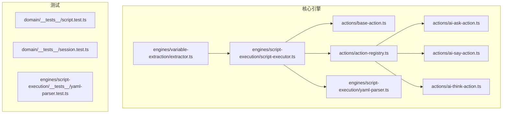
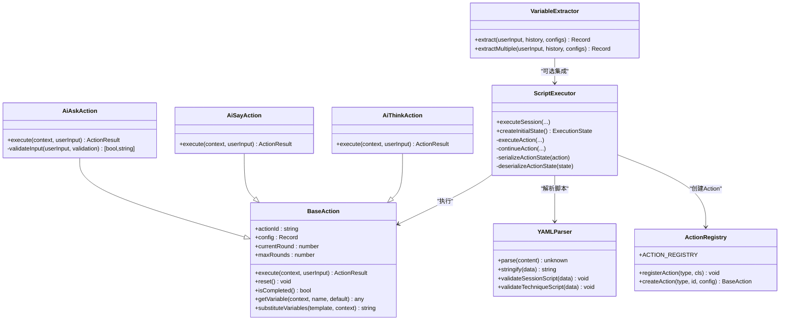
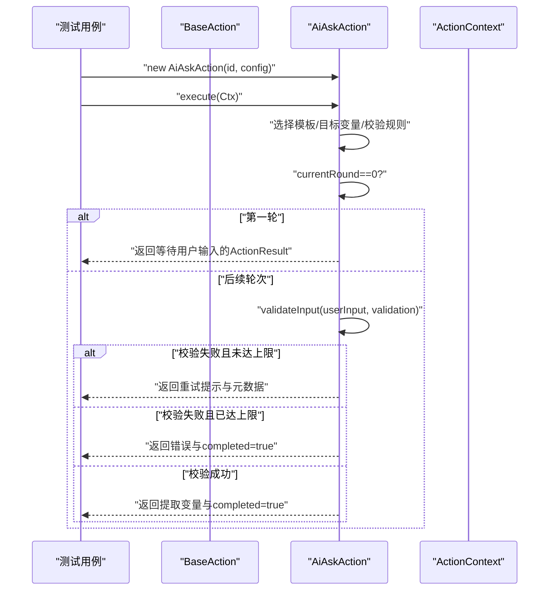
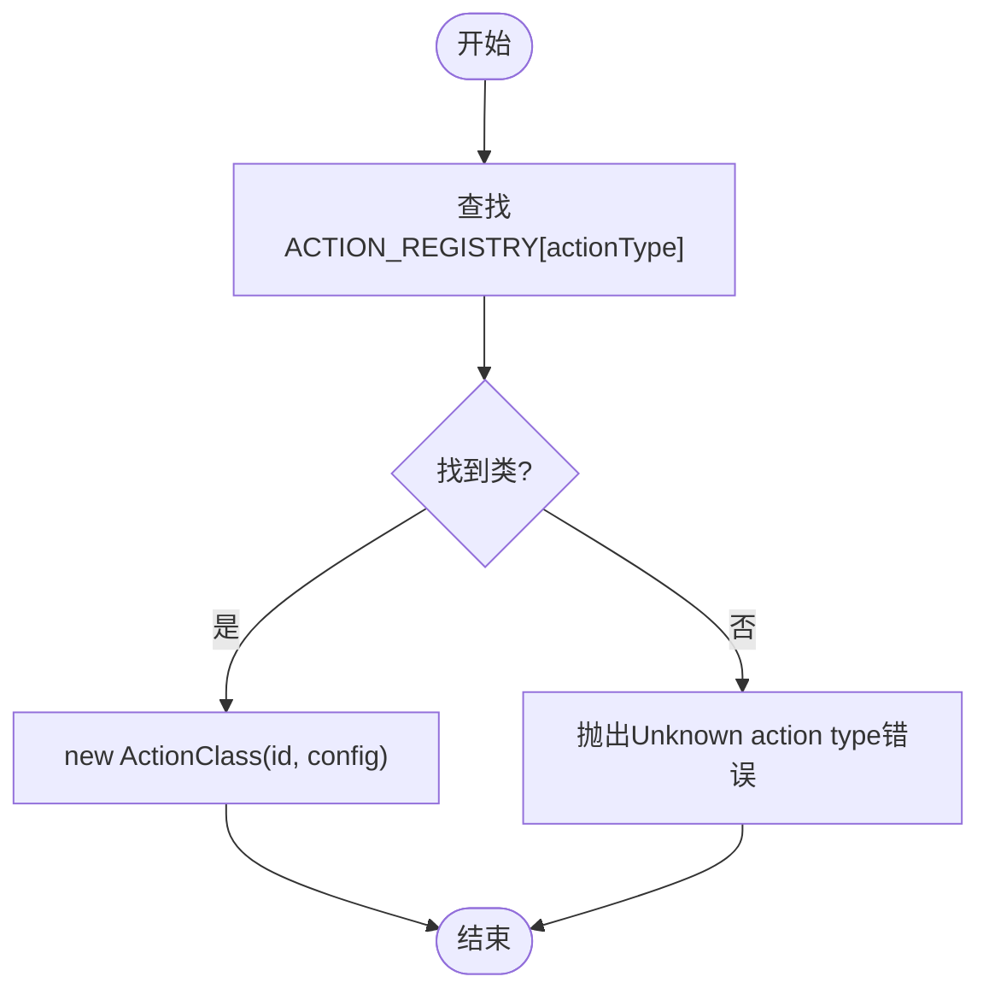
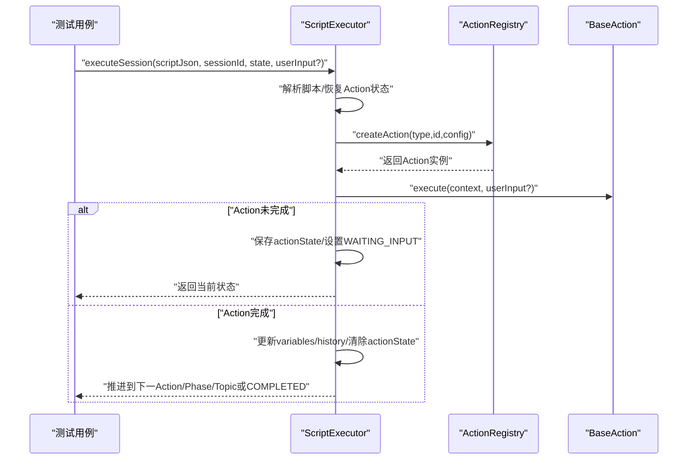
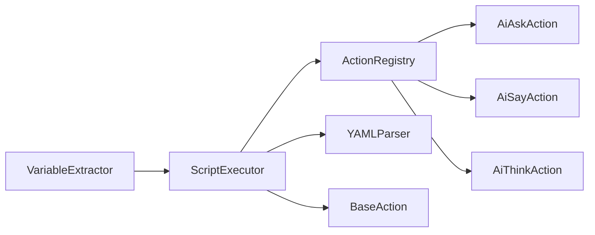

# 单元测试

<cite>
**本文引用的文件**
- [packages/core-engine/src/actions/base-action.ts](file://packages/core-engine/src/actions/base-action.ts)
- [packages/core-engine/src/actions/ai-ask-action.ts](file://packages/core-engine/src/actions/ai-ask-action.ts)
- [packages/core-engine/src/actions/ai-say-action.ts](file://packages/core-engine/src/actions/ai-say-action.ts)
- [packages/core-engine/src/actions/ai-think-action.ts](file://packages/core-engine/src/actions/ai-think-action.ts)
- [packages/core-engine/src/actions/action-registry.ts](file://packages/core-engine/src/actions/action-registry.ts)
- [packages/core-engine/src/engines/script-execution/script-executor.ts](file://packages/core-engine/src/engines/script-execution/script-executor.ts)
- [packages/core-engine/src/engines/script-execution/yaml-parser.ts](file://packages/core-engine/src/engines/script-execution/yaml-parser.ts)
- [packages/core-engine/src/engines/variable-extraction/extractor.ts](file://packages/core-engine/src/engines/variable-extraction/extractor.ts)
- [vitest.config.ts](file://vitest.config.ts)
- [package.json](file://package.json)
- [packages/core-engine/src/domain/__tests__/script.test.ts](file://packages/core-engine/src/domain/__tests__/script.test.ts)
- [packages/core-engine/src/domain/__tests__/session.test.ts](file://packages/core-engine/src/domain/__tests__/session.test.ts)
- [packages/core-engine/src/engines/script-execution/__tests__/yaml-parser.test.ts](file://packages/core-engine/src/engines/script-execution/__tests__/yaml-parser.test.ts)
</cite>

## 目录
1. [引言](#引言)
2. [项目结构](#项目结构)
3. [核心组件](#核心组件)
4. [架构总览](#架构总览)
5. [详细组件分析与测试策略](#详细组件分析与测试策略)
6. [依赖关系分析](#依赖关系分析)
7. [性能考量](#性能考量)
8. [故障排查指南](#故障排查指南)
9. [结论](#结论)
10. [附录](#附录)

## 引言
本指南面向HeartRule AI咨询引擎的Action系统与核心引擎组件，提供一套完整的单元测试方案。内容覆盖Action基类、具体Action实现（AiAskAction、AiSayAction、AiThinkAction）、Action注册表、脚本执行器、YAML解析器以及变量提取器。文档同时说明Vitest在本项目中的配置与使用方式，给出测试文件组织、模拟对象创建、断言库使用、测试数据准备、测试隔离与覆盖率分析的最佳实践，并通过序列图与流程图帮助理解关键执行路径。

## 项目结构
- 测试框架采用Vitest，全局启用、Node环境、覆盖率报告器包含文本、JSON、HTML。
- 核心引擎位于packages/core-engine，Action与引擎组件均按功能模块划分目录，测试文件与被测模块同名目录下以__tests__组织。
- package.json提供统一的测试命令，便于在根目录运行所有包的测试与覆盖率统计。

图表来源
- [packages/core-engine/src/actions/action-registry.ts](file://packages/core-engine/src/actions/action-registry.ts#L1-L46)
- [packages/core-engine/src/actions/ai-ask-action.ts](file://packages/core-engine/src/actions/ai-ask-action.ts#L1-L207)
- [packages/core-engine/src/actions/ai-say-action.ts](file://packages/core-engine/src/actions/ai-say-action.ts#L1-L105)
- [packages/core-engine/src/actions/ai-think-action.ts](file://packages/core-engine/src/actions/ai-think-action.ts#L1-L57)
- [packages/core-engine/src/engines/script-execution/script-executor.ts](file://packages/core-engine/src/engines/script-execution/script-executor.ts#L1-L519)
- [packages/core-engine/src/engines/script-execution/yaml-parser.ts](file://packages/core-engine/src/engines/script-execution/yaml-parser.ts#L1-L96)
- [packages/core-engine/src/engines/variable-extraction/extractor.ts](file://packages/core-engine/src/engines/variable-extraction/extractor.ts#L1-L317)

章节来源
- [vitest.config.ts](file://vitest.config.ts#L1-L20)
- [package.json](file://package.json#L13-L32)

## 核心组件
- Action基类与接口：定义ActionContext、ActionResult、抽象execute方法、状态管理与变量替换工具。
- 具体Action：
  - AiAskAction：多轮问答、校验规则、重试与提取变量。
  - AiSayAction：消息发送、可选确认、两轮执行模型。
  - AiThinkAction：占位式思考与变量输出。
- Action注册表：集中注册与实例化Action。
- 脚本执行器：驱动脚本执行、状态机推进、Action生命周期管理、序列化/反序列化Action内部状态。
- YAML解析器：YAML解析、序列化与Schema校验。
- 变量提取器：多策略（direct/pattern/llm）变量提取与类型转换、Schema验证。

章节来源
- [packages/core-engine/src/actions/base-action.ts](file://packages/core-engine/src/actions/base-action.ts#L1-L99)
- [packages/core-engine/src/actions/ai-ask-action.ts](file://packages/core-engine/src/actions/ai-ask-action.ts#L1-L207)
- [packages/core-engine/src/actions/ai-say-action.ts](file://packages/core-engine/src/actions/ai-say-action.ts#L1-L105)
- [packages/core-engine/src/actions/ai-think-action.ts](file://packages/core-engine/src/actions/ai-think-action.ts#L1-L57)
- [packages/core-engine/src/actions/action-registry.ts](file://packages/core-engine/src/actions/action-registry.ts#L1-L46)
- [packages/core-engine/src/engines/script-execution/script-executor.ts](file://packages/core-engine/src/engines/script-execution/script-executor.ts#L1-L519)
- [packages/core-engine/src/engines/script-execution/yaml-parser.ts](file://packages/core-engine/src/engines/script-execution/yaml-parser.ts#L1-L96)
- [packages/core-engine/src/engines/variable-extraction/extractor.ts](file://packages/core-engine/src/engines/variable-extraction/extractor.ts#L1-L317)

## 架构总览
下图展示了Action系统与引擎组件之间的交互关系，以及测试关注点：

图表来源
- [packages/core-engine/src/actions/base-action.ts](file://packages/core-engine/src/actions/base-action.ts#L40-L98)
- [packages/core-engine/src/actions/ai-ask-action.ts](file://packages/core-engine/src/actions/ai-ask-action.ts#L19-L206)
- [packages/core-engine/src/actions/ai-say-action.ts](file://packages/core-engine/src/actions/ai-say-action.ts#L16-L104)
- [packages/core-engine/src/actions/ai-think-action.ts](file://packages/core-engine/src/actions/ai-think-action.ts#L11-L56)
- [packages/core-engine/src/actions/action-registry.ts](file://packages/core-engine/src/actions/action-registry.ts#L12-L45)
- [packages/core-engine/src/engines/script-execution/script-executor.ts](file://packages/core-engine/src/engines/script-execution/script-executor.ts#L62-L518)
- [packages/core-engine/src/engines/script-execution/yaml-parser.ts](file://packages/core-engine/src/engines/script-execution/yaml-parser.ts#L8-L95)
- [packages/core-engine/src/engines/variable-extraction/extractor.ts](file://packages/core-engine/src/engines/variable-extraction/extractor.ts#L25-L316)

## 详细组件分析与测试策略

### Action基类与具体Action实现测试
- 测试要点
  - 基类行为：构造函数初始化、maxRounds回退策略、状态重置、完成判断、变量获取与模板替换。
  - AiAskAction：单轮/多轮问答、校验规则（必填、长度、正则）、重试上限、错误分支、提取变量、元数据。
  - AiSayAction：无需确认与需要确认两种路径、两轮执行模型、元数据标记。
  - AiThinkAction：占位式变量输出、错误兜底。
- 测试建议
  - 使用纯对象构造ActionContext，避免外部依赖。
  - 对AiAskAction的validateInput进行边界条件覆盖（空值、超长、超短、正则不匹配）。
  - 对AiSayAction分别验证require_acknowledgment=true/false的两条路径。
  - 对AiThinkAction验证输出变量集合与元数据。
  - 使用Mock模拟外部服务（如LLM），确保测试稳定与可重复。
  - 断言使用expect的匹配器，覆盖success/completed/aiMessage/extractedVariables/error/metadata等字段。

图表来源
- [packages/core-engine/src/actions/base-action.ts](file://packages/core-engine/src/actions/base-action.ts#L40-L98)
- [packages/core-engine/src/actions/ai-ask-action.ts](file://packages/core-engine/src/actions/ai-ask-action.ts#L27-L167)

章节来源
- [packages/core-engine/src/actions/base-action.ts](file://packages/core-engine/src/actions/base-action.ts#L40-L98)
- [packages/core-engine/src/actions/ai-ask-action.ts](file://packages/core-engine/src/actions/ai-ask-action.ts#L27-L167)
- [packages/core-engine/src/actions/ai-say-action.ts](file://packages/core-engine/src/actions/ai-say-action.ts#L19-L103)
- [packages/core-engine/src/actions/ai-think-action.ts](file://packages/core-engine/src/actions/ai-think-action.ts#L18-L55)

### Action注册表测试
- 测试要点
  - ACTION_REGISTRY包含ai_say/ai_ask/ai_think映射。
  - registerAction动态注册新类型。
  - createAction根据actionType创建实例，未知类型抛错。
- 测试建议
  - 使用临时类进行动态注册，验证createAction能正确实例化。
  - 验证未知类型抛出明确错误信息。

图表来源
- [packages/core-engine/src/actions/action-registry.ts](file://packages/core-engine/src/actions/action-registry.ts#L35-L45)

章节来源
- [packages/core-engine/src/actions/action-registry.ts](file://packages/core-engine/src/actions/action-registry.ts#L17-L45)

### 脚本执行器测试
- 测试要点
  - executeSession：解析脚本、恢复Action状态、推进执行、更新变量与对话历史、状态机切换、错误处理。
  - executeAction/continueAction：构建ActionContext、传递用户输入、处理返回结果。
  - serialize/deserialize：Action内部状态持久化与恢复。
  - createInitialState：初始状态一致性。
- 测试建议
  - 准备最小化的合法脚本JSON，验证完整流程（多Phases/Topics/Actions）。
  - 针对WAITING_INPUT场景，验证actionState序列化与恢复。
  - 针对ERROR场景，验证metadata.error与状态变更。
  - 针对AiAskAction的多轮场景，验证用户输入传入与对话历史追加。
  - 针对AiSayAction的确认场景，验证两轮执行与元数据。

图表来源
- [packages/core-engine/src/engines/script-execution/script-executor.ts](file://packages/core-engine/src/engines/script-execution/script-executor.ts#L66-L216)
- [packages/core-engine/src/engines/script-execution/script-executor.ts](file://packages/core-engine/src/engines/script-execution/script-executor.ts#L402-L456)
- [packages/core-engine/src/engines/script-execution/script-executor.ts](file://packages/core-engine/src/engines/script-execution/script-executor.ts#L498-L517)

章节来源
- [packages/core-engine/src/engines/script-execution/script-executor.ts](file://packages/core-engine/src/engines/script-execution/script-executor.ts#L62-L518)

### YAML解析器测试
- 测试要点
  - parse/stringify：正常/异常YAML处理。
  - validateSessionScript/validateTechniqueScript：Schema校验通过/失败。
- 测试建议
  - 使用现有测试作为参考，补充边界用例（缺失字段、类型不符、非法结构）。

章节来源
- [packages/core-engine/src/engines/script-execution/__tests__/yaml-parser.test.ts](file://packages/core-engine/src/engines/script-execution/__tests__/yaml-parser.test.ts#L1-L92)
- [packages/core-engine/src/engines/script-execution/yaml-parser.ts](file://packages/core-engine/src/engines/script-execution/yaml-parser.ts#L34-L94)

### 变量提取器测试
- 测试要点
  - extract：direct/pattern/llm三种策略，类型转换，Schema验证，组合提取。
  - extractMultiple：非LLM与LLM混合提取。
- 测试建议
  - 为每种extractionMethod准备典型输入与期望输出。
  - 为pattern策略准备正则边界（无匹配、捕获组、大小写）。
  - 为llm策略提供Mock LLMOrchestrator，验证提示词构建与响应解析。
  - 验证schema.parse失败时的降级行为。

章节来源
- [packages/core-engine/src/engines/variable-extraction/extractor.ts](file://packages/core-engine/src/engines/variable-extraction/extractor.ts#L35-L316)

### 现有测试参考
- domain层测试：展示describe/it/expect的基本用法与断言风格。
- YAML解析器测试：展示解析、序列化与Schema校验的断言模式。

章节来源
- [packages/core-engine/src/domain/__tests__/script.test.ts](file://packages/core-engine/src/domain/__tests__/script.test.ts#L1-L60)
- [packages/core-engine/src/domain/__tests__/session.test.ts](file://packages/core-engine/src/domain/__tests__/session.test.ts#L1-L88)
- [packages/core-engine/src/engines/script-execution/__tests__/yaml-parser.test.ts](file://packages/core-engine/src/engines/script-execution/__tests__/yaml-parser.test.ts#L1-L92)

## 依赖关系分析
- Action注册表与具体Action：注册表负责类型到类的映射，具体Action实现各自execute逻辑。
- 脚本执行器依赖注册表创建Action实例，依赖YAML解析器解析脚本，依赖Action执行结果推进状态机。
- 变量提取器可选集成于执行链路，用于从用户输入中抽取结构化变量。
- Vitest配置提供全局断言、Node环境与覆盖率报告。

图表来源
- [packages/core-engine/src/actions/action-registry.ts](file://packages/core-engine/src/actions/action-registry.ts#L17-L45)
- [packages/core-engine/src/engines/script-execution/script-executor.ts](file://packages/core-engine/src/engines/script-execution/script-executor.ts#L62-L518)
- [packages/core-engine/src/engines/script-execution/yaml-parser.ts](file://packages/core-engine/src/engines/script-execution/yaml-parser.ts#L8-L95)
- [packages/core-engine/src/engines/variable-extraction/extractor.ts](file://packages/core-engine/src/engines/variable-extraction/extractor.ts#L25-L316)

## 性能考量
- 测试隔离：每个测试文件独立，避免跨文件共享可变状态；必要时使用beforeEach清理。
- Mock策略：对I/O与外部服务（如LLM）进行Mock，减少测试耗时与不确定性。
- 并行与并发：Vitest默认并行执行测试文件，合理拆分测试用例，避免共享资源竞争。
- 覆盖率：通过覆盖率报告定位未覆盖路径（如AiAskAction的错误分支、AiSayAction的确认路径），针对性补充用例。

## 故障排查指南
- YAML解析失败：检查YAML缩进、键名拼写与Schema字段完整性。
- Action执行错误：检查ActionContext字段（sessionId/phaseId/topicId/actionId/variables/conversationHistory/metadata）是否齐全；确认Action内部状态currentRound/maxRounds是否正确。
- 变量提取失败：确认extractionMethod与pattern/schema配置；验证输入文本与期望类型匹配。
- 脚本执行卡住：检查WAITING_INPUT状态下的actionState序列化/反序列化逻辑，确保用户输入仅在首次传递。

章节来源
- [packages/core-engine/src/engines/script-execution/yaml-parser.ts](file://packages/core-engine/src/engines/script-execution/yaml-parser.ts#L12-L29)
- [packages/core-engine/src/engines/script-execution/script-executor.ts](file://packages/core-engine/src/engines/script-execution/script-executor.ts#L498-L517)
- [packages/core-engine/src/engines/variable-extraction/extractor.ts](file://packages/core-engine/src/engines/variable-extraction/extractor.ts#L35-L77)

## 结论
本指南提供了针对HeartRule Action系统与核心引擎组件的单元测试策略与最佳实践。通过清晰的测试文件组织、Mock与断言规范、覆盖率分析与故障排查流程，能够有效保障Action执行逻辑、状态管理与错误处理的正确性，同时为后续扩展（如Action注册、引擎组件增强）提供稳定的测试基础。

## 附录
- Vitest配置要点
  - 全局启用、Node环境、覆盖率提供者为v8、排除node_modules/dist与类型声明文件。
- 测试命令
  - 运行测试：pnpm test
  - 监听模式：pnpm test:watch
  - 覆盖率：pnpm test:coverage

章节来源
- [vitest.config.ts](file://vitest.config.ts#L3-L19)
- [package.json](file://package.json#L18-L20)