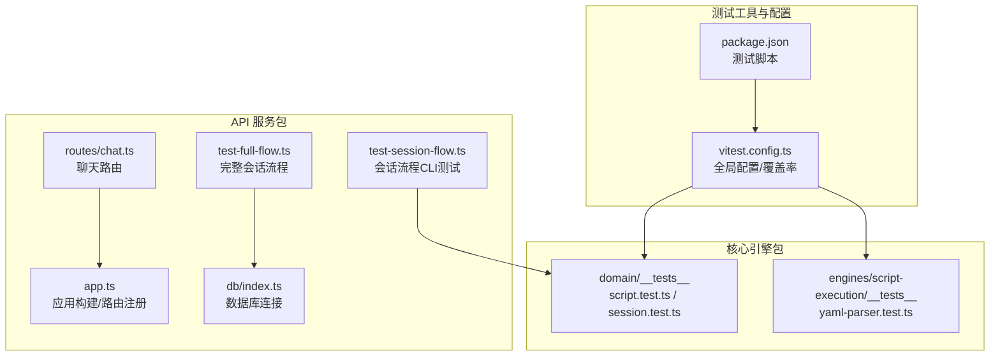
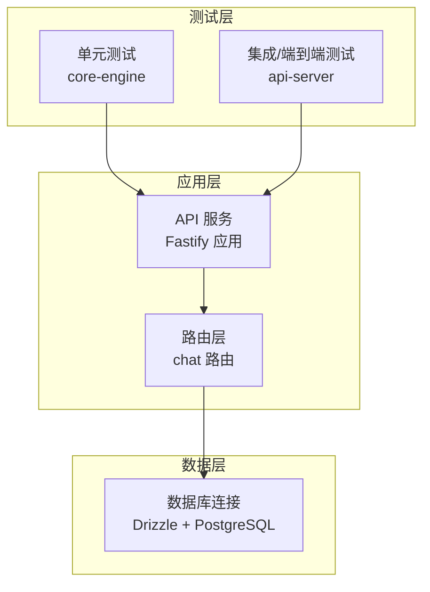
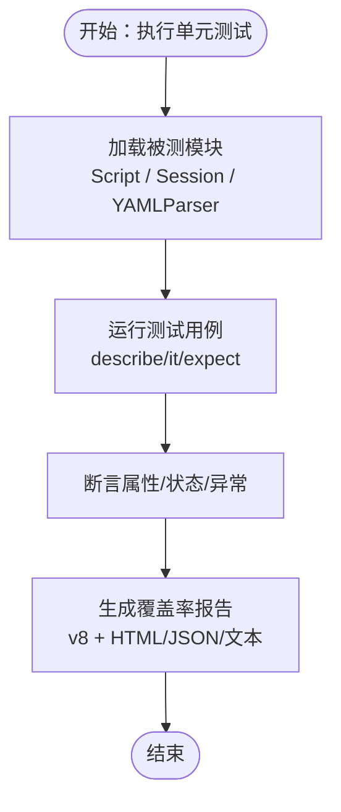
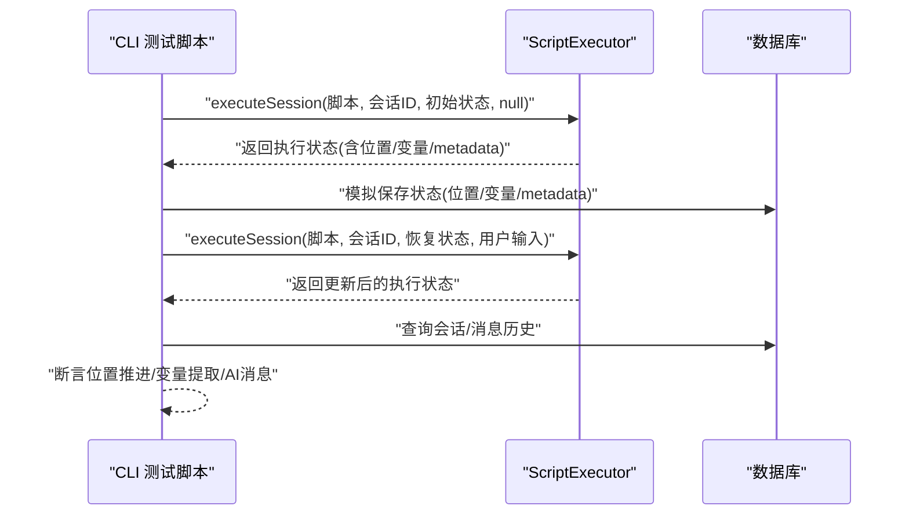
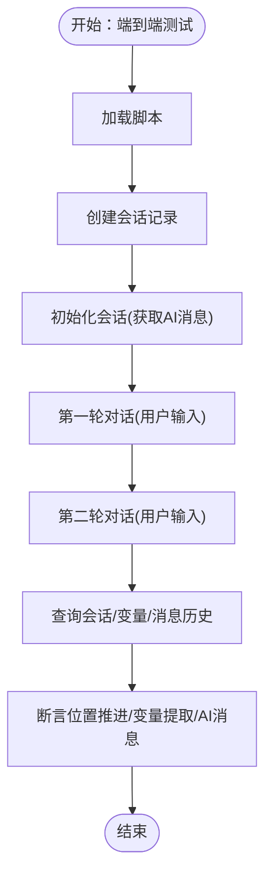
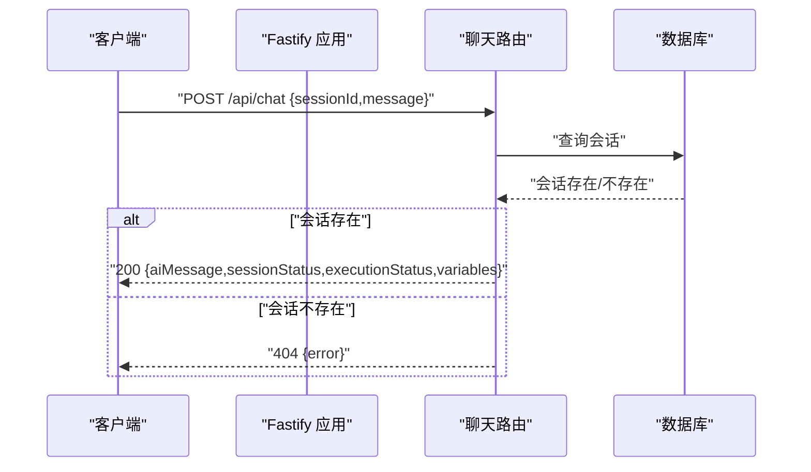
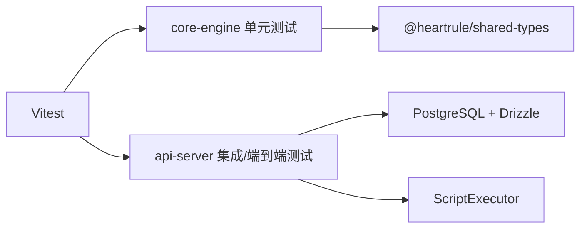

# 测试策略

<cite>
**本文引用的文件**
- [vitest.config.ts](file://vitest.config.ts)
- [package.json](file://package.json)
- [packages/core-engine/src/domain/__tests__/script.test.ts](file://packages/core-engine/src/domain/__tests__/script.test.ts)
- [packages/core-engine/src/domain/__tests__/session.test.ts](file://packages/core-engine/src/domain/__tests__/session.test.ts)
- [packages/core-engine/src/engines/script-execution/__tests__/yaml-parser.test.ts](file://packages/core-engine/src/engines/script-execution/__tests__/yaml-parser.test.ts)
- [packages/api-server/test-full-flow.ts](file://packages/api-server/test-full-flow.ts)
- [packages/api-server/test-session-flow.ts](file://packages/api-server/test-session-flow.ts)
- [packages/api-server/src/routes/chat.ts](file://packages/api-server/src/routes/chat.ts)
- [packages/api-server/src/app.ts](file://packages/api-server/src/app.ts)
- [packages/api-server/src/db/index.ts](file://packages/api-server/src/db/index.ts)
</cite>

## 目录
1. [引言](#引言)
2. [项目结构](#项目结构)
3. [核心组件](#核心组件)
4. [架构总览](#架构总览)
5. [详细组件分析](#详细组件分析)
6. [依赖分析](#依赖分析)
7. [性能考虑](#性能考虑)
8. [故障排查指南](#故障排查指南)
9. [结论](#结论)
10. [附录](#附录)

## 引言
本指南面向 HeartRule AI 咨询引擎的测试体系，围绕 Vitest 测试框架的配置与使用、测试文件组织、断言与模拟对象策略、单元测试/集成测试/端到端测试的实施方法、测试用例编写规范、Action 执行流程与 API 端点测试、数据库操作验证、覆盖率分析与持续集成自动化流程进行系统化说明。目标是帮助开发者建立可维护、可扩展且高覆盖率的测试策略，保障代码质量与系统稳定性。

## 项目结构
- 测试框架与脚本
  - 使用 Vitest 作为测试运行器与断言库，全局启用、Node 环境、v8 覆盖率提供器，并配置 HTML/JSON 文本报告。
  - 顶层 npm 脚本提供 test、test:watch、test:coverage 等常用命令，便于本地与 CI 场景使用。
- 包内测试分布
  - 核心引擎包（core-engine）在各子模块目录下以 __tests__ 组织单元测试，覆盖领域模型与脚本解析等关键逻辑。
  - API 服务包（api-server）提供 CLI 驱动的集成/端到端测试脚本，模拟真实会话流程与数据库交互。
- 关键测试文件
  - 单元测试：Script 与 Session 领域模型、YAML 解析器。
  - 集成/端到端测试：完整会话流程与会话流程 CLI 测试脚本。

图表来源
- [vitest.config.ts](file://vitest.config.ts#L1-L20)
- [package.json](file://package.json#L13-L31)
- [packages/core-engine/src/domain/__tests__/script.test.ts](file://packages/core-engine/src/domain/__tests__/script.test.ts#L1-L60)
- [packages/core-engine/src/domain/__tests__/session.test.ts](file://packages/core-engine/src/domain/__tests__/session.test.ts#L1-L88)
- [packages/core-engine/src/engines/script-execution/__tests__/yaml-parser.test.ts](file://packages/core-engine/src/engines/script-execution/__tests__/yaml-parser.test.ts#L1-L92)
- [packages/api-server/test-full-flow.ts](file://packages/api-server/test-full-flow.ts#L1-L208)
- [packages/api-server/test-session-flow.ts](file://packages/api-server/test-session-flow.ts#L1-L140)
- [packages/api-server/src/routes/chat.ts](file://packages/api-server/src/routes/chat.ts#L1-L152)
- [packages/api-server/src/app.ts](file://packages/api-server/src/app.ts#L1-L135)
- [packages/api-server/src/db/index.ts](file://packages/api-server/src/db/index.ts#L1-L26)

章节来源
- [vitest.config.ts](file://vitest.config.ts#L1-L20)
- [package.json](file://package.json#L13-L31)

## 核心组件
- Vitest 配置与覆盖率
  - 全局启用、Node 环境、v8 覆盖率提供器，输出文本/JSON/HTML 报告；排除 node_modules、dist、类型声明与配置文件。
- 单元测试
  - Script 与 Session 领域模型：构造、状态变更、序列化、变量存取等。
  - YAML 解析器：合法/非法 YAML 解析、会话/技术脚本模式校验。
- 集成/端到端测试
  - 完整会话流程：创建会话、初始化、多轮对话、状态持久化、消息历史查询。
  - 会话流程 CLI 测试：脚本加载、执行器初始化、状态保存/恢复、Action 推进与变量提取。
- API 端点与数据库
  - 路由层：聊天接口（非流式/SSE）、健康检查、Swagger 文档。
  - 应用层：Fastify 构建、插件注册、路由注册。
  - 数据层：PostgreSQL 连接、Drizzle ORM、表结构与迁移。

章节来源
- [packages/core-engine/src/domain/__tests__/script.test.ts](file://packages/core-engine/src/domain/__tests__/script.test.ts#L1-L60)
- [packages/core-engine/src/domain/__tests__/session.test.ts](file://packages/core-engine/src/domain/__tests__/session.test.ts#L1-L88)
- [packages/core-engine/src/engines/script-execution/__tests__/yaml-parser.test.ts](file://packages/core-engine/src/engines/script-execution/__tests__/yaml-parser.test.ts#L1-L92)
- [packages/api-server/test-full-flow.ts](file://packages/api-server/test-full-flow.ts#L1-L208)
- [packages/api-server/test-session-flow.ts](file://packages/api-server/test-session-flow.ts#L1-L140)
- [packages/api-server/src/routes/chat.ts](file://packages/api-server/src/routes/chat.ts#L1-L152)
- [packages/api-server/src/app.ts](file://packages/api-server/src/app.ts#L1-L135)
- [packages/api-server/src/db/index.ts](file://packages/api-server/src/db/index.ts#L1-L26)

## 架构总览
下图展示了测试策略在系统中的定位：单元测试聚焦核心引擎的领域模型与解析器；集成/端到端测试覆盖 API 服务与数据库交互；API 层负责对外暴露聊天能力，应用层负责路由与中间件装配，数据层负责连接与持久化。

图表来源
- [packages/api-server/src/app.ts](file://packages/api-server/src/app.ts#L91-L104)
- [packages/api-server/src/routes/chat.ts](file://packages/api-server/src/routes/chat.ts#L15-L79)
- [packages/api-server/src/db/index.ts](file://packages/api-server/src/db/index.ts#L10-L25)

## 详细组件分析

### 单元测试策略与示例
- 测试文件组织
  - 在核心引擎包中，每个功能模块下的 __tests__ 目录存放对应单元测试，遵循“被测模块名.test.ts”的命名。
- 断言与模式
  - 使用 Vitest 的 describe/it/expect，对属性值、状态转换、错误抛出、JSON 序列化等进行断言。
- 示例参考
  - Script 领域模型：创建、解析内容、发布、归档。
  - Session 领域模型：默认值、启动/暂停/恢复/完成、变量存取、JSON 序列化。
  - YAML 解析器：合法/非法 YAML、会话/技术脚本模式校验。

图表来源
- [packages/core-engine/src/domain/__tests__/script.test.ts](file://packages/core-engine/src/domain/__tests__/script.test.ts#L6-L59)
- [packages/core-engine/src/domain/__tests__/session.test.ts](file://packages/core-engine/src/domain/__tests__/session.test.ts#L6-L87)
- [packages/core-engine/src/engines/script-execution/__tests__/yaml-parser.test.ts](file://packages/core-engine/src/engines/script-execution/__tests__/yaml-parser.test.ts#L5-L91)
- [vitest.config.ts](file://vitest.config.ts#L7-L17)

章节来源
- [packages/core-engine/src/domain/__tests__/script.test.ts](file://packages/core-engine/src/domain/__tests__/script.test.ts#L1-L60)
- [packages/core-engine/src/domain/__tests__/session.test.ts](file://packages/core-engine/src/domain/__tests__/session.test.ts#L1-L88)
- [packages/core-engine/src/engines/script-execution/__tests__/yaml-parser.test.ts](file://packages/core-engine/src/engines/script-execution/__tests__/yaml-parser.test.ts#L1-L92)

### 集成测试策略与示例
- 测试场景
  - 会话流程 CLI 测试：加载脚本、执行器初始化、状态保存/恢复、Action 推进与变量提取。
  - 完整会话流程：创建会话、初始化、多轮对话、状态推进、变量提取、消息历史查询、数据库状态检查。
- 数据库交互
  - 通过 Drizzle ORM 查询/插入会话与消息记录，验证状态持久化与 metadata.actionState 的保存。
- 关键断言点
  - 执行位置推进（phase/topic/action）、变量提取（如 user_name、user_age）、AI 消息内容正确性。

图表来源
- [packages/api-server/test-session-flow.ts](file://packages/api-server/test-session-flow.ts#L35-L108)
- [packages/api-server/test-full-flow.ts](file://packages/api-server/test-full-flow.ts#L67-L145)

章节来源
- [packages/api-server/test-session-flow.ts](file://packages/api-server/test-session-flow.ts#L1-L140)
- [packages/api-server/test-full-flow.ts](file://packages/api-server/test-full-flow.ts#L1-L208)
- [packages/api-server/src/db/index.ts](file://packages/api-server/src/db/index.ts#L10-L25)

### 端到端测试策略与示例
- 测试场景
  - 完整会话流程：从脚本加载、会话创建、初始化消息、多轮对话到最终状态与消息历史的验证。
- 关键断言点
  - 执行位置推进、变量提取、metadata.actionState 保存、消息历史条数与内容片段。
- 与前端联调建议
  - 可结合 web 目录下的前端测试页面进行端到端联调（例如测试前端 API 页面），但当前仓库未包含前端测试源码，建议在前端工程中补充。

图表来源
- [packages/api-server/test-full-flow.ts](file://packages/api-server/test-full-flow.ts#L22-L156)

章节来源
- [packages/api-server/test-full-flow.ts](file://packages/api-server/test-full-flow.ts#L1-L208)

### API 端点测试策略
- 路由与请求体
  - /api/chat：非流式响应，校验 sessionId 与 message 字段，返回 aiMessage、sessionStatus、executionStatus、extractedVariables。
  - /api/chat/stream：SSE 流式响应，模拟分片输出，需关注错误处理与连接关闭。
- 健康检查与文档
  - /health：返回服务健康状态。
  - /docs：Swagger UI 文档。
- 测试要点
  - 缺失会话返回 404；内部错误返回 500 并包含错误详情。
  - SSE 场景需验证响应头设置、分片输出与错误分片。

图表来源
- [packages/api-server/src/routes/chat.ts](file://packages/api-server/src/routes/chat.ts#L16-L79)
- [packages/api-server/src/app.ts](file://packages/api-server/src/app.ts#L82-L89)

章节来源
- [packages/api-server/src/routes/chat.ts](file://packages/api-server/src/routes/chat.ts#L1-L152)
- [packages/api-server/src/app.ts](file://packages/api-server/src/app.ts#L1-L135)

### 数据库操作测试策略
- 连接与环境
  - 通过 DATABASE_URL 环境变量建立 PostgreSQL 连接，Drizzle 初始化 schema。
- 测试方法
  - 在集成/端到端测试中，使用 Drizzle ORM 插入/查询会话与消息记录，验证状态推进与变量持久化。
- 注意事项
  - 确保测试前执行数据库迁移，保证表结构一致。
  - 测试结束后关闭连接，避免资源泄漏。

章节来源
- [packages/api-server/src/db/index.ts](file://packages/api-server/src/db/index.ts#L1-L26)
- [packages/api-server/test-full-flow.ts](file://packages/api-server/test-full-flow.ts#L24-L151)

### Action 系统执行流程测试策略
- 执行器与状态
  - 使用 ScriptExecutor 执行会话，初始状态与恢复状态分别用于首次执行与后续轮次。
  - 关注 metadata.actionState 的保存与恢复，确保 Action 状态一致性。
- 断言策略
  - 比较 actionIndex 是否推进、lastAiMessage 是否符合预期、variables 是否正确提取。
- 与数据库联动
  - 将执行状态保存至数据库，后续从数据库恢复状态继续执行。

章节来源
- [packages/api-server/test-session-flow.ts](file://packages/api-server/test-session-flow.ts#L35-L108)
- [packages/api-server/test-full-flow.ts](file://packages/api-server/test-full-flow.ts#L67-L145)

## 依赖分析
- 测试框架与工具
  - Vitest 作为测试运行器与断言库；@vitest/coverage-v8 提供覆盖率统计。
- 包间关系
  - core-engine 的单元测试不依赖 API 服务；API 服务的集成/端到端测试依赖数据库与核心引擎的执行器。
- 外部依赖
  - Fastify 生态（CORS、Swagger、Swagger UI、WebSocket）、Drizzle ORM、PostgreSQL、uuid、yaml 等。

图表来源
- [package.json](file://package.json#L33-L48)
- [packages/core-engine/src/domain/__tests__/script.test.ts](file://packages/core-engine/src/domain/__tests__/script.test.ts#L1)
- [packages/api-server/test-full-flow.ts](file://packages/api-server/test-full-flow.ts#L9-L11)

章节来源
- [package.json](file://package.json#L33-L48)

## 性能考虑
- 测试执行效率
  - 使用 Vitest watch 模式进行快速迭代；合理拆分测试文件，避免单文件过大。
- 覆盖率控制
  - 通过 vitest.config.ts 的 exclude 规则，排除无关目录与类型定义，提高覆盖率报告准确性。
- 数据库测试优化
  - 在测试前后统一清理或回滚事务，减少重复初始化成本；必要时使用内存数据库或测试专用实例。

## 故障排查指南
- 环境变量缺失
  - 数据库连接需 DATABASE_URL；若未设置，连接初始化会抛出错误。
- 脚本导入问题
  - 完整会话流程测试依赖指定脚本 ID；若脚本不存在，测试会提前终止并提示先执行脚本导入。
- 状态恢复异常
  - 若 metadata.actionState 未保存，会导致 Action 状态无法正确恢复，需检查状态保存逻辑。
- API 响应异常
  - 缺失会话返回 404；内部错误返回 500；SSE 场景需检查响应头与分片输出。

章节来源
- [packages/api-server/src/db/index.ts](file://packages/api-server/src/db/index.ts#L12-L14)
- [packages/api-server/test-full-flow.ts](file://packages/api-server/test-full-flow.ts#L28-L31)
- [packages/api-server/src/routes/chat.ts](file://packages/api-server/src/routes/chat.ts#L56-L77)

## 结论
通过将 Vitest 的单元测试、集成/端到端测试与 API/数据库测试有机结合，HeartRule AI 咨询引擎能够在不同层次上保障功能正确性与系统稳定性。建议持续完善测试覆盖，补充前端端到端测试，并在 CI 中引入覆盖率阈值与自动化执行，形成闭环的质量保障体系。

## 附录
- 测试脚本与命令
  - 运行测试：npm run test
  - 监听模式：npm run test:watch
  - 生成覆盖率：npm run test:coverage
- 覆盖率配置
  - 提供器：v8；报告格式：text、json、html；排除规则：node_modules、dist、类型声明与配置文件
- 建议的测试命名约定
  - 单元测试：被测类/函数名.test.ts
  - 集成/端到端测试：test-*.ts 或 test-*.*（如 test-full-flow.ts）
- 断言策略
  - 对属性值、状态转换、异常抛出、JSON 结构、数组长度与元素内容进行断言
- 测试数据管理
  - 使用固定 ID（如 UUID）与测试脚本；在测试前准备数据并在测试后清理或回滚

章节来源
- [package.json](file://package.json#L18-L20)
- [vitest.config.ts](file://vitest.config.ts#L7-L17)