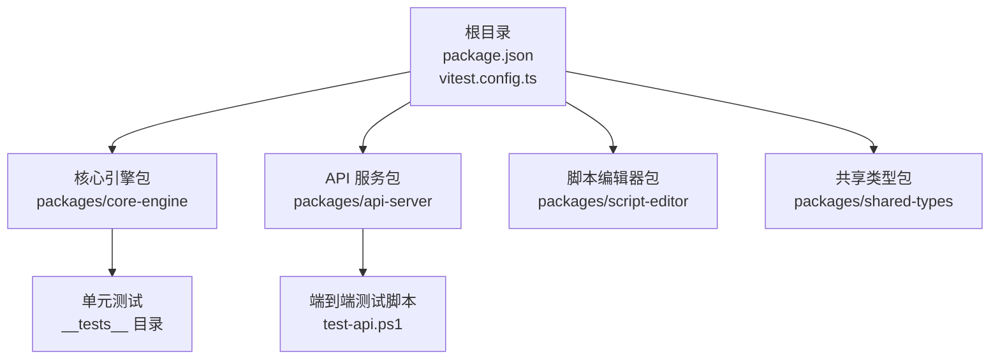
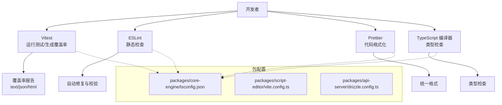
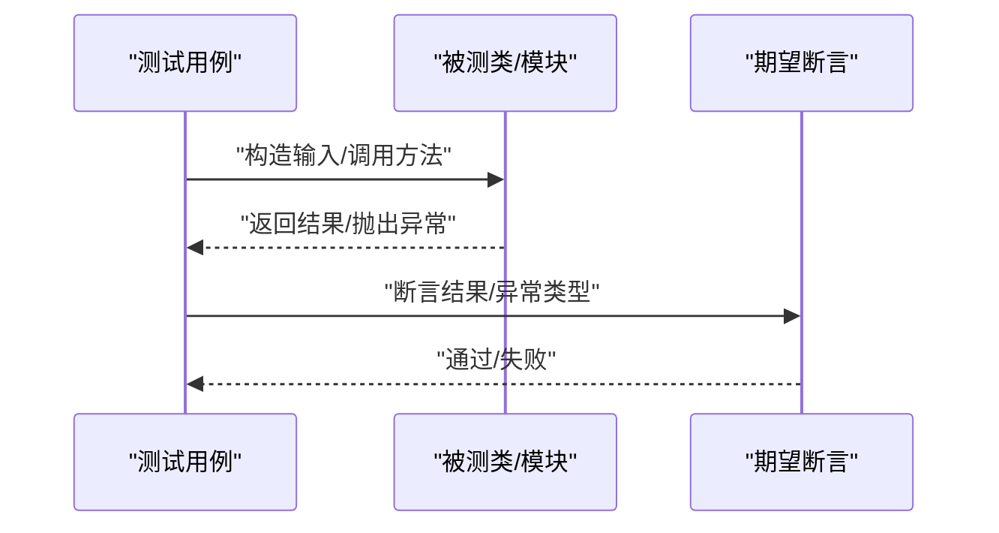
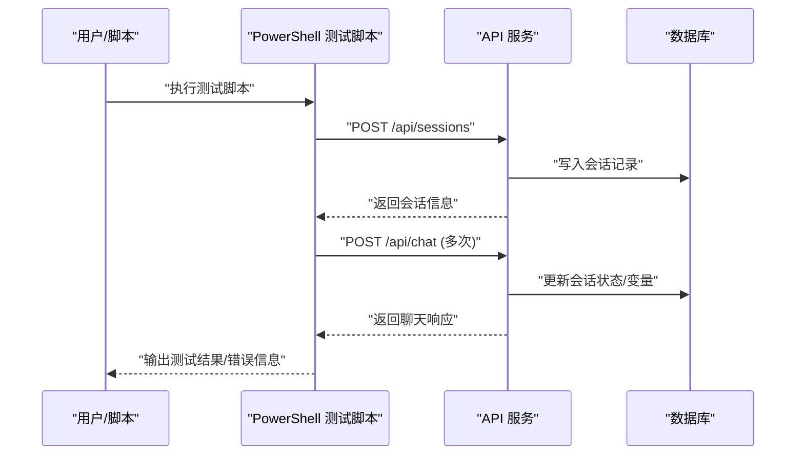
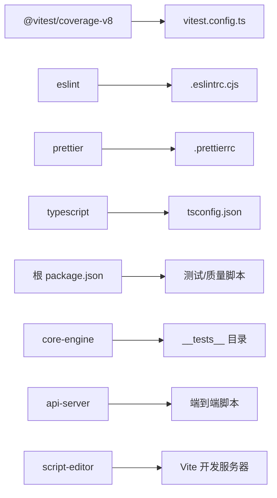

# 测试配置与工具

<cite>
**本文引用的文件**
- [vitest.config.ts](file://vitest.config.ts)
- [package.json](file://package.json)
- [.eslintrc.cjs](file://.eslintrc.cjs)
- [.prettierrc](file://.prettierrc)
- [packages/core-engine/src/domain/__tests__/script.test.ts](file://packages/core-engine/src/domain/__tests__/script.test.ts)
- [packages/core-engine/src/domain/__tests__/session.test.ts](file://packages/core-engine/src/domain/__tests__/session.test.ts)
- [packages/core-engine/src/engines/script-execution/__tests__/yaml-parser.test.ts](file://packages/core-engine/src/engines/script-execution/__tests__/yaml-parser.test.ts)
- [packages/api-server/test-api.ps1](file://packages/api-server/test-api.ps1)
- [QUICK_START_GUIDE.md](file://QUICK_START_GUIDE.md)
- [packages/api-server/drizzle.config.ts](file://packages/api-server/drizzle.config.ts)
- [packages/script-editor/vite.config.ts](file://packages/script-editor/vite.config.ts)
- [packages/core-engine/tsconfig.json](file://packages/core-engine/tsconfig.json)
</cite>

## 目录
1. [简介](#简介)
2. [项目结构](#项目结构)
3. [核心组件](#核心组件)
4. [架构总览](#架构总览)
5. [详细组件分析](#详细组件分析)
6. [依赖分析](#依赖分析)
7. [性能考虑](#性能考虑)
8. [故障排查指南](#故障排查指南)
9. [结论](#结论)
10. [附录](#附录)

## 简介
本指南面向 HeartRule AI 咨询引擎的测试配置与工具使用，聚焦 Vitest 测试框架在多包（monorepo）环境中的配置与实践，涵盖以下主题：
- Vitest 全局设置、环境配置与覆盖率报告生成
- 测试文件命名约定、目录结构组织与测试套件分组策略
- 测试工具链安装与配置：TypeScript 支持、ESLint 集成、Prettier 格式化
- 持续集成（CI）环境中的自动化测试流程建议
- 测试数据管理、Mock 服务配置与测试环境隔离最佳实践

## 项目结构
本项目采用 pnpm 工作区（pnpm-workspace）组织，核心测试相关结构如下：
- 根级测试配置：vitest.config.ts
- 根级脚本与工具链：package.json（含 lint/format/typecheck/test 等）
- 代码质量配置：.eslintrc.cjs、.prettierrc
- 单元测试示例：位于 packages/core-engine 下的 __tests__ 目录
- API 端到端测试脚本：packages/api-server/test-api.ps1
- 开发与测试辅助：QUICK_START_GUIDE.md 提供交互式测试指引

图表来源
- [package.json](file://package.json#L13-L32)
- [vitest.config.ts](file://vitest.config.ts#L1-L20)
- [packages/core-engine/src/domain/__tests__/script.test.ts](file://packages/core-engine/src/domain/__tests__/script.test.ts#L1-L60)
- [packages/api-server/test-api.ps1](file://packages/api-server/test-api.ps1#L1-L98)

章节来源
- [package.json](file://package.json#L1-L60)
- [vitest.config.ts](file://vitest.config.ts#L1-L20)

## 核心组件
- Vitest 配置与覆盖率
  - 全局启用：通过 globals: true 在测试文件内直接使用 describe、it、expect 等顶层 API，无需导入。
  - 运行环境：environment: 'node'，适合后端逻辑与纯 TypeScript 单元测试。
  - 覆盖率：provider: 'v8'，输出文本、JSON、HTML 报告；排除 node_modules、dist、类型声明、配置文件与 mockData 目录。
- 工具链与脚本
  - 测试命令：test、test:watch、test:coverage
  - 代码质量：lint、lint:fix、format、format:check、typecheck
  - husky 预提交钩子：prepare 安装
- ESLint 与 Prettier
  - ESLint 使用 TypeScript 解析器，扩展推荐规则与 import 规则，并集成 Prettier；忽略模式覆盖构建产物、配置文件与测试脚本等。
  - Prettier 采用单引号、尾随逗号、缩进宽度等统一风格。

章节来源
- [vitest.config.ts](file://vitest.config.ts#L3-L19)
- [package.json](file://package.json#L13-L32)
- [.eslintrc.cjs](file://.eslintrc.cjs#L1-L62)
- [.prettierrc](file://.prettierrc#L1-L11)

## 架构总览
下图展示测试工具链在项目中的角色与交互关系：

图表来源
- [vitest.config.ts](file://vitest.config.ts#L1-L20)
- [package.json](file://package.json#L13-L32)
- [.eslintrc.cjs](file://.eslintrc.cjs#L1-L62)
- [.prettierrc](file://.prettierrc#L1-L11)
- [packages/core-engine/tsconfig.json](file://packages/core-engine/tsconfig.json#L1-L11)
- [packages/script-editor/vite.config.ts](file://packages/script-editor/vite.config.ts#L1-L23)
- [packages/api-server/drizzle.config.ts](file://packages/api-server/drizzle.config.ts#L1-L16)

## 详细组件分析

### Vitest 配置与覆盖率
- 全局 API：启用 globals: true，减少测试文件导入开销，提升可读性。
- 运行环境：environment: 'node'，适配 Node 生态的纯逻辑测试。
- 覆盖率：
  - provider: 'v8'，基于 V8 引擎的内置覆盖率收集。
  - 报告器：['text', 'json', 'html']，便于本地查看与 CI 可视化。
  - 排除规则：node_modules、dist、类型声明、配置文件、mockData 等，避免污染覆盖率指标。
- 建议
  - 如需浏览器环境测试，可在需要时切换 environment 或新增别名配置。
  - 对于大型包，可考虑拆分测试任务以缩短 CI 时间。

章节来源
- [vitest.config.ts](file://vitest.config.ts#L3-L19)

### 测试文件命名约定与目录组织
- 命名约定
  - 使用 __tests__/ 文件夹存放测试文件，遵循 <目标模块>.test.ts 的命名。
  - 示例：script.test.ts、session.test.ts、yaml-parser.test.ts。
- 目录组织
  - 每个包内的 src 下按功能域划分目录，测试文件与被测模块同路径或同级 __tests__。
  - 示例：packages/core-engine/src/domain/__tests__/ 与 packages/core-engine/src/engines/script-execution/__tests__/。
- 测试套件分组策略
  - 使用 describe 对领域模型或功能模块进行分组，如“Script Domain Model”、“Session Domain Model”、“YAML Parser”。
  - 每个 describe 内部围绕单一职责进行多条断言，保持测试粒度清晰。

章节来源
- [packages/core-engine/src/domain/__tests__/script.test.ts](file://packages/core-engine/src/domain/__tests__/script.test.ts#L1-L60)
- [packages/core-engine/src/domain/__tests__/session.test.ts](file://packages/core-engine/src/domain/__tests__/session.test.ts#L1-L88)
- [packages/core-engine/src/engines/script-execution/__tests__/yaml-parser.test.ts](file://packages/core-engine/src/engines/script-execution/__tests__/yaml-parser.test.ts#L1-L92)

### 测试套件示例与断言策略
- Script 领域模型
  - 断言：创建、解析内容、发布、归档等状态转换。
- Session 领域模型
  - 断言：默认值、启动/暂停/恢复/完成、变量存取、序列化。
- YAML 解析器
  - 断言：合法 YAML 解析、非法 YAML 抛错、会话脚本与技术脚本模式校验。

图表来源
- [packages/core-engine/src/domain/__tests__/script.test.ts](file://packages/core-engine/src/domain/__tests__/script.test.ts#L6-L59)
- [packages/core-engine/src/domain/__tests__/session.test.ts](file://packages/core-engine/src/domain/__tests__/session.test.ts#L6-L87)
- [packages/core-engine/src/engines/script-execution/__tests__/yaml-parser.test.ts](file://packages/core-engine/src/engines/script-execution/__tests__/yaml-parser.test.ts#L5-L91)

章节来源
- [packages/core-engine/src/domain/__tests__/script.test.ts](file://packages/core-engine/src/domain/__tests__/script.test.ts#L1-L60)
- [packages/core-engine/src/domain/__tests__/session.test.ts](file://packages/core-engine/src/domain/__tests__/session.test.ts#L1-L88)
- [packages/core-engine/src/engines/script-execution/__tests__/yaml-parser.test.ts](file://packages/core-engine/src/engines/script-execution/__tests__/yaml-parser.test.ts#L1-L92)

### API 端到端测试脚本
- PowerShell 脚本
  - 自动化创建会话、发送消息、验证响应字段（如 sessionId、status、executionStatus、extractedVariables）。
  - 包含错误处理与前置条件提示（服务运行、数据库、脚本导入）。
- CLI 与交互式测试
  - QUICK_START_GUIDE.md 提供 curl 与 PowerShell 两种方式创建会话与发送消息的示例，便于手动验证。

图表来源
- [packages/api-server/test-api.ps1](file://packages/api-server/test-api.ps1#L1-L98)
- [QUICK_START_GUIDE.md](file://QUICK_START_GUIDE.md#L102-L167)

章节来源
- [packages/api-server/test-api.ps1](file://packages/api-server/test-api.ps1#L1-L98)
- [QUICK_START_GUIDE.md](file://QUICK_START_GUIDE.md#L102-L167)

### 工具链安装与配置
- 安装与初始化
  - 使用 pnpm 管理工作区依赖，确保 Node 版本满足要求。
  - 初始化 Husky 预提交钩子：prepare 脚本会安装 hooks。
- TypeScript 支持
  - 各包拥有独立 tsconfig.json，继承根 tsconfig 并指定 rootDir/outDir。
  - 类型检查：通过 typecheck 脚本执行 tsc --noEmit。
- ESLint 集成
  - 解析器与规则：@typescript-eslint/parser、推荐规则、import 规则、prettier 集成。
  - 忽略模式：构建产物、配置文件、drizzle 目录与 test-*.ts。
- Prettier 格式化
  - 统一风格：单引号、尾随逗号、缩进宽度等。
  - 校验与写入：format 与 format:check 脚本。

章节来源
- [package.json](file://package.json#L8-L32)
- [.eslintrc.cjs](file://.eslintrc.cjs#L1-L62)
- [.prettierrc](file://.prettierrc#L1-L11)
- [packages/core-engine/tsconfig.json](file://packages/core-engine/tsconfig.json#L1-L11)

### 测试数据管理、Mock 与环境隔离
- 测试数据管理
  - 将测试专用数据放入 __tests__ 同级目录或包内专用目录，避免污染源码。
  - 对于外部依赖（如数据库），优先使用内存数据库或容器化数据库，保证可重复性。
- Mock 服务配置
  - 对外部服务（如 LLM Provider）建议通过接口抽象与工厂注入实现可替换 Mock。
  - 在 Vitest 中可通过 vi.mock 或自定义工厂函数注入假实现。
- 环境隔离
  - 使用独立的 .env.test 或环境变量前缀区分测试环境。
  - 数据库迁移与清理：drizzle 配置指向独立连接串，测试前后执行迁移与回滚。
  - 前端代理：开发期使用 Vite 代理，测试期可替换为本地 Mock 服务。

章节来源
- [packages/api-server/drizzle.config.ts](file://packages/api-server/drizzle.config.ts#L1-L16)
- [packages/script-editor/vite.config.ts](file://packages/script-editor/vite.config.ts#L1-L23)

## 依赖分析
- 包间耦合
  - core-engine 作为核心逻辑包，被 api-server 与 script-editor 间接依赖。
  - shared-types 为跨包共享类型，降低耦合度。
- 外部依赖
  - Vitest 与 @vitest/coverage-v8：测试与覆盖率。
  - ESLint 生态：@typescript-eslint、eslint-plugin-import、eslint-config-prettier。
  - Prettier：统一格式化。
- 脚本与任务
  - 根级脚本统一调度各包任务，便于在 CI 中并行执行。

图表来源
- [package.json](file://package.json#L33-L58)
- [vitest.config.ts](file://vitest.config.ts#L1-L20)
- [.eslintrc.cjs](file://.eslintrc.cjs#L1-L62)
- [.prettierrc](file://.prettierrc#L1-L11)
- [packages/core-engine/tsconfig.json](file://packages/core-engine/tsconfig.json#L1-L11)

章节来源
- [package.json](file://package.json#L33-L58)

## 性能考虑
- 测试并发与分包
  - 在 CI 中对不同包并行执行测试，缩短总耗时。
- 覆盖率范围控制
  - 通过 exclude 精准控制不纳入覆盖率统计的目录，避免噪声。
- 类型检查与格式化
  - 将 typecheck、format:check 与 lint:fix 作为预提交检查，减少 CI 失败概率。

## 故障排查指南
- 测试无法运行或找不到模块
  - 确认已安装依赖并使用 pnpm 工作区启动测试。
  - 检查 tsconfig 继承与 rootDir/outDir 设置是否正确。
- 覆盖率报告缺失
  - 确保使用 test:coverage 或 vitest run --coverage。
  - 检查 exclude 是否误排除了目标文件。
- ESLint/Prettier 冲突
  - 使用 lint:fix 与 format:check 修复冲突；确认 .eslintrc.cjs 的 ignorePatterns 未误伤测试文件。
- API 测试失败
  - 确认服务已在本地运行（端口 8000）、数据库已启动、脚本已导入。
  - 使用 QUICK_START_GUIDE.md 提供的 curl/PowerShell 示例进行手动验证。

章节来源
- [package.json](file://package.json#L13-L32)
- [vitest.config.ts](file://vitest.config.ts#L7-L19)
- [.eslintrc.cjs](file://.eslintrc.cjs#L51-L61)
- [packages/api-server/test-api.ps1](file://packages/api-server/test-api.ps1#L91-L98)
- [QUICK_START_GUIDE.md](file://QUICK_START_GUIDE.md#L102-L167)

## 结论
本指南系统梳理了 HeartRule 项目的测试配置与工具链，明确了 Vitest 在 monorepo 中的使用方式、测试文件组织与断言策略，并提供了工具链安装、代码质量保障与端到端测试脚本的使用方法。结合覆盖率报告与 CI 流程，可有效提升测试效率与代码质量。

## 附录
- 常用命令速查
  - 运行测试：pnpm test
  - 监听测试：pnpm test:watch
  - 生成覆盖率：pnpm test:coverage
  - 代码检查：pnpm lint / pnpm lint:fix
  - 格式化：pnpm format / pnpm format:check
  - 类型检查：pnpm typecheck
  - 初始化 Husky：pnpm prepare