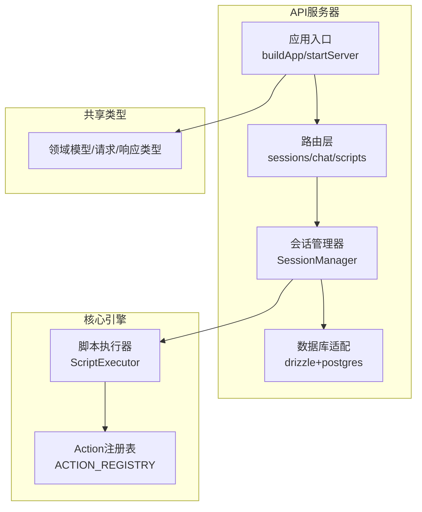
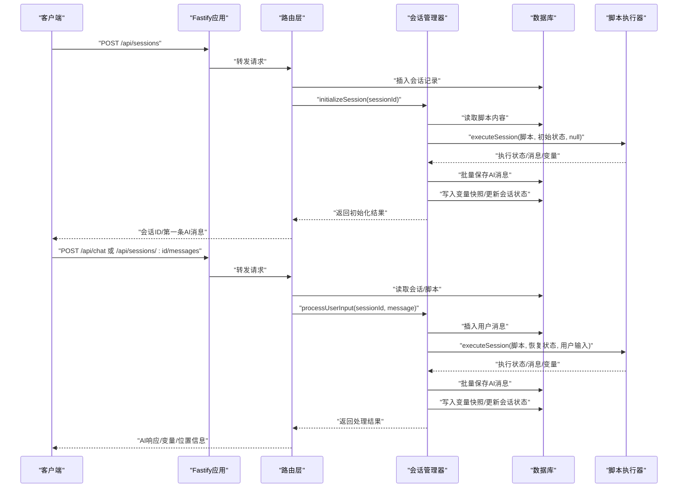
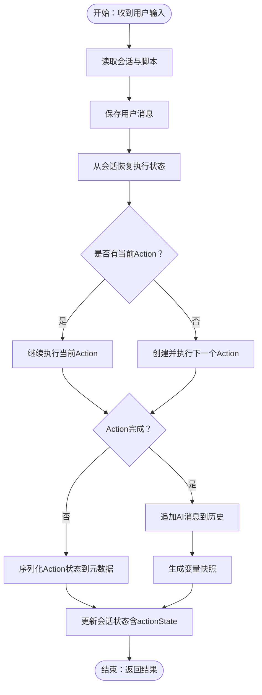
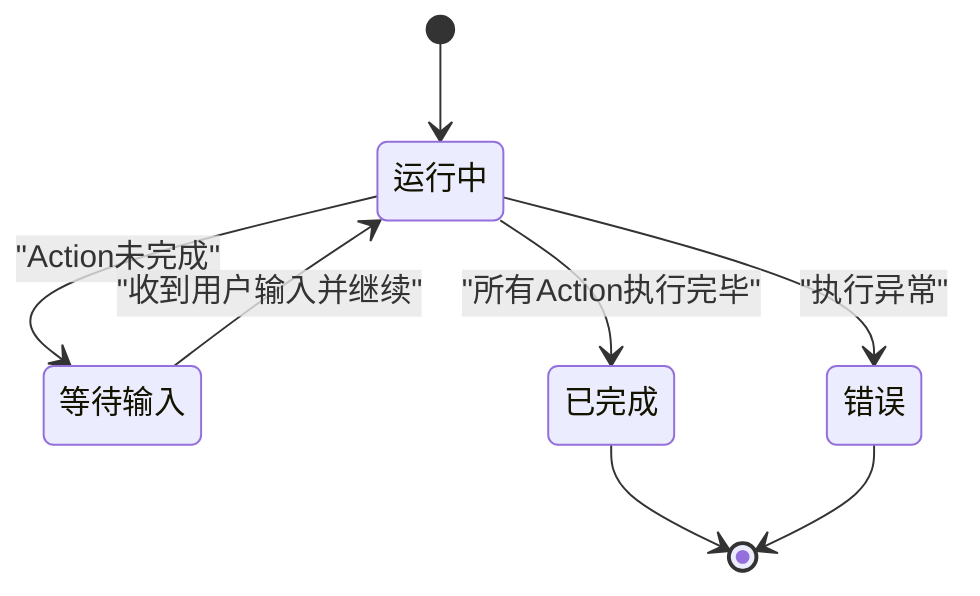
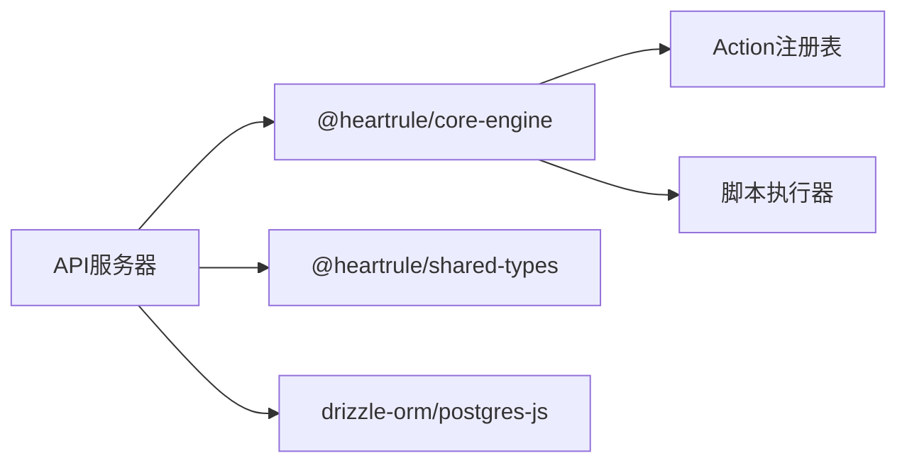

# 集成测试

<cite>
**本文引用的文件**
- [packages/api-server/src/app.ts](file://packages/api-server/src/app.ts)
- [packages/api-server/src/db/index.ts](file://packages/api-server/src/db/index.ts)
- [packages/api-server/src/services/session-manager.ts](file://packages/api-server/src/services/session-manager.ts)
- [packages/api-server/src/routes/sessions.ts](file://packages/api-server/src/routes/sessions.ts)
- [packages/api-server/src/routes/chat.ts](file://packages/api-server/src/routes/chat.ts)
- [packages/api-server/src/routes/scripts.ts](file://packages/api-server/src/routes/scripts.ts)
- [packages/core-engine/src/index.ts](file://packages/core-engine/src/index.ts)
- [packages/core-engine/src/engines/script-execution/script-executor.ts](file://packages/core-engine/src/engines/script-execution/script-execution/script-executor.ts)
- [packages/core-engine/src/actions/action-registry.ts](file://packages/core-engine/src/actions/action-registry.ts)
- [packages/shared-types/src/index.ts](file://packages/shared-types/src/index.ts)
- [vitest.config.ts](file://vitest.config.ts)
- [packages/api-server/test-full-flow.ts](file://packages/api-server/test-full-flow.ts)
- [packages/api-server/test-session-flow.ts](file://packages/api-server/test-session-flow.ts)
</cite>

## 目录
1. [简介](#简介)
2. [项目结构](#项目结构)
3. [核心组件](#核心组件)
4. [架构总览](#架构总览)
5. [详细组件分析](#详细组件分析)
6. [依赖关系分析](#依赖关系分析)
7. [性能考虑](#性能考虑)
8. [故障排查指南](#故障排查指南)
9. [结论](#结论)
10. [附录](#附录)

## 简介
本指南面向HeartRule AI咨询引擎的集成测试，目标是系统性地验证API服务器与数据库、脚本执行引擎（Action系统）、以及未来可能接入的LLM服务之间的端到端协作能力。重点覆盖：
- 会话管理、聊天交互与脚本执行的完整流程
- Action系统的执行流程、状态转换与错误恢复
- WebSocket通信的集成测试策略（概念性说明）
- 测试环境配置、数据库种子数据准备与外部服务模拟
- 性能与并发测试的实施建议

## 项目结构
该仓库采用多包（monorepo）结构，核心与API服务分离，便于独立演进与测试隔离。API服务器负责HTTP路由、数据库访问与会话编排；核心引擎负责脚本解析与Action执行；共享类型提供跨包的类型与枚举。

图表来源
- [packages/api-server/src/app.ts](file://packages/api-server/src/app.ts#L21-L105)
- [packages/api-server/src/routes/sessions.ts](file://packages/api-server/src/routes/sessions.ts#L13-L133)
- [packages/api-server/src/services/session-manager.ts](file://packages/api-server/src/services/session-manager.ts#L21-L26)
- [packages/core-engine/src/engines/script-execution/script-executor.ts](file://packages/core-engine/src/engines/script-execution/script-executor.ts#L62-L216)
- [packages/core-engine/src/actions/action-registry.ts](file://packages/core-engine/src/actions/action-registry.ts#L17-L45)
- [packages/shared-types/src/index.ts](file://packages/shared-types/src/index.ts#L7-L18)

章节来源
- [packages/api-server/src/app.ts](file://packages/api-server/src/app.ts#L1-L135)
- [packages/api-server/src/db/index.ts](file://packages/api-server/src/db/index.ts#L1-L26)
- [packages/api-server/src/routes/sessions.ts](file://packages/api-server/src/routes/sessions.ts#L1-L548)
- [packages/api-server/src/routes/chat.ts](file://packages/api-server/src/routes/chat.ts#L1-L152)
- [packages/api-server/src/routes/scripts.ts](file://packages/api-server/src/routes/scripts.ts#L1-L325)
- [packages/core-engine/src/index.ts](file://packages/core-engine/src/index.ts#L1-L27)
- [packages/shared-types/src/index.ts](file://packages/shared-types/src/index.ts#L1-L19)

## 核心组件
- 应用与路由
  - 应用入口负责插件注册（CORS、Swagger、WebSocket）、根路径与健康检查、以及路由挂载。
  - 路由层提供会话、聊天、脚本管理等REST接口，并进行Schema校验。
- 数据库与会话管理
  - 数据库适配使用Drizzle ORM + Postgres，提供连接、查询与迁移工具。
  - 会话管理器封装脚本执行、消息持久化、变量快照与位置信息更新。
- 脚本执行引擎与Action系统
  - 执行器负责遍历Phase/Topic/Action，驱动Action执行并维护执行状态。
  - Action注册表集中管理Action类型映射，支持扩展。

章节来源
- [packages/api-server/src/app.ts](file://packages/api-server/src/app.ts#L21-L105)
- [packages/api-server/src/db/index.ts](file://packages/api-server/src/db/index.ts#L10-L25)
- [packages/api-server/src/services/session-manager.ts](file://packages/api-server/src/services/session-manager.ts#L21-L466)
- [packages/core-engine/src/engines/script-execution/script-executor.ts](file://packages/core-engine/src/engines/script-execution/script-executor.ts#L62-L519)
- [packages/core-engine/src/actions/action-registry.ts](file://packages/core-engine/src/actions/action-registry.ts#L17-L45)

## 架构总览
下图展示了从HTTP请求到数据库与脚本执行引擎的端到端调用链路，以及Action状态在执行器与数据库之间的持久化与恢复。

图表来源
- [packages/api-server/src/app.ts](file://packages/api-server/src/app.ts#L91-L102)
- [packages/api-server/src/routes/sessions.ts](file://packages/api-server/src/routes/sessions.ts#L55-L133)
- [packages/api-server/src/routes/chat.ts](file://packages/api-server/src/routes/chat.ts#L44-L79)
- [packages/api-server/src/services/session-manager.ts](file://packages/api-server/src/services/session-manager.ts#L73-L255)
- [packages/core-engine/src/engines/script-execution/script-executor.ts](file://packages/core-engine/src/engines/script-execution/script-executor.ts#L66-L216)

## 详细组件分析

### 会话管理与脚本执行集成
- 初始化会话
  - 路由创建会话并持久化，随后调用会话管理器进行脚本初始化执行，保存AI消息、变量快照并更新会话状态。
- 处理用户输入
  - 路由读取会话与脚本，保存用户消息，恢复执行状态并执行脚本，再保存AI消息、变量快照并更新会话状态。
- Action状态持久化与恢复
  - 执行器在Action未完成时将Action内部状态序列化至元数据；会话管理器在数据库中保存该状态，后续恢复时反序列化继续执行。

图表来源
- [packages/api-server/src/services/session-manager.ts](file://packages/api-server/src/services/session-manager.ts#L257-L464)
- [packages/core-engine/src/engines/script-execution/script-executor.ts](file://packages/core-engine/src/engines/script-execution/script-executor.ts#L86-L158)

章节来源
- [packages/api-server/src/routes/sessions.ts](file://packages/api-server/src/routes/sessions.ts#L55-L133)
- [packages/api-server/src/routes/chat.ts](file://packages/api-server/src/routes/chat.ts#L44-L79)
- [packages/api-server/src/services/session-manager.ts](file://packages/api-server/src/services/session-manager.ts#L73-L255)
- [packages/core-engine/src/engines/script-execution/script-executor.ts](file://packages/core-engine/src/engines/script-execution/script-executor.ts#L481-L519)

### Action系统执行流程与状态转换
- 执行状态枚举
  - RUNNING、WAITING_INPUT、PAUSED、COMPLETED、ERROR，贯穿整个执行生命周期。
- 状态转换
  - Action未完成：进入WAITING_INPUT并序列化Action内部状态；完成后推进到下一Action或Topic/Phase。
- 错误恢复
  - 执行器捕获异常并标记ERROR，同时保留错误上下文，便于上层路由包装为详细错误响应。

图表来源
- [packages/core-engine/src/engines/script-execution/script-executor.ts](file://packages/core-engine/src/engines/script-execution/script-executor.ts#L15-L21)
- [packages/core-engine/src/engines/script-execution/script-executor.ts](file://packages/core-engine/src/engines/script-execution/script-executor.ts#L131-L134)

章节来源
- [packages/core-engine/src/engines/script-execution/script-executor.ts](file://packages/core-engine/src/engines/script-execution/script-executor.ts#L15-L21)
- [packages/core-engine/src/engines/script-execution/script-executor.ts](file://packages/core-engine/src/engines/script-execution/script-executor.ts#L160-L216)

### WebSocket通信集成测试（概念性）
- 插件与选项
  - 应用已注册WebSocket插件并配置最大负载，可用于实时聊天场景。
- 测试要点（概念性）
  - 连接建立、消息收发、断线重连、广播/私聊通道、心跳检测、消息去重与顺序保证。
  - 建议结合路由层的聊天接口进行端到端验证，确保消息持久化与执行状态一致。

章节来源
- [packages/api-server/src/app.ts](file://packages/api-server/src/app.ts#L65-L70)

## 依赖关系分析
- 包间依赖
  - API服务器依赖核心引擎（脚本执行）与共享类型（领域模型与API类型），并通过Drizzle访问数据库。
  - 核心引擎导出Action基类、注册表与执行器，供API服务器调用。
- 关键耦合点
  - 会话管理器与执行器之间通过ExecutionState传递状态；执行器与Action注册表解耦，便于扩展新Action类型。
  - 路由层与会话管理器通过数据库Schema进行契约约束，确保一致性。

图表来源
- [packages/api-server/src/app.ts](file://packages/api-server/src/app.ts#L92-L102)
- [packages/core-engine/src/index.ts](file://packages/core-engine/src/index.ts#L19-L27)
- [packages/shared-types/src/index.ts](file://packages/shared-types/src/index.ts#L7-L18)

章节来源
- [packages/api-server/src/app.ts](file://packages/api-server/src/app.ts#L91-L102)
- [packages/core-engine/src/index.ts](file://packages/core-engine/src/index.ts#L1-L27)
- [packages/shared-types/src/index.ts](file://packages/shared-types/src/index.ts#L1-L19)

## 性能考虑
- 并发与限流
  - 在路由层对高频接口增加速率限制，避免数据库与执行器过载。
- 数据库优化
  - 为会话、消息、变量表建立必要索引（如sessionId、时间戳），减少查询延迟。
  - 使用批量插入（如保存AI消息）降低往返次数。
- 执行器优化
  - 控制Action轮次上限，避免长时间阻塞；对长耗时Action引入超时与中间态持久化。
- 监控与告警
  - 记录执行器状态转换与Action耗时指标，结合日志聚合进行性能分析。

## 故障排查指南
- 常见错误与定位
  - 会话不存在：路由层返回404，检查会话ID与脚本关联。
  - 脚本解析失败：路由层记录警告并存储空解析结果，需检查YAML格式。
  - 执行器错误：捕获异常并标记ERROR，查看metadata.error与lastLLMDebugInfo。
- 日志与追踪
  - 应用入口启用日志级别控制；路由与会话管理器均输出关键事件与状态。
- 错误响应
  - 路由层统一包装错误响应，包含上下文与恢复建议，便于前端展示与重试。

章节来源
- [packages/api-server/src/routes/sessions.ts](file://packages/api-server/src/routes/sessions.ts#L64-L74)
- [packages/api-server/src/routes/scripts.ts](file://packages/api-server/src/routes/scripts.ts#L50-L55)
- [packages/api-server/src/services/session-manager.ts](file://packages/api-server/src/services/session-manager.ts#L237-L254)

## 结论
本指南提供了从API到数据库与脚本执行引擎的完整集成测试策略，重点覆盖会话生命周期、Action状态持久化与恢复、以及错误处理。建议在CI中结合Vitest进行单元与集成测试，并配合端到端脚本（如提供的CLI测试）验证真实业务流程。

## 附录

### 测试环境配置与数据库种子
- 环境变量
  - DATABASE_URL：Postgres连接串；API_PORT/API_HOST：服务器监听端口与主机。
- 数据库初始化
  - 使用Drizzle迁移工具初始化模式；通过CLI脚本导入示例脚本（如抑郁评估脚本）作为种子数据。
- 测试运行
  - 使用Vitest配置全局测试环境与覆盖率报告；可直接运行CLI测试脚本验证端到端流程。

章节来源
- [packages/api-server/src/db/index.ts](file://packages/api-server/src/db/index.ts#L10-L14)
- [vitest.config.ts](file://vitest.config.ts#L4-L18)
- [packages/api-server/test-full-flow.ts](file://packages/api-server/test-full-flow.ts#L13-L31)
- [packages/api-server/test-session-flow.ts](file://packages/api-server/test-session-flow.ts#L18-L23)

### 端到端测试用例示例（步骤化）
- 场景一：完整会话流程（Web端模拟）
  - 准备：确认脚本存在；创建会话；初始化会话获取第一条AI消息；多轮对话直至推进执行位置；验证变量提取与消息历史。
  - 断言：执行位置推进、变量user_name与user_age存在、消息历史包含用户与AI消息。
- 场景二：Action状态持久化与恢复
  - 准备：读取脚本；首次执行至WAITING_INPUT；模拟保存状态；恢复状态并传入用户输入；验证进入下一Action且AI消息正确。

章节来源
- [packages/api-server/test-full-flow.ts](file://packages/api-server/test-full-flow.ts#L16-L207)
- [packages/api-server/test-session-flow.ts](file://packages/api-server/test-session-flow.ts#L13-L139)

### Action系统扩展与测试
- 新增Action类型
  - 在Action注册表中注册新类型映射；在路由层或执行器中根据需要扩展执行逻辑。
- 测试建议
  - 单元测试覆盖Action执行边界条件；集成测试验证Action与执行器状态转换；端到端测试验证与数据库的持久化/恢复。

章节来源
- [packages/core-engine/src/actions/action-registry.ts](file://packages/core-engine/src/actions/action-registry.ts#L17-L45)
- [packages/core-engine/src/engines/script-execution/script-executor.ts](file://packages/core-engine/src/engines/script-execution/script-executor.ts#L461-L476)