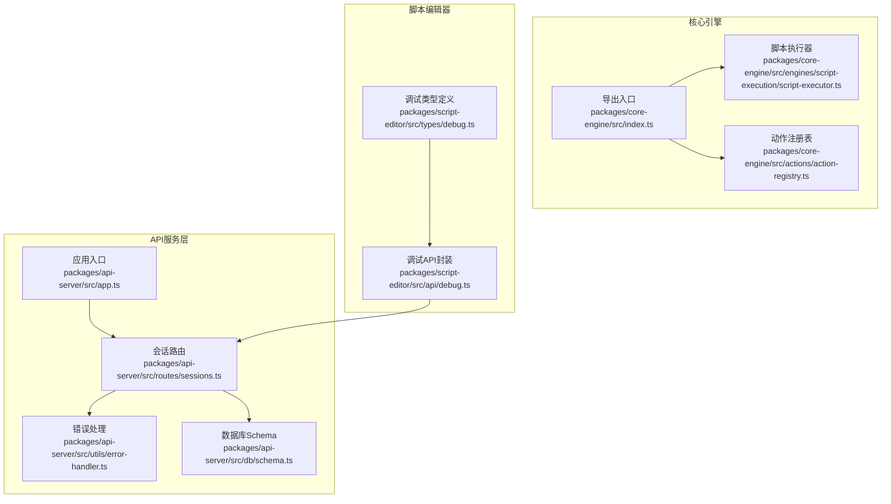
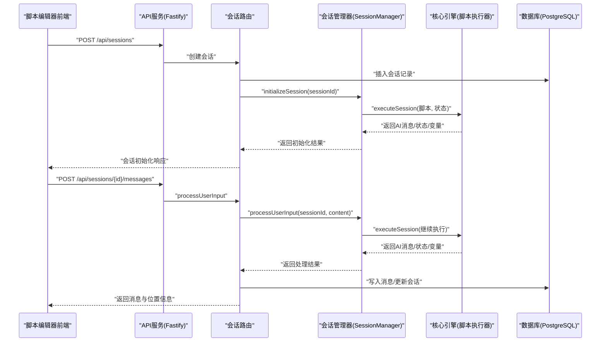
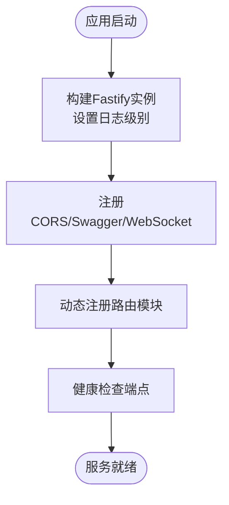
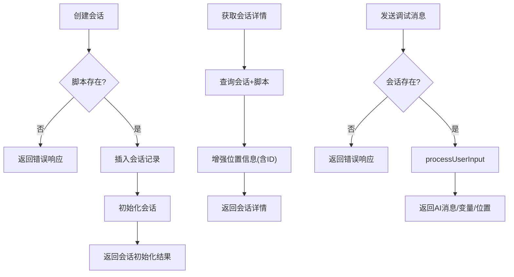
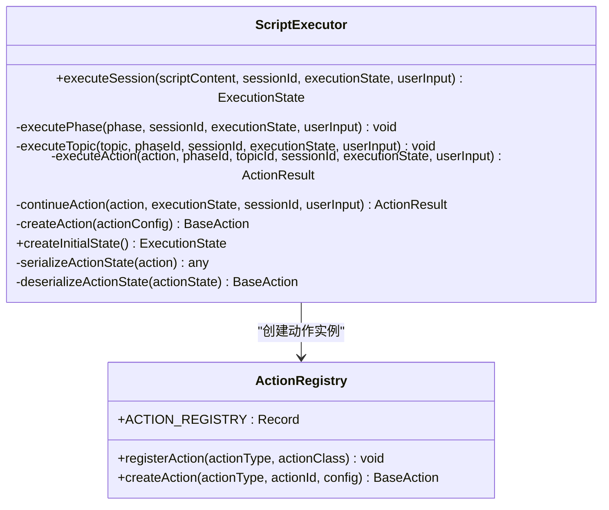
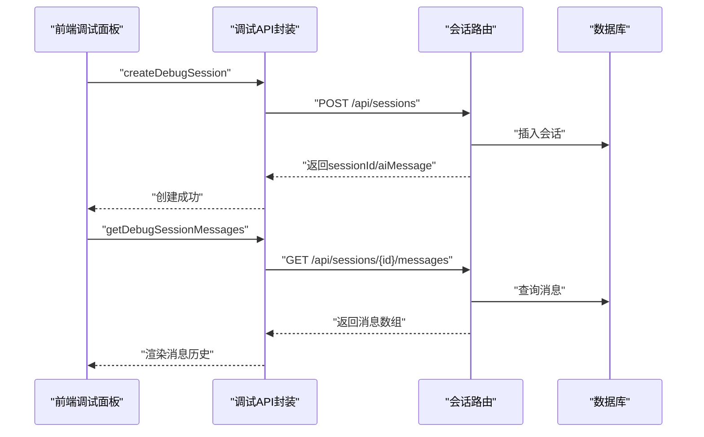
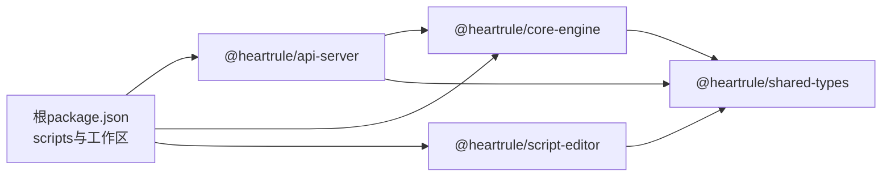

# 调试与性能优化

<cite>
**本文引用的文件**
- [packages/api-server/src/app.ts](file://packages/api-server/src/app.ts)
- [packages/api-server/src/utils/error-handler.ts](file://packages/api-server/src/utils/error-handler.ts)
- [packages/api-server/src/routes/sessions.ts](file://packages/api-server/src/routes/sessions.ts)
- [packages/api-server/src/db/schema.ts](file://packages/api-server/src/db/schema.ts)
- [.env](file://.env)
- [packages/core-engine/src/index.ts](file://packages/core-engine/src/index.ts)
- [packages/core-engine/src/engines/script-execution/script-executor.ts](file://packages/core-engine/src/engines/script-execution/script-executor.ts)
- [packages/core-engine/src/actions/action-registry.ts](file://packages/core-engine/src/actions/action-registry.ts)
- [packages/script-editor/src/api/debug.ts](file://packages/script-editor/src/api/debug.ts)
- [packages/script-editor/src/types/debug.ts](file://packages/script-editor/src/types/debug.ts)
- [package.json](file://package.json)
- [packages/api-server/package.json](file://packages/api-server/package.json)
- [packages/core-engine/package.json](file://packages/core-engine/package.json)
- [packages/script-editor/package.json](file://packages/script-editor/package.json)
</cite>

## 目录
1. [简介](#简介)
2. [项目结构](#项目结构)
3. [核心组件](#核心组件)
4. [架构总览](#架构总览)
5. [详细组件分析](#详细组件分析)
6. [依赖关系分析](#依赖关系分析)
7. [性能考量](#性能考量)
8. [故障排查指南](#故障排查指南)
9. [结论](#结论)
10. [附录](#附录)

## 简介
本指南面向HeartRule AI咨询引擎的开发者与运维人员，聚焦于调试与性能优化。内容涵盖：
- VSCode调试配置与断点/变量监视技巧
- 日志系统使用与错误追踪策略
- 性能分析工具与数据库查询优化
- 常见问题诊断流程（类型错误、数据库连接、LLM调用异常）
- 实战场景与最佳实践
- 代码优化、缓存与资源管理建议

## 项目结构
项目采用monorepo结构，核心模块包括：
- API服务层（Fastify）：负责路由、会话管理、消息持久化与错误统一处理
- 核心引擎（Core Engine）：脚本执行、动作编排、变量提取与记忆管理
- 脚本编辑器（Script Editor）：调试面板、消息与变量可视化、过滤器
- 共享类型（Shared Types）：前后端一致的数据契约
- 数据库（PostgreSQL + Drizzle ORM）：会话、消息、脚本、变量、记忆等

图表来源
- [packages/api-server/src/app.ts](file://packages/api-server/src/app.ts#L21-L105)
- [packages/api-server/src/routes/sessions.ts](file://packages/api-server/src/routes/sessions.ts#L13-L102)
- [packages/api-server/src/utils/error-handler.ts](file://packages/api-server/src/utils/error-handler.ts#L95-L232)
- [packages/api-server/src/db/schema.ts](file://packages/api-server/src/db/schema.ts#L22-L81)
- [packages/core-engine/src/index.ts](file://packages/core-engine/src/index.ts#L8-L27)
- [packages/core-engine/src/engines/script-execution/script-executor.ts](file://packages/core-engine/src/engines/script-execution/script-executor.ts#L62-L216)
- [packages/core-engine/src/actions/action-registry.ts](file://packages/core-engine/src/actions/action-registry.ts#L35-L45)
- [packages/script-editor/src/api/debug.ts](file://packages/script-editor/src/api/debug.ts#L67-L133)
- [packages/script-editor/src/types/debug.ts](file://packages/script-editor/src/types/debug.ts#L185-L189)

章节来源
- [packages/api-server/src/app.ts](file://packages/api-server/src/app.ts#L1-L135)
- [packages/api-server/src/routes/sessions.ts](file://packages/api-server/src/routes/sessions.ts#L1-L548)
- [packages/api-server/src/utils/error-handler.ts](file://packages/api-server/src/utils/error-handler.ts#L1-L233)
- [packages/api-server/src/db/schema.ts](file://packages/api-server/src/db/schema.ts#L1-L219)
- [packages/core-engine/src/index.ts](file://packages/core-engine/src/index.ts#L1-L27)
- [packages/core-engine/src/engines/script-execution/script-executor.ts](file://packages/core-engine/src/engines/script-execution/script-executor.ts#L1-L519)
- [packages/core-engine/src/actions/action-registry.ts](file://packages/core-engine/src/actions/action-registry.ts#L1-L46)
- [packages/script-editor/src/api/debug.ts](file://packages/script-editor/src/api/debug.ts#L1-L134)
- [packages/script-editor/src/types/debug.ts](file://packages/script-editor/src/types/debug.ts#L1-L189)

## 核心组件
- 应用与日志：Fastify应用创建、CORS/Swagger/WebSocket注册、健康检查、日志级别由环境变量控制
- 会话与消息：会话创建、初始化、消息历史查询、调试消息发送；统一错误映射与恢复建议
- 错误处理：按错误消息关键字匹配错误类型，生成带上下文的详细错误响应
- 数据库Schema：会话、消息、脚本、变量、记忆等表结构与索引
- 脚本执行器：脚本解析、阶段/主题/动作遍历、等待输入状态、变量与对话历史更新
- 动作注册表：根据action_type创建具体动作实例
- 调试API与类型：前端调试会话、消息、变量、过滤器配置

章节来源
- [packages/api-server/src/app.ts](file://packages/api-server/src/app.ts#L21-L105)
- [packages/api-server/src/routes/sessions.ts](file://packages/api-server/src/routes/sessions.ts#L13-L133)
- [packages/api-server/src/utils/error-handler.ts](file://packages/api-server/src/utils/error-handler.ts#L95-L232)
- [packages/api-server/src/db/schema.ts](file://packages/api-server/src/db/schema.ts#L22-L81)
- [packages/core-engine/src/engines/script-execution/script-executor.ts](file://packages/core-engine/src/engines/script-execution/script-executor.ts#L62-L216)
- [packages/core-engine/src/actions/action-registry.ts](file://packages/core-engine/src/actions/action-registry.ts#L35-L45)
- [packages/script-editor/src/api/debug.ts](file://packages/script-editor/src/api/debug.ts#L67-L133)
- [packages/script-editor/src/types/debug.ts](file://packages/script-editor/src/types/debug.ts#L185-L189)

## 架构总览
下图展示了从脚本编辑器发起调试请求，经API服务到核心引擎执行，再到数据库持久化的完整链路。

图表来源
- [packages/api-server/src/routes/sessions.ts](file://packages/api-server/src/routes/sessions.ts#L15-L133)
- [packages/api-server/src/routes/sessions.ts](file://packages/api-server/src/routes/sessions.ts#L403-L471)
- [packages/core-engine/src/engines/script-execution/script-executor.ts](file://packages/core-engine/src/engines/script-execution/script-executor.ts#L66-L216)
- [packages/api-server/src/db/schema.ts](file://packages/api-server/src/db/schema.ts#L22-L58)

## 详细组件分析

### 组件A：API服务与日志系统
- 应用启动：创建Fastify实例，设置日志级别（默认来自环境变量），注册CORS、Swagger、WebSocket
- 健康检查：返回服务状态、时间戳、运行时长
- 路由注册：延迟加载各模块，减少启动开销
- 日志使用：在关键路径记录结构化日志，便于追踪与审计

图表来源
- [packages/api-server/src/app.ts](file://packages/api-server/src/app.ts#L21-L105)
- [packages/api-server/src/app.ts](file://packages/api-server/src/app.ts#L110-L135)

章节来源
- [packages/api-server/src/app.ts](file://packages/api-server/src/app.ts#L21-L135)
- [.env](file://.env#L31-L32)

### 组件B：会话路由与错误处理
- 会话创建：校验脚本存在性，写入会话表，初始化会话并返回AI消息与执行状态
- 会话详情：增强位置信息（含ID字段），注入脚本解析内容到元数据
- 消息历史：按时间排序返回消息列表
- 调试消息：处理用户输入，调用会话管理器，返回AI消息、变量与位置信息
- 错误处理：统一错误映射、恢复建议与上下文信息，结构化日志记录

图表来源
- [packages/api-server/src/routes/sessions.ts](file://packages/api-server/src/routes/sessions.ts#L15-L133)
- [packages/api-server/src/routes/sessions.ts](file://packages/api-server/src/routes/sessions.ts#L135-L246)
- [packages/api-server/src/routes/sessions.ts](file://packages/api-server/src/routes/sessions.ts#L248-L317)
- [packages/api-server/src/routes/sessions.ts](file://packages/api-server/src/routes/sessions.ts#L319-L471)

章节来源
- [packages/api-server/src/routes/sessions.ts](file://packages/api-server/src/routes/sessions.ts#L13-L548)
- [packages/api-server/src/utils/error-handler.ts](file://packages/api-server/src/utils/error-handler.ts#L95-L232)

### 组件C：核心引擎与脚本执行
- 执行状态：running/waiting_input/paused/completed/error
- 执行位置：phase/topic/action三元索引，支持扩展ID
- 执行流程：解析脚本 → 遍历阶段/主题/动作 → 执行动作 → 更新变量与对话历史 → 处理等待输入/错误
- 动作创建：通过注册表按action_type创建实例，支持序列化/反序列化动作内部状态

图表来源
- [packages/core-engine/src/engines/script-execution/script-executor.ts](file://packages/core-engine/src/engines/script-execution/script-executor.ts#L62-L519)
- [packages/core-engine/src/actions/action-registry.ts](file://packages/core-engine/src/actions/action-registry.ts#L17-L45)

章节来源
- [packages/core-engine/src/engines/script-execution/script-executor.ts](file://packages/core-engine/src/engines/script-execution/script-executor.ts#L1-L519)
- [packages/core-engine/src/actions/action-registry.ts](file://packages/core-engine/src/actions/action-registry.ts#L1-L46)
- [packages/core-engine/src/index.ts](file://packages/core-engine/src/index.ts#L1-L27)

### 组件D：调试API与前端类型
- 调试API：创建会话、获取会话详情、消息历史、发送调试消息、导入脚本
- 调试类型：气泡类型、过滤器、位置信息、变量状态、执行日志等
- 前端通过API与后端交互，后端在关键路径记录结构化日志，便于定位问题

图表来源
- [packages/script-editor/src/api/debug.ts](file://packages/script-editor/src/api/debug.ts#L67-L133)
- [packages/api-server/src/routes/sessions.ts](file://packages/api-server/src/routes/sessions.ts#L248-L317)

章节来源
- [packages/script-editor/src/api/debug.ts](file://packages/script-editor/src/api/debug.ts#L1-L134)
- [packages/script-editor/src/types/debug.ts](file://packages/script-editor/src/types/debug.ts#L1-L189)

## 依赖关系分析
- monorepo工作区：根脚本统一管理开发、测试、构建与数据库迁移
- API服务依赖核心引擎与共享类型，使用dotenv加载环境变量
- 核心引擎依赖共享类型、AI SDK与YAML解析库
- 脚本编辑器依赖共享类型与React生态

图表来源
- [package.json](file://package.json#L13-L31)
- [packages/api-server/package.json](file://packages/api-server/package.json#L20-L34)
- [packages/core-engine/package.json](file://packages/core-engine/package.json#L19-L26)
- [packages/script-editor/package.json](file://packages/script-editor/package.json#L12-L22)

章节来源
- [package.json](file://package.json#L1-L60)
- [packages/api-server/package.json](file://packages/api-server/package.json#L1-L44)
- [packages/core-engine/package.json](file://packages/core-engine/package.json#L1-L34)
- [packages/script-editor/package.json](file://packages/script-editor/package.json#L1-L33)

## 性能考量
- 日志级别控制：通过环境变量调整日志级别，避免生产环境过多结构化日志带来的I/O开销
- 数据库索引：会话与消息表已建立常用查询索引，建议结合慢查询分析器定位缺失索引
- 执行状态与等待输入：脚本执行器在等待输入时及时保存动作内部状态，避免重复计算
- 并发与优雅退出：API服务监听信号进行优雅关闭，减少资源泄漏风险

章节来源
- [.env](file://.env#L31-L32)
- [packages/api-server/src/db/schema.ts](file://packages/api-server/src/db/schema.ts#L34-L58)
- [packages/core-engine/src/engines/script-execution/script-executor.ts](file://packages/core-engine/src/engines/script-execution/script-executor.ts#L98-L101)
- [packages/api-server/src/app.ts](file://packages/api-server/src/app.ts#L125-L134)

## 故障排查指南

### VSCode调试配置与断点技巧
- 启动脚本：使用根脚本启动API服务与编辑器，或单独启动API服务
- 断点设置：在会话路由的关键节点（创建、初始化、处理消息）设置断点；在脚本执行器的动作执行处设置断点
- 变量监视：关注会话状态、执行位置、变量变化、对话历史长度与错误元数据
- 调试会话：通过脚本编辑器的调试API创建会话，逐步发送消息观察状态变化

章节来源
- [package.json](file://package.json#L13-L16)
- [packages/api-server/package.json](file://packages/api-server/package.json#L9-L11)
- [packages/script-editor/src/api/debug.ts](file://packages/script-editor/src/api/debug.ts#L67-L133)
- [packages/core-engine/src/engines/script-execution/script-executor.ts](file://packages/core-engine/src/engines/script-execution/script-executor.ts#L402-L423)

### 日志系统与错误追踪
- 日志级别：通过环境变量控制，开发环境建议DEBUG，生产环境建议INFO/WARNING
- 结构化日志：在会话创建、消息处理、错误发生处记录上下文，包含脚本ID、会话ID、位置信息
- 错误映射：根据错误消息关键字匹配错误类型，生成带恢复建议的详细错误响应
- 建议：对高频错误增加采样日志，避免日志风暴；对敏感信息脱敏

章节来源
- [.env](file://.env#L31-L32)
- [packages/api-server/src/app.ts](file://packages/api-server/src/app.ts#L22-L26)
- [packages/api-server/src/routes/sessions.ts](file://packages/api-server/src/routes/sessions.ts#L98-L106)
- [packages/api-server/src/utils/error-handler.ts](file://packages/api-server/src/utils/error-handler.ts#L95-L232)

### 性能分析与数据库优化
- CPU与内存：使用Node内置分析器或第三方工具对API服务与核心引擎进行采样，识别热点函数
- 数据库查询：结合Schema与索引，使用慢查询分析器定位瓶颈；对高频查询增加复合索引
- 缓存策略：对只读数据（如脚本内容）引入Redis缓存；对会话变量与中间结果做短期缓存
- 资源管理：限制WebSocket消息大小，避免内存峰值；对长时间运行的动作增加超时与重试

章节来源
- [packages/api-server/src/db/schema.ts](file://packages/api-server/src/db/schema.ts#L22-L81)
- [.env](file://.env#L9-L10)

### 常见问题诊断流程
- 类型错误
  - 现象：编译报错或运行时类型不匹配
  - 排查：检查共享类型定义与使用处的字段一致性；确认Zod校验是否覆盖
- 数据库连接问题
  - 现象：连接失败、迁移失败、查询超时
  - 排查：核对DATABASE_URL；确认PostgreSQL服务可达；查看迁移脚本与权限
- LLM调用异常
  - 现象：服务不可用、鉴权失败、响应超时
  - 排查：核对LLM Provider配置与API密钥；检查网络连通性；查看错误映射与恢复建议

章节来源
- [packages/api-server/src/utils/error-handler.ts](file://packages/api-server/src/utils/error-handler.ts#L47-L52)
- [.env](file://.env#L12-L22)
- [packages/api-server/src/routes/sessions.ts](file://packages/api-server/src/routes/sessions.ts#L455-L469)

## 结论
通过规范的调试配置、完善的日志体系、针对性的性能分析与数据库优化，以及标准化的问题诊断流程，可以显著提升HeartRule AI咨询引擎在开发与生产环境中的稳定性与可维护性。建议持续完善缓存与资源管理策略，并在高负载场景下进行压力测试与容量规划。

## 附录

### VSCode调试场景与解决方案
- 场景1：创建会话无响应
  - 步骤：设置断点于会话创建路由；检查脚本ID有效性；查看初始化日志
  - 解决：修复脚本ID或导入脚本；确认数据库连接
- 场景2：调试消息发送后状态未更新
  - 步骤：在processUserInput处断点；检查会话是否存在；查看变量与位置更新
  - 解决：确保会话未过期；修正动作配置；检查变量提取逻辑
- 场景3：LLM调用失败
  - 步骤：查看错误映射与恢复建议；核对API密钥与网络
  - 解决：更换有效密钥；增加重试与降级策略

章节来源
- [packages/api-server/src/routes/sessions.ts](file://packages/api-server/src/routes/sessions.ts#L55-L133)
- [packages/api-server/src/routes/sessions.ts](file://packages/api-server/src/routes/sessions.ts#L403-L471)
- [packages/api-server/src/utils/error-handler.ts](file://packages/api-server/src/utils/error-handler.ts#L143-L178)