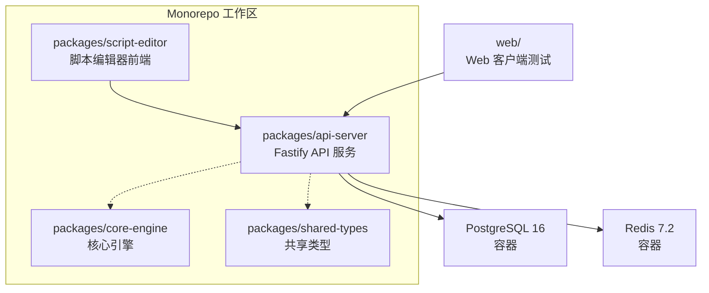
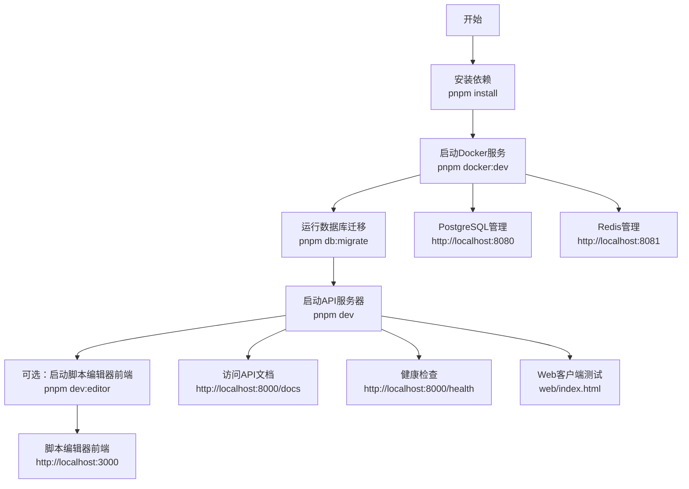
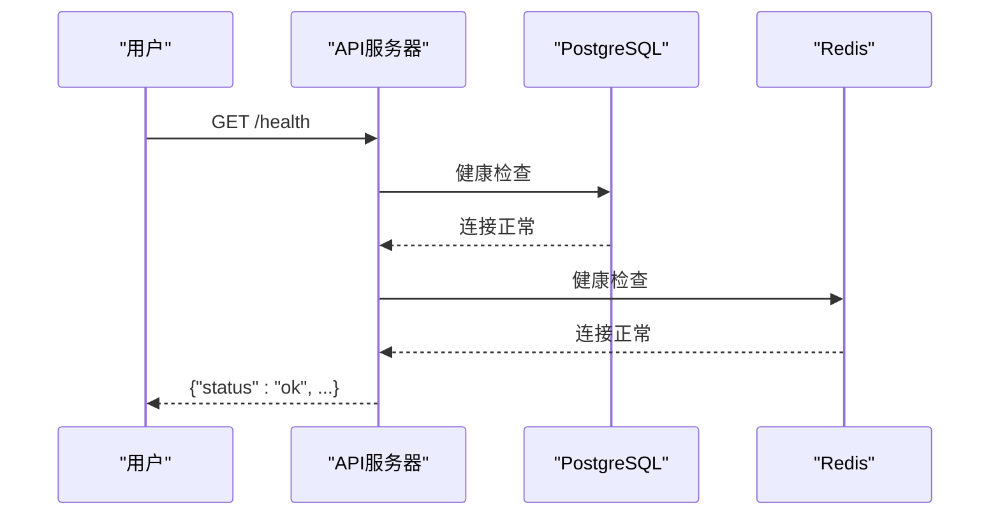
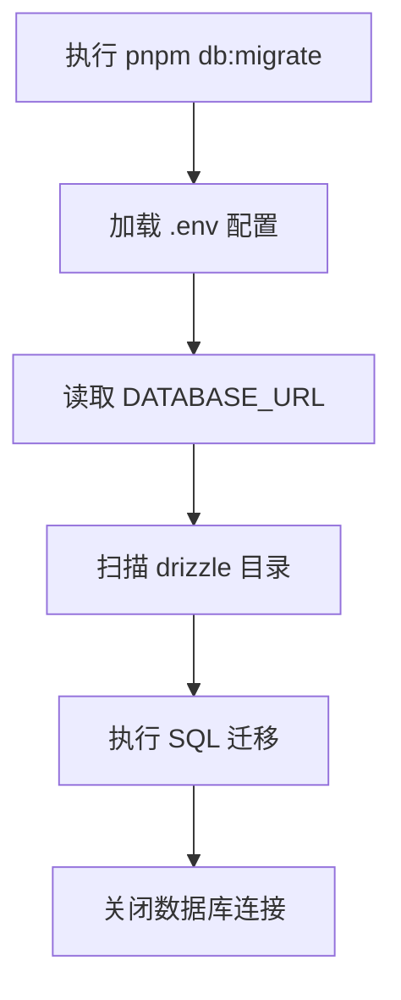
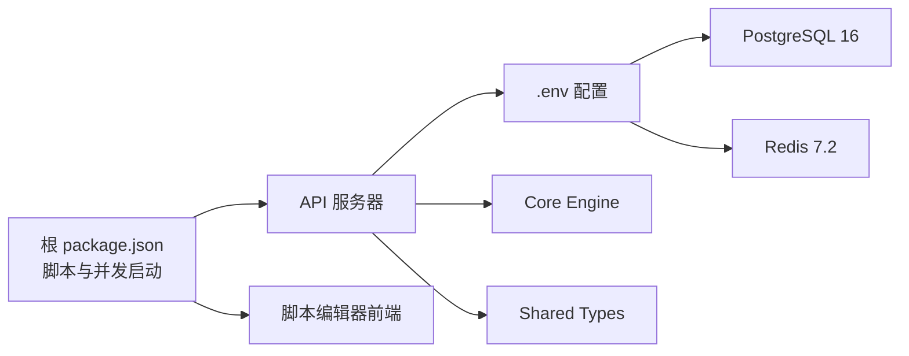

# 快速开始

<cite>
**本文引用的文件**
- [README.md](file://README.md)
- [QUICK_START_GUIDE.md](file://QUICK_START_GUIDE.md)
- [DEV_START_GUIDE.md](file://DEV_START_GUIDE.md)
- [.env.example](file://.env.example)
- [docker-compose.dev.yml](file://docker-compose.dev.yml)
- [package.json](file://package.json)
- [pnpm-workspace.yaml](file://pnpm-workspace.yaml)
- [packages/api-server/package.json](file://packages/api-server/package.json)
- [packages/api-server/src/app.ts](file://packages/api-server/src/app.ts)
- [packages/api-server/src/index.ts](file://packages/api-server/src/index.ts)
- [packages/api-server/drizzle.config.ts](file://packages/api-server/drizzle.config.ts)
- [packages/api-server/src/db/migrate.ts](file://packages/api-server/src/db/migrate.ts)
- [packages/script-editor/package.json](file://packages/script-editor/package.json)
- [start-dev.ps1](file://start-dev.ps1)
- [web/index.html](file://web/index.html)
</cite>

## 目录
1. [简介](#简介)
2. [项目结构](#项目结构)
3. [核心组件](#核心组件)
4. [架构总览](#架构总览)
5. [详细组件分析](#详细组件分析)
6. [依赖关系分析](#依赖关系分析)
7. [性能注意事项](#性能注意事项)
8. [故障排除指南](#故障排除指南)
9. [结论](#结论)
10. [附录](#附录)

## 简介
本指南面向首次接触 HeartRule AI咨询引擎的新用户，帮助你在最短时间内完成环境准备、一键启动服务，并成功访问 API 文档、健康检查端点、数据库与缓存管理界面。项目采用 TypeScript Monorepo 架构，核心依赖包括 Node.js 20+、pnpm 9+、PostgreSQL 16 和 Redis 7.2。

## 项目结构
项目采用 pnpm workspace 的 monorepo 结构，主要模块如下：
- packages/api-server：基于 Fastify 的 REST API 与 WebSocket 服务，提供 Swagger UI 文档与健康检查端点
- packages/core-engine：六大核心引擎（脚本执行、LLM编排、变量提取、记忆、话题调度、意识触发）
- packages/shared-types：共享的 TypeScript 类型与 Zod Schema
- packages/script-editor：脚本编辑器前端（React + Vite），提供可视化脚本编辑与调试
- web：轻量级静态 Web 客户端，用于快速测试对话流程
- config：开发环境配置
- scripts：YAML 脚本（会话流程与咨询技术）

图表来源
- [pnpm-workspace.yaml](file://pnpm-workspace.yaml#L1-L3)
- [packages/api-server/package.json](file://packages/api-server/package.json#L1-L44)
- [packages/script-editor/package.json](file://packages/script-editor/package.json#L1-L33)
- [docker-compose.dev.yml](file://docker-compose.dev.yml#L1-L64)

章节来源
- [pnpm-workspace.yaml](file://pnpm-workspace.yaml#L1-L3)
- [README.md](file://README.md#L97-L129)

## 核心组件
- API 服务器（端口 8000）：提供 Swagger UI 文档、健康检查、会话管理、聊天交互、脚本管理等接口
- 数据库（PostgreSQL 16）：通过 Docker Compose 启动，提供 Adminer 管理界面（端口 8080）
- 缓存（Redis 7.2）：通过 Docker Compose 启动，提供 Redis Commander 管理界面（端口 8081）
- 脚本编辑器前端（端口 3000）：可视化编辑与调试 YAML 脚本
- Web 客户端：轻量级 HTML 页面，用于快速测试会话与聊天流程

章节来源
- [README.md](file://README.md#L63-L94)
- [docker-compose.dev.yml](file://docker-compose.dev.yml#L1-L64)
- [packages/api-server/package.json](file://packages/api-server/package.json#L1-L44)

## 架构总览
下图展示了系统启动与访问的关键流程：从依赖安装到 Docker 服务启动、数据库迁移、API 服务器启动，再到各服务的访问方式。

图表来源
- [README.md](file://README.md#L72-L94)
- [package.json](file://package.json#L28-L31)
- [docker-compose.dev.yml](file://docker-compose.dev.yml#L42-L53)

章节来源
- [README.md](file://README.md#L72-L94)
- [package.json](file://package.json#L28-L31)

## 详细组件分析

### 环境要求与前置条件
- Node.js：20+（LTS）
- pnpm：9+
- PostgreSQL：16
- Redis：7.2
- Docker Desktop：已安装且正在运行

章节来源
- [README.md](file://README.md#L65-L70)
- [QUICK_START_GUIDE.md](file://QUICK_START_GUIDE.md#L16-L21)

### 一键启动流程（推荐）
按照以下顺序执行，即可完成从零到运行的全过程：

1) 安装依赖
- 在项目根目录执行：pnpm install

2) 启动Docker服务（PostgreSQL + Redis + Adminer + Redis Commander）
- 在项目根目录执行：pnpm docker:dev

3) 运行数据库迁移
- 在 packages/api-server 目录执行：pnpm db:migrate

4) 启动API服务器（端口 8000）
- 在 packages/api-server 目录执行：pnpm dev

5) （可选）启动脚本编辑器前端（端口 3000）
- 在 packages/script-editor 目录执行：pnpm dev

成功标志：
- 控制台输出“Server listening on http://localhost:8000”
- 控制台输出“Database connected successfully”

章节来源
- [README.md](file://README.md#L72-L86)
- [QUICK_START_GUIDE.md](file://QUICK_START_GUIDE.md#L22-L40)

### 访问系统
- API 文档（Swagger UI）：http://localhost:8000/docs
- 健康检查端点：http://localhost:8000/health
- PostgreSQL 管理界面：http://localhost:8080（Adminer）
- Redis 管理界面：http://localhost:8081（Redis Commander）
- 脚本编辑器前端：http://localhost:3000（需先启动前端服务）
- Web 客户端测试：web/index.html（浏览器直接打开）

章节来源
- [README.md](file://README.md#L88-L93)
- [docker-compose.dev.yml](file://docker-compose.dev.yml#L42-L53)
- [web/index.html](file://web/index.html#L244-L246)

### API 服务器启动与健康检查
API 服务器基于 Fastify，启动时会注册 CORS、Swagger UI、WebSocket 插件，并暴露根路径与健康检查端点。默认监听 0.0.0.0:8000，可通过环境变量配置。

图表来源
- [packages/api-server/src/app.ts](file://packages/api-server/src/app.ts#L82-L89)
- [packages/api-server/src/app.ts](file://packages/api-server/src/app.ts#L110-L134)

章节来源
- [packages/api-server/src/app.ts](file://packages/api-server/src/app.ts#L82-L89)
- [packages/api-server/src/app.ts](file://packages/api-server/src/app.ts#L110-L134)

### 数据库迁移与 Drizzle 配置
- 迁移命令：在 packages/api-server 目录执行 pnpm db:migrate
- Drizzle 配置：读取 .env 中 DATABASE_URL，迁移文件位于 drizzle 目录
- 迁移执行：通过 drizzle-orm 的 migrate 工具执行

图表来源
- [packages/api-server/src/db/migrate.ts](file://packages/api-server/src/db/migrate.ts#L8-L22)
- [packages/api-server/drizzle.config.ts](file://packages/api-server/drizzle.config.ts#L1-L16)

章节来源
- [packages/api-server/src/db/migrate.ts](file://packages/api-server/src/db/migrate.ts#L8-L22)
- [packages/api-server/drizzle.config.ts](file://packages/api-server/drizzle.config.ts#L1-L16)

### 脚本编辑器前端与开发工作流
- 启动命令：在 packages/script-editor 目录执行 pnpm dev
- 默认端口：3000
- 与 API 服务器通信：通过 http://localhost:8000/api

章节来源
- [packages/script-editor/package.json](file://packages/script-editor/package.json#L6-L11)
- [web/index.html](file://web/index.html#L244-L246)

### PowerShell 一键启动脚本
提供 Windows 环境下的自动化启动脚本，包含依赖检测、安装与启动服务的完整流程。

章节来源
- [start-dev.ps1](file://start-dev.ps1#L1-L54)

## 依赖关系分析
- 根 package.json 定义了统一的开发脚本与并发启动命令
- API 服务器依赖 PostgreSQL 与 Redis，通过 .env 配置连接信息
- 脚本编辑器前端通过本地 API 代理访问后端接口
- Docker Compose 统一编排数据库与缓存服务

图表来源
- [package.json](file://package.json#L13-L32)
- [.env.example](file://.env.example#L7-L11)
- [packages/api-server/package.json](file://packages/api-server/package.json#L20-L35)

章节来源
- [package.json](file://package.json#L13-L32)
- [.env.example](file://.env.example#L7-L11)

## 性能注意事项
- 使用 pnpm 9+ 与 monorepo 结构提升依赖安装与构建效率
- API 服务器采用 Fastify 框架，具备高性能异步事件循环
- Drizzle ORM 零运行时开销，适合高并发场景
- 建议在开发阶段避免同时开启过多服务，以减少资源占用

## 故障排除指南

### 端口被占用
- 现象：启动时出现地址已被占用错误
- 解决：查找占用端口的进程并结束，然后重试
  - 8000 端口：netstat -ano | findstr :8000
  - 3000 端口：netstat -ano | findstr :3000
  - 结束进程：taskkill /PID <进程ID> /F

章节来源
- [QUICK_START_GUIDE.md](file://QUICK_START_GUIDE.md#L227-L243)

### Docker 未启动或容器异常
- 现象：连接 Docker Desktop 失败
- 解决：启动 Docker Desktop，等待图标变绿后重试 pnpm docker:dev；检查容器状态与日志

章节来源
- [QUICK_START_GUIDE.md](file://QUICK_START_GUIDE.md#L245-L257)

### Web 界面无法连接 API
- 现象：浏览器控制台显示 CORS 错误
- 检查：确认 API 服务器正在运行，web/index.html 中的 API_BASE 地址为 http://localhost:8000/api

章节来源
- [QUICK_START_GUIDE.md](file://QUICK_START_GUIDE.md#L259-L267)
- [web/index.html](file://web/index.html#L244-L246)

### 数据库连接失败
- 现象：数据库连接错误
- 解决：确认 Docker 正在运行，检查 PostgreSQL 容器状态与日志，必要时重启数据库

章节来源
- [QUICK_START_GUIDE.md](file://QUICK_START_GUIDE.md#L269-L282)

### 依赖安装问题
- 现象：安装依赖失败
- 解决：清理并重新安装依赖
  - pnpm clean
  - pnpm install

章节来源
- [DEV_START_GUIDE.md](file://DEV_START_GUIDE.md#L103-L113)

### 健康检查失败
- 现象：/health 返回异常
- 检查：确认 API 服务器、PostgreSQL、Redis 均处于健康状态；查看容器健康检查配置

章节来源
- [packages/api-server/src/app.ts](file://packages/api-server/src/app.ts#L82-L89)
- [docker-compose.dev.yml](file://docker-compose.dev.yml#L17-L21)
- [docker-compose.dev.yml](file://docker-compose.dev.yml#L34-L38)

## 结论
通过本快速开始指南，你可以完成 HeartRule AI咨询引擎的环境准备与一键启动，顺利访问 API 文档、健康检查端点、数据库与缓存管理界面，并进行基本的会话与聊天测试。若遇到问题，可参考故障排除章节中的常见问题与解决方案。

## 附录

### 环境变量与配置
- 数据库连接：DATABASE_URL=postgresql://...:5432/heartrule_ai
- Redis 连接：REDIS_URL=redis://:...@localhost:6379
- API 端口：API_PORT=8000
- JWT 密钥：JWT_SECRET（生产环境务必修改）

章节来源
- [.env.example](file://.env.example#L7-L28)

### 常用命令速查
- 安装依赖：pnpm install
- 启动 Docker：pnpm docker:dev
- 运行迁移：pnpm db:migrate
- 启动 API：pnpm dev
- 启动编辑器：pnpm dev:editor
- 停止 Docker：pnpm docker:down

章节来源
- [package.json](file://package.json#L28-L31)
- [DEV_START_GUIDE.md](file://DEV_START_GUIDE.md#L48-L58)