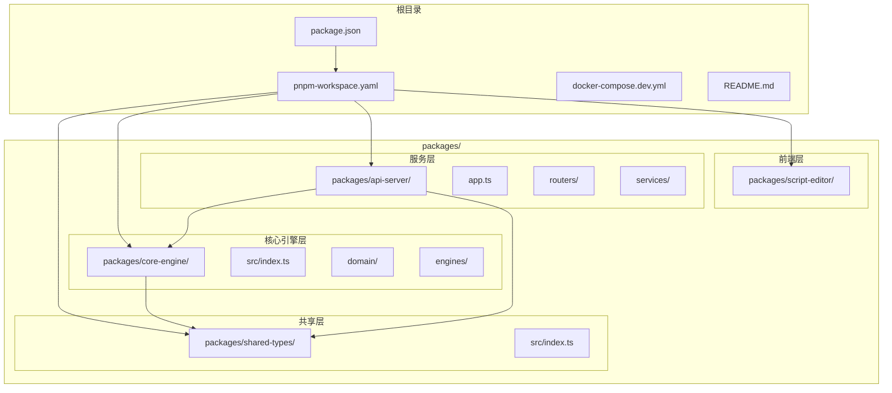
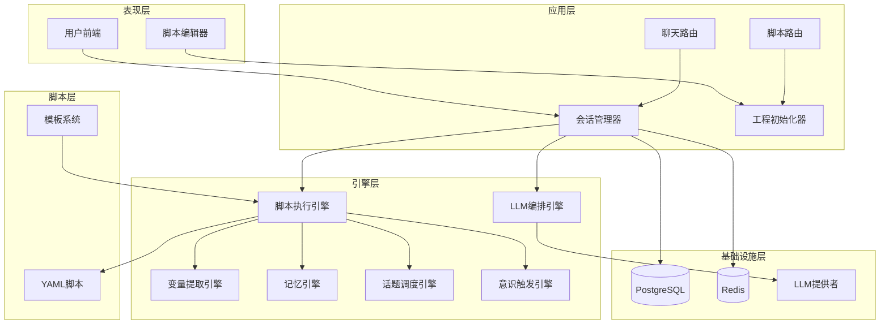
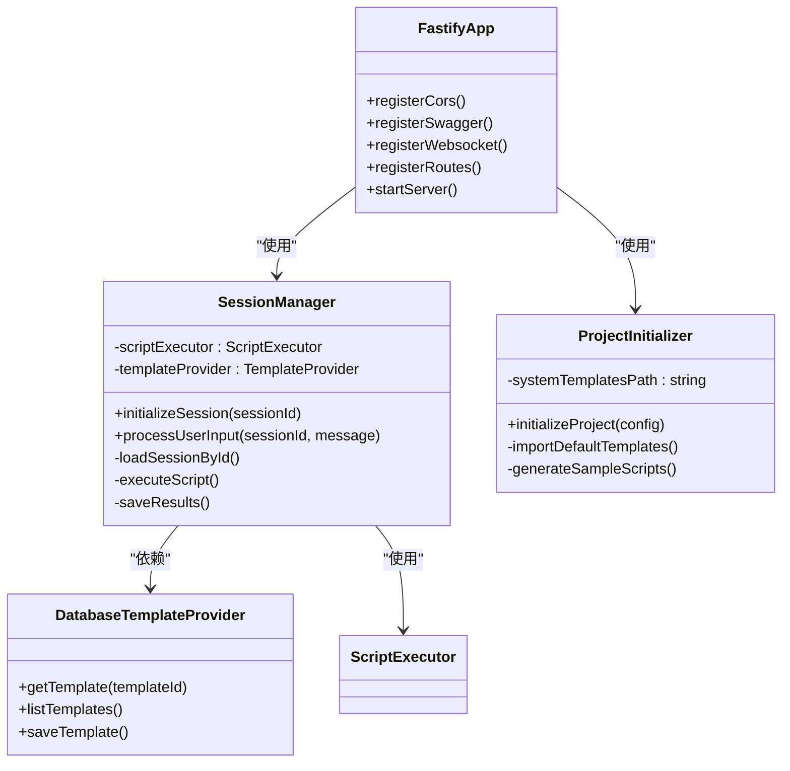
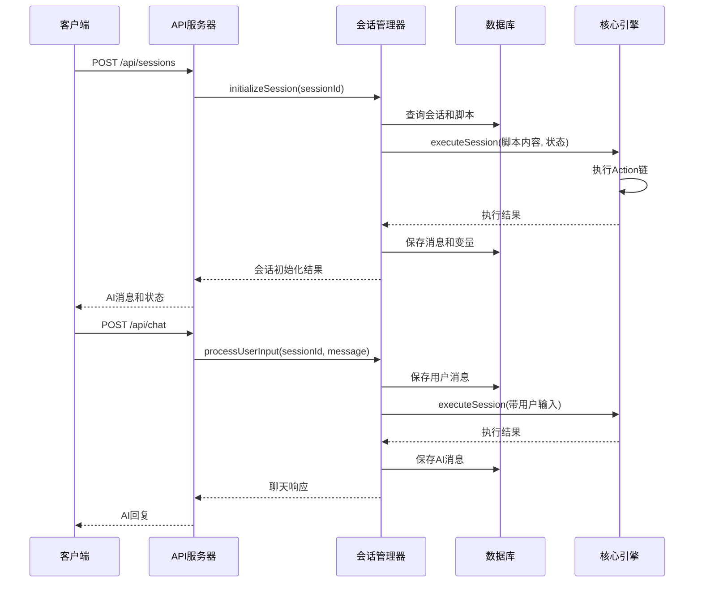
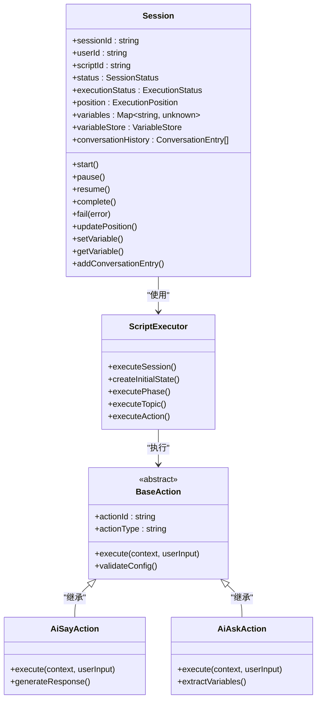
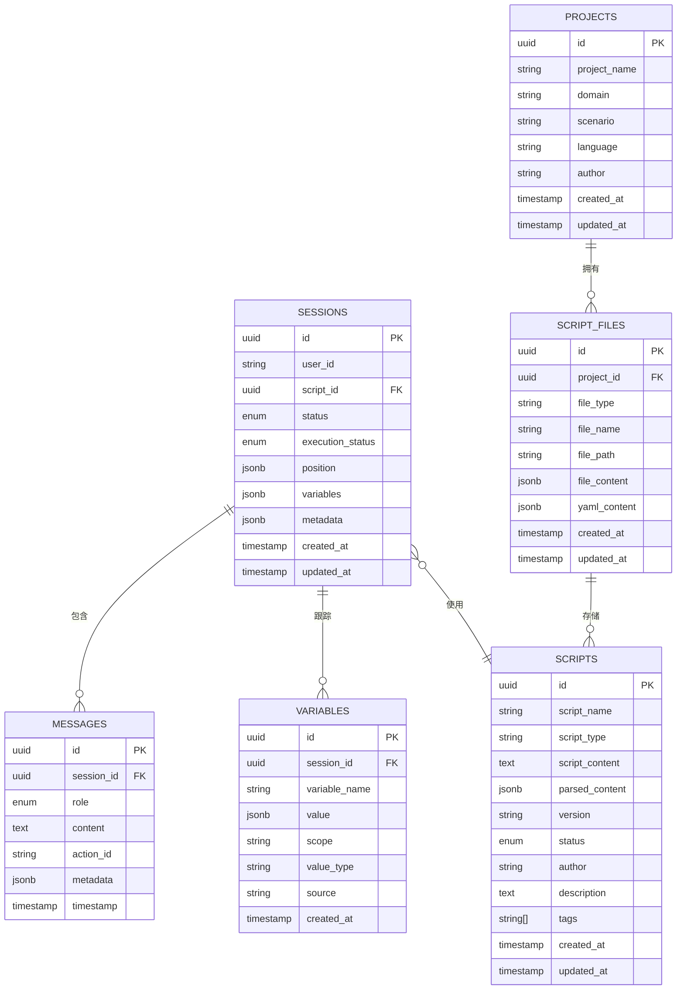
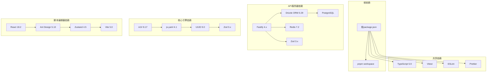

# 多用户项目工程基础设施

<cite>
**本文档引用的文件**
- [README.md](file://README.md)
- [package.json](file://package.json)
- [pnpm-workspace.yaml](file://pnpm-workspace.yaml)
- [docker-compose.dev.yml](file://docker-compose.dev.yml)
- [packages/api-server/package.json](file://packages/api-server/package.json)
- [packages/core-engine/package.json](file://packages/core-engine/package.json)
- [packages/script-editor/package.json](file://packages/script-editor/package.json)
- [packages/shared-types/package.json](file://packages/shared-types/package.json)
- [packages/api-server/src/app.ts](file://packages/api-server/src/app.ts)
- [packages/api-server/src/index.ts](file://packages/api-server/src/index.ts)
- [packages/api-server/src/routers/sessions.ts](file://packages/api-server/src/routers/sessions.ts)
- [packages/api-server/src/routers/chat.ts](file://packages/api-server/src/routers/chat.ts)
- [packages/api-server/src/routers/scripts.ts](file://packages/api-server/src/routers/scripts.ts)
- [packages/api-server/src/services/session-manager.ts](file://packages/api-server/src/services/session-manager.ts)
- [packages/api-server/src/services/project-initializer.ts](file://packages/api-server/src/services/project-initializer.ts)
- [packages/core-engine/src/index.ts](file://packages/core-engine/src/index.ts)
- [packages/core-engine/src/domain/session.ts](file://packages/core-engine/src/domain/session.ts)
- [packages/shared-types/src/index.ts](file://packages/shared-types/src/index.ts)
</cite>

## 目录

1. [项目概述](#项目概述)
2. [项目结构](#项目结构)
3. [核心组件](#核心组件)
4. [架构概览](#架构概览)
5. [详细组件分析](#详细组件分析)
6. [依赖关系分析](#依赖关系分析)
7. [性能考虑](#性能考虑)
8. [故障排除指南](#故障排除指南)
9. [结论](#结论)

## 项目概述

HeartRule AI咨询引擎是一个基于"LLM + YAML脚本"的智能咨询框架，首个应用场景是CBT心理咨询。该项目采用混合架构，结合大语言模型的语言理解与生成能力，以及结构化脚本的流程控制能力，将专业咨询师的经验、技术、流程和数据沉淀为可执行、可维护的脚本化知识库。

### 核心特性

- **经验结构化沉淀**：通过YAML脚本将咨询师经验转化为可复用知识资产
- **灵活性与可控性平衡**：LLM提供自然语言交互，脚本保证流程专业性
- **领域知识可扩展**：支持不同咨询领域的专业化脚本定制
- **质量可追溯**：脚本化流程便于审计、优化和质量管理
- **类型安全**：TypeScript编译时检查，减少运行时错误
- **高性能**：Fastify框架 + 异步事件循环
- **现代化架构**：Monorepo + pnpm + 六大核心引擎

## 项目结构

项目采用Monorepo架构，使用pnpm workspace进行包管理：

**图表来源**

- [pnpm-workspace.yaml](file://pnpm-workspace.yaml#L1-L3)
- [packages/api-server/package.json](file://packages/api-server/package.json#L1-L49)
- [packages/core-engine/package.json](file://packages/core-engine/package.json#L1-L38)
- [packages/shared-types/package.json](file://packages/shared-types/package.json#L1-L27)

**章节来源**

- [README.md](file://README.md#L50-L58)
- [pnpm-workspace.yaml](file://pnpm-workspace.yaml#L1-L3)

## 核心组件

### 1. API服务器 (Fastify)

API服务器是系统的入口点，基于Fastify框架构建，提供REST API和WebSocket支持：

- **核心功能**：会话管理、聊天交互、脚本管理
- **中间件**：CORS、Swagger文档、WebSocket
- **数据库**：Drizzle ORM + PostgreSQL
- **缓存**：Redis集成

### 2. 核心引擎 (Headless)

核心引擎是无头的六引擎架构，包含以下核心模块：

- **脚本执行引擎**：解析YAML，管理Phase → Topic → Action流程
- **LLM编排引擎**：统一管理多个LLM提供者
- **变量提取引擎**：从对话中提取变量
- **记忆引擎**：短期/中期/长期记忆管理
- **话题调度引擎**：动态话题切换
- **意识触发引擎**：监控对话情境

### 3. 共享类型系统

提供跨包共享的TypeScript类型定义和Zod Schema：

- **领域模型类型**：Session、Message、Script、Variable
- **API接口类型**：请求和响应类型
- **枚举和常量**：状态枚举、配置常量

### 4. 脚本编辑器

基于React的可视化脚本编辑器，提供：

- **拖拽式界面**：可视化编辑YAML脚本
- **实时验证**：语法和Schema验证
- **调试功能**：LLM调试图标和变量显示
- **版本管理**：脚本版本控制

**章节来源**

- [packages/api-server/src/app.ts](file://packages/api-server/src/app.ts#L21-L105)
- [packages/core-engine/src/index.ts](file://packages/core-engine/src/index.ts#L12-L193)
- [packages/shared-types/src/index.ts](file://packages/shared-types/src/index.ts#L1-L20)

## 架构概览

系统采用五层分层架构：

**图表来源**

- [README.md](file://README.md#L26-L48)
- [packages/api-server/src/services/session-manager.ts](file://packages/api-server/src/services/session-manager.ts#L76-L83)
- [packages/core-engine/src/index.ts](file://packages/core-engine/src/index.ts#L135-L167)

## 详细组件分析

### API服务器架构

API服务器采用模块化设计，每个路由模块负责特定功能域：

**图表来源**

- [packages/api-server/src/app.ts](file://packages/api-server/src/app.ts#L21-L105)
- [packages/api-server/src/services/session-manager.ts](file://packages/api-server/src/services/session-manager.ts#L76-L83)
- [packages/api-server/src/services/project-initializer.ts](file://packages/api-server/src/services/project-initializer.ts#L46-L58)

### 会话管理系统

会话管理系统是核心业务逻辑的实现：

**图表来源**

- [packages/api-server/src/routers/sessions.ts](file://packages/api-server/src/routers/sessions.ts#L14-L155)
- [packages/api-server/src/routers/chat.ts](file://packages/api-server/src/routers/chat.ts#L15-L88)
- [packages/api-server/src/services/session-manager.ts](file://packages/api-server/src/services/session-manager.ts#L649-L709)

### 核心引擎架构

核心引擎采用DDD（领域驱动设计）实现：

**图表来源**

- [packages/core-engine/src/domain/session.ts](file://packages/core-engine/src/domain/session.ts#L26-L88)
- [packages/core-engine/src/index.ts](file://packages/core-engine/src/index.ts#L135-L169)

**章节来源**

- [packages/api-server/src/services/session-manager.ts](file://packages/api-server/src/services/session-manager.ts#L1-L769)
- [packages/core-engine/src/domain/session.ts](file://packages/core-engine/src/domain/session.ts#L1-L221)

### 数据库架构

系统使用PostgreSQL作为主要数据存储，采用Drizzle ORM进行类型安全的数据库操作：

**图表来源**

- [packages/api-server/src/services/session-manager.ts](file://packages/api-server/src/services/session-manager.ts#L14-L22)
- [packages/api-server/src/services/project-initializer.ts](file://packages/api-server/src/services/project-initializer.ts#L17-L18)

**章节来源**

- [packages/api-server/src/services/session-manager.ts](file://packages/api-server/src/services/session-manager.ts#L14-L22)

## 依赖关系分析

项目采用清晰的依赖层次结构：

**图表来源**

- [package.json](file://package.json#L1-L67)
- [packages/api-server/package.json](file://packages/api-server/package.json#L24-L39)
- [packages/core-engine/package.json](file://packages/core-engine/package.json#L21-L29)
- [packages/script-editor/package.json](file://packages/script-editor/package.json#L14-L26)

**章节来源**

- [package.json](file://package.json#L1-L67)
- [packages/api-server/package.json](file://packages/api-server/package.json#L1-L49)

## 性能考虑

### 1. 数据库性能优化

- **连接池管理**：使用Drizzle ORM的连接池优化数据库连接
- **索引策略**：为常用查询字段建立适当索引
- **查询优化**：避免N+1查询问题，批量操作数据
- **缓存策略**：Redis缓存热点数据，减少数据库压力

### 2. API性能优化

- **异步处理**：所有I/O操作采用异步模式
- **流式响应**：SSE流式响应支持长文本输出
- **错误处理**：完善的错误处理和超时机制
- **日志优化**：结构化日志，避免过度打印

### 3. 内存管理

- **变量存储**：分层变量存储，避免内存泄漏
- **会话状态**：及时清理不再使用的会话状态
- **模板缓存**：LLM模板缓存，减少重复计算

## 故障排除指南

### 1. 常见启动问题

**问题**：数据库连接失败

- 检查PostgreSQL服务状态
- 验证连接字符串配置
- 确认数据库权限设置

**问题**：Redis连接失败

- 检查Redis服务状态
- 验证密码配置
- 确认网络连通性

### 2. API调用问题

**问题**：会话创建失败

- 检查脚本ID有效性
- 验证用户ID格式
- 确认脚本状态为published

**问题**：聊天响应异常

- 检查会话状态
- 验证用户输入格式
- 查看LLM提供商状态

### 3. 调试技巧

- **启用详细日志**：设置LOG_LEVEL=debug
- **使用Swagger UI**：http://localhost:8000/docs
- **检查数据库状态**：http://localhost:8080
- **监控Redis状态**：http://localhost:8081

**章节来源**

- [packages/api-server/src/app.ts](file://packages/api-server/src/app.ts#L82-L89)
- [packages/api-server/src/utils/error-handler.ts](file://packages/api-server/src/utils/error-handler.ts)

## 结论

HeartRule AI咨询引擎是一个设计精良的多用户项目工程基础设施，具有以下特点：

### 技术优势

1. **架构清晰**：采用五层分层架构，职责分离明确
2. **类型安全**：全面的TypeScript类型系统
3. **可扩展性**：模块化设计，易于功能扩展
4. **性能优化**：异步处理和缓存策略
5. **开发友好**：完善的开发工具链和文档

### 未来发展方向

1. **前端开发**：实现React + Pixi.js的可视化界面
2. **功能完善**：完成话题调度引擎和意识触发引擎
3. **性能优化**：实现长期记忆和向量检索
4. **部署优化**：容器化和微服务架构
5. **用户体验**：游戏化UI和更好的交互体验

该系统为CBT心理咨询提供了强大的技术支持，通过结构化脚本和LLM编排，能够为用户提供专业、个性化的咨询服务。
