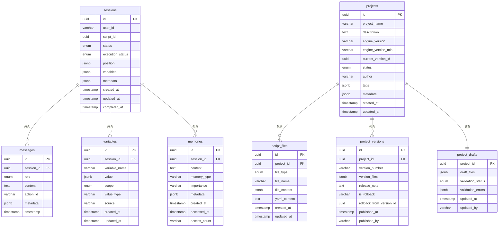

# 数据库Schema设计

<cite>
**本文档引用的文件**
- [schema.ts](file://packages/api-server/src/db/schema.ts)
- [0000_massive_young_avengers.sql](file://packages/api-server/drizzle/0000_massive_young_avengers.sql)
- [0001_dusty_iceman.sql](file://packages/api-server/drizzle/0001_dusty_iceman.sql)
- [0000_snapshot.json](file://packages/api-server/drizzle/meta/0000_snapshot.json)
- [0001_snapshot.json](file://packages/api-server/drizzle/meta/0001_snapshot.json)
- [index.ts](file://packages/api-server/src/db/index.ts)
- [init-dev.ts](file://packages/api-server/src/db/init-dev.ts)
- [migrate.ts](file://packages/api-server/src/db/migrate.ts)
- [01-extensions.sql](file://scripts/init-db/01-extensions.sql)
- [cbt_depression_assessment.yaml](file://scripts/sessions/cbt_depression_assessment.yaml)
- [socratic_questioning.yaml](file://scripts/techniques/socratic_questioning.yaml)
</cite>

## 目录
1. [项目概述](#项目概述)
2. [架构概览](#架构概览)
3. [核心数据表设计](#核心数据表设计)
4. [枚举类型设计](#枚举类型设计)
5. [索引设计](#索引设计)
6. [外键关系](#外键关系)
7. [JSONB字段策略](#jsonb字段策略)
8. [数据完整性约束](#数据完整性约束)
9. [表结构对比表](#表结构对比表)
10. [性能考虑](#性能考虑)
11. [故障排除指南](#故障排除指南)
12. [结论](#结论)

## 项目概述

HeartRule AI咨询引擎是一个基于人工智能的心理咨询辅助系统，采用PostgreSQL作为主要数据库，使用Drizzle ORM进行数据库操作。该系统支持多种类型的咨询脚本，包括会谈脚本、技术脚本和意识提升脚本，为心理治疗师提供智能化的咨询辅助工具。

系统的核心设计理念是通过结构化的脚本驱动咨询流程，结合会话管理、消息记录、变量跟踪和记忆存储等功能，构建完整的AI心理咨询生态系统。

## 架构概览

```mermaid
graph TB
subgraph "应用层"
API[API服务器]
Engine[核心引擎]
Editor[脚本编辑器]
end
subgraph "数据库层"
subgraph "会话管理"
Sessions[会话表]
Messages[消息表]
Variables[变量表]
Memories[记忆表]
end
subgraph "脚本管理"
Scripts[脚本表]
Projects[工程表]
ScriptFiles[脚本文件表]
ProjectDrafts[工程草稿表]
ProjectVersions[工程版本表]
end
subgraph "枚举类型"
Enums[枚举类型]
end
end
subgraph "扩展支持"
UUID[UUID扩展]
JSONB[JSONB扩展]
Vector[向量扩展(可选)]
end
API --> Sessions
API --> Scripts
API --> Projects
Engine --> Variables
Engine --> Memories
Scripts --> ScriptFiles
Projects --> ProjectDrafts
Projects --> ProjectVersions
Sessions -.-> Enums
Scripts -.-> Enums
Projects -.-> Enums
Variables -.-> Enums
ScriptFiles -.-> Enums
```

**图表来源**
- [schema.ts](file://packages/api-server/src/db/schema.ts#L1-L219)
- [0000_massive_young_avengers.sql](file://packages/api-server/drizzle/0000_massive_young_avengers.sql#L1-L130)
- [0001_dusty_iceman.sql](file://packages/api-server/drizzle/0001_dusty_iceman.sql#L1-L90)

## 核心数据表设计

### 会话表 (sessions)

会话表是整个系统的核心，用于管理用户与AI咨询助手之间的交互会话。

| 字段名 | 数据类型 | 约束条件 | 默认值 | 设计意图 | 业务含义 |
|--------|----------|----------|--------|----------|----------|
| id | uuid | 主键, 随机生成 | gen_random_uuid() | 唯一标识每个会话 | 会话的唯一标识符 |
| userId | varchar(255) | 非空 | 无 | 用户标识 | 心理咨询师或来访者的用户ID |
| scriptId | uuid | 非空 | 无 | 外键引用脚本 | 当前会话使用的脚本ID |
| status | session_status | 非空, 默认active | 'active' | 状态枚举 | 会话当前状态 |
| executionStatus | execution_status | 非空, 默认running | 'running' | 执行状态枚举 | 会话执行状态 |
| position | jsonb | 非空, 类型定义 | {} | 结构化位置信息 | 当前执行位置(阶段/话题/动作) |
| variables | jsonb | 非空, 默认{} | {} | 变量存储 | 会话中的动态变量集合 |
| metadata | jsonb | 非空, 默认{} | {} | 元数据存储 | 会话相关元数据 |
| createdAt | timestamp | 非空, 默认now() | now() | 创建时间戳 | 会话创建时间 |
| updatedAt | timestamp | 非空, 默认now() | now() | 更新时间戳 | 会话最后更新时间 |
| completedAt | timestamp | 可空 | 无 | 完成时间戳 | 会话完成时间 |

**业务场景**：
- 会话生命周期管理
- 执行状态跟踪
- 位置信息持久化
- 变量状态保存

### 消息表 (messages)

消息表记录会话中的所有消息交互，支持用户、AI助手和系统消息。

| 字段名 | 数据类型 | 约束条件 | 默认值 | 设计意图 | 业务含义 |
|--------|----------|----------|--------|----------|----------|
| id | uuid | 主键, 随机生成 | gen_random_uuid() | 唯一标识每条消息 | 消息的唯一标识符 |
| sessionId | uuid | 非空, 外键 | 无 | 引用会话表 | 消息所属的会话ID |
| role | message_role | 非空 | 无 | 角色枚举 | 发送者角色(user/assistant/system) |
| content | text | 非空 | 无 | 消息内容 | 实际的消息文本内容 |
| actionId | varchar(255) | 可空 | 无 | 动作关联 | 关联的脚本动作ID |
| metadata | jsonb | 非空, 默认{} | {} | 元数据存储 | 消息相关元数据 |
| timestamp | timestamp | 非空, 默认now() | now() | 时间戳 | 消息发送时间 |

**业务场景**：
- 会话历史记录
- 消息分类和过滤
- 时间线展示

### 脚本表 (scripts)

脚本表存储各种类型的咨询脚本，支持会话脚本、技术脚本和意识提升脚本。

| 字段名 | 数据类型 | 约束条件 | 默认值 | 设计意图 | 业务含义 |
|--------|----------|----------|--------|----------|----------|
| id | uuid | 主键, 随机生成 | gen_random_uuid() | 唯一标识每个脚本 | 脚本的唯一标识符 |
| scriptName | varchar(255) | 非空, 唯一 | 无 | 唯一约束 | 脚本名称 |
| scriptType | script_type | 非空 | 无 | 类型枚举 | 脚本类型(session/technique/awareness) |
| scriptContent | text | 非空 | 无 | YAML内容 | 脚本的YAML格式内容 |
| parsedContent | jsonb | 可空 | 无 | 解析后的内容 | 解析后的结构化内容 |
| version | varchar(50) | 非空, 默认'1.0.0' | '1.0.0' | 版本号 | 脚本版本 |
| status | script_status | 非空, 默认'draft' | 'draft' | 状态枚举 | 脚本状态(draft/published/archived) |
| author | varchar(255) | 非空 | 无 | 作者信息 | 脚本创建者 |
| description | text | 非空, 默认'' | '' | 描述信息 | 脚本功能描述 |
| tags | jsonb | 非空, 默认[] | [] | 标签数组 | 脚本标签列表 |
| createdAt | timestamp | 非空, 默认now() | now() | 创建时间 | 脚本创建时间 |
| updatedAt | timestamp | 非空, 默认now() | now() | 更新时间 | 脚本最后更新时间 |

**业务场景**：
- 脚本版本管理
- 脚本分类和搜索
- 脚本发布流程

### 工程表 (projects)

工程表用于管理复杂的脚本工程，支持多个脚本文件的组织和版本控制。

| 字段名 | 数据类型 | 约束条件 | 默认值 | 设计意图 | 业务含义 |
|--------|----------|----------|--------|----------|----------|
| id | uuid | 主键, 随机生成 | gen_random_uuid() | 唯一标识每个工程 | 工程的唯一标识符 |
| projectName | varchar(255) | 非空 | 无 | 工程名称 | 工程的显示名称 |
| description | text | 非空, 默认'' | '' | 描述信息 | 工程功能描述 |
| engineVersion | varchar(50) | 非空 | 无 | 引擎版本 | 支持的引擎版本 |
| engineVersionMin | varchar(50) | 非空 | 无 | 最低兼容版本 | 最低兼容引擎版本 |
| currentVersionId | uuid | 可空 | 无 | 当前版本ID | 当前激活的版本ID |
| status | project_status | 非空, 默认'draft' | 'draft' | 状态枚举 | 工程状态 |
| author | varchar(255) | 非空 | 无 | 作者信息 | 工程创建者 |
| tags | jsonb | 非空, 默认[] | [] | 标签数组 | 工程标签列表 |
| metadata | jsonb | 非空, 默认{} | {} | 元数据存储 | 工程相关元数据 |
| createdAt | timestamp | 非空, 默认now() | now() | 创建时间 | 工程创建时间 |
| updatedAt | timestamp | 非空, defaultnow() | now() | 更新时间 | 工程最后更新时间 |

**业务场景**：
- 工程项目管理
- 版本控制
- 团队协作

### 脚本文件表 (script_files)

脚本文件表存储工程中的各个脚本文件，支持不同类型的文件组织。

| 字段名 | 数据类型 | 约束条件 | 默认值 | 设计意图 | 业务含义 |
|--------|----------|----------|--------|----------|----------|
| id | uuid | 主键, 随机生成 | gen_random_uuid() | 唯一标识每个文件 | 文件的唯一标识符 |
| projectId | uuid | 非空, 外键 | 无 | 工程关联 | 所属工程ID |
| fileType | file_type | 非空 | 无 | 文件类型枚举 | 文件类型(global/roles/skills/forms/rules/session) |
| fileName | varchar(255) | 非空 | 无 | 文件名 | 脚本文件名 |
| fileContent | jsonb | 非空 | 无 | 文件内容 | 解析后的JSON内容 |
| yamlContent | text | 可空 | 无 | YAML备份 | 原始YAML内容备份 |
| createdAt | timestamp | 非空, 默认now() | now() | 创建时间 | 文件创建时间 |
| updatedAt | timestamp | 非空, 默认now() | now() | 更新时间 | 文件最后更新时间 |

**业务场景**：
- 工程文件管理
- 文件类型分类
- 内容版本追踪

### 工程草稿表 (project_drafts)

工程草稿表用于存储工程的草稿状态，支持验证和错误追踪。

| 字段名 | 数据类型 | 约束条件 | 默认值 | 设计意图 | 业务含义 |
|--------|----------|----------|--------|----------|----------|
| projectId | uuid | 主键, 外键 | 无 | 工程关联 | 关联的工程ID |
| draftFiles | jsonb | 非空 | 无 | 草稿文件 | 草稿状态的文件内容 |
| validationStatus | validation_status | 非空, 默认'unknown' | 'unknown' | 验证状态枚举 | 草稿验证状态 |
| validationErrors | jsonb | 可空, 默认[] | [] | 错误列表 | 验证过程中发现的错误 |
| updatedAt | timestamp | 非空, 默认now() | now() | 更新时间 | 草稿最后更新时间 |
| updatedBy | varchar(255) | 非空 | 无 | 更新者 | 最后更新的用户 |

**业务场景**：
- 草稿状态管理
- 验证流程
- 错误追踪

### 工程版本表 (project_versions)

工程版本表用于管理工程的历史版本，支持版本回滚和发布记录。

| 字段名 | 数据类型 | 约束条件 | 默认值 | 设计意图 | 业务含义 |
|--------|----------|----------|--------|----------|----------|
| id | uuid | 主键, 随机生成 | gen_random_uuid() | 唯一标识每个版本 | 版本的唯一标识符 |
| projectId | uuid | 非空, 外键 | 无 | 工程关联 | 所属工程ID |
| versionNumber | varchar(32) | 非空 | 无 | 版本号 | 版本编号 |
| versionFiles | jsonb | 非空 | 无 | 版本文件 | 版本对应的文件内容 |
| releaseNote | text | 非空, 默认'' | '' | 发布说明 | 版本发布说明 |
| isRollback | varchar(10) | 非空, 默认'false' | 'false' | 回滚标记 | 是否为回滚操作 |
| rollbackFromVersionId | uuid | 可空 | 无 | 回滚源版本 | 回滚来源的版本ID |
| publishedAt | timestamp | 非空, 默认now() | now() | 发布时间 | 版本发布时间 |
| publishedBy | varchar(255) | 非空 | 无 | 发布者 | 版本发布者 |

**业务场景**：
- 版本历史追踪
- 回滚机制
- 发布管理

### 变量表 (variables)

变量表用于存储会话中的变量快照，支持不同作用域的变量管理。

| 字段名 | 数据类型 | 约束条件 | 默认值 | 设计意图 | 业务含义 |
|--------|----------|----------|--------|----------|----------|
| id | uuid | 主键, 随机生成 | gen_random_uuid() | 唯一标识每个变量 | 变量的唯一标识符 |
| sessionId | uuid | 非空, 外键 | 无 | 会话关联 | 所属会话ID |
| variableName | varchar(255) | 非空 | 无 | 变量名称 | 变量的标识名称 |
| value | jsonb | 非空 | 无 | 变量值 | 变量的实际值 |
| scope | variable_scope | 非空 | 无 | 作用域枚举 | 变量作用域(global/session/phase/topic) |
| valueType | varchar(50) | 非空 | 无 | 值类型 | 变量值的数据类型 |
| source | varchar(255) | 非空 | 无 | 数据来源 | 变量值的来源标识 |
| createdAt | timestamp | 非空, 默认now() | now() | 创建时间 | 变量创建时间 |
| updatedAt | timestamp | 非空, 默认now() | now() | 更新时间 | 变量最后更新时间 |

**业务场景**：
- 变量生命周期管理
- 作用域控制
- 值追踪

### 记忆表 (memories)

记忆表用于存储会话中的重要记忆片段，支持按类型和重要性分类。

| 字段名 | 数据类型 | 约束条件 | 默认值 | 设计意图 | 业务含义 |
|--------|----------|----------|--------|----------|----------|
| id | uuid | 主键, 随机生成 | gen_random_uuid() | 唯一标识每条记忆 | 记忆的唯一标识符 |
| sessionId | uuid | 可空, 外键 | 无 | 会话关联 | 所属会话ID(可为空) |
| content | text | 非空 | 无 | 记忆内容 | 记忆的具体内容 |
| memoryType | varchar(50) | 非空 | 无 | 记忆类型 | 记忆的分类标识 |
| importance | varchar(10) | 非空 | 无 | 重要性等级 | 记忆的重要程度 |
| metadata | jsonb | 非空, 默认{} | {} | 元数据存储 | 记忆相关元数据 |
| createdAt | timestamp | 非空, 默认now() | now() | 创建时间 | 记忆创建时间 |
| accessedAt | timestamp | 非空, 默认now() | now() | 访问时间 | 记忆最后访问时间 |
| accessCount | varchar(10) | 非空, 默认'0' | '0' | 访问计数 | 记忆被访问的次数 |

**业务场景**：
- 记忆片段存储
- 记忆检索
- 访问统计

**章节来源**
- [schema.ts](file://packages/api-server/src/db/schema.ts#L22-L198)
- [0000_massive_young_avengers.sql](file://packages/api-server/drizzle/0000_massive_young_avengers.sql#L37-L99)
- [0001_dusty_iceman.sql](file://packages/api-server/drizzle/0001_dusty_iceman.sql#L19-L64)

## 枚举类型设计

系统使用PostgreSQL枚举类型确保数据的一致性和完整性：

### 会话状态枚举 (session_status)
- active: 活跃状态
- paused: 暂停状态  
- completed: 完成状态
- failed: 失败状态

### 执行状态枚举 (execution_status)
- running: 运行中
- waiting_input: 等待输入
- paused: 暂停
- completed: 完成
- error: 错误

### 消息角色枚举 (message_role)
- user: 用户消息
- assistant: AI助手消息
- system: 系统消息

### 脚本类型枚举 (script_type)
- session: 会谈脚本
- technique: 技术脚本
- awareness: 意识提升脚本

### 脚本状态枚举 (script_status)
- draft: 草稿
- published: 已发布
- archived: 已归档

### 变量作用域枚举 (variable_scope)
- global: 全局作用域
- session: 会话作用域
- phase: 阶段作用域
- topic: 话题作用域

### 工程状态枚举 (project_status)
- draft: 草稿
- published: 已发布
- archived: 已归档

### 文件类型枚举 (file_type)
- global: 全局文件
- roles: 角色文件
- skills: 技能文件
- forms: 表单文件
- rules: 规则文件
- session: 会话文件

### 验证状态枚举 (validation_status)
- valid: 有效
- invalid: 无效
- unknown: 未知

**章节来源**
- [schema.ts](file://packages/api-server/src/db/schema.ts#L8-L17)
- [0000_snapshot.json](file://packages/api-server/drizzle/meta/0000_snapshot.json#L472-L525)

## 索引设计

为了优化查询性能，系统为关键字段建立了适当的索引：

### 会话表索引
- sessions_user_id_idx: 基于userId的普通索引
- sessions_status_idx: 基于status的普通索引  
- sessions_created_at_idx: 基于createdAt的时间索引

### 消息表索引
- messages_session_id_idx: 基于sessionId的普通索引
- messages_timestamp_idx: 基于timestamp的时间索引

### 脚本表索引
- scripts_type_status_idx: 基于(script_type, status)的复合索引
- scripts_name_idx: 基于script_name的普通索引

### 工程表索引
- projects_status_idx: 基于status的普通索引
- projects_author_idx: 基于author的普通索引
- projects_name_idx: 基于project_name的普通索引

### 脚本文件表索引
- script_files_project_id_idx: 基于project_id的普通索引
- script_files_file_type_idx: 基于file_type的普通索引

### 记忆表索引
- memories_session_id_idx: 基于session_id的普通索引
- memories_type_idx: 基于memory_type的普通索引
- memories_importance_idx: 基于importance的普通索引

### 变量表索引
- variables_session_id_idx: 基于session_id的普通索引
- variables_name_idx: 基于variable_name的普通索引

**章节来源**
- [schema.ts](file://packages/api-server/src/db/schema.ts#L34-L197)
- [0000_snapshot.json](file://packages/api-server/drizzle/meta/0000_snapshot.json#L71-L100)
- [0001_snapshot.json](file://packages/api-server/drizzle/meta/0001_snapshot.json#L101-L110)

## 外键关系

系统通过外键约束确保数据的参照完整性：



**图表来源**
- [schema.ts](file://packages/api-server/src/db/schema.ts#L47-L150)
- [0000_snapshot.json](file://packages/api-server/drizzle/meta/0000_snapshot.json#L88-L98)
- [0001_snapshot.json](file://packages/api-server/drizzle/meta/0001_snapshot.json#L194-L255)

**章节来源**
- [schema.ts](file://packages/api-server/src/db/schema.ts#L47-L150)
- [0000_snapshot.json](file://packages/api-server/drizzle/meta/0000_snapshot.json#L88-L98)
- [0001_snapshot.json](file://packages/api-server/drizzle/meta/0001_snapshot.json#L194-L255)

## JSONB字段策略

系统广泛使用JSONB字段来存储灵活的结构化数据：

### JSONB字段设计原则

1. **类型安全**: 使用TypeScript类型定义确保运行时数据结构正确性
2. **默认值**: 为JSONB字段提供合理的默认值(空对象{}或空数组[])
3. **索引策略**: 对常用查询字段考虑建立GIN索引
4. **性能优化**: 避免过度嵌套，保持JSON结构扁平化

### 关键JSONB字段分析

#### 会话位置信息 (sessions.position)
- 结构: `{ phaseIndex: number, topicIndex: number, actionIndex: number }`
- 用途: 记录当前执行的阶段、话题和动作索引
- 查询: 支持精确的位置定位和进度追踪

#### 变量存储 (sessions.variables)
- 结构: `{ [key: string]: any }`
- 用途: 存储会话中的动态变量
- 约束: 通过variables表实现结构化管理

#### 元数据存储 (metadata字段)
- 结构: `{ [key: string]: any }`
- 用途: 存储临时的、非结构化的元数据
- 应用: 脚本解析结果、会话统计信息等

#### 脚本解析内容 (scripts.parsed_content)
- 结构: 解析后的YAML内容
- 用途: 提供快速访问的结构化脚本数据
- 性能: 避免重复解析YAML文件

**章节来源**
- [schema.ts](file://packages/api-server/src/db/schema.ts#L28-L30)
- [schema.ts](file://packages/api-server/src/db/schema.ts#L68-L73)
- [schema.ts](file://packages/api-server/src/db/schema.ts#L165-L166)

## 数据完整性约束

### 主键约束
- 所有表均使用UUID作为主键，确保全局唯一性
- UUID使用PostgreSQL的uuid-ossp扩展生成

### 外键约束
- 会话相关表均通过外键关联到sessions表
- 工程相关表均通过外键关联到projects表
- 删除策略: 使用CASCADE级联删除，确保数据一致性

### 唯一约束
- 脚本表的script_name字段具有唯一约束
- 确保脚本名称的全局唯一性

### 非空约束
- 所有业务关键字段均设置NOT NULL约束
- 提供合理的默认值确保数据完整性

### 枚举约束
- 使用PostgreSQL枚举类型限制取值范围
- 确保数据的一致性和有效性

**章节来源**
- [schema.ts](file://packages/api-server/src/db/schema.ts#L22-L81)
- [0000_snapshot.json](file://packages/api-server/drizzle/meta/0000_snapshot.json#L276-L282)

## 表结构对比表

### 核心表结构对比

| 表名 | 主键类型 | 外键数量 | 唯一约束 | 枚举类型 | JSONB字段数量 |
|------|----------|----------|----------|----------|---------------|
| sessions | uuid | 0 | 0 | 2 | 3 |
| messages | uuid | 1 | 0 | 1 | 1 |
| variables | uuid | 1 | 0 | 1 | 1 |
| memories | uuid | 1 | 0 | 0 | 1 |
| scripts | uuid | 0 | 1 | 4 | 3 |
| projects | uuid | 0 | 0 | 2 | 3 |
| script_files | uuid | 1 | 0 | 1 | 1 |
| project_versions | uuid | 1 | 0 | 0 | 2 |
| project_drafts | uuid | 1 | 0 | 1 | 1 |

### 字段完整性对比

| 表名 | 非空字段数 | 默认值字段数 | 索引字段数 | 外键字段数 |
|------|------------|--------------|------------|------------|
| sessions | 8 | 3 | 3 | 0 |
| messages | 6 | 1 | 2 | 1 |
| variables | 8 | 0 | 2 | 1 |
| memories | 7 | 3 | 3 | 1 |
| scripts | 9 | 2 | 2 | 0 |
| projects | 8 | 3 | 3 | 0 |
| script_files | 6 | 1 | 2 | 1 |
| project_versions | 8 | 2 | 2 | 1 |
| project_drafts | 5 | 2 | 0 | 1 |

**章节来源**
- [schema.ts](file://packages/api-server/src/db/schema.ts#L22-L198)
- [0000_snapshot.json](file://packages/api-server/drizzle/meta/0000_snapshot.json#L6-L470)

## 性能考虑

### 查询优化策略

1. **索引设计**: 为高频查询字段建立适当索引
   - 时间戳字段: 支持时间范围查询
   - 状态字段: 支持状态过滤查询
   - 关联字段: 支持JOIN操作优化

2. **JSONB查询优化**: 
   - 使用适当的JSONB操作符
   - 避免全表扫描的复杂查询
   - 考虑建立GIN索引优化JSONB查询

3. **分页策略**: 
   - 使用LIMIT和OFFSET进行分页
   - 基于时间戳的游标分页
   - 避免深度分页导致的性能问题

### 存储优化

1. **数据压缩**: JSONB自动压缩存储
2. **索引维护**: 定期重建索引优化查询性能
3. **分区策略**: 考虑按时间分区存储大量历史数据

### 并发控制

1. **事务管理**: 合理使用事务确保数据一致性
2. **锁策略**: 避免长时间持有锁
3. **重试机制**: 实现幂等操作和重试逻辑

## 故障排除指南

### 常见问题及解决方案

#### 数据库连接问题
- **症状**: 连接超时或连接失败
- **原因**: DATABASE_URL环境变量未设置或连接字符串格式错误
- **解决**: 检查.env文件配置，确保DATABASE_URL格式正确

#### 迁移失败
- **症状**: 执行迁移时报错
- **原因**: 数据库权限不足或迁移文件损坏
- **解决**: 检查数据库用户权限，重新执行迁移命令

#### 枚举类型冲突
- **症状**: 创建枚举类型时报duplicate_object错误
- **原因**: 枚举类型已存在
- **解决**: 手动删除现有枚举类型或修改枚举名称

#### JSONB数据格式错误
- **症状**: JSONB字段插入或查询失败
- **原因**: JSON数据格式不正确
- **解决**: 检查JSON数据格式，确保符合JSON标准

### 调试工具

1. **数据库监控**: 使用pg_stat_statements监控慢查询
2. **日志分析**: 查看PostgreSQL日志文件
3. **性能分析**: 使用EXPLAIN ANALYZE分析查询计划

**章节来源**
- [index.ts](file://packages/api-server/src/db/index.ts#L10-L14)
- [migrate.ts](file://packages/api-server/src/db/migrate.ts#L11-L17)

## 结论

HeartRule AI咨询引擎的数据库Schema设计体现了以下特点：

1. **模块化设计**: 清晰的表结构分离，每个表职责明确
2. **灵活性**: JSONB字段提供了强大的数据存储灵活性
3. **完整性**: 通过枚举类型、外键约束和索引确保数据完整性
4. **可扩展性**: 支持脚本工程化管理和版本控制
5. **性能优化**: 合理的索引设计和查询优化策略

该Schema设计能够有效支持AI心理咨询系统的各种业务需求，包括会话管理、脚本执行、变量跟踪和记忆存储等功能。通过合理的数据结构设计和约束机制，确保了系统的稳定性、一致性和可维护性。