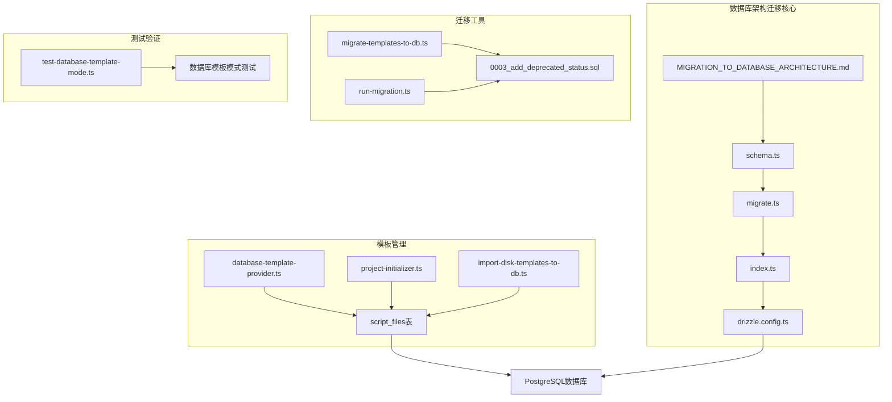
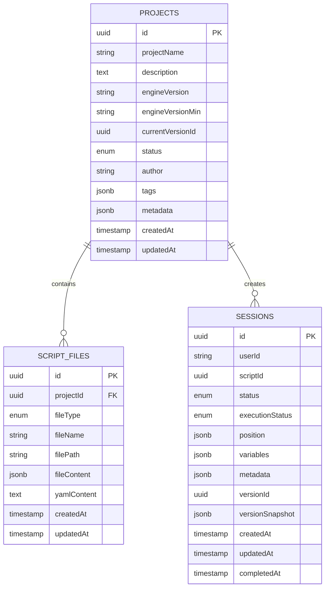
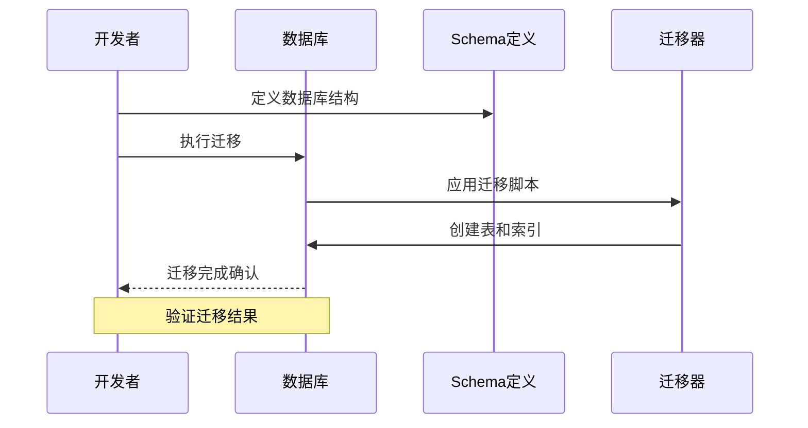
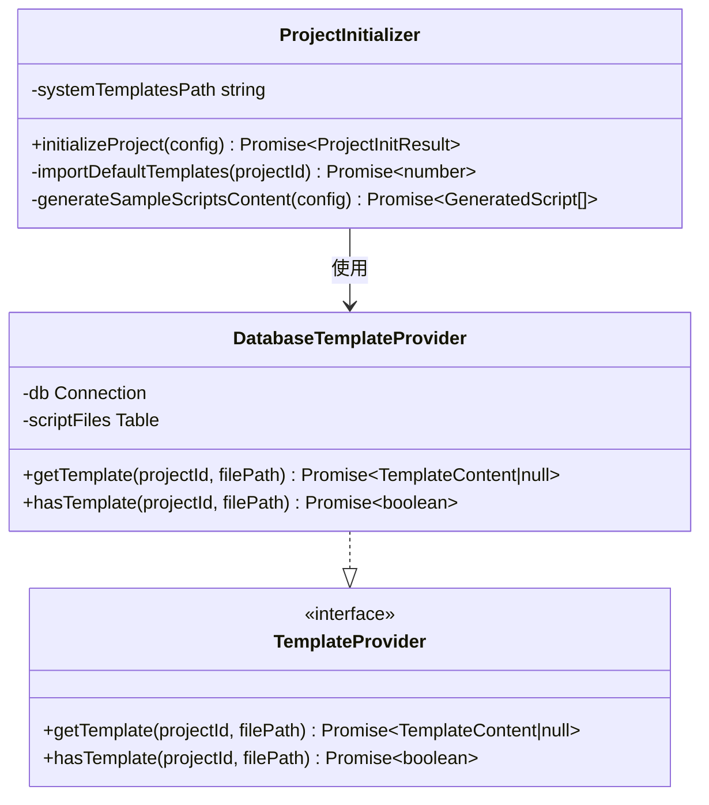
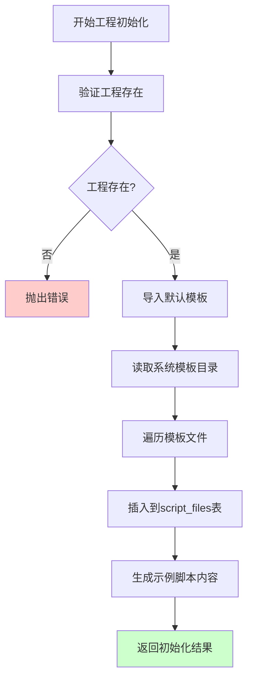
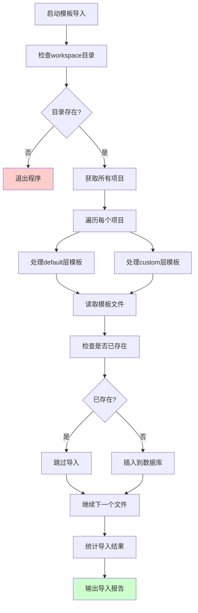
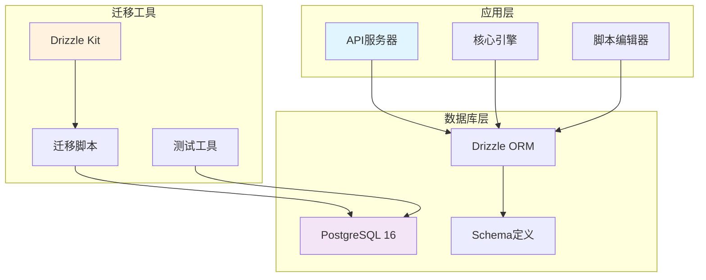
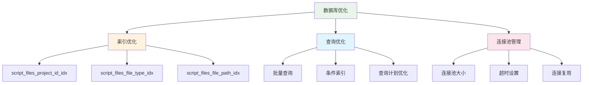
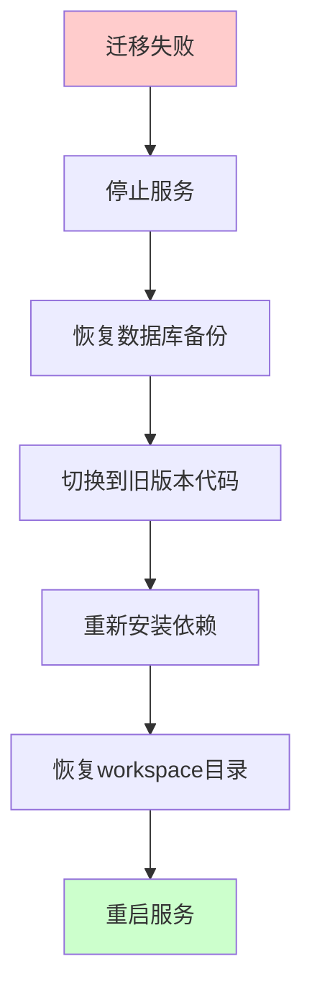

# 数据库架构迁移指南

<cite>
**本文档引用的文件**
- [MIGRATION_TO_DATABASE_ARCHITECTURE.md](file://docs/MIGRATION_TO_DATABASE_ARCHITECTURE.md)
- [schema.ts](file://packages/api-server/src/db/schema.ts)
- [migrate.ts](file://packages/api-server/src/db/migrate.ts)
- [index.ts](file://packages/api-server/src/db/index.ts)
- [drizzle.config.ts](file://packages/api-server/drizzle.config.ts)
- [project-initializer.ts](file://packages/api-server/src/services/project-initializer.ts)
- [database-template-provider.ts](file://packages/api-server/src/services/database-template-provider.ts)
- [import-disk-templates-to-db.ts](file://packages/api-server/import-disk-templates-to-db.ts)
- [migrate-templates-to-db.ts](file://packages/api-server/migrate-templates-to-db.ts)
- [test-database-template-mode.ts](file://packages/api-server/test-database-template-mode.ts)
- [run-migration.ts](file://packages/api-server/run-migration.ts)
- [01-extensions.sql](file://scripts/init-db/01-extensions.sql)
- [package.json](file://packages/api-server/package.json)
</cite>

## 目录

1. [简介](#简介)
2. [项目结构](#项目结构)
3. [核心组件](#核心组件)
4. [架构概览](#架构概览)
5. [详细组件分析](#详细组件分析)
6. [依赖关系分析](#依赖关系分析)
7. [性能考虑](#性能考虑)
8. [故障排除指南](#故障排除指南)
9. [结论](#结论)

## 简介

HeartRule AI咨询引擎数据库架构迁移指南详细介绍了从v1.x或v2.0混合架构升级到v2.1纯数据库架构的完整过程。该迁移将所有工程资源（模板、脚本）存储于PostgreSQL数据库，移除对物理workspace目录的依赖，实现单一数据源，便于分布式部署和备份。

### 迁移目标

- ✅ 所有工程资源存储于PostgreSQL数据库
- ✅ 移除对物理workspace目录的依赖
- ✅ 移除PROJECTS_WORKSPACE环境变量
- ✅ 实现单一数据源，便于分布式部署和备份

## 项目结构

基于代码库分析，数据库架构迁移涉及以下关键文件和组件：

**图表来源**

- [MIGRATION_TO_DATABASE_ARCHITECTURE.md](file://docs/MIGRATION_TO_DATABASE_ARCHITECTURE.md#L1-L499)
- [schema.ts](file://packages/api-server/src/db/schema.ts#L1-L300)
- [drizzle.config.ts](file://packages/api-server/drizzle.config.ts#L1-L16)

**章节来源**

- [MIGRATION_TO_DATABASE_ARCHITECTURE.md](file://docs/MIGRATION_TO_DATABASE_ARCHITECTURE.md#L1-L499)
- [schema.ts](file://packages/api-server/src/db/schema.ts#L1-L300)

## 核心组件

### 数据库Schema定义

系统采用Drizzle ORM for PostgreSQL 16，定义了完整的数据库架构：

**图表来源**

- [schema.ts](file://packages/api-server/src/db/schema.ts#L130-L187)

### 数据库连接管理

数据库连接通过统一的index.ts模块管理，确保环境变量正确加载和连接池管理。

**章节来源**

- [schema.ts](file://packages/api-server/src/db/schema.ts#L1-L300)
- [index.ts](file://packages/api-server/src/db/index.ts#L1-L34)

## 架构概览

### 迁移前后架构对比

| 特性               | v1.0 磁盘模式     | v2.0 混合模式   | v2.1 数据库模式 ✅ |
| ------------------ | ----------------- | --------------- | ------------------ |
| 模板存储           | workspace目录     | 数据库+磁盘同步 | 数据库             |
| 脚本存储           | workspace目录     | 数据库          | 数据库             |
| PROJECTS_WORKSPACE | 必需              | 必需            | 已移除             |
| 部署复杂度         | 高(需初始化目录)  | 中(需同步)      | 低(仅需数据库)     |
| 多租户隔离         | 差(共享目录)      | 一般            | 优(数据库级)       |
| 备份恢复           | 复杂(文件+数据库) | 复杂            | 简单(仅数据库)     |

### 数据库迁移流程

**图表来源**

- [migrate.ts](file://packages/api-server/src/db/migrate.ts#L8-L20)
- [schema.ts](file://packages/api-server/src/db/schema.ts#L1-L300)

## 详细组件分析

### 数据库模板提供器

DatabaseTemplateProvider实现了TemplateProvider接口，负责从数据库script_files表中读取模板内容：

**图表来源**

- [database-template-provider.ts](file://packages/api-server/src/services/database-template-provider.ts#L15-L84)
- [project-initializer.ts](file://packages/api-server/src/services/project-initializer.ts#L46-L102)

### 工程初始化服务

ProjectInitializer负责在创建新工程时导入系统默认模板到数据库：

**图表来源**

- [project-initializer.ts](file://packages/api-server/src/services/project-initializer.ts#L63-L102)

**章节来源**

- [database-template-provider.ts](file://packages/api-server/src/services/database-template-provider.ts#L1-L84)
- [project-initializer.ts](file://packages/api-server/src/services/project-initializer.ts#L1-L263)

### 模板导入工具

import-disk-templates-to-db.ts提供了遗留迁移工具，用于将历史磁盘模板文件一次性导入到数据库：

**图表来源**

- [import-disk-templates-to-db.ts](file://packages/api-server/import-disk-templates-to-db.ts#L36-L178)

**章节来源**

- [import-disk-templates-to-db.ts](file://packages/api-server/import-disk-templates-to-db.ts#L1-L184)

### 数据库迁移脚本

migrate-templates-to-db.ts提供了数据库迁移脚本，用于添加template文件类型和file_path字段：

**章节来源**

- [migrate-templates-to-db.ts](file://packages/api-server/migrate-templates-to-db.ts#L1-L56)

## 依赖关系分析

### 数据库依赖图

**图表来源**

- [package.json](file://packages/api-server/package.json#L24-L40)
- [drizzle.config.ts](file://packages/api-server/drizzle.config.ts#L6-L15)

### 环境配置依赖

系统依赖以下关键环境变量：

| 环境变量            | 用途                 | 必需性          |
| ------------------- | -------------------- | --------------- |
| DATABASE_URL        | PostgreSQL连接字符串 | ✅ 必需         |
| VOLCANO_API_KEY     | LLM提供商密钥        | ✅ 必需         |
| VOLCANO_ENDPOINT_ID | LLM端点ID            | ✅ 必需         |
| PROJECTS_WORKSPACE  | 工作区路径           | ❌ v2.1中已移除 |

**章节来源**

- [package.json](file://packages/api-server/package.json#L1-L49)
- [drizzle.config.ts](file://packages/api-server/drizzle.config.ts#L10-L12)

## 性能考虑

### 迁移后性能提升

根据迁移指南，v2.1架构预期带来以下性能改进：

- 会话初始化减少10-20%耗时（无磁盘IO）
- 并发性能提升（无文件锁竞争）
- 模板缓存更高效（TemplateManager内存缓存）

### 数据库优化策略

**图表来源**

- [schema.ts](file://packages/api-server/src/db/schema.ts#L66-L74)
- [schema.ts](file://packages/api-server/src/db/schema.ts#L180-L187)

## 故障排除指南

### 常见迁移问题及解决方案

| 问题类型         | 症状                  | 解决方案                     |
| ---------------- | --------------------- | ---------------------------- |
| 数据库连接失败   | 连接超时或认证错误    | 检查DATABASE_URL环境变量     |
| 迁移脚本执行失败 | SQL语法错误或权限不足 | 验证PostgreSQL扩展已启用     |
| 模板加载失败     | 404错误或空响应       | 检查script_files表数据完整性 |
| 性能问题         | 查询响应时间过长      | 检查索引创建和查询优化       |

### 回滚方案

如果迁移过程中遇到问题，可以按以下步骤回滚：

**图表来源**

- [MIGRATION_TO_DATABASE_ARCHITECTURE.md](file://docs/MIGRATION_TO_DATABASE_ARCHITECTURE.md#L277-L298)

**章节来源**

- [MIGRATION_TO_DATABASE_ARCHITECTURE.md](file://docs/MIGRATION_TO_DATABASE_ARCHITECTURE.md#L273-L412)

## 结论

数据库架构迁移指南为HeartRule AI咨询引擎从混合架构升级到纯数据库架构提供了完整的实施蓝图。通过标准化的迁移流程、完善的测试验证和详细的故障排除方案，确保了迁移过程的安全性和可靠性。

### 迁移收益

- **简化部署**：移除对物理文件系统的依赖，降低部署复杂度
- **提升性能**：消除磁盘IO瓶颈，提高并发处理能力
- **增强可靠性**：单一数据源便于备份和恢复
- **支持扩展**：为未来的分布式部署奠定基础

### 后续步骤

1. 评估当前系统版本和数据状态
2. 制定详细的迁移时间表
3. 准备测试环境进行验证
4. 执行迁移并进行全面测试
5. 监控系统性能和稳定性

通过遵循本指南，团队可以顺利完成数据库架构迁移，为HeartRule AI咨询引擎的未来发展提供坚实的技术基础。
