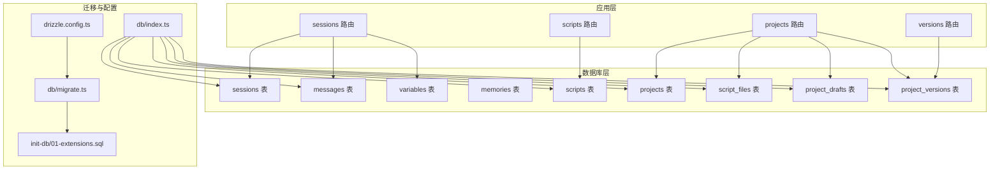
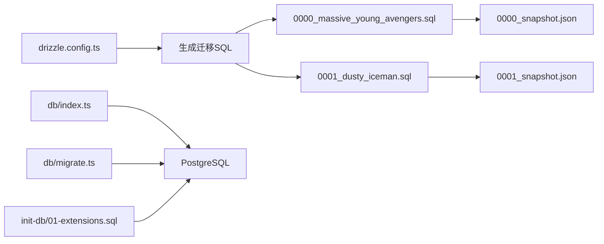
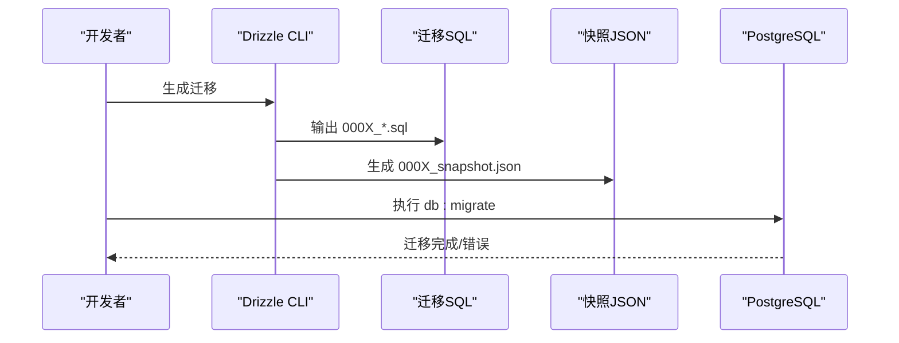
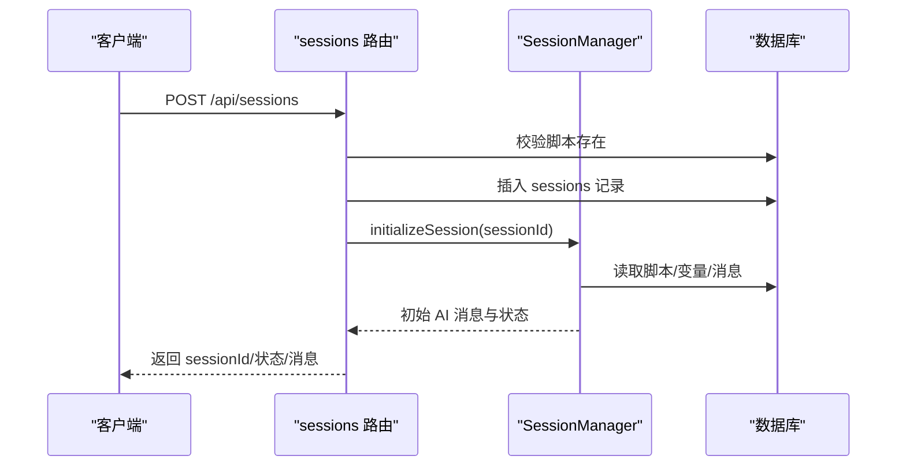

# 数据库设计

<cite>
**本文引用的文件**
- [packages/api-server/src/db/schema.ts](file://packages/api-server/src/db/schema.ts)
- [packages/api-server/drizzle/meta/0000_snapshot.json](file://packages/api-server/drizzle/meta/0000_snapshot.json)
- [packages/api-server/drizzle/meta/0001_snapshot.json](file://packages/api-server/drizzle/meta/0001_snapshot.json)
- [packages/api-server/drizzle/0000_massive_young_avengers.sql](file://packages/api-server/drizzle/0000_massive_young_avengers.sql)
- [packages/api-server/drizzle/0001_dusty_iceman.sql](file://packages/api-server/drizzle/0001_dusty_iceman.sql)
- [packages/api-server/src/db/index.ts](file://packages/api-server/src/db/index.ts)
- [packages/api-server/src/db/migrate.ts](file://packages/api-server/src/db/migrate.ts)
- [packages/api-server/drizzle.config.ts](file://packages/api-server/drizzle.config.ts)
- [scripts/init-db/01-extensions.sql](file://scripts/init-db/01-extensions.sql)
- [packages/api-server/src/routes/sessions.ts](file://packages/api-server/src/routes/sessions.ts)
- [packages/api-server/src/routes/scripts.ts](file://packages/api-server/src/routes/scripts.ts)
- [packages/api-server/src/routes/projects.ts](file://packages/api-server/src/routes/projects.ts)
- [packages/api-server/src/routers/versions.ts](file://packages/api-server/src/routers/versions.ts)
</cite>

## 目录
1. [简介](#简介)
2. [项目结构](#项目结构)
3. [核心组件](#核心组件)
4. [架构总览](#架构总览)
5. [详细组件分析](#详细组件分析)
6. [依赖分析](#依赖分析)
7. [性能考量](#性能考量)
8. [故障排查指南](#故障排查指南)
9. [结论](#结论)
10. [附录](#附录)

## 简介
本文件系统化梳理 HeartRule AI 咨询引擎的数据库设计，围绕 Drizzle ORM 的 PostgreSQL 16 架构，完整呈现 Schema 定义、表结构、关系映射、枚举类型、索引策略与迁移机制。重点覆盖会话表、消息表、脚本表、项目表及其子表（工程草稿、版本、文件），并结合 API 路由说明数据模型如何支撑会话管理、聊天记录、脚本存储与工程版本管理等核心功能。

## 项目结构
数据库相关代码主要集中在 api-server 包内，采用“Schema 定义 + Drizzle 迁移 + API 路由”的分层组织方式：
- Schema 定义：统一在 schema.ts 中声明各表、枚举与索引
- 迁移与快照：通过 Drizzle Kit 生成 SQL 迁移与 JSON 快照，确保结构演进可追踪
- 连接与迁移入口：drizzle.config.ts、index.ts、migrate.ts
- 初始化扩展：scripts/init-db/01-extensions.sql 提供 UUID、加密与全文检索扩展
- API 路由：sessions.ts、scripts.ts、projects.ts 将业务逻辑与数据库交互解耦



图表来源
- [packages/api-server/src/db/schema.ts](file://packages/api-server/src/db/schema.ts#L1-L219)
- [packages/api-server/src/db/index.ts](file://packages/api-server/src/db/index.ts#L1-L26)
- [packages/api-server/src/db/migrate.ts](file://packages/api-server/src/db/migrate.ts#L1-L23)
- [packages/api-server/drizzle.config.ts](file://packages/api-server/drizzle.config.ts#L1-L16)
- [scripts/init-db/01-extensions.sql](file://scripts/init-db/01-extensions.sql#L1-L17)
- [packages/api-server/src/routes/sessions.ts](file://packages/api-server/src/routes/sessions.ts#L1-L548)
- [packages/api-server/src/routes/scripts.ts](file://packages/api-server/src/routes/scripts.ts#L1-L325)
- [packages/api-server/src/routes/projects.ts](file://packages/api-server/src/routes/projects.ts#L1-L500)

章节来源
- [packages/api-server/src/db/schema.ts](file://packages/api-server/src/db/schema.ts#L1-L219)
- [packages/api-server/drizzle/meta/0000_snapshot.json](file://packages/api-server/drizzle/meta/0000_snapshot.json#L1-L533)
- [packages/api-server/drizzle/meta/0001_snapshot.json](file://packages/api-server/drizzle/meta/0001_snapshot.json#L1-L959)
- [packages/api-server/drizzle/0000_massive_young_avengers.sql](file://packages/api-server/drizzle/0000_massive_young_avengers.sql#L1-L130)
- [packages/api-server/drizzle/0001_dusty_iceman.sql](file://packages/api-server/drizzle/0001_dusty_iceman.sql#L1-L90)
- [packages/api-server/src/db/index.ts](file://packages/api-server/src/db/index.ts#L1-L26)
- [packages/api-server/src/db/migrate.ts](file://packages/api-server/src/db/migrate.ts#L1-L23)
- [packages/api-server/drizzle.config.ts](file://packages/api-server/drizzle.config.ts#L1-L16)
- [scripts/init-db/01-extensions.sql](file://scripts/init-db/01-extensions.sql#L1-L17)

## 核心组件
- 枚举类型：会话状态、执行状态、消息角色、脚本类型/状态、变量作用域、工程状态、文件类型、校验状态等，均以 Postgres 枚举形式定义，保证取值一致性与查询效率。
- 会话表（sessions）：承载一次咨询会话的生命周期与运行态，包含位置指针、变量快照、元数据与时间戳。
- 消息表（messages）：记录会话内的用户/助手/系统消息，支持按时间排序与会话维度检索。
- 脚本表（scripts）：存储 YAML 脚本与解析后 JSON 结构，支持版本、状态与标签管理。
- 项目表（projects）：工程主表，关联文件、草稿与版本；支持状态、作者、标签与元数据。
- 文件表（script_files）：工程内各类文件（全局、角色、技能、表单、规则、会话）的 JSON/YAML 存储。
- 草稿表（project_drafts）：工程草稿的 JSON 快照与校验状态。
- 版本表（project_versions）：工程版本历史，支持回滚标记与回滚来源。
- 变量表（variables）：会话变量的快照存储，支持作用域与类型标注。
- 记忆表（memories）：会话记忆片段，支持类型与重要性索引。

章节来源
- [packages/api-server/src/db/schema.ts](file://packages/api-server/src/db/schema.ts#L8-L17)
- [packages/api-server/src/db/schema.ts](file://packages/api-server/src/db/schema.ts#L22-L40)
- [packages/api-server/src/db/schema.ts](file://packages/api-server/src/db/schema.ts#L45-L58)
- [packages/api-server/src/db/schema.ts](file://packages/api-server/src/db/schema.ts#L63-L81)
- [packages/api-server/src/db/schema.ts](file://packages/api-server/src/db/schema.ts#L86-L105)
- [packages/api-server/src/db/schema.ts](file://packages/api-server/src/db/schema.ts#L110-L124)
- [packages/api-server/src/db/schema.ts](file://packages/api-server/src/db/schema.ts#L129-L136)
- [packages/api-server/src/db/schema.ts](file://packages/api-server/src/db/schema.ts#L141-L156)
- [packages/api-server/src/db/schema.ts](file://packages/api-server/src/db/schema.ts#L161-L176)
- [packages/api-server/src/db/schema.ts](file://packages/api-server/src/db/schema.ts#L181-L198)

## 架构总览
下图展示数据库 Schema 的类关系与外键约束，体现会话与消息、变量、记忆的强关联，以及工程与其文件、草稿、版本的层次关系。

```mermaid
classDiagram
class Sessions {
+uuid id
+string user_id
+uuid script_id
+enum status
+enum execution_status
+jsonb position
+jsonb variables
+jsonb metadata
+timestamp created_at
+timestamp updated_at
+timestamp completed_at
}
class Messages {
+uuid id
+uuid session_id
+enum role
+text content
+string action_id
+jsonb metadata
+timestamp timestamp
}
class Variables {
+uuid id
+uuid session_id
+string variable_name
+jsonb value
+enum scope
+string value_type
+string source
+timestamp created_at
+timestamp updated_at
}
class Memories {
+uuid id
+uuid session_id
+text content
+string memory_type
+string importance
+jsonb metadata
+timestamp created_at
+timestamp accessed_at
+string access_count
}
class Scripts {
+uuid id
+string script_name
+enum script_type
+text script_content
+jsonb parsed_content
+string version
+enum status
+string author
+text description
+jsonb tags
+timestamp created_at
+timestamp updated_at
}
class Projects {
+uuid id
+string project_name
+text description
+string engine_version
+string engine_version_min
+uuid current_version_id
+enum status
+string author
+jsonb tags
+jsonb metadata
+timestamp created_at
+timestamp updated_at
}
class ScriptFiles {
+uuid id
+uuid project_id
+enum file_type
+string file_name
+jsonb file_content
+text yaml_content
+timestamp created_at
+timestamp updated_at
}
class ProjectDrafts {
+uuid project_id
+jsonb draft_files
+enum validation_status
+jsonb validation_errors
+timestamp updated_at
+string updated_by
}
class ProjectVersions {
+uuid id
+uuid project_id
+string version_number
+jsonb version_files
+text release_note
+string is_rollback
+uuid rollback_from_version_id
+timestamp published_at
+string published_by
}
Messages --> Sessions : "外键 : session_id"
Variables --> Sessions : "外键 : session_id"
Memories --> Sessions : "外键 : session_id"
ScriptFiles --> Projects : "外键 : project_id"
ProjectDrafts --> Projects : "外键 : project_id"
ProjectVersions --> Projects : "外键 : project_id"
```

图表来源
- [packages/api-server/src/db/schema.ts](file://packages/api-server/src/db/schema.ts#L22-L198)

## 详细组件分析

### 会话表（sessions）
- 字段要点
  - 主键：随机 UUID
  - 用户标识：字符串，配合索引支持用户维度查询
  - 脚本绑定：UUID 外键，指向脚本表
  - 状态：会话状态枚举，默认 active
  - 执行状态：执行状态枚举，默认 running
  - 位置指针：JSONB 存储阶段/主题/动作索引，便于定位执行进度
  - 变量快照：JSONB 存储会话变量
  - 元数据：JSONB 扩展字段
  - 时间戳：创建/更新/完成时间
- 索引策略
  - user_id、status、created_at 三类常用过滤字段建立索引
- 使用场景
  - 会话创建、状态推进、变量快照读写、位置指针更新

章节来源
- [packages/api-server/src/db/schema.ts](file://packages/api-server/src/db/schema.ts#L22-L40)
- [packages/api-server/drizzle/meta/0000_snapshot.json](file://packages/api-server/drizzle/meta/0000_snapshot.json#L284-L382)
- [packages/api-server/src/routes/sessions.ts](file://packages/api-server/src/routes/sessions.ts#L14-L133)

### 消息表（messages）
- 字段要点
  - 主键：随机 UUID
  - 会话外键：删除级联，保障会话清理时消息同步删除
  - 角色：消息角色枚举（user/assistant/system）
  - 内容：文本字段
  - 动作标识：记录触发该消息的动作 ID
  - 元数据：JSONB 扩展
  - 时间戳：默认当前时间
- 索引策略
  - 会话维度与时间维度索引，支持历史消息查询与排序
- 使用场景
  - 会话消息历史拉取、调试消息注入、按时间排序展示

章节来源
- [packages/api-server/src/db/schema.ts](file://packages/api-server/src/db/schema.ts#L45-L58)
- [packages/api-server/drizzle/meta/0000_snapshot.json](file://packages/api-server/drizzle/meta/0000_snapshot.json#L102-L177)
- [packages/api-server/src/routes/sessions.ts](file://packages/api-server/src/routes/sessions.ts#L248-L317)

### 脚本表（scripts）
- 字段要点
  - 唯一名称：唯一约束，避免重复命名
  - 类型/状态：枚举控制脚本分类与生命周期
  - 内容：原始 YAML 文本与解析后的 JSON
  - 版本：字符串，默认 1.0.0
  - 作者/描述/标签：元信息
  - 时间戳：创建/更新
- 索引策略
  - 类型+状态复合索引，名称索引
- 使用场景
  - 脚本创建/导入/查询/校验、会话初始化选择脚本

章节来源
- [packages/api-server/src/db/schema.ts](file://packages/api-server/src/db/schema.ts#L63-L81)
- [packages/api-server/drizzle/meta/0000_snapshot.json](file://packages/api-server/drizzle/meta/0000_snapshot.json#L178-L283)
- [packages/api-server/src/routes/scripts.ts](file://packages/api-server/src/routes/scripts.ts#L13-L325)

### 项目表（projects）与子表
- 项目表（projects）
  - 名称/描述/引擎版本/最小兼容版本/当前版本
  - 状态/作者/标签/元数据
  - 时间戳
- 工程文件（script_files）
  - 文件类型枚举（全局/角色/技能/表单/规则/会话）
  - 文件名/内容（JSON/YAML）
- 工程草稿（project_drafts）
  - 草稿文件快照、校验状态与错误、更新人
- 工程版本（project_versions）
  - 版本号、文件快照、发布说明、回滚标记与来源
- 索引策略
  - 项目：状态/作者/名称索引
  - 文件：项目/类型索引
  - 版本：项目/发布时间索引
- 使用场景
  - 工程创建/复制/归档、文件 CRUD、草稿与版本管理、回滚

章节来源
- [packages/api-server/src/db/schema.ts](file://packages/api-server/src/db/schema.ts#L86-L156)
- [packages/api-server/drizzle/meta/0001_snapshot.json](file://packages/api-server/drizzle/meta/0001_snapshot.json#L196-L466)
- [packages/api-server/src/routes/projects.ts](file://packages/api-server/src/routes/projects.ts#L26-L499)
- [packages/api-server/src/routers/versions.ts](file://packages/api-server/src/routers/versions.ts#L255-L312)

### 变量表（variables）
- 字段要点
  - 会话外键（级联删除）
  - 变量名、值（JSONB）、作用域枚举、值类型、来源
  - 时间戳
- 索引策略
  - 会话/变量名索引，支持变量查询与去重
- 使用场景
  - 会话变量快照读写、作用域隔离、变量提取与传播

章节来源
- [packages/api-server/src/db/schema.ts](file://packages/api-server/src/db/schema.ts#L161-L176)
- [packages/api-server/drizzle/meta/0000_snapshot.json](file://packages/api-server/drizzle/meta/0000_snapshot.json#L383-L470)

### 记忆表（memories）
- 字段要点
  - 会话外键（级联删除）
  - 内容、类型、重要性、元数据、访问统计与时间戳
- 索引策略
  - 会话/类型/重要性索引，支持检索与聚合
- 使用场景
  - 记忆片段存储与检索、重要性排序、访问计数

章节来源
- [packages/api-server/src/db/schema.ts](file://packages/api-server/src/db/schema.ts#L181-L198)
- [packages/api-server/drizzle/meta/0000_snapshot.json](file://packages/api-server/drizzle/meta/0000_snapshot.json#L6-L101)

### 枚举类型与使用场景
- 会话状态：active/paused/completed/failed
- 执行状态：running/waiting_input/paused/completed/error
- 消息角色：user/assistant/system
- 脚本类型：session/technique/awareness
- 脚本状态：draft/published/archived
- 变量作用域：global/session/phase/topic
- 工程状态：draft/published/archived
- 文件类型：global/roles/skills/forms/rules/session
- 校验状态：valid/invalid/unknown

章节来源
- [packages/api-server/src/db/schema.ts](file://packages/api-server/src/db/schema.ts#L8-L17)
- [packages/api-server/drizzle/meta/0000_snapshot.json](file://packages/api-server/drizzle/meta/0000_snapshot.json#L472-L525)
- [packages/api-server/drizzle/meta/0001_snapshot.json](file://packages/api-server/drizzle/meta/0001_snapshot.json#L1-L17)

## 依赖分析
- 连接与迁移
  - drizzle.config.ts 指定 schema 与输出目录，驱动迁移生成
  - db/index.ts 建立 Drizzle 连接，供路由层使用
  - db/migrate.ts 执行迁移，确保数据库结构与 schema 对齐
- 快照与 SQL
  - 0000_massive_young_avengers.sql 与 0001_dusty_iceman.sql 为迁移产物，对应 schema.ts 的初始与扩展结构
  - 0000_snapshot.json 与 0001_snapshot.json 记录各版本快照，便于回溯与对比
- 扩展
  - init-db/01-extensions.sql 启用 uuid-ossp、pgcrypto、pg_trgm 等扩展，支撑 UUID 生成、加密与全文检索



图表来源
- [packages/api-server/drizzle.config.ts](file://packages/api-server/drizzle.config.ts#L1-L16)
- [packages/api-server/drizzle/0000_massive_young_avengers.sql](file://packages/api-server/drizzle/0000_massive_young_avengers.sql#L1-L130)
- [packages/api-server/drizzle/0001_dusty_iceman.sql](file://packages/api-server/drizzle/0001_dusty_iceman.sql#L1-L90)
- [packages/api-server/drizzle/meta/0000_snapshot.json](file://packages/api-server/drizzle/meta/0000_snapshot.json#L1-L533)
- [packages/api-server/drizzle/meta/0001_snapshot.json](file://packages/api-server/drizzle/meta/0001_snapshot.json#L1-L959)
- [packages/api-server/src/db/index.ts](file://packages/api-server/src/db/index.ts#L1-L26)
- [packages/api-server/src/db/migrate.ts](file://packages/api-server/src/db/migrate.ts#L1-L23)
- [scripts/init-db/01-extensions.sql](file://scripts/init-db/01-extensions.sql#L1-L17)

章节来源
- [packages/api-server/drizzle.config.ts](file://packages/api-server/drizzle.config.ts#L1-L16)
- [packages/api-server/src/db/index.ts](file://packages/api-server/src/db/index.ts#L1-L26)
- [packages/api-server/src/db/migrate.ts](file://packages/api-server/src/db/migrate.ts#L1-L23)
- [scripts/init-db/01-extensions.sql](file://scripts/init-db/01-extensions.sql#L1-L17)

## 性能考量
- 索引策略
  - 会话：按 user_id、status、created_at 建立索引，支持用户会话列表与状态筛选
  - 消息：按 session_id 与 timestamp 建立索引，满足历史消息分页与排序
  - 脚本：按 script_type+status 与 script_name 建立索引，提升脚本检索与去重
  - 工程/文件/版本：按 status/author/name、project_id、file_type、published_at 建立索引，优化工程与版本管理查询
- JSONB 查询
  - 通过 JSONB 字段存储结构化元数据与变量，结合 GIN/索引策略进行高效检索（需根据实际查询模式评估）
- 外键与级联
  - 会话级联删除消息/变量/记忆，降低孤儿数据风险，但需注意批量删除对性能的影响
- 扩展启用
  - uuid-ossp、pgcrypto、pg_trgm 提升 UUID 生成、加密与全文检索能力，建议在生产环境启用

[本节为通用性能建议，无需特定文件引用]

## 故障排查指南
- 连接问题
  - 确认 DATABASE_URL 环境变量设置正确，db/index.ts 会在缺失时抛出错误
- 迁移失败
  - 使用 db/migrate.ts 执行迁移，查看控制台输出的错误堆栈；必要时回滚并修复迁移脚本
- 枚举/类型不匹配
  - 若出现枚举值异常，检查 drizzle 生成的 SQL 与快照文件，确认枚举值与 schema.ts 一致
- 数据不一致
  - 通过 0000_snapshot.json 与 0001_snapshot.json 对比版本差异，定位变更点
- 版本回滚
  - versions 路由支持回滚到指定版本，回滚后会创建新版本记录并标记 is_rollback

章节来源
- [packages/api-server/src/db/index.ts](file://packages/api-server/src/db/index.ts#L10-L14)
- [packages/api-server/src/db/migrate.ts](file://packages/api-server/src/db/migrate.ts#L8-L20)
- [packages/api-server/drizzle/meta/0000_snapshot.json](file://packages/api-server/drizzle/meta/0000_snapshot.json#L1-L533)
- [packages/api-server/drizzle/meta/0001_snapshot.json](file://packages/api-server/drizzle/meta/0001_snapshot.json#L1-L959)
- [packages/api-server/src/routers/versions.ts](file://packages/api-server/src/routers/versions.ts#L255-L312)

## 结论
本数据库设计以 Drizzle ORM 为核心，围绕会话、消息、脚本与工程版本管理构建了清晰的数据模型与索引策略。通过枚举类型与 JSONB 结构化存储，兼顾了灵活性与一致性；通过迁移与快照机制，实现了结构演进的可追踪与可回溯。结合 API 路由，上述模型有效支撑了会话生命周期管理、聊天记录持久化、脚本存储与工程版本控制等核心功能。

[本节为总结性内容，无需特定文件引用]

## 附录

### 数据库迁移与版本管理流程


图表来源
- [packages/api-server/drizzle.config.ts](file://packages/api-server/drizzle.config.ts#L1-L16)
- [packages/api-server/src/db/migrate.ts](file://packages/api-server/src/db/migrate.ts#L8-L20)
- [packages/api-server/drizzle/0000_massive_young_avengers.sql](file://packages/api-server/drizzle/0000_massive_young_avengers.sql#L1-L130)
- [packages/api-server/drizzle/0001_dusty_iceman.sql](file://packages/api-server/drizzle/0001_dusty_iceman.sql#L1-L90)
- [packages/api-server/drizzle/meta/0000_snapshot.json](file://packages/api-server/drizzle/meta/0000_snapshot.json#L1-L533)
- [packages/api-server/drizzle/meta/0001_snapshot.json](file://packages/api-server/drizzle/meta/0001_snapshot.json#L1-L959)

### API 与数据库交互示例（会话）


图表来源
- [packages/api-server/src/routes/sessions.ts](file://packages/api-server/src/routes/sessions.ts#L55-L133)
- [packages/api-server/src/db/schema.ts](file://packages/api-server/src/db/schema.ts#L22-L40)