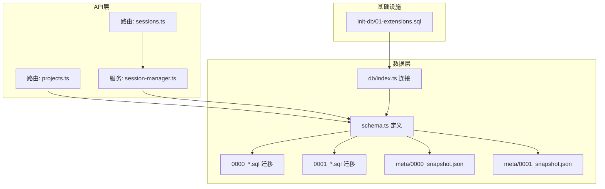
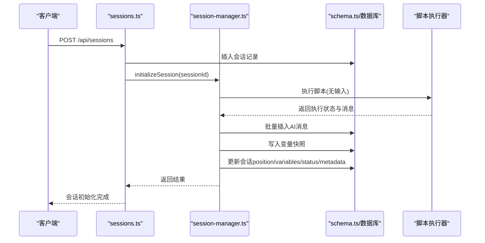
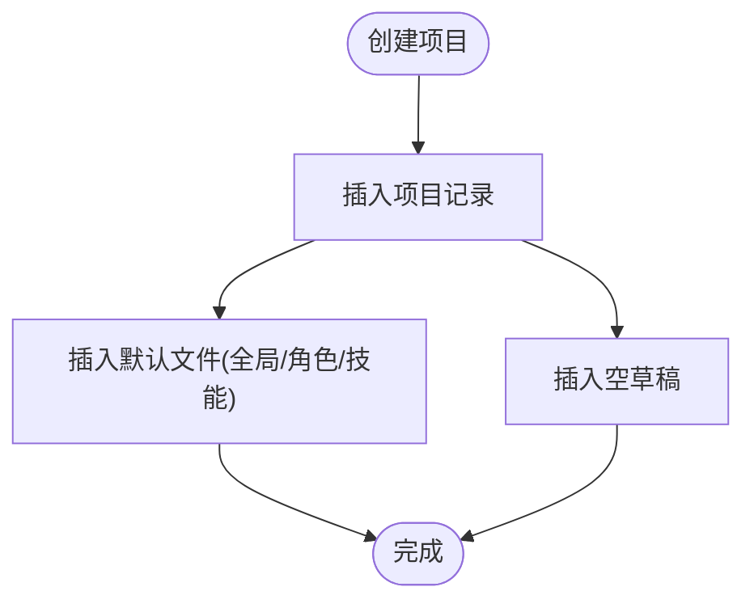
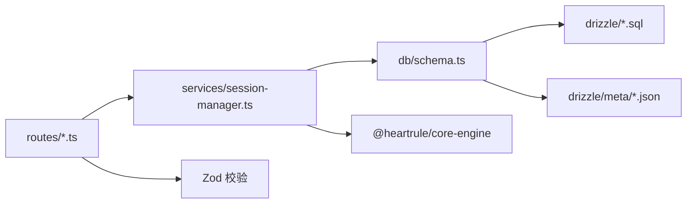

# 数据模型集成

<cite>
**本文引用的文件**
- [packages/api-server/src/db/schema.ts](file://packages/api-server/src/db/schema.ts)
- [packages/api-server/drizzle/meta/0000_snapshot.json](file://packages/api-server/drizzle/meta/0000_snapshot.json)
- [packages/api-server/drizzle/meta/0001_snapshot.json](file://packages/api-server/drizzle/meta/0001_snapshot.json)
- [packages/api-server/drizzle/0000_massive_young_avengers.sql](file://packages/api-server/drizzle/0000_massive_young_avengers.sql)
- [packages/api-server/drizzle/0001_dusty_iceman.sql](file://packages/api-server/drizzle/0001_dusty_iceman.sql)
- [packages/api-server/src/db/index.ts](file://packages/api-server/src/db/index.ts)
- [packages/api-server/src/route/sessions.ts](file://packages/api-server/src/routes/sessions.ts)
- [packages/api-server/src/routes/projects.ts](file://packages/api-server/src/routes/projects.ts)
- [packages/api-server/src/services/session-manager.ts](file://packages/api-server/src/services/session-manager.ts)
- [packages/api-server/src/utils/error-handler.ts](file://packages/api-server/src/utils/error-handler.ts)
- [scripts/init-db/01-extensions.sql](file://scripts/init-db/01-extensions.sql)
</cite>

## 目录
1. [引言](#引言)
2. [项目结构](#项目结构)
3. [核心组件](#核心组件)
4. [架构总览](#架构总览)
5. [详细组件分析](#详细组件分析)
6. [依赖分析](#依赖分析)
7. [性能考量](#性能考量)
8. [故障排查指南](#故障排查指南)
9. [结论](#结论)
10. [附录](#附录)

## 引言
本文件面向HeartRule AI咨询引擎的数据模型集成，系统性梳理数据库Schema、表间关系与关联设计，重点覆盖会话-消息、项目-文件、项目-版本等核心关系；深入阐释JSONB字段在复杂数据结构存储中的应用与查询策略；并提供扩展性、版本演进与向后兼容性保障方案，以及数据完整性、事务处理与并发控制机制的实践建议。

## 项目结构
- 数据层采用Drizzle ORM for PostgreSQL 16，通过TypeScript定义Schema，并以SQL迁移脚本与元数据快照维护演进。
- API层通过Fastify路由对接数据库，会话管理服务封装脚本执行与状态持久化。
- 初始化脚本启用必要PostgreSQL扩展，确保UUID生成、加密与全文检索能力。



**图表来源**
- [packages/api-server/src/db/schema.ts](file://packages/api-server/src/db/schema.ts#L1-L219)
- [packages/api-server/src/db/index.ts](file://packages/api-server/src/db/index.ts#L1-L26)
- [packages/api-server/drizzle/0000_massive_young_avengers.sql](file://packages/api-server/drizzle/0000_massive_young_avengers.sql#L1-L130)
- [packages/api-server/drizzle/0001_dusty_iceman.sql](file://packages/api-server/drizzle/0001_dusty_iceman.sql#L1-L90)
- [packages/api-server/drizzle/meta/0000_snapshot.json](file://packages/api-server/drizzle/meta/0000_snapshot.json#L1-L533)
- [packages/api-server/drizzle/meta/0001_snapshot.json](file://packages/api-server/drizzle/meta/0001_snapshot.json#L1-L959)
- [scripts/init-db/01-extensions.sql](file://scripts/init-db/01-extensions.sql#L1-L17)

**章节来源**
- [packages/api-server/src/db/schema.ts](file://packages/api-server/src/db/schema.ts#L1-L219)
- [packages/api-server/src/db/index.ts](file://packages/api-server/src/db/index.ts#L1-L26)
- [scripts/init-db/01-extensions.sql](file://scripts/init-db/01-extensions.sql#L1-L17)

## 核心组件
- 会话与消息：会话表记录用户、脚本、执行位置与变量快照；消息表按会话组织，支持时间排序与角色区分。
- 脚本与变量：脚本表存储YAML与解析后的JSONB结构；变量表以JSONB快照记录会话变量变更。
- 工程与文件：工程表承载版本与元数据；文件表按类型组织脚本文件；版本表记录发布历史与回滚标记。
- 记忆模块：记忆表支持按类型与重要度索引，便于检索与统计。

**章节来源**
- [packages/api-server/src/db/schema.ts](file://packages/api-server/src/db/schema.ts#L22-L198)

## 架构总览
下图展示数据模型在API与服务层的交互路径，突出会话-消息、项目-文件、项目-版本的主从关系与JSONB字段的使用。

```mermaid
erDiagram
SESSIONS ||--o{ MESSAGES : "拥有"
SCRIPTS ||--o{ SESSIONS : "被引用"
PROJECTS ||--o{ SCRIPT_FILES : "拥有"
PROJECTS ||--o{ PROJECT_VERSIONS : "拥有"
PROJECTS ||--o{ PROJECT_DRAFTS : "拥有"
SESSIONS {
uuid id PK
string user_id
uuid script_id FK
enum status
enum execution_status
jsonb position
jsonb variables
jsonb metadata
timestamp created_at
timestamp updated_at
timestamp completed_at
}
MESSAGES {
uuid id PK
uuid session_id FK
enum role
text content
string action_id
jsonb metadata
timestamp timestamp
}
SCRIPTS {
uuid id PK
string script_name UK
enum script_type
text script_content
jsonb parsed_content
string version
enum status
string author
text description
jsonb tags
timestamp created_at
timestamp updated_at
}
PROJECTS {
uuid id PK
string project_name
text description
string engine_version
string engine_version_min
uuid current_version_id
enum status
string author
jsonb tags
jsonb metadata
timestamp created_at
timestamp updated_at
}
SCRIPT_FILES {
uuid id PK
uuid project_id FK
enum file_type
string file_name
jsonb file_content
text yaml_content
timestamp created_at
timestamp updated_at
}
PROJECT_VERSIONS {
uuid id PK
uuid project_id FK
string version_number
jsonb version_files
text release_note
string is_rollback
uuid rollback_from_version_id
timestamp published_at
string published_by
}
PROJECT_DRAFTS {
uuid project_id PK(FK)
jsonb draft_files
enum validation_status
jsonb validation_errors
timestamp updated_at
string updated_by
}
VARIABLES {
uuid id PK
uuid session_id FK
string variable_name
jsonb value
enum scope
string value_type
string source
timestamp created_at
timestamp updated_at
}
MEMORIES {
uuid id PK
uuid session_id FK
text content
string memory_type
string importance
jsonb metadata
timestamp created_at
timestamp accessed_at
string access_count
}
```

**图表来源**
- [packages/api-server/src/db/schema.ts](file://packages/api-server/src/db/schema.ts#L22-L198)
- [packages/api-server/drizzle/meta/0000_snapshot.json](file://packages/api-server/drizzle/meta/0000_snapshot.json#L6-L533)
- [packages/api-server/drizzle/meta/0001_snapshot.json](file://packages/api-server/drizzle/meta/0001_snapshot.json#L6-L959)

## 详细组件分析

### 会话-消息关系与JSONB应用
- 关系设计：会话表与消息表为典型的一对多；消息外键指向会话，删除会话时级联删除消息，保证数据一致性。
- JSONB字段：会话position、variables、metadata，消息metadata均采用JSONB存储，便于动态结构扩展与灵活查询。
- 查询策略：按会话ID与时间戳索引进行高效检索；消息角色枚举限定取值范围，提升查询与展示效率。
- 业务流程：会话初始化与用户输入处理均通过服务层调用脚本执行器，批量写入AI消息，随后原子性更新会话状态与变量快照。



**图表来源**
- [packages/api-server/src/routes/sessions.ts](file://packages/api-server/src/routes/sessions.ts#L15-L133)
- [packages/api-server/src/services/session-manager.ts](file://packages/api-server/src/services/session-manager.ts#L73-L255)
- [packages/api-server/src/db/schema.ts](file://packages/api-server/src/db/schema.ts#L22-L58)

**章节来源**
- [packages/api-server/src/routes/sessions.ts](file://packages/api-server/src/routes/sessions.ts#L15-L133)
- [packages/api-server/src/services/session-manager.ts](file://packages/api-server/src/services/session-manager.ts#L73-L255)
- [packages/api-server/src/db/schema.ts](file://packages/api-server/src/db/schema.ts#L22-L58)

### 项目-文件与项目-版本关系
- 关系设计：项目表与文件表、版本表均为一对多；草稿表一对一绑定项目，形成“项目-草稿”关系。
- JSONB字段：文件内容与版本文件均以JSONB存储，便于脚本结构的灵活表达与版本归档。
- 查询策略：按项目ID索引快速聚合文件数量与版本列表；支持按发布时间倒序排列，便于追踪演进。
- 生命周期：创建项目时自动生成默认文件与空草稿；复制工程时同步复制文件与草稿，保持一致性。



**图表来源**
- [packages/api-server/src/routes/projects.ts](file://packages/api-server/src/routes/projects.ts#L132-L193)
- [packages/api-server/src/db/schema.ts](file://packages/api-server/src/db/schema.ts#L86-L156)

**章节来源**
- [packages/api-server/src/routes/projects.ts](file://packages/api-server/src/routes/projects.ts#L27-L130)
- [packages/api-server/src/db/schema.ts](file://packages/api-server/src/db/schema.ts#L86-L156)

### JSONB字段的设计与查询策略
- 设计要点
  - 会话position：存储当前阶段/主题/动作索引，配合脚本解析内容生成完整ID信息，便于UI导航与审计。
  - 会话variables与脚本parsed_content：分别存储运行时变量与解析后的脚本结构，支持动态扩展与跨版本兼容。
  - 文件与版本文件：以JSONB承载复杂脚本结构，避免强约束带来的迁移成本。
- 查询策略
  - 使用索引列（如session_id、timestamp、file_type、status）加速过滤与排序。
  - 对JSONB字段采用条件过滤与展开查询，结合Zod校验与Drizzle ORM类型推断，确保安全与性能平衡。
- 兼容性
  - 通过默认值与类型声明（如position、tags、metadata）保证新字段的向后兼容。
  - 版本号字段与回滚标记字段用于版本演进追踪与回退。

**章节来源**
- [packages/api-server/src/db/schema.ts](file://packages/api-server/src/db/schema.ts#L22-L198)
- [packages/api-server/drizzle/meta/0000_snapshot.json](file://packages/api-server/drizzle/meta/0000_snapshot.json#L101-L177)
- [packages/api-server/drizzle/meta/0001_snapshot.json](file://packages/api-server/drizzle/meta/0001_snapshot.json#L196-L355)

### 数据完整性、事务与并发控制
- 外键与级联
  - 消息与变量均对会话表设置外键并启用级联删除，确保会话生命周期内数据一致。
  - 工程草稿、版本、文件均对工程表设置外键并级联删除，避免悬挂数据。
- 事务与原子性
  - 会话初始化与用户输入处理在服务层内顺序执行多条写操作，建议在关键路径上使用事务包裹，确保消息、变量快照与会话状态的原子更新。
- 并发控制
  - 建议在高并发场景下引入乐观锁或行级锁，针对会话状态更新与变量写入增加冲突重试逻辑。
  - 对热点查询（如消息历史、变量快照）使用只读事务与缓存策略降低数据库压力。

**章节来源**
- [packages/api-server/src/db/schema.ts](file://packages/api-server/src/db/schema.ts#L45-L176)
- [packages/api-server/src/services/session-manager.ts](file://packages/api-server/src/services/session-manager.ts#L192-L217)

## 依赖分析
- 组件耦合
  - 路由层依赖数据库Schema与会话管理服务；服务层依赖脚本执行器与数据库连接。
  - Schema定义贯穿迁移脚本与元数据快照，确保数据库结构与代码一致。
- 外部依赖
  - Drizzle ORM驱动PostgreSQL；YAML解析用于脚本内容转换；Zod用于请求参数校验。
- 潜在风险
  - JSONB字段滥用可能导致查询性能下降，需结合索引与查询模式优化。
  - 外键级联删除在大批量数据场景可能引发长事务，应评估拆分删除策略。



**图表来源**
- [packages/api-server/src/routes/sessions.ts](file://packages/api-server/src/routes/sessions.ts#L1-L548)
- [packages/api-server/src/routes/projects.ts](file://packages/api-server/src/routes/projects.ts#L1-L500)
- [packages/api-server/src/services/session-manager.ts](file://packages/api-server/src/services/session-manager.ts#L1-L466)
- [packages/api-server/src/db/schema.ts](file://packages/api-server/src/db/schema.ts#L1-L219)

**章节来源**
- [packages/api-server/src/routes/sessions.ts](file://packages/api-server/src/routes/sessions.ts#L1-L548)
- [packages/api-server/src/routes/projects.ts](file://packages/api-server/src/routes/projects.ts#L1-L500)
- [packages/api-server/src/services/session-manager.ts](file://packages/api-server/src/services/session-manager.ts#L1-L466)

## 性能考量
- 索引策略
  - 会话：按user_id、status、created_at建立索引，支持用户会话列表与状态筛选。
  - 消息：按session_id与timestamp建立索引，满足消息历史查询与排序。
  - 工程：按status、author、name建立索引，提升搜索与筛选效率。
  - 文件与版本：按project_id与published_at建立索引，便于版本列表与归档检索。
- JSONB查询
  - 对常用字段建立GIN/GIST索引（如tags、metadata），提升模糊匹配与数组查询性能。
  - 控制JSONB深度与大小，避免超大对象影响IO与序列化开销。
- 缓存与批处理
  - 将高频读取的脚本解析结果与会话元数据放入缓存层，减少数据库访问。
  - 批量写入消息与变量快照，降低事务提交次数。

[本节为通用性能指导，不直接分析具体文件]

## 故障排查指南
- 错误分类与映射
  - 基于错误消息关键字匹配预设映射，自动确定错误码、类型与HTTP状态。
  - 提供恢复建议（是否可重试、重试动作与建议），辅助前端提示与用户引导。
- 日志与上下文
  - 统一记录错误堆栈与上下文（脚本ID/名称、会话ID、位置信息、时间戳），便于定位问题。
- 常见问题
  - 会话不存在：检查会话ID与脚本ID有效性，确认会话未过期。
  - 脚本解析失败：检查YAML语法与结构，确保解析后JSONB字段有效。
  - LLM服务不可用：检查网络连通性与服务可用性，按恢复建议重试。

**章节来源**
- [packages/api-server/src/utils/error-handler.ts](file://packages/api-server/src/utils/error-handler.ts#L22-L181)
- [packages/api-server/src/services/session-manager.ts](file://packages/api-server/src/services/session-manager.ts#L237-L254)

## 结论
本数据模型以Drizzle ORM为桥梁，围绕会话-消息、项目-文件、项目-版本三大主线，结合JSONB的灵活性与索引策略，实现了复杂脚本与动态数据的高效存储与查询。通过外键级联、事务与并发控制机制，保障了数据一致性与可靠性。建议在后续演进中持续优化索引与查询模式，强化事务边界与缓存策略，以应对更高并发与更大规模的数据增长。

## 附录
- 初始化与扩展
  - 初始化脚本启用uuid-ossp、pgcrypto、pg_trgm等扩展，为唯一标识、加密与全文检索提供基础能力。
- 迁移与快照
  - 迁移脚本与元数据快照共同维护Schema演进，确保本地与生产环境结构一致。

**章节来源**
- [scripts/init-db/01-extensions.sql](file://scripts/init-db/01-extensions.sql#L1-L17)
- [packages/api-server/drizzle/0000_massive_young_avengers.sql](file://packages/api-server/drizzle/0000_massive_young_avengers.sql#L1-L130)
- [packages/api-server/drizzle/0001_dusty_iceman.sql](file://packages/api-server/drizzle/0001_dusty_iceman.sql#L1-L90)
- [packages/api-server/drizzle/meta/0000_snapshot.json](file://packages/api-server/drizzle/meta/0000_snapshot.json#L1-L533)
- [packages/api-server/drizzle/meta/0001_snapshot.json](file://packages/api-server/drizzle/meta/0001_snapshot.json#L1-L959)