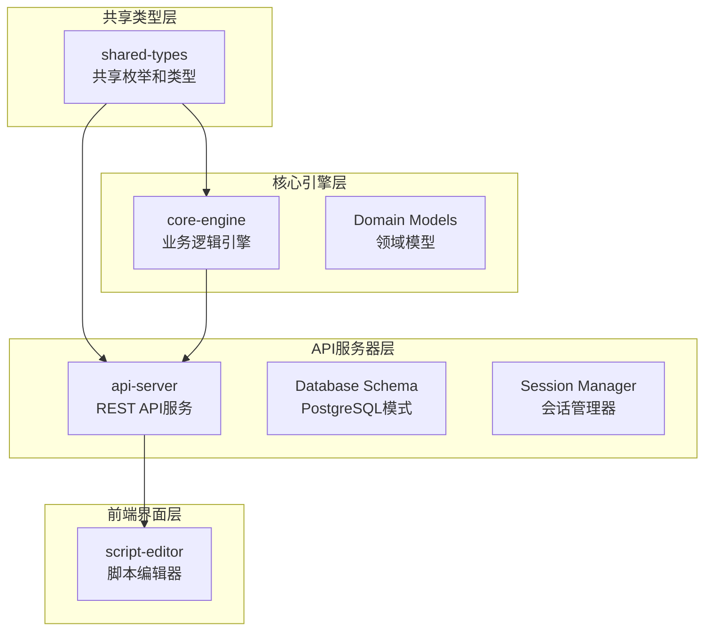
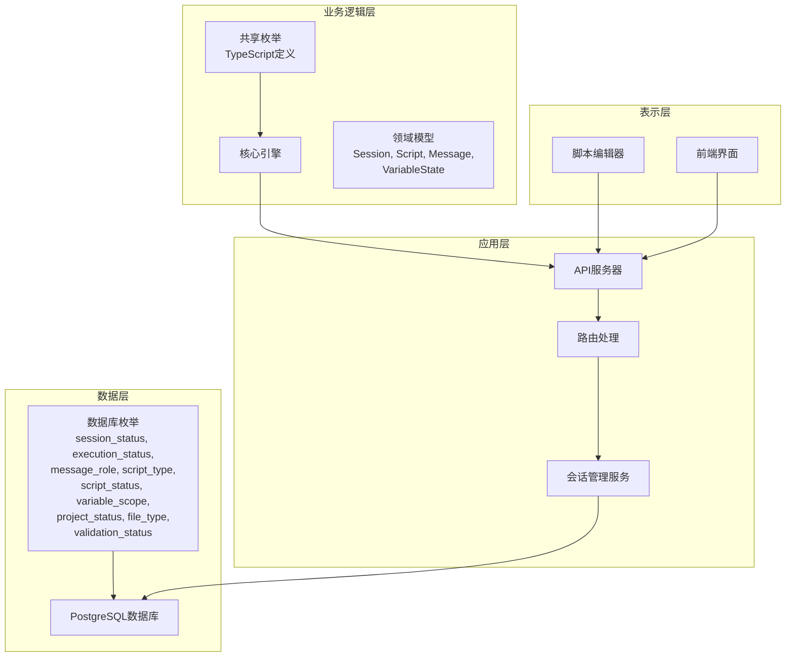
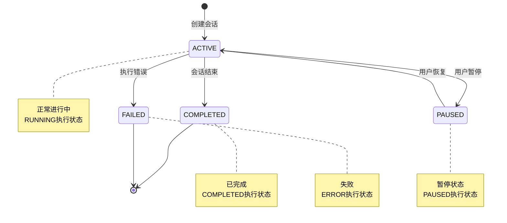
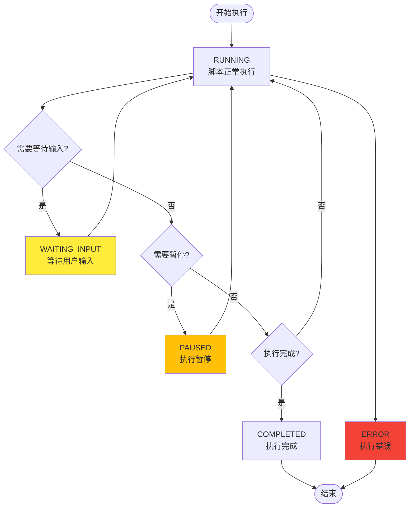
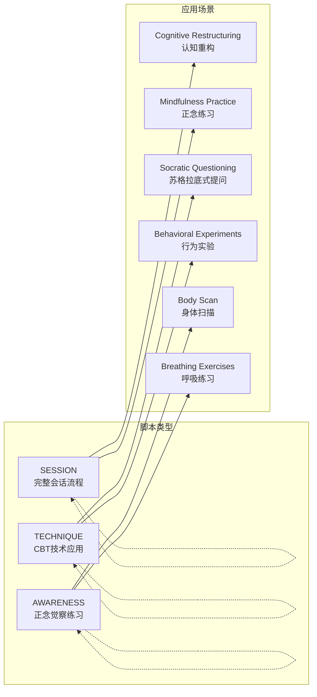
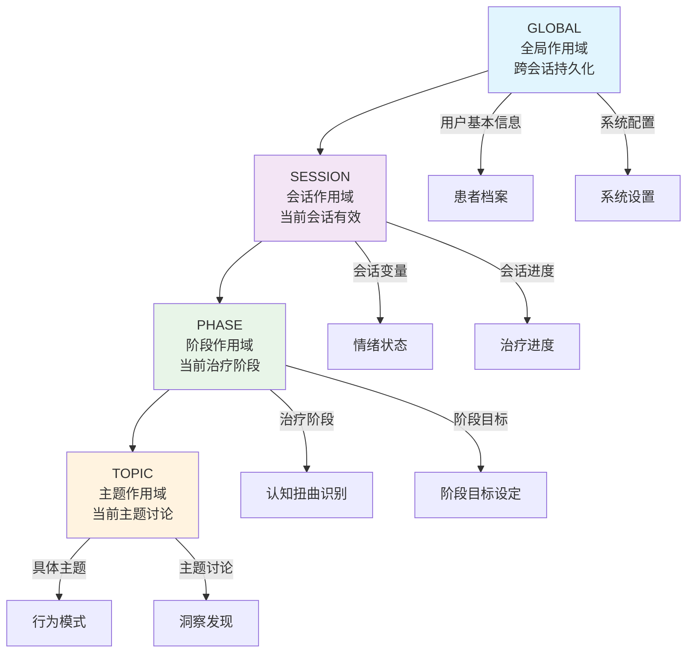
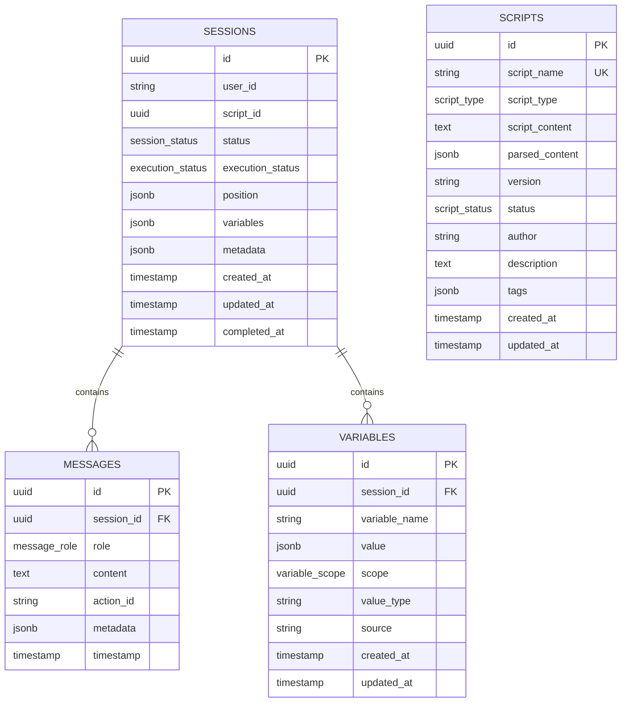
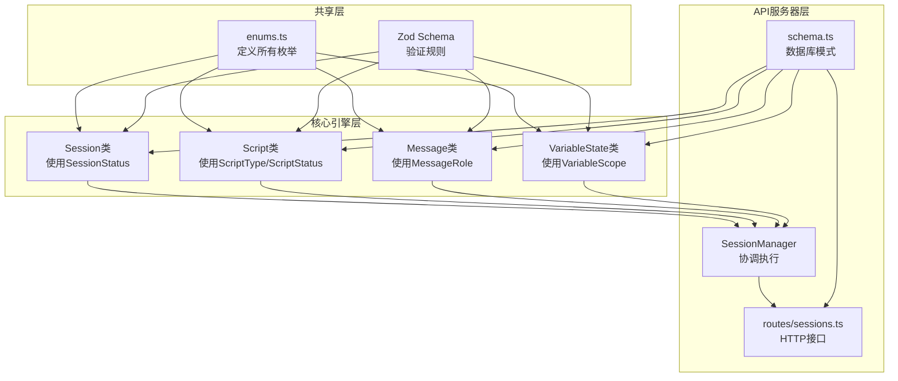

# 枚举类型定义

<cite>
**本文档引用的文件**
- [packages/shared-types/src/enums.ts](file://packages/shared-types/src/enums.ts)
- [packages/api-server/src/db/schema.ts](file://packages/api-server/src/db/schema.ts)
- [packages/core-engine/src/domain/session.ts](file://packages/core-engine/src/domain/session.ts)
- [packages/core-engine/src/domain/script.ts](file://packages/core-engine/src/domain/script.ts)
- [packages/core-engine/src/domain/message.ts](file://packages/core-engine/src/domain/message.ts)
- [packages/core-engine/src/domain/variable.ts](file://packages/core-engine/src/domain/variable.ts)
- [packages/api-server/src/services/session-manager.ts](file://packages/api-server/src/services/session-manager.ts)
- [packages/api-server/src/routes/sessions.ts](file://packages/api-server/src/routes/sessions.ts)
</cite>

## 目录
1. [简介](#简介)
2. [项目结构](#项目结构)
3. [核心组件](#核心组件)
4. [架构概览](#架构概览)
5. [详细组件分析](#详细组件分析)
6. [依赖分析](#依赖分析)
7. [性能考虑](#性能考虑)
8. [故障排除指南](#故障排除指南)
9. [结论](#结论)

## 简介

HeartRule AI咨询引擎是一个基于YAML脚本的智能对话系统，专门用于认知行为疗法(CBT)的自动化咨询。该系统通过精心设计的枚举类型系统确保了业务逻辑的一致性和数据完整性。

本系统采用分层架构设计，将业务逻辑与数据持久化分离，通过共享类型包实现前后端代码的强类型一致性。枚举类型作为系统的核心数据结构，定义了会话状态、执行状态、消息角色、脚本类型等关键业务概念。

## 项目结构

系统采用多包架构，主要包含以下核心模块：



**图表来源**
- [packages/shared-types/src/index.ts](file://packages/shared-types/src/index.ts#L1-L19)
- [packages/core-engine/src/index.ts](file://packages/core-engine/src/index.ts)
- [packages/api-server/src/app.ts](file://packages/api-server/src/app.ts)

**章节来源**
- [packages/shared-types/src/index.ts](file://packages/shared-types/src/index.ts#L1-L19)
- [packages/core-engine/src/index.ts](file://packages/core-engine/src/index.ts)
- [packages/api-server/src/app.ts](file://packages/api-server/src/app.ts)

## 核心组件

系统定义了8个核心枚举类型，每个都承载着特定的业务含义和约束规则：

### 会话状态枚举 (SessionStatus)
- **ACTIVE**: 活跃状态，会话正常进行中
- **PAUSED**: 暂停状态，会话被暂停但可恢复
- **COMPLETED**: 完成状态，会话已结束
- **FAILED**: 失败状态，会话执行过程中发生错误

### 执行状态枚举 (ExecutionStatus)
- **RUNNING**: 运行中，脚本正在执行
- **WAITING_INPUT**: 等待输入，需要用户输入才能继续
- **PAUSED**: 暂停，执行被暂停
- **COMPLETED**: 完成，脚本执行完毕
- **ERROR**: 错误，执行过程中出现异常

### 消息角色枚举 (MessageRole)
- **USER**: 用户消息，来自咨询者的输入
- **ASSISTANT**: 助手消息，来自AI系统的回复
- **SYSTEM**: 系统消息，系统内部生成的消息

### 脚本类型枚举 (ScriptType)
- **SESSION**: 会话脚本，定义完整的咨询流程
- **TECHNIQUE**: 技术脚本，定义具体的CBT技术应用
- **AWARENESS**: 觉察脚本，专注于正念和觉察练习

### 脚本状态枚举 (ScriptStatus)
- **DRAFT**: 草稿状态，脚本尚未发布
- **PUBLISHED**: 已发布状态，脚本可供使用
- **ARCHIVED**: 归档状态，脚本已停止使用但仍保留

### 变量作用域枚举 (VariableScope)
- **GLOBAL**: 全局作用域，跨会话持久化的变量
- **SESSION**: 会话作用域，仅在当前会话有效
- **PHASE**: 阶段作用域，仅在当前治疗阶段有效
- **TOPIC**: 主题作用域，仅在当前主题讨论中有效

### 项目状态枚举 (ProjectStatus)
- **DRAFT**: 项目草稿，未完成的状态
- **PUBLISHED**: 项目发布，已完成并可使用
- **ARCHIVED**: 项目归档，停止使用

### 文件类型枚举 (FileType)
- **GLOBAL**: 全局文件，系统级别的配置文件
- **ROLES**: 角色文件，定义AI角色和技能
- **SKILLS**: 技能文件，定义CBT技术技能
- **FORMS**: 表单文件，定义评估和记录表单
- **RULES**: 规则文件，定义治疗规则和约束
- **SESSION**: 会话文件，具体的咨询会话脚本

### 验证状态枚举 (ValidationStatus)
- **VALID**: 验证通过，文件内容符合规范
- **INVALID**: 验证失败，文件内容存在错误
- **UNKNOWN**: 未知状态，尚未进行验证或验证中

**章节来源**
- [packages/shared-types/src/enums.ts](file://packages/shared-types/src/enums.ts#L1-L118)
- [packages/api-server/src/db/schema.ts](file://packages/api-server/src/db/schema.ts#L8-L17)

## 架构概览

系统采用分层架构，枚举类型在各个层次中发挥着重要作用：



**图表来源**
- [packages/api-server/src/db/schema.ts](file://packages/api-server/src/db/schema.ts#L8-L17)
- [packages/shared-types/src/enums.ts](file://packages/shared-types/src/enums.ts#L1-L118)
- [packages/core-engine/src/domain/session.ts](file://packages/core-engine/src/domain/session.ts#L1-L137)

## 详细组件分析

### 会话状态管理系统

会话状态管理是整个系统的核心，负责跟踪咨询会话的生命周期：



**图表来源**
- [packages/core-engine/src/domain/session.ts](file://packages/core-engine/src/domain/session.ts#L49-L93)
- [packages/api-server/src/services/session-manager.ts](file://packages/api-server/src/services/session-manager.ts#L202-L216)

会话状态转换遵循严格的业务规则：
- 新创建的会话默认为ACTIVE状态，执行状态为RUNNING
- 用户可以主动暂停会话，系统将其标记为PAUSED
- 暂停后用户可以恢复会话，状态回到ACTIVE
- 会话正常结束时标记为COMPLETED
- 执行过程中发生错误时标记为FAILED

**章节来源**
- [packages/core-engine/src/domain/session.ts](file://packages/core-engine/src/domain/session.ts#L46-L93)
- [packages/api-server/src/services/session-manager.ts](file://packages/api-server/src/services/session-manager.ts#L202-L216)

### 执行状态流程

执行状态反映了脚本执行的具体阶段：



**图表来源**
- [packages/shared-types/src/enums.ts](file://packages/shared-types/src/enums.ts#L16-L22)
- [packages/api-server/src/services/session-manager.ts](file://packages/api-server/src/services/session-manager.ts#L326-L336)

执行状态转换的关键点：
- WAITING_INPUT状态用于处理需要用户交互的步骤
- PAUSED状态支持临时中断和恢复机制
- ERROR状态提供错误处理和恢复能力

**章节来源**
- [packages/shared-types/src/enums.ts](file://packages/shared-types/src/enums.ts#L16-L22)
- [packages/api-server/src/services/session-manager.ts](file://packages/api-server/src/services/session-manager.ts#L326-L336)

### 消息角色分类

消息系统通过角色枚举区分不同类型的消息：

```mermaid
classDiagram
class Message {
+string messageId
+string sessionId
+MessageRole role
+string content
+string actionId
+Map metadata
+Date timestamp
}
class MessageRole {
<<enumeration>>
USER
ASSISTANT
SYSTEM
}
Message --> MessageRole : uses
note for Message : "消息实体定义"
note for MessageRole : "消息角色枚举"
note for USER : "用户输入的消息"
note for ASSISTANT : "AI助手回复"
note for SYSTEM : "系统内部消息"
```

**图表来源**
- [packages/core-engine/src/domain/message.ts](file://packages/core-engine/src/domain/message.ts#L7-L32)
- [packages/shared-types/src/enums.ts](file://packages/shared-types/src/enums.ts#L27-L31)

消息角色的应用场景：
- USER角色用于存储用户的实际输入
- ASSISTANT角色用于AI系统的回复内容
- SYSTEM角色用于系统内部生成的提示信息

**章节来源**
- [packages/core-engine/src/domain/message.ts](file://packages/core-engine/src/domain/message.ts#L1-L49)
- [packages/shared-types/src/enums.ts](file://packages/shared-types/src/enums.ts#L27-L31)

### 脚本类型体系

脚本类型定义了不同类型咨询内容的组织方式：



**图表来源**
- [packages/shared-types/src/enums.ts](file://packages/shared-types/src/enums.ts#L36-L40)
- [packages/core-engine/src/domain/script.ts](file://packages/core-engine/src/domain/script.ts#L7-L47)

脚本类型的设计原则：
- SESSION类型定义完整的咨询流程
- TECHNIQUE类型专注于特定CBT技术的实施
- AWARENESS类型关注正念和觉察练习

**章节来源**
- [packages/shared-types/src/enums.ts](file://packages/shared-types/src/enums.ts#L36-L40)
- [packages/core-engine/src/domain/script.ts](file://packages/core-engine/src/domain/script.ts#L1-L95)

### 变量作用域管理

变量作用域控制着数据的生命周期和可见性：



**图表来源**
- [packages/shared-types/src/enums.ts](file://packages/shared-types/src/enums.ts#L54-L59)
- [packages/core-engine/src/domain/variable.ts](file://packages/core-engine/src/domain/variable.ts#L15-L49)

变量作用域的管理策略：
- GLOBAL作用域用于需要跨会话访问的数据
- SESSION作用域管理单次咨询的临时数据
- PHASE和TOPIC作用域支持CBT治疗的层次化管理

**章节来源**
- [packages/shared-types/src/enums.ts](file://packages/shared-types/src/enums.ts#L54-L59)
- [packages/core-engine/src/domain/variable.ts](file://packages/core-engine/src/domain/variable.ts#L1-L120)

### 数据库枚举映射

系统在数据库层面也实现了对应的枚举类型，确保数据一致性和约束完整性：



**图表来源**
- [packages/api-server/src/db/schema.ts](file://packages/api-server/src/db/schema.ts#L22-L176)

数据库枚举的优势：
- 强制数据完整性约束
- 提高查询性能和索引效率
- 支持数据库层面的业务规则验证
- 简化复杂查询和数据分析

**章节来源**
- [packages/api-server/src/db/schema.ts](file://packages/api-server/src/db/schema.ts#L8-L17)
- [packages/api-server/src/db/schema.ts](file://packages/api-server/src/db/schema.ts#L22-L176)

## 依赖分析

系统中枚举类型的依赖关系展现了清晰的分层架构：



**图表来源**
- [packages/shared-types/src/enums.ts](file://packages/shared-types/src/enums.ts#L1-L118)
- [packages/core-engine/src/domain/session.ts](file://packages/core-engine/src/domain/session.ts#L1-L137)
- [packages/core-engine/src/domain/script.ts](file://packages/core-engine/src/domain/script.ts#L1-L95)
- [packages/core-engine/src/domain/message.ts](file://packages/core-engine/src/domain/message.ts#L1-L49)
- [packages/core-engine/src/domain/variable.ts](file://packages/core-engine/src/domain/variable.ts#L1-L120)
- [packages/api-server/src/services/session-manager.ts](file://packages/api-server/src/services/session-manager.ts#L1-L462)
- [packages/api-server/src/routes/sessions.ts](file://packages/api-server/src/routes/sessions.ts#L1-L548)
- [packages/api-server/src/db/schema.ts](file://packages/api-server/src/db/schema.ts#L1-L219)

依赖关系的特点：
- 所有层都依赖于共享的枚举定义
- 核心引擎层直接使用枚举进行业务逻辑控制
- API服务器层通过会话管理器协调枚举的使用
- 数据库层通过pgEnum确保数据一致性

**章节来源**
- [packages/shared-types/src/enums.ts](file://packages/shared-types/src/enums.ts#L1-L118)
- [packages/api-server/src/db/schema.ts](file://packages/api-server/src/db/schema.ts#L1-L219)

## 性能考虑

枚举类型在系统性能方面发挥着重要作用：

### 存储优化
- 枚举类型在数据库中以整数形式存储，比字符串更节省空间
- 支持索引优化，提高查询性能
- 减少数据冗余，避免字符串重复存储

### 查询优化
- 枚举字段支持高效的WHERE过滤
- 可以创建复合索引优化常用查询模式
- 支持枚举间的快速比较操作

### 内存优化
- TypeScript枚举在编译时转换为数字常量
- 减少运行时内存分配
- 提供编译时类型检查，避免运行时错误

## 故障排除指南

### 常见枚举相关问题

**问题1：枚举值不匹配**
- 症状：数据库操作时报错，提示枚举值无效
- 解决方案：检查枚举定义是否与数据库模式一致
- 预防措施：使用Zod验证确保运行时数据正确

**问题2：状态转换异常**
- 症状：会话状态无法正常转换
- 解决方案：检查状态转换逻辑，确保遵循业务规则
- 预防措施：添加状态转换前的验证检查

**问题3：作用域冲突**
- 症状：变量在不同作用域间访问异常
- 解决方案：明确变量的作用域边界，避免跨作用域访问
- 预防措施：建立变量访问权限控制机制

**章节来源**
- [packages/api-server/src/utils/error-handler.ts](file://packages/api-server/src/utils/error-handler.ts#L1-L17)
- [packages/api-server/src/services/session-manager.ts](file://packages/api-server/src/services/session-manager.ts#L235-L252)

### 调试技巧

1. **启用详细日志**：在会话管理器中添加枚举状态的详细日志输出
2. **使用类型检查**：利用TypeScript的编译时检查发现枚举使用错误
3. **单元测试**：为枚举转换逻辑编写测试用例
4. **数据库监控**：监控枚举字段的使用频率和性能表现

## 结论

HeartRule AI咨询引擎的枚举类型系统展现了优秀的软件架构设计：

### 设计优势
- **强类型安全**：通过TypeScript枚举提供编译时类型检查
- **数据完整性**：数据库枚举确保数据的一致性和约束性
- **业务一致性**：统一的枚举定义保证各层间业务逻辑的一致
- **可维护性**：集中式的枚举管理简化了代码维护

### 架构特点
- **分层清晰**：枚举定义位于共享层，被多层使用
- **职责分离**：每种枚举都有明确的业务职责和使用范围
- **扩展性强**：枚举系统支持未来业务需求的变化
- **性能友好**：数据库枚举优化了存储和查询性能

### 最佳实践
- 在所有业务逻辑中优先使用枚举而非原始字符串
- 建立完善的枚举使用规范和文档
- 实施枚举变更的版本控制和兼容性检查
- 定期审查枚举定义以适应业务发展需要

这个枚举类型系统为HeartRule AI咨询引擎提供了坚实的基础，确保了系统的可靠性、可维护性和扩展性，为后续的功能开发奠定了良好的技术基础。