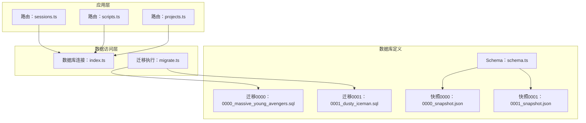
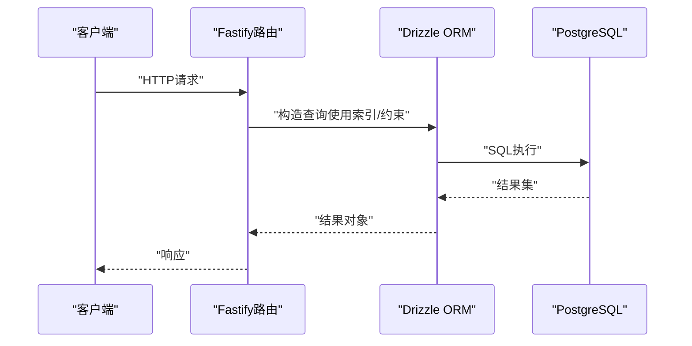
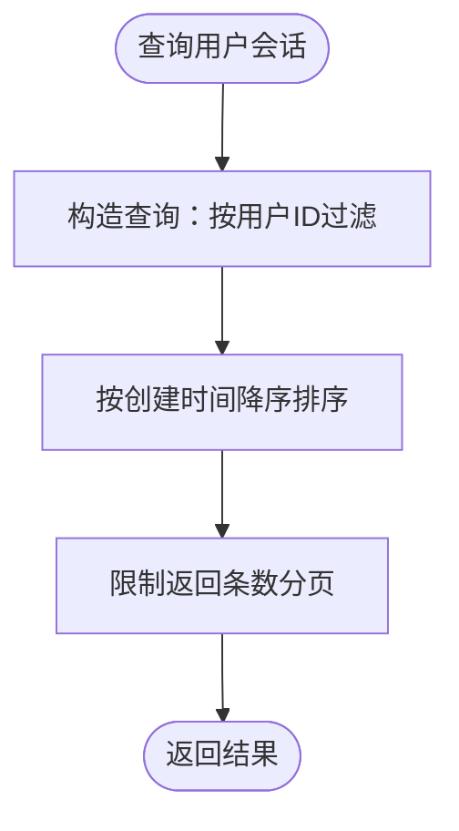
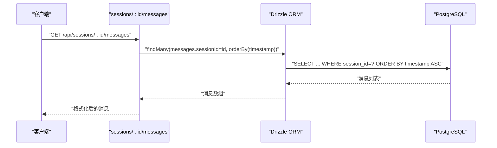
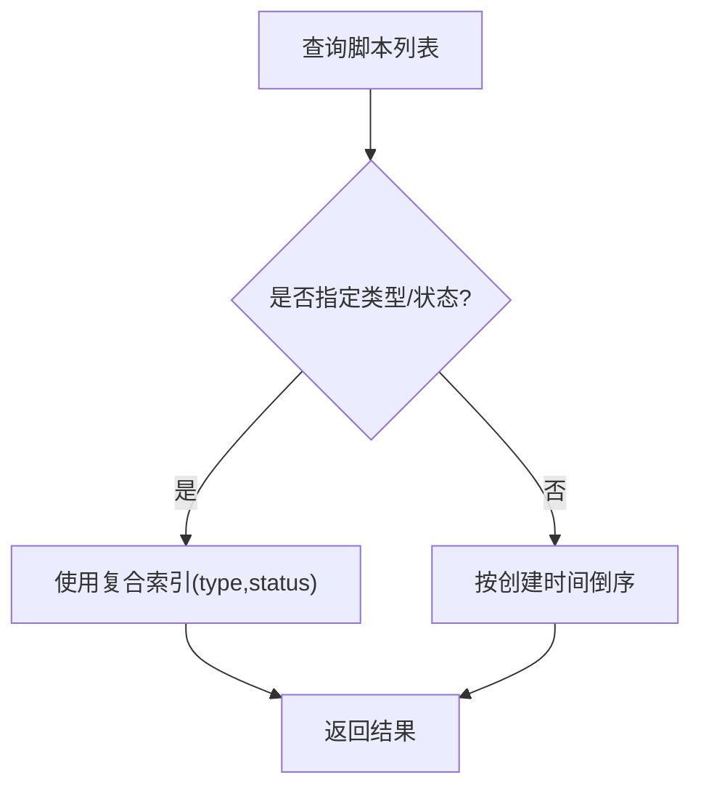
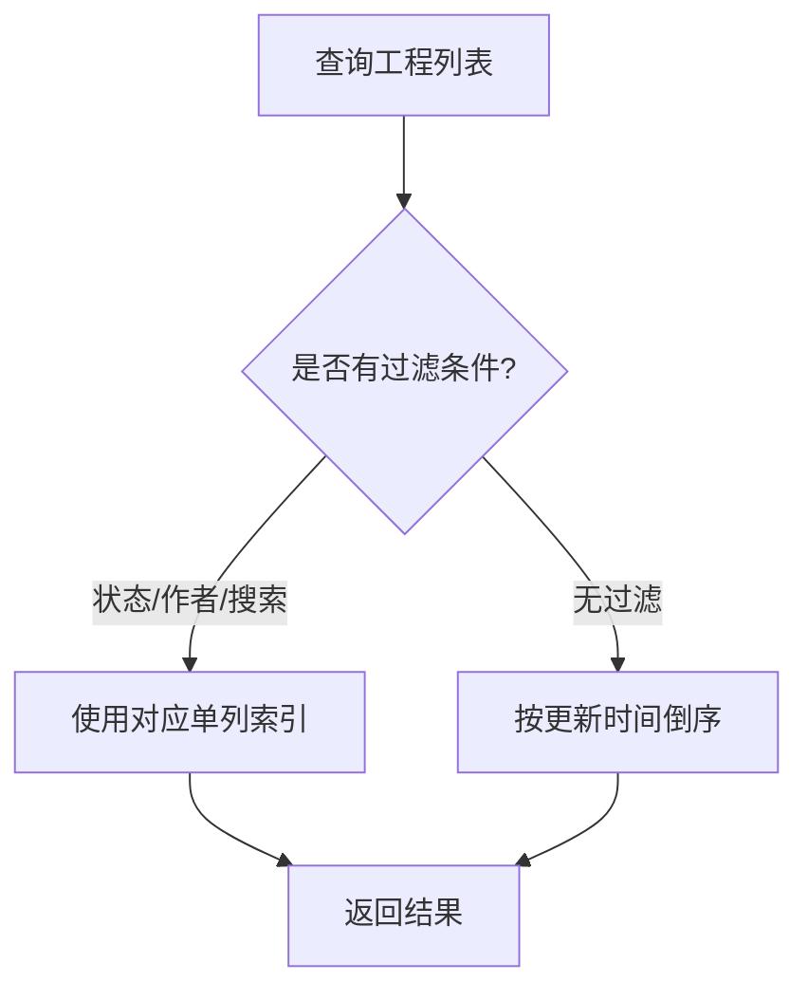
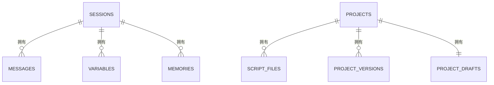

# 索引与约束设计

<cite>
**本文引用的文件**
- [schema.ts](file://packages/api-server/src/db/schema.ts)
- [0000_massive_young_avengers.sql](file://packages/api-server/drizzle/0000_massive_young_avengers.sql)
- [0001_dusty_iceman.sql](file://packages/api-server/drizzle/0001_dusty_iceman.sql)
- [0000_snapshot.json](file://packages/api-server/drizzle/meta/0000_snapshot.json)
- [0001_snapshot.json](file://packages/api-server/drizzle/meta/0001_snapshot.json)
- [index.ts](file://packages/api-server/src/db/index.ts)
- [migrate.ts](file://packages/api-server/src/db/migrate.ts)
- [sessions.ts](file://packages/api-server/src/routes/sessions.ts)
- [scripts.ts](file://packages/api-server/src/routes/scripts.ts)
- [projects.ts](file://packages/api-server/src/routes/projects.ts)
</cite>

## 目录
1. [简介](#简介)
2. [项目结构](#项目结构)
3. [核心组件](#核心组件)
4. [架构总览](#架构总览)
5. [详细组件分析](#详细组件分析)
6. [依赖关系分析](#依赖关系分析)
7. [性能考量](#性能考量)
8. [故障排查指南](#故障排查指南)
9. [结论](#结论)
10. [附录](#附录)

## 简介
本文件系统化梳理 HeartRule AI 咨询引擎数据库的索引与约束设计，覆盖所有表的索引策略（单列与复合索引）、主键/外键/唯一/非空约束的使用场景与实现方式，以及 CASCADE 删除策略对数据一致性的保障机制。同时提供索引使用建议、查询性能优化技巧、数据库调优策略与索引维护成本分析及性能监控方法，帮助开发者在实际业务中高效、安全地使用数据库。

## 项目结构
数据库层采用 Drizzle ORM + PostgreSQL 16，通过迁移脚本与 JSON 快照文件描述表结构、索引与约束。应用层通过路由模块进行典型查询，驱动索引与约束的实际使用。

图表来源
- [sessions.ts](file://packages/api-server/src/routes/sessions.ts#L1-L548)
- [scripts.ts](file://packages/api-server/src/routes/scripts.ts#L1-L325)
- [projects.ts](file://packages/api-server/src/routes/projects.ts#L1-L500)
- [index.ts](file://packages/api-server/src/db/index.ts#L1-L26)
- [migrate.ts](file://packages/api-server/src/db/migrate.ts#L1-L23)
- [schema.ts](file://packages/api-server/src/db/schema.ts#L1-L219)
- [0000_massive_young_avengers.sql](file://packages/api-server/drizzle/0000_massive_young_avengers.sql#L1-L130)
- [0001_dusty_iceman.sql](file://packages/api-server/drizzle/0001_dusty_iceman.sql#L1-L90)
- [0000_snapshot.json](file://packages/api-server/drizzle/meta/0000_snapshot.json#L1-L533)
- [0001_snapshot.json](file://packages/api-server/drizzle/meta/0001_snapshot.json#L1-L959)

章节来源
- [schema.ts](file://packages/api-server/src/db/schema.ts#L1-L219)
- [0000_massive_young_avengers.sql](file://packages/api-server/drizzle/0000_massive_young_avengers.sql#L1-L130)
- [0001_dusty_iceman.sql](file://packages/api-server/drizzle/0001_dusty_iceman.sql#L1-L90)
- [0000_snapshot.json](file://packages/api-server/drizzle/meta/0000_snapshot.json#L1-L533)
- [0001_snapshot.json](file://packages/api-server/drizzle/meta/0001_snapshot.json#L1-L959)

## 核心组件
- 会话表 sessions：主键、多单列索引（用户ID、状态、创建时间），支持按用户与状态快速检索。
- 消息表 messages：主键、单列索引（会话ID、时间戳），支持按会话查询消息与按时间排序。
- 脚本表 scripts：主键、唯一约束（脚本名）、复合索引（类型+状态）、单列索引（名称），支持按类型/状态筛选与按名称精确查找。
- 工程表 projects：主键、多单列索引（状态、作者、名称），支持按状态/作者/名称检索。
- 脚本文件表 script_files：主键、单列索引（工程ID、文件类型），支持按工程与类型检索。
- 工程草稿表 project_drafts：主键（工程ID），外键指向 projects，CASCADE 删除。
- 工程版本表 project_versions：主键、单列索引（工程ID、发布时间），支持按工程与发布时间检索。
- 变量表 variables：主键、单列索引（会话ID、变量名），支持按会话与变量名检索。
- 记忆表 memories：主键、单列索引（会话ID、类型、重要性），支持按会话与类型/重要性检索。

章节来源
- [schema.ts](file://packages/api-server/src/db/schema.ts#L22-L219)
- [0000_massive_young_avengers.sql](file://packages/api-server/drizzle/0000_massive_young_avengers.sql#L37-L130)
- [0001_dusty_iceman.sql](file://packages/api-server/drizzle/0001_dusty_iceman.sql#L19-L90)
- [0000_snapshot.json](file://packages/api-server/drizzle/meta/0000_snapshot.json#L7-L471)
- [0001_snapshot.json](file://packages/api-server/drizzle/meta/0001_snapshot.json#L7-L959)

## 架构总览
数据库层通过 Drizzle ORM 定义表结构与索引，迁移脚本与快照文件确保结构演进可追踪；应用层路由基于这些索引与约束进行查询与写入，形成“定义—迁移—使用”的闭环。

图表来源
- [sessions.ts](file://packages/api-server/src/routes/sessions.ts#L15-L133)
- [scripts.ts](file://packages/api-server/src/routes/scripts.ts#L14-L85)
- [projects.ts](file://packages/api-server/src/routes/projects.ts#L28-L85)
- [index.ts](file://packages/api-server/src/db/index.ts#L10-L20)

## 详细组件分析

### 会话表 sessions
- 主键：UUID，默认随机生成。
- 非空约束：用户ID、脚本ID、状态、执行状态、位置、变量、元数据、创建/更新时间等。
- 单列索引：
  - 用户ID索引：支持按用户ID快速检索其会话列表。
  - 状态索引：支持按状态筛选活跃/暂停/完成会话。
  - 创建时间索引：支持按时间倒序分页或统计。
- 外键：无显式外键（但业务上依赖脚本存在性）。
- 查询优化点：路由按用户ID与创建时间排序，索引可满足高效分页与筛选。

图表来源
- [sessions.ts](file://packages/api-server/src/routes/sessions.ts#L533-L536)

章节来源
- [schema.ts](file://packages/api-server/src/db/schema.ts#L22-L40)
- [0000_massive_young_avengers.sql](file://packages/api-server/drizzle/0000_massive_young_avengers.sql#L75-L87)
- [0000_snapshot.json](file://packages/api-server/drizzle/meta/0000_snapshot.json#L284-L382)
- [sessions.ts](file://packages/api-server/src/routes/sessions.ts#L533-L536)

### 消息表 messages
- 主键：UUID，默认随机生成。
- 非空约束：会话ID、角色、内容、时间戳。
- 单列索引：
  - 会话ID索引：支持按会话ID查询完整消息历史。
  - 时间戳索引：支持按时间升序/降序排序。
- 外键：会话ID引用 sessions.id，CASCADE 删除。
- 查询优化点：路由按时间升序返回消息，索引可避免全表扫描。

图表来源
- [sessions.ts](file://packages/api-server/src/routes/sessions.ts#L290-L293)

章节来源
- [schema.ts](file://packages/api-server/src/db/schema.ts#L45-L58)
- [0000_massive_young_avengers.sql](file://packages/api-server/drizzle/0000_massive_young_avengers.sql#L49-L57)
- [0000_snapshot.json](file://packages/api-server/drizzle/meta/0000_snapshot.json#L102-L177)
- [sessions.ts](file://packages/api-server/src/routes/sessions.ts#L290-L293)

### 脚本表 scripts
- 主键：UUID，默认随机生成。
- 非空约束：脚本名、类型、内容、作者、标签、创建/更新时间。
- 唯一约束：脚本名唯一，防止重复命名。
- 复合索引：类型+状态，支持按类型与状态组合筛选。
- 单列索引：脚本名，支持按名称精确查找。
- 查询优化点：路由支持按类型/状态筛选与名称模糊匹配，索引可提升查询效率。

图表来源
- [scripts.ts](file://packages/api-server/src/routes/scripts.ts#L143-L168)
- [0000_snapshot.json](file://packages/api-server/drizzle/meta/0000_snapshot.json#L178-L282)

章节来源
- [schema.ts](file://packages/api-server/src/db/schema.ts#L63-L81)
- [0000_massive_young_avengers.sql](file://packages/api-server/drizzle/0000_massive_young_avengers.sql#L59-L73)
- [0000_snapshot.json](file://packages/api-server/drizzle/meta/0000_snapshot.json#L178-L282)
- [scripts.ts](file://packages/api-server/src/routes/scripts.ts#L143-L168)

### 工程表 projects
- 主键：UUID，默认随机生成。
- 非空约束：工程名、引擎版本、作者、标签、元数据、创建/更新时间。
- 单列索引：状态、作者、名称，支持按状态/作者/名称检索。
- 查询优化点：路由支持按状态、作者、关键词搜索，索引可提升检索效率。

图表来源
- [projects.ts](file://packages/api-server/src/routes/projects.ts#L30-L57)
- [0001_snapshot.json](file://packages/api-server/drizzle/meta/0001_snapshot.json#L356-L466)

章节来源
- [schema.ts](file://packages/api-server/src/db/schema.ts#L86-L105)
- [0001_dusty_iceman.sql](file://packages/api-server/drizzle/0001_dusty_iceman.sql#L40-L53)
- [0001_snapshot.json](file://packages/api-server/drizzle/meta/0001_snapshot.json#L356-L466)
- [projects.ts](file://packages/api-server/src/routes/projects.ts#L30-L57)

### 脚本文件表 script_files
- 主键：UUID，默认随机生成。
- 非空约束：工程ID、文件类型、文件名、内容、创建/更新时间。
- 单列索引：工程ID、文件类型，支持按工程与类型检索。
- 外键：工程ID引用 projects.id，CASCADE 删除。
- 查询优化点：路由按工程ID与类型排序，索引可提升检索效率。

章节来源
- [schema.ts](file://packages/api-server/src/db/schema.ts#L110-L124)
- [0001_dusty_iceman.sql](file://packages/api-server/drizzle/0001_dusty_iceman.sql#L55-L64)
- [0001_snapshot.json](file://packages/api-server/drizzle/meta/0001_snapshot.json#L467-L556)

### 工程草稿表 project_drafts
- 主键：工程ID（即外键指向 projects.id），CASCADE 删除。
- 非空约束：草稿文件、校验状态、更新时间、更新人。
- 查询优化点：以工程ID作为主键，可直接定位草稿，无需额外索引。

章节来源
- [schema.ts](file://packages/api-server/src/db/schema.ts#L129-L136)
- [0001_dusty_iceman.sql](file://packages/api-server/drizzle/0001_dusty_iceman.sql#L19-L26)
- [0001_snapshot.json](file://packages/api-server/drizzle/meta/0001_snapshot.json#L196-L258)

### 工程版本表 project_versions
- 主键：UUID，默认随机生成。
- 非空约束：工程ID、版本号、文件集合、发布说明、是否回滚、发布时间、发布人。
- 单列索引：工程ID、发布时间，支持按工程与发布时间检索。
- 外键：工程ID引用 projects.id，CASCADE 删除。
- 查询优化点：路由按发布时间倒序返回版本历史，索引可提升排序效率。

章节来源
- [schema.ts](file://packages/api-server/src/db/schema.ts#L141-L156)
- [0001_dusty_iceman.sql](file://packages/api-server/drizzle/0001_dusty_iceman.sql#L28-L38)
- [0001_snapshot.json](file://packages/api-server/drizzle/meta/0001_snapshot.json#L259-L355)

### 变量表 variables
- 主键：UUID，默认随机生成。
- 非空约束：会话ID、变量名、值、作用域、值类型、来源、创建/更新时间。
- 单列索引：会话ID、变量名，支持按会话与变量名检索。
- 外键：会话ID引用 sessions.id，CASCADE 删除。
- 查询优化点：路由按会话ID查询变量，索引可提升检索效率。

章节来源
- [schema.ts](file://packages/api-server/src/db/schema.ts#L161-L176)
- [0000_massive_young_avengers.sql](file://packages/api-server/drizzle/0000_massive_young_avengers.sql#L89-L99)
- [0000_snapshot.json](file://packages/api-server/drizzle/meta/0000_snapshot.json#L383-L470)

### 记忆表 memories
- 主键：UUID，默认随机生成。
- 非空约束：会话ID、内容、类型、重要性、元数据、创建/访问时间、访问次数。
- 单列索引：会话ID、类型、重要性，支持按会话与类型/重要性检索。
- 外键：会话ID引用 sessions.id，CASCADE 删除。
- 查询优化点：路由按会话ID查询记忆，索引可提升检索效率。

章节来源
- [schema.ts](file://packages/api-server/src/db/schema.ts#L181-L198)
- [0000_massive_young_avengers.sql](file://packages/api-server/drizzle/0000_massive_young_avengers.sql#L37-L47)
- [0000_snapshot.json](file://packages/api-server/drizzle/meta/0000_snapshot.json#L7-L101)

## 依赖关系分析
- 外键与 CASCADE 删除：
  - messages.session_id → sessions.id（CASCADE 删除）
  - variables.session_id → sessions.id（CASCADE 删除）
  - memories.session_id → sessions.id（CASCADE 删除）
  - script_files.project_id → projects.id（CASCADE 删除）
  - project_versions.project_id → projects.id（CASCADE 删除）
  - project_drafts.project_id → projects.id（CASCADE 删除）
- 数据一致性保障：
  - 删除工程时，工程草稿、版本、脚本文件均被级联删除，避免孤儿数据。
  - 删除会话时，消息、变量、记忆均被级联删除，保持会话内数据完整性。
- 应用层依赖：
  - 路由层通过 Drizzle ORM 的 where/order/limit 等操作充分利用索引与约束。

图表来源
- [schema.ts](file://packages/api-server/src/db/schema.ts#L47-L47)
- [schema.ts](file://packages/api-server/src/db/schema.ts#L163-L163)
- [schema.ts](file://packages/api-server/src/db/schema.ts#L183-L183)
- [schema.ts](file://packages/api-server/src/db/schema.ts#L112-L112)
- [schema.ts](file://packages/api-server/src/db/schema.ts#L143-L143)
- [schema.ts](file://packages/api-server/src/db/schema.ts#L130-L130)

章节来源
- [schema.ts](file://packages/api-server/src/db/schema.ts#L47-L47)
- [schema.ts](file://packages/api-server/src/db/schema.ts#L163-L163)
- [schema.ts](file://packages/api-server/src/db/schema.ts#L183-L183)
- [schema.ts](file://packages/api-server/src/db/schema.ts#L112-L112)
- [schema.ts](file://packages/api-server/src/db/schema.ts#L143-L143)
- [schema.ts](file://packages/api-server/src/db/schema.ts#L130-L130)

## 性能考量
- 索引选择原则
  - 单列索引：适用于等值过滤与范围扫描，如 sessions.user_id、messages.session_id、scripts.name。
  - 复合索引：适用于多列过滤且常一起出现的查询，如 scripts.type_status。
- 查询优化技巧
  - 使用精确过滤字段命中索引，避免在 WHERE 中对索引列做函数运算。
  - 对 ORDER BY 的列尽量使用索引，减少排序开销。
  - 分页查询使用 LIMIT 并结合合适的索引列，避免大偏移量导致的性能问题。
- 约束与性能
  - 唯一约束在插入/更新时带来额外校验成本，但能显著降低重复数据风险。
  - 外键约束在写入时增加检查成本，但保障引用完整性。
- 维护成本与监控
  - 维护成本：索引越多，写入（INSERT/UPDATE/DELETE）成本越高；需平衡读取与写入需求。
  - 监控方法：定期分析慢查询日志、查看执行计划（EXPLAIN/EXPLAIN ANALYZE）、关注索引选择率与缓存命中率。
- 建议
  - 对高频查询字段建立单列索引；对高选择性的组合过滤建立复合索引。
  - 定期评估索引使用率，清理未使用的索引。
  - 在高并发写入场景下，考虑批量写入与事务合并，减少索引更新频率。

[本节为通用性能指导，不直接分析具体文件]

## 故障排查指南
- 常见问题
  - 插入失败：唯一约束冲突（如脚本名重复）、枚举值非法、外键引用不存在。
  - 查询缓慢：缺少必要索引、WHERE 条件未命中索引、排序列未建立索引。
  - 级联删除异常：删除父表记录后子表数据未同步删除，检查 CASCADE 设置与外键约束。
- 排查步骤
  - 检查迁移与快照文件，确认索引与约束定义是否一致。
  - 使用 EXPLAIN 分析关键查询的执行计划，确认索引是否被使用。
  - 核对应用层路由中的查询条件，确保与索引匹配。
- 相关文件定位
  - 索引与约束定义：schema.ts、0000_*_*.sql、0001_*_*.sql、0000_snapshot.json、0001_snapshot.json
  - 应用层查询：sessions.ts、scripts.ts、projects.ts
  - 数据库连接与迁移：index.ts、migrate.ts

章节来源
- [schema.ts](file://packages/api-server/src/db/schema.ts#L65-L65)
- [0000_massive_young_avengers.sql](file://packages/api-server/drizzle/0000_massive_young_avengers.sql#L72-L72)
- [0000_snapshot.json](file://packages/api-server/drizzle/meta/0000_snapshot.json#L276-L282)
- [sessions.ts](file://packages/api-server/src/routes/sessions.ts#L290-L293)
- [scripts.ts](file://packages/api-server/src/routes/scripts.ts#L143-L168)
- [projects.ts](file://packages/api-server/src/routes/projects.ts#L30-L57)
- [index.ts](file://packages/api-server/src/db/index.ts#L10-L20)
- [migrate.ts](file://packages/api-server/src/db/migrate.ts#L8-L20)

## 结论
HeartRule AI 咨询引擎的数据库索引与约束设计遵循“读多写少”的业务特征，通过单列与复合索引覆盖高频查询路径，配合唯一约束与外键约束保障数据完整性，并利用 CASCADE 删除策略确保父子表数据一致性。建议在后续迭代中持续监控索引使用率与查询性能，动态调整索引策略，以获得更优的吞吐与延迟表现。

[本节为总结性内容，不直接分析具体文件]

## 附录
- 快照与迁移对照
  - 0000 快照：定义 sessions、messages、scripts、variables、memories 表结构与索引。
  - 0001 快照：新增 projects、script_files、project_versions、project_drafts 表结构与索引。
- 关键索引清单
  - sessions：user_id、status、created_at
  - messages：session_id、timestamp
  - scripts：script_type+status（复合）、script_name（单列）
  - projects：status、author、project_name
  - script_files：project_id、file_type
  - project_versions：project_id、published_at
  - variables：session_id、variable_name
  - memories：session_id、memory_type、importance

章节来源
- [0000_snapshot.json](file://packages/api-server/drizzle/meta/0000_snapshot.json#L64-L471)
- [0001_snapshot.json](file://packages/api-server/drizzle/meta/0001_snapshot.json#L64-L959)