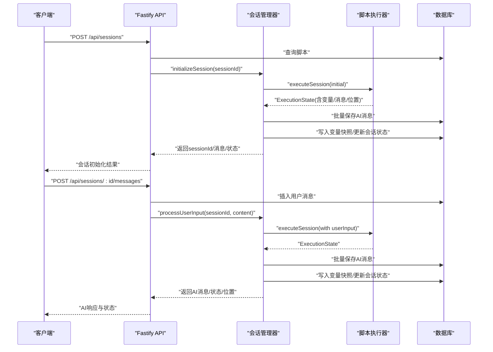

# 架构设计

<cite>
**本文引用的文件**
- [packages/api-server/src/app.ts](file://packages/api-server/src/app.ts)
- [packages/api-server/package.json](file://packages/api-server/package.json)
- [packages/api-server/src/routes/sessions.ts](file://packages/api-server/src/routes/sessions.ts)
- [packages/api-server/src/services/session-manager.ts](file://packages/api-server/src/services/session-manager.ts)
- [packages/core-engine/src/index.ts](file://packages/core-engine/src/index.ts)
- [packages/core-engine/src/engines/script-execution/script-executor.ts](file://packages/core-engine/src/engines/script-execution/script-executor.ts)
- [packages/core-engine/src/actions/action-registry.ts](file://packages/core-engine/src/actions/action-registry.ts)
- [packages/script-editor/src/App.tsx](file://packages/script-editor/src/App.tsx)
- [packages/shared-types/src/index.ts](file://packages/shared-types/src/index.ts)
- [package.json](file://package.json)
- [pnpm-workspace.yaml](file://pnpm-workspace.yaml)
- [docker-compose.dev.yml](file://docker-compose.dev.yml)
</cite>

## 目录
1. [引言](#引言)
2. [项目结构](#项目结构)
3. [核心组件](#核心组件)
4. [架构总览](#架构总览)
5. [详细组件分析](#详细组件分析)
6. [依赖分析](#依赖分析)
7. [性能考量](#性能考量)
8. [故障排查指南](#故障排查指南)
9. [结论](#结论)
10. [附录](#附录)

## 引言
本项目为 HeartRule AI 咨询引擎，采用五层分层架构与 Monorepo 结构组织代码，目标是通过 YAML 脚本驱动认知行为疗法（CBT）的会话流程，并由六大核心引擎协同完成智能对话与变量管理。系统分为表现层（前端与领域工程师工作台）、应用层（API 服务与会话管理）、引擎层（脚本执行、变量抽取、记忆、LLM 编排等）、脚本层（YAML 脚本）、基础设施层（PostgreSQL、Redis、LLM 服务）。本文档系统阐述各层职责、数据流、控制流与组件交互，并给出架构图与序列图，帮助开发者快速理解与扩展。

## 项目结构
项目采用 pnpm workspace 的 Monorepo 结构，以 packages 作为核心模块集合，根目录提供统一脚本与工作区配置。主要包包括：
- api-server：基于 Fastify 的后端 API 服务，负责路由、数据库访问与业务编排
- core-engine：六大核心引擎的 Headless 实现，提供脚本执行、动作系统、变量抽取、记忆与 LLM 编排
- script-editor：React 前端脚本编辑器，提供可视化脚本编辑与调试能力
- shared-types：跨包共享的 TypeScript 类型与 Zod Schema 定义
- scripts：示例 YAML 脚本与技术范式样例

图表来源
- [pnpm-workspace.yaml](file://pnpm-workspace.yaml#L1-L3)
- [package.json](file://package.json#L13-L31)

章节来源
- [pnpm-workspace.yaml](file://pnpm-workspace.yaml#L1-L3)
- [package.json](file://package.json#L1-L60)

## 核心组件
- 表现层
  - 用户前端：React 应用，路由驱动项目列表与编辑器页面
  - 领域工程师工作台：脚本编辑器，支持可视化节点、属性面板、调试气泡与撤销重做
- 应用层
  - API 服务：Fastify 提供 REST 与 WebSocket 支持，集成 Swagger 文档与 CORS
  - 会话管理：封装脚本执行与数据库持久化，提供初始化与用户输入处理
- 引擎层
  - 脚本执行引擎：按阶段/主题/动作顺序执行，支持等待用户输入与状态恢复
  - 动作系统：注册表驱动的可扩展动作（say/ask/think），支持多轮对话与状态序列化
  - 变量抽取：从执行结果中提取并持久化会话变量
  - 记忆：维护对话历史与元数据
  - LLM 编排：OpenAI/Volcano Provider 抽象，面向脚本执行的 LLM 调用
- 脚本层
  - YAML 脚本：描述会话阶段、主题与动作，驱动引擎执行
- 基础设施层
  - PostgreSQL：会话、消息、脚本、变量等数据存储
  - Redis：缓存与会话状态（当前容器化配置）
  - LLM 服务：通过 Provider 抽象接入外部模型

章节来源
- [packages/script-editor/src/App.tsx](file://packages/script-editor/src/App.tsx#L1-L21)
- [packages/api-server/src/app.ts](file://packages/api-server/src/app.ts#L21-L105)
- [packages/api-server/src/services/session-manager.ts](file://packages/api-server/src/services/session-manager.ts#L21-L26)
- [packages/core-engine/src/engines/script-execution/script-executor.ts](file://packages/core-engine/src/engines/script-execution/script-execution/script-executor.ts#L59-L208)
- [packages/core-engine/src/actions/action-registry.ts](file://packages/core-engine/src/actions/action-registry.ts#L35-L45)
- [docker-compose.dev.yml](file://docker-compose.dev.yml#L4-L40)

## 架构总览
系统边界与分层如下：
- 表现层：React 前端与脚本编辑器
- 应用层：Fastify API + Drizzle ORM + Swagger + WebSocket
- 引擎层：核心脚本执行与动作系统
- 脚本层：YAML 脚本
- 基础设施层：PostgreSQL、Redis、LLM Provider

图表来源
- [packages/api-server/src/app.ts](file://packages/api-server/src/app.ts#L21-L105)
- [packages/api-server/src/services/session-manager.ts](file://packages/api-server/src/services/session-manager.ts#L21-L26)
- [packages/core-engine/src/index.ts](file://packages/core-engine/src/index.ts#L7-L27)
- [docker-compose.dev.yml](file://docker-compose.dev.yml#L4-L40)

## 详细组件分析

### API 服务与会话管理
- Fastify 应用构建：注册 CORS、Swagger、Swagger UI、WebSocket 插件；根路径与健康检查；动态注册路由
- 会话管理：封装脚本执行与数据库持久化，支持初始化会话与处理用户输入；将执行状态、变量与消息落库；错误增强返回

图表来源
- [packages/api-server/src/app.ts](file://packages/api-server/src/app.ts#L92-L102)
- [packages/api-server/src/routes/sessions.ts](file://packages/api-server/src/routes/sessions.ts#L14-L133)
- [packages/api-server/src/services/session-manager.ts](file://packages/api-server/src/services/session-manager.ts#L73-L253)
- [packages/core-engine/src/engines/script-execution/script-executor.ts](file://packages/core-engine/src/engines/script-execution/script-executor.ts#L63-L208)

章节来源
- [packages/api-server/src/app.ts](file://packages/api-server/src/app.ts#L21-L135)
- [packages/api-server/src/routes/sessions.ts](file://packages/api-server/src/routes/sessions.ts#L1-L548)
- [packages/api-server/src/services/session-manager.ts](file://packages/api-server/src/services/session-manager.ts#L1-L462)

### 脚本执行引擎与动作系统
- 执行状态机：运行中/等待输入/暂停/完成/错误；支持断点续跑与 Action 内部状态序列化
- 执行位置：阶段/主题/动作索引与 ID 映射，便于前端导航
- 动作注册表：集中管理动作类型与工厂方法，支持扩展新动作类型

图表来源
- [packages/core-engine/src/engines/script-execution/script-executor.ts](file://packages/core-engine/src/engines/script-execution/script-executor.ts#L59-L511)
- [packages/core-engine/src/actions/action-registry.ts](file://packages/core-engine/src/actions/action-registry.ts#L17-L45)

章节来源
- [packages/core-engine/src/engines/script-execution/script-executor.ts](file://packages/core-engine/src/engines/script-execution/script-executor.ts#L1-L511)
- [packages/core-engine/src/actions/action-registry.ts](file://packages/core-engine/src/actions/action-registry.ts#L1-L46)

### 数据模型与持久化
- 会话：包含用户ID、脚本ID、执行状态、位置、变量、元数据
- 消息：用户/助手消息，关联会话与动作
- 变量：会话变量快照，记录变更来源与类型
- 脚本：原始 YAML 与解析后的 JSON 结构

图表来源
- [packages/api-server/src/services/session-manager.ts](file://packages/api-server/src/services/session-manager.ts#L14-L16)
- [packages/api-server/src/routes/sessions.ts](file://packages/api-server/src/routes/sessions.ts#L1-L548)

章节来源
- [packages/api-server/src/services/session-manager.ts](file://packages/api-server/src/services/session-manager.ts#L1-L462)
- [packages/api-server/src/routes/sessions.ts](file://packages/api-server/src/routes/sessions.ts#L1-L548)

### 前端与工作台
- React 路由：项目列表与项目编辑器页面
- 组件体系：节点列表、属性面板、调试气泡、调试面板、过滤弹窗、错误横幅与详情模态框
- 交互：通过 API 获取/提交会话消息，实时展示执行状态与变量

章节来源
- [packages/script-editor/src/App.tsx](file://packages/script-editor/src/App.tsx#L1-L21)

## 依赖分析
- 包依赖关系
  - api-server 依赖 core-engine 与 shared-types，使用 Fastify、Drizzle ORM、Swagger、WebSocket、Redis、UUID、Zod
  - core-engine 依赖 shared-types、Zod、js-yaml、uuid、ai SDK 与 OpenAI SDK
  - script-editor 依赖 shared-types、React、Ant Design、Zustand、Axios、ReactFlow、js-yaml
  - shared-types 作为跨包共享类型与 Schema 的聚合出口
- Monorepo 优势
  - 单仓库多包：统一脚本、类型共享、依赖收敛、版本对齐
  - 工作区链接：包间开发联动，减少发布成本
  - 规范一致：统一 ESLint/Prettier/TS 配置与测试策略

图表来源
- [packages/api-server/package.json](file://packages/api-server/package.json#L20-L34)
- [packages/core-engine/package.json](file://packages/core-engine/package.json#L19-L26)
- [packages/script-editor/package.json](file://packages/script-editor/package.json#L12-L22)
- [packages/shared-types/src/index.ts](file://packages/shared-types/src/index.ts#L7-L19)

章节来源
- [packages/api-server/package.json](file://packages/api-server/package.json#L1-L44)
- [packages/core-engine/package.json](file://packages/core-engine/package.json#L1-L34)
- [packages/script-editor/package.json](file://packages/script-editor/package.json#L1-L33)
- [packages/shared-types/src/index.ts](file://packages/shared-types/src/index.ts#L1-L19)

## 性能考量
- 事件驱动与无阻塞：Fastify 与 Drizzle ORM 提供高性能异步 I/O，适合高并发请求
- 执行状态持久化：会话状态与变量快照写入数据库，避免内存膨胀，支持断点续跑
- 批量消息写入：初始化与每次输入后批量写入 AI 消息，降低事务开销
- 缓存策略：Redis 可用于会话热数据与限流，需结合业务场景评估键空间与过期策略
- LLM 调用优化：Provider 层抽象便于切换与缓存提示词/中间结果，建议引入速率限制与重试退避

## 故障排查指南
- 健康检查与可观测性
  - 根路径与 /health 接口用于服务可用性检测
  - Swagger UI 提供接口文档与在线调试
- 错误增强
  - 会话管理器在异常时构建详细错误上下文（脚本ID/名称、会话ID、位置等），便于定位
- 数据一致性
  - 变量快照仅在值变化时写入，减少冗余；消息与状态更新在同一事务内完成
- 常见问题
  - 脚本解析失败：确认 YAML 语法与字段命名；检查脚本是否正确导入数据库
  - 会话不存在：确认 sessionId 格式与权限
  - LLM Provider 配置：核对凭据与网络连通性

章节来源
- [packages/api-server/src/app.ts](file://packages/api-server/src/app.ts#L72-L89)
- [packages/api-server/src/services/session-manager.ts](file://packages/api-server/src/services/session-manager.ts#L235-L252)
- [packages/api-server/src/routes/sessions.ts](file://packages/api-server/src/routes/sessions.ts#L62-L74)

## 结论
本架构以 Monorepo 与五层分层为核心，通过 Fastify、Drizzle ORM、TypeScript 与 React 等技术栈实现高内聚、低耦合的系统设计。核心引擎以脚本驱动的动作系统与状态机保证了可扩展性与可控性；应用层通过会话管理器将执行状态、变量与消息持久化，确保一致性与可观测性；基础设施层提供稳定的数据与缓存支撑。该设计既满足当前 CBT 咨询场景，也为未来扩展更多动作类型与 Provider 提供了清晰的演进路径。

## 附录
- 技术选型权衡
  - Fastify：轻量、高性能、生态丰富，适合 API 与 WebSocket 场景
  - Drizzle ORM：TypeScript 友好、SQL 优先、迁移工具完善，契合数据库演进
  - TypeScript：强类型保障，提升协作效率与长期可维护性
  - React + Ant Design：组件化与设计规范，适合工作台类应用
  - Monorepo：统一管理、依赖收敛、CI/CD 与发布更高效