# 领域驱动设计与六边形架构

<cite>
**本文档引用的文件**
- [packages/core-engine/src/index.ts](file://packages/core-engine/src/index.ts)
- [packages/core-engine/DDD_HEXAGONAL_REFACTORING_PLAN.md](file://packages/core-engine/DDD_HEXAGONAL_REFACTORING_PLAN.md)
- [packages/core-engine/src/domain/session.ts](file://packages/core-engine/src/domain/session.ts)
- [packages/core-engine/src/application/ports/inbound/session-application.port.ts](file://packages/core-engine/src/application/ports/inbound/session-application.port.ts)
- [packages/core-engine/src/application/ports/outbound/llm-provider.port.ts](file://packages/core-engine/src/application/ports/outbound/llm-provider.port.ts)
- [packages/core-engine/src/application/usecases/session-application-service.ts](file://packages/core-engine/src/application/usecases/session-application-service.ts)
- [packages/core-engine/src/application/session-application-service.ts](file://packages/core-engine/src/application/session-application-service.ts)
- [packages/core-engine/src/domain/actions/ai-ask-action.ts](file://packages/core-engine/src/domain/actions/ai-ask-action.ts)
- [packages/core-engine/src/engines/llm-orchestration/orchestrator.ts](file://packages/core-engine/src/engines/llm-orchestration/orchestrator.ts)
- [packages/api-server/src/app.ts](file://packages/api-server/src/app.ts)
- [packages/api-server/src/routes/sessions.ts](file://packages/api-server/src/routes/sessions.ts)
- [packages/api-server/src/services/session-manager.ts](file://packages/api-server/src/services/session-manager.ts)
- [packages/api-server/src/adapters/outbound/llm/openai-provider.ts](file://packages/api-server/src/adapters/outbound/llm/openai-provider.ts)
- [packages/shared-types/src/index.ts](file://packages/shared-types/src/index.ts)
</cite>

## 目录

1. [引言](#引言)
2. [项目结构](#项目结构)
3. [核心组件](#核心组件)
4. [架构概览](#架构概览)
5. [详细组件分析](#详细组件分析)
6. [依赖关系分析](#依赖关系分析)
7. [性能考虑](#性能考虑)
8. [故障排除指南](#故障排除指南)
9. [结论](#结论)

## 引言

HeartRule-Qcoder 是一个基于认知行为疗法(CBT)的AI咨询系统，采用领域驱动设计(DDD)和六边形架构(也称为整洁架构)来构建。该系统通过严格的架构分层实现了业务逻辑与基础设施的解耦，提供了高度可维护和可扩展的软件架构。

系统的核心目标是通过YAML脚本驱动的AI咨询引擎，为用户提供专业的心理咨询服务。它结合了现代AI技术与传统的CBT理论，形成了独特的智能咨询解决方案。

## 项目结构

### 整体架构布局

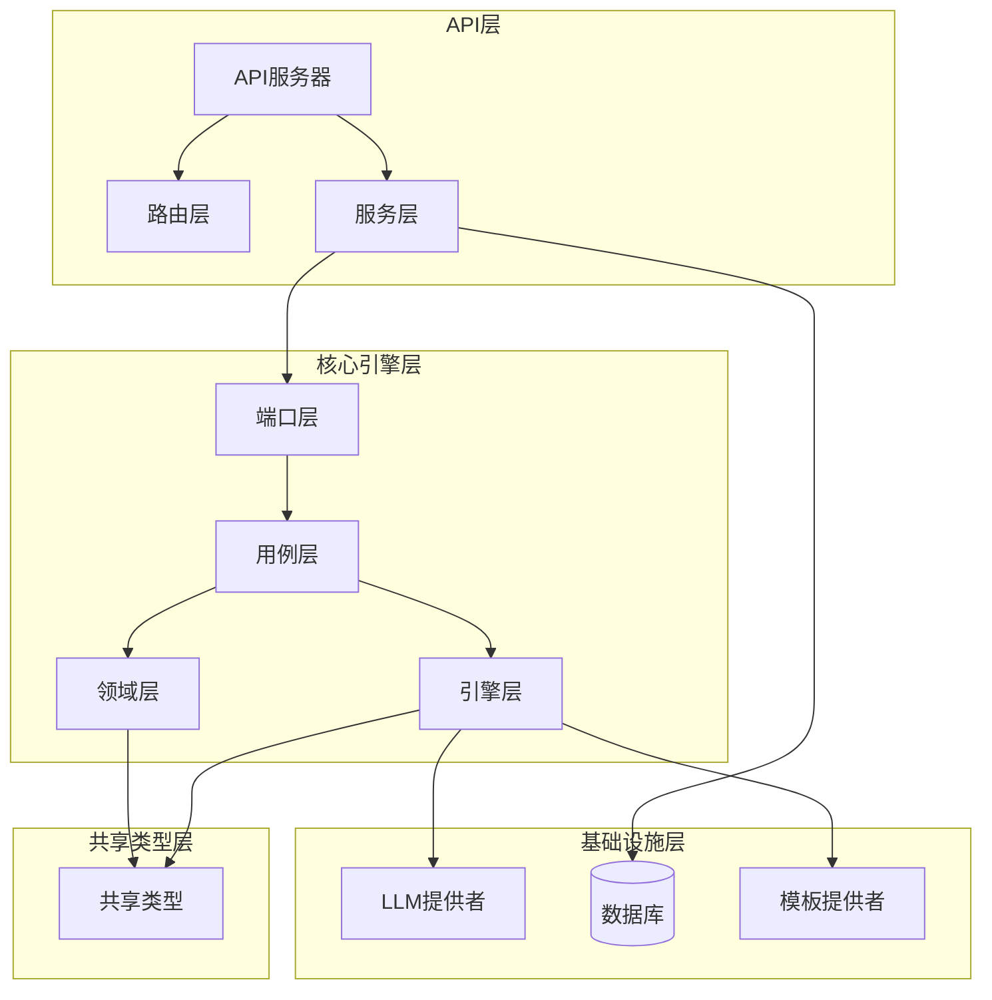

**图表来源**

- [packages/api-server/src/app.ts](file://packages/api-server/src/app.ts#L21-L105)
- [packages/core-engine/src/index.ts](file://packages/core-engine/src/index.ts#L1-L193)

### 分层架构详解

系统采用经典的六边形架构，将关注点清晰地分离到不同的层次：

1. **API层**：处理HTTP请求和响应，负责与外部系统的交互
2. **应用层**：包含端口定义和用例实现，协调业务流程
3. **领域层**：承载核心业务概念和规则，不依赖外部框架
4. **基础设施层**：提供具体的技术实现，如数据库访问、LLM集成等

**章节来源**

- [packages/core-engine/src/index.ts](file://packages/core-engine/src/index.ts#L1-L193)
- [packages/core-engine/DDD_HEXAGONAL_REFACTORING_PLAN.md](file://packages/core-engine/DDD_HEXAGONAL_REFACTORING_PLAN.md#L1-L800)

## 核心组件

### 会话聚合根

会话是系统的核心聚合根，负责维护整个咨询会话的生命周期和状态管理：

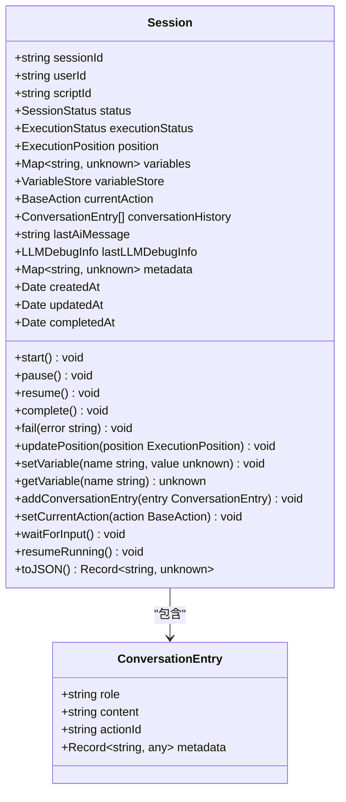

**图表来源**

- [packages/core-engine/src/domain/session.ts](file://packages/core-engine/src/domain/session.ts#L26-L221)

### 应用服务接口

系统定义了清晰的应用服务接口，作为防腐层隔离核心引擎与API层：

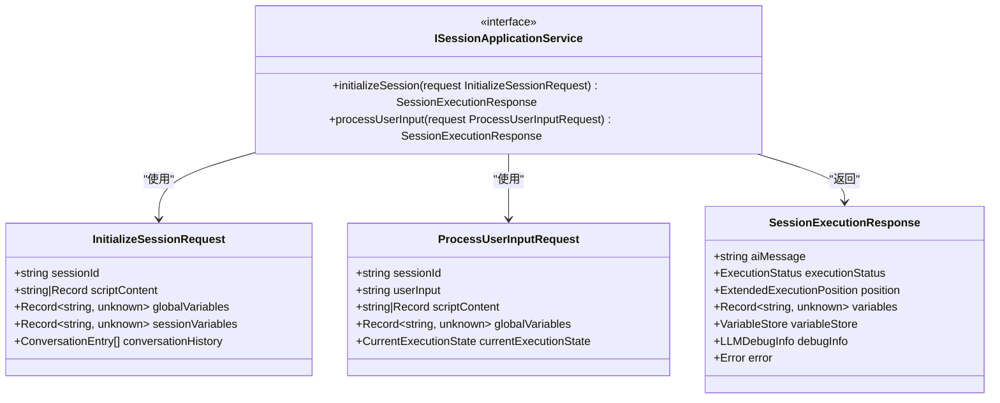

**图表来源**

- [packages/core-engine/src/application/ports/inbound/session-application.port.ts](file://packages/core-engine/src/application/ports/inbound/session-application.port.ts#L129-L151)

**章节来源**

- [packages/core-engine/src/application/ports/inbound/session-application.port.ts](file://packages/core-engine/src/application/ports/inbound/session-application.port.ts#L1-L152)
- [packages/core-engine/src/application/usecases/session-application-service.ts](file://packages/core-engine/src/application/usecases/session-application-service.ts#L27-L372)

## 架构概览

### 六边形架构实现

系统严格按照六边形架构原则实现，确保业务逻辑的纯净性和可测试性：

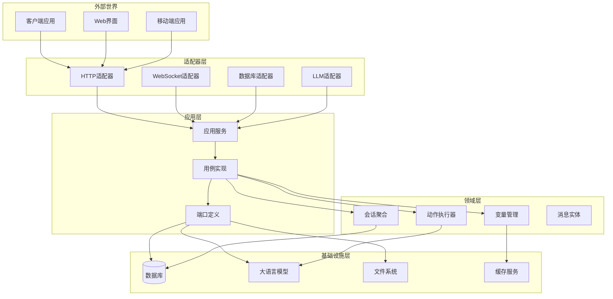

**图表来源**

- [packages/core-engine/DDD_HEXAGONAL_REFACTORING_PLAN.md](file://packages/core-engine/DDD_HEXAGONAL_REFACTORING_PLAN.md#L1-L800)
- [packages/api-server/src/app.ts](file://packages/api-server/src/app.ts#L21-L105)

### 端口-适配器模式

系统采用端口-适配器模式实现依赖倒置：

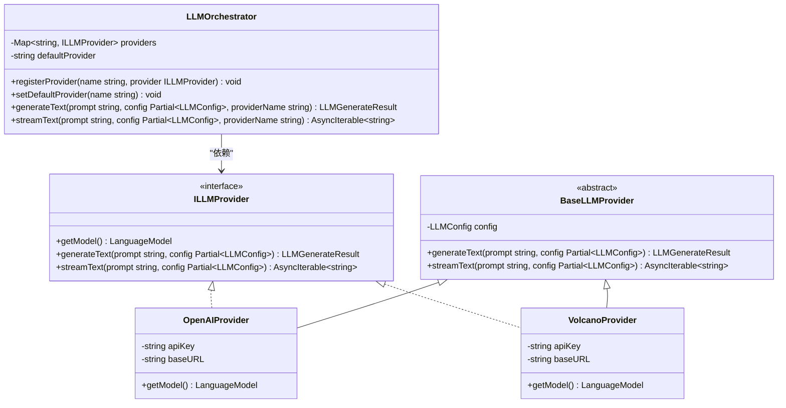

**图表来源**

- [packages/core-engine/src/application/ports/outbound/llm-provider.port.ts](file://packages/core-engine/src/application/ports/outbound/llm-provider.port.ts#L59-L84)
- [packages/core-engine/src/engines/llm-orchestration/orchestrator.ts](file://packages/core-engine/src/engines/llm-orchestration/orchestrator.ts#L22-L133)
- [packages/api-server/src/adapters/outbound/llm/openai-provider.ts](file://packages/api-server/src/adapters/outbound/llm/openai-provider.ts#L9-L27)

**章节来源**

- [packages/core-engine/src/application/ports/outbound/llm-provider.port.ts](file://packages/core-engine/src/application/ports/outbound/llm-provider.port.ts#L1-L85)
- [packages/core-engine/src/engines/llm-orchestration/orchestrator.ts](file://packages/core-engine/src/engines/llm-orchestration/orchestrator.ts#L1-L256)

## 详细组件分析

### AI提问动作执行器

AI提问动作是系统的核心业务逻辑之一，负责智能的多轮对话和变量提取：

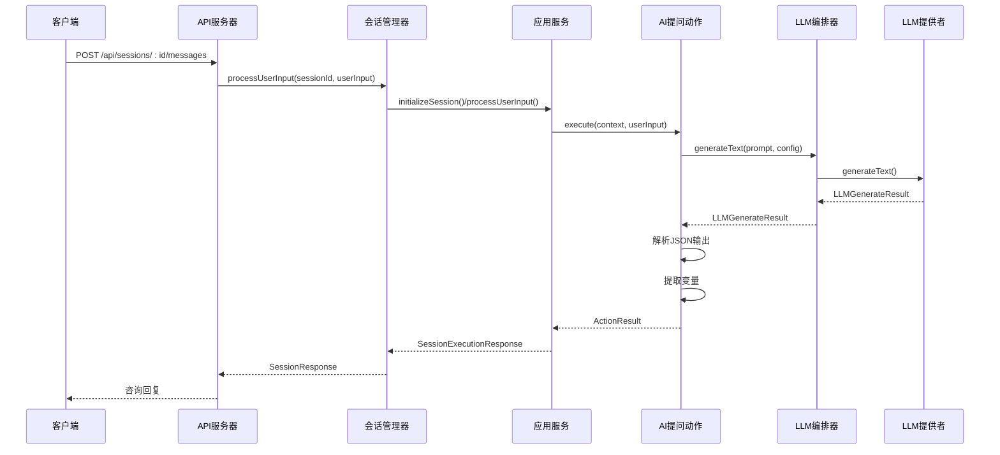

**图表来源**

- [packages/api-server/src/routes/sessions.ts](file://packages/api-server/src/routes/sessions.ts#L462-L542)
- [packages/api-server/src/services/session-manager.ts](file://packages/api-server/src/services/session-manager.ts#L714-L767)
- [packages/core-engine/src/application/usecases/session-application-service.ts](file://packages/core-engine/src/application/usecases/session-application-service.ts#L98-L152)
- [packages/core-engine/src/domain/actions/ai-ask-action.ts](file://packages/core-engine/src/domain/actions/ai-ask-action.ts#L101-L153)

### 会话生命周期管理

系统通过会话聚合根管理整个咨询过程的状态流转：

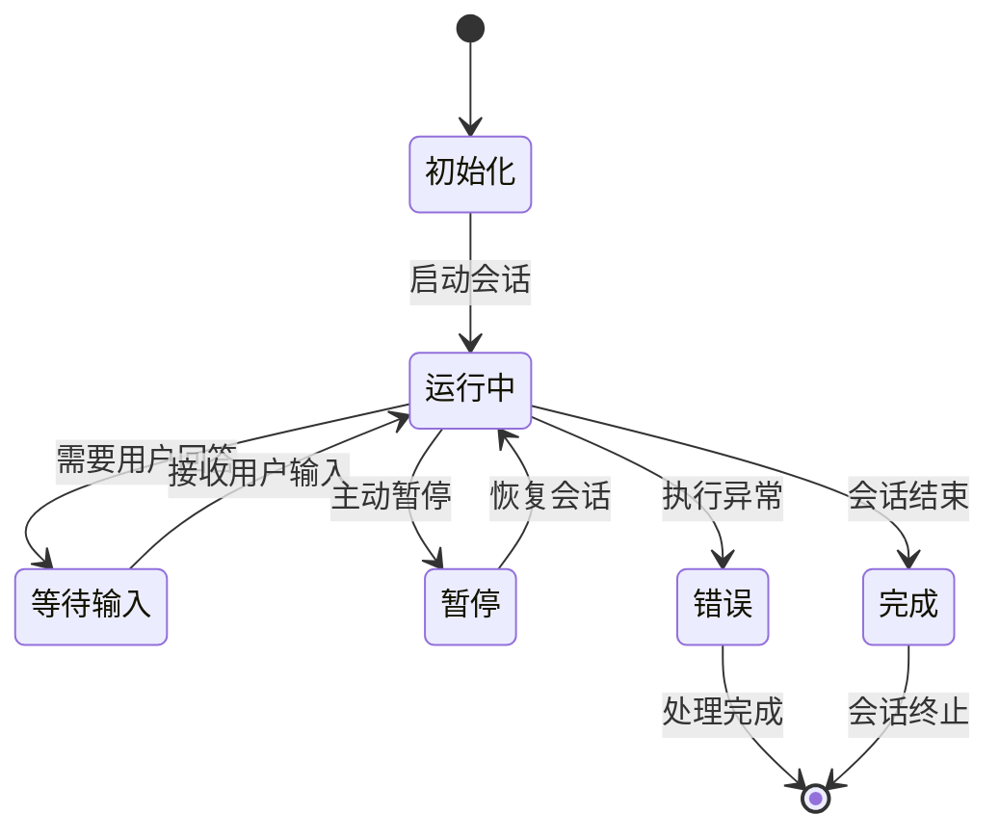

**图表来源**

- [packages/core-engine/src/domain/session.ts](file://packages/core-engine/src/domain/session.ts#L93-L137)

### 模板系统架构

系统采用两层模板机制支持灵活的提示词管理：

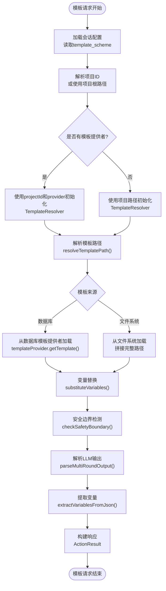

**图表来源**

- [packages/core-engine/src/domain/actions/ai-ask-action.ts](file://packages/core-engine/src/domain/actions/ai-ask-action.ts#L317-L517)

**章节来源**

- [packages/core-engine/src/domain/actions/ai-ask-action.ts](file://packages/core-engine/src/domain/actions/ai-ask-action.ts#L1-L927)

## 依赖关系分析

### 模块依赖图

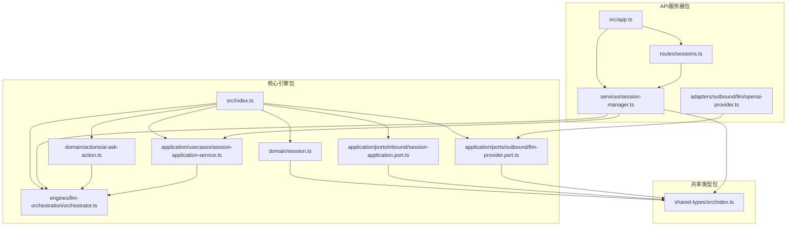

**图表来源**

- [packages/core-engine/src/index.ts](file://packages/core-engine/src/index.ts#L1-L193)
- [packages/api-server/src/app.ts](file://packages/api-server/src/app.ts#L21-L105)

### 依赖注入容器

系统通过依赖注入实现松耦合的组件装配：

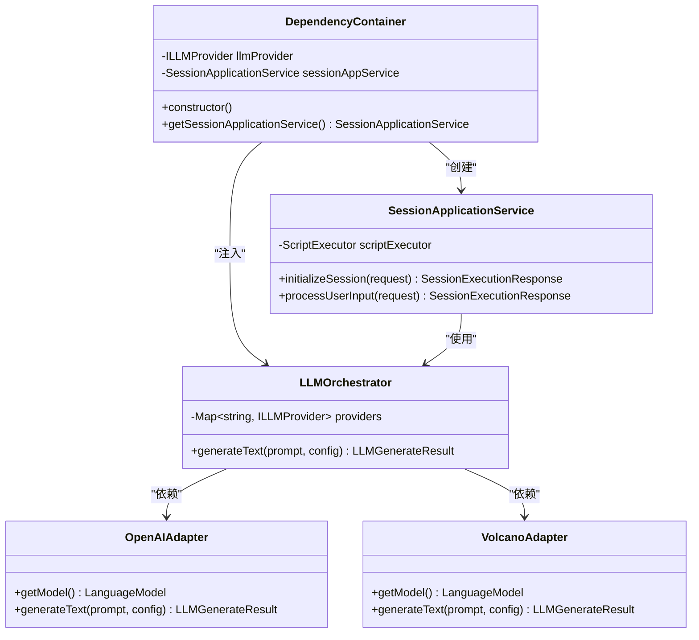

**图表来源**

- [packages/api-server/src/app.ts](file://packages/api-server/src/app.ts#L633-L662)

**章节来源**

- [packages/api-server/src/app.ts](file://packages/api-server/src/app.ts#L1-L135)

## 性能考虑

### 性能优化策略

系统在多个层面实现了性能优化：

1. **延迟加载**：应用服务使用动态导入避免循环依赖
2. **内存管理**：会话状态采用增量更新策略
3. **缓存机制**：模板系统支持缓存减少重复计算
4. **异步处理**：LLM调用采用异步流式响应

### 性能监控

系统内置了详细的性能监控和日志记录：

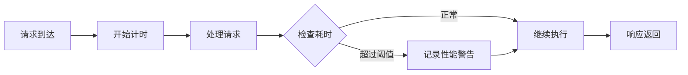

**章节来源**

- [packages/core-engine/src/application/usecases/session-application-service.ts](file://packages/core-engine/src/application/usecases/session-application-service.ts#L80-L86)
- [packages/core-engine/src/application/usecases/session-application-service.ts](file://packages/core-engine/src/application/usecases/session-application-service.ts#L141-L146)

## 故障排除指南

### 常见问题诊断

系统提供了完善的错误处理和诊断机制：

1. **会话初始化失败**：检查脚本解析和模板加载
2. **LLM调用超时**：检查网络连接和API密钥配置
3. **变量提取错误**：验证JSON解析和变量定义
4. **模板加载失败**：确认模板路径和权限设置

### 错误响应结构

系统采用标准化的错误响应格式：

| 错误字段 | 描述       | 示例值             |
| -------- | ---------- | ------------------ |
| code     | 错误代码   | EXECUTION_ERROR    |
| message  | 错误描述   | 具体的错误信息     |
| details  | 详细信息   | 错误堆栈跟踪       |
| context  | 上下文信息 | 脚本ID、位置信息   |
| recovery | 恢复建议   | 重试操作或检查配置 |

**章节来源**

- [packages/core-engine/src/application/usecases/session-application-service.ts](file://packages/core-engine/src/application/usecases/session-application-service.ts#L343-L359)

## 结论

HeartRule-Qcoder项目成功实现了基于领域驱动设计和六边形架构的企业级应用。通过严格的分层设计和端口-适配器模式，系统实现了业务逻辑与技术实现的完全解耦，为未来的功能扩展和技术演进奠定了坚实的基础。

### 架构优势

1. **高内聚低耦合**：每个模块职责明确，依赖关系清晰
2. **可测试性强**：接口抽象使得单元测试和集成测试变得简单
3. **可扩展性好**：新的LLM提供者和模板源可以轻松集成
4. **维护成本低**：清晰的架构层次降低了代码维护难度

### 技术亮点

1. **成熟的重构计划**：详细的DDD六边形架构重构方案
2. **完善的测试体系**：按层次组织的测试结构
3. **灵活的依赖注入**：支持多种配置和环境
4. **强大的模板系统**：支持两层模板机制和变量提取

该架构为AI咨询系统的开发提供了最佳实践范本，展示了如何在复杂的业务场景中应用DDD和六边形架构原则。
