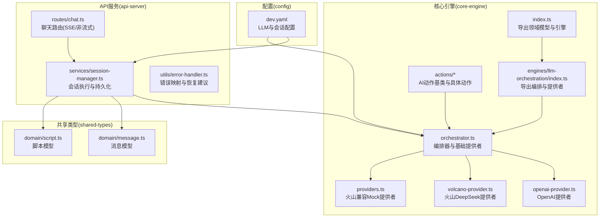
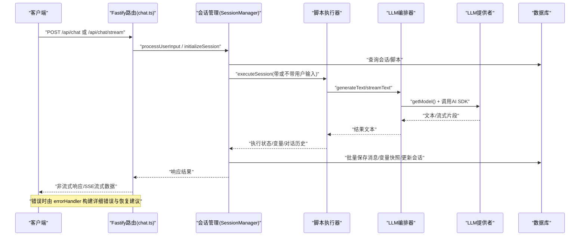
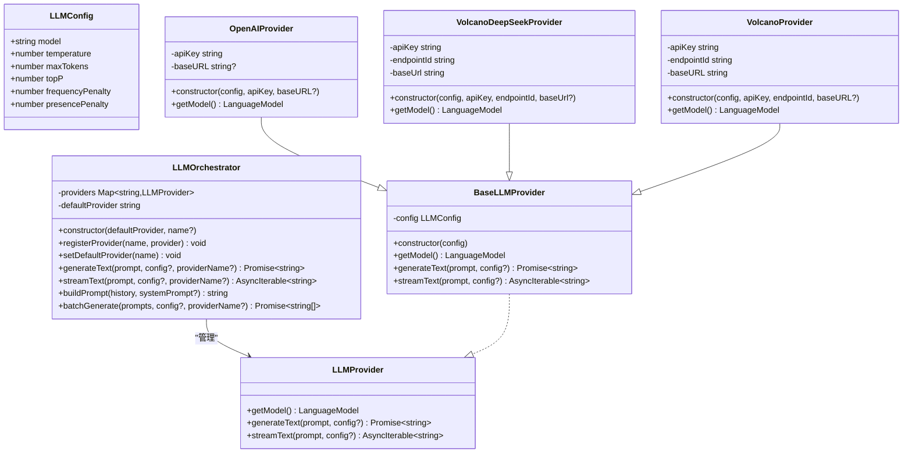
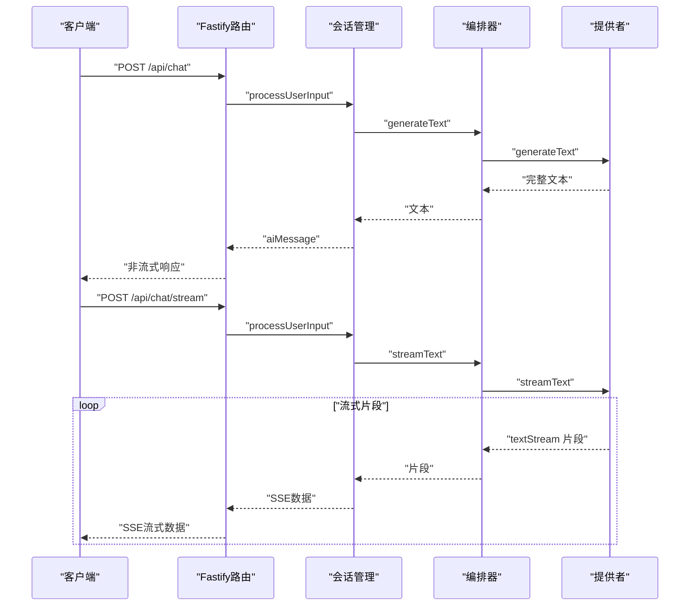
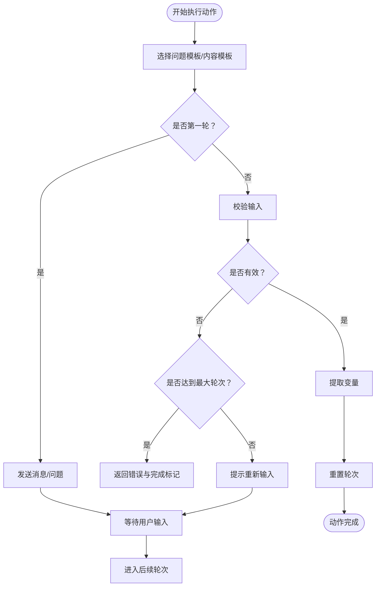
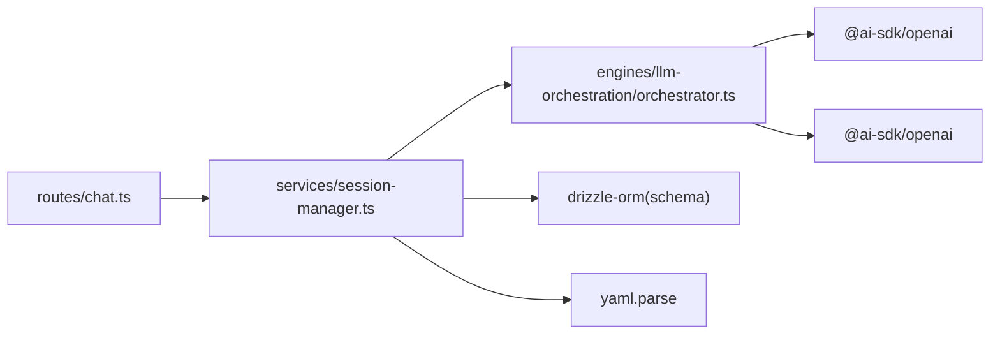

# LLM编排引擎

<cite>
**本文引用的文件**
- [packages/core-engine/src/index.ts](file://packages/core-engine/src/index.ts)
- [packages/core-engine/src/engines/llm-orchestration/index.ts](file://packages/core-engine/src/engines/llm-orchestration/index.ts)
- [packages/core-engine/src/engines/llm-orchestration/orchestrator.ts](file://packages/core-engine/src/engines/llm-orchestration/orchestrator.ts)
- [packages/core-engine/src/engines/llm-orchestration/providers.ts](file://packages/core-engine/src/engines/llm-orchestration/providers.ts)
- [packages/core-engine/src/engines/llm-orchestration/openai-provider.ts](file://packages/core-engine/src/engines/llm-orchestration/openai-provider.ts)
- [packages/core-engine/src/engines/llm-orchestration/volcano-provider.ts](file://packages/core-engine/src/engines/llm-orchestration/volcano-provider.ts)
- [packages/core-engine/src/actions/base-action.ts](file://packages/core-engine/src/actions/base-action.ts)
- [packages/core-engine/src/actions/ai-ask-action.ts](file://packages/core-engine/src/actions/ai-ask-action.ts)
- [packages/core-engine/src/actions/ai-say-action.ts](file://packages/core-engine/src/actions/ai-say-action.ts)
- [packages/shared-types/src/domain/message.ts](file://packages/shared-types/src/domain/message.ts)
- [packages/shared-types/src/domain/script.ts](file://packages/shared-types/src/domain/script.ts)
- [config/dev.yaml](file://config/dev.yaml)
- [packages/api-server/src/routes/chat.ts](file://packages/api-server/src/routes/chat.ts)
- [packages/api-server/src/services/session-manager.ts](file://packages/api-server/src/services/session-manager.ts)
- [packages/api-server/src/utils/error-handler.ts](file://packages/api-server/src/utils/error-handler.ts)
</cite>

## 目录
1. [引言](#引言)
2. [项目结构](#项目结构)
3. [核心组件](#核心组件)
4. [架构总览](#架构总览)
5. [详细组件分析](#详细组件分析)
6. [依赖关系分析](#依赖关系分析)
7. [性能考虑](#性能考虑)
8. [故障排查指南](#故障排查指南)
9. [结论](#结论)
10. [附录](#附录)

## 引言
本文件面向“LLM编排引擎”的技术文档，系统性阐述其设计与实现，重点覆盖以下方面：
- 多提供者管理机制：统一接口抽象与提供者注册、切换
- 负载均衡与容错策略：默认提供者、批量调用与上下文滑动窗口
- OpenAI与火山引擎提供者的实现差异：API调用方式、参数适配与响应处理
- 流式与非流式LLM调用：实时响应与批量处理场景
- 错误处理、重试与超时管理：错误分类、恢复建议与API层封装
- 提供者扩展指南：如何新增AI服务提供商
- 性能优化与成本控制：参数调优、上下文裁剪与并发策略

## 项目结构
该工程采用多包工作区组织，核心编排逻辑位于 core-engine 包；API入口与会话管理在 api-server 包；共享类型定义在 shared-types 包；开发配置在 config 目录。

图表来源
- [packages/core-engine/src/index.ts](file://packages/core-engine/src/index.ts#L1-L27)
- [packages/core-engine/src/engines/llm-orchestration/index.ts](file://packages/core-engine/src/engines/llm-orchestration/index.ts#L1-L11)
- [packages/core-engine/src/engines/llm-orchestration/orchestrator.ts](file://packages/core-engine/src/engines/llm-orchestration/orchestrator.ts#L1-L198)
- [packages/core-engine/src/engines/llm-orchestration/providers.ts](file://packages/core-engine/src/engines/llm-orchestration/providers.ts#L1-L70)
- [packages/core-engine/src/engines/llm-orchestration/openai-provider.ts](file://packages/core-engine/src/engines/llm-orchestration/openai-provider.ts#L1-L28)
- [packages/core-engine/src/engines/llm-orchestration/volcano-provider.ts](file://packages/core-engine/src/engines/llm-orchestration/volcano-provider.ts#L1-L42)
- [packages/api-server/src/routes/chat.ts](file://packages/api-server/src/routes/chat.ts#L1-L152)
- [packages/api-server/src/services/session-manager.ts](file://packages/api-server/src/services/session-manager.ts#L1-L462)
- [packages/shared-types/src/domain/message.ts](file://packages/shared-types/src/domain/message.ts#L1-L52)
- [packages/shared-types/src/domain/script.ts](file://packages/shared-types/src/domain/script.ts#L1-L64)
- [config/dev.yaml](file://config/dev.yaml#L1-L63)

章节来源
- [packages/core-engine/src/index.ts](file://packages/core-engine/src/index.ts#L1-L27)
- [packages/core-engine/src/engines/llm-orchestration/index.ts](file://packages/core-engine/src/engines/llm-orchestration/index.ts#L1-L11)

## 核心组件
- 编排器与提供者抽象
  - LLMOrchestrator：统一管理多个LLM提供者，支持默认提供者切换、批量调用、构建提示词与滑动窗口上下文。
  - LLMProvider 接口与 BaseLLMProvider 抽象类：定义统一的 generateText 与 streamText 方法，并通过 Vercel AI SDK 的 generateText/streamText 完成实际调用。
- 提供者实现
  - OpenAIProvider：基于 @ai-sdk/openai，以 config.model 作为模型名。
  - VolcanoDeepSeekProvider：通过自定义 baseURL 与 endpointId 适配火山 Ark API，以 endpointId 作为模型名。
  - VolcanoProvider（兼容）：与上一提供者类似，但注释说明其兼容OpenAI格式。
  - MockProvider：用于测试的模拟 LanguageModel。
- 动作系统
  - BaseAction：定义 ActionContext/ActionResult 类型与多轮执行框架。
  - AiSayAction/AiAskAction：分别实现“消息播报”和“问答抽取”，结合编排器进行LLM调用。

章节来源
- [packages/core-engine/src/engines/llm-orchestration/orchestrator.ts](file://packages/core-engine/src/engines/llm-orchestration/orchestrator.ts#L1-L198)
- [packages/core-engine/src/engines/llm-orchestration/openai-provider.ts](file://packages/core-engine/src/engines/llm-orchestration/openai-provider.ts#L1-L28)
- [packages/core-engine/src/engines/llm-orchestration/volcano-provider.ts](file://packages/core-engine/src/engines/llm-orchestration/volcano-provider.ts#L1-L42)
- [packages/core-engine/src/engines/llm-orchestration/providers.ts](file://packages/core-engine/src/engines/llm-orchestration/providers.ts#L1-L70)
- [packages/core-engine/src/actions/base-action.ts](file://packages/core-engine/src/actions/base-action.ts#L1-L96)
- [packages/core-engine/src/actions/ai-say-action.ts](file://packages/core-engine/src/actions/ai-say-action.ts#L1-L105)
- [packages/core-engine/src/actions/ai-ask-action.ts](file://packages/core-engine/src/actions/ai-ask-action.ts#L1-L207)

## 架构总览
下图展示从API请求到LLM编排与动作执行的整体流程，以及错误处理与恢复建议的返回路径。

图表来源
- [packages/api-server/src/routes/chat.ts](file://packages/api-server/src/routes/chat.ts#L1-L152)
- [packages/api-server/src/services/session-manager.ts](file://packages/api-server/src/services/session-manager.ts#L1-L462)
- [packages/core-engine/src/engines/llm-orchestration/orchestrator.ts](file://packages/core-engine/src/engines/llm-orchestration/orchestrator.ts#L1-L198)
- [packages/api-server/src/utils/error-handler.ts](file://packages/api-server/src/utils/error-handler.ts#L19-L181)

## 详细组件分析

### 编排器与提供者抽象
- 统一接口与默认提供者
  - LLMProvider 定义 getModel/generateText/streamText。
  - LLMOrchestrator 维护 providers Map，默认提供者可通过 setDefaultProvider 切换。
- 基础提供者 BaseLLMProvider
  - 合并默认配置与调用时配置，统一走 generateText/streamText。
  - 通过 Vercel AI SDK 的 generateText/streamText 实现非流式与流式调用。
- OpenAI提供者
  - 以 config.model 作为模型名，支持自定义 baseURL。
- 火山引擎提供者
  - 通过 createOpenAI(baseURL=火山地址) + endpointId 作为模型名，兼容OpenAI格式。
  - 提供了两种实现：VolcanoDeepSeekProvider 与 VolcanoProvider（兼容OpenAI格式）。

图表来源
- [packages/core-engine/src/engines/llm-orchestration/orchestrator.ts](file://packages/core-engine/src/engines/llm-orchestration/orchestrator.ts#L1-L198)
- [packages/core-engine/src/engines/llm-orchestration/openai-provider.ts](file://packages/core-engine/src/engines/llm-orchestration/openai-provider.ts#L1-L28)
- [packages/core-engine/src/engines/llm-orchestration/volcano-provider.ts](file://packages/core-engine/src/engines/llm-orchestration/volcano-provider.ts#L1-L42)
- [packages/core-engine/src/engines/llm-orchestration/providers.ts](file://packages/core-engine/src/engines/llm-orchestration/providers.ts#L1-L70)

章节来源
- [packages/core-engine/src/engines/llm-orchestration/orchestrator.ts](file://packages/core-engine/src/engines/llm-orchestration/orchestrator.ts#L1-L198)
- [packages/core-engine/src/engines/llm-orchestration/openai-provider.ts](file://packages/core-engine/src/engines/llm-orchestration/openai-provider.ts#L1-L28)
- [packages/core-engine/src/engines/llm-orchestration/volcano-provider.ts](file://packages/core-engine/src/engines/llm-orchestration/volcano-provider.ts#L1-L42)
- [packages/core-engine/src/engines/llm-orchestration/providers.ts](file://packages/core-engine/src/engines/llm-orchestration/providers.ts#L1-L70)

### OpenAI提供者 vs 火山引擎提供者
- API调用方式
  - OpenAIProvider：使用 createOpenAI(...) 并以 config.model 作为模型标识。
  - VolcanoDeepSeekProvider：使用 createOpenAI(...) 并以 endpointId 作为模型标识，baseURL 指向火山 Ark API。
- 参数适配
  - 两者均通过 BaseLLMProvider 合并默认配置与调用时配置，最终传递给 generateText/streamText。
- 响应处理
  - 统一通过 AI SDK 的 text/textStream 迭代返回，编排器负责聚合与分发。

章节来源
- [packages/core-engine/src/engines/llm-orchestration/openai-provider.ts](file://packages/core-engine/src/engines/llm-orchestration/openai-provider.ts#L1-L28)
- [packages/core-engine/src/engines/llm-orchestration/volcano-provider.ts](file://packages/core-engine/src/engines/llm-orchestration/volcano-provider.ts#L1-L42)
- [packages/core-engine/src/engines/llm-orchestration/providers.ts](file://packages/core-engine/src/engines/llm-orchestration/providers.ts#L1-L70)

### 流式与非流式调用
- 非流式：LLMOrchestrator.generateText 调用 AI SDK 的 generateText，一次性返回完整文本。
- 流式：LLMOrchestrator.streamText 调用 AI SDK 的 streamText，逐片返回 textStream 中的增量片段。
- API层支持
  - 非流式：/api/chat 返回 aiMessage 与执行状态。
  - 流式：/api/chat/stream 使用 Server-Sent Events，当前示例为模拟输出；真实场景可直接透传编排器的流式片段。

图表来源
- [packages/api-server/src/routes/chat.ts](file://packages/api-server/src/routes/chat.ts#L1-L152)
- [packages/api-server/src/services/session-manager.ts](file://packages/api-server/src/services/session-manager.ts#L1-L462)
- [packages/core-engine/src/engines/llm-orchestration/orchestrator.ts](file://packages/core-engine/src/engines/llm-orchestration/orchestrator.ts#L1-L198)

章节来源
- [packages/api-server/src/routes/chat.ts](file://packages/api-server/src/routes/chat.ts#L1-L152)
- [packages/core-engine/src/engines/llm-orchestration/orchestrator.ts](file://packages/core-engine/src/engines/llm-orchestration/orchestrator.ts#L1-L198)

### 动作系统与编排交互
- BaseAction
  - 定义 ActionContext/ActionResult，支持多轮执行与变量替换。
- AiSayAction
  - 支持“需要确认”和“无需确认”两种行为，保存消息并推进脚本执行。
- AiAskAction
  - 生成问题模板，校验用户输入，支持最大轮次限制与重试提示，最终提取变量。

图表来源
- [packages/core-engine/src/actions/ai-ask-action.ts](file://packages/core-engine/src/actions/ai-ask-action.ts#L1-L207)
- [packages/core-engine/src/actions/ai-say-action.ts](file://packages/core-engine/src/actions/ai-say-action.ts#L1-L105)
- [packages/core-engine/src/actions/base-action.ts](file://packages/core-engine/src/actions/base-action.ts#L1-L96)

章节来源
- [packages/core-engine/src/actions/base-action.ts](file://packages/core-engine/src/actions/base-action.ts#L1-L96)
- [packages/core-engine/src/actions/ai-say-action.ts](file://packages/core-engine/src/actions/ai-say-action.ts#L1-L105)
- [packages/core-engine/src/actions/ai-ask-action.ts](file://packages/core-engine/src/actions/ai-ask-action.ts#L1-L207)

### 上下文构建与滑动窗口
- buildPrompt：拼接 systemPrompt 与最近 N 条对话（默认最近10条），形成提示词。
- applySlidingWindow：对历史对话应用滑动窗口，避免上下文过长导致成本与延迟上升。

章节来源
- [packages/core-engine/src/engines/llm-orchestration/orchestrator.ts](file://packages/core-engine/src/engines/llm-orchestration/orchestrator.ts#L80-L128)

### 批量调用与并发
- batchGenerate：对多个提示词并行调用，适合批量处理场景（如多轮评估、批量生成）。

章节来源
- [packages/core-engine/src/engines/llm-orchestration/orchestrator.ts](file://packages/core-engine/src/engines/llm-orchestration/orchestrator.ts#L130-L140)

## 依赖关系分析
- 核心依赖
  - Vercel AI SDK：generateText/streamText 作为统一调用入口。
  - @ai-sdk/openai：提供 OpenAI 与兼容 OpenAI 的火山 Ark API 客户端。
- 内部耦合
  - SessionManager 依赖 ScriptExecutor 执行脚本，脚本执行过程中调用编排器进行LLM推理。
  - API 层路由与会话管理紧密耦合，负责消息持久化与状态更新。
- 外部集成
  - 数据库：drizzle-orm 访问 sessions/messages/scripts/variables。
  - YAML 解析：脚本内容解析为 JSON 后交由执行器处理。

图表来源
- [packages/api-server/src/routes/chat.ts](file://packages/api-server/src/routes/chat.ts#L1-L152)
- [packages/api-server/src/services/session-manager.ts](file://packages/api-server/src/services/session-manager.ts#L1-L462)
- [packages/core-engine/src/engines/llm-orchestration/orchestrator.ts](file://packages/core-engine/src/engines/llm-orchestration/orchestrator.ts#L1-L198)

章节来源
- [packages/api-server/src/routes/chat.ts](file://packages/api-server/src/routes/chat.ts#L1-L152)
- [packages/api-server/src/services/session-manager.ts](file://packages/api-server/src/services/session-manager.ts#L1-L462)
- [packages/core-engine/src/engines/llm-orchestration/orchestrator.ts](file://packages/core-engine/src/engines/llm-orchestration/orchestrator.ts#L1-L198)

## 性能考虑
- 上下文裁剪
  - 使用滑动窗口保留最近对话，减少 tokens 使用与延迟。
- 并发与批处理
  - 使用 batchGenerate 并行调用，提升吞吐；注意资源配额与限速。
- 参数调优
  - 降低 maxTokens、合理设置 temperature/topP/frequencyPenalty/presencePenalty，平衡质量与成本。
- 流式传输
  - 对实时体验敏感的场景优先使用流式，缩短首字节时间。
- 缓存与预热
  - 对热点模型与常用提示词进行缓存（需在上层实现），减少重复调用。

## 故障排查指南
- 错误分类与恢复建议
  - errorHandler 将常见错误映射为结构化错误码与恢复建议，便于前端展示与自动重试策略制定。
- 常见问题定位
  - Script not found/Session not found：检查会话与脚本存在性与权限。
  - YAML parse/validation：修正脚本语法与结构。
  - LLM service：检查网络连通性、API Key、模型可用性与配额。
  - Action execution/Variable extraction：检查动作配置与响应解析。
- API层错误处理
  - 路由层捕获异常并返回统一错误格式，避免泄露内部细节。

章节来源
- [packages/api-server/src/utils/error-handler.ts](file://packages/api-server/src/utils/error-handler.ts#L19-L181)
- [packages/api-server/src/routes/chat.ts](file://packages/api-server/src/routes/chat.ts#L1-L152)

## 结论
本编排引擎通过统一的提供者接口与编排器抽象，实现了对多家LLM服务的一致接入；结合动作系统与会话管理，支撑从非流式到流式的多样化交互场景。通过上下文裁剪、批量调用与合理的参数配置，可在保证质量的同时控制成本与延迟。错误处理与恢复建议机制为生产环境提供了稳健的可观测性与可维护性。

## 附录

### 提供者扩展指南
- 新增步骤
  1) 继承 BaseLLMProvider，实现 getModel() 返回 LanguageModel。
  2) 在构造函数中注入必要凭据与端点信息（如 apiKey/baseURL/model/endpointId）。
  3) 在编排器中注册新提供者并设置默认提供者（可选）。
- 示例参考
  - OpenAIProvider：以 config.model 作为模型名。
  - VolcanoDeepSeekProvider：以 endpointId 作为模型名，baseURL 指向火山 Ark API。
- 注意事项
  - 确保 getModel 返回的 LanguageModel 与 AI SDK 兼容。
  - 合理合并默认配置与调用时配置，避免覆盖关键参数。

章节来源
- [packages/core-engine/src/engines/llm-orchestration/orchestrator.ts](file://packages/core-engine/src/engines/llm-orchestration/orchestrator.ts#L146-L198)
- [packages/core-engine/src/engines/llm-orchestration/openai-provider.ts](file://packages/core-engine/src/engines/llm-orchestration/openai-provider.ts#L1-L28)
- [packages/core-engine/src/engines/llm-orchestration/volcano-provider.ts](file://packages/core-engine/src/engines/llm-orchestration/volcano-provider.ts#L1-L42)

### 配置要点
- 开发配置 dev.yaml
  - llm.provider：可选 mock、openai、volcano_deepseek。
  - llm.api_key：从环境变量读取。
  - llm.timeout/max_retries：超时与重试策略参考。
  - volcano.*：火山引擎的 api_key、endpoint_id、base_url。
- 会话与内存
  - memory.short_term.window_size/max_tokens：短期记忆窗口与token上限。
  - session.pause_timeout/suspend_timeout/max_concurrent_sessions：会话生命周期与并发限制。

章节来源
- [config/dev.yaml](file://config/dev.yaml#L1-L63)