# 会话应用服务

<cite>
**本文档引用的文件**
- [session-application-service.ts](file://packages/core-engine/src/application/session-application-service.ts)
- [session-manager.ts](file://packages/api-server/src/services/session-manager.ts)
- [session.ts](file://packages/core-engine/src/domain/session.ts)
- [session.ts](file://packages/shared-types/src/domain/session.ts)
- [sessions.ts](file://packages/api-server/src/routes/sessions.ts)
- [script-executor.ts](file://packages/core-engine/src/engines/script-execution/script-executor.ts)
- [variable-scope-resolver.ts](file://packages/core-engine/src/engines/variable-scope/variable-scope-resolver.ts)
- [ai-ask-action.ts](file://packages/core-engine/src/actions/ai-ask-action.ts)
- [ai-say-action.ts](file://packages/core-engine/src/actions/ai-say-action.ts)
- [schema.ts](file://packages/api-server/src/db/schema.ts)
- [enums.ts](file://packages/shared-types/src/enums.ts)
</cite>

## 目录
1. [简介](#简介)
2. [项目结构](#项目结构)
3. [核心组件](#核心组件)
4. [架构概览](#架构概览)
5. [详细组件分析](#详细组件分析)
6. [依赖关系分析](#依赖关系分析)
7. [性能考虑](#性能考虑)
8. [故障排除指南](#故障排除指南)
9. [结论](#结论)

## 简介

会话应用服务是 HeartRule 心理咨询脚本系统的核心组件，负责管理心理咨询服务的完整生命周期。该服务实现了领域驱动设计（DDD）原则，将复杂的业务逻辑与基础设施解耦，提供标准化的会话执行接口。

系统采用分层架构设计，通过应用服务接口隔离核心引擎与 API 层，确保业务逻辑的纯净性和可测试性。会话应用服务支持多轮对话、变量管理、LLM 集成等功能，为心理咨询师提供智能化的会话辅助工具。

## 项目结构

项目采用 monorepo 结构，主要包含以下核心模块：

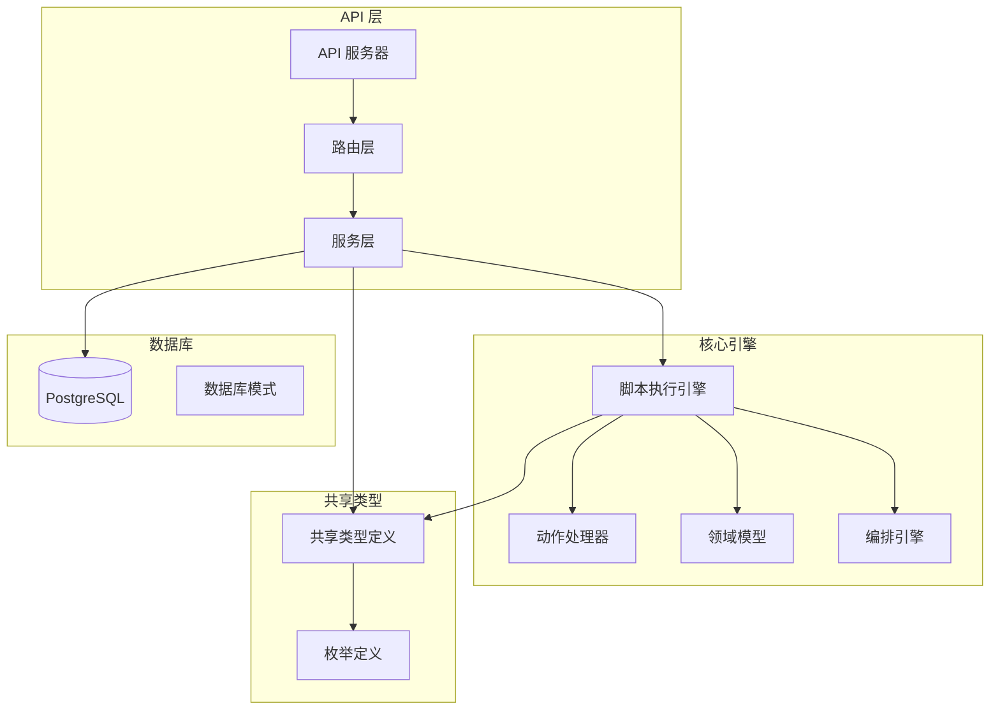

**图表来源**
- [session-application-service.ts](file://packages/core-engine/src/application/session-application-service.ts#L1-L514)
- [session-manager.ts](file://packages/api-server/src/services/session-manager.ts#L1-L694)
- [script-executor.ts](file://packages/core-engine/src/engines/script-execution/script-executor.ts#L1-L896)

**章节来源**
- [session-application-service.ts](file://packages/core-engine/src/application/session-application-service.ts#L1-L50)
- [session-manager.ts](file://packages/api-server/src/services/session-manager.ts#L1-L50)

## 核心组件

### 会话应用服务接口

会话应用服务接口定义了核心的业务能力，提供标准化的会话执行能力：

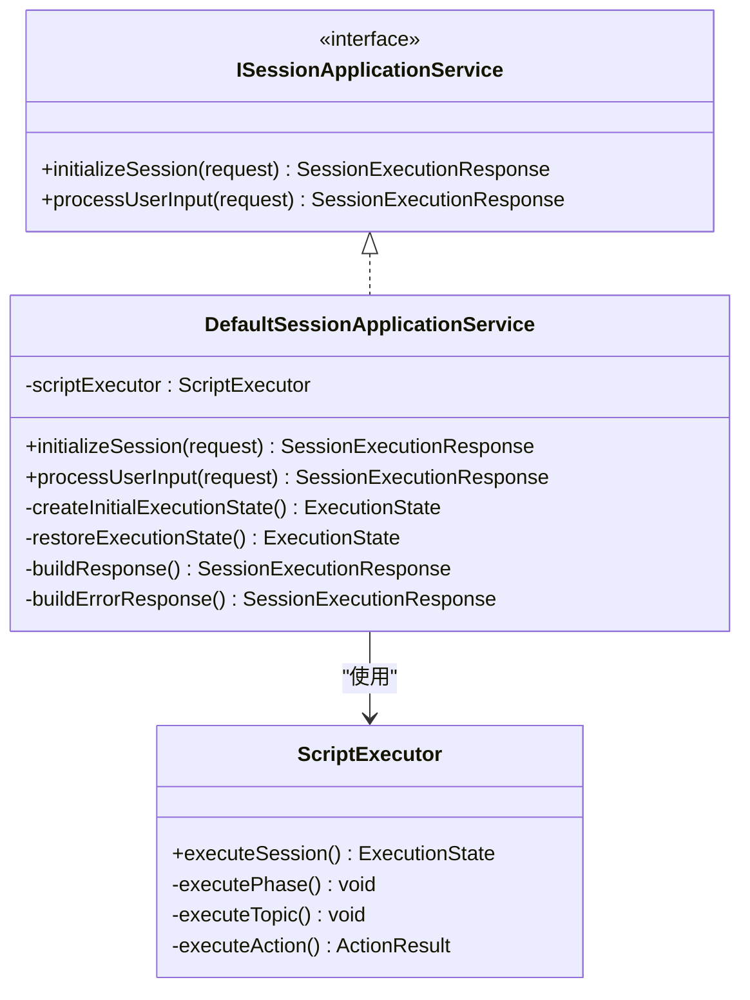

**图表来源**
- [session-application-service.ts](file://packages/core-engine/src/application/session-application-service.ts#L138-L175)
- [script-executor.ts](file://packages/core-engine/src/engines/script-execution/script-executor.ts#L87-L126)

### 会话管理器

会话管理器作为 API 层的核心组件，负责会话的完整生命周期管理：

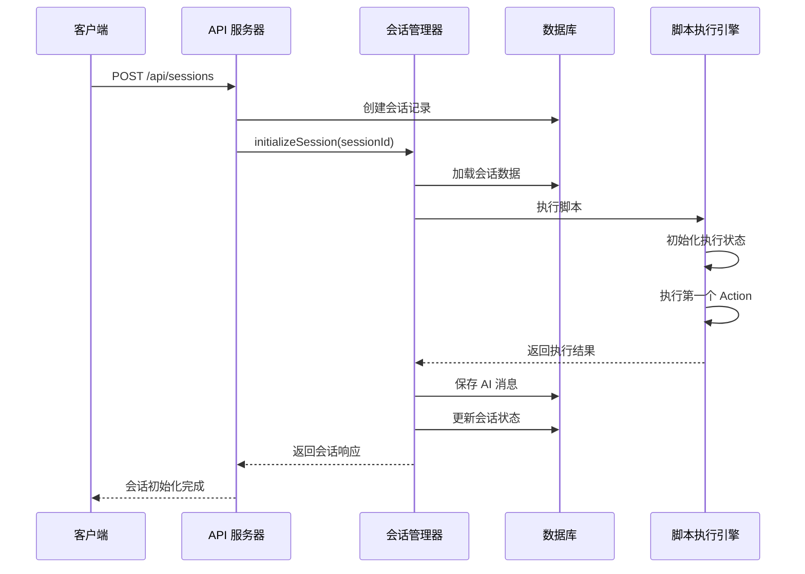

**图表来源**
- [session-manager.ts](file://packages/api-server/src/services/session-manager.ts#L598-L634)
- [sessions.ts](file://packages/api-server/src/routes/sessions.ts#L106-L147)

**章节来源**
- [session-application-service.ts](file://packages/core-engine/src/application/session-application-service.ts#L138-L160)
- [session-manager.ts](file://packages/api-server/src/services/session-manager.ts#L72-L77)

## 架构概览

系统采用分层架构设计，确保关注点分离和职责清晰：

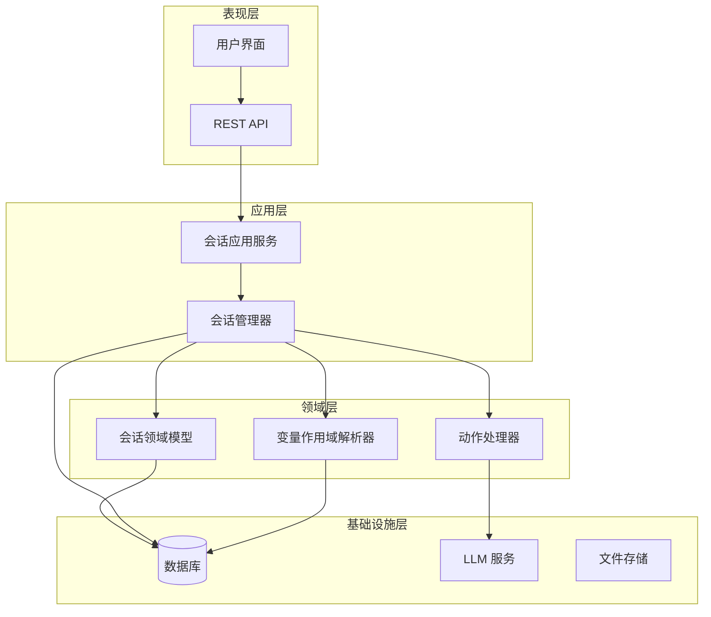

**图表来源**
- [session-application-service.ts](file://packages/core-engine/src/application/session-application-service.ts#L1-L50)
- [session-manager.ts](file://packages/api-server/src/services/session-manager.ts#L1-L50)

### 数据流分析

会话执行的数据流遵循严格的顺序和状态管理：

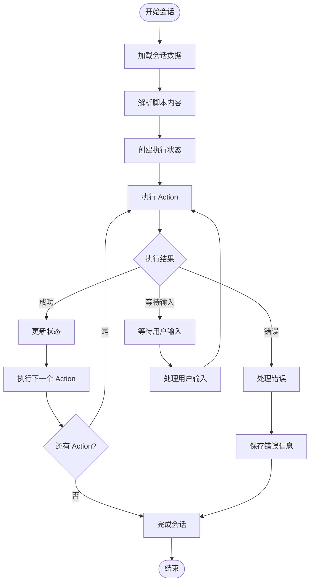

**图表来源**
- [script-executor.ts](file://packages/core-engine/src/engines/script-execution/script-executor.ts#L130-L467)

**章节来源**
- [session-application-service.ts](file://packages/core-engine/src/application/session-application-service.ts#L182-L294)
- [session-manager.ts](file://packages/api-server/src/services/session-manager.ts#L598-L692)

## 详细组件分析

### 会话应用服务实现

DefaultSessionApplicationService 是会话应用服务的核心实现，提供了完整的会话执行能力：

#### 初始化会话流程

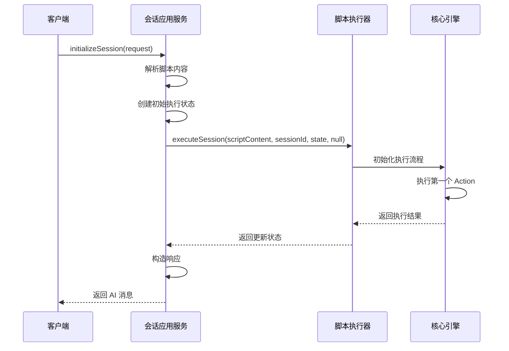

**图表来源**
- [session-application-service.ts](file://packages/core-engine/src/application/session-application-service.ts#L182-L233)

#### 处理用户输入流程

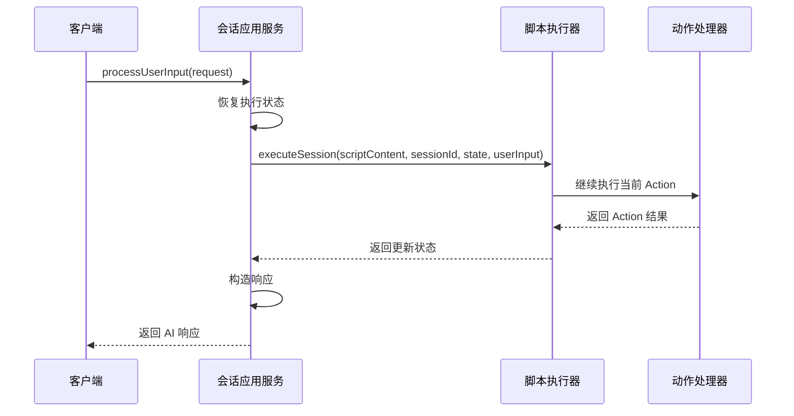

**图表来源**
- [session-application-service.ts](file://packages/core-engine/src/application/session-application-service.ts#L240-L294)

**章节来源**
- [session-application-service.ts](file://packages/core-engine/src/application/session-application-service.ts#L169-L502)

### 会话领域模型

会话领域模型是系统的核心聚合根，负责维护会话的完整状态：

#### 会话状态管理

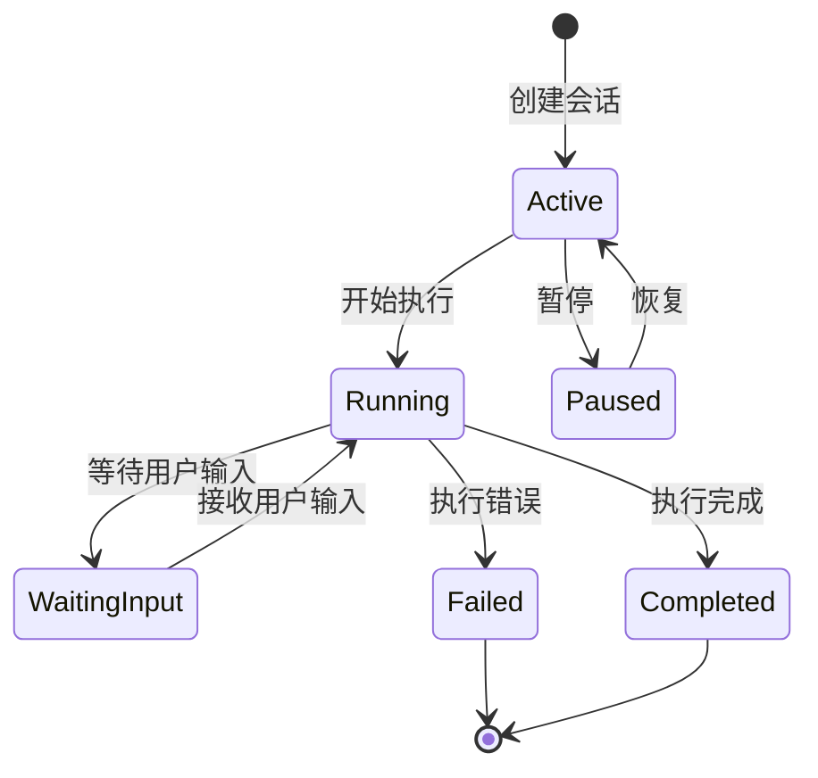

**图表来源**
- [session.ts](file://packages/core-engine/src/domain/session.ts#L93-L137)

#### 变量存储结构

系统采用双轨制变量存储机制，支持向后兼容：

| 存储方式 | 描述 | 用途 | 生命周期 |
|---------|------|------|----------|
| 旧版 variables | Map 结构 | 简单键值对存储 | 会话级 |
| 新版 variableStore | 分层结构 | 作用域感知存储 | 多级作用域 |

**章节来源**
- [session.ts](file://packages/core-engine/src/domain/session.ts#L26-L88)

### 动作处理器

系统支持多种动作类型，每种动作都有特定的执行逻辑：

#### AI 询问动作 (AiAskAction)

AI 询问动作支持多轮对话和变量提取：

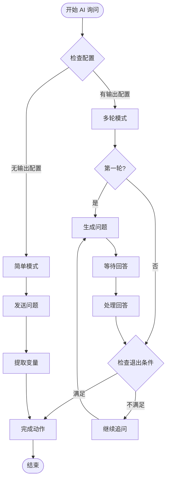

**图表来源**
- [ai-ask-action.ts](file://packages/core-engine/src/actions/ai-ask-action.ts#L130-L190)

#### AI 陈述动作 (AiSayAction)

AI 陈述动作支持智能理解和多轮对话：

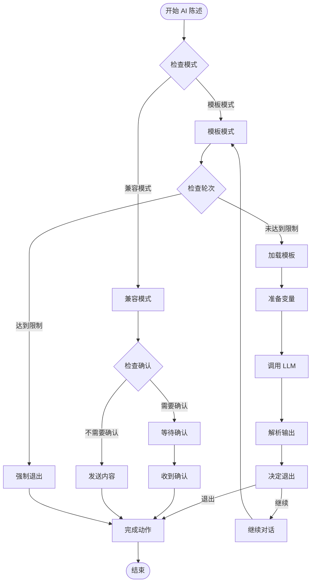

**图表来源**
- [ai-say-action.ts](file://packages/core-engine/src/actions/ai-say-action.ts#L117-L206)

**章节来源**
- [ai-ask-action.ts](file://packages/core-engine/src/actions/ai-ask-action.ts#L44-L586)
- [ai-say-action.ts](file://packages/core-engine/src/actions/ai-say-action.ts#L65-L399)

### 变量作用域解析器

VariableScopeResolver 负责变量的作用域管理和优先级查找：

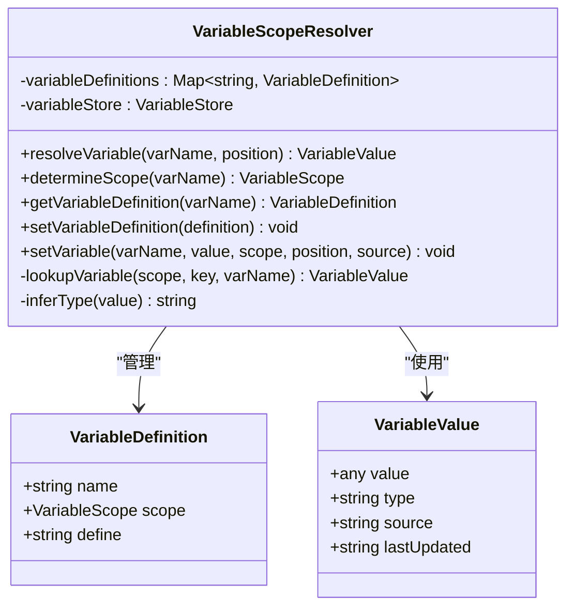

**图表来源**
- [variable-scope-resolver.ts](file://packages/core-engine/src/engines/variable-scope/variable-scope-resolver.ts#L31-L241)

**章节来源**
- [variable-scope-resolver.ts](file://packages/core-engine/src/engines/variable-scope/variable-scope-resolver.ts#L31-L241)

## 依赖关系分析

系统采用清晰的依赖层次结构，确保模块间的松耦合：

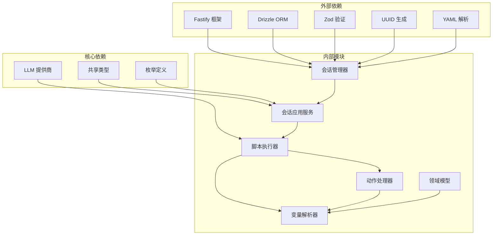

**图表来源**
- [session-manager.ts](file://packages/api-server/src/services/session-manager.ts#L7-L23)
- [session-application-service.ts](file://packages/core-engine/src/application/session-application-service.ts#L20-L25)

### 错误处理机制

系统实现了多层次的错误处理机制：

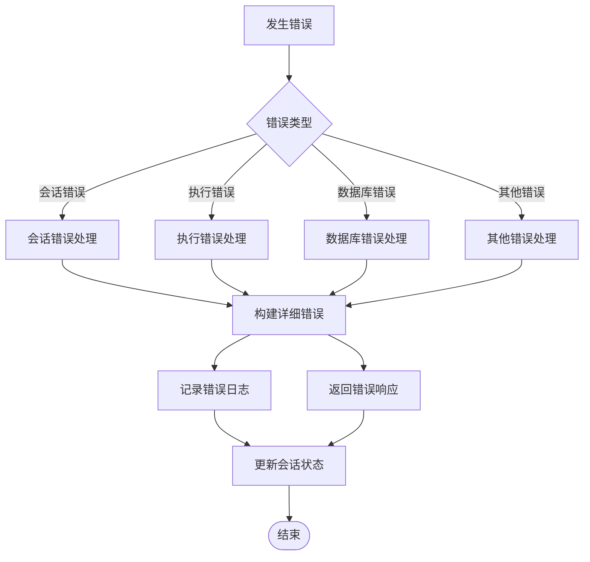

**图表来源**
- [session-manager.ts](file://packages/api-server/src/services/session-manager.ts#L499-L537)

**章节来源**
- [session-manager.ts](file://packages/api-server/src/services/session-manager.ts#L499-L537)

## 性能考虑

系统在设计时充分考虑了性能优化：

### 执行性能优化

1. **延迟加载**: 脚本执行器采用动态导入，避免不必要的依赖加载
2. **状态缓存**: 会话状态在内存中缓存，减少数据库访问
3. **批量操作**: 变量快照采用批量写入，提高数据库效率

### 内存管理

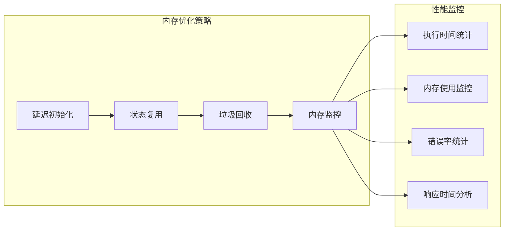

### 数据库优化

- **索引优化**: 为常用查询字段建立索引
- **连接池**: 使用连接池管理数据库连接
- **事务管理**: 合理使用事务确保数据一致性

## 故障排除指南

### 常见问题诊断

#### 会话初始化失败

**症状**: 初始化会话时报错，返回错误响应

**排查步骤**:
1. 检查脚本内容格式是否正确
2. 验证会话 ID 是否存在
3. 确认 LLM 服务可用性
4. 检查数据库连接状态

#### 用户输入处理异常

**症状**: 处理用户输入时出现错误

**排查步骤**:
1. 检查用户输入格式
2. 验证当前执行状态
3. 确认 Action 配置正确
4. 检查变量作用域解析

#### 变量存储问题

**症状**: 变量无法正确读取或写入

**排查步骤**:
1. 检查变量作用域配置
2. 验证变量定义元数据
3. 确认作用域解析逻辑
4. 检查变量存储结构

**章节来源**
- [session-application-service.ts](file://packages/core-engine/src/application/session-application-service.ts#L229-L232)
- [session-manager.ts](file://packages/api-server/src/services/session-manager.ts#L630-L633)

## 结论

会话应用服务作为 HeartRule 心理咨询脚本系统的核心组件，成功实现了以下目标：

1. **领域驱动设计**: 通过应用服务接口实现了业务逻辑与基础设施的清晰分离
2. **多轮对话支持**: 提供了完整的多轮对话执行框架，支持复杂的交互流程
3. **变量管理**: 实现了分层变量存储和作用域解析，确保变量的正确管理和访问
4. **错误处理**: 建立了完善的错误处理和恢复机制
5. **性能优化**: 采用了多种性能优化策略，确保系统的高效运行

系统的设计充分体现了 DDD 的核心原则，通过清晰的分层架构和职责分离，为心理咨询师提供了强大而灵活的会话辅助工具。未来可以在以下方面继续优化：

- 进一步完善测试覆盖率
- 增强监控和日志功能
- 优化性能指标和资源使用
- 扩展更多的动作类型和支持