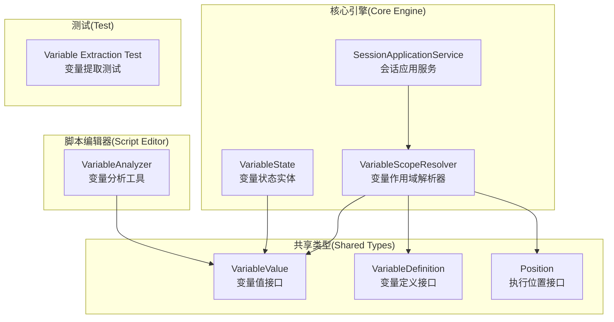
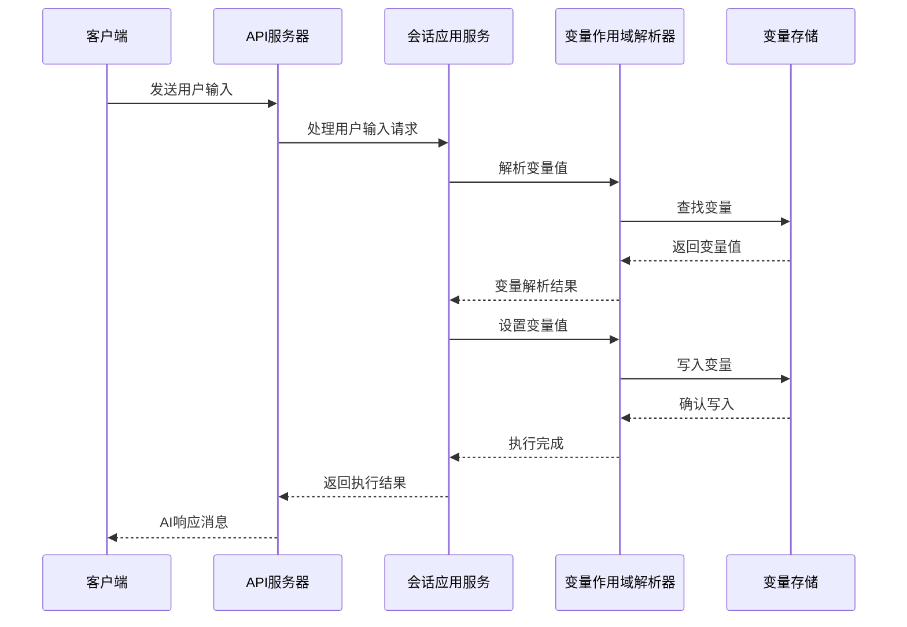
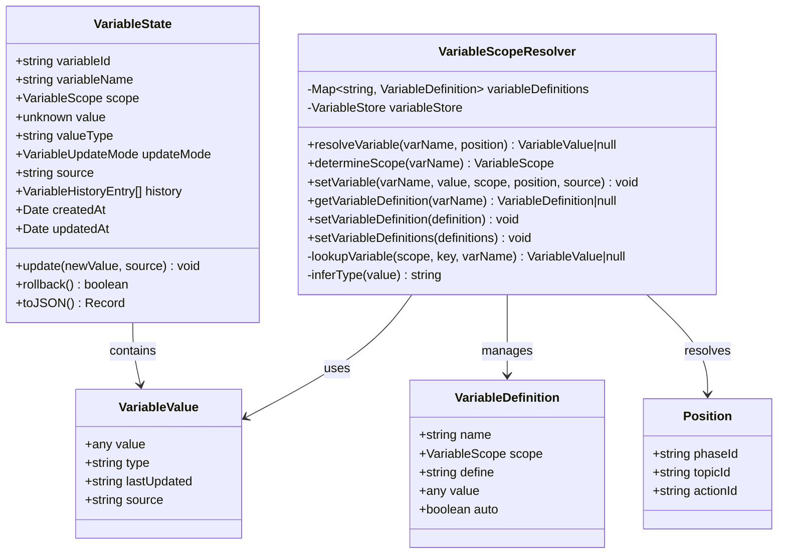
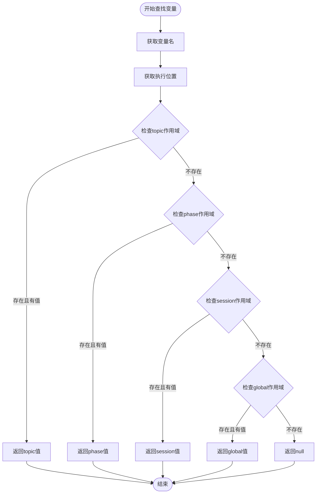
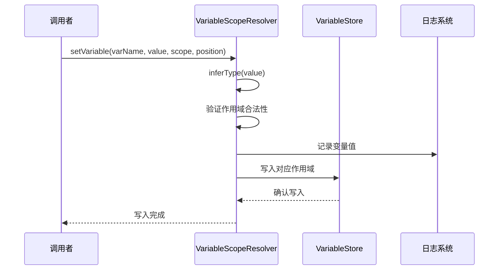
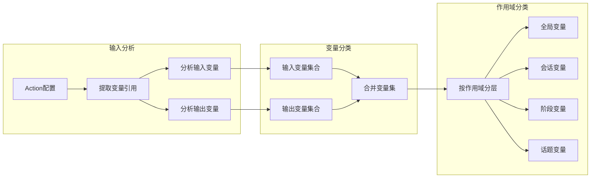
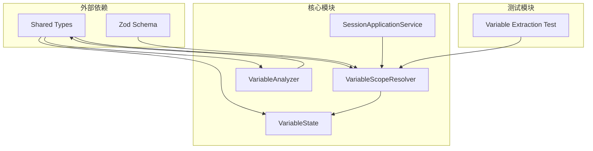

# 变量作用域管理

<cite>
**本文档引用的文件**
- [variable-scope-resolver.ts](file://packages/core-engine/src/engines/variable-scope/variable-scope-resolver.ts)
- [variable.ts](file://packages/core-engine/src/domain/variable.ts)
- [variable.ts](file://packages/shared-types/src/domain/variable.ts)
- [variableAnalyzer.ts](file://packages/script-editor/src/utils/variableAnalyzer.ts)
- [session-application-service.ts](file://packages/core-engine/src/application/session-application-service.ts)
- [variable-extraction.test.ts](file://packages/core-engine/test/variable-extraction.test.ts)
- [cbt_depression_assessment.yaml](file://scripts/sessions/cbt_depression_assessment.yaml)
- [REFACTOR_SUMMARY_target_variable.md](file://docs/REFACTOR_SUMMARY_target_variable.md)
</cite>

## 目录
1. [简介](#简介)
2. [项目结构](#项目结构)
3. [核心组件](#核心组件)
4. [架构概览](#架构概览)
5. [详细组件分析](#详细组件分析)
6. [依赖关系分析](#依赖关系分析)
7. [性能考虑](#性能考虑)
8. [故障排除指南](#故障排除指南)
9. [结论](#结论)

## 简介

变量作用域管理是HeartRule-Qcoder心理咨询服务系统的核心功能之一。该系统通过分层变量存储机制实现了精细化的数据管理，支持全局、会话、阶段和话题四个级别的变量作用域，确保数据在不同生命周期内的正确性和安全性。

系统采用领域驱动设计(DDD)原则，将变量作用域管理抽象为独立的领域服务，通过明确的优先级规则和生命周期管理，为AI心理咨询对话提供了可靠的数据支撑。

## 项目结构

HeartRule-Qcoder项目采用多包架构，变量作用域管理功能主要分布在以下模块中：



**图表来源**
- [variable-scope-resolver.ts](file://packages/core-engine/src/engines/variable-scope/variable-scope-resolver.ts#L1-L241)
- [variable.ts](file://packages/core-engine/src/domain/variable.ts#L1-L137)
- [variable.ts](file://packages/shared-types/src/domain/variable.ts#L1-L97)

**章节来源**
- [variable-scope-resolver.ts](file://packages/core-engine/src/engines/variable-scope/variable-scope-resolver.ts#L1-L241)
- [variable.ts](file://packages/core-engine/src/domain/variable.ts#L1-L137)
- [variable.ts](file://packages/shared-types/src/domain/variable.ts#L1-L97)

## 核心组件

### 变量作用域解析器

VariableScopeResolver是变量作用域管理的核心组件，负责变量在不同作用域之间的读写逻辑。其主要职责包括：

- **作用域决策**：根据变量定义或默认策略确定变量应写入的作用域
- **优先级查找**：按topic > phase > session > global顺序查找变量值
- **变量定义管理**：维护变量的作用域元数据

### 变量存储结构

系统采用分层存储结构，支持四种作用域级别：

| 作用域级别 | 生命周期 | 适用场景 | 存储结构 |
|-----------|----------|----------|----------|
| Global | 跨会话 | 全局配置、常量 | `{}` |
| Session | 会话生命周期 | 用户身份、会话元数据 | `{}` |
| Phase | 阶段生命周期 | 临时状态与中间结果 | `{ phaseId: {} }` |
| Topic | 话题生命周期 | 单一话题内的临时数据 | `{ topicId: {} }` |

### 变量状态管理

VariableState实体封装了单个变量的完整生命周期，包括值管理、更新策略和历史记录功能。

**章节来源**
- [variable-scope-resolver.ts](file://packages/core-engine/src/engines/variable-scope/variable-scope-resolver.ts#L25-L89)
- [variable.ts](file://packages/core-engine/src/domain/variable.ts#L12-L137)

## 架构概览

系统采用分层架构设计，变量作用域管理贯穿整个执行流程：



**图表来源**
- [session-application-service.ts](file://packages/core-engine/src/application/session-application-service.ts#L240-L294)
- [variable-scope-resolver.ts](file://packages/core-engine/src/engines/variable-scope/variable-scope-resolver.ts#L47-L69)

## 详细组件分析

### 变量作用域解析器类图



**图表来源**
- [variable-scope-resolver.ts](file://packages/core-engine/src/engines/variable-scope/variable-scope-resolver.ts#L31-L241)
- [variable.ts](file://packages/core-engine/src/domain/variable.ts#L32-L137)
- [variable.ts](file://packages/shared-types/src/domain/variable.ts#L8-L97)

### 作用域优先级查找流程

变量查找遵循严格的优先级规则，确保数据的正确性：



**图表来源**
- [variable-scope-resolver.ts](file://packages/core-engine/src/engines/variable-scope/variable-scope-resolver.ts#L47-L69)

### 变量写入流程

变量写入过程包含类型推断、作用域验证和数据持久化：



**图表来源**
- [variable-scope-resolver.ts](file://packages/core-engine/src/engines/variable-scope/variable-scope-resolver.ts#L171-L229)

**章节来源**
- [variable-scope-resolver.ts](file://packages/core-engine/src/engines/variable-scope/variable-scope-resolver.ts#L133-L229)
- [variable.ts](file://packages/core-engine/src/domain/variable.ts#L68-L117)

### 变量分析工具

脚本编辑器中的VariableAnalyzer工具负责分析Action节点中的变量使用情况：



**图表来源**
- [variableAnalyzer.ts](file://packages/script-editor/src/utils/variableAnalyzer.ts#L61-L173)

**章节来源**
- [variableAnalyzer.ts](file://packages/script-editor/src/utils/variableAnalyzer.ts#L1-L213)

## 依赖关系分析

### 核心依赖关系



**图表来源**
- [variable-scope-resolver.ts](file://packages/core-engine/src/engines/variable-scope/variable-scope-resolver.ts#L22-L23)
- [variable.ts](file://packages/core-engine/src/domain/variable.ts#L1)
- [session-application-service.ts](file://packages/core-engine/src/application/session-application-service.ts#L20-L22)

### 数据流依赖

变量作用域管理涉及复杂的数据流交互：

```mermaid
erDiagram
VARIABLE_DEFINITION {
string name PK
VariableScope scope
string define
any value
boolean auto
}
VARIABLE_VALUE {
any value
string type
string lastUpdated
string source
}
POSITION {
string phaseId
string topicId
string actionId
}
VARIABLE_STORE {
Record<string, VARIABLE_VALUE> global
Record<string, VARIABLE_VALUE> session
Record<string, Record<string, VARIABLE_VALUE>> phase
Record<string, Record<string, VARIABLE_VALUE>> topic
}
VARIABLE_DEFINITION ||--|| VARIABLE_VALUE : defines
POSITION ||--|| VARIABLE_STORE : positions
VARIABLE_STORE ||--|| VARIABLE_VALUE : contains
```

**图表来源**
- [variable.ts](file://packages/shared-types/src/domain/variable.ts#L32-L97)

**章节来源**
- [variable-scope-resolver.ts](file://packages/core-engine/src/engines/variable-scope/variable-scope-resolver.ts#L22-L23)
- [variable.ts](file://packages/shared-types/src/domain/variable.ts#L1-L97)

## 性能考虑

### 查询优化策略

1. **优先级查找优化**：通过预定义的查找顺序避免不必要的存储访问
2. **缓存机制**：变量定义通过Map结构提供O(1)的查找性能
3. **类型推断优化**：使用简单的类型检查减少计算开销

### 内存管理

- **作用域隔离**：不同作用域的变量存储相互独立，避免内存泄漏
- **生命周期管理**：通过作用域级别控制变量的创建和销毁
- **数据压缩**：VariableValue结构体精简存储空间

## 故障排除指南

### 常见问题及解决方案

#### 1. 变量写入失败

**问题现象**：变量无法写入指定作用域

**可能原因**：
- 缺少必要的执行位置信息（phaseId或topicId）
- 作用域定义不合法
- 变量存储结构损坏

**解决步骤**：
1. 检查Position对象是否包含正确的phaseId和topicId
2. 验证VariableScope枚举值的有效性
3. 确认VariableStore结构的完整性

#### 2. 变量查找结果异常

**问题现象**：变量查找返回意外的结果

**可能原因**：
- 作用域优先级规则被破坏
- 变量值冲突
- 缓存数据过期

**解决步骤**：
1. 验证变量查找的优先级顺序
2. 检查各作用域中的变量值
3. 清理相关缓存数据

#### 3. 类型推断错误

**问题现象**：变量类型推断不符合预期

**可能原因**：
- 值为null或undefined
- 复杂数据结构
- 类型转换异常

**解决步骤**：
1. 检查输入值的类型
2. 验证类型推断逻辑
3. 添加适当的类型转换

**章节来源**
- [variable-scope-resolver.ts](file://packages/core-engine/src/engines/variable-scope/variable-scope-resolver.ts#L185-L229)
- [variable-extraction.test.ts](file://packages/core-engine/test/variable-extraction.test.ts#L460-L527)

## 结论

HeartRule-Qcoder的变量作用域管理系统通过精心设计的分层架构和严格的优先级规则，为AI心理咨询对话提供了可靠的数据管理基础。系统的主要优势包括：

1. **清晰的生命周期管理**：通过四个作用域级别精确控制数据的生命周期
2. **严格的优先级规则**：确保数据访问的一致性和正确性
3. **完善的测试覆盖**：通过全面的单元测试保证系统稳定性
4. **灵活的扩展性**：支持新的作用域类型和变量定义

该系统为心理咨询服务提供了坚实的技术基础，能够支持复杂的对话流程和数据管理需求。随着系统的不断发展，变量作用域管理将继续发挥关键作用，为用户提供更好的服务体验。