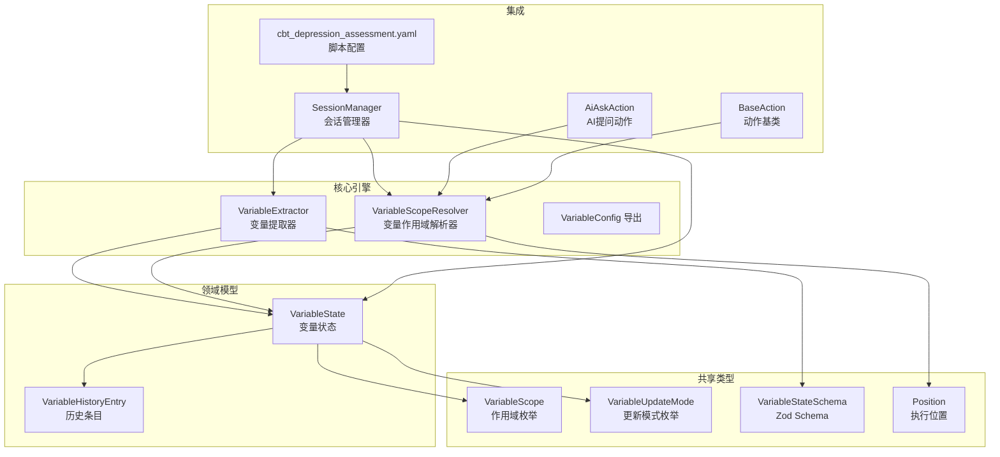
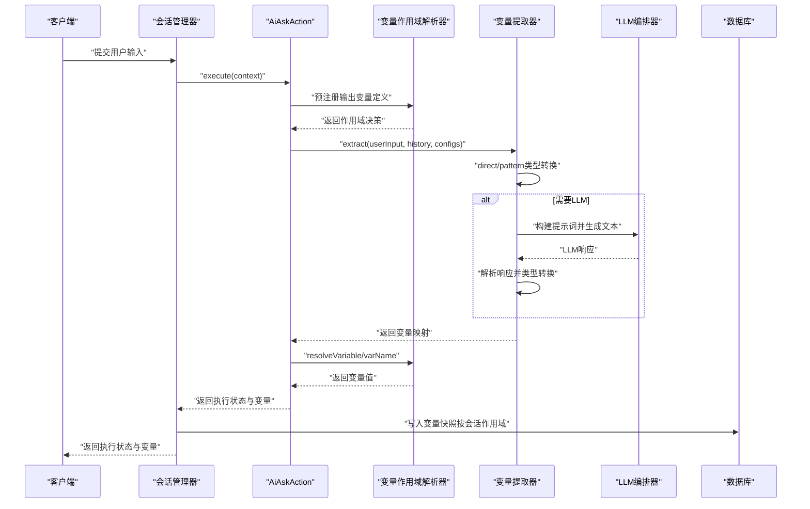
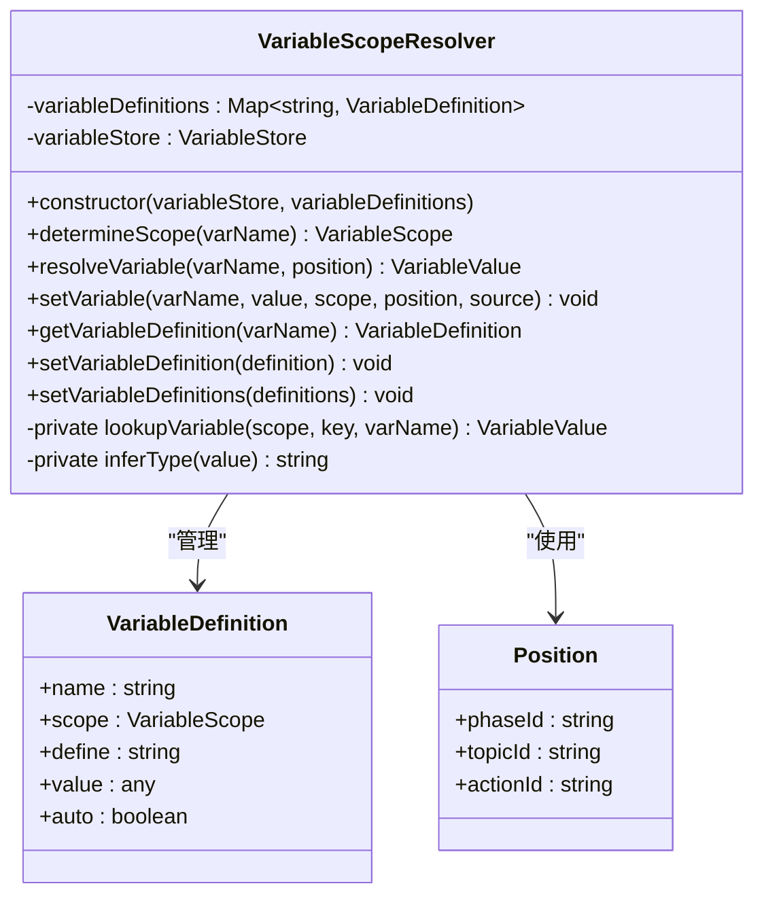
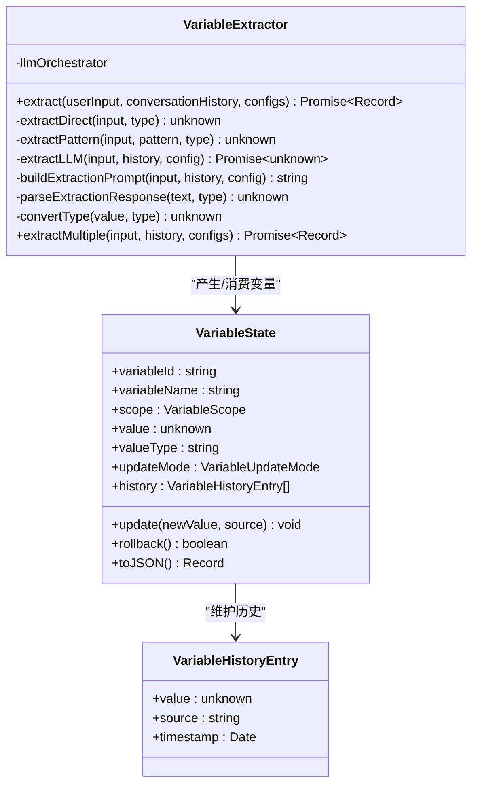
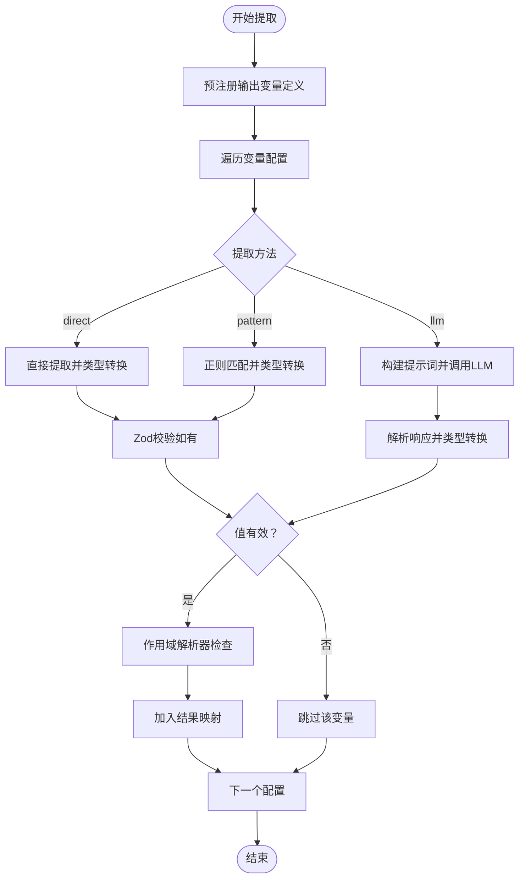
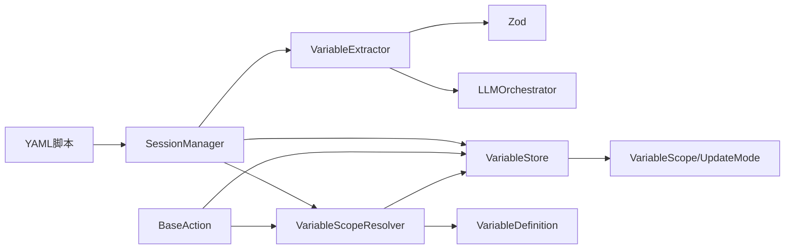

# 变量提取引擎

<cite>
**本文引用的文件**
- [packages/core-engine/src/engines/variable-extraction/extractor.ts](file://packages/core-engine/src/engines/variable-extraction/extractor.ts)
- [packages/core-engine/src/engines/variable-extraction/index.ts](file://packages/core-engine/src/engines/variable-extraction/index.ts)
- [packages/core-engine/src/engines/variable-scope/variable-scope-resolver.ts](file://packages/core-engine/src/engines/variable-scope/variable-scope-resolver.ts)
- [packages/core-engine/src/domain/variable.ts](file://packages/core-engine/src/domain/variable.ts)
- [packages/shared-types/src/domain/variable.ts](file://packages/shared-types/src/domain/variable.ts)
- [packages/shared-types/src/enums.ts](file://packages/shared-types/src/enums.ts)
- [packages/api-server/src/services/session-manager.ts](file://packages/api-server/src/services/session-manager.ts)
- [packages/api-server/test-full-flow.ts](file://packages/api-server/test-full-flow.ts)
- [scripts/sessions/cbt_depression_assessment.yaml](file://scripts/sessions/cbt_depression_assessment.yaml)
- [config/dev.yaml](file://config/dev.yaml)
- [packages/core-engine/src/actions/ai-ask-action.ts](file://packages/core-engine/src/actions/ai-ask-action.ts)
- [packages/core-engine/src/actions/base-action.ts](file://packages/core-engine/src/actions/base-action.ts)
- [docs/AI_ASK_VARIABLE_EXTRACTION_FIX.md](file://docs/AI_ASK_VARIABLE_EXTRACTION_FIX.md)
</cite>

## 目录
1. [简介](#简介)
2. [项目结构](#项目结构)
3. [核心组件](#核心组件)
4. [架构总览](#架构总览)
5. [详细组件分析](#详细组件分析)
6. [依赖分析](#依赖分析)
7. [性能考虑](#性能考虑)
8. [故障排查指南](#故障排查指南)
9. [结论](#结论)
10. [附录](#附录)

## 简介
本文件系统性阐述变量提取引擎的设计与实现，覆盖以下关键主题：
- 变量提取机制：直接提取、正则表达式匹配、LLM智能提取
- 上下文分析：基于对话历史的上下文增强
- 变量识别与类型转换：内置类型推断与Zod Schema校验
- 作用域管理：全局、会话、阶段、话题的变量作用域与更新模式
- 作用域解析器：自动注册输出变量到适当作用域
- 优先级与冲突处理：提取顺序与覆盖策略
- 动态计算与缓存：可扩展的缓存与批处理优化
- 配置与自定义：变量配置项、提示词模板与LLM参数
- 性能优化：批量提取、非LLM优先、短历史窗口
- 实际用例：脚本驱动的变量提取与会话持久化

## 项目结构
变量提取引擎位于核心引擎包中，围绕"变量配置-提取器-作用域解析器-领域模型-共享类型"形成清晰分层：
- 引擎层：变量提取器与导出入口
- 作用域层：变量作用域解析器，负责变量的作用域决策与优先级查找
- 领域层：变量状态与历史管理
- 共享层：变量作用域与更新模式枚举及Schema
- 集成层：会话管理器与脚本配置驱动变量提取

**图表来源**
- [packages/core-engine/src/engines/variable-extraction/extractor.ts](file://packages/core-engine/src/engines/variable-extraction/extractor.ts#L25-L316)
- [packages/core-engine/src/engines/variable-scope/variable-scope-resolver.ts](file://packages/core-engine/src/engines/variable-scope/variable-scope-resolver.ts#L31-L38)
- [packages/core-engine/src/domain/variable.ts](file://packages/core-engine/src/domain/variable.ts#L15-L119)
- [packages/shared-types/src/domain/variable.ts](file://packages/shared-types/src/domain/variable.ts#L13-L58)
- [packages/shared-types/src/enums.ts](file://packages/shared-types/src/enums.ts#L52-L68)
- [packages/api-server/src/services/session-manager.ts](file://packages/api-server/src/services/session-manager.ts#L21-L132)
- [scripts/sessions/cbt_depression_assessment.yaml](file://scripts/sessions/cbt_depression_assessment.yaml#L47-L125)
- [packages/core-engine/src/actions/ai-ask-action.ts](file://packages/core-engine/src/actions/ai-ask-action.ts#L75-L101)
- [packages/core-engine/src/actions/base-action.ts](file://packages/core-engine/src/actions/base-action.ts#L38-L55)

**章节来源**
- [packages/core-engine/src/engines/variable-extraction/extractor.ts](file://packages/core-engine/src/engines/variable-extraction/extractor.ts#L1-L317)
- [packages/core-engine/src/engines/variable-extraction/index.ts](file://packages/core-engine/src/engines/variable-extraction/index.ts#L1-L12)
- [packages/core-engine/src/engines/variable-scope/variable-scope-resolver.ts](file://packages/core-engine/src/engines/variable-scope/variable-scope-resolver.ts#L1-L241)
- [packages/core-engine/src/domain/variable.ts](file://packages/core-engine/src/domain/variable.ts#L1-L120)
- [packages/shared-types/src/domain/variable.ts](file://packages/shared-types/src/domain/variable.ts#L1-L97)
- [packages/shared-types/src/enums.ts](file://packages/shared-types/src/enums.ts#L52-L68)
- [packages/api-server/src/services/session-manager.ts](file://packages/api-server/src/services/session-manager.ts#L1-L132)
- [scripts/sessions/cbt_depression_assessment.yaml](file://scripts/sessions/cbt_depression_assessment.yaml#L1-L166)

## 核心组件
- 变量提取器（VariableExtractor）
  - 支持三种提取方法：direct（直接）、pattern（正则）、llm（LLM）
  - 输入：用户输入、对话历史、变量配置数组
  - 输出：键值对形式的变量映射
  - 特性：类型转换、Zod Schema校验、批量提取、上下文增强
- 变量作用域解析器（VariableScopeResolver）
  - **新增**：负责变量的作用域决策与优先级查找
  - **核心职责**：作用域决策、优先级查找、变量定义管理
  - **作用域规则**：global、session、phase、topic
  - **默认策略**：未定义变量默认写入topic作用域
- 变量状态（VariableState）
  - 维护变量的值、类型、作用域、更新模式、来源与历史
  - 支持覆盖、追加、合并三种更新模式
  - 提供回滚能力与序列化
- 共享类型与枚举
  - VariableScope：global、session、phase、topic
  - VariableUpdateMode：overwrite、append、merge
  - Position：执行位置（phaseId、topicId、actionId）
  - Zod Schema：对变量状态进行结构化校验

**章节来源**
- [packages/core-engine/src/engines/variable-extraction/extractor.ts](file://packages/core-engine/src/engines/variable-extraction/extractor.ts#L25-L316)
- [packages/core-engine/src/engines/variable-scope/variable-scope-resolver.ts](file://packages/core-engine/src/engines/variable-scope/variable-scope-resolver.ts#L31-L89)
- [packages/core-engine/src/domain/variable.ts](file://packages/core-engine/src/domain/variable.ts#L15-L119)
- [packages/shared-types/src/domain/variable.ts](file://packages/shared-types/src/domain/variable.ts#L13-L58)
- [packages/shared-types/src/enums.ts](file://packages/shared-types/src/enums.ts#L52-L68)

## 架构总览
变量提取在会话生命周期内被调用，典型流程如下：
- 会话管理器根据脚本配置触发变量提取
- 提取器按配置顺序执行，优先非LLM路径，必要时调用LLM
- **新增**：作用域解析器自动注册输出变量定义并确定作用域
- 结果写入会话变量，并持久化到数据库

**图表来源**
- [packages/api-server/src/services/session-manager.ts](file://packages/api-server/src/services/session-manager.ts#L21-L132)
- [packages/core-engine/src/engines/variable-extraction/extractor.ts](file://packages/core-engine/src/engines/variable-extraction/extractor.ts#L35-L77)
- [packages/core-engine/src/engines/variable-extraction/extractor.ts](file://packages/core-engine/src/engines/variable-extraction/extractor.ts#L152-L176)
- [packages/core-engine/src/actions/ai-ask-action.ts](file://packages/core-engine/src/actions/ai-ask-action.ts#L75-L101)
- [packages/core-engine/src/engines/variable-scope/variable-scope-resolver.ts](file://packages/core-engine/src/engines/variable-scope/variable-scope-resolver.ts#L47-L69)

## 详细组件分析

### 变量作用域解析器类图

**图表来源**
- [packages/core-engine/src/engines/variable-scope/variable-scope-resolver.ts](file://packages/core-engine/src/engines/variable-scope/variable-scope-resolver.ts#L31-L241)
- [packages/shared-types/src/domain/variable.ts](file://packages/shared-types/src/domain/variable.ts#L56-L87)

### 变量提取器类图

**图表来源**
- [packages/core-engine/src/engines/variable-extraction/extractor.ts](file://packages/core-engine/src/engines/variable-extraction/extractor.ts#L25-L316)
- [packages/core-engine/src/domain/variable.ts](file://packages/core-engine/src/domain/variable.ts#L15-L119)

### 提取流程与优先级
- 顺序遍历变量配置，按提取方法分类：
  - direct/pattern：立即执行，类型转换后校验
  - llm：延迟执行，结合上下文构建提示词
- 优先级策略：
  - 非LLM优先：批量提取中先处理非LLM配置，再统一处理LLM配置
  - 覆盖策略：若某配置校验失败，跳过该变量，不影响其他变量
- **新增**：作用域解析器自动注册未定义的输出变量到topic作用域
- 上下文增强：
  - 仅取最近N条对话历史（当前实现取最近3条），减少LLM成本

**图表来源**
- [packages/core-engine/src/engines/variable-extraction/extractor.ts](file://packages/core-engine/src/engines/variable-extraction/extractor.ts#L35-L77)
- [packages/core-engine/src/engines/variable-extraction/extractor.ts](file://packages/core-engine/src/engines/variable-extraction/extractor.ts#L290-L315)
- [packages/core-engine/src/actions/ai-ask-action.ts](file://packages/core-engine/src/actions/ai-ask-action.ts#L75-L101)

**章节来源**
- [packages/core-engine/src/engines/variable-extraction/extractor.ts](file://packages/core-engine/src/engines/variable-extraction/extractor.ts#L35-L77)
- [packages/core-engine/src/engines/variable-extraction/extractor.ts](file://packages/core-engine/src/engines/variable-extraction/extractor.ts#L290-L315)
- [packages/core-engine/src/actions/ai-ask-action.ts](file://packages/core-engine/src/actions/ai-ask-action.ts#L75-L101)

### 类型转换与解析
- 直接提取：依据类型进行trim、数字匹配、布尔关键词判定、列表分隔、JSON解析
- 正则提取：使用传入pattern构建RegExp，取捕获组或整体匹配，再类型转换
- LLM解析：根据类型尝试JSON解析或简单字符串处理
- 类型转换：统一convertType以保证输出类型一致性

**章节来源**
- [packages/core-engine/src/engines/variable-extraction/extractor.ts](file://packages/core-engine/src/engines/variable-extraction/extractor.ts#L82-L123)
- [packages/core-engine/src/engines/variable-extraction/extractor.ts](file://packages/core-engine/src/engines/variable-extraction/extractor.ts#L128-L147)
- [packages/core-engine/src/engines/variable-extraction/extractor.ts](file://packages/core-engine/src/engines/variable-extraction/extractor.ts#L240-L263)
- [packages/core-engine/src/engines/variable-extraction/extractor.ts](file://packages/core-engine/src/engines/variable-extraction/extractor.ts#L268-L285)

### 作用域与更新模式
- 作用域（VariableScope）：global、session、phase、topic
- 更新模式（VariableUpdateMode）：overwrite、append、merge
- 变量状态（VariableState）：
  - 维护历史条目（含值、来源、时间戳）
  - update支持三种模式，rollback可回退至上一版本
  - toJSON便于持久化与调试
- **新增**：作用域解析器提供变量定义管理和优先级查找

**章节来源**
- [packages/shared-types/src/enums.ts](file://packages/shared-types/src/enums.ts#L52-L68)
- [packages/core-engine/src/domain/variable.ts](file://packages/core-engine/src/domain/variable.ts#L15-L119)
- [packages/shared-types/src/domain/variable.ts](file://packages/shared-types/src/domain/variable.ts#L13-L58)
- [packages/core-engine/src/engines/variable-scope/variable-scope-resolver.ts](file://packages/core-engine/src/engines/variable-scope/variable-scope-resolver.ts#L77-L89)

### 与会话管理的集成
- 会话管理器负责：
  - 推断变量类型（value_type）
  - 构造变量快照（仅在值变化时写入）
  - 将变量写入会话并持久化
- **新增**：作用域解析器集成到执行上下文中，提供实时变量查找
- 脚本配置示例展示了target_variable与extraction_prompt的使用方式

**章节来源**
- [packages/api-server/src/services/session-manager.ts](file://packages/api-server/src/services/session-manager.ts#L21-L132)
- [scripts/sessions/cbt_depression_assessment.yaml](file://scripts/sessions/cbt_depression_assessment.yaml#L47-L125)
- [packages/core-engine/src/actions/base-action.ts](file://packages/core-engine/src/actions/base-action.ts#L38-L55)

## 依赖分析
- 内部依赖
  - VariableExtractor依赖LLM编排器（可选），用于LLM提取
  - VariableScopeResolver依赖VariableStore和VariableDefinition
  - VariableState作为领域模型，依赖共享类型中的作用域与更新模式枚举
  - BaseAction提供ActionContext，包含scopeResolver和variableStore
- 外部依赖
  - Zod用于Schema校验
  - YAML脚本配置驱动变量提取行为

**图表来源**
- [packages/core-engine/src/engines/variable-extraction/extractor.ts](file://packages/core-engine/src/engines/variable-extraction/extractor.ts#L1-L3)
- [packages/core-engine/src/engines/variable-scope/variable-scope-resolver.ts](file://packages/core-engine/src/engines/variable-scope/variable-scope-resolver.ts#L22-L23)
- [packages/core-engine/src/domain/variable.ts](file://packages/core-engine/src/domain/variable.ts#L1-L2)
- [packages/shared-types/src/enums.ts](file://packages/shared-types/src/enums.ts#L52-L68)
- [packages/api-server/src/services/session-manager.ts](file://packages/api-server/src/services/session-manager.ts#L7-L16)
- [scripts/sessions/cbt_depression_assessment.yaml](file://scripts/sessions/cbt_depression_assessment.yaml#L47-L125)
- [packages/core-engine/src/actions/base-action.ts](file://packages/core-engine/src/actions/base-action.ts#L26-L26)

**章节来源**
- [packages/core-engine/src/engines/variable-extraction/extractor.ts](file://packages/core-engine/src/engines/variable-extraction/extractor.ts#L1-L3)
- [packages/core-engine/src/engines/variable-scope/variable-scope-resolver.ts](file://packages/core-engine/src/engines/variable-scope/variable-scope-resolver.ts#L22-L23)
- [packages/core-engine/src/domain/variable.ts](file://packages/core-engine/src/domain/variable.ts#L1-L2)
- [packages/shared-types/src/enums.ts](file://packages/shared-types/src/enums.ts#L52-L68)
- [packages/api-server/src/services/session-manager.ts](file://packages/api-server/src/services/session-manager.ts#L7-L16)
- [scripts/sessions/cbt_depression_assessment.yaml](file://scripts/sessions/cbt_depression_assessment.yaml#L47-L125)
- [packages/core-engine/src/actions/base-action.ts](file://packages/core-engine/src/actions/base-action.ts#L26-L26)

## 性能考虑
- 批量提取优化
  - 非LLM配置优先处理，LLM配置集中处理，降低LLM调用频次
- **新增**：实时变量提取优化
  - 在LLM调用后立即提取变量，避免等待ai_ask完成
  - 减少变量提取的延迟，提升用户体验
- 上下文裁剪
  - 仅保留最近N条对话历史，减少提示词长度与LLM成本
- 类型转换与校验
  - 直接/正则路径避免LLM开销；Zod校验在必要时进行
- **新增**：作用域解析器缓存
  - 变量定义缓存在Map中，提供O(1)查找效率
  - 作用域决策逻辑简单明确，性能开销极小
- 缓存策略（建议）
  - 对热点变量与常用正则结果进行内存缓存
  - 对LLM提取结果按输入哈希缓存，注意作用域隔离
- 大数据量处理
  - 控制变量数量与提示词长度
  - 对长列表/对象采用分页或分段提取

## 故障排查指南
- LLM不可用
  - 现象：日志警告"LLM编排器不可用"，LLM提取返回undefined
  - 处理：检查LLM编排器注入与配置
- 提取失败
  - 现象：正则匹配失败或解析错误
  - 处理：检查pattern与输入格式；确认类型转换逻辑
- 校验失败
  - 现象：Zod校验抛错，变量被跳过
  - 处理：调整schema或输入格式
- **新增**：变量作用域问题
  - 现象：变量未写入期望的作用域
  - 处理：检查VariableScopeResolver的determineScope逻辑；确认变量定义
- **新增**：变量提取延迟
  - 现象：变量在ai_ask完成后才显示
  - 处理：检查generateQuestionFromTemplate中的变量提取逻辑
- 会话变量未持久化
  - 现象：数据库未更新
  - 处理：确认会话管理器的变量快照逻辑与写入条件

**章节来源**
- [packages/core-engine/src/engines/variable-extraction/extractor.ts](file://packages/core-engine/src/engines/variable-extraction/extractor.ts#L157-L159)
- [packages/core-engine/src/engines/variable-extraction/extractor.ts](file://packages/core-engine/src/engines/variable-extraction/extractor.ts#L143-L146)
- [packages/core-engine/src/engines/variable-extraction/extractor.ts](file://packages/core-engine/src/engines/variable-extraction/extractor.ts#L67-L69)
- [packages/core-engine/src/engines/variable-scope/variable-scope-resolver.ts](file://packages/core-engine/src/engines/variable-scope/variable-scope-resolver.ts#L77-L89)
- [packages/api-server/src/services/session-manager.ts](file://packages/api-server/src/services/session-manager.ts#L44-L68)

## 结论
变量提取引擎通过"直接/正则/LLM"三通道与"类型转换+Schema校验"的组合，实现了灵活且稳健的变量抽取能力。**新增的变量作用域解析器**进一步增强了系统的健壮性，解决了多轮对话中的变量作用域污染和重复变量创建问题，实现了自动注册输出变量到适当作用域的功能。配合会话管理器与脚本配置，可在不同阶段与话题中精确控制变量的作用域与更新模式。通过批量提取、上下文裁剪、实时变量提取与可扩展缓存，引擎具备良好的性能与可维护性。

## 附录

### 配置选项与自定义规则
- 变量配置项
  - name：变量名
  - type：text、number、boolean、list、object
  - extractionMethod：direct、pattern、llm
  - pattern：正则表达式（当method为pattern时）
  - description：变量说明（用于提示词构建）
  - schema：Zod Schema（可选，用于强类型校验）
- **新增**：变量定义配置
  - scope：变量作用域（global、session、phase、topic）
  - define：变量定义说明
  - value：默认值
  - auto：是否自动更新
- 提示词构建
  - 自动拼接最近N条对话历史与当前输入
  - 包含变量名称、类型与说明
- LLM参数
  - 由LLM编排器承载（如provider、model、temperature、max_tokens等）

**章节来源**
- [packages/core-engine/src/engines/variable-extraction/extractor.ts](file://packages/core-engine/src/engines/variable-extraction/extractor.ts#L8-L15)
- [packages/core-engine/src/engines/variable-extraction/extractor.ts](file://packages/core-engine/src/engines/variable-extraction/extractor.ts#L181-L212)
- [packages/shared-types/src/domain/variable.ts](file://packages/shared-types/src/domain/variable.ts#L56-L67)
- [config/dev.yaml](file://config/dev.yaml#L16-L31)

### 实际使用示例
- 脚本驱动的变量提取
  - 示例脚本定义了目标变量与提取提示，用于引导AI提问并抽取用户输入中的关键信息
- **新增**：自动注册输出变量
  - 在ai_ask动作首次执行时，自动将output配置中的变量注册到VariableScopeResolver
  - 未定义的变量默认注册到topic作用域，避免作用域污染
- 完整会话流程测试
  - 展示从创建会话到多轮对话、变量提取与状态持久化的端到端流程

**章节来源**
- [scripts/sessions/cbt_depression_assessment.yaml](file://scripts/sessions/cbt_depression_assessment.yaml#L47-L125)
- [packages/api-server/test-full-flow.ts](file://packages/api-server/test-full-flow.ts#L95-L127)
- [packages/core-engine/src/actions/ai-ask-action.ts](file://packages/core-engine/src/actions/ai-ask-action.ts#L75-L101)
- [docs/AI_ASK_VARIABLE_EXTRACTION_FIX.md](file://docs/AI_ASK_VARIABLE_EXTRACTION_FIX.md#L33-L57)