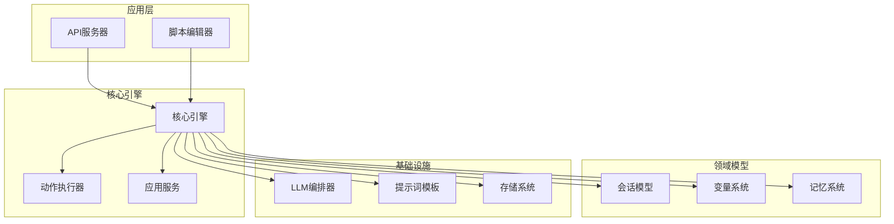
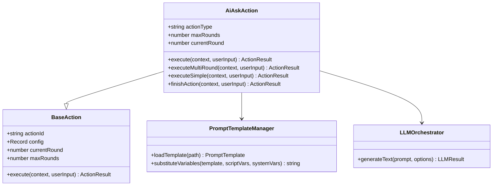
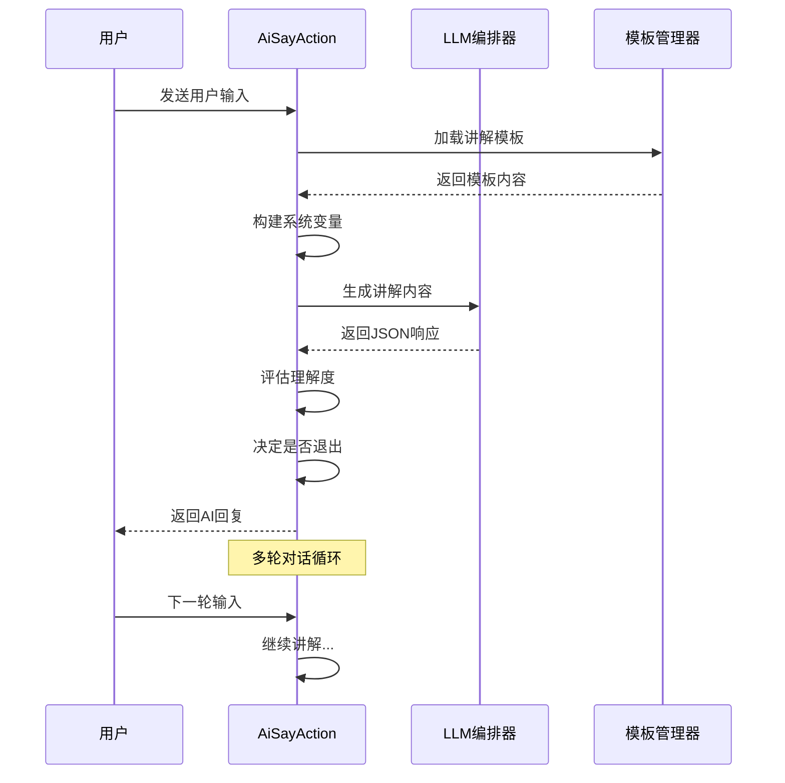
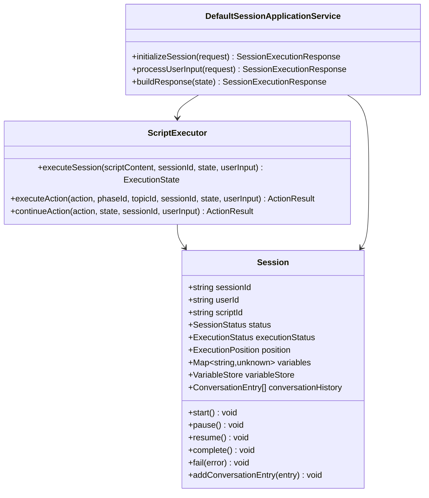
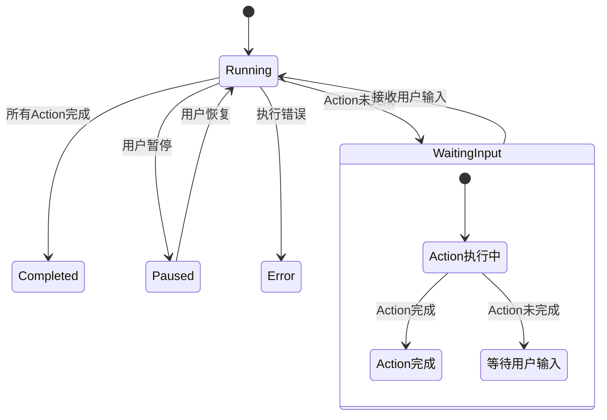
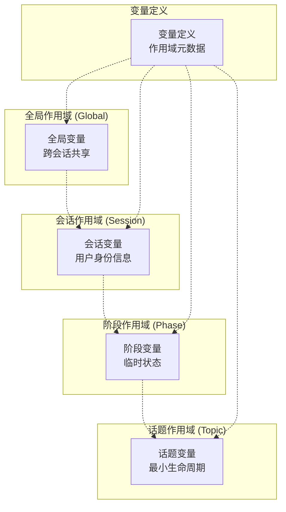
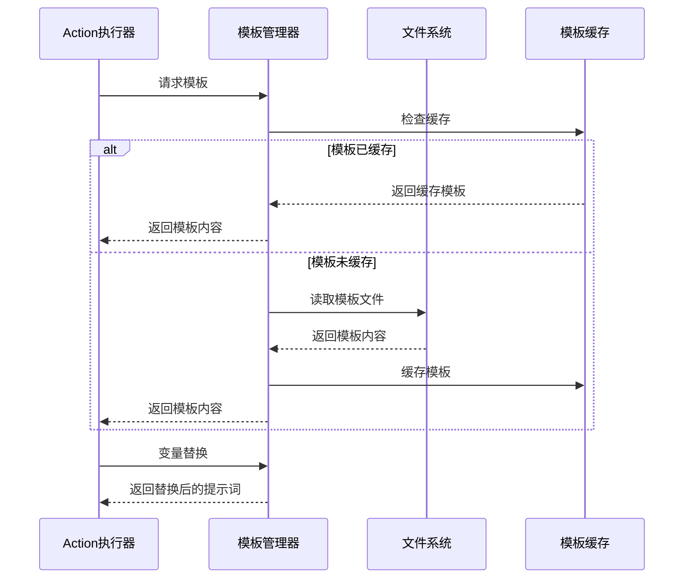
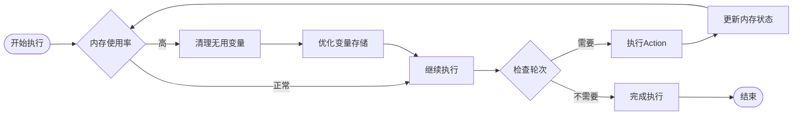

# 多轮对话支持

<cite>
**本文档引用的文件**
- [ai-ask-action.ts](file://packages/core-engine/src/actions/ai-ask-action.ts)
- [ai-say-action.ts](file://packages/core-engine/src/actions/ai-say-action.ts)
- [session.ts](file://packages/core-engine/src/domain/session.ts)
- [session-application-service.ts](file://packages/core-engine/src/application/session-application-service.ts)
- [base-action.ts](file://packages/core-engine/src/actions/base-action.ts)
- [script-executor.ts](file://packages/core-engine/src/engines/script-execution/script-executor.ts)
- [variable-scope-resolver.ts](file://packages/core-engine/src/engines/variable-scope/variable-scope-resolver.ts)
- [template-manager.ts](file://packages/core-engine/src/engines/prompt-template/template-manager.ts)
- [multi-round-ask.md](file://config/prompts/ai-ask/multi-round-ask.md)
- [simple-ask.md](file://config/prompts/ai-ask/simple-ask.md)
- [mainline-a-introduce-concept.md](file://config/prompts/ai-say/mainline-a-introduce-concept.md)
- [test-ai-ask-multi-round-regression.test.ts](file://packages/api-server/test-ai-ask-multi-round-regression.test.ts)
</cite>

## 目录
1. [简介](#简介)
2. [项目结构概览](#项目结构概览)
3. [核心组件分析](#核心组件分析)
4. [架构设计](#架构设计)
5. [多轮对话实现机制](#多轮对话实现机制)
6. [变量作用域管理](#变量作用域管理)
7. [提示词模板系统](#提示词模板系统)
8. [性能优化考虑](#性能优化考虑)
9. [故障排除指南](#故障排除指南)
10. [总结](#总结)

## 简介

HeartRule-Qcoder 是一个基于人工智能的心理咨询对话系统，专门设计用于支持复杂的多轮对话交互。该系统的核心优势在于其强大的多轮对话支持能力，能够实现智能的用户问答、变量提取、作用域管理和状态持久化。

系统采用模块化架构设计，通过 Action 模式实现可扩展的对话流程控制，结合分层变量存储系统，确保多轮对话中的状态一致性和数据完整性。无论是简单的问答交互还是复杂的情感咨询场景，系统都能提供流畅、自然的用户体验。

## 项目结构概览

系统采用分层架构设计，主要分为以下几个核心层次：



**图表来源**
- [session-application-service.ts](file://packages/core-engine/src/application/session-application-service.ts#L138-L160)
- [script-executor.ts](file://packages/core-engine/src/engines/script-execution/script-executor.ts#L87-L126)

**章节来源**
- [session-application-service.ts](file://packages/core-engine/src/application/session-application-service.ts#L1-L160)
- [script-executor.ts](file://packages/core-engine/src/engines/script-execution/script-executor.ts#L1-L126)

## 核心组件分析

### AI问答动作 (AiAskAction)

AI问答动作是多轮对话的核心组件，负责处理用户提问和变量提取。该组件支持两种执行模式：

#### 多轮追问模式
- **智能退出决策**：基于LLM判断是否满足退出条件
- **动态变量提取**：从用户回答中提取结构化信息
- **轮次控制**：支持最大轮次限制和智能中断
- **模板驱动**：使用多轮对话模板生成问题

#### 简单问答模式
- **直接变量提取**：将用户输入直接映射到指定变量
- **单轮执行**：无需等待用户输入即可完成
- **向后兼容**：支持传统的target_variable配置



**图表来源**
- [ai-ask-action.ts](file://packages/core-engine/src/actions/ai-ask-action.ts#L44-L71)
- [base-action.ts](file://packages/core-engine/src/actions/base-action.ts#L95-L107)

**章节来源**
- [ai-ask-action.ts](file://packages/core-engine/src/actions/ai-ask-action.ts#L1-L586)

### AI讲解动作 (AiSayAction)

AI讲解动作负责向用户提供信息和概念介绍，支持多轮理解和退出决策：

#### 智能理解度评估
- **理解度评分**：0-100分的用户理解程度评估
- **疑问检测**：自动识别用户是否有疑问
- **明确表达判断**：检测用户是否明确表达理解
- **退出决策**：基于理解度和疑问情况决定是否继续

#### 多轮对话控制
- **轮次限制**：通过max_rounds控制对话轮次
- **理解阈值**：可配置的理解度阈值
- **智能中断**：当用户理解充分时自动结束



**图表来源**
- [ai-say-action.ts](file://packages/core-engine/src/actions/ai-say-action.ts#L117-L206)
- [mainline-a-introduce-concept.md](file://config/prompts/ai-say/mainline-a-introduce-concept.md#L1-L52)

**章节来源**
- [ai-say-action.ts](file://packages/core-engine/src/actions/ai-say-action.ts#L1-L399)

## 架构设计

### 会话管理系统

系统采用会话驱动的设计模式，每个会话都是独立的执行上下文：



**图表来源**
- [session.ts](file://packages/core-engine/src/domain/session.ts#L26-L88)
- [session-application-service.ts](file://packages/core-engine/src/application/session-application-service.ts#L169-L175)

### 执行状态管理

系统通过ExecutionState管理多轮对话的执行状态：



**图表来源**
- [script-executor.ts](file://packages/core-engine/src/engines/script-execution/script-executor.ts#L31-L37)
- [script-executor.ts](file://packages/core-engine/src/engines/script-execution/script-executor.ts#L130-L135)

**章节来源**
- [session.ts](file://packages/core-engine/src/domain/session.ts#L1-L221)
- [session-application-service.ts](file://packages/core-engine/src/application/session-application-service.ts#L1-L514)

## 多轮对话实现机制

### 轮次控制逻辑

系统通过BaseAction基类实现统一的轮次控制：

```mermaid
flowchart TD
Start([开始执行Action]) --> CheckRound{"检查轮次"}
CheckRound --> |currentRound >= maxRounds| ForceExit["强制退出"]
CheckRound --> |currentRound == 0| FirstRound["首轮执行"]
CheckRound --> |currentRound > 0| SubsequentRound["后续轮次"]
FirstRound --> GenerateQuestion["生成问题/内容"]
GenerateQuestion --> CheckCompletion{"Action完成?"}
CheckCompletion --> |是| CompleteAction["完成Action"]
CheckCompletion --> |否| WaitInput["等待用户输入"]
SubsequentRound --> ValidateInput["验证用户输入"]
ValidateInput --> |输入有效| ProcessInput["处理用户输入"]
ValidateInput --> |输入无效| RequestInput["请求重新输入"]
ProcessInput --> EvaluateExit["评估退出条件"]
EvaluateExit --> |满足退出| FinishAction["完成Action"]
EvaluateExit --> |不满足退出| ContinueRound["继续下一轮"]
WaitInput --> SaveState["保存Action状态"]
SaveState --> ReturnState["返回等待状态"]
CompleteAction --> NextAction["执行下一个Action"]
FinishAction --> NextAction
ContinueRound --> GenerateQuestion
RequestInput --> WaitInput
ForceExit --> NextAction
ReturnState --> [*]
NextAction --> [*]
```

**图表来源**
- [base-action.ts](file://packages/core-engine/src/actions/base-action.ts#L95-L126)
- [ai-ask-action.ts](file://packages/core-engine/src/actions/ai-ask-action.ts#L130-L190)

### Action状态持久化

系统实现了完整的Action状态持久化机制：

| 状态字段 | 描述 | 类型 | 用途 |
|---------|------|------|-----|
| actionId | Action唯一标识 | string | 识别Action类型 |
| currentRound | 当前轮次 | number | 控制多轮对话轮次 |
| maxRounds | 最大轮次限制 | number | 防止无限循环 |
| actionState | Action序列化状态 | object | 恢复Action执行状态 |
| lastActionRoundInfo | 最后Action轮次信息 | object | 会话状态同步 |

**章节来源**
- [base-action.ts](file://packages/core-engine/src/actions/base-action.ts#L95-L126)
- [script-executor.ts](file://packages/core-engine/src/engines/script-execution/script-executor.ts#L284-L288)

## 变量作用域管理

### 分层变量存储系统

系统采用四层变量存储架构，确保变量的生命周期管理：



**图表来源**
- [variable-scope-resolver.ts](file://packages/core-engine/src/engines/variable-scope/variable-scope-resolver.ts#L31-L38)

### 作用域解析策略

VariableScopeResolver实现了智能的作用域解析机制：

#### 读取优先级
1. **话题作用域**：最内层，最小生命周期
2. **阶段作用域**：中间层，临时状态
3. **会话作用域**：会话级变量
4. **全局作用域**：最外层，全局配置

#### 写入策略
- **已定义变量**：按照变量定义的指定作用域写入
- **未定义变量**：默认写入话题作用域（最小生命周期）
- **作用域验证**：确保写入位置的有效性

**章节来源**
- [variable-scope-resolver.ts](file://packages/core-engine/src/engines/variable-scope/variable-scope-resolver.ts#L47-L89)

## 提示词模板系统

### 模板加载机制

系统采用高效的模板缓存机制，支持动态加载和缓存：



**图表来源**
- [template-manager.ts](file://packages/core-engine/src/engines/prompt-template/template-manager.ts#L33-L59)

### 变量替换机制

系统支持两层变量替换，确保模板的灵活性：

#### 系统变量层
- **固定变量**：time、who、user、chat_history等
- **动态变量**：根据会话状态实时生成
- **格式化变量**：对话历史格式化、理解度评估等

#### 脚本变量层
- **用户定义变量**：来自脚本配置的变量
- **作用域解析**：通过VariableScopeResolver解析
- **类型推断**：自动推断变量类型

**章节来源**
- [template-manager.ts](file://packages/core-engine/src/engines/prompt-template/template-manager.ts#L75-L108)

## 性能优化考虑

### 执行效率优化

系统在多个层面实现了性能优化：

#### 模板缓存
- **内存缓存**：避免重复读取文件系统
- **模板预编译**：减少解析开销
- **缓存失效策略**：支持模板热更新

#### 变量存储优化
- **分层存储**：减少不必要的变量查找
- **批量操作**：支持批量变量写入
- **内存管理**：及时清理无用变量

#### LLM调用优化
- **温度控制**：平衡创造性与稳定性
- **Token限制**：控制响应长度
- **错误重试**：提高成功率

### 内存管理

系统采用渐进式内存管理模式：



## 故障排除指南

### 常见问题诊断

#### 多轮对话卡死
**症状**：Action长时间处于等待状态
**排查步骤**：
1. 检查Action状态是否正确保存
2. 验证用户输入是否正确传递
3. 确认LLM调用是否成功

#### 变量作用域错误
**症状**：变量在不同作用域间重复创建
**排查步骤**：
1. 检查VariableScopeResolver的配置
2. 验证变量定义是否正确
3. 确认作用域解析逻辑

#### 模板加载失败
**症状**：提示词模板无法加载
**排查步骤**：
1. 检查模板文件路径
2. 验证文件权限
3. 确认模板语法正确

**章节来源**
- [test-ai-ask-multi-round-regression.test.ts](file://packages/api-server/test-ai-ask-multi-round-regression.test.ts#L61-L193)

### 调试工具

系统提供了丰富的调试工具：

#### LLM调试信息
- **提示词追踪**：记录完整的提示词内容
- **响应分析**：分析LLM的输出格式
- **错误日志**：详细的错误信息记录

#### 变量跟踪
- **作用域变化**：跟踪变量在不同作用域间的移动
- **生命周期监控**：监控变量的创建和销毁
- **冲突检测**：检测变量定义冲突

## 总结

HeartRule-Qcoder的多轮对话支持系统展现了现代AI对话系统的最佳实践。通过模块化设计、分层架构和智能状态管理，系统实现了：

### 核心优势
- **灵活的多轮对话控制**：支持智能退出决策和轮次限制
- **强大的变量管理**：四层作用域系统确保数据一致性
- **高效的模板系统**：支持动态加载和缓存优化
- **完善的错误处理**：提供全面的调试和故障排除工具

### 技术特色
- **Action模式**：统一的执行接口和状态管理
- **分层变量存储**：智能的作用域解析和优先级查找
- **模板驱动开发**：灵活的提示词管理和两层变量替换
- **状态持久化**：完整的Action状态保存和恢复机制

该系统为心理咨询服务提供了强大的技术支撑，能够处理复杂的对话场景，同时保持良好的性能和可维护性。通过持续的优化和改进，系统将继续为用户提供优质的AI对话体验。