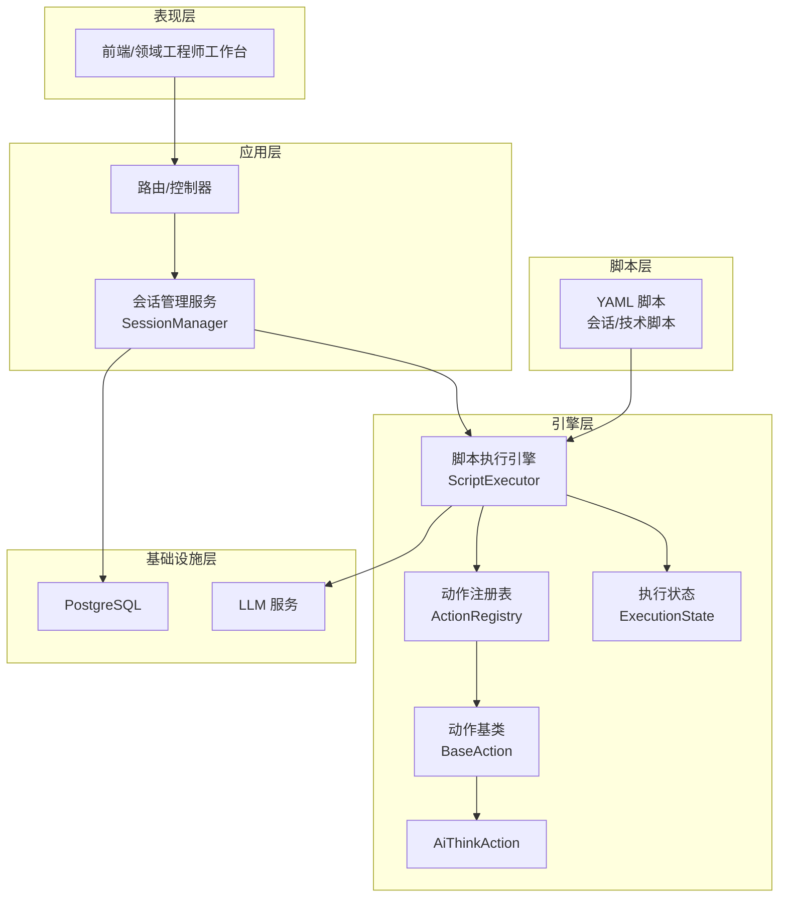
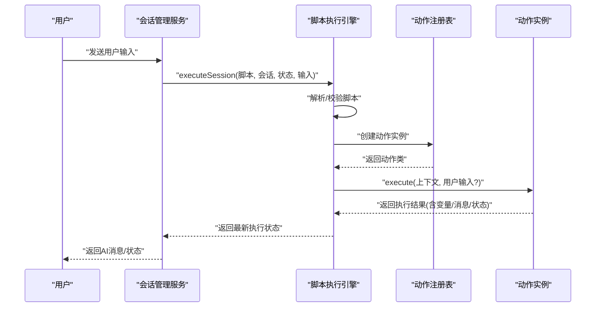
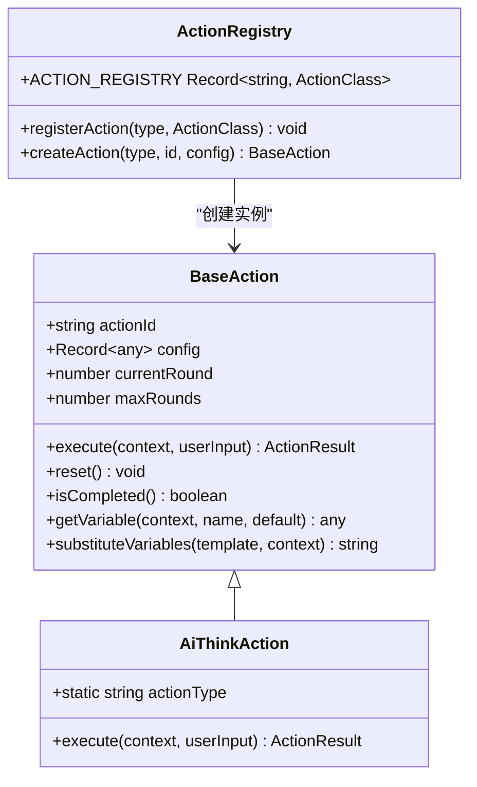
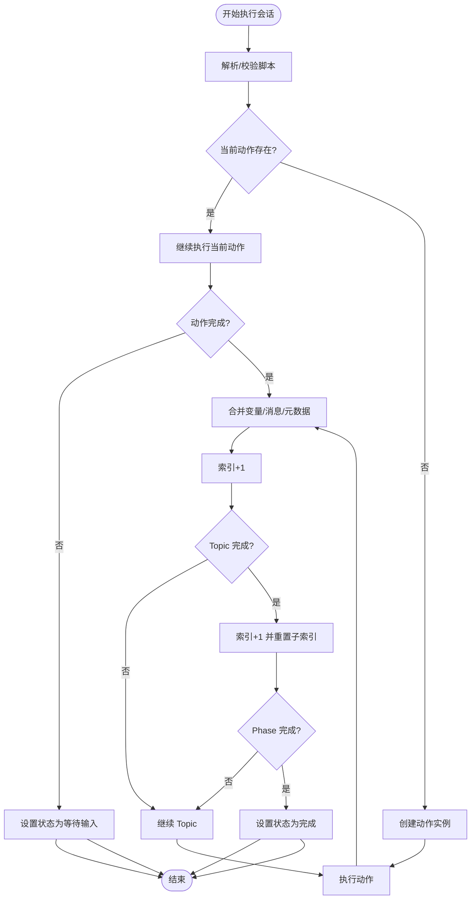
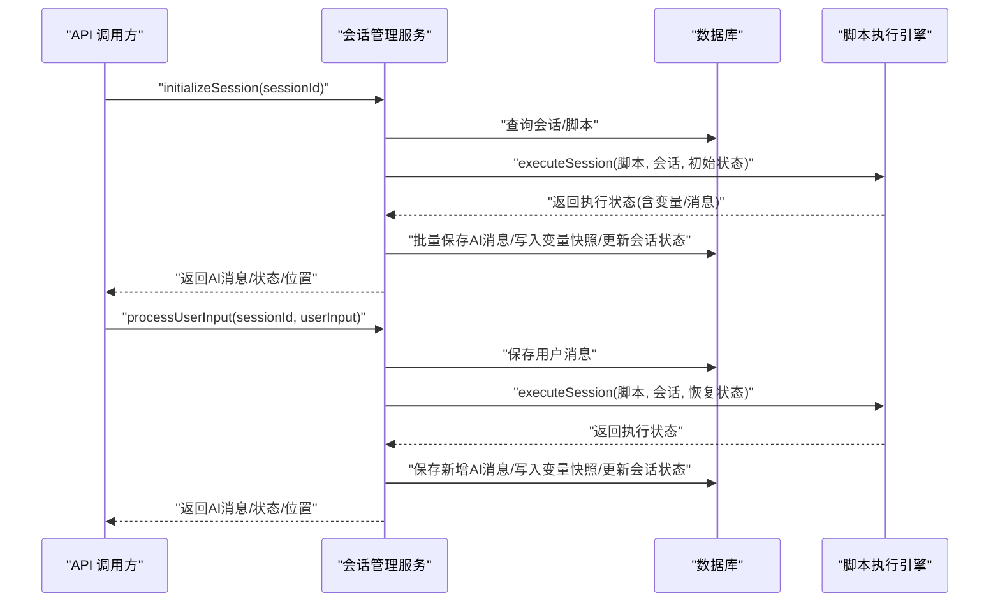
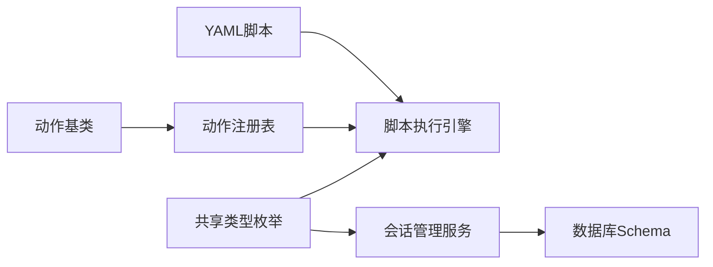

# 意识触发引擎

<cite>
**本文引用的文件**
- [packages/core-engine/src/index.ts](file://packages/core-engine/src/index.ts)
- [packages/core-engine/src/actions/base-action.ts](file://packages/core-engine/src/actions/base-action.ts)
- [packages/core-engine/src/actions/action-registry.ts](file://packages/core-engine/src/actions/action-registry.ts)
- [packages/core-engine/src/actions/ai-think-action.ts](file://packages/core-engine/src/actions/ai-think-action.ts)
- [packages/core-engine/src/engines/script-execution/executor.ts](file://packages/core-engine/src/engines/script-execution/executor.ts)
- [packages/core-engine/src/domain/script.ts](file://packages/core-engine/src/domain/script.ts)
- [packages/shared-types/src/enums.ts](file://packages/shared-types/src/enums.ts)
- [packages/api-server/src/services/session-manager.ts](file://packages/api-server/src/services/session-manager.ts)
- [packages/api-server/src/db/schema.ts](file://packages/api-server/src/db/schema.ts)
- [scripts/sessions/cbt_depression_assessment.yaml](file://scripts/sessions/cbt_depression_assessment.yaml)
- [scripts/techniques/socratic_questioning.yaml](file://scripts/techniques/socratic_questioning.yaml)
- [README.md](file://README.md)
- [docs/DEVELOPMENT_GUIDE.md](file://docs/DEVELOPMENT_GUIDE.md)
</cite>

## 目录
1. [引言](#引言)
2. [项目结构](#项目结构)
3. [核心组件](#核心组件)
4. [架构总览](#架构总览)
5. [详细组件分析](#详细组件分析)
6. [依赖分析](#依赖分析)
7. [性能考虑](#性能考虑)
8. [故障排查指南](#故障排查指南)
9. [结论](#结论)
10. [附录](#附录)

## 引言
本技术文档围绕“意识触发引擎”的设计理念与实现进行系统化阐述，结合现有代码库中的脚本执行、动作模型与数据库结构，给出意识触发机制的可落地方案。文档重点覆盖以下方面：
- 触发条件定义与检测算法
- 响应策略与动作编排
- 场景分类：情感波动检测、认知偏差识别、咨询进展监控
- 触发事件分类与优先级管理
- 与脚本执行的协同：暂停、恢复、重新定向
- 规则配置与自定义触发条件实现
- 伦理与隐私保护
- 个性化咨询的应用价值与效果评估

## 项目结构
本项目采用多包工作区结构，核心引擎位于 core-engine，API 服务位于 api-server，共享类型位于 shared-types，示例脚本位于 scripts。意识触发引擎作为“六大核心引擎”之一，与脚本执行引擎、LLM 编排引擎、变量提取引擎、记忆引擎、话题调度引擎共同协作。

图表来源
- [README.md](file://README.md#L26-L48)
- [packages/core-engine/src/index.ts](file://packages/core-engine/src/index.ts#L1-L27)
- [packages/core-engine/src/engines/script-execution/executor.ts](file://packages/core-engine/src/engines/script-execution/executor.ts#L34-L298)
- [packages/api-server/src/services/session-manager.ts](file://packages/api-server/src/services/session-manager.ts#L21-L26)

章节来源
- [README.md](file://README.md#L26-L48)
- [packages/core-engine/src/index.ts](file://packages/core-engine/src/index.ts#L1-L27)

## 核心组件
- 动作基类与注册表：定义统一的动作接口、上下文与结果结构，并提供动作注册与实例化能力，为意识触发的响应动作提供扩展点。
- 脚本执行引擎：负责解析 YAML 脚本、驱动执行状态机、按阶段/话题/动作顺序推进，并在等待用户输入时返回状态，支撑意识触发的暂停与恢复。
- 会话管理服务：桥接 API 层与执行引擎，维护会话状态、变量快照与消息历史，提供初始化与处理用户输入的入口。
- 数据模型与枚举：统一的状态、脚本类型、变量作用域等枚举，确保跨模块一致性。
- 示例脚本：会话脚本与技术脚本展示了动作组合与变量传递的实际用法，可作为意识触发场景的模板。

章节来源
- [packages/core-engine/src/actions/base-action.ts](file://packages/core-engine/src/actions/base-action.ts#L9-L99)
- [packages/core-engine/src/actions/action-registry.ts](file://packages/core-engine/src/actions/action-registry.ts#L12-L46)
- [packages/core-engine/src/engines/script-execution/executor.ts](file://packages/core-engine/src/engines/script-execution/executor.ts#L14-L298)
- [packages/api-server/src/services/session-manager.ts](file://packages/api-server/src/services/session-manager.ts#L21-L26)
- [packages/shared-types/src/enums.ts](file://packages/shared-types/src/enums.ts#L16-L40)

## 架构总览
意识触发引擎以“动作”为最小响应单元，依托脚本执行引擎的状态机实现“检测—决策—响应—恢复”的闭环。其核心路径如下：
- 检测：在会话过程中，通过变量与消息历史进行规则判定（例如情绪波动、认知偏差、进展异常）。
- 决策：根据触发条件与优先级选择相应动作（如 AiThink、AiAsk、AiSay 或技术脚本 use_skill）。
- 响应：动作执行后更新变量与消息历史，必要时进入 WAITING_INPUT 状态等待用户输入。
- 恢复：会话管理服务在收到用户输入后恢复执行，继续推进到下一个动作或阶段。

图表来源
- [packages/api-server/src/services/session-manager.ts](file://packages/api-server/src/services/session-manager.ts#L257-L464)
- [packages/core-engine/src/engines/script-execution/executor.ts](file://packages/core-engine/src/engines/script-execution/executor.ts#L46-L127)
- [packages/core-engine/src/actions/action-registry.ts](file://packages/core-engine/src/actions/action-registry.ts#L35-L45)

## 详细组件分析

### 动作模型与注册表
- 动作基类提供统一的上下文与结果结构，支持多轮对话、变量替换与模板渲染。
- 注册表集中管理动作类型映射，支持动态扩展新动作类型；创建动作时依据配置实例化对应类。

图表来源
- [packages/core-engine/src/actions/base-action.ts](file://packages/core-engine/src/actions/base-action.ts#L40-L99)
- [packages/core-engine/src/actions/ai-think-action.ts](file://packages/core-engine/src/actions/ai-think-action.ts#L11-L57)
- [packages/core-engine/src/actions/action-registry.ts](file://packages/core-engine/src/actions/action-registry.ts#L17-L45)

章节来源
- [packages/core-engine/src/actions/base-action.ts](file://packages/core-engine/src/actions/base-action.ts#L9-L99)
- [packages/core-engine/src/actions/action-registry.ts](file://packages/core-engine/src/actions/action-registry.ts#L12-L46)
- [packages/core-engine/src/actions/ai-think-action.ts](file://packages/core-engine/src/actions/ai-think-action.ts#L11-L57)

### 脚本执行引擎与执行状态
- 执行状态机以 Session/Phase/Topic/Action 的层级推进，支持在任意层级中断并等待用户输入。
- 执行器负责解析 YAML、校验结构、创建动作实例、执行动作并合并变量与消息历史。
- 状态枚举涵盖运行、等待输入、暂停、完成、错误，便于触发引擎在不同状态下做出响应。

图表来源
- [packages/core-engine/src/engines/script-execution/executor.ts](file://packages/core-engine/src/engines/script-execution/executor.ts#L46-L127)
- [packages/shared-types/src/enums.ts](file://packages/shared-types/src/enums.ts#L16-L22)

章节来源
- [packages/core-engine/src/engines/script-execution/executor.ts](file://packages/core-engine/src/engines/script-execution/executor.ts#L14-L298)
- [packages/shared-types/src/enums.ts](file://packages/shared-types/src/enums.ts#L16-L22)

### 会话管理服务与数据库交互
- 会话管理服务负责初始化会话、处理用户输入、持久化消息与变量快照、更新会话位置与状态。
- 数据库 schema 定义了会话、消息、脚本、变量等表，其中脚本类型包含 awareness，为意识触发脚本预留空间。

图表来源
- [packages/api-server/src/services/session-manager.ts](file://packages/api-server/src/services/session-manager.ts#L70-L255)
- [packages/api-server/src/services/session-manager.ts](file://packages/api-server/src/services/session-manager.ts#L257-L464)
- [packages/api-server/src/db/schema.ts](file://packages/api-server/src/db/schema.ts#L63-L81)

章节来源
- [packages/api-server/src/services/session-manager.ts](file://packages/api-server/src/services/session-manager.ts#L21-L466)
- [packages/api-server/src/db/schema.ts](file://packages/api-server/src/db/schema.ts#L1-L200)

### 示例脚本与动作组合
- 会话脚本展示了 ai_say、ai_ask、ai_think 的组合使用，变量在动作间传递，为意识触发的变量驱动提供了范例。
- 技术脚本展示了 use_skill 的可复用性，可作为意识触发后调用的“技能动作”。

章节来源
- [scripts/sessions/cbt_depression_assessment.yaml](file://scripts/sessions/cbt_depression_assessment.yaml#L1-L166)
- [scripts/techniques/socratic_questioning.yaml](file://scripts/techniques/socratic_questioning.yaml#L1-L110)

## 依赖分析
- 引擎层依赖共享类型中的枚举与状态，保证跨包一致性。
- 会话管理服务依赖脚本执行引擎与数据库 schema，承担状态持久化与消息流转职责。
- 动作注册表与动作基类解耦，便于扩展新动作类型。

图表来源
- [packages/shared-types/src/enums.ts](file://packages/shared-types/src/enums.ts#L16-L40)
- [packages/core-engine/src/engines/script-execution/executor.ts](file://packages/core-engine/src/engines/script-execution/executor.ts#L1-L10)
- [packages/api-server/src/services/session-manager.ts](file://packages/api-server/src/services/session-manager.ts#L7-L16)
- [packages/api-server/src/db/schema.ts](file://packages/api-server/src/db/schema.ts#L1-L20)

章节来源
- [packages/shared-types/src/enums.ts](file://packages/shared-types/src/enums.ts#L1-L118)
- [packages/core-engine/src/engines/script-execution/executor.ts](file://packages/core-engine/src/engines/script-execution/executor.ts#L1-L10)
- [packages/api-server/src/services/session-manager.ts](file://packages/api-server/src/services/session-manager.ts#L7-L16)
- [packages/api-server/src/db/schema.ts](file://packages/api-server/src/db/schema.ts#L1-L20)

## 性能考虑
- 执行状态机的层级推进与动作实例化开销可控，建议在动作内部尽量减少外部 I/O。
- 变量快照仅在值变化时写入，降低数据库写放大。
- 对长对话与复杂脚本，建议在动作中缓存计算结果，避免重复推理。
- 将等待输入的状态及时落库，确保恢复执行的准确性与一致性。

## 故障排查指南
- 执行状态为错误时，会话管理服务会返回详细错误信息，便于定位脚本解析、动作执行或 LLM 服务问题。
- 若出现“未知动作类型”，检查动作注册表是否正确注册新动作类型。
- 若变量未更新，检查动作是否正确返回 extractedVariables，以及会话管理服务是否写入变量快照。

章节来源
- [packages/api-server/src/services/session-manager.ts](file://packages/api-server/src/services/session-manager.ts#L237-L254)
- [packages/api-server/src/services/session-manager.ts](file://packages/api-server/src/services/session-manager.ts#L441-L463)
- [packages/core-engine/src/actions/action-registry.ts](file://packages/core-engine/src/actions/action-registry.ts#L40-L45)

## 结论
意识触发引擎以“动作—脚本—状态机”为核心，结合变量与消息历史实现对咨询过程的动态感知与响应。通过将触发条件与优先级抽象为可配置规则，配合脚本执行引擎的暂停/恢复机制，可在不打断治疗关系的前提下，实现情感波动、认知偏差与进展监控等场景的自动化干预。同时，借助数据库快照与会话管理服务，确保状态一致性与可追溯性。

## 附录

### 意识触发场景与动作映射
- 情感波动检测：当变量（如情绪指数、压力评分）异常波动时，触发 AiThink 进行初步归因与生成干预策略，随后使用 AiAsk 收集具体情境细节，最后用 AiSay 输出共情反馈与引导性建议。
- 认知偏差识别：当目标信念与证据不一致时，触发 use_skill 调用“苏格拉底式提问”技术脚本，逐步引导来访者发现支持与反对证据，最终重构更平衡的认知。
- 咨询进展监控：当阶段性目标未达成或用户表现出退缩迹象时，触发 AiThink 生成阶段总结与调整建议，随后切换到下一阶段或插入针对性技术动作。

章节来源
- [scripts/sessions/cbt_depression_assessment.yaml](file://scripts/sessions/cbt_depression_assessment.yaml#L88-L126)
- [scripts/techniques/socratic_questioning.yaml](file://scripts/techniques/socratic_questioning.yaml#L36-L110)

### 触发事件分类与优先级管理
- 分类：情感类（情绪波动、焦虑升高）、认知类（偏差识别、僵化思维）、行为类（回避、拖延）、进展类（目标偏离、参与度下降）。
- 优先级：高（紧急干预，如情绪崩溃预警）、中（认知重构，如偏差识别）、低（常规跟进，如阶段过渡）。
- 机制：优先级由规则引擎根据变量阈值与历史趋势计算，结合执行状态（WAITING_INPUT）决定是否打断当前动作并插入高优先级动作。

### 与脚本执行的协调机制
- 暂停：当动作返回 WAITING_INPUT 时，执行器停止推进，会话管理服务保存状态。
- 恢复：收到用户输入后，会话管理服务恢复执行状态并继续推进。
- 重新定向：在动作结果中指定 nextAction 或在脚本中调整 Topic/Phase 流程，实现动态重定向。

章节来源
- [packages/core-engine/src/engines/script-execution/executor.ts](file://packages/core-engine/src/engines/script-execution/executor.ts#L64-L97)
- [packages/core-engine/src/engines/script-execution/executor.ts](file://packages/core-engine/src/engines/script-execution/executor.ts#L178-L234)

### 规则配置与自定义触发条件
- 规则配置：在会话管理服务侧引入规则引擎，读取变量与消息历史，匹配预设阈值与模式，输出触发事件与优先级。
- 自定义动作：参照现有动作基类与注册表，新增动作类型并在注册表中注册，确保动作返回标准结果结构以便执行器消费。

章节来源
- [docs/DEVELOPMENT_GUIDE.md](file://docs/DEVELOPMENT_GUIDE.md#L113-L139)
- [packages/core-engine/src/actions/base-action.ts](file://packages/core-engine/src/actions/base-action.ts#L24-L33)
- [packages/core-engine/src/actions/action-registry.ts](file://packages/core-engine/src/actions/action-registry.ts#L28-L30)

### 伦理与隐私保护
- 数据最小化：仅采集与触发规则必要的变量与消息，避免过度收集。
- 匿名化与去标识化：对用户身份与消息内容进行脱敏处理，遵循本地化法规。
- 可解释性：AiThink 动作返回的元数据包含推理摘要，便于监督与审计。
- 用户同意：在触发干预前，通过 AiSay 明确告知干预目的与方式，尊重用户选择权。

### 个性化咨询的价值与效果评估
- 价值：通过实时触发与动态调整，提升干预的时效性与个性化水平，改善来访者的参与度与治疗依从性。
- 评估：采用前后对照、指标追踪（如情绪指数、认知重构次数、会话完成率）与定性反馈，结合 A/B 测试验证不同触发策略的效果差异。