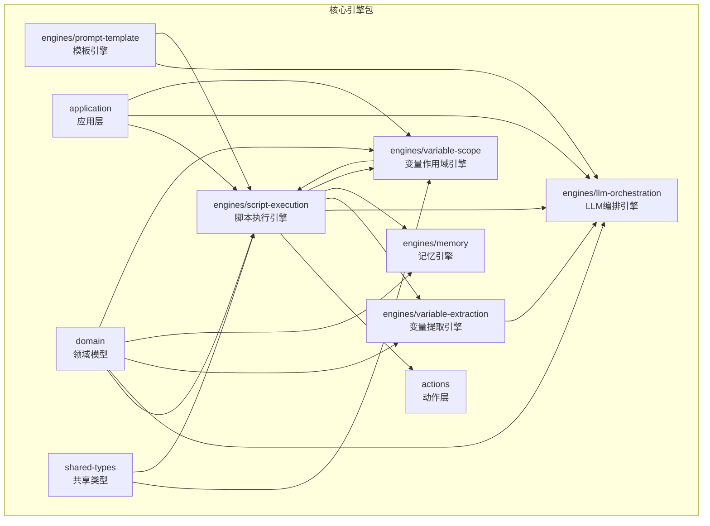
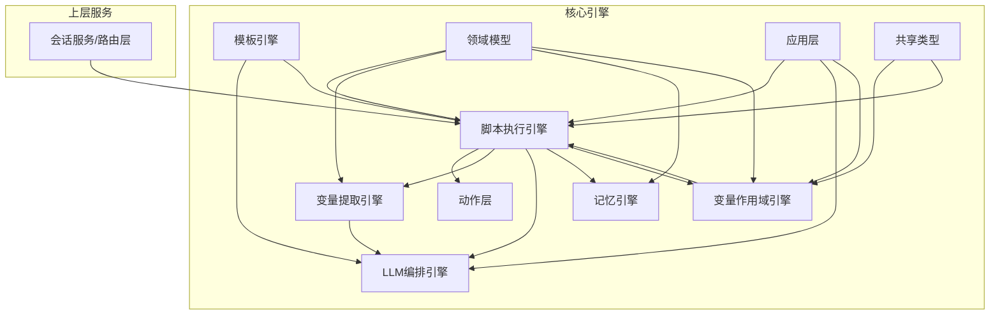
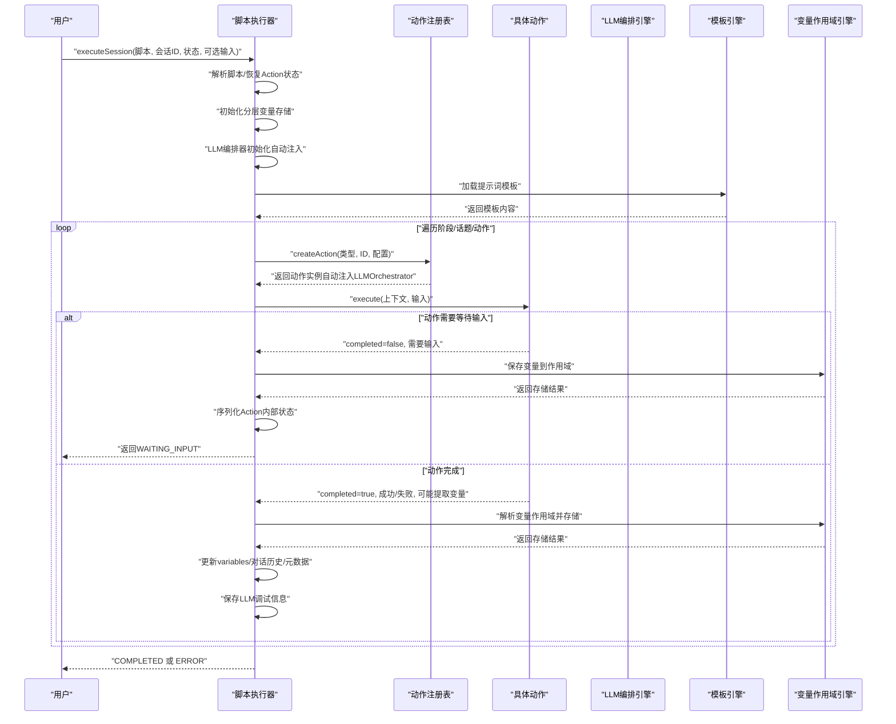
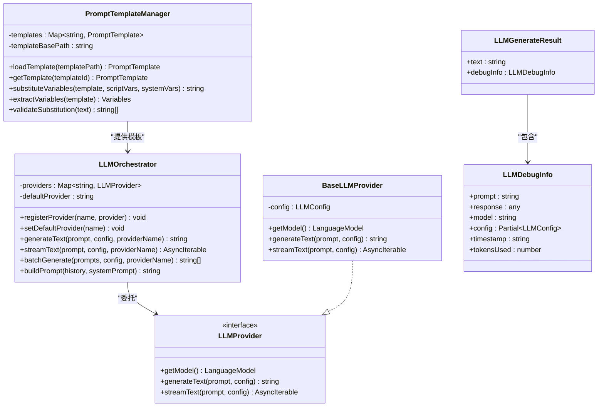
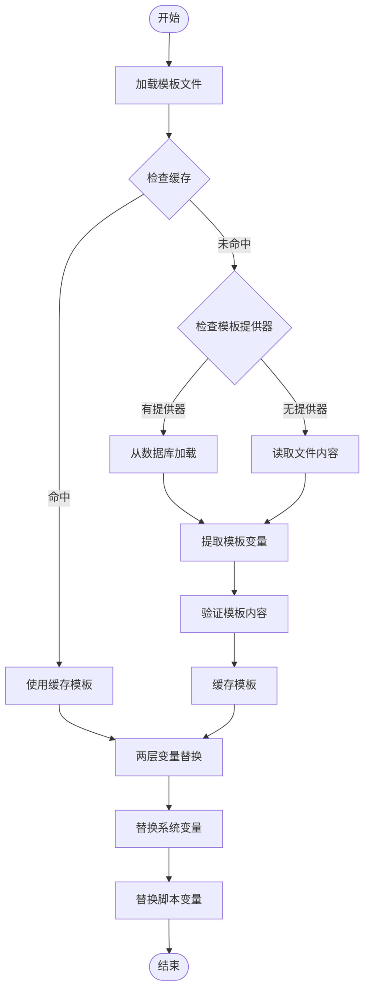
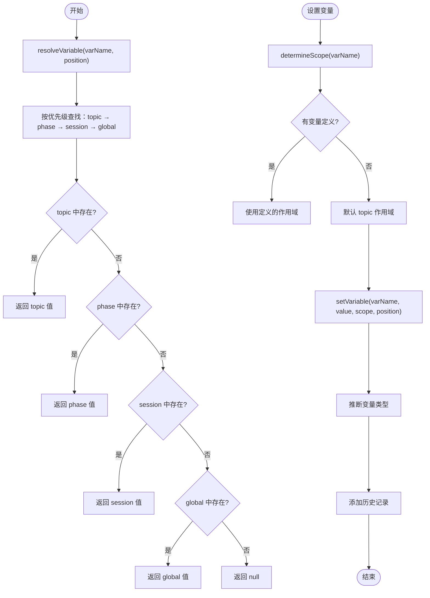
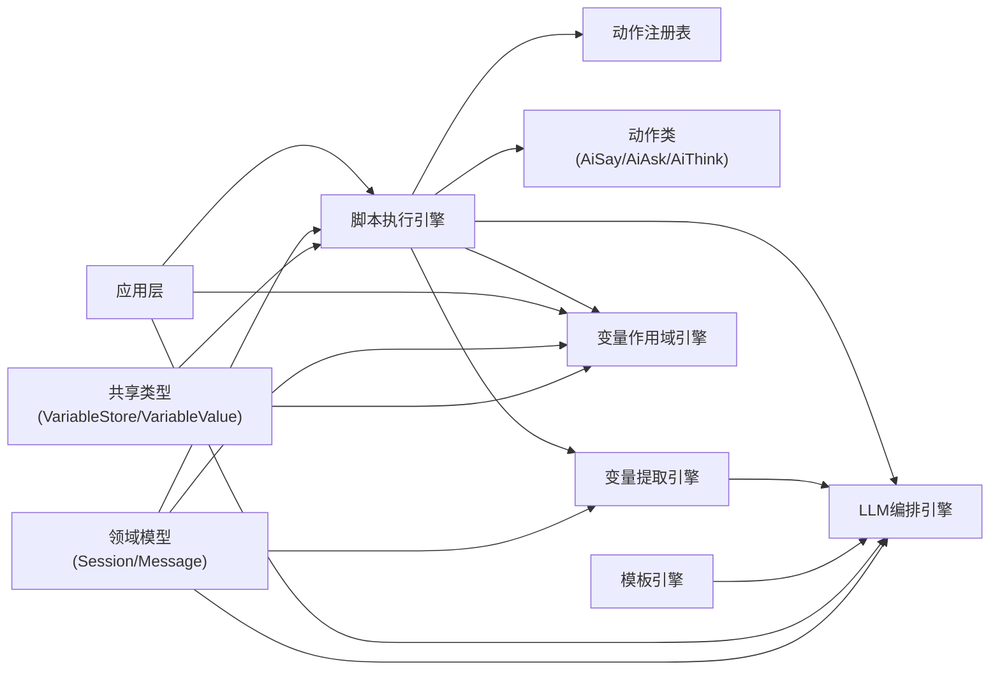

# 核心引擎系统

<cite>
**本文引用的文件**
- [packages/core-engine/src/index.ts](file://packages/core-engine/src/index.ts)
- [packages/core-engine/src/engines/script-execution/index.ts](file://packages/core-engine/src/engines/script-execution/index.ts)
- [packages/core-engine/src/engines/script-execution/script-executor.ts](file://packages/core-engine/src/engines/script-execution/script-executor.ts)
- [packages/core-engine/src/engines/script-execution/yaml-parser.ts](file://packages/core-engine/src/engines/script-execution/yaml-parser.ts)
- [packages/core-engine/src/engines/llm-orchestration/index.ts](file://packages/core-engine/src/engines/llm-orchestration/index.ts)
- [packages/core-engine/src/engines/llm-orchestration/orchestrator.ts](file://packages/core-engine/src/engines/llm-orchestration/orchestrator.ts)
- [packages/core-engine/src/engines/variable-extraction/index.ts](file://packages/core-engine/src/engines/variable-extraction/index.ts)
- [packages/core-engine/src/engines/variable-extraction/extractor.ts](file://packages/core-engine/src/engines/variable-extraction/extractor.ts)
- [packages/core-engine/src/engines/memory/index.ts](file://packages/core-engine/src/engines/memory/index.ts)
- [packages/core-engine/src/engines/prompt-template/index.ts](file://packages/core-engine/src/engines/prompt-template/index.ts)
- [packages/core-engine/src/engines/prompt-template/template-manager.ts](file://packages/core-engine/src/engines/prompt-template/template-manager.ts)
- [packages/core-engine/src/engines/prompt-template/template-provider.ts](file://packages/core-engine/src/engines/prompt-template/template-provider.ts)
- [packages/core-engine/src/engines/prompt-template/template-resolver.ts](file://packages/core-engine/src/engines/prompt-template/template-resolver.ts)
- [packages/core-engine/src/engines/variable-scope/variable-scope-resolver.ts](file://packages/core-engine/src/engines/variable-scope/variable-scope-resolver.ts)
- [packages/core-engine/src/actions/action-registry.ts](file://packages/core-engine/src/actions/action-registry.ts)
- [packages/core-engine/src/actions/ai-say-action.ts](file://packages/core-engine/src/actions/ai-say-action.ts)
- [packages/core-engine/src/actions/ai-ask-action.ts](file://packages/core-engine/src/actions/ai-ask-action.ts)
- [packages/core-engine/src/actions/ai-think-action.ts](file://packages/core-engine/src/actions/ai-think-action.ts)
- [packages/core-engine/src/domain/session.ts](file://packages/core-engine/src/domain/session.ts)
- [packages/core-engine/src/domain/message.ts](file://packages/core-engine/src/domain/message.ts)
- [packages/api-server/test-action-state.ts](file://packages/api-server/test-action-state.ts)
- [packages/api-server/src/services/session-manager.ts](file://packages/api-server/src/services/session-manager.ts)
- [packages/core-engine/docs/debug-info-pipeline.md](file://packages/core-engine/docs/debug-info-pipeline.md)
- [packages/core-engine/test/variable-extraction.test.ts](file://packages/core-engine/test/variable-extraction.test.ts)
- [packages/shared-types/src/domain/variable.ts](file://packages/shared-types/src/domain/variable.ts)
- [packages/core-engine/src/application/state/action-state-manager.ts](file://packages/core-engine/src/application/state/action-state-manager.ts)
- [packages/core-engine/test/unit/variable-scope-structure.test.ts](file://packages/core-engine/test/unit/variable-scope-structure.test.ts)
- [packages/core-engine/test/unit/prompt-template.test.ts](file://packages/core-engine/test/unit/prompt-template.test.ts)
- [packages/core-engine/test/unit/variable-migration.test.ts](file://packages/core-engine/test/unit/variable-migration.test.ts)
</cite>

## 更新摘要

**变更内容**

- 新增模板引擎章节，详细介绍提示词模板管理系统，包括两层模板解析机制和数据库模板支持
- 新增变量作用域引擎章节，说明分层变量存储和作用域解析机制，支持全局、会话、阶段、话题四个作用域
- 更新脚本执行引擎章节，反映更高效的数据库查询模式和执行状态管理，包括变量迁移和调试信息管道
- 更新调试信息管道章节，说明改进的调试信息捕获和传递机制，支持Action未完成时也保存调试信息
- 新增变量存储系统章节，说明从简单变量到分层变量的演进，包括类型推断和历史记录
- 更新架构图和数据流图，反映最新的组件关系和模板解析流程

## 目录

1. [简介](#简介)
2. [项目结构](#项目结构)
3. [核心组件](#核心组件)
4. [架构总览](#架构总览)
5. [详细组件分析](#详细组件分析)
6. [依赖分析](#依赖分析)
7. [性能考虑](#性能考虑)
8. [故障排查指南](#故障排查指南)
9. [结论](#结论)
10. [附录](#附录)

## 简介

本文件系统性梳理 HeartRule AI 咨询引擎的六大核心引擎：脚本执行引擎、LLM 编排引擎、变量提取引擎、记忆引擎、模板引擎、变量作用域引擎、意识触发引擎。文档聚焦各引擎的功能职责、工作原理、数据与控制流，以及它们如何协同实现复杂咨询场景。同时提供扩展与自定义开发的最佳实践。

**更新** 本次更新重点关注新增的模板引擎和变量作用域引擎，以及脚本执行引擎的重大改进，包括更高效的数据库查询模式、分层变量存储系统、改进的调试信息管道，以及修复的关键bug。

## 项目结构

核心引擎位于 packages/core-engine，采用按"引擎/功能"维度组织的模块化设计：

- engines：引擎层，包含脚本执行、LLM 编排、变量提取、记忆、模板、变量作用域等子引擎
- actions：动作层，封装具体的行为单元（如 ai_say、ai_ask、ai_think）
- domain：领域模型，抽象会话、消息、脚本、变量等业务实体
- application：应用层，包含状态管理、监控、结果处理器等
- index.ts：统一导出入口，便于上层调用

**图表来源**

- [packages/core-engine/src/index.ts](file://packages/core-engine/src/index.ts#L1-L27)

**章节来源**

- [packages/core-engine/src/index.ts](file://packages/core-engine/src/index.ts#L1-L27)

## 核心组件

- 脚本执行引擎：负责解析与执行会话脚本，驱动动作按阶段/话题/动作顺序推进，支持断点续跑与等待输入。**新增** 分层变量存储系统，从简单的 `variables` 迁移到 `variableStore`，支持全局、会话、阶段、话题四个作用域。
- LLM 编排引擎：统一管理多提供者（OpenAI、火山等），提供生成文本、流式生成、批量调用与上下文滑窗构建能力。**新增** 完整的调试信息管道，支持从 LLMProvider 到前端的完整调试信息传递。
- 变量提取引擎：从用户输入与对话历史中提取结构化变量，支持直取、正则与 LLM 结构化抽取，并可结合 Zod 校验。
- 记忆引擎：短期/中期/长期记忆能力预留，当前为占位实现，后续接入 Redis、PostgreSQL、向量检索。
- **新增** 模板引擎：负责加载和管理提示词模板，支持两层变量替换（系统变量和脚本变量），提供模板缓存和验证功能，支持数据库和文件系统两种模板源。
- **新增** 变量作用域引擎：负责变量的作用域解析与优先级查找，支持全局、会话、阶段、话题四个作用域，提供变量定义管理和作用域决策，包含类型推断和历史记录功能。
- 话题调度引擎：在脚本执行器内按 phase/topic/action 层级推进，负责预设下一跳 ID、状态机流转与错误处理。
- 意识触发引擎：当前未在核心引擎中实现，建议以中间件或事件钩子形式接入，用于监控干预与异常处置。

**章节来源**

- [packages/core-engine/src/engines/script-execution/script-executor.ts](file://packages/core-engine/src/engines/script-execution/script-executor.ts#L59-L208)
- [packages/core-engine/src/engines/llm-orchestration/orchestrator.ts](file://packages/core-engine/src/engines/llm-orchestration/orchestrator.ts#L30-L141)
- [packages/core-engine/src/engines/variable-extraction/extractor.ts](file://packages/core-engine/src/engines/variable-extraction/extractor.ts#L25-L77)
- [packages/core-engine/src/engines/memory/index.ts](file://packages/core-engine/src/engines/memory/index.ts#L16-L25)
- [packages/core-engine/src/engines/prompt-template/template-manager.ts](file://packages/core-engine/src/engines/prompt-template/template-manager.ts#L20-L193)
- [packages/core-engine/src/engines/variable-scope/variable-scope-resolver.ts](file://packages/core-engine/src/engines/variable-scope/variable-scope-resolver.ts#L31-L241)
- [packages/core-engine/src/engines/script-execution/index.ts](file://packages/core-engine/src/engines/script-execution/index.ts#L1-L11)

## 架构总览

六大引擎围绕"脚本执行引擎"为核心，向上游依赖 LLM 编排与变量提取，向下对接记忆与领域模型。动作层作为最小执行单元，贯穿所有引擎。**新增** 模板引擎为 LLM 编排器提供模板支持，变量作用域引擎为变量存储提供结构化管理。

**图表来源**

- [packages/core-engine/src/engines/script-execution/script-executor.ts](file://packages/core-engine/src/engines/script-execution/script-executor.ts#L59-L208)
- [packages/core-engine/src/engines/llm-orchestration/orchestrator.ts](file://packages/core-engine/src/engines/llm-orchestration/orchestrator.ts#L30-L141)
- [packages/core-engine/src/engines/variable-extraction/extractor.ts](file://packages/core-engine/src/engines/variable-extraction/extractor.ts#L25-L77)
- [packages/core-engine/src/engines/memory/index.ts](file://packages/core-engine/src/engines/memory/index.ts#L16-L25)
- [packages/core-engine/src/engines/prompt-template/template-manager.ts](file://packages/core-engine/src/engines/prompt-template/template-manager.ts#L20-L193)
- [packages/core-engine/src/engines/variable-scope/variable-scope-resolver.ts](file://packages/core-engine/src/engines/variable-scope/variable-scope-resolver.ts#L31-L241)
- [packages/core-engine/src/actions/action-registry.ts](file://packages/core-engine/src/actions/action-registry.ts#L35-L45)
- [packages/core-engine/src/domain/session.ts](file://packages/core-engine/src/domain/session.ts#L7-L44)
- [packages/core-engine/src/domain/message.ts](file://packages/core-engine/src/domain/message.ts#L7-L32)

## 详细组件分析

### 脚本执行引擎

职责与原理

- 解析 JSON 脚本（会话/技术脚本），按 phase → topic → action 顺序执行
- 维护 ExecutionState：状态、索引、变量、对话历史、元数据、最后 AI 消息
- **新增** 分层变量存储系统：从简单的 `variables` 迁移到 `variableStore`，支持全局、会话、阶段、话题四个作用域
- **新增** 变量作用域解析：使用 `VariableScopeResolver` 确定变量应写入的作用域，支持优先级查找（topic > phase > session > global）
- **新增** 模板引擎集成：为 LLM 动作提供模板支持，支持两层变量替换
- **增强** 动作状态序列化/反序列化：支持currentRound、maxRounds等内部状态的持久化
- **改进** 调试信息流：捕获并保存LLM调用的完整调试信息，支持 Action 未完成时也保存调试信息
- 支持断点续跑：序列化/反序列化当前 Action 内部状态（如轮次）
- 动作执行：通过注册表创建具体动作实例，注入上下文并执行
- 等待输入：当动作返回未完成且需用户输入时，保存状态并返回

**更新** 新增分层变量存储系统、变量作用域解析、模板引擎集成等功能。

**图表来源**

- [packages/core-engine/src/engines/script-execution/script-executor.ts](file://packages/core-engine/src/engines/script-execution/script-executor.ts#L63-L208)
- [packages/core-engine/src/actions/action-registry.ts](file://packages/core-engine/src/actions/action-registry.ts#L35-L45)
- [packages/core-engine/src/engines/variable-extraction/extractor.ts](file://packages/core-engine/src/engines/variable-extraction/extractor.ts#L35-L77)
- [packages/core-engine/src/engines/prompt-template/template-manager.ts](file://packages/core-engine/src/engines/prompt-template/template-manager.ts#L33-L59)
- [packages/core-engine/src/engines/variable-scope/variable-scope-resolver.ts](file://packages/core-engine/src/engines/variable-scope/variable-scope-resolver.ts#L47-L69)

**章节来源**

- [packages/core-engine/src/engines/script-execution/script-executor.ts](file://packages/core-engine/src/engines/script-execution/script-executor.ts#L59-L511)
- [packages/core-engine/src/engines/script-execution/index.ts](file://packages/core-engine/src/engines/script-execution/index.ts#L1-L11)

### LLM 编排引擎

职责与原理

- 统一管理多个 LLM 提供者，支持默认提供者与切换
- 提供 generateText/streamText/batchGenerate
- 构建提示词：支持 systemPrompt 与滑动窗口保留最近对话
- **新增** 完整的调试信息管道：从 LLMProvider 到前端的完整调试信息传递
- **新增** 模板引擎集成：支持从模板管理器加载和替换变量
- 抽象 BaseLLMProvider，便于扩展不同 SDK/平台

**更新** 新增完整的调试信息管道和模板引擎集成。

**图表来源**

- [packages/core-engine/src/engines/llm-orchestration/orchestrator.ts](file://packages/core-engine/src/engines/llm-orchestration/orchestrator.ts#L30-L198)
- [packages/core-engine/src/engines/prompt-template/template-manager.ts](file://packages/core-engine/src/engines/prompt-template/template-manager.ts#L20-L193)

**章节来源**

- [packages/core-engine/src/engines/llm-orchestration/orchestrator.ts](file://packages/core-engine/src/engines/llm-orchestration/orchestrator.ts#L30-L198)
- [packages/core-engine/src/engines/llm-orchestration/index.ts](file://packages/core-engine/src/engines/llm-orchestration/index.ts#L1-L11)

### 模板引擎

职责与原理

- **新增** 负责加载和管理提示词模板，支持 Markdown 格式的模板文件
- 支持两层变量替换：系统变量（如 time、user、chat_history）和脚本变量
- 提供模板缓存机制，避免重复读取文件
- 支持变量提取和验证，确保模板完整性
- 支持多种占位符格式：{{var}}、{var}、${var}
- **新增** 两层模板解析机制：Custom 层（项目自定义）和 Default 层（系统默认）
- **新增** 数据库模板支持：通过 TemplateProvider 接口支持从数据库读取模板
- **新增** 模板验证功能：包含安全边界检查、JSON输出格式验证等

**新增** 模板引擎为 LLM 编排器提供结构化的提示词模板管理能力。

**图表来源**

- [packages/core-engine/src/engines/prompt-template/template-manager.ts](file://packages/core-engine/src/engines/prompt-template/template-manager.ts#L33-L108)
- [packages/core-engine/src/engines/prompt-template/template-resolver.ts](file://packages/core-engine/src/engines/prompt-template/template-resolver.ts#L58-L72)

**章节来源**

- [packages/core-engine/src/engines/prompt-template/template-manager.ts](file://packages/core-engine/src/engines/prompt-template/template-manager.ts#L20-L489)
- [packages/core-engine/src/engines/prompt-template/template-resolver.ts](file://packages/core-engine/src/engines/prompt-template/template-resolver.ts#L36-L240)
- [packages/core-engine/src/engines/prompt-template/template-provider.ts](file://packages/core-engine/src/engines/prompt-template/template-provider.ts#L1-L35)
- [packages/core-engine/src/engines/prompt-template/index.ts](file://packages/core-engine/src/engines/prompt-template/index.ts#L1-L2)

### 变量作用域引擎

职责与原理

- **新增** 负责变量的作用域解析与优先级查找，封装作用域规则
- 支持四种作用域：global（全局）、session（会话）、phase（阶段）、topic（话题）
- 默认策略：未定义的变量默认写入 topic 作用域（最小生命周期，避免数据泄漏）
- 提供变量定义管理：维护变量的作用域元数据（从脚本 declare 中读取）
- 支持优先级查找：按 topic > phase > session > global 顺序查找变量值
- **新增** 类型推断：自动推断变量类型（string、number、boolean、array、object、null、undefined）
- **新增** 历史记录：记录变量变更历史，支持回溯和审计
- **新增** 结构验证：验证 VariableStore 结构完整性，确保数据一致性

**新增** 变量作用域引擎为分层变量存储提供结构化管理。

**图表来源**

- [packages/core-engine/src/engines/variable-scope/variable-scope-resolver.ts](file://packages/core-engine/src/engines/variable-scope/variable-scope-resolver.ts#L47-L69)
- [packages/core-engine/src/engines/variable-scope/variable-scope-resolver.ts](file://packages/core-engine/src/engines/variable-scope/variable-scope-resolver.ts#L171-L229)

**章节来源**

- [packages/core-engine/src/engines/variable-scope/variable-scope-resolver.ts](file://packages/core-engine/src/engines/variable-scope/variable-scope-resolver.ts#L31-L398)

### 变量提取引擎

职责与原理

- 支持三种提取方式：direct、pattern、llm
- 对每种变量配置可附加 Zod Schema 进行强校验
- 提供单变量与批量提取，非 LLM 提取优先、LLM 提取可批量合并
- 通过 LLM 编排引擎进行结构化抽取（当前简化实现）

**图表来源**

- [packages/core-engine/src/engines/variable-extraction/extractor.ts](file://packages/core-engine/src/engines/variable-extraction/extractor.ts#L35-L315)

**章节来源**

- [packages/core-engine/src/engines/variable-extraction/extractor.ts](file://packages/core-engine/src/engines/variable-extraction/extractor.ts#L25-L317)
- [packages/core-engine/src/engines/variable-extraction/index.ts](file://packages/core-engine/src/engines/variable-extraction/index.ts#L1-L12)

### 记忆引擎

职责与原理

- 设计为短期（Redis）、中期（PostgreSQL）、长期（向量检索）三层记忆
- 当前为占位实现，提供 MemoryItem 接口与 MemoryEngine 类，待实现存储与检索

**章节来源**

- [packages/core-engine/src/engines/memory/index.ts](file://packages/core-engine/src/engines/memory/index.ts#L1-L26)

### 话题调度引擎

职责与原理

- 在脚本执行器内部按 phase → topic → action 推进
- 预设下一跳的 phase/topic/action ID，便于前端与日志追踪
- 处理状态机：RUNNING/WAITING_INPUT/PAUSED/COMPLETED/ERROR
- 错误处理：记录错误元数据并终止流程

**章节来源**

- [packages/core-engine/src/engines/script-execution/script-executor.ts](file://packages/core-engine/src/engines/script-execution/script-executor.ts#L14-L54)
- [packages/core-engine/src/engines/script-execution/script-executor.ts](file://packages/core-engine/src/engines/script-execution/script-executor.ts#L153-L198)
- [packages/core-engine/src/engines/script-execution/script-executor.ts](file://packages/core-engine/src/engines/script-execution/script-executor.ts#L223-L257)
- [packages/core-engine/src/engines/script-execution/script-executor.ts](file://packages/core-engine/src/engines/script-execution/script-executor.ts#L277-L389)

### 意识触发引擎

职责与原理

- 当前未在核心引擎中实现
- 建议以中间件/钩子形式接入，用于监控异常、触发告警、强制干预或回滚

### 调试信息管道

**新增** 完整的调试信息捕获和传递机制，支持从 LLMProvider 到前端的完整调试信息管道。

#### 调试信息结构

- LLMDebugInfo接口：prompt、response、model、config、timestamp、tokensUsed
- LLMGenerateResult接口：text和debugInfo
- ActionResult扩展：支持debugInfo字段

#### 信息捕获流程

1. LLMProvider.generateText捕获完整响应
2. 构建LLMDebugInfo对象
3. 返回LLMGenerateResult
4. ScriptExecutor保存到ExecutionState.lastLLMDebugInfo
5. 传递到Action执行结果

#### 存储和传递

- 在Action执行过程中保存debugInfo
- 在等待输入时也保存LLM调试信息
- 支持Action完成和未完成两种状态下的调试信息
- 通过SessionApplicationService和API层传递到前端

**章节来源**

- [packages/core-engine/docs/debug-info-pipeline.md](file://packages/core-engine/docs/debug-info-pipeline.md#L29-L104)
- [packages/core-engine/src/engines/llm-orchestration/orchestrator.ts](file://packages/core-engine/src/engines/llm-orchestration/orchestrator.ts#L7-L22)
- [packages/core-engine/src/actions/base-action.ts](file://packages/core-engine/src/actions/base-action.ts#L24-L33)
- [packages/core-engine/src/engines/script-execution/script-executor.ts](file://packages/core-engine/src/engines/script-execution/script-executor.ts#L409-L455)

### 变量存储系统

**新增** 从简单的 `variables` 迁移到分层的 `variableStore`，支持四个作用域的结构化存储。

#### 存储结构

- global：全局配置、常量，跨会话共享
- session：会话级变量，存储用户身份、会话元数据等
- phase：阶段级变量，适合临时状态与中间结果
- topic：话题级变量，最小生命周期，适合单一话题内的临时数据

#### 迁移机制

- 从旧的 `variables` 迁移到新的 `variableStore`
- 自动推断变量类型并添加元数据
- 保持向后兼容性

#### 作用域解析

- 按优先级查找：topic > phase > session > global
- 支持变量定义管理
- 提供类型推断和元数据管理

**章节来源**

- [packages/core-engine/src/engines/script-execution/script-executor.ts](file://packages/core-engine/src/engines/script-execution/script-executor.ts#L137-L162)
- [packages/core-engine/src/engines/variable-scope/variable-scope-resolver.ts](file://packages/core-engine/src/engines/variable-scope/variable-scope-resolver.ts#L47-L69)
- [packages/core-engine/test/variable-extraction.test.ts](file://packages/core-engine/test/variable-extraction.test.ts#L180-L201)

## 依赖分析

- 脚本执行引擎依赖动作注册表与动作类，间接依赖 LLM 编排与变量提取（视动作而定）
- **新增** 模板引擎为 LLM 编排器提供模板支持
- **新增** 变量作用域引擎为变量存储提供结构化管理
- **新增** 分层变量存储系统替代简单的 `variables` 字段
- **新增** 完整的调试信息管道，从 LLMProvider 到前端
- LLM 编排引擎提供统一接口，便于替换与扩展
- 领域模型（会话/消息）为上层服务与引擎间的数据契约
- **新增** 应用层组件（ActionStateManager、MonitorOrchestrator等）提供状态管理和监控功能
- **新增** 共享类型定义提供跨包的类型安全

**图表来源**

- [packages/core-engine/src/engines/script-execution/script-executor.ts](file://packages/core-engine/src/engines/script-execution/script-executor.ts#L8-L9)
- [packages/core-engine/src/actions/action-registry.ts](file://packages/core-engine/src/actions/action-registry.ts#L35-L45)
- [packages/core-engine/src/engines/variable-extraction/extractor.ts](file://packages/core-engine/src/engines/variable-extraction/extractor.ts#L3)
- [packages/core-engine/src/domain/session.ts](file://packages/core-engine/src/domain/session.ts#L7-L44)
- [packages/core-engine/src/domain/message.ts](file://packages/core-engine/src/domain/message.ts#L7-L32)

**章节来源**

- [packages/core-engine/src/index.ts](file://packages/core-engine/src/index.ts#L8-L27)

## 性能考虑

- LLM 调用批量化：利用编排器的批量生成减少往返开销
- 上下文滑窗：限制对话历史长度，降低 Token 消耗与延迟
- **新增** 模板引擎缓存：避免重复读取和解析模板文件
- **新增** 分层变量存储：按作用域隔离数据，提高查询效率
- **新增** 调试信息优化：仅在需要调试时开启，避免影响生产性能
- 动作内部状态持久化：仅在必要时序列化，避免频繁 IO
- 变量提取优化：优先 direct/pattern，LLM 提取尽量批量
- 记忆层异步化：短期/长期记忆采用异步接口，避免阻塞主线程
- **新增** 模板提供器缓存：支持数据库模板的缓存机制
- **新增** 变量作用域缓存：VariableScopeResolver 内部缓存变量定义

## 故障排查指南

常见问题与定位

- 脚本执行卡在 WAITING_INPUT
  - 检查动作是否需要用户确认/回答，确认前端已传入用户输入
  - 查看 ExecutionState.metadata.actionState 是否正确序列化/反序列化
  - **新增** 检查LLM编排器是否正确初始化和注入
- LLM 调用报错
  - 核对提供者名称与默认提供者设置
  - 检查提示词构建与滑窗策略是否合理
  - **新增** 查看LLM调试信息中的详细错误原因
- 变量提取失败
  - 确认提取方式与类型转换是否匹配
  - 若使用 LLM 提取，检查提示词构造与响应解析
- **新增** 变量作用域解析失败
  - 检查变量定义是否正确配置
  - 确认变量存储结构是否正确初始化
  - 验证作用域优先级查找逻辑
  - **新增** 检查 VariableStore 结构验证结果
- **新增** 模板加载失败
  - 检查模板文件路径是否正确
  - 确认模板文件是否存在且格式正确
  - 验证模板变量替换是否完整
  - **新增** 检查模板提供器配置和数据库连接
- 记忆引擎无响应
  - 当前为占位实现，需按计划接入存储层
- **新增** 分层变量存储初始化失败
  - 确认 ScriptExecutor.createInitialState 是否正确初始化 variableStore
  - 检查变量迁移逻辑是否正常执行
  - **新增** 验证 VariableScopeResolver.migrateIfNeeded 是否被调用
- **新增** 模板解析失败
  - 检查 template_scheme 配置是否正确
  - 确认模板文件在数据库或文件系统中存在
  - 验证模板验证规则是否满足要求

**章节来源**

- [packages/core-engine/src/engines/script-execution/script-executor.ts](file://packages/core-engine/src/engines/script-execution/script-executor.ts#L91-L100)
- [packages/core-engine/src/engines/llm-orchestration/orchestrator.ts](file://packages/core-engine/src/engines/llm-orchestration/orchestrator.ts#L119-L128)
- [packages/core-engine/src/engines/variable-extraction/extractor.ts](file://packages/core-engine/src/engines/variable-extraction/extractor.ts#L157-L176)
- [packages/core-engine/src/engines/memory/index.ts](file://packages/core-engine/src/engines/memory/index.ts#L17-L24)
- [packages/core-engine/src/engines/variable-scope/variable-scope-resolver.ts](file://packages/core-engine/src/engines/variable-scope/variable-scope-resolver.ts#L47-L69)
- [packages/core-engine/src/engines/prompt-template/template-manager.ts](file://packages/core-engine/src/engines/prompt-template/template-manager.ts#L33-L59)

## 结论

六大核心引擎以脚本执行引擎为中心，通过动作层与编排层解耦，形成高内聚、低耦合的咨询自动化框架。**更新** 通过新增的模板引擎、变量作用域引擎、分层变量存储系统、完整的调试信息管道，系统现在具备更强大的模板管理能力、更精细的变量控制、更完善的调试支持。借助改进的 LLM 调用与变量提取稳定性，系统可实现从简单问答到复杂认知行为的多样化咨询场景。建议后续完善记忆引擎与意识触发引擎，并持续优化 LLM 调用与变量提取的稳定性与性能。

## 附录

### 引擎扩展与自定义开发最佳实践

- 自定义动作
  - 继承 BaseAction，实现 execute 方法，遵循 completed/success/aiMessage/extractedVariables/metadata 规范
  - 在注册表中注册新动作类型，确保脚本配置中的 action_type 与之对应
  - **新增** 如果需要LLM能力，在构造函数中声明llmOrchestrator参数并正确处理
- 自定义 LLM 提供者
  - 实现 LLMProvider 接口或继承 BaseLLMProvider，适配具体 SDK
  - 在编排器中注册并设置默认提供者
  - **新增** 确保generateText方法返回LLMGenerateResult格式
- 自定义变量提取策略
  - 在 VariableConfig 中指定 extractionMethod 与 schema
  - 如需 LLM 提取，确保编排器可用并优化提示词
- **新增** 自定义模板
  - 在 config/prompts 目录下创建模板文件
  - 使用两层变量替换语法 {{var}}、{var}、${var}
  - 确保模板变量与脚本变量正确映射
  - **新增** 实现 TemplateProvider 接口支持数据库模板
- **新增** 自定义变量作用域
  - 在脚本中使用 declare 定义变量作用域
  - 使用 VariableScopeResolver 确定变量应写入的作用域
  - 验证变量优先级查找逻辑
  - **新增** 利用类型推断和历史记录功能
- 记忆层接入
  - 实现 MemoryEngine.store/retrieve，按短期/中期/长期策略选择存储介质
- 话题调度增强
  - 在脚本中增加条件判断与动态分支，由脚本执行器按 phase/topic/action 推进
- **新增** 动作状态持久化最佳实践
  - 使用serializeActionState和deserializeActionState方法
  - 确保在反序列化时使用this.createAction而非createAction
  - 保存必要的内部状态（如currentRound、maxRounds）
- **新增** 分层变量存储最佳实践
  - 使用 VariableScopeResolver 管理变量作用域
  - 遵循作用域优先级规则（topic > phase > session > global）
  - 确保变量定义正确配置
  - **新增** 利用结构验证和历史记录功能
- **新增** 模板引擎扩展
  - 实现 TemplateProvider 接口支持自定义模板源
  - 使用 TemplateResolver 进行两层模板解析
  - 实现模板验证和缓存机制
- **新增** 调试信息扩展
  - 在 Action 中正确传递 debugInfo
  - 使用 ScriptExecutor 保存调试信息
  - 实现完整的调试信息管道

**章节来源**

- [packages/core-engine/src/actions/action-registry.ts](file://packages/core-engine/src/actions/action-registry.ts#L28-L45)
- [packages/core-engine/src/engines/llm-orchestration/orchestrator.ts](file://packages/core-engine/src/engines/llm-orchestration/orchestrator.ts#L43-L55)
- [packages/core-engine/src/engines/variable-extraction/extractor.ts](file://packages/core-engine/src/engines/variable-extraction/extractor.ts#L28-L30)
- [packages/core-engine/src/engines/prompt-template/template-manager.ts](file://packages/core-engine/src/engines/prompt-template/template-manager.ts#L24-L27)
- [packages/core-engine/src/engines/variable-scope/variable-scope-resolver.ts](file://packages/core-engine/src/engines/variable-scope/variable-scope-resolver.ts#L77-L89)
- [packages/core-engine/src/engines/memory/index.ts](file://packages/core-engine/src/engines/memory/index.ts#L16-L25)
- [packages/core-engine/src/engines/script-execution/script-executor.ts](file://packages/core-engine/src/engines/script-execution/script-executor.ts#L596-L634)
- [packages/core-engine/src/application/state/action-state-manager.ts](file://packages/core-engine/src/application/state/action-state-manager.ts#L42-L64)
- [packages/shared-types/src/domain/variable.ts](file://packages/shared-types/src/domain/variable.ts#L58-L68)
