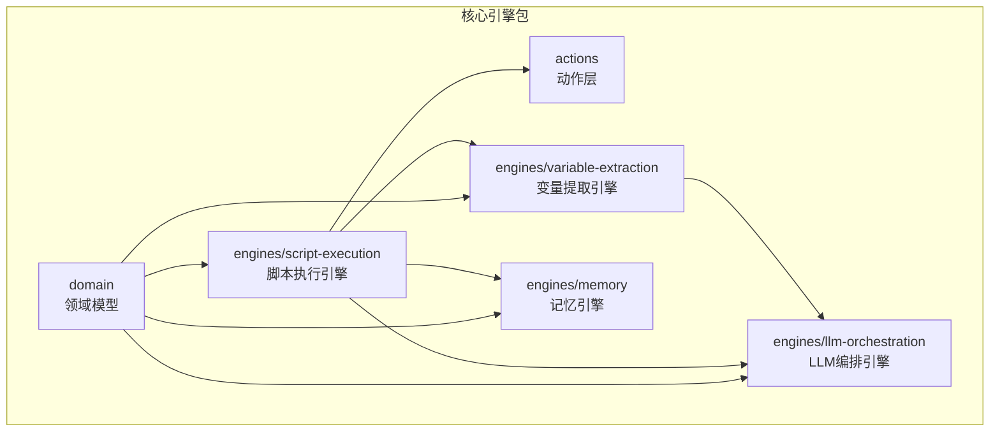
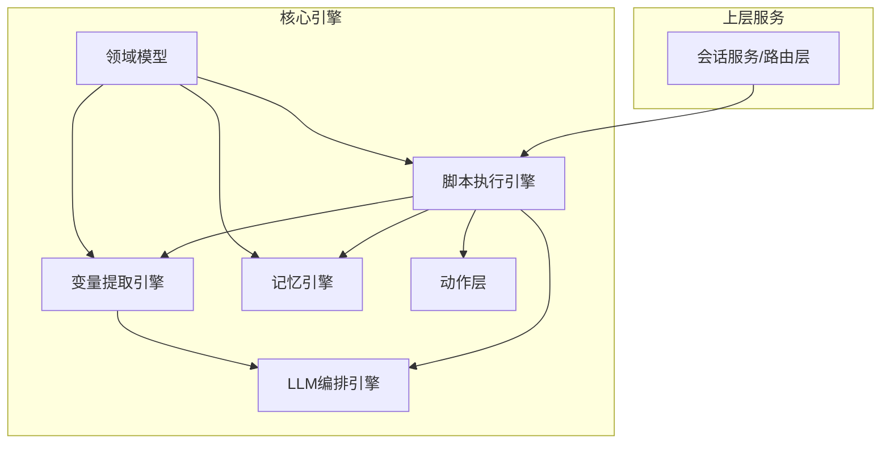
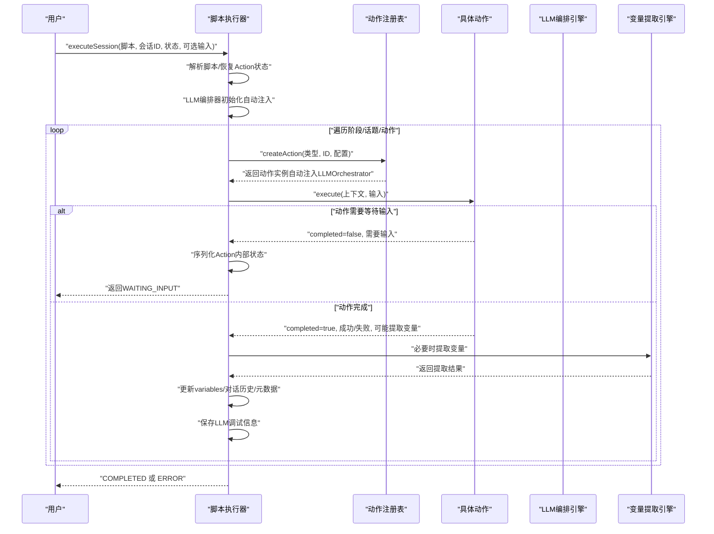
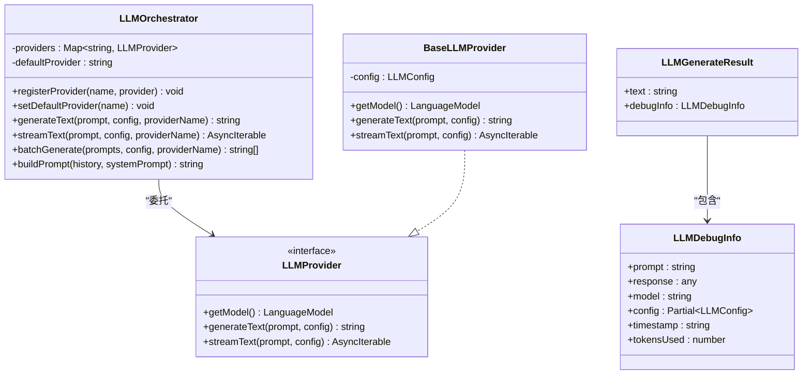
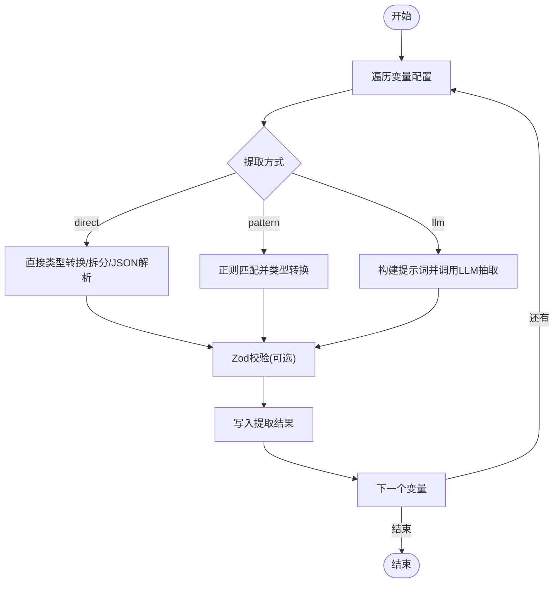
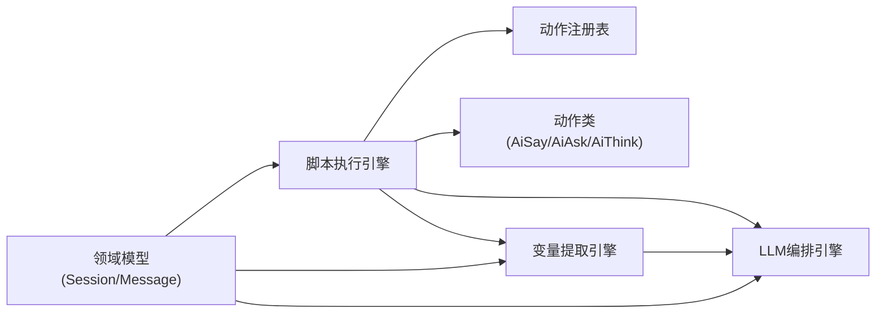

# 核心引擎系统

<cite>
**本文引用的文件**
- [packages/core-engine/src/index.ts](file://packages/core-engine/src/index.ts)
- [packages/core-engine/src/engines/script-execution/index.ts](file://packages/core-engine/src/engines/script-execution/index.ts)
- [packages/core-engine/src/engines/script-execution/script-executor.ts](file://packages/core-engine/src/engines/script-execution/script-executor.ts)
- [packages/core-engine/src/engines/script-execution/yaml-parser.ts](file://packages/core-engine/src/engines/script-execution/yaml-parser.ts)
- [packages/core-engine/src/engines/llm-orchestration/index.ts](file://packages/core-engine/src/engines/llm-orchestration/index.ts)
- [packages/core-engine/src/engines/llm-orchestration/orchestrator.ts](file://packages/core-engine/src/engines/llm-orchestration/orchestrator.ts)
- [packages/core-engine/src/engines/variable-extraction/index.ts](file://packages/core-engine/src/engines/variable-extraction/index.ts)
- [packages/core-engine/src/engines/variable-extraction/extractor.ts](file://packages/core-engine/src/engines/variable-extraction/extractor.ts)
- [packages/core-engine/src/engines/memory/index.ts](file://packages/core-engine/src/engines/memory/index.ts)
- [packages/core-engine/src/actions/action-registry.ts](file://packages/core-engine/src/actions/action-registry.ts)
- [packages/core-engine/src/actions/ai-say-action.ts](file://packages/core-engine/src/actions/ai-say-action.ts)
- [packages/core-engine/src/actions/ai-ask-action.ts](file://packages/core-engine/src/actions/ai-ask-action.ts)
- [packages/core-engine/src/actions/ai-think-action.ts](file://packages/core-engine/src/actions/ai-think-action.ts)
- [packages/core-engine/src/domain/session.ts](file://packages/core-engine/src/domain/session.ts)
- [packages/core-engine/src/domain/message.ts](file://packages/core-engine/src/domain/message.ts)
- [packages/api-server/test-action-state.ts](file://packages/api-server/test-action-state.ts)
</cite>

## 更新摘要
**变更内容**
- 更新脚本执行引擎章节，反映新增的130行功能
- 新增LLM编排器集成章节，详细说明ScriptExecutor中的LLM集成
- 更新动作状态序列化/反序列化章节，重点说明ai-say动作的反序列化bug修复
- 新增调试信息流章节，说明改进的LLM调试信息捕获机制
- 更新架构图和数据流图，反映最新的组件关系

## 目录
1. [简介](#简介)
2. [项目结构](#项目结构)
3. [核心组件](#核心组件)
4. [架构总览](#架构总览)
5. [详细组件分析](#详细组件分析)
6. [依赖分析](#依赖分析)
7. [性能考虑](#性能考虑)
8. [故障排查指南](#故障排查指南)
9. [结论](#结论)
10. [附录](#附录)

## 简介
本文件系统性梳理 HeartRule AI 咨询引擎的六大核心引擎：脚本执行引擎、LLM 编排引擎、变量提取引擎、记忆引擎、话题调度引擎、意识触发引擎。文档聚焦各引擎的功能职责、工作原理、数据与控制流，以及它们如何协同实现复杂咨询场景。同时提供扩展与自定义开发的最佳实践。

**更新** 本次更新重点关注ScriptExecutor的130行新增功能，包括LLM编排器集成、增强的动作状态序列化/反序列化、改进的调试信息流，以及修复ai-say动作反序列化过程中的关键bug。

## 项目结构
核心引擎位于 packages/core-engine，采用按"引擎/功能"维度组织的模块化设计：
- engines：引擎层，包含脚本执行、LLM 编排、变量提取、记忆等子引擎
- actions：动作层，封装具体的行为单元（如 ai_say、ai_ask、ai_think）
- domain：领域模型，抽象会话、消息、脚本、变量等业务实体
- index.ts：统一导出入口，便于上层调用

**图表来源**
- [packages/core-engine/src/index.ts](file://packages/core-engine/src/index.ts#L1-L27)

**章节来源**
- [packages/core-engine/src/index.ts](file://packages/core-engine/src/index.ts#L1-L27)

## 核心组件
- 脚本执行引擎：负责解析与执行会话脚本，驱动动作按阶段/话题/动作顺序推进，支持断点续跑与等待输入。**新增** LLM编排器集成，自动为ai_say和ai_ask动作注入LLMOrchestrator实例。
- LLM 编排引擎：统一管理多提供者（OpenAI、火山等），提供生成文本、流式生成、批量调用与上下文滑窗构建能力。**新增** LLM调试信息捕获机制，支持完整的prompt和response调试。
- 变量提取引擎：从用户输入与对话历史中提取结构化变量，支持直取、正则与 LLM 结构化抽取，并可结合 Zod 校验。
- 记忆引擎：短期/中期/长期记忆能力预留，当前为占位实现，后续接入 Redis、PostgreSQL、向量检索。
- 话题调度引擎：在脚本执行器内按 phase/topic/action 层级推进，负责预设下一跳 ID、状态机流转与错误处理。
- 意识触发引擎：当前未在核心引擎中实现，建议以中间件或事件钩子形式接入，用于监控干预与异常处置。

**章节来源**
- [packages/core-engine/src/engines/script-execution/script-executor.ts](file://packages/core-engine/src/engines/script-execution/script-executor.ts#L59-L208)
- [packages/core-engine/src/engines/llm-orchestration/orchestrator.ts](file://packages/core-engine/src/engines/llm-orchestration/orchestrator.ts#L30-L141)
- [packages/core-engine/src/engines/variable-extraction/extractor.ts](file://packages/core-engine/src/engines/variable-extraction/extractor.ts#L25-L77)
- [packages/core-engine/src/engines/memory/index.ts](file://packages/core-engine/src/engines/memory/index.ts#L16-L25)
- [packages/core-engine/src/engines/script-execution/index.ts](file://packages/core-engine/src/engines/script-execution/index.ts#L1-L11)

## 架构总览
六大引擎围绕"脚本执行引擎"为核心，向上游依赖 LLM 编排与变量提取，向下对接记忆与领域模型。动作层作为最小执行单元，贯穿所有引擎。**新增** LLM编排器在ScriptExecutor中进行初始化和注入，确保所有动作都能访问LLM能力。

**图表来源**
- [packages/core-engine/src/engines/script-execution/script-executor.ts](file://packages/core-engine/src/engines/script-execution/script-executor.ts#L59-L208)
- [packages/core-engine/src/engines/llm-orchestration/orchestrator.ts](file://packages/core-engine/src/engines/llm-orchestration/orchestrator.ts#L30-L141)
- [packages/core-engine/src/engines/variable-extraction/extractor.ts](file://packages/core-engine/src/engines/variable-extraction/extractor.ts#L25-L77)
- [packages/core-engine/src/engines/memory/index.ts](file://packages/core-engine/src/engines/memory/index.ts#L16-L25)
- [packages/core-engine/src/actions/action-registry.ts](file://packages/core-engine/src/actions/action-registry.ts#L35-L45)
- [packages/core-engine/src/domain/session.ts](file://packages/core-engine/src/domain/session.ts#L7-L44)
- [packages/core-engine/src/domain/message.ts](file://packages/core-engine/src/domain/message.ts#L7-L32)

## 详细组件分析

### 脚本执行引擎
职责与原理
- 解析 JSON 脚本（会话/技术脚本），按 phase → topic → action 顺序执行
- 维护 ExecutionState：状态、索引、变量、对话历史、元数据、最后 AI 消息
- **新增** LLM编排器集成：在构造函数中初始化LLMOrchestrator，自动为ai_say和ai_ask动作注入实例
- **增强** 动作状态序列化/反序列化：支持currentRound、maxRounds等内部状态的持久化
- **改进** 调试信息流：捕获并保存LLM调用的完整调试信息
- 支持断点续跑：序列化/反序列化当前 Action 内部状态（如轮次）
- 动作执行：通过注册表创建具体动作实例，注入上下文并执行
- 等待输入：当动作返回未完成且需用户输入时，保存状态并返回

**更新** 新增130行功能，包括LLM编排器集成、增强的动作状态序列化/反序列化、改进的调试信息流。

**图表来源**
- [packages/core-engine/src/engines/script-execution/script-executor.ts](file://packages/core-engine/src/engines/script-execution/script-executor.ts#L63-L208)
- [packages/core-engine/src/actions/action-registry.ts](file://packages/core-engine/src/actions/action-registry.ts#L35-L45)
- [packages/core-engine/src/engines/variable-extraction/extractor.ts](file://packages/core-engine/src/engines/variable-extraction/extractor.ts#L35-L77)

**章节来源**
- [packages/core-engine/src/engines/script-execution/script-executor.ts](file://packages/core-engine/src/engines/script-execution/script-executor.ts#L59-L511)
- [packages/core-engine/src/engines/script-execution/index.ts](file://packages/core-engine/src/engines/script-execution/index.ts#L1-L11)

### LLM 编排引擎
职责与原理
- 统一管理多个 LLM 提供者，支持默认提供者与切换
- 提供 generateText/streamText/batchGenerate
- 构建提示词：支持 systemPrompt 与滑动窗口保留最近对话
- **新增** 调试信息捕获：完整捕获prompt、response、model、config、timestamp、tokensUsed
- 抽象 BaseLLMProvider，便于扩展不同 SDK/平台

**更新** 新增LLM调试信息捕获机制，支持完整的prompt和response调试信息。

**图表来源**
- [packages/core-engine/src/engines/llm-orchestration/orchestrator.ts](file://packages/core-engine/src/engines/llm-orchestration/orchestrator.ts#L30-L198)

**章节来源**
- [packages/core-engine/src/engines/llm-orchestration/orchestrator.ts](file://packages/core-engine/src/engines/llm-orchestration/orchestrator.ts#L30-L198)
- [packages/core-engine/src/engines/llm-orchestration/index.ts](file://packages/core-engine/src/engines/llm-orchestration/index.ts#L1-L11)

### 变量提取引擎
职责与原理
- 支持三种提取方式：direct、pattern、llm
- 对每种变量配置可附加 Zod Schema 进行强校验
- 提供单变量与批量提取，非 LLM 提取优先、LLM 提取可批量合并
- 通过 LLM 编排引擎进行结构化抽取（当前简化实现）

**图表来源**
- [packages/core-engine/src/engines/variable-extraction/extractor.ts](file://packages/core-engine/src/engines/variable-extraction/extractor.ts#L35-L315)

**章节来源**
- [packages/core-engine/src/engines/variable-extraction/extractor.ts](file://packages/core-engine/src/engines/variable-extraction/extractor.ts#L25-L317)
- [packages/core-engine/src/engines/variable-extraction/index.ts](file://packages/core-engine/src/engines/variable-extraction/index.ts#L1-L12)

### 记忆引擎
职责与原理
- 设计为短期（Redis）、中期（PostgreSQL）、长期（向量检索）三层记忆
- 当前为占位实现，提供 MemoryItem 接口与 MemoryEngine 类，待实现存储与检索

**章节来源**
- [packages/core-engine/src/engines/memory/index.ts](file://packages/core-engine/src/engines/memory/index.ts#L1-L26)

### 话题调度引擎
职责与原理
- 在脚本执行器内部按 phase → topic → action 推进
- 预设下一跳的 phase/topic/action ID，便于前端与日志追踪
- 处理状态机：RUNNING/WAITING_INPUT/PAUSED/COMPLETED/ERROR
- 错误处理：记录错误元数据并终止流程

**章节来源**
- [packages/core-engine/src/engines/script-execution/script-executor.ts](file://packages/core-engine/src/engines/script-execution/script-executor.ts#L14-L54)
- [packages/core-engine/src/engines/script-execution/script-executor.ts](file://packages/core-engine/src/engines/script-execution/script-executor.ts#L153-L198)
- [packages/core-engine/src/engines/script-execution/script-executor.ts](file://packages/core-engine/src/engines/script-execution/script-executor.ts#L223-L257)
- [packages/core-engine/src/engines/script-execution/script-executor.ts](file://packages/core-engine/src/engines/script-execution/script-executor.ts#L277-L389)

### 意识触发引擎
职责与原理
- 当前未在核心引擎中实现
- 建议以中间件/钩子形式接入，用于监控异常、触发告警、强制干预或回滚

### LLM编排器集成
**新增** 脚本执行引擎的核心功能，负责在运行时为动作注入LLM编排器实例。

#### 初始化流程
- 从环境变量读取配置（VOLCENGINE_API_KEY、VOLCANO_API_KEY、ARK_API_KEY）
- 创建VolcanoDeepSeekProvider实例
- 初始化LLMOrchestrator并设置默认提供者为'volcano'

#### 动作注入机制
- 在createAction方法中检测动作类型
- 对于ai_say和ai_ask动作，自动注入LLMOrchestrator实例
- 其他动作使用默认创建方式

#### 环境配置
- 支持多种API密钥前缀：VOLCENGINE、VOLCANO、ARK
- 支持多种基础URL配置：VOLCENGINE_BASE_URL、VOLCANO_BASE_URL
- 默认模型：deepseek-v3-250324

**章节来源**
- [packages/core-engine/src/engines/script-execution/script-executor.ts](file://packages/core-engine/src/engines/script-execution/script-executor.ts#L66-L105)
- [packages/core-engine/src/engines/script-execution/script-executor.ts](file://packages/core-engine/src/engines/script-execution/script-executor.ts#L566-L577)

### 动作状态序列化/反序列化增强
**新增** 通过130行代码增强的动作状态持久化机制，解决ai-say动作反序列化过程中的关键bug。

#### 序列化功能
- 保存actionId、actionType、config、currentRound、maxRounds
- 仅在动作未完成时保存状态
- 清理完成后删除metadata.actionState

#### 反序列化修复
- **关键bug修复**：使用this.createAction而非createAction
- 确保ai_say动作在恢复时能正确获得LLMOrchestrator实例
- 正确恢复currentRound和maxRounds状态

#### 状态恢复流程
1. 检查metadata.actionState是否存在
2. 调用deserializeActionState恢复动作实例
3. 恢复内部状态（currentRound、maxRounds）
4. 继续执行未完成的动作

**章节来源**
- [packages/core-engine/src/engines/script-execution/script-executor.ts](file://packages/core-engine/src/engines/script-execution/script-executor.ts#L596-L634)
- [packages/api-server/test-action-state.ts](file://packages/api-server/test-action-state.ts#L1-L173)

### 调试信息流改进
**新增** 完整的LLM调试信息捕获和传递机制。

#### 调试信息结构
- LLMDebugInfo接口：prompt、response、model、config、timestamp、tokensUsed
- LLMGenerateResult接口：text和debugInfo
- ActionResult扩展：支持debugInfo字段

#### 信息捕获流程
1. LLMProvider.generateText捕获完整响应
2. 构建LLMDebugInfo对象
3. 返回LLMGenerateResult
4. ScriptExecutor保存到ExecutionState.lastLLMDebugInfo
5. 传递到Action执行结果

#### 存储和传递
- 在Action执行过程中保存debugInfo
- 在等待输入时也保存LLM调试信息
- 支持Action完成和未完成两种状态下的调试信息

**章节来源**
- [packages/core-engine/src/engines/llm-orchestration/orchestrator.ts](file://packages/core-engine/src/engines/llm-orchestration/orchestrator.ts#L7-L22)
- [packages/core-engine/src/actions/base-action.ts](file://packages/core-engine/src/actions/base-action.ts#L24-L33)
- [packages/core-engine/src/engines/script-execution/script-executor.ts](file://packages/core-engine/src/engines/script-execution/script-executor.ts#L409-L455)

## 依赖分析
- 脚本执行引擎依赖动作注册表与动作类，间接依赖 LLM 编排与变量提取（视动作而定）
- **新增** LLM编排器在ScriptExecutor中进行初始化，自动注入到相关动作
- 变量提取引擎依赖 LLM 编排引擎（可选）
- LLM 编排引擎提供统一接口，便于替换与扩展
- 领域模型（会话/消息）为上层服务与引擎间的数据契约

**图表来源**
- [packages/core-engine/src/engines/script-execution/script-executor.ts](file://packages/core-engine/src/engines/script-execution/script-executor.ts#L8-L9)
- [packages/core-engine/src/actions/action-registry.ts](file://packages/core-engine/src/actions/action-registry.ts#L35-L45)
- [packages/core-engine/src/engines/variable-extraction/extractor.ts](file://packages/core-engine/src/engines/variable-extraction/extractor.ts#L3)
- [packages/core-engine/src/domain/session.ts](file://packages/core-engine/src/domain/session.ts#L7-L44)
- [packages/core-engine/src/domain/message.ts](file://packages/core-engine/src/domain/message.ts#L7-L32)

**章节来源**
- [packages/core-engine/src/index.ts](file://packages/core-engine/src/index.ts#L8-L27)

## 性能考虑
- LLM 调用批量化：利用编排器的批量生成减少往返开销
- 上下文滑窗：限制对话历史长度，降低 Token 消耗与延迟
- **新增** LLM调试信息优化：仅在需要调试时开启，避免影响生产性能
- 动作内部状态持久化：仅在必要时序列化，避免频繁 IO
- 变量提取优化：优先 direct/pattern，LLM 提取尽量批量
- 记忆层异步化：短期/长期记忆采用异步接口，避免阻塞主线程

## 故障排查指南
常见问题与定位
- 脚本执行卡在 WAITING_INPUT
  - 检查动作是否需要用户确认/回答，确认前端已传入用户输入
  - 查看 ExecutionState.metadata.actionState 是否正确序列化/反序列化
  - **新增** 检查LLM编排器是否正确初始化和注入
- LLM 调用报错
  - 核对提供者名称与默认提供者设置
  - 检查提示词构建与滑窗策略是否合理
  - **新增** 查看LLM调试信息中的详细错误原因
- 变量提取失败
  - 确认提取方式与类型转换是否匹配
  - 若使用 LLM 提取，检查提示词构造与响应解析
- 记忆引擎无响应
  - 当前为占位实现，需按计划接入存储层
- **新增** ai-say动作反序列化失败
  - 确认使用this.createAction而非createAction进行状态恢复
  - 检查LLMOrchestrator实例是否正确注入到动作中

**章节来源**
- [packages/core-engine/src/engines/script-execution/script-executor.ts](file://packages/core-engine/src/engines/script-execution/script-executor.ts#L91-L100)
- [packages/core-engine/src/engines/llm-orchestration/orchestrator.ts](file://packages/core-engine/src/engines/llm-orchestration/orchestrator.ts#L119-L128)
- [packages/core-engine/src/engines/variable-extraction/extractor.ts](file://packages/core-engine/src/engines/variable-extraction/extractor.ts#L157-L176)
- [packages/core-engine/src/engines/memory/index.ts](file://packages/core-engine/src/engines/memory/index.ts#L17-L24)

## 结论
六大核心引擎以脚本执行引擎为中心，通过动作层与编排层解耦，形成高内聚、低耦合的咨询自动化框架。**更新** 通过新增的130行功能，系统现在具备完整的LLM编排器集成、增强的动作状态持久化、改进的调试信息流，以及修复的关键bug。借助变量提取与记忆能力，系统可实现从简单问答到复杂认知行为的多样化咨询场景。建议后续完善记忆引擎与意识触发引擎，并持续优化 LLM 调用与变量提取的稳定性与性能。

## 附录

### 引擎扩展与自定义开发最佳实践
- 自定义动作
  - 继承 BaseAction，实现 execute 方法，遵循 completed/success/aiMessage/extractedVariables/metadata 规范
  - 在注册表中注册新动作类型，确保脚本配置中的 action_type 与之对应
  - **新增** 如果需要LLM能力，在构造函数中声明llmOrchestrator参数并正确处理
- 自定义 LLM 提供者
  - 实现 LLMProvider 接口或继承 BaseLLMProvider，适配具体 SDK
  - 在编排器中注册并设置默认提供者
  - **新增** 确保generateText方法返回LLMGenerateResult格式
- 自定义变量提取策略
  - 在 VariableConfig 中指定 extractionMethod 与 schema
  - 如需 LLM 提取，确保编排器可用并优化提示词
- 记忆层接入
  - 实现 MemoryEngine.store/retrieve，按短期/中期/长期策略选择存储介质
- 话题调度增强
  - 在脚本中增加条件判断与动态分支，由脚本执行器按 phase/topic/action 推进
- **新增** 动作状态持久化最佳实践
  - 使用serializeActionState和deserializeActionState方法
  - 确保在反序列化时使用this.createAction而非createAction
  - 保存必要的内部状态（如currentRound、maxRounds）

**章节来源**
- [packages/core-engine/src/actions/action-registry.ts](file://packages/core-engine/src/actions/action-registry.ts#L28-L45)
- [packages/core-engine/src/engines/llm-orchestration/orchestrator.ts](file://packages/core-engine/src/engines/llm-orchestration/orchestrator.ts#L43-L55)
- [packages/core-engine/src/engines/variable-extraction/extractor.ts](file://packages/core-engine/src/engines/variable-extraction/extractor.ts#L28-L30)
- [packages/core-engine/src/engines/memory/index.ts](file://packages/core-engine/src/engines/memory/index.ts#L16-L25)
- [packages/core-engine/src/engines/script-execution/script-executor.ts](file://packages/core-engine/src/engines/script-execution/script-executor.ts#L596-L634)