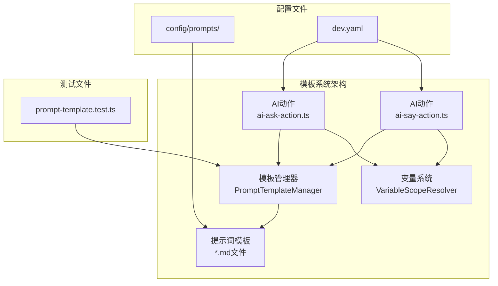
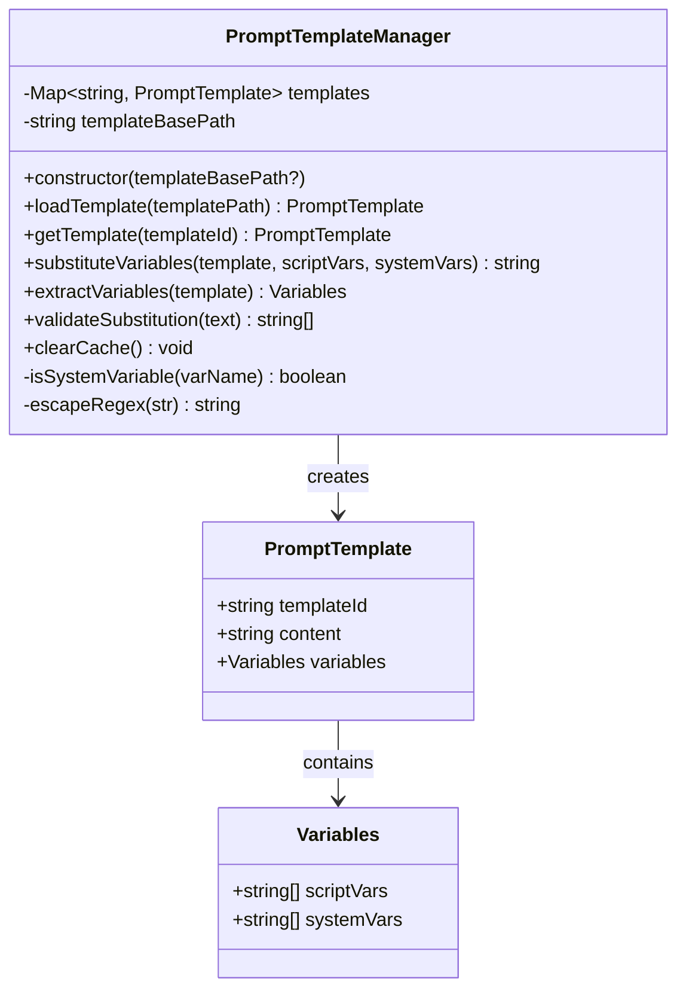
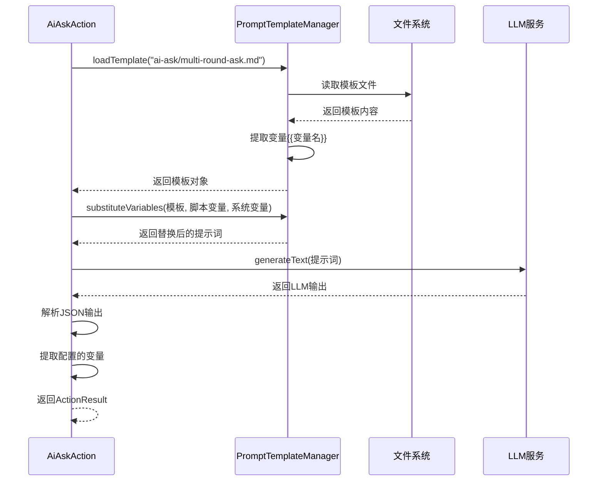
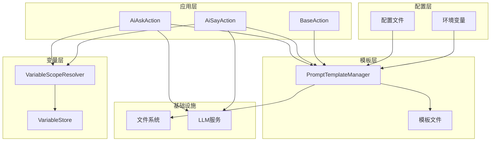
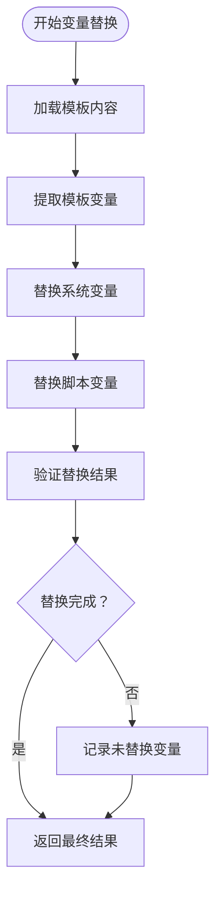
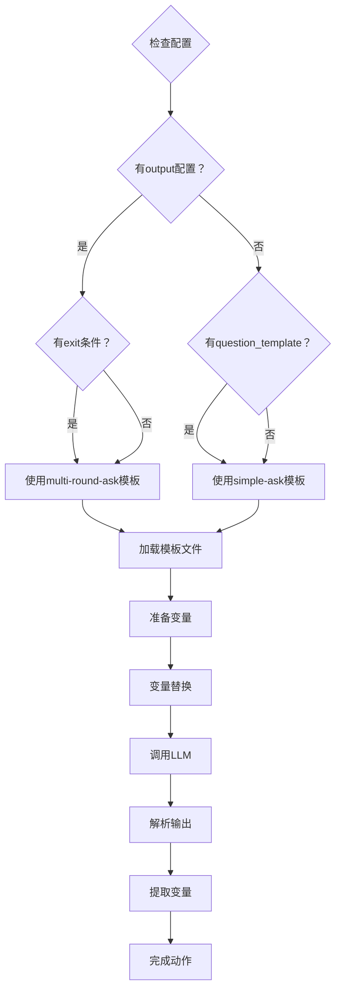
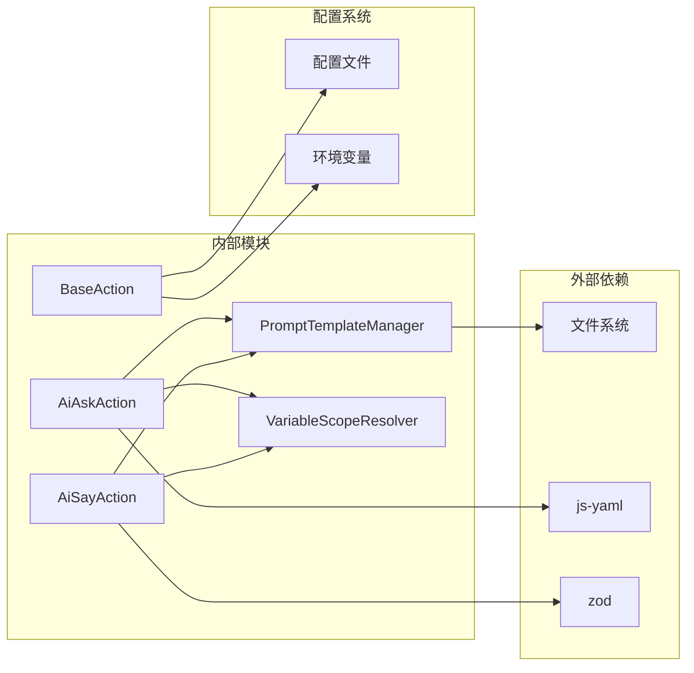
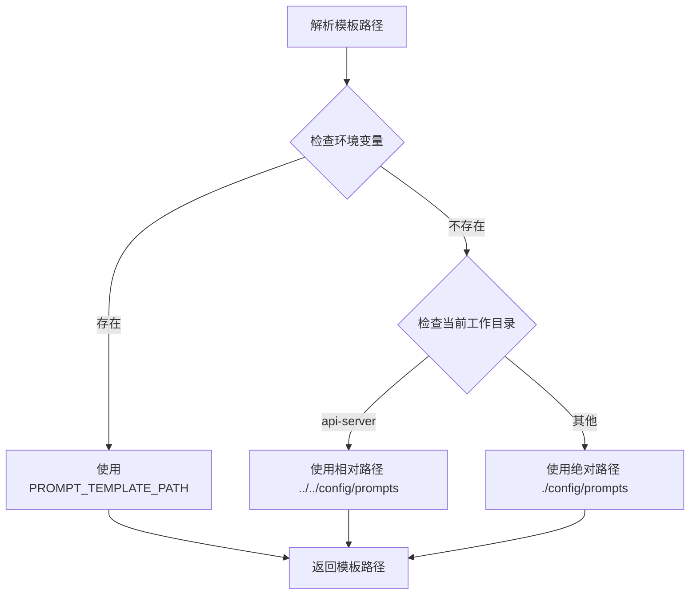

# 模板系统统一化

<cite>
**本文档引用的文件**
- [template-manager.ts](file://packages/core-engine/src/engines/prompt-template/template-manager.ts)
- [index.ts](file://packages/core-engine/src/engines/prompt-template/index.ts)
- [ai-ask-action.ts](file://packages/core-engine/src/actions/ai-ask-action.ts)
- [ai-say-action.ts](file://packages/core-engine/src/actions/ai-say-action.ts)
- [mainline-ask-template.md](file://config/prompts/ai-ask/mainline-ask-template.md)
- [multi-round-ask.md](file://config/prompts/ai-ask/multi-round-ask.md)
- [simple-ask.md](file://config/prompts/ai-ask/simple-ask.md)
- [mainline-a-introduce-concept.md](file://config/prompts/ai-say/mainline-a-introduce-concept.md)
- [prompt-template.test.ts](file://packages/core-engine/test/prompt-template.test.ts)
- [dev.yaml](file://config/dev.yaml)
- [AI_ASK_VARIABLE_EXTRACTION_FIX.md](file://docs/AI_ASK_VARIABLE_EXTRACTION_FIX.md)
- [ai_ask_output_list_feature.md](file://docs/ai_ask_output_list_feature.md)
- [version-evolution-strategy.md](file://packages/core-engine/docs/version-evolution-strategy.md)
</cite>

## 目录
1. [简介](#简介)
2. [项目结构](#项目结构)
3. [核心组件](#核心组件)
4. [架构概览](#架构概览)
5. [详细组件分析](#详细组件分析)
6. [依赖关系分析](#依赖关系分析)
7. [性能考虑](#性能考虑)
8. [故障排除指南](#故障排除指南)
9. [结论](#结论)

## 简介

HeartRule-Qcoder 项目中的模板系统统一化是一个重要的架构重构，旨在建立一个标准化的提示词模板管理系统。该系统通过统一的模板管理器为 AI 动作（ai_ask 和 ai_say）提供一致的模板处理能力，支持多轮对话、变量提取和智能退出决策。

模板系统的核心目标是：
- 统一提示词模板的加载、解析和替换机制
- 支持两层变量替换（系统变量和脚本变量）
- 提供模板缓存机制以提升性能
- 标准化模板验证和错误处理
- 支持多轮对话和变量提取功能

## 项目结构

项目采用模块化架构，模板系统主要分布在以下目录：

**图表来源**
- [template-manager.ts](file://packages/core-engine/src/engines/prompt-template/template-manager.ts#L20-L59)
- [ai-ask-action.ts](file://packages/core-engine/src/actions/ai-ask-action.ts#L24-L58)
- [ai-say-action.ts](file://packages/core-engine/src/actions/ai-say-action.ts#L20-L79)

**章节来源**
- [template-manager.ts](file://packages/core-engine/src/engines/prompt-template/template-manager.ts#L1-L193)
- [index.ts](file://packages/core-engine/src/engines/prompt-template/index.ts#L1-L2)

## 核心组件

### 模板管理器 (PromptTemplateManager)

模板管理器是整个模板系统的核心组件，负责：

- **模板加载**：从指定路径加载 Markdown 模板文件
- **变量提取**：识别模板中的变量并分类为系统变量和脚本变量
- **两层替换**：先替换系统变量，再替换脚本变量
- **缓存管理**：缓存已加载的模板以提升性能
- **验证机制**：验证变量替换的完整性

**图表来源**
- [template-manager.ts](file://packages/core-engine/src/engines/prompt-template/template-manager.ts#L7-L14)
- [template-manager.ts](file://packages/core-engine/src/engines/prompt-template/template-manager.ts#L20-L59)

### AI 动作集成

AI 动作通过模板管理器实现统一的模板处理：

**图表来源**
- [ai-ask-action.ts](file://packages/core-engine/src/actions/ai-ask-action.ts#L261-L340)
- [template-manager.ts](file://packages/core-engine/src/engines/prompt-template/template-manager.ts#L75-L108)

**章节来源**
- [ai-ask-action.ts](file://packages/core-engine/src/actions/ai-ask-action.ts#L44-L71)
- [ai-say-action.ts](file://packages/core-engine/src/actions/ai-say-action.ts#L65-L87)

## 架构概览

模板系统采用分层架构设计，确保了良好的可维护性和扩展性：

**图表来源**
- [ai-ask-action.ts](file://packages/core-engine/src/actions/ai-ask-action.ts#L24-L58)
- [ai-say-action.ts](file://packages/core-engine/src/actions/ai-say-action.ts#L20-L79)
- [template-manager.ts](file://packages/core-engine/src/engines/prompt-template/template-manager.ts#L20-L27)

## 详细组件分析

### 模板管理器实现

模板管理器实现了完整的模板生命周期管理：

#### 变量替换机制

模板管理器支持三种变量占位符格式：
- `{{变量名}}` - 统一格式
- `{变量名}` - 兼容格式  
- `${变量名}` - JavaScript格式

**图表来源**
- [template-manager.ts](file://packages/core-engine/src/engines/prompt-template/template-manager.ts#L75-L108)
- [template-manager.ts](file://packages/core-engine/src/engines/prompt-template/template-manager.ts#L166-L177)

#### 系统变量识别

系统变量具有固定的集合，模板管理器通过预定义列表识别：

| 系统变量类别 | 变量名称 |
|-------------|----------|
| 时间相关 | time, current_round, max_rounds |
| 角色相关 | who, ai_role, user |
| 对话相关 | chat_history, chat, tone |
| 退出条件 | understanding_threshold, exit |
| 主题内容 | topic_content |

**章节来源**
- [template-manager.ts](file://packages/core-engine/src/engines/prompt-template/template-manager.ts#L146-L159)

### AI 动作模板集成

#### AiAskAction 模板处理

AiAskAction 根据配置自动选择合适的模板：

**图表来源**
- [ai-ask-action.ts](file://packages/core-engine/src/actions/ai-ask-action.ts#L60-L71)
- [ai-ask-action.ts](file://packages/core-engine/src/actions/ai-ask-action.ts#L130-L190)

#### AiSayAction 模板处理

AiSayAction 提供两种执行模式：

1. **模板模式**：支持多轮对话和理解度评估
2. **兼容模式**：保留原有的 require_acknowledgment 机制

**章节来源**
- [ai-ask-action.ts](file://packages/core-engine/src/actions/ai-ask-action.ts#L127-L256)
- [ai-say-action.ts](file://packages/core-engine/src/actions/ai-say-action.ts#L89-L206)

### 模板文件结构

模板文件采用标准化的 Markdown 格式：

#### 多轮提问模板 (multi-round-ask.md)

模板包含完整的多轮对话框架：
- 任务描述和退出条件
- 对话历史和语气风格
- JSON 输出格式定义
- 字段说明和注意事项

#### 简单提问模板 (simple-ask.md)

模板专注于单轮对话：
- 简洁的输出要求
- 问题生成指导
- 长度和格式约束

#### 讲解概念模板 (mainline-a-introduce-concept.md)

模板针对知识传授场景：
- 理解度评估机制
- 用户基础信息考虑
- 退出决策逻辑

**章节来源**
- [mainline-ask-template.md](file://config/prompts/ai-ask/mainline-ask-template.md#L1-L54)
- [simple-ask.md](file://config/prompts/ai-ask/simple-ask.md#L1-L26)
- [mainline-a-introduce-concept.md](file://config/prompts/ai-say/mainline-a-introduce-concept.md#L1-L52)

## 依赖关系分析

模板系统的关键依赖关系如下：

**图表来源**
- [template-manager.ts](file://packages/core-engine/src/engines/prompt-template/template-manager.ts#L1-L3)
- [ai-ask-action.ts](file://packages/core-engine/src/actions/ai-ask-action.ts#L22-L28)
- [ai-say-action.ts](file://packages/core-engine/src/actions/ai-say-action.ts#L20-L24)

### 模板路径解析

模板管理器支持灵活的模板路径解析：

**图表来源**
- [base-action.ts](file://packages/core-engine/src/actions/base-action.ts#L204-L217)

**章节来源**
- [base-action.ts](file://packages/core-engine/src/actions/base-action.ts#L194-L217)

## 性能考虑

模板系统在设计时充分考虑了性能优化：

### 缓存策略

- **内存缓存**：已加载的模板存储在 Map 中，避免重复读取
- **模板ID生成**：使用路径转换生成唯一ID，支持快速查找
- **缓存清理**：提供 clearCache 方法手动清理缓存

### 变量替换优化

- **正则表达式预编译**：避免重复编译正则表达式
- **批量替换**：一次遍历完成所有变量替换
- **特殊字符转义**：防止正则表达式特殊字符造成的问题

### I/O 优化

- **异步文件读取**：使用 Promise API 避免阻塞
- **路径解析缓存**：模板路径解析结果缓存
- **最小化文件访问**：通过缓存减少磁盘I/O

## 故障排除指南

### 常见问题及解决方案

#### 模板加载失败

**问题现象**：`Failed to load template from ...` 错误

**可能原因**：
- 模板文件路径错误
- 文件权限问题
- 模板文件编码问题

**解决步骤**：
1. 验证模板文件是否存在
2. 检查文件路径是否正确
3. 确认文件编码为 UTF-8
4. 检查文件权限设置

#### 变量替换异常

**问题现象**：模板中变量未正确替换

**可能原因**：
- 变量名格式不正确
- 变量值为 undefined
- 正则表达式匹配问题

**解决步骤**：
1. 检查变量名格式是否为 `{{变量名}}`
2. 验证变量值是否已正确设置
3. 使用 `validateSubstitution` 方法检查未替换变量
4. 查看日志输出定位问题

#### LLM 输出解析错误

**问题现象**：JSON 解析失败

**可能原因**：
- LLM 输出格式不符合预期
- JSON 格式错误
- 输出被截断

**解决步骤**：
1. 检查 LLM 输出是否为有效 JSON
2. 使用 `cleanJsonOutput` 方法清理输出
3. 验证 JSON 格式规范
4. 查看 `llmRawOutput` 调试信息

**章节来源**
- [template-manager.ts](file://packages/core-engine/src/engines/prompt-template/template-manager.ts#L56-L58)
- [prompt-template.test.ts](file://packages/core-engine/test/prompt-template.test.ts#L103-L121)

## 结论

模板系统统一化项目成功实现了以下目标：

### 主要成就

1. **标准化模板管理**：建立了统一的 PromptTemplateManager，提供一致的模板处理能力
2. **多轮对话支持**：通过模板系统支持复杂的多轮对话场景
3. **变量提取机制**：实现了智能的变量提取和作用域管理
4. **性能优化**：通过缓存和优化算法提升了系统性能
5. **向后兼容**：保持了与现有系统的兼容性

### 技术优势

- **模块化设计**：清晰的职责分离和依赖关系
- **可扩展性**：支持新的模板类型和变量格式
- **可测试性**：完善的单元测试覆盖关键功能
- **可观测性**：详细的日志输出和调试信息

### 未来发展方向

1. **模板版本管理**：实现模板的版本控制和迁移机制
2. **模板热重载**：支持模板文件的动态更新
3. **模板验证增强**：增加更严格的模板格式验证
4. **性能监控**：添加模板加载和变量替换的性能指标

该模板系统为 HeartRule-Qcoder 项目提供了强大的提示词管理能力，为未来的功能扩展奠定了坚实的基础。