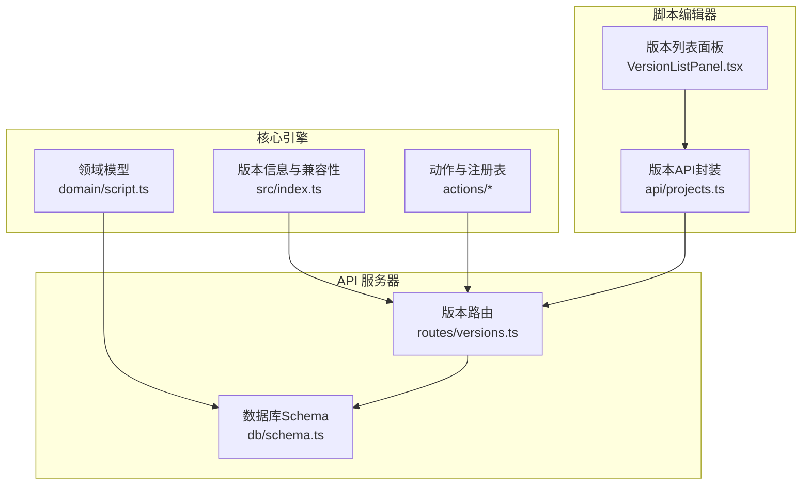
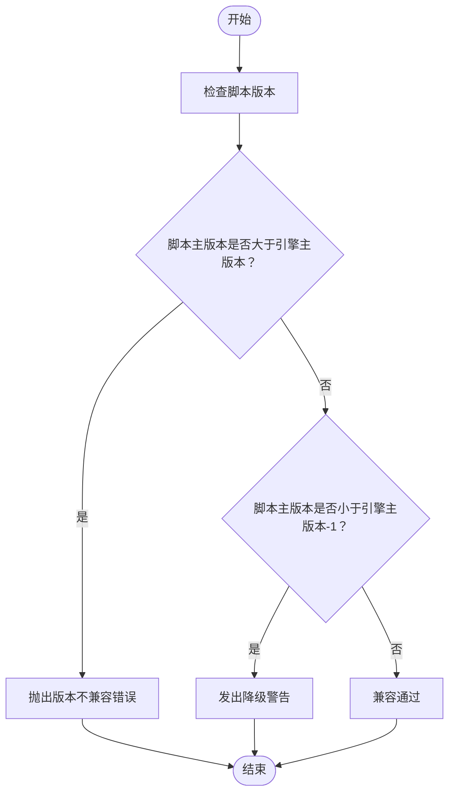
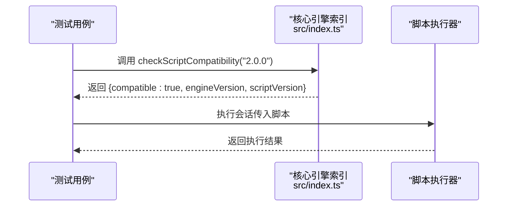
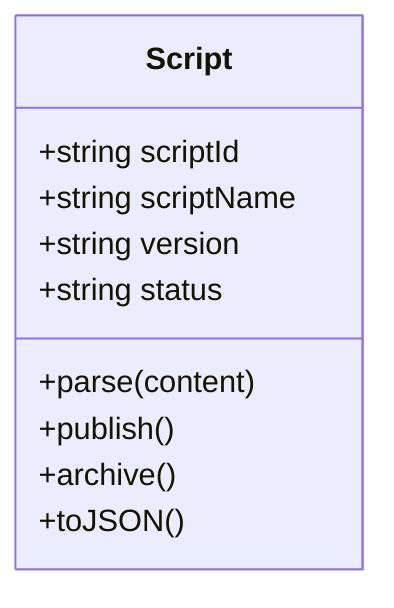
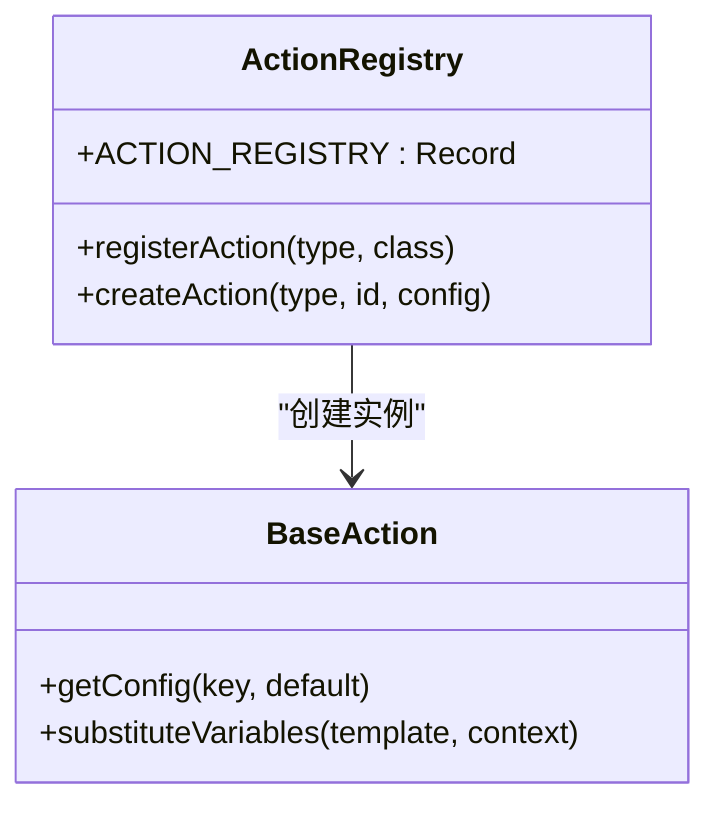
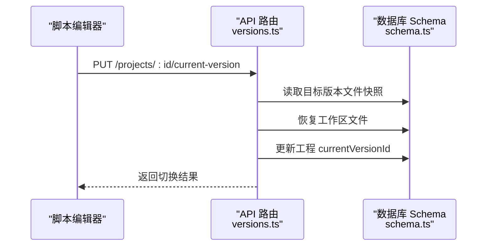
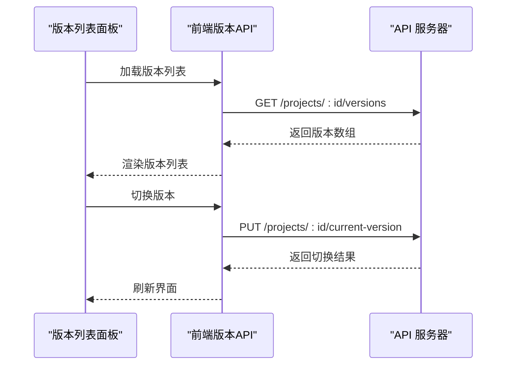
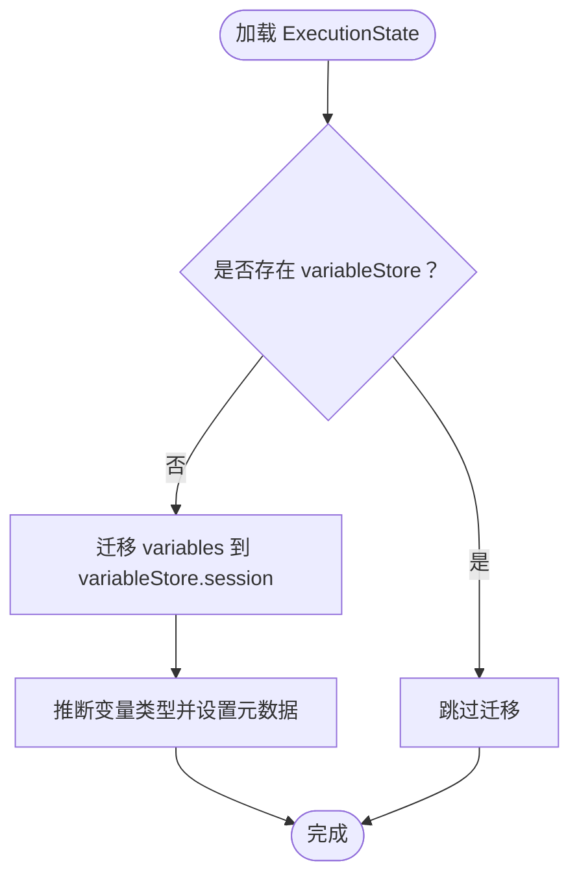
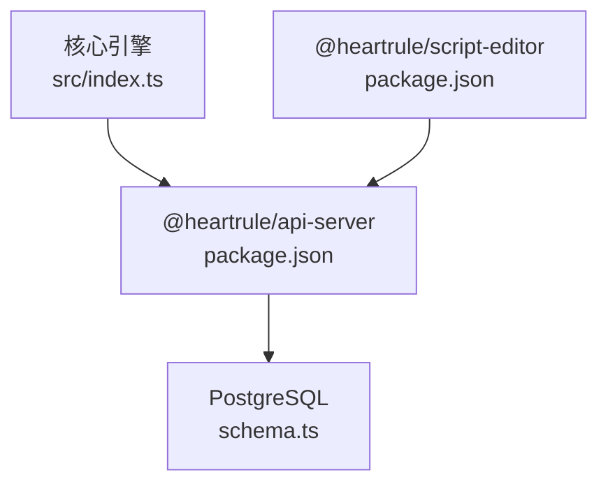

# 版本演进策略

<cite>
**本文档引用的文件**
- [packages/core-engine/docs/version-evolution-strategy.md](file://packages/core-engine/docs/version-evolution-strategy.md)
- [packages/core-engine/src/domain/script.ts](file://packages/core-engine/src/domain/script.ts)
- [packages/core-engine/src/index.ts](file://packages/core-engine/src/index.ts)
- [packages/core-engine/src/actions/base-action.ts](file://packages/core-engine/src/actions/base-action.ts)
- [packages/core-engine/src/actions/action-registry.ts](file://packages/core-engine/src/actions/action-registry.ts)
- [packages/core-engine/test/version-compatibility.test.ts](file://packages/core-engine/test/version-compatibility.test.ts)
- [packages/core-engine/test/variable-migration.test.ts](file://packages/core-engine/test/variable-migration.test.ts)
- [packages/api-server/src/db/schema.ts](file://packages/api-server/src/db/schema.ts)
- [packages/api-server/src/routes/versions.ts](file://packages/api-server/src/routes/versions.ts)
- [packages/api-server/drizzle/meta/_journal.json](file://packages/api-server/drizzle/meta/_journal.json)
- [packages/script-editor/src/components/VersionListPanel/VersionListPanel.tsx](file://packages/script-editor/src/components/VersionListPanel/VersionListPanel.tsx)
- [packages/script-editor/src/api/projects.ts](file://packages/script-editor/src/api/projects.ts)
- [packages/core-engine/src/engines/script-execution/script-executor.ts](file://packages/core-engine/src/engines/script-execution/script-execution/script-executor.ts)
- [packages/shared-types/src/domain/script.ts](file://packages/shared-types/src/domain/script.ts)
- [docs/DEVELOPMENT_GUIDE.md](file://docs/DEVELOPMENT_GUIDE.md)
- [package.json](file://package.json)
- [packages/api-server/package.json](file://packages/api-server/package.json)
- [packages/script-editor/package.json](file://packages/script-editor/package.json)
</cite>

## 目录
1. [简介](#简介)
2. [项目结构](#项目结构)
3. [核心组件](#核心组件)
4. [架构总览](#架构总览)
5. [详细组件分析](#详细组件分析)
6. [依赖关系分析](#依赖关系分析)
7. [性能考量](#性能考量)
8. [故障排查指南](#故障排查指南)
9. [结论](#结论)
10. [附录](#附录)

## 简介
本文件系统化阐述 HeartRule AI 咨询引擎的版本演进策略，聚焦于脚本版本、引擎版本与 API 版本的兼容性设计与实施路径。目标是在保持向后兼容的前提下，支持渐进式升级与平滑迁移，降低版本升级对用户与系统的冲击。

## 项目结构
- 核心引擎（packages/core-engine）：定义领域模型、应用服务与引擎组件，并提供版本信息与兼容性检测。
- API 服务器（packages/api-server）：提供版本管理的 HTTP 接口，维护工程与脚本文件的版本快照。
- 脚本编辑器（packages/script-editor）：提供版本列表面板与版本切换 UI，支撑版本对比与回滚。
- 共享类型（packages/shared-types）：定义跨包共享的数据模型与枚举。

**图表来源**
- [packages/core-engine/src/index.ts](file://packages/core-engine/src/index.ts#L15-L86)
- [packages/core-engine/src/domain/script.ts](file://packages/core-engine/src/domain/script.ts#L7-L47)
- [packages/api-server/src/routes/versions.ts](file://packages/api-server/src/routes/versions.ts#L24-L554)
- [packages/api-server/src/db/schema.ts](file://packages/api-server/src/db/schema.ts#L67-L160)
- [packages/script-editor/src/components/VersionListPanel/VersionListPanel.tsx](file://packages/script-editor/src/components/VersionListPanel/VersionListPanel.tsx#L31-L341)
- [packages/script-editor/src/api/projects.ts](file://packages/script-editor/src/api/projects.ts#L176-L260)

**章节来源**
- [packages/core-engine/src/index.ts](file://packages/core-engine/src/index.ts#L15-L86)
- [packages/api-server/src/db/schema.ts](file://packages/api-server/src/db/schema.ts#L67-L160)
- [packages/script-editor/src/components/VersionListPanel/VersionListPanel.tsx](file://packages/script-editor/src/components/VersionListPanel/VersionListPanel.tsx#L31-L341)

## 核心组件
- 版本信息与兼容性检测：在核心引擎导出引擎版本与最低脚本版本，并提供脚本兼容性检查函数。
- 脚本领域模型：脚本实体包含版本字段，支持语义化版本号。
- 动作与注册表：支持动态注册 Action 类型，为 Action 类型演进提供基础。
- 版本管理 API：提供草稿保存、版本发布、版本切换、回滚与版本对比等接口。
- 版本 UI 面板：前端版本列表面板支持版本切换与回滚操作。
- 数据库 Schema：工程与版本相关表结构，支撑版本快照与切换。

**章节来源**
- [packages/core-engine/src/index.ts](file://packages/core-engine/src/index.ts#L15-L86)
- [packages/core-engine/src/domain/script.ts](file://packages/core-engine/src/domain/script.ts#L7-L47)
- [packages/core-engine/src/actions/action-registry.ts](file://packages/core-engine/src/actions/action-registry.ts#L17-L30)
- [packages/api-server/src/routes/versions.ts](file://packages/api-server/src/routes/versions.ts#L24-L554)
- [packages/script-editor/src/components/VersionListPanel/VersionListPanel.tsx](file://packages/script-editor/src/components/VersionListPanel/VersionListPanel.tsx#L31-L341)
- [packages/api-server/src/db/schema.ts](file://packages/api-server/src/db/schema.ts#L90-L160)

## 架构总览
版本演进策略贯穿三层：
- 脚本版本：面向 YAML 脚本的结构与 Action 配置，采用语义化版本。
- 引擎版本：面向核心引擎的接口与算法，采用语义化版本。
- API 版本：面向 HTTP 接口的路径前缀与数据结构，采用整数版本号。

兼容性矩阵与规则：
- 引擎向后兼容：引擎版本 N 支持执行 N-1 与 N-2 的脚本。
- 脚本向前兼容检测：脚本版本 N 在引擎版本 N-1 上执行时给出明确错误提示。
- 字段可选性：新增字段必须可选并提供默认值。
- 字段重命名：同时支持旧字段名与新字段名，通过配置读取兼容 snake_case 与 camelCase。
- Action 类型演进：新增类型直接注册；移除类型需提前废弃并保留至少两个主版本。
- 内部算法演进：保持对外接口不变，必要时通过配置开关控制。

**图表来源**
- [packages/core-engine/src/index.ts](file://packages/core-engine/src/index.ts#L41-L86)
- [packages/core-engine/test/version-compatibility.test.ts](file://packages/core-engine/test/version-compatibility.test.ts#L45-L94)

**章节来源**
- [packages/core-engine/docs/version-evolution-strategy.md](file://packages/core-engine/docs/version-evolution-strategy.md#L60-L111)
- [packages/core-engine/src/index.ts](file://packages/core-engine/src/index.ts#L41-L86)
- [packages/core-engine/test/version-compatibility.test.ts](file://packages/core-engine/test/version-compatibility.test.ts#L45-L94)

## 详细组件分析

### 版本信息与兼容性检测
- 导出引擎版本与最低脚本版本，提供简单版本比较函数，返回兼容性结果与可选消息。
- 测试用例覆盖引擎版本导出、最低脚本版本校验与边界版本处理。

**图表来源**
- [packages/core-engine/src/index.ts](file://packages/core-engine/src/index.ts#L41-L86)
- [packages/core-engine/test/version-compatibility.test.ts](file://packages/core-engine/test/version-compatibility.test.ts#L45-L94)

**章节来源**
- [packages/core-engine/src/index.ts](file://packages/core-engine/src/index.ts#L15-L86)
- [packages/core-engine/test/version-compatibility.test.ts](file://packages/core-engine/test/version-compatibility.test.ts#L11-L94)

### 脚本领域模型与版本字段
- Script 实体包含版本字段，默认值为 1.0.0，支持语义化版本号。
- 支持脚本解析、发布与归档等状态管理。

**图表来源**
- [packages/core-engine/src/domain/script.ts](file://packages/core-engine/src/domain/script.ts#L7-L94)

**章节来源**
- [packages/core-engine/src/domain/script.ts](file://packages/core-engine/src/domain/script.ts#L7-L47)

### 动作与注册表
- ActionRegistry 支持动态注册 Action 类型，为 Action 类型演进提供基础。
- BaseAction 提供配置读取兼容 snake_case 与 camelCase 的能力。

**图表来源**
- [packages/core-engine/src/actions/action-registry.ts](file://packages/core-engine/src/actions/action-registry.ts#L17-L45)
- [packages/core-engine/src/actions/base-action.ts](file://packages/core-engine/src/actions/base-action.ts#L194-L199)

**章节来源**
- [packages/core-engine/src/actions/action-registry.ts](file://packages/core-engine/src/actions/action-registry.ts#L17-L30)
- [packages/core-engine/src/actions/base-action.ts](file://packages/core-engine/src/actions/base-action.ts#L194-L199)

### 版本管理 API 与数据库 Schema
- API 路由提供草稿保存、版本发布、版本切换、回滚与版本对比等接口。
- 数据库 Schema 定义工程、版本与文件快照等表结构，支撑版本切换与回滚。

**图表来源**
- [packages/api-server/src/routes/versions.ts](file://packages/api-server/src/routes/versions.ts#L373-L481)
- [packages/api-server/src/db/schema.ts](file://packages/api-server/src/db/schema.ts#L90-L160)

**章节来源**
- [packages/api-server/src/routes/versions.ts](file://packages/api-server/src/routes/versions.ts#L24-L554)
- [packages/api-server/src/db/schema.ts](file://packages/api-server/src/db/schema.ts#L90-L160)

### 版本 UI 面板与前端 API
- 版本列表面板支持加载版本历史、当前版本展示、草稿状态与版本切换。
- 前端 API 封装版本相关接口，包括草稿、发布、切换与对比。

**图表来源**
- [packages/script-editor/src/components/VersionListPanel/VersionListPanel.tsx](file://packages/script-editor/src/components/VersionListPanel/VersionListPanel.tsx#L44-L140)
- [packages/script-editor/src/api/projects.ts](file://packages/script-editor/src/api/projects.ts#L231-L243)

**章节来源**
- [packages/script-editor/src/components/VersionListPanel/VersionListPanel.tsx](file://packages/script-editor/src/components/VersionListPanel/VersionListPanel.tsx#L31-L341)
- [packages/script-editor/src/api/projects.ts](file://packages/script-editor/src/api/projects.ts#L176-L260)

### 数据迁移与向后兼容
- 测试用例验证从旧的 variables 迁移到新的 variableStore.session 的逻辑，确保数据完整性与类型推断。
- 若已存在 variableStore，则跳过迁移，避免重复处理。

**图表来源**
- [packages/core-engine/test/variable-migration.test.ts](file://packages/core-engine/test/variable-migration.test.ts#L11-L76)

**章节来源**
- [packages/core-engine/test/variable-migration.test.ts](file://packages/core-engine/test/variable-migration.test.ts#L10-L192)

## 依赖关系分析
- 核心引擎版本信息与兼容性检测被 API 服务器与脚本编辑器共同依赖。
- API 服务器通过 Drizzle ORM 访问数据库，维护工程与版本快照。
- 脚本编辑器通过前端 API 调用 API 服务器的版本管理接口。

**图表来源**
- [packages/core-engine/src/index.ts](file://packages/core-engine/src/index.ts#L25-L33)
- [packages/api-server/package.json](file://packages/api-server/package.json#L26-L36)
- [packages/script-editor/package.json](file://packages/script-editor/package.json#L14-L24)

**章节来源**
- [packages/api-server/package.json](file://packages/api-server/package.json#L26-L36)
- [packages/script-editor/package.json](file://packages/script-editor/package.json#L14-L24)

## 性能考量
- 版本切换与回滚涉及大量文件快照恢复，建议在批量更新时使用事务以减少数据库往返。
- 版本对比功能当前为简化实现，生产环境可引入专用 diff 库提升性能与准确性。
- 前端版本面板在加载时并发请求版本与草稿，注意错误处理与重试机制。

## 故障排查指南
- 版本不兼容错误：当脚本版本大于引擎主版本时，兼容性检测会抛出错误。请升级引擎版本或降级脚本版本。
- 版本切换失败：检查目标版本是否存在、工作区是否有未保存修改以及数据库连接状态。
- 数据迁移异常：确认 ExecutionState 中是否存在旧的 variables 或新的 variableStore，避免重复迁移。

**章节来源**
- [packages/core-engine/src/index.ts](file://packages/core-engine/src/index.ts#L62-L85)
- [packages/api-server/src/routes/versions.ts](file://packages/api-server/src/routes/versions.ts#L373-L481)
- [packages/core-engine/test/variable-migration.test.ts](file://packages/core-engine/test/variable-migration.test.ts#L78-L134)

## 结论
通过明确的版本演进策略与实现机制，HeartRule 项目能够在保持向后兼容的同时，支持脚本与引擎的渐进式升级。建议持续完善版本检测机制、自动化迁移工具与回归测试套件，以进一步提升版本演进的可靠性与用户体验。

## 附录
- 语义化版本规范参考：https://semver.org/
- Node.js LTS 版本计划参考：https://nodejs.org/en/about/releases/
- TypeScript Breaking Changes 参考：https://github.com/microsoft/TypeScript/wiki/Breaking-Changes