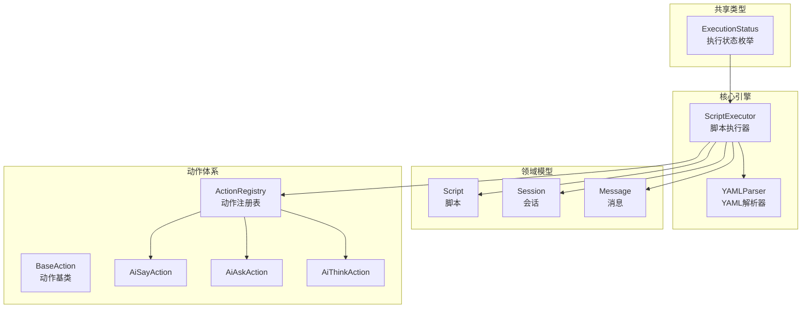
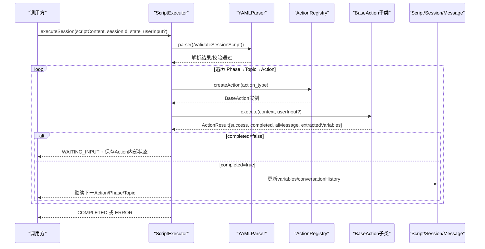
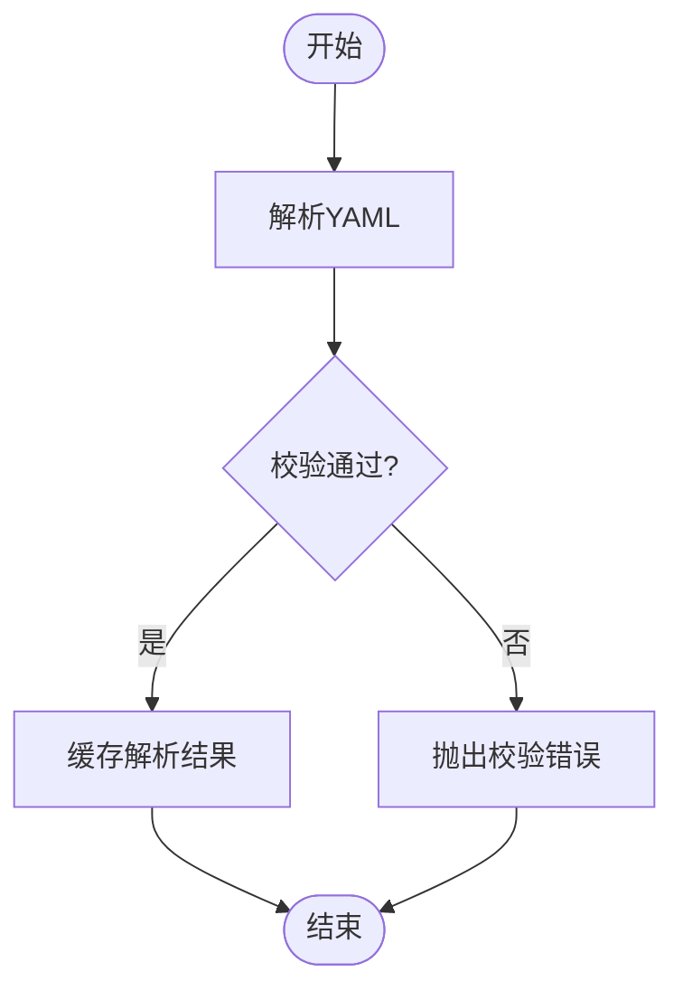
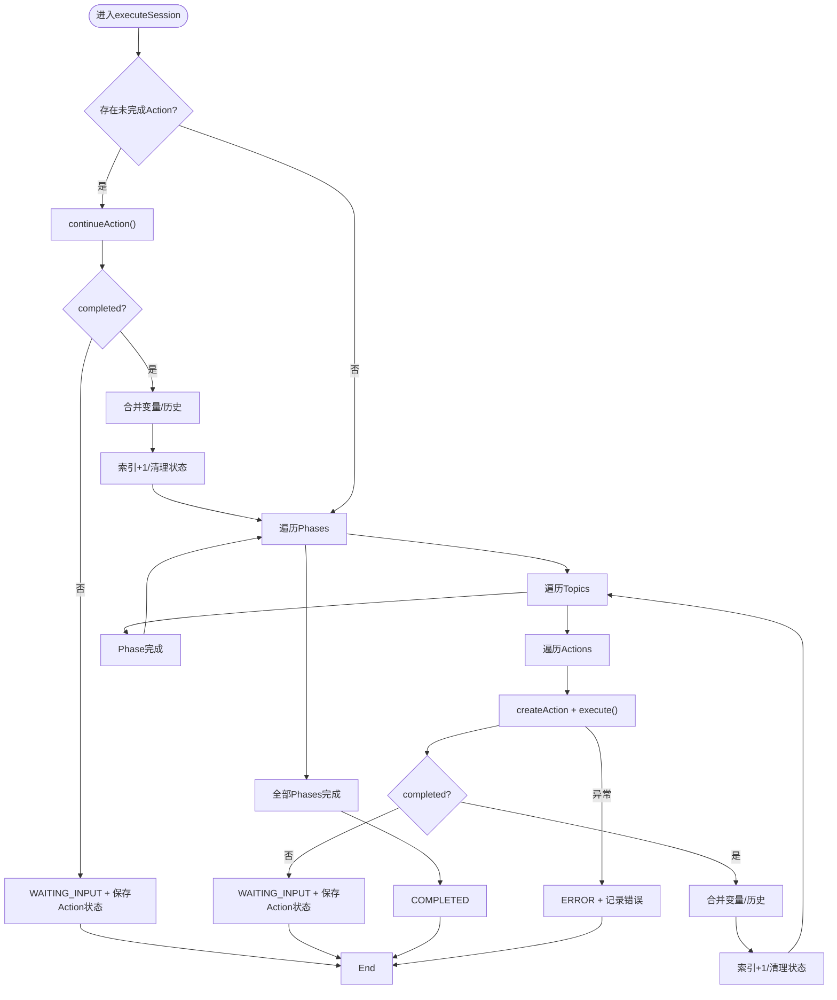
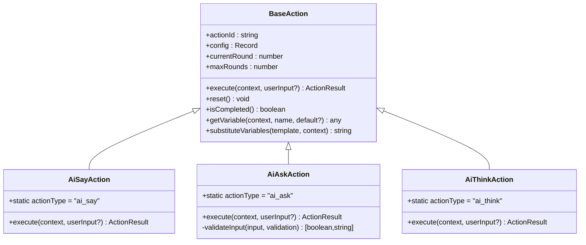
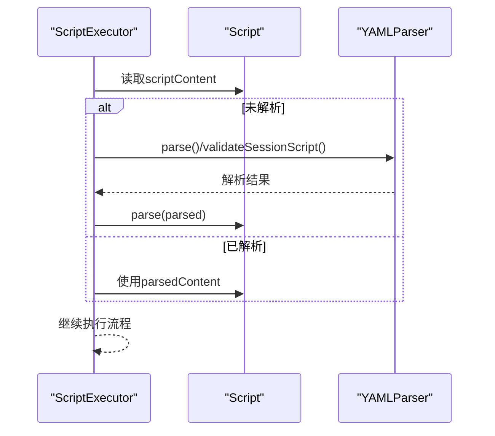
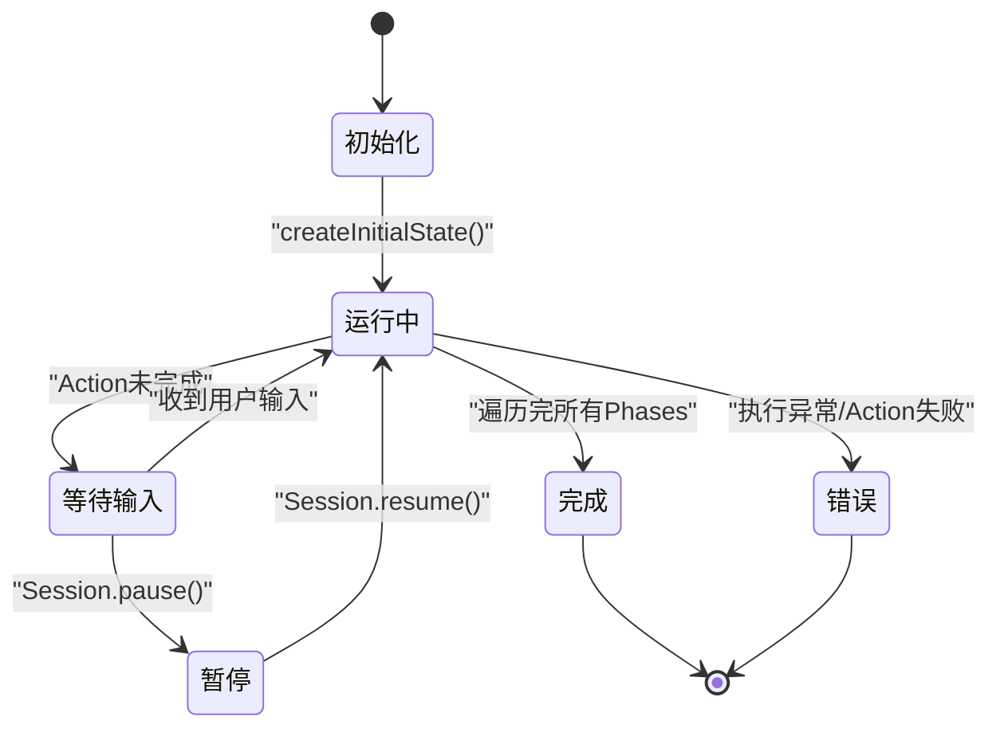
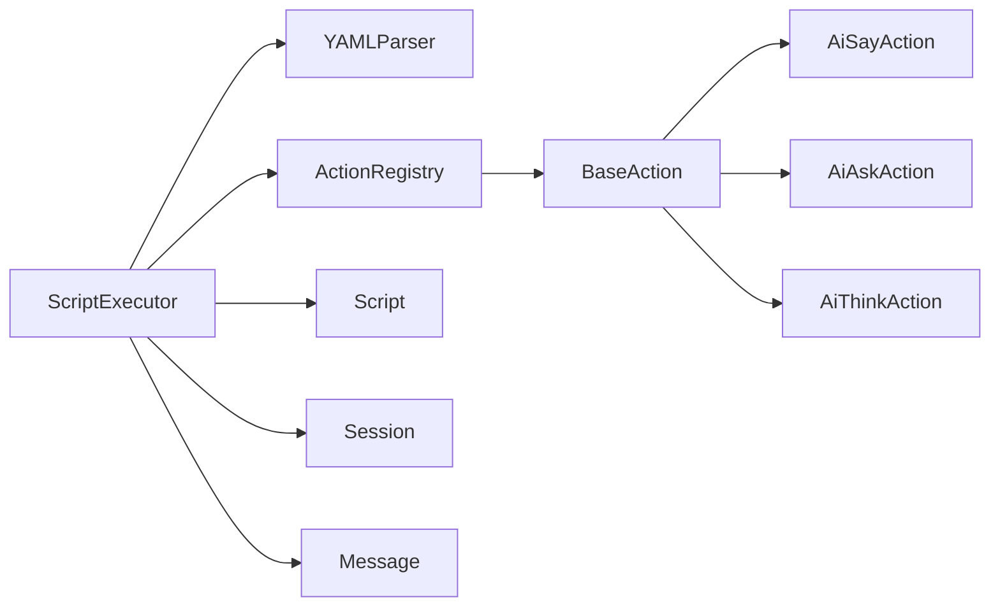

# 脚本执行引擎

<cite>
**本文引用的文件**
- [packages/core-engine/src/index.ts](file://packages/core-engine/src/index.ts)
- [packages/core-engine/src/engines/script-execution/script-executor.ts](file://packages/core-engine/src/engines/script-execution/script-executor.ts)
- [packages/core-engine/src/engines/script-execution/executor.ts](file://packages/core-engine/src/engines/script-execution/executor.ts)
- [packages/core-engine/src/engines/script-execution/yaml-parser.ts](file://packages/core-engine/src/engines/script-execution/yaml-parser.ts)
- [packages/core-engine/src/domain/script.ts](file://packages/core-engine/src/domain/script.ts)
- [packages/core-engine/src/domain/session.ts](file://packages/core-engine/src/domain/session.ts)
- [packages/core-engine/src/domain/message.ts](file://packages/core-engine/src/domain/message.ts)
- [packages/core-engine/src/actions/base-action.ts](file://packages/core-engine/src/actions/base-action.ts)
- [packages/core-engine/src/actions/action-registry.ts](file://packages/core-engine/src/actions/action-registry.ts)
- [packages/core-engine/src/actions/ai-say-action.ts](file://packages/core-engine/src/actions/ai-say-action.ts)
- [packages/core-engine/src/actions/ai-ask-action.ts](file://packages/core-engine/src/actions/ai-ask-action.ts)
- [packages/core-engine/src/actions/ai-think-action.ts](file://packages/core-engine/src/actions/ai-think-action.ts)
- [packages/shared-types/src/enums.ts](file://packages/shared-types/src/enums.ts)
- [scripts/sessions/cbt_depression_assessment.yaml](file://scripts/sessions/cbt_depression_assessment.yaml)
- [scripts/techniques/socratic_questioning.yaml](file://scripts/techniques/socratic_questioning.yaml)
</cite>

## 目录
1. [简介](#简介)
2. [项目结构](#项目结构)
3. [核心组件](#核心组件)
4. [架构总览](#架构总览)
5. [详细组件分析](#详细组件分析)
6. [依赖分析](#依赖分析)
7. [性能考虑](#性能考虑)
8. [故障排查指南](#故障排查指南)
9. [结论](#结论)
10. [附录](#附录)

## 简介
本文件系统性阐述脚本执行引擎的设计与实现，覆盖YAML脚本解析、执行状态管理、脚本加载与验证、Action序列执行、状态转换与错误恢复、生命周期管理（初始化、执行、暂停、恢复、终止），并提供脚本编写规范与最佳实践，以及扩展与自定义执行行为的方法。文档以代码为依据，辅以图示帮助不同背景读者理解。

## 项目结构
脚本执行引擎位于核心包中，采用“领域模型 + 引擎 + 动作(Action)”分层组织：
- 领域模型：Script、Session、Message
- 引擎：脚本执行器、YAML解析器
- 动作：Action基类、注册表、内置动作（ai_say、ai_ask、ai_think）

图表来源
- [packages/core-engine/src/engines/script-execution/script-executor.ts](file://packages/core-engine/src/engines/script-execution/script-executor.ts#L59-L208)
- [packages/core-engine/src/engines/script-execution/yaml-parser.ts](file://packages/core-engine/src/engines/script-execution/yaml-parser.ts#L8-L96)
- [packages/core-engine/src/domain/script.ts](file://packages/core-engine/src/domain/script.ts#L7-L95)
- [packages/core-engine/src/domain/session.ts](file://packages/core-engine/src/domain/session.ts#L7-L137)
- [packages/core-engine/src/domain/message.ts](file://packages/core-engine/src/domain/message.ts#L7-L49)
- [packages/core-engine/src/actions/base-action.ts](file://packages/core-engine/src/actions/base-action.ts#L37-L96)
- [packages/core-engine/src/actions/action-registry.ts](file://packages/core-engine/src/actions/action-registry.ts#L17-L46)
- [packages/shared-types/src/enums.ts](file://packages/shared-types/src/enums.ts#L16-L22)

章节来源
- [packages/core-engine/src/index.ts](file://packages/core-engine/src/index.ts#L1-L27)

## 核心组件
- 执行状态与位置
  - ExecutionStatus：running、waiting_input、paused、completed、error
  - ExecutionPosition：phaseIndex、topicIndex、actionIndex
- 执行状态对象（ScriptExecutor）
  - 包含当前执行位置、变量、对话历史、元数据、最后AI消息、扩展位置信息等
- 脚本执行器
  - 支持从JSON或YAML加载脚本，按Phase→Topic→Action顺序执行
  - 支持Action内部多轮（round）执行与状态持久化
  - 支持等待用户输入、错误恢复、完成标记
- YAML解析器
  - 解析与序列化YAML
  - 校验会话脚本与技术脚本Schema
- 领域模型
  - Script：脚本内容与解析缓存
  - Session：会话状态、执行状态、位置、变量、元数据
  - Message：消息记录（role、content、actionId、metadata）
- 动作体系
  - BaseAction：抽象接口、上下文、结果、变量替换、轮次控制
  - ActionRegistry：动作类型注册与实例化
  - AiSayAction/AiAskAction/AiThinkAction：内置动作实现

章节来源
- [packages/core-engine/src/engines/script-execution/script-executor.ts](file://packages/core-engine/src/engines/script-execution/script-executor.ts#L14-L54)
- [packages/shared-types/src/enums.ts](file://packages/shared-types/src/enums.ts#L16-L22)
- [packages/core-engine/src/engines/script-execution/yaml-parser.ts](file://packages/core-engine/src/engines/script-execution/yaml-parser.ts#L34-L67)
- [packages/core-engine/src/domain/script.ts](file://packages/core-engine/src/domain/script.ts#L52-L55)
- [packages/core-engine/src/domain/session.ts](file://packages/core-engine/src/domain/session.ts#L49-L101)
- [packages/core-engine/src/domain/message.ts](file://packages/core-engine/src/domain/message.ts#L37-L47)
- [packages/core-engine/src/actions/base-action.ts](file://packages/core-engine/src/actions/base-action.ts#L37-L96)
- [packages/core-engine/src/actions/action-registry.ts](file://packages/core-engine/src/actions/action-registry.ts#L35-L45)

## 架构总览
脚本执行引擎遵循“解析→校验→执行→状态管理→动作调度”的流水线式架构。执行器负责遍历脚本结构，动作注册表根据action_type动态创建动作实例，动作在上下文中执行并返回结果，执行器据此推进状态或等待输入。

图表来源
- [packages/core-engine/src/engines/script-execution/script-executor.ts](file://packages/core-engine/src/engines/script-execution/script-executor.ts#L63-L208)
- [packages/core-engine/src/engines/script-execution/yaml-parser.ts](file://packages/core-engine/src/engines/script-execution/yaml-parser.ts#L12-L29)
- [packages/core-engine/src/actions/action-registry.ts](file://packages/core-engine/src/actions/action-registry.ts#L35-L45)
- [packages/core-engine/src/actions/base-action.ts](file://packages/core-engine/src/actions/base-action.ts#L54-L57)

## 详细组件分析

### YAML脚本解析与验证
- 解析：使用js-yaml将YAML字符串转为JS对象
- 序列化：将对象dump回YAML字符串
- 校验：
  - 会话脚本Schema：session.session_id、phases数组、topics数组、actions数组、action_type使用共享枚举校验
  - 技术脚本Schema：topic.topic_id、actions数组、action_type校验
- 使用场景：执行前确保脚本结构合法，避免运行期异常

图表来源
- [packages/core-engine/src/engines/script-execution/yaml-parser.ts](file://packages/core-engine/src/engines/script-execution/yaml-parser.ts#L12-L29)
- [packages/core-engine/src/engines/script-execution/yaml-parser.ts](file://packages/core-engine/src/engines/script-execution/yaml-parser.ts#L34-L67)

章节来源
- [packages/core-engine/src/engines/script-execution/yaml-parser.ts](file://packages/core-engine/src/engines/script-execution/yaml-parser.ts#L12-L96)

### 执行器工作原理与状态管理
- 初始化
  - 创建初始ExecutionState：status=RUNNING，索引归零，空变量与历史
- 执行流程
  - 若存在未完成Action，先继续执行该Action（支持多轮）
  - 否则按Phase→Topic→Action顺序推进
  - 每次Action完成后合并extractedVariables，追加aiMessage到conversationHistory
- 等待输入
  - Action返回completed=false时，设置status=waiting_input，并序列化Action内部状态（currentRound等）以便恢复
- 错误处理
  - Action失败或执行异常，设置status=error并记录错误信息
- 完成条件
  - 遍历完所有Phases后，设置status=completed

图表来源
- [packages/core-engine/src/engines/script-execution/script-executor.ts](file://packages/core-engine/src/engines/script-execution/script-executor.ts#L63-L208)
- [packages/core-engine/src/engines/script-execution/script-executor.ts](file://packages/core-engine/src/engines/script-execution/script-executor.ts#L473-L485)

章节来源
- [packages/core-engine/src/engines/script-execution/script-executor.ts](file://packages/core-engine/src/engines/script-execution/script-executor.ts#L63-L208)

### Action序列与状态转换
- Action基类
  - 上下文ActionContext包含sessionId、phaseId、topicId、actionId、variables、conversationHistory、metadata
  - ActionResult包含success、completed、aiMessage、extractedVariables、error、metadata
  - 支持变量模板替换与轮次控制（currentRound/maxRounds）
- 内置动作
  - AiSayAction：支持require_acknowledgment；单轮或两轮确认
  - AiAskAction：多轮问答+校验（required/min_length/max_length/pattern），失败时提示重试
  - AiThinkAction：占位实现，生成输出变量占位值
- 状态转换
  - RUNNING → WAITING_INPUT（Action未完成且需要输入）
  - WAITING_INPUT → RUNNING（收到用户输入并继续）
  - ERROR（任意环节失败）
  - COMPLETED（脚本执行完毕）

图表来源
- [packages/core-engine/src/actions/base-action.ts](file://packages/core-engine/src/actions/base-action.ts#L37-L96)
- [packages/core-engine/src/actions/ai-say-action.ts](file://packages/core-engine/src/actions/ai-say-action.ts#L16-L105)
- [packages/core-engine/src/actions/ai-ask-action.ts](file://packages/core-engine/src/actions/ai-ask-action.ts#L19-L207)
- [packages/core-engine/src/actions/ai-think-action.ts](file://packages/core-engine/src/actions/ai-think-action.ts#L11-L57)

章节来源
- [packages/core-engine/src/actions/base-action.ts](file://packages/core-engine/src/actions/base-action.ts#L7-L30)
- [packages/core-engine/src/actions/ai-say-action.ts](file://packages/core-engine/src/actions/ai-say-action.ts#L19-L105)
- [packages/core-engine/src/actions/ai-ask-action.ts](file://packages/core-engine/src/actions/ai-ask-action.ts#L27-L207)
- [packages/core-engine/src/actions/ai-think-action.ts](file://packages/core-engine/src/actions/ai-think-action.ts#L18-L57)

### 脚本加载与验证机制
- 加载
  - ScriptExecutor接收JSON字符串（会话脚本）或YAML字符串（旧版），解析为对象
  - 若存在metadata.actionState，恢复未完成Action的内部状态
- 验证
  - 使用Zod Schema校验脚本结构与字段类型
  - action_type使用共享枚举进行约束
- 缓存
  - Script.parse缓存解析结果，避免重复解析

图表来源
- [packages/core-engine/src/engines/script-execution/script-executor.ts](file://packages/core-engine/src/engines/script-execution/script-executor.ts#L70-L75)
- [packages/core-engine/src/domain/script.ts](file://packages/core-engine/src/domain/script.ts#L52-L55)
- [packages/core-engine/src/engines/script-execution/yaml-parser.ts](file://packages/core-engine/src/engines/script-execution/yaml-parser.ts#L34-L67)

章节来源
- [packages/core-engine/src/domain/script.ts](file://packages/core-engine/src/domain/script.ts#L52-L55)
- [packages/core-engine/src/engines/script-execution/yaml-parser.ts](file://packages/core-engine/src/engines/script-execution/yaml-parser.ts#L34-L67)

### 执行生命周期管理
- 初始化：createInitialState()创建初始执行状态
- 执行：executeSession循环推进Phase/Topic/Action
- 暂停/恢复：Session提供pause/resume，配合执行器的PAUSED状态
- 终止：ERROR或COMPLETED两种终止路径
- 恢复：通过metadata.actionState恢复Action内部状态，继续执行

图表来源
- [packages/core-engine/src/engines/script-execution/script-executor.ts](file://packages/core-engine/src/engines/script-execution/script-executor.ts#L473-L485)
- [packages/core-engine/src/domain/session.ts](file://packages/core-engine/src/domain/session.ts#L58-L73)
- [packages/shared-types/src/enums.ts](file://packages/shared-types/src/enums.ts#L16-L22)

章节来源
- [packages/core-engine/src/engines/script-execution/script-executor.ts](file://packages/core-engine/src/engines/script-execution/script-executor.ts#L473-L485)
- [packages/core-engine/src/domain/session.ts](file://packages/core-engine/src/domain/session.ts#L58-L73)

### 错误恢复机制
- Action级错误：捕获异常并返回error，设置status=ERROR
- 输入校验失败：AiAskAction在maxRounds内重试，超限则失败
- 执行器级错误：try/catch包裹整个执行流程，统一设置status=ERROR并抛出

章节来源
- [packages/core-engine/src/engines/script-execution/script-executor.ts](file://packages/core-engine/src/engines/script-execution/script-executor.ts#L203-L208)
- [packages/core-engine/src/actions/ai-ask-action.ts](file://packages/core-engine/src/actions/ai-ask-action.ts#L87-L94)

### 脚本编写规范与最佳实践
- 结构设计
  - 会话脚本：session.session_id → phases → topics → actions
  - 技术脚本：topic.topic_id → actions
- Action配置
  - action_type使用受控枚举（ai_say、ai_ask、ai_think）
  - ai_say：建议设置require_acknowledgment控制等待确认
  - ai_ask：合理设置max_rounds与validation规则，明确target_variable与extraction_prompt
  - ai_think：声明output_variables，便于后续Action使用
- 状态管理
  - 使用变量名保持语义清晰，避免跨作用域污染
  - 对需要用户输入的Action，明确提示与重试策略
- 示例参考
  - 会话脚本示例：cbt_depression_assessment.yaml
  - 技术脚本示例：socratic_questioning.yaml

章节来源
- [scripts/sessions/cbt_depression_assessment.yaml](file://scripts/sessions/cbt_depression_assessment.yaml#L13-L166)
- [scripts/techniques/socratic_questioning.yaml](file://scripts/techniques/socratic_questioning.yaml#L31-L110)

### 使用示例与扩展指南
- 使用示例（路径参考）
  - 创建执行器与动作注册表：[packages/core-engine/src/index.ts](file://packages/core-engine/src/index.ts#L19-L27)
  - 执行会话脚本（JSON/YAML）：[packages/core-engine/src/engines/script-execution/script-executor.ts](file://packages/core-engine/src/engines/script-execution/script-executor.ts#L63-L208)
  - 解析与校验脚本：[packages/core-engine/src/engines/script-execution/yaml-parser.ts](file://packages/core-engine/src/engines/script-execution/yaml-parser.ts#L12-L67)
  - 动作注册与实例化：[packages/core-engine/src/actions/action-registry.ts](file://packages/core-engine/src/actions/action-registry.ts#L35-L45)
- 扩展与自定义
  - 新增动作：继承BaseAction，实现execute，注册到ActionRegistry
  - 自定义Action类型：registerAction(type, ActionClass)
  - 修改执行器：可在ScriptExecutor中增加钩子或中间件（如日志、指标、审计）

章节来源
- [packages/core-engine/src/index.ts](file://packages/core-engine/src/index.ts#L19-L27)
- [packages/core-engine/src/engines/script-execution/script-executor.ts](file://packages/core-engine/src/engines/script-execution/script-executor.ts#L63-L208)
- [packages/core-engine/src/actions/action-registry.ts](file://packages/core-engine/src/actions/action-registry.ts#L28-L30)

## 依赖分析
- 组件耦合
  - ScriptExecutor依赖YAMLParser、ActionRegistry、Script、Session、Message
  - ActionRegistry集中管理动作类型映射
  - BaseAction为所有动作提供统一接口与通用能力
- 外部依赖
  - js-yaml用于YAML解析
  - zod用于Schema校验
  - uuid用于ID生成

图表来源
- [packages/core-engine/src/engines/script-execution/script-executor.ts](file://packages/core-engine/src/engines/script-execution/script-executor.ts#L59-L208)
- [packages/core-engine/src/actions/action-registry.ts](file://packages/core-engine/src/actions/action-registry.ts#L17-L46)
- [packages/core-engine/src/actions/base-action.ts](file://packages/core-engine/src/actions/base-action.ts#L37-L96)

章节来源
- [packages/core-engine/src/engines/script-execution/script-executor.ts](file://packages/core-engine/src/engines/script-execution/script-executor.ts#L59-L208)
- [packages/core-engine/src/actions/action-registry.ts](file://packages/core-engine/src/actions/action-registry.ts#L17-L46)

## 性能考虑
- 解析与校验
  - 将YAML解析与Schema校验放在执行前，避免重复开销
  - 缓存Script.parsedContent，减少重复解析
- 执行效率
  - Action内部轮次控制（maxRounds）限制重试成本
  - 对长文本模板进行变量替换时注意复杂度，必要时预编译正则
- I/O与存储
  - conversationHistory增长较快，建议定期裁剪或分页
  - metadata中仅保存必要状态（如actionState），避免冗余

## 故障排查指南
- 常见错误类型
  - 脚本解析错误：YAML语法或结构不合法
  - 脚本校验错误：字段缺失或类型不符
  - Action执行错误：配置不当或运行时异常
  - 输入校验失败：AiAskAction达到maxRounds仍未满足规则
- 排查步骤
  - 检查YAMLParser.validateSessionScript()输出的错误详情
  - 查看ExecutionState.metadata.error与Action.metadata
  - 确认ActionRegistry中action_type是否正确注册
  - 核对AiAskAction的validation配置与maxRounds
- 恢复操作
  - 修正脚本后重新解析与校验
  - 清理metadata.actionState后重启执行
  - 调整Action配置后重试

章节来源
- [packages/core-engine/src/engines/script-execution/yaml-parser.ts](file://packages/core-engine/src/engines/script-execution/yaml-parser.ts#L62-L66)
- [packages/core-engine/src/engines/script-execution/script-executor.ts](file://packages/core-engine/src/engines/script-execution/script-executor.ts#L203-L208)
- [packages/core-engine/src/actions/ai-ask-action.ts](file://packages/core-engine/src/actions/ai-ask-action.ts#L110-L137)

## 结论
脚本执行引擎以清晰的分层架构实现了从脚本解析、校验到执行、状态管理与错误恢复的完整闭环。通过Action注册表与统一的Action基类，系统具备良好的扩展性；通过严格的Schema校验与执行状态机，保证了脚本执行的可靠性与可观测性。结合本文的最佳实践与扩展指南，可快速构建稳定、可维护的脚本驱动式交互系统。

## 附录
- 关键文件路径参考
  - 执行器与状态：[packages/core-engine/src/engines/script-execution/script-executor.ts](file://packages/core-engine/src/engines/script-execution/script-executor.ts#L59-L208)
  - YAML解析与校验：[packages/core-engine/src/engines/script-execution/yaml-parser.ts](file://packages/core-engine/src/engines/script-execution/yaml-parser.ts#L8-L96)
  - 领域模型：[packages/core-engine/src/domain/script.ts](file://packages/core-engine/src/domain/script.ts#L7-L95)、[packages/core-engine/src/domain/session.ts](file://packages/core-engine/src/domain/session.ts#L7-L137)、[packages/core-engine/src/domain/message.ts](file://packages/core-engine/src/domain/message.ts#L7-L49)
  - 动作体系：[packages/core-engine/src/actions/base-action.ts](file://packages/core-engine/src/actions/base-action.ts#L37-L96)、[packages/core-engine/src/actions/action-registry.ts](file://packages/core-engine/src/actions/action-registry.ts#L17-L46)
  - 内置动作：[packages/core-engine/src/actions/ai-say-action.ts](file://packages/core-engine/src/actions/ai-say-action.ts#L16-L105)、[packages/core-engine/src/actions/ai-ask-action.ts](file://packages/core-engine/src/actions/ai-ask-action.ts#L19-L207)、[packages/core-engine/src/actions/ai-think-action.ts](file://packages/core-engine/src/actions/ai-think-action.ts#L11-L57)
  - 示例脚本：[scripts/sessions/cbt_depression_assessment.yaml](file://scripts/sessions/cbt_depression_assessment.yaml#L1-L166)、[scripts/techniques/socratic_questioning.yaml](file://scripts/techniques/socratic_questioning.yaml#L1-L110)