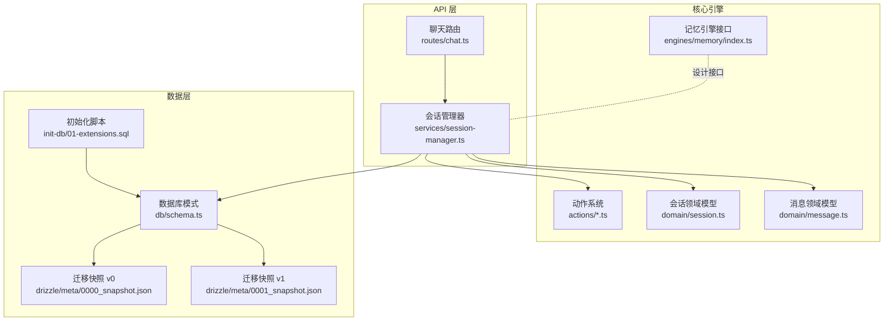
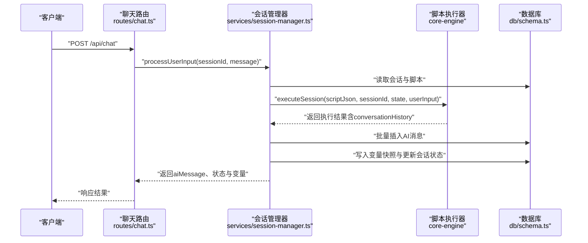
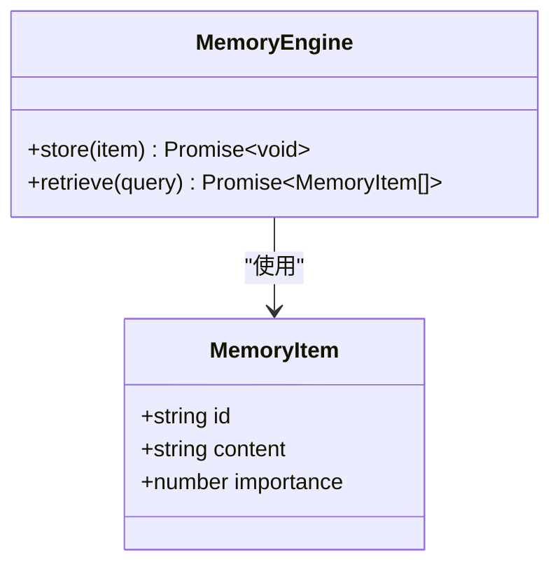
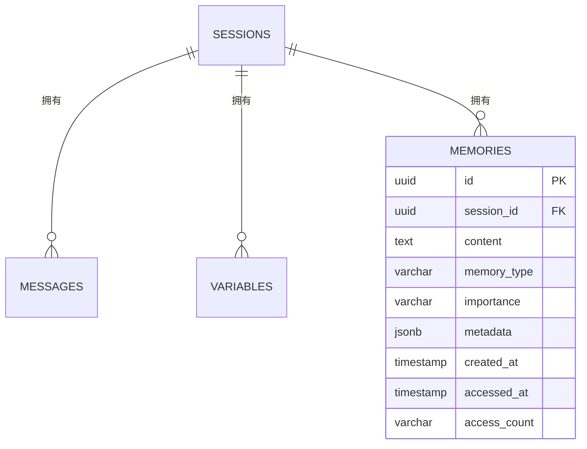
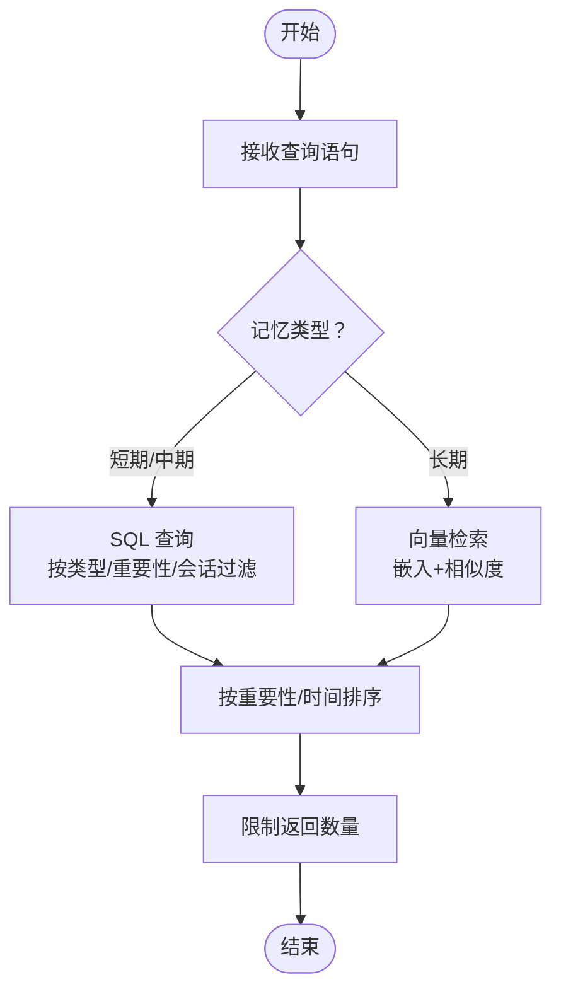
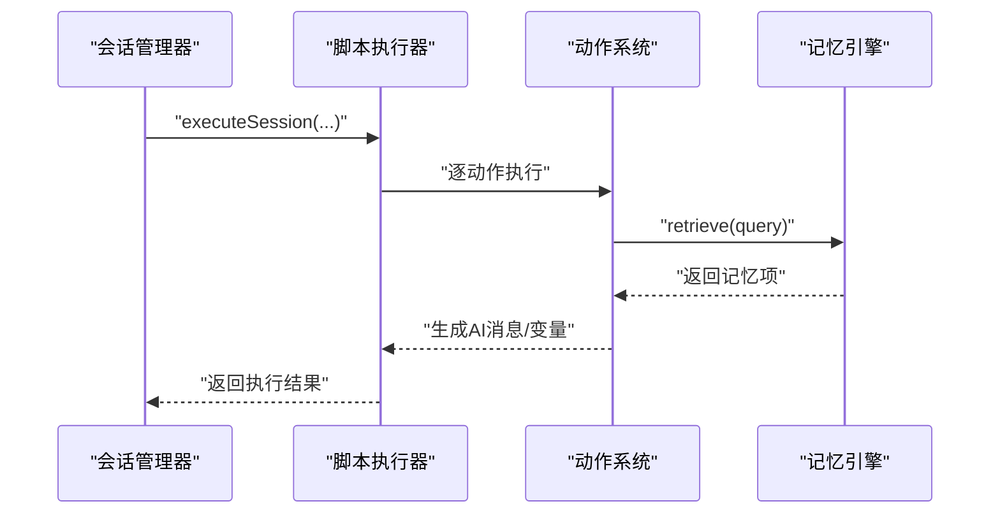
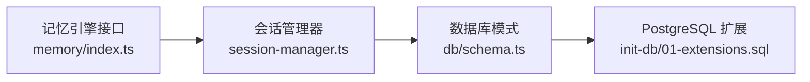

# 记忆引擎

<cite>
**本文引用的文件**
- [packages/core-engine/src/engines/memory/index.ts](file://packages/core-engine/src/engines/memory/index.ts)
- [packages/api-server/src/db/schema.ts](file://packages/api-server/src/db/schema.ts)
- [packages/api-server/drizzle/meta/0000_snapshot.json](file://packages/api-server/drizzle/meta/0000_snapshot.json)
- [packages/api-server/drizzle/meta/0001_snapshot.json](file://packages/api-server/drizzle/meta/0001_snapshot.json)
- [scripts/init-db/01-extensions.sql](file://scripts/init-db/01-extensions.sql)
- [packages/api-server/src/services/session-manager.ts](file://packages/api-server/src/services/session-manager.ts)
- [packages/api-server/src/routes/chat.ts](file://packages/api-server/src/routes/chat.ts)
- [packages/core-engine/src/domain/session.ts](file://packages/core-engine/src/domain/session.ts)
- [packages/core-engine/src/domain/message.ts](file://packages/core-engine/src/domain/message.ts)
- [packages/shared-types/src/domain/session.ts](file://packages/shared-types/src/domain/session.ts)
- [packages/shared-types/src/domain/message.ts](file://packages/shared-types/src/domain/message.ts)
- [packages/core-engine/src/actions/base-action.ts](file://packages/core-engine/src/actions/base-action.ts)
- [packages/core-engine/src/actions/action-registry.ts](file://packages/core-engine/src/actions/action-registry.ts)
- [packages/core-engine/src/actions/ai-ask-action.ts](file://packages/core-engine/src/actions/ai-ask-action.ts)
- [packages/core-engine/src/actions/ai-say-action.ts](file://packages/core-engine/src/actions/ai-say-action.ts)
</cite>

## 目录
1. [引言](#引言)
2. [项目结构](#项目结构)
3. [核心组件](#核心组件)
4. [架构总览](#架构总览)
5. [详细组件分析](#详细组件分析)
6. [依赖分析](#依赖分析)
7. [性能考虑](#性能考虑)
8. [故障排查指南](#故障排查指南)
9. [结论](#结论)
10. [附录](#附录)

## 引言
本技术文档围绕“记忆引擎”展开，系统阐述其设计理念、架构实现与扩展路径。当前仓库中记忆引擎处于占位阶段，核心接口已定义，数据库层已具备记忆表结构与索引设计，并在会话管理流程中预留了与记忆系统的协作点。本文将：
- 解释短期记忆、中期记忆与长期记忆的区分机制与落地策略
- 描述记忆数据的结构化存储方案（消息历史、会话状态、用户偏好）
- 给出检索与相似度匹配的实现建议
- 提供扩展接口与自定义存储后端的实现指南
- 总结隐私与安全存储策略
- 说明与核心引擎、API 层的协作关系与数据交换机制

## 项目结构
记忆引擎涉及的核心模块分布于以下位置：
- 记忆引擎接口与占位实现：packages/core-engine/src/engines/memory/index.ts
- 数据库模式与迁移快照：packages/api-server/src/db/schema.ts、packages/api-server/drizzle/meta/*.json
- 初始化脚本（PostgreSQL 扩展）：scripts/init-db/01-extensions.sql
- 会话管理与脚本执行：packages/api-server/src/services/session-manager.ts
- 聊天路由入口：packages/api-server/src/routes/chat.ts
- 领域模型（会话、消息）：packages/core-engine/src/domain/*.ts 与 shared-types 对应定义
- 动作系统（AI 问答、AI 陈述等）：packages/core-engine/src/actions/*.ts

图表来源
- [packages/api-server/src/routes/chat.ts](file://packages/api-server/src/routes/chat.ts#L15-L151)
- [packages/api-server/src/services/session-manager.ts](file://packages/api-server/src/services/session-manager.ts#L21-L465)
- [packages/core-engine/src/engines/memory/index.ts](file://packages/core-engine/src/engines/memory/index.ts#L1-L26)
- [packages/api-server/src/db/schema.ts](file://packages/api-server/src/db/schema.ts#L178-L198)
- [packages/api-server/drizzle/meta/0000_snapshot.json](file://packages/api-server/drizzle/meta/0000_snapshot.json#L7-L99)
- [packages/api-server/drizzle/meta/0001_snapshot.json](file://packages/api-server/drizzle/meta/0001_snapshot.json#L7-L52)
- [scripts/init-db/01-extensions.sql](file://scripts/init-db/01-extensions.sql#L1-L16)

章节来源
- [packages/api-server/src/routes/chat.ts](file://packages/api-server/src/routes/chat.ts#L15-L151)
- [packages/api-server/src/services/session-manager.ts](file://packages/api-server/src/services/session-manager.ts#L21-L465)
- [packages/core-engine/src/engines/memory/index.ts](file://packages/core-engine/src/engines/memory/index.ts#L1-L26)
- [packages/api-server/src/db/schema.ts](file://packages/api-server/src/db/schema.ts#L178-L198)
- [scripts/init-db/01-extensions.sql](file://scripts/init-db/01-extensions.sql#L1-L16)

## 核心组件
- 记忆引擎接口与占位实现
  - 定义 MemoryItem 结构与 MemoryEngine 的 store/retrieve 方法，作为后续 Redis/PostgreSQL/向量检索的统一抽象。
- 数据库模式与索引
  - 记忆表包含内容、类型、重要性、会话关联、元数据、访问时间与计数等字段；具备会话索引、类型索引、重要性索引，便于检索与统计。
- 会话管理器
  - 在会话初始化与处理用户输入过程中，负责持久化消息、变量快照与会话状态；为记忆引擎留出扩展点（如检索与回填）。
- 领域模型
  - Session 与 Message 提供会话状态、执行位置、变量、元数据与消息内容等结构，支撑记忆数据的组织与查询。

章节来源
- [packages/core-engine/src/engines/memory/index.ts](file://packages/core-engine/src/engines/memory/index.ts#L10-L25)
- [packages/api-server/src/db/schema.ts](file://packages/api-server/src/db/schema.ts#L178-L198)
- [packages/api-server/src/services/session-manager.ts](file://packages/api-server/src/services/session-manager.ts#L73-L255)
- [packages/core-engine/src/domain/session.ts](file://packages/core-engine/src/domain/session.ts#L7-L44)
- [packages/core-engine/src/domain/message.ts](file://packages/core-engine/src/domain/message.ts#L7-L32)

## 架构总览
记忆引擎的总体架构分为三层：
- 应用层（API 路由）：接收聊天请求，调用会话管理器处理用户输入与脚本执行。
- 核心层（会话管理器与动作系统）：驱动脚本执行，维护会话状态与变量快照，生成消息历史。
- 数据层（PostgreSQL）：以 Drizzle ORM 管理会话、消息、变量与记忆表，支持索引与扩展。

图表来源
- [packages/api-server/src/routes/chat.ts](file://packages/api-server/src/routes/chat.ts#L44-L78)
- [packages/api-server/src/services/session-manager.ts](file://packages/api-server/src/services/session-manager.ts#L260-L440)
- [packages/api-server/src/db/schema.ts](file://packages/api-server/src/db/schema.ts#L45-L58)

## 详细组件分析

### 记忆引擎接口与扩展点
- 接口职责
  - 存储：将 MemoryItem 写入短期/中期/长期存储后端
  - 检索：根据查询语句返回相关记忆项列表
- 设计要点
  - MemoryItem 包含唯一标识、内容、重要性评分，便于后续排序与过滤
  - MemoryEngine 采用异步方法，便于对接 Redis、PostgreSQL 或向量数据库
- 扩展建议
  - 短期记忆：使用 Redis，键空间按 sessionId 命名，带 TTL 与 LRU
  - 中期记忆：使用 PostgreSQL，按会话维度分表或分区，利用索引加速
  - 长期记忆：引入向量检索（pgvector），对内容向量化，支持语义相似度检索

图表来源
- [packages/core-engine/src/engines/memory/index.ts](file://packages/core-engine/src/engines/memory/index.ts#L10-L25)

章节来源
- [packages/core-engine/src/engines/memory/index.ts](file://packages/core-engine/src/engines/memory/index.ts#L1-L26)

### 数据模型与存储策略
- 记忆表结构
  - 字段：id、sessionId、content、memoryType、importance、metadata、createdAt、accessedAt、accessCount
  - 索引：sessionId、memoryType、importance，支持按会话检索、类型过滤与重要性排序
  - 外键：sessionId 关联 sessions 表，删除会话时级联删除记忆
- 存储策略
  - 短期记忆：高频访问、低延迟场景，推荐 Redis Hash/Stream
  - 中期记忆：结构化查询与统计，推荐 PostgreSQL 表，配合 JSONB 元数据
  - 长期记忆：语义检索与相似度匹配，推荐向量检索（pgvector），结合文本嵌入
- 生命周期管理
  - 访问计数与最近访问时间可用于淘汰策略
  - 重要性字段支持优先保留与排序

图表来源
- [packages/api-server/src/db/schema.ts](file://packages/api-server/src/db/schema.ts#L181-L198)
- [packages/api-server/drizzle/meta/0000_snapshot.json](file://packages/api-server/drizzle/meta/0000_snapshot.json#L7-L99)

章节来源
- [packages/api-server/src/db/schema.ts](file://packages/api-server/src/db/schema.ts#L178-L198)
- [packages/api-server/drizzle/meta/0000_snapshot.json](file://packages/api-server/drizzle/meta/0000_snapshot.json#L7-L99)
- [packages/api-server/drizzle/meta/0001_snapshot.json](file://packages/api-server/drizzle/meta/0001_snapshot.json#L7-L52)

### 访问模式与生命周期管理
- 访问模式
  - 会话初始化与每次用户输入后，会话管理器将 AI 生成的消息批量写入消息表，同时可触发记忆写入
  - 检索可在用户输入前进行，将相关记忆注入上下文
- 生命周期
  - 创建：首次生成消息或变量变更时写入
  - 访问：每次检索更新 accessedAt 与 accessCount
  - 淘汰：基于 importance、accessCount 与 TTL 的策略

章节来源
- [packages/api-server/src/services/session-manager.ts](file://packages/api-server/src/services/session-manager.ts#L164-L218)
- [packages/api-server/src/services/session-manager.ts](file://packages/api-server/src/services/session-manager.ts#L368-L421)

### 检索算法与相似度匹配
- 短期/中期检索
  - 基于关键词与元数据过滤，按 importance 降序
  - 支持按 sessionId 限定范围
- 长期检索（向量）
  - 将 content 向量化，计算余弦相似度或内积
  - 可结合 metadata 过滤与权重融合
- 建议流程

图表来源
- [packages/core-engine/src/engines/memory/index.ts](file://packages/core-engine/src/engines/memory/index.ts#L21-L24)
- [packages/api-server/src/db/schema.ts](file://packages/api-server/src/db/schema.ts#L181-L198)

### 与核心引擎的协作关系
- 会话管理器在执行脚本前后，将 conversationHistory 中的 AI 消息持久化，为记忆系统提供“内容来源”
- 动作系统（如 AiAskAction、AiSayAction）通过 ActionContext 传递上下文，记忆检索结果可注入到上下文中，增强提示词与个性化

图表来源
- [packages/api-server/src/services/session-manager.ts](file://packages/api-server/src/services/session-manager.ts#L352-L358)
- [packages/core-engine/src/actions/ai-ask-action.ts](file://packages/core-engine/src/actions/ai-ask-action.ts#L27-L78)
- [packages/core-engine/src/actions/ai-say-action.ts](file://packages/core-engine/src/actions/ai-say-action.ts#L19-L66)
- [packages/core-engine/src/engines/memory/index.ts](file://packages/core-engine/src/engines/memory/index.ts#L21-L24)

章节来源
- [packages/api-server/src/services/session-manager.ts](file://packages/api-server/src/services/session-manager.ts#L328-L358)
- [packages/core-engine/src/actions/ai-ask-action.ts](file://packages/core-engine/src/actions/ai-ask-action.ts#L27-L78)
- [packages/core-engine/src/actions/ai-say-action.ts](file://packages/core-engine/src/actions/ai-say-action.ts#L19-L66)

### 扩展接口与自定义存储后端实现指南
- 接口扩展
  - 在 MemoryEngine 上增加方法：如按会话检索、按类型聚合、按重要性阈值过滤
- Redis 后端
  - 使用 Hash 存储 content/importance/metadata；使用 Sorted Set 维护 importance 排序；使用 Stream 记录访问事件
- PostgreSQL 后端
  - 使用 JSONB 存储元数据；利用 GIN/BRIN 索引优化检索；支持复杂查询与审计
- 向量后端（pgvector）
  - 使用初始化脚本启用扩展；对 content 建立向量索引；实现相似度查询与混合检索

章节来源
- [packages/core-engine/src/engines/memory/index.ts](file://packages/core-engine/src/engines/memory/index.ts#L16-L25)
- [scripts/init-db/01-extensions.sql](file://scripts/init-db/01-extensions.sql#L10-L14)

### 隐私与安全存储策略
- 数据最小化：仅存储必要记忆内容与元数据
- 加密与脱敏：对敏感字段使用数据库加密或应用层脱敏
- 访问控制：API 层鉴权与会话隔离；数据库权限最小化
- 审计与追踪：记录 accessCount/accessedAt，支持合规审计

## 依赖分析
- 组件耦合
  - 会话管理器依赖数据库模式与 Drizzle ORM
  - 记忆引擎与会话管理器松耦合，通过接口抽象连接
- 外部依赖
  - PostgreSQL 扩展（uuid-ossp、pgcrypto、pg_trgm、可选 pgvector）
  - Drizzle ORM 用于类型安全的数据库操作

图表来源
- [packages/core-engine/src/engines/memory/index.ts](file://packages/core-engine/src/engines/memory/index.ts#L1-L26)
- [packages/api-server/src/services/session-manager.ts](file://packages/api-server/src/services/session-manager.ts#L21-L465)
- [packages/api-server/src/db/schema.ts](file://packages/api-server/src/db/schema.ts#L1-L219)
- [scripts/init-db/01-extensions.sql](file://scripts/init-db/01-extensions.sql#L1-L16)

章节来源
- [packages/api-server/src/db/schema.ts](file://packages/api-server/src/db/schema.ts#L1-L219)
- [scripts/init-db/01-extensions.sql](file://scripts/init-db/01-extensions.sql#L1-L16)

## 性能考虑
- 短期记忆（Redis）
  - 适合高并发、低延迟场景；注意内存容量与淘汰策略
- 中期记忆（PostgreSQL）
  - 利用索引与分区；批量写入与事务合并
- 长期记忆（向量检索）
  - 向量化成本与索引维护；相似度阈值与 TopK 控制
- 缓存与预热
  - 将热点会话的记忆预加载至 Redis；定期清理过期与低价值记忆

## 故障排查指南
- 记忆检索无结果
  - 检查 memoryType 与 importance 是否正确设置；确认索引是否存在
- 写入失败
  - 核对 sessionId 是否有效；检查外键约束与迁移快照一致性
- 性能问题
  - 分析慢查询日志；评估索引覆盖与查询计划；必要时引入向量检索

章节来源
- [packages/api-server/drizzle/meta/0000_snapshot.json](file://packages/api-server/drizzle/meta/0000_snapshot.json#L71-L99)
- [packages/api-server/drizzle/meta/0001_snapshot.json](file://packages/api-server/drizzle/meta/0001_snapshot.json#L71-L52)

## 结论
记忆引擎在当前仓库中已完成接口设计与数据库层准备，后续可通过 Redis、PostgreSQL 与向量检索三类后端实现短期、中期与长期记忆能力。结合会话管理器与动作系统，记忆系统将为对话提供上下文增强与个性化体验。建议优先实现短期与中期记忆，再逐步引入长期记忆与相似度检索，确保性能与可用性的平衡。

## 附录
- 会话与消息领域模型
  - 会话模型包含状态、执行状态、执行位置、变量与元数据
  - 消息模型包含角色、内容、动作标识与时间戳
- 动作系统
  - AiAskAction/AiSayAction 等动作在执行过程中产生消息与变量，为记忆系统提供素材

章节来源
- [packages/core-engine/src/domain/session.ts](file://packages/core-engine/src/domain/session.ts#L7-L136)
- [packages/core-engine/src/domain/message.ts](file://packages/core-engine/src/domain/message.ts#L7-L48)
- [packages/shared-types/src/domain/session.ts](file://packages/shared-types/src/domain/session.ts#L40-L69)
- [packages/shared-types/src/domain/message.ts](file://packages/shared-types/src/domain/message.ts#L8-L29)
- [packages/core-engine/src/actions/ai-ask-action.ts](file://packages/core-engine/src/actions/ai-ask-action.ts#L27-L167)
- [packages/core-engine/src/actions/ai-say-action.ts](file://packages/core-engine/src/actions/ai-say-action.ts#L19-L103)