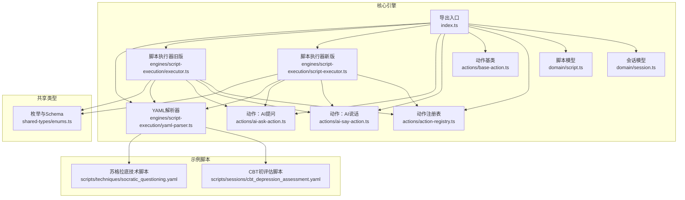
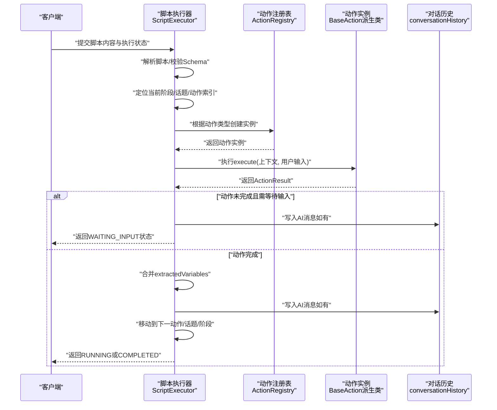
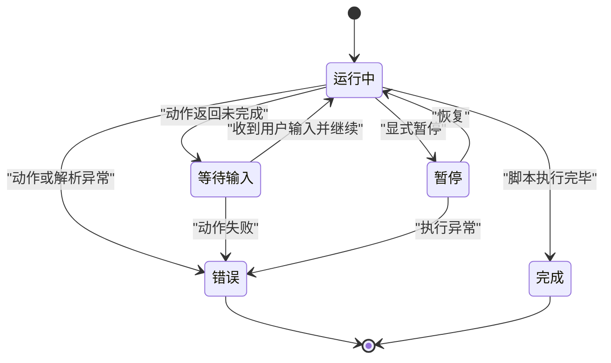
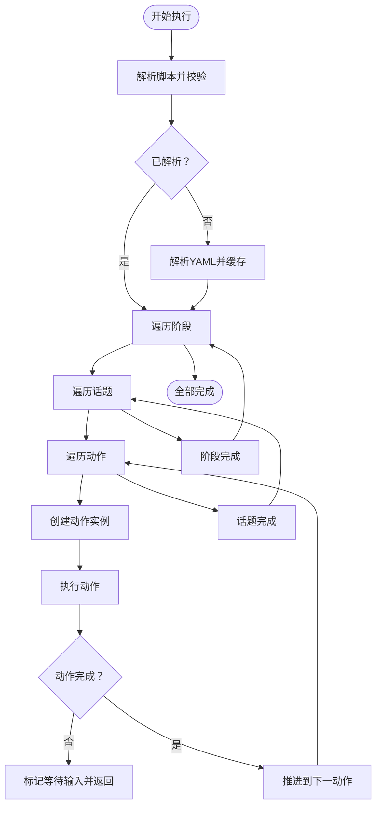
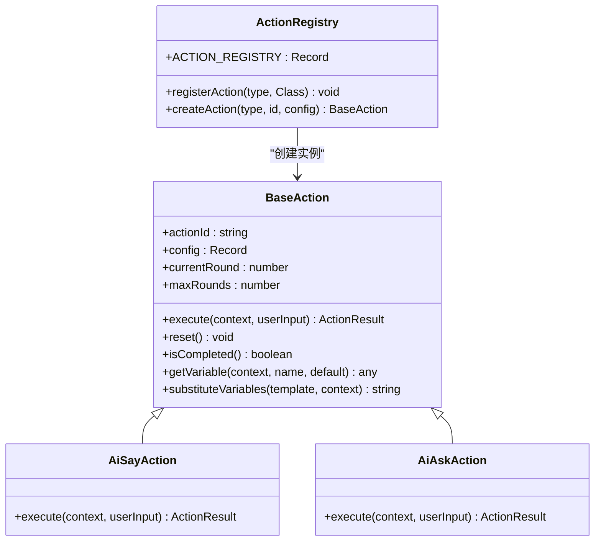
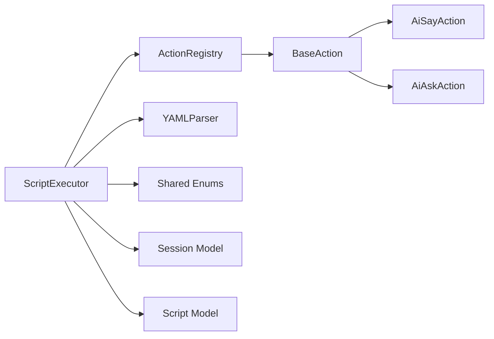

# 话题调度引擎

<cite>
**本文引用的文件**
- [packages/core-engine/src/index.ts](file://packages/core-engine/src/index.ts)
- [packages/core-engine/src/domain/session.ts](file://packages/core-engine/src/domain/session.ts)
- [packages/core-engine/src/domain/script.ts](file://packages/core-engine/src/domain/script.ts)
- [packages/core-engine/src/actions/action-registry.ts](file://packages/core-engine/src/actions/action-registry.ts)
- [packages/core-engine/src/actions/base-action.ts](file://packages/core-engine/src/actions/base-action.ts)
- [packages/core-engine/src/actions/ai-say-action.ts](file://packages/core-engine/src/actions/ai-say-action.ts)
- [packages/core-engine/src/actions/ai-ask-action.ts](file://packages/core-engine/src/actions/ai-ask-action.ts)
- [packages/core-engine/src/engines/script-execution/script-executor.ts](file://packages/core-engine/src/engines/script-execution/script-executor.ts)
- [packages/core-engine/src/engines/script-execution/executor.ts](file://packages/core-engine/src/engines/script-execution/executor.ts)
- [packages/core-engine/src/engines/script-execution/yaml-parser.ts](file://packages/core-engine/src/engines/script-execution/yaml-parser.ts)
- [packages/shared-types/src/enums.ts](file://packages/shared-types/src/enums.ts)
- [scripts/sessions/cbt_depression_assessment.yaml](file://scripts/sessions/cbt_depression_assessment.yaml)
- [scripts/techniques/socratic_questioning.yaml](file://scripts/techniques/socratic_questioning.yaml)
- [docs/design/SEQUENCE_DIAGRAMS.md](file://docs/design/SEQUENCE_DIAGRAMS.md)
</cite>

## 目录
1. [引言](#引言)
2. [项目结构](#项目结构)
3. [核心组件](#核心组件)
4. [架构总览](#架构总览)
5. [详细组件分析](#详细组件分析)
6. [依赖分析](#依赖分析)
7. [性能考虑](#性能考虑)
8. [故障排查指南](#故障排查指南)
9. [结论](#结论)
10. [附录](#附录)

## 引言
本文件面向“话题调度引擎”的设计与实现，系统性阐述会话脚本的执行流程、话题与动作的编排机制、状态管理与持久化、以及可扩展的Action体系。文档同时给出基于现有代码的算法原理、执行序列与决策流程，并提供配置项与自定义规则的实践路径，以及性能与效果评估建议。

## 项目结构
核心引擎位于 packages/core-engine，围绕“脚本-阶段-话题-动作”四层结构组织，配合共享类型与示例脚本，形成完整的会话调度闭环。

图表来源
- [packages/core-engine/src/index.ts](file://packages/core-engine/src/index.ts#L1-L27)
- [packages/core-engine/src/domain/session.ts](file://packages/core-engine/src/domain/session.ts#L1-L137)
- [packages/core-engine/src/domain/script.ts](file://packages/core-engine/src/domain/script.ts#L1-L95)
- [packages/core-engine/src/actions/action-registry.ts](file://packages/core-engine/src/actions/action-registry.ts#L1-L46)
- [packages/core-engine/src/actions/base-action.ts](file://packages/core-engine/src/actions/base-action.ts#L1-L99)
- [packages/core-engine/src/actions/ai-say-action.ts](file://packages/core-engine/src/actions/ai-say-action.ts#L1-L105)
- [packages/core-engine/src/actions/ai-ask-action.ts](file://packages/core-engine/src/actions/ai-ask-action.ts#L1-L207)
- [packages/core-engine/src/engines/script-execution/script-executor.ts](file://packages/core-engine/src/engines/script-execution/script-executor.ts#L1-L519)
- [packages/core-engine/src/engines/script-execution/executor.ts](file://packages/core-engine/src/engines/script-execution/executor.ts#L1-L298)
- [packages/core-engine/src/engines/script-execution/yaml-parser.ts](file://packages/core-engine/src/engines/script-execution/yaml-parser.ts#L1-L96)
- [packages/shared-types/src/enums.ts](file://packages/shared-types/src/enums.ts#L1-L118)
- [scripts/sessions/cbt_depression_assessment.yaml](file://scripts/sessions/cbt_depression_assessment.yaml#L1-L166)
- [scripts/techniques/socratic_questioning.yaml](file://scripts/techniques/socratic_questioning.yaml#L1-L110)

章节来源
- [packages/core-engine/src/index.ts](file://packages/core-engine/src/index.ts#L1-L27)
- [packages/core-engine/src/domain/session.ts](file://packages/core-engine/src/domain/session.ts#L1-L137)
- [packages/core-engine/src/domain/script.ts](file://packages/core-engine/src/domain/script.ts#L1-L95)
- [packages/core-engine/src/actions/action-registry.ts](file://packages/core-engine/src/actions/action-registry.ts#L1-L46)
- [packages/core-engine/src/actions/base-action.ts](file://packages/core-engine/src/actions/base-action.ts#L1-L99)
- [packages/core-engine/src/actions/ai-say-action.ts](file://packages/core-engine/src/actions/ai-say-action.ts#L1-L105)
- [packages/core-engine/src/actions/ai-ask-action.ts](file://packages/core-engine/src/actions/ai-ask-action.ts#L1-L207)
- [packages/core-engine/src/engines/script-execution/script-executor.ts](file://packages/core-engine/src/engines/script-execution/script-executor.ts#L1-L519)
- [packages/core-engine/src/engines/script-execution/executor.ts](file://packages/core-engine/src/engines/script-execution/executor.ts#L1-L298)
- [packages/core-engine/src/engines/script-execution/yaml-parser.ts](file://packages/core-engine/src/engines/script-execution/yaml-parser.ts#L1-L96)
- [packages/shared-types/src/enums.ts](file://packages/shared-types/src/enums.ts#L1-L118)
- [scripts/sessions/cbt_depression_assessment.yaml](file://scripts/sessions/cbt_depression_assessment.yaml#L1-L166)
- [scripts/techniques/socratic_questioning.yaml](file://scripts/techniques/socratic_questioning.yaml#L1-L110)

## 核心组件
- 会话模型（Session）：承载会话状态、执行状态、执行位置、变量与元数据，提供启动、暂停、恢复、完成、失败等状态转换。
- 脚本模型（Script）：封装脚本元数据、版本、状态与解析内容，支持发布与归档。
- 动作注册表（Action Registry）：集中管理动作类型到构造函数的映射，提供创建动作实例的能力。
- 动作基类（BaseAction）：统一动作接口、上下文与结果结构，提供变量替换、轮次控制与状态重置能力。
- AI说话/提问动作：分别实现“单轮/多轮确认”和“问答+校验+变量抽取”的典型交互。
- 脚本执行器（ScriptExecutor）：按“阶段-话题-动作”顺序驱动执行，处理等待输入、错误、变量与对话历史更新，支持动作状态持久化。
- YAML解析器（YAMLParser）：负责脚本解析与Schema校验，确保脚本结构符合约定。
- 共享类型（Enums）：统一状态、脚本类型、动作类型、错误码等枚举与Zod Schema。

章节来源
- [packages/core-engine/src/domain/session.ts](file://packages/core-engine/src/domain/session.ts#L1-L137)
- [packages/core-engine/src/domain/script.ts](file://packages/core-engine/src/domain/script.ts#L1-L95)
- [packages/core-engine/src/actions/action-registry.ts](file://packages/core-engine/src/actions/action-registry.ts#L1-L46)
- [packages/core-engine/src/actions/base-action.ts](file://packages/core-engine/src/actions/base-action.ts#L1-L99)
- [packages/core-engine/src/actions/ai-say-action.ts](file://packages/core-engine/src/actions/ai-say-action.ts#L1-L105)
- [packages/core-engine/src/actions/ai-ask-action.ts](file://packages/core-engine/src/actions/ai-ask-action.ts#L1-L207)
- [packages/core-engine/src/engines/script-execution/script-executor.ts](file://packages/core-engine/src/engines/script-execution/script-executor.ts#L1-L519)
- [packages/core-engine/src/engines/script-execution/yaml-parser.ts](file://packages/core-engine/src/engines/script-execution/yaml-parser.ts#L1-L96)
- [packages/shared-types/src/enums.ts](file://packages/shared-types/src/enums.ts#L1-L118)

## 架构总览
下图展示了从脚本到动作的执行链路，以及状态在各层之间的传递与持久化。

图表来源
- [packages/core-engine/src/engines/script-execution/script-executor.ts](file://packages/core-engine/src/engines/script-execution/script-executor.ts#L66-L216)
- [packages/core-engine/src/actions/action-registry.ts](file://packages/core-engine/src/actions/action-registry.ts#L35-L45)
- [packages/core-engine/src/actions/base-action.ts](file://packages/core-engine/src/actions/base-action.ts#L57-L60)

## 详细组件分析

### 会话状态管理与转换
- 状态枚举：ACTIVE、PAUSED、COMPLETED、FAILED；执行状态：RUNNING、WAITING_INPUT、PAUSED、COMPLETED、ERROR。
- 会话模型提供启动、暂停、恢复、完成、失败等方法，自动维护updatedAt与completedAt。
- 执行位置（ExecutionPosition）由阶段、话题、动作索引组成，用于断点续跑与可视化定位。

图表来源
- [packages/shared-types/src/enums.ts](file://packages/shared-types/src/enums.ts#L6-L22)
- [packages/core-engine/src/domain/session.ts](file://packages/core-engine/src/domain/session.ts#L49-L93)

章节来源
- [packages/shared-types/src/enums.ts](file://packages/shared-types/src/enums.ts#L1-L118)
- [packages/core-engine/src/domain/session.ts](file://packages/core-engine/src/domain/session.ts#L1-L137)

### 脚本与话题/动作的绑定与执行顺序
- 脚本结构：session → phases → topics → actions，每层均具备唯一标识与有序列表。
- 执行顺序：按阶段→话题→动作逐层推进；若某动作返回未完成，则在等待输入后恢复执行。
- YAML解析器提供Schema校验，确保结构一致性。

图表来源
- [packages/core-engine/src/engines/script-execution/script-executor.ts](file://packages/core-engine/src/engines/script-execution/script-executor.ts#L66-L216)
- [packages/core-engine/src/engines/script-execution/yaml-parser.ts](file://packages/core-engine/src/engines/script-execution/yaml-parser.ts#L34-L67)

章节来源
- [packages/core-engine/src/engines/script-execution/script-executor.ts](file://packages/core-engine/src/engines/script-execution/script-executor.ts#L1-L519)
- [packages/core-engine/src/engines/script-execution/yaml-parser.ts](file://packages/core-engine/src/engines/script-execution/yaml-parser.ts#L1-L96)

### 动作基类与Action体系
- 动作基类定义统一上下文（包含会话ID、阶段ID、话题ID、动作ID、变量、历史、元数据）与结果（成功/完成/消息/变量/错误/调试信息）。
- 动作支持多轮执行（currentRound/maxRounds），并提供变量模板替换能力。
- 注册表负责动作类型到构造函数的映射，便于扩展新动作类型。

图表来源
- [packages/core-engine/src/actions/base-action.ts](file://packages/core-engine/src/actions/base-action.ts#L9-L99)
- [packages/core-engine/src/actions/ai-say-action.ts](file://packages/core-engine/src/actions/ai-say-action.ts#L16-L105)
- [packages/core-engine/src/actions/ai-ask-action.ts](file://packages/core-engine/src/actions/ai-ask-action.ts#L19-L207)
- [packages/core-engine/src/actions/action-registry.ts](file://packages/core-engine/src/actions/action-registry.ts#L17-L45)

章节来源
- [packages/core-engine/src/actions/base-action.ts](file://packages/core-engine/src/actions/base-action.ts#L1-L99)
- [packages/core-engine/src/actions/ai-say-action.ts](file://packages/core-engine/src/actions/ai-say-action.ts#L1-L105)
- [packages/core-engine/src/actions/ai-ask-action.ts](file://packages/core-engine/src/actions/ai-ask-action.ts#L1-L207)
- [packages/core-engine/src/actions/action-registry.ts](file://packages/core-engine/src/actions/action-registry.ts#L1-L46)

### AI说话动作（AiSayAction）
- 行为特征：默认需要用户确认（require_acknowledgment=true），第一轮发送消息并等待确认，第二轮视为确认完成。
- 不需要确认时：立即完成并推进后续动作，消息仍写入对话历史。
- 结果包含动作类型、是否需要确认、等待事件等元数据，便于前端渲染与调试。

章节来源
- [packages/core-engine/src/actions/ai-say-action.ts](file://packages/core-engine/src/actions/ai-say-action.ts#L1-L105)

### AI提问动作（AiAskAction）
- 行为特征：第一轮发送问题，后续轮次接收用户输入并进行校验（必填、长度、正则）。
- 支持提取变量到执行状态的variables中，供后续动作使用。
- 校验失败时可返回重试提示与当前重试次数，达到最大重试次数后失败退出。

章节来源
- [packages/core-engine/src/actions/ai-ask-action.ts](file://packages/core-engine/src/actions/ai-ask-action.ts#L1-L207)

### 执行器与状态持久化
- 执行器在动作未完成时，将动作内部状态（如currentRound）序列化保存至metadata.actionState，以便断点续跑。
- 对话历史conversationHistory记录assistant与user的消息，便于回放与审计。
- 执行器在每个阶段/话题/动作完成后，预设置下一跳的ID，提升前端导航体验。

章节来源
- [packages/core-engine/src/engines/script-execution/script-executor.ts](file://packages/core-engine/src/engines/script-execution/script-executor.ts#L78-L158)
- [packages/core-engine/src/engines/script-execution/script-executor.ts](file://packages/core-engine/src/engines/script-execution/script-executor.ts#L323-L342)
- [packages/core-engine/src/engines/script-execution/script-executor.ts](file://packages/core-engine/src/engines/script-execution/script-executor.ts#L498-L517)

### 决策树与规则引擎实现
- 决策树体现在动作执行的分支：AiSay的确认流程、AiAsk的校验与重试流程、以及执行器对WAITING_INPUT的处理。
- 规则引擎体现为YAML脚本的Schema约束与动作配置（如max_rounds、validation、target_variable等），通过Zod进行运行时校验。
- 可扩展性：新增动作类型只需实现execute并注册到注册表，即可参与调度。

章节来源
- [packages/core-engine/src/actions/ai-say-action.ts](file://packages/core-engine/src/actions/ai-say-action.ts#L64-L95)
- [packages/core-engine/src/actions/ai-ask-action.ts](file://packages/core-engine/src/actions/ai-ask-action.ts#L82-L159)
- [packages/core-engine/src/engines/script-execution/yaml-parser.ts](file://packages/core-engine/src/engines/script-execution/yaml-parser.ts#L34-L67)
- [packages/core-engine/src/actions/action-registry.ts](file://packages/core-engine/src/actions/action-registry.ts#L28-L30)

### 配置选项与自定义规则
- 动作通用配置：max_rounds（轮次上限）、模板字段（content_template/prompt_template/question_template等）。
- AiAsk特有配置：target_variable（变量名）、validation（required/min_length/max_length/pattern）、retry_message、extraction_prompt。
- AiSay特有配置：require_acknowledgment（是否需要确认）、max_rounds。
- 自定义动作：实现BaseAction的execute方法，注册到ACTION_REGISTRY，即可在脚本中以action_type引用。

章节来源
- [packages/core-engine/src/actions/ai-ask-action.ts](file://packages/core-engine/src/actions/ai-ask-action.ts#L22-L61)
- [packages/core-engine/src/actions/ai-say-action.ts](file://packages/core-engine/src/actions/ai-say-action.ts#L21-L38)
- [packages/core-engine/src/actions/action-registry.ts](file://packages/core-engine/src/actions/action-registry.ts#L28-L30)

### 实际应用场景与案例分析
- CBT抑郁症初次评估：包含建立关系、问题评估、总结与计划三个阶段，话题内串联AI说话、提问与思考动作，形成完整的咨询流程。
- 苏格拉底式提问技术：以主题形式提供可复用的认知重构流程，强调证据收集与替代性想法生成。

章节来源
- [scripts/sessions/cbt_depression_assessment.yaml](file://scripts/sessions/cbt_depression_assessment.yaml#L1-L166)
- [scripts/techniques/socratic_questioning.yaml](file://scripts/techniques/socratic_questioning.yaml#L1-L110)

## 依赖分析
- 执行器依赖动作注册表与动作实现，通过注册表创建具体动作实例。
- 执行器依赖YAML解析器进行脚本解析与校验。
- 执行器与共享类型（枚举与Schema）耦合，保证状态与类型的一致性。
- 会话与脚本模型作为数据载体，贯穿执行器与动作。

图表来源
- [packages/core-engine/src/engines/script-execution/script-executor.ts](file://packages/core-engine/src/engines/script-execution/script-executor.ts#L1-L519)
- [packages/core-engine/src/actions/action-registry.ts](file://packages/core-engine/src/actions/action-registry.ts#L1-L46)
- [packages/core-engine/src/actions/base-action.ts](file://packages/core-engine/src/actions/base-action.ts#L1-L99)
- [packages/core-engine/src/actions/ai-say-action.ts](file://packages/core-engine/src/actions/ai-say-action.ts#L1-L105)
- [packages/core-engine/src/actions/ai-ask-action.ts](file://packages/core-engine/src/actions/ai-ask-action.ts#L1-L207)
- [packages/core-engine/src/engines/script-execution/yaml-parser.ts](file://packages/core-engine/src/engines/script-execution/yaml-parser.ts#L1-L96)
- [packages/shared-types/src/enums.ts](file://packages/shared-types/src/enums.ts#L1-L118)

章节来源
- [packages/core-engine/src/engines/script-execution/script-executor.ts](file://packages/core-engine/src/engines/script-execution/script-executor.ts#L1-L519)
- [packages/core-engine/src/actions/action-registry.ts](file://packages/core-engine/src/actions/action-registry.ts#L1-L46)
- [packages/core-engine/src/actions/base-action.ts](file://packages/core-engine/src/actions/base-action.ts#L1-L99)
- [packages/core-engine/src/actions/ai-say-action.ts](file://packages/core-engine/src/actions/ai-say-action.ts#L1-L105)
- [packages/core-engine/src/actions/ai-ask-action.ts](file://packages/core-engine/src/actions/ai-ask-action.ts#L1-L207)
- [packages/core-engine/src/engines/script-execution/yaml-parser.ts](file://packages/core-engine/src/engines/script-execution/yaml-parser.ts#L1-L96)
- [packages/shared-types/src/enums.ts](file://packages/shared-types/src/enums.ts#L1-L118)

## 性能考虑
- 执行器采用增量推进与断点续跑：仅在必要时解析脚本，动作未完成时序列化内部状态，减少重复计算。
- 对话历史与变量更新采用浅拷贝与合并策略，降低内存压力。
- 建议：对长会话启用持久化存储（如数据库）保存metadata.actionState，结合Redis缓存会话上下文，以支持高并发与快速恢复。
- 建议：对YAML解析与Schema校验进行缓存与版本化，避免重复解析同一脚本。

## 故障排查指南
- 等待输入状态（WAITING_INPUT）：检查动作是否返回completed=false且包含aiMessage；确认前端正确传递用户输入。
- 动作失败（ERROR）：查看metadata.error与lastAiMessage，定位具体动作与配置问题。
- 断点续跑：检查数据库中会话metadata.actionState是否正确保存与恢复。
- Schema校验失败：核对脚本结构与字段类型，参考YAML解析器的错误信息。
- 时序参考：可参考设计文档中的时序图与使用建议，定位执行链路问题。

章节来源
- [packages/core-engine/src/engines/script-execution/script-executor.ts](file://packages/core-engine/src/engines/script-execution/script-executor.ts#L129-L134)
- [packages/core-engine/src/engines/script-execution/script-executor.ts](file://packages/core-engine/src/engines/script-execution/script-executor.ts#L337-L342)
- [packages/core-engine/src/engines/script-execution/yaml-parser.ts](file://packages/core-engine/src/engines/script-execution/yaml-parser.ts#L34-L67)
- [docs/design/SEQUENCE_DIAGRAMS.md](file://docs/design/SEQUENCE_DIAGRAMS.md#L247-L253)

## 结论
本引擎以“脚本-阶段-话题-动作”为核心编排模型，通过动作注册表与统一基类实现可扩展的动作体系，借助执行器的断点续跑与状态持久化机制，支撑复杂咨询流程的稳定执行。结合YAML脚本与Schema校验，既保证了灵活性，又确保了结构一致性。建议在生产环境中完善监控与告警，结合会话指标（平均完成时间、等待输入比例、失败率）进行效果评估与优化。

## 附录
- 示例脚本：CBT初评估与苏格拉底技术脚本展示了不同阶段与话题的组合方式。
- 设计文档：时序图与使用建议提供了执行链路与扩展指引。

章节来源
- [scripts/sessions/cbt_depression_assessment.yaml](file://scripts/sessions/cbt_depression_assessment.yaml#L1-L166)
- [scripts/techniques/socratic_questioning.yaml](file://scripts/techniques/socratic_questioning.yaml#L1-L110)
- [docs/design/SEQUENCE_DIAGRAMS.md](file://docs/design/SEQUENCE_DIAGRAMS.md#L247-L253)