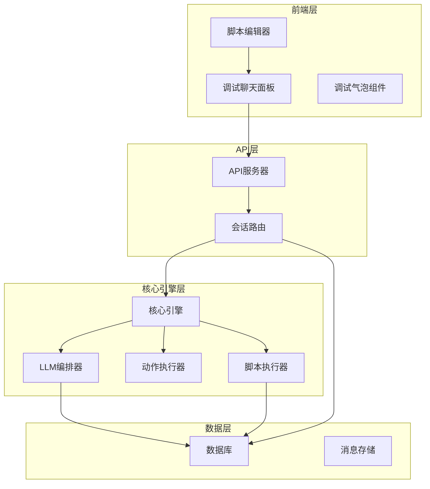
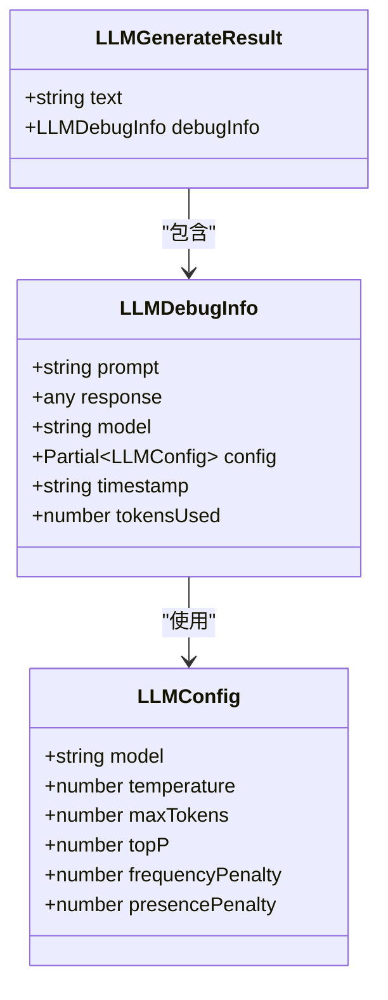
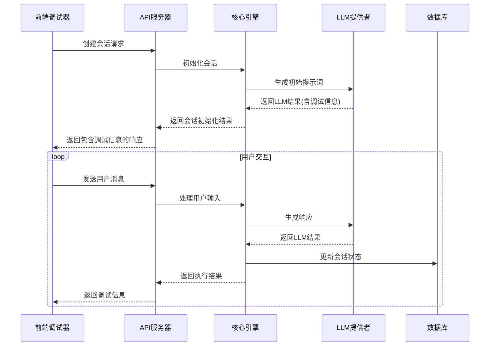
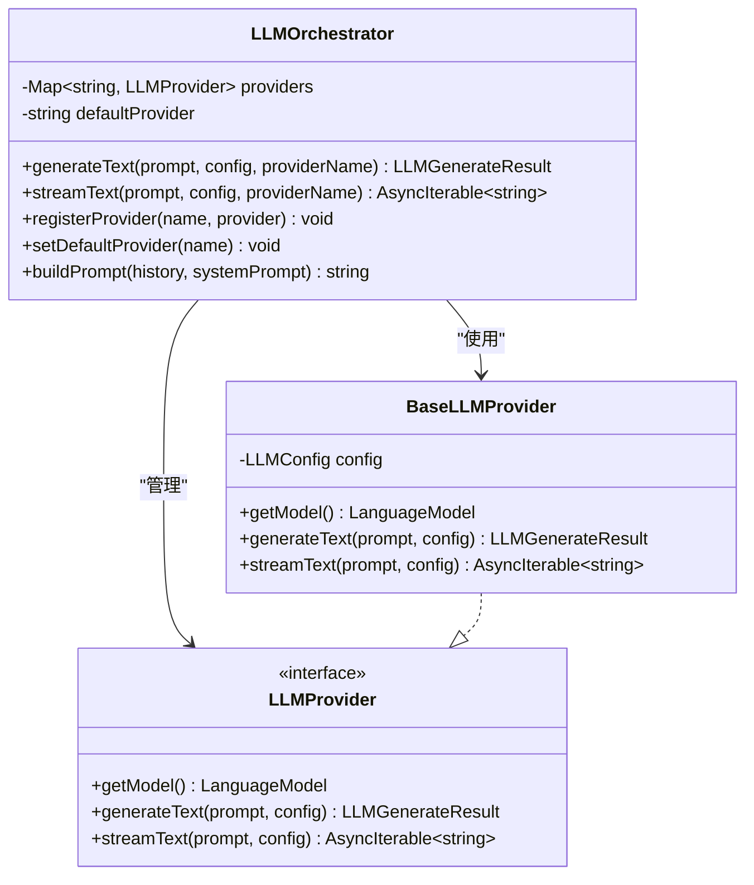
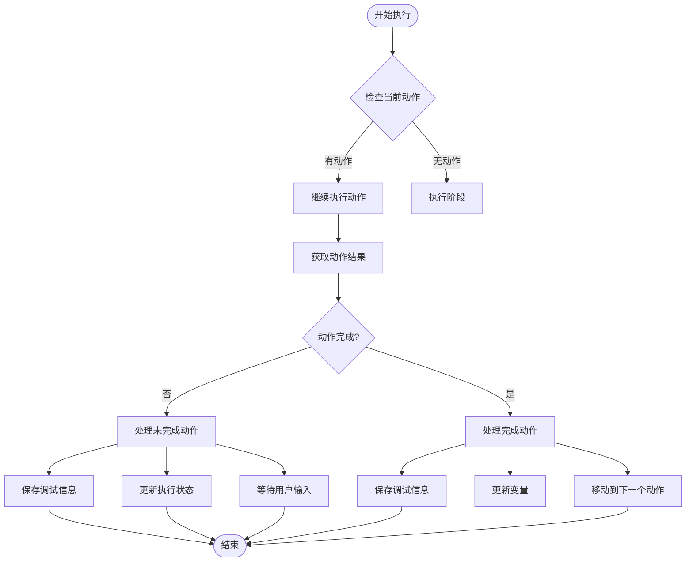
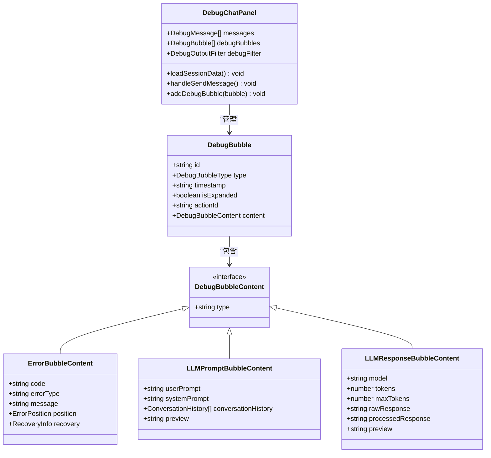
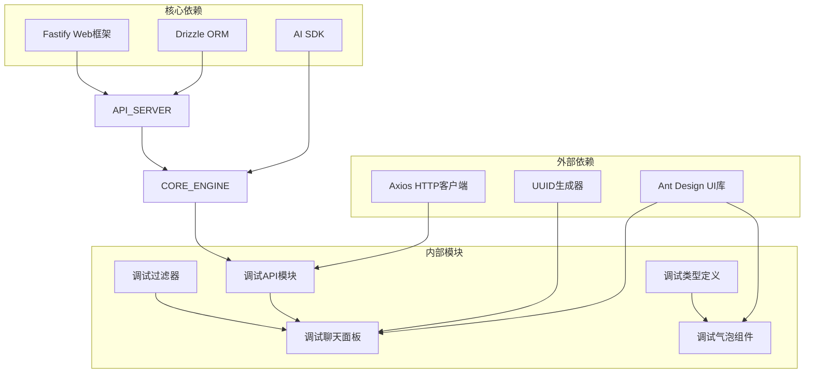

# 调试信息管道

<cite>
**本文档引用的文件**
- [packages/core-engine/docs/debug-info-pipeline.md](file://packages/core-engine/docs/debug-info-pipeline.md)
- [packages/core-engine/src/engines/llm-orchestration/orchestrator.ts](file://packages/core-engine/src/engines/llm-orchestration/orchestrator.ts)
- [packages/core-engine/src/actions/ai-ask-action.ts](file://packages/core-engine/src/actions/ai-ask-action.ts)
- [packages/core-engine/src/engines/script-execution/script-executor.ts](file://packages/core-engine/src/engines/script-execution/script-executor.ts)
- [packages/api-server/src/routes/sessions.ts](file://packages/api-server/src/routes/sessions.ts)
- [packages/script-editor/src/api/debug.ts](file://packages/script-editor/src/api/debug.ts)
- [packages/script-editor/src/types/debug.ts](file://packages/script-editor/src/types/debug.ts)
- [packages/script-editor/src/utils/debug-filter-storage.ts](file://packages/script-editor/src/utils/debug-filter-storage.ts)
- [packages/script-editor/src/components/DebugChatPanel/index.tsx](file://packages/script-editor/src/components/DebugChatPanel/index.tsx)
- [packages/script-editor/src/components/DebugBubbles/ErrorBubble.tsx](file://packages/script-editor/src/components/DebugBubbles/ErrorBubble.tsx)
- [packages/script-editor/src/components/DebugBubbles/LLMPromptBubble.tsx](file://packages/script-editor/src/components/DebugBubbles/LLMPromptBubble.tsx)
- [packages/script-editor/src/components/DebugBubbles/LLMResponseBubble.tsx](file://packages/script-editor/src/components/DebugBubbles/LLMResponseBubble.tsx)
- [packages/script-editor/src/components/DebugBubbles/VariableBubble.tsx](file://packages/script-editor/src/components/DebugBubbles/VariableBubble.tsx)
- [packages/script-editor/src/components/DebugBubbles/PositionBubble.tsx](file://packages/script-editor/src/components/DebugBubbles/PositionBubble.tsx)
</cite>

## 目录
1. [简介](#简介)
2. [项目结构](#项目结构)
3. [核心组件](#核心组件)
4. [架构概览](#架构概览)
5. [详细组件分析](#详细组件分析)
6. [依赖关系分析](#依赖关系分析)
7. [性能考虑](#性能考虑)
8. [故障排除指南](#故障排除指南)
9. [结论](#结论)

## 简介

调试信息管道是 HeartRule-Qcoder 项目中一个关键的调试基础设施，旨在为脚本编辑器提供统一的调试信息结构与传输路径。该管道确保在脚本执行过程中能够捕获、传递和展示 LLM 调用的完整上下文信息，包括提示词、响应、配置和令牌使用统计等。

该系统采用分层架构设计，从底层的 LLM 提供者到顶层的前端调试界面，每个层级都有明确的职责分工和数据传递规则。调试信息在整个管道中保持不变性，确保开发者能够准确追踪脚本执行过程中的每个环节。

## 项目结构

项目采用模块化架构，主要分为四个核心部分：

**图表来源**
- [packages/script-editor/src/components/DebugChatPanel/index.tsx](file://packages/script-editor/src/components/DebugChatPanel/index.tsx#L1-L800)
- [packages/api-server/src/routes/sessions.ts](file://packages/api-server/src/routes/sessions.ts#L1-L613)
- [packages/core-engine/src/engines/script-execution/script-executor.ts](file://packages/core-engine/src/engines/script-execution/script-executor.ts#L1-L800)

**章节来源**
- [packages/script-editor/src/components/DebugChatPanel/index.tsx](file://packages/script-editor/src/components/DebugChatPanel/index.tsx#L1-L800)
- [packages/api-server/src/routes/sessions.ts](file://packages/api-server/src/routes/sessions.ts#L1-L613)
- [packages/core-engine/src/engines/script-execution/script-executor.ts](file://packages/core-engine/src/engines/script-execution/script-executor.ts#L1-L800)

## 核心组件

### LLM 调试信息结构

调试信息管道的核心是统一的 LLMDebugInfo 结构，它定义了 LLM 调用的完整上下文信息：

**图表来源**
- [packages/core-engine/src/engines/llm-orchestration/orchestrator.ts](file://packages/core-engine/src/engines/llm-orchestration/orchestrator.ts#L7-L22)
- [packages/core-engine/src/engines/llm-orchestration/orchestrator.ts](file://packages/core-engine/src/engines/llm-orchestration/orchestrator.ts#L27-L34)

### 动作执行结果

每个动作执行都会产生 ActionResult，其中包含调试信息：

| 字段名 | 类型 | 描述 | 必需性 |
|--------|------|------|--------|
| success | boolean | 执行是否成功 | 是 |
| completed | boolean | 动作是否完成 | 是 |
| aiMessage | string \| null | AI生成的消息 | 否 |
| extractedVariables | Record<string, any> \| null | 提取的变量 | 否 |
| nextAction | string \| null | 下一个动作 | 否 |
| error | string \| null | 错误信息 | 否 |
| metadata | Record<string, any> | 元数据 | 否 |
| debugInfo | LLMDebugInfo \| undefined | LLM调试信息 | 否 |

**章节来源**
- [packages/core-engine/src/engines/llm-orchestration/orchestrator.ts](file://packages/core-engine/src/engines/llm-orchestration/orchestrator.ts#L7-L22)
- [packages/core-engine/src/actions/ai-ask-action.ts](file://packages/core-engine/src/actions/ai-ask-action.ts#L290-L340)

## 架构概览

调试信息管道遵循严格的分层架构设计，确保数据在各个组件间的正确传递：

**图表来源**
- [packages/api-server/src/routes/sessions.ts](file://packages/api-server/src/routes/sessions.ts#L67-L147)
- [packages/core-engine/src/engines/script-execution/script-executor.ts](file://packages/core-engine/src/engines/script-execution/script-executor.ts#L130-L467)

**章节来源**
- [packages/core-engine/docs/debug-info-pipeline.md](file://packages/core-engine/docs/debug-info-pipeline.md#L9-L25)
- [packages/api-server/src/routes/sessions.ts](file://packages/api-server/src/routes/sessions.ts#L67-L147)

## 详细组件分析

### LLM 编排器

LLM 编排器是调试信息管道的核心组件，负责管理 LLM 提供者并捕获调试信息：

**图表来源**
- [packages/core-engine/src/engines/llm-orchestration/orchestrator.ts](file://packages/core-engine/src/engines/llm-orchestration/orchestrator.ts#L50-L161)

LLM 编排器的关键特性包括：

1. **单一来源原则**：调试信息只在 LLMProvider 层生成
2. **最近调用原则**：只保留最近一次 LLM 调用的调试信息
3. **可选传递原则**：所有接口中 `debugInfo` 均为可选字段

**章节来源**
- [packages/core-engine/src/engines/llm-orchestration/orchestrator.ts](file://packages/core-engine/src/engines/llm-orchestration/orchestrator.ts#L182-L235)

### 脚本执行器

脚本执行器负责在执行过程中暂存和管理调试信息：

**图表来源**
- [packages/core-engine/src/engines/script-execution/script-executor.ts](file://packages/core-engine/src/engines/script-execution/script-executor.ts#L210-L290)

**章节来源**
- [packages/core-engine/src/engines/script-execution/script-executor.ts](file://packages/core-engine/src/engines/script-execution/script-executor.ts#L58-L82)

### 前端调试界面

前端调试界面提供了丰富的可视化组件来展示调试信息：

**图表来源**
- [packages/script-editor/src/components/DebugChatPanel/index.tsx](file://packages/script-editor/src/components/DebugChatPanel/index.tsx#L1-L800)
- [packages/script-editor/src/types/debug.ts](file://packages/script-editor/src/types/debug.ts#L20-L164)

**章节来源**
- [packages/script-editor/src/types/debug.ts](file://packages/script-editor/src/types/debug.ts#L1-L197)
- [packages/script-editor/src/components/DebugChatPanel/index.tsx](file://packages/script-editor/src/components/DebugChatPanel/index.tsx#L1-L800)

### 调试气泡组件

系统提供了多种类型的调试气泡组件来可视化不同的调试信息：

| 气泡类型 | 用途 | 关键字段 | 视觉特征 |
|----------|------|----------|----------|
| 错误信息气泡 | 显示执行错误和异常 | code, errorType, message, details | 红色主题，警告图标 |
| LLM 提示词气泡 | 显示 LLM 输入的完整提示词 | userPrompt, systemPrompt, conversationHistory | 蓝色主题，灯泡图标 |
| LLM 响应气泡 | 显示 LLM 生成的响应内容 | model, tokens, rawResponse, processedResponse | 紫色主题，机器人图标 |
| 变量状态气泡 | 显示变量的当前状态和变化 | changedVariables, allVariables, relevantVariables | 绿色主题，图表图标 |
| 位置信息气泡 | 显示当前执行位置 | phase, topic, action, currentRound | 黄色主题，定位图标 |

**章节来源**
- [packages/script-editor/src/components/DebugBubbles/ErrorBubble.tsx](file://packages/script-editor/src/components/DebugBubbles/ErrorBubble.tsx#L1-L205)
- [packages/script-editor/src/components/DebugBubbles/LLMPromptBubble.tsx](file://packages/script-editor/src/components/DebugBubbles/LLMPromptBubble.tsx#L1-L176)
- [packages/script-editor/src/components/DebugBubbles/LLMResponseBubble.tsx](file://packages/script-editor/src/components/DebugBubbles/LLMResponseBubble.tsx#L1-L190)
- [packages/script-editor/src/components/DebugBubbles/VariableBubble.tsx](file://packages/script-editor/src/components/DebugBubbles/VariableBubble.tsx#L1-L388)
- [packages/script-editor/src/components/DebugBubbles/PositionBubble.tsx](file://packages/script-editor/src/components/DebugBubbles/PositionBubble.tsx#L1-L305)

## 依赖关系分析

调试信息管道的依赖关系呈现清晰的层次结构：

**图表来源**
- [packages/script-editor/src/api/debug.ts](file://packages/script-editor/src/api/debug.ts#L1-L199)
- [packages/api-server/src/routes/sessions.ts](file://packages/api-server/src/routes/sessions.ts#L1-L613)
- [packages/core-engine/src/engines/llm-orchestration/orchestrator.ts](file://packages/core-engine/src/engines/llm-orchestration/orchestrator.ts#L1-L256)

**章节来源**
- [packages/script-editor/src/api/debug.ts](file://packages/script-editor/src/api/debug.ts#L1-L199)
- [packages/api-server/src/routes/sessions.ts](file://packages/api-server/src/routes/sessions.ts#L1-L613)

## 性能考虑

调试信息管道在设计时充分考虑了性能优化：

### 内存管理
- **最近调用原则**：只保留最近一次 LLM 调用的调试信息，避免内存泄漏
- **可选传递**：所有 `debugInfo` 字段均为可选，减少不必要的数据传输
- **分层变量存储**：使用分层变量存储结构，避免重复数据

### 网络优化
- **按需加载**：前端只在需要时加载调试信息
- **过滤机制**：支持调试信息过滤，减少传输数据量
- **超时控制**：LLM 调用设置合理的超时时间（25秒）

### 前端渲染优化
- **虚拟滚动**：大量消息时使用虚拟滚动技术
- **懒加载**：调试气泡组件按需渲染
- **状态缓存**：本地缓存调试过滤器配置

## 故障排除指南

### 常见问题及解决方案

| 问题类型 | 症状 | 可能原因 | 解决方案 |
|----------|------|----------|----------|
| 调试信息缺失 | 前端不显示调试信息 | API 响应中 debugInfo 为 undefined | 检查环境配置和 API 服务器设置 |
| LLM 调用超时 | 请求在 25 秒后失败 | 网络延迟或模型响应慢 | 增加超时时间或优化网络连接 |
| 变量状态不更新 | 变量气泡显示过期数据 | 变量存储未正确更新 | 检查 VariableScopeResolver 的实现 |
| 前端渲染卡顿 | 页面响应缓慢 | 消息过多或组件渲染复杂 | 启用虚拟滚动和组件懒加载 |
| 会话状态异常 | 会话无法继续执行 | Action 状态未正确序列化 | 检查 actionState 的序列化和反序列化 |

### 调试技巧

1. **启用详细日志**：在开发环境中启用详细的控制台日志输出
2. **检查网络请求**：使用浏览器开发者工具监控 API 请求和响应
3. **验证数据结构**：确保前后端数据结构保持一致
4. **测试边界情况**：验证极端情况下的系统行为

**章节来源**
- [packages/core-engine/src/engines/llm-orchestration/orchestrator.ts](file://packages/core-engine/src/engines/llm-orchestration/orchestrator.ts#L225-L235)
- [packages/script-editor/src/components/DebugChatPanel/index.tsx](file://packages/script-editor/src/components/DebugChatPanel/index.tsx#L490-L494)

## 结论

调试信息管道为 HeartRule-Qcoder 项目提供了一个完整、一致且高效的调试基础设施。通过分层架构设计和严格的职责分离，该系统确保了调试信息在整个执行流程中的准确传递和可视化展示。

### 主要优势

1. **统一的数据结构**：LLMDebugInfo 提供了标准化的调试信息格式
2. **清晰的职责分离**：每个组件都有明确的职责和边界
3. **可扩展性**：支持新的调试信息类型和可视化组件
4. **性能优化**：通过多种机制确保系统的高效运行

### 未来发展

1. **增强调试信息**：添加变量快照和位置信息关联
2. **改进过滤机制**：支持更精细的调试信息过滤
3. **优化前端体验**：改进调试界面的交互和性能
4. **扩展可视化**：添加更多类型的调试信息可视化组件

该调试信息管道为 HeartRule-Qcoder 的持续开发和维护奠定了坚实的基础，确保开发者能够有效地诊断和解决脚本执行过程中的各种问题。