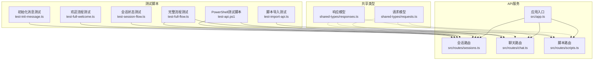
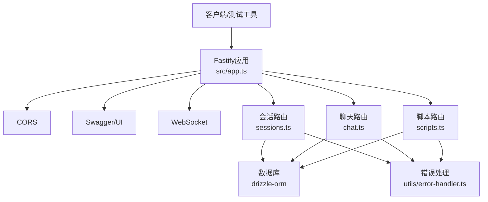
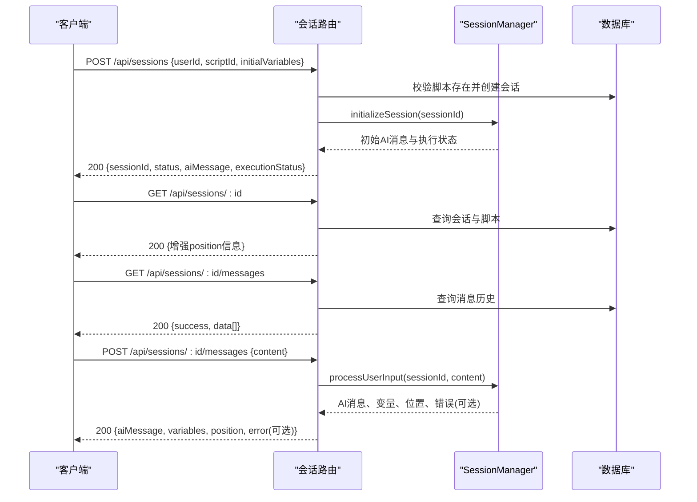
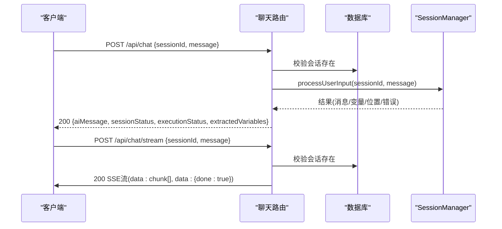
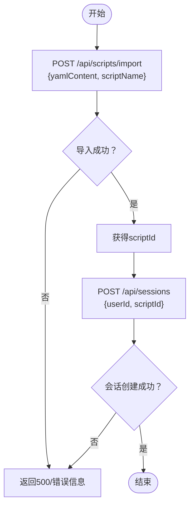
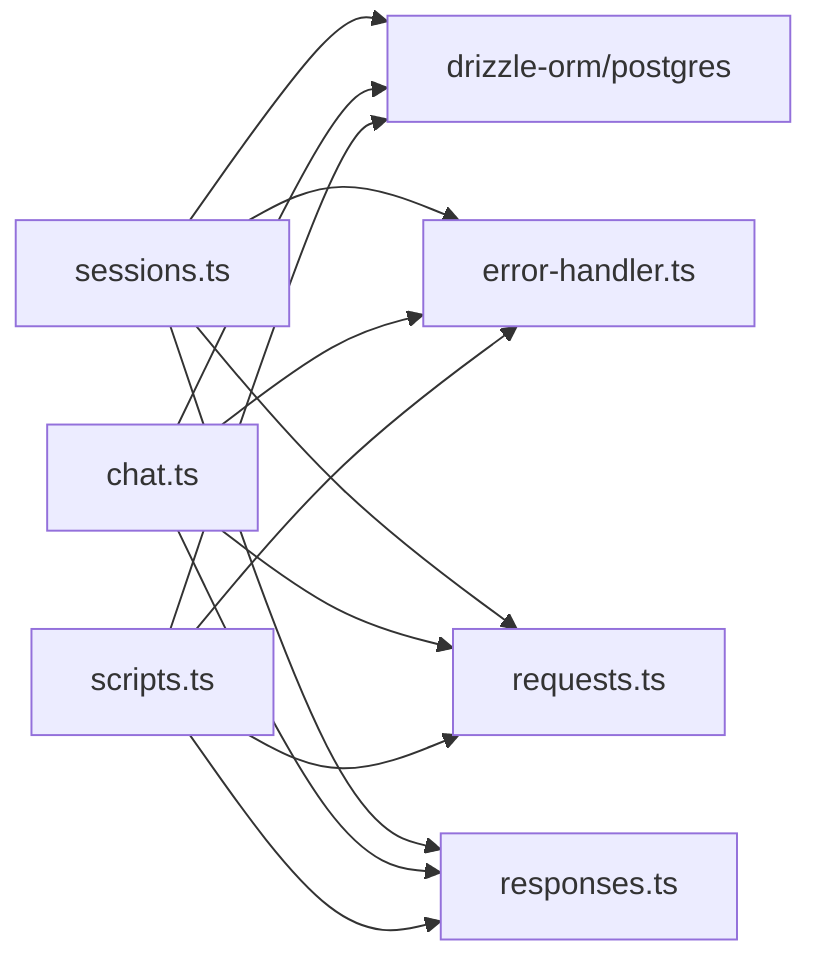

# API测试

<cite>
**本文引用的文件**
- [packages/api-server/src/app.ts](file://packages/api-server/src/app.ts)
- [packages/api-server/src/routes/sessions.ts](file://packages/api-server/src/routes/sessions.ts)
- [packages/api-server/src/routes/chat.ts](file://packages/api-server/src/routes/chat.ts)
- [packages/api-server/src/routes/scripts.ts](file://packages/api-server/src/routes/scripts.ts)
- [packages/shared-types/src/api/requests.ts](file://packages/shared-types/src/api/requests.ts)
- [packages/shared-types/src/api/responses.ts](file://packages/shared-types/src/api/responses.ts)
- [packages/api-server/test-api.ps1](file://packages/api-server/test-api.ps1)
- [packages/api-server/test-full-flow.ts](file://packages/api-server/test-full-flow.ts)
- [packages/api-server/test-session-flow.ts](file://packages/api-server/test-session-flow.ts)
- [packages/api-server/test-import-api.ts](file://packages/api-server/test-import-api.ts)
- [packages/api-server/test-full-welcome.ts](file://packages/api-server/test-full-welcome.ts)
- [packages/api-server/test-init-message.ts](file://packages/api-server/test-init-message.ts)
- [packages/api-server/package.json](file://packages/api-server/package.json)
- [scripts/sessions/cbt_depression_assessment.yaml](file://scripts/sessions/cbt_depression_assessment.yaml)
</cite>

## 目录
1. [简介](#简介)
2. [项目结构](#项目结构)
3. [核心组件](#核心组件)
4. [架构总览](#架构总览)
5. [详细组件分析](#详细组件分析)
6. [依赖分析](#依赖分析)
7. [性能考虑](#性能考虑)
8. [故障排查指南](#故障排查指南)
9. [结论](#结论)
10. [附录](#附录)

## 简介
本文件面向HeartRule AI咨询引擎的API测试，覆盖REST API与WebSocket的测试方法与策略，包括HTTP请求测试、响应验证、状态码检查、参数校验、错误处理、边界条件、版本兼容性、安全与性能测试。文档同时提供Postman与curl示例、自动化测试脚本与负载测试方案，确保API接口的稳定性与可靠性。

## 项目结构
API服务采用Fastify框架，按功能模块拆分路由层（sessions、chat、scripts），并通过共享类型库统一请求/响应模型。测试脚本位于api-server包内，涵盖端到端流程、会话状态、脚本导入与欢迎流程等场景。

图表来源
- [packages/api-server/src/app.ts](file://packages/api-server/src/app.ts#L91-L104)
- [packages/api-server/src/routes/sessions.ts](file://packages/api-server/src/routes/sessions.ts#L13-L133)
- [packages/api-server/src/routes/chat.ts](file://packages/api-server/src/routes/chat.ts#L15-L151)
- [packages/api-server/src/routes/scripts.ts](file://packages/api-server/src/routes/scripts.ts#L12-L324)
- [packages/shared-types/src/api/requests.ts](file://packages/shared-types/src/api/requests.ts#L1-L51)
- [packages/shared-types/src/api/responses.ts](file://packages/shared-types/src/api/responses.ts#L1-L166)
- [packages/api-server/test-api.ps1](file://packages/api-server/test-api.ps1#L1-L99)
- [packages/api-server/test-full-flow.ts](file://packages/api-server/test-full-flow.ts#L1-L208)
- [packages/api-server/test-session-flow.ts](file://packages/api-server/test-session-flow.ts#L1-L140)
- [packages/api-server/test-import-api.ts](file://packages/api-server/test-import-api.ts#L1-L119)
- [packages/api-server/test-full-welcome.ts](file://packages/api-server/test-full-welcome.ts#L1-L83)
- [packages/api-server/test-init-message.ts](file://packages/api-server/test-init-message.ts#L1-L75)

章节来源
- [packages/api-server/src/app.ts](file://packages/api-server/src/app.ts#L1-L135)
- [packages/api-server/package.json](file://packages/api-server/package.json#L1-L44)

## 核心组件
- 应用入口与插件注册：负责启动Fastify、注册CORS、Swagger、WebSocket，并挂载各路由模块。
- 会话路由：提供创建会话、查询会话详情、获取消息历史、发送消息、变量查询、用户会话列表等接口。
- 聊天路由：提供非流式聊天与SSE流式聊天接口，支持参数校验与错误处理。
- 脚本路由：提供脚本创建、查询、导入、验证等接口，支持YAML内容解析与存储。
- 共享类型：统一定义请求/响应模型与Zod Schema，保障前后端契约一致。
- 测试脚本：覆盖端到端流程、状态持久化、欢迎流程、脚本导入等关键场景。

章节来源
- [packages/api-server/src/app.ts](file://packages/api-server/src/app.ts#L21-L104)
- [packages/api-server/src/routes/sessions.ts](file://packages/api-server/src/routes/sessions.ts#L13-L547)
- [packages/api-server/src/routes/chat.ts](file://packages/api-server/src/routes/chat.ts#L15-L151)
- [packages/api-server/src/routes/scripts.ts](file://packages/api-server/src/routes/scripts.ts#L12-L324)
- [packages/shared-types/src/api/requests.ts](file://packages/shared-types/src/api/requests.ts#L1-L51)
- [packages/shared-types/src/api/responses.ts](file://packages/shared-types/src/api/responses.ts#L1-L166)

## 架构总览
下图展示API服务的整体架构与组件交互，包括路由、业务处理（SessionManager）、数据库与错误处理。

图表来源
- [packages/api-server/src/app.ts](file://packages/api-server/src/app.ts#L28-L104)
- [packages/api-server/src/routes/sessions.ts](file://packages/api-server/src/routes/sessions.ts#L1-L13)
- [packages/api-server/src/routes/chat.ts](file://packages/api-server/src/routes/chat.ts#L1-L15)
- [packages/api-server/src/routes/scripts.ts](file://packages/api-server/src/routes/scripts.ts#L1-L12)

## 详细组件分析

### 会话API测试策略
- 接口清单与参数校验
  - 创建会话：POST /api/sessions（userId、scriptId必填；initialVariables可选）
  - 查询会话详情：GET /api/sessions/:id（含增强position信息）
  - 获取消息历史：GET /api/sessions/:id/messages
  - 发送消息（调试）：POST /api/sessions/:id/messages（content必填）
  - 获取变量：GET /api/sessions/:id/variables
  - 用户会话列表：GET /api/users/:userId/sessions
- 响应验证与状态码
  - 成功：200；会话不存在：404；服务器错误：500
  - 会话详情响应包含增强position（phaseId/topicId/actionId/actionType）
- 边界条件与错误处理
  - 缺少必需字段、非法UUID、脚本不存在、会话不存在
  - 错误响应包含错误码、类型、消息、上下文与恢复建议
- 自动化测试脚本
  - 完整流程测试：模拟Web端完整会话，验证状态推进与变量提取
  - 欢迎流程测试：验证初始化消息与后续推进
  - 初始化消息测试：验证初始消息是否询问“名字”
  - 会话状态CLI测试：验证Action状态持久化与恢复

图表来源
- [packages/api-server/src/routes/sessions.ts](file://packages/api-server/src/routes/sessions.ts#L14-L133)
- [packages/api-server/src/routes/sessions.ts](file://packages/api-server/src/routes/sessions.ts#L135-L246)
- [packages/api-server/src/routes/sessions.ts](file://packages/api-server/src/routes/sessions.ts#L248-L317)
- [packages/api-server/src/routes/sessions.ts](file://packages/api-server/src/routes/sessions.ts#L319-L471)
- [packages/api-server/src/routes/sessions.ts](file://packages/api-server/src/routes/sessions.ts#L473-L547)

章节来源
- [packages/api-server/src/routes/sessions.ts](file://packages/api-server/src/routes/sessions.ts#L13-L547)
- [packages/api-server/test-full-flow.ts](file://packages/api-server/test-full-flow.ts#L1-L208)
- [packages/api-server/test-full-welcome.ts](file://packages/api-server/test-full-welcome.ts#L1-L83)
- [packages/api-server/test-init-message.ts](file://packages/api-server/test-init-message.ts#L1-L75)

### 聊天API测试策略
- 接口清单与参数校验
  - 非流式聊天：POST /api/chat（sessionId、message必填）
  - SSE流式聊天：POST /api/chat/stream（sessionId、message必填）
- 响应验证与状态码
  - 成功：200；会话不存在：404；服务器错误：500
  - 非流式返回aiMessage、sessionStatus、executionStatus、extractedVariables
  - SSE流式以Server-Sent Events推送数据块，结束时发送done标记
- 错误处理
  - 会话不存在：返回标准错误结构
  - 异常捕获：记录日志并返回错误信息
- WebSocket测试（概念性说明）
  - 若启用WebSocket端点，需验证连接握手、消息格式、断线重连与心跳机制
  - 本仓库未实现WebSocket端点，仅注册插件，建议在后续版本中补充

图表来源
- [packages/api-server/src/routes/chat.ts](file://packages/api-server/src/routes/chat.ts#L15-L151)

章节来源
- [packages/api-server/src/routes/chat.ts](file://packages/api-server/src/routes/chat.ts#L15-L151)

### 脚本API测试策略
- 接口清单与参数校验
  - 创建脚本：POST /api/scripts（scriptName、scriptType、scriptContent、author必填）
  - 获取脚本详情：GET /api/scripts/:id
  - 列出脚本：GET /api/scripts（支持type/status过滤占位）
  - 导入脚本（调试）：POST /api/scripts/import（yamlContent、scriptName必填）
  - 验证脚本：POST /api/scripts/:id/validate（占位：当前返回模拟结果）
- 响应验证与状态码
  - 成功：200；脚本不存在：404；服务器错误：500
  - 导入接口返回success与data.scriptId
- 错误处理
  - YAML解析失败时记录警告并存储为null
  - 已存在脚本则更新内容与时间戳
- 自动化测试脚本
  - 脚本导入API测试：调用导入接口后创建调试会话，验证流程闭环

图表来源
- [packages/api-server/src/routes/scripts.ts](file://packages/api-server/src/routes/scripts.ts#L171-L278)
- [packages/api-server/test-import-api.ts](file://packages/api-server/test-import-api.ts#L49-L118)

章节来源
- [packages/api-server/src/routes/scripts.ts](file://packages/api-server/src/routes/scripts.ts#L12-L324)
- [packages/api-server/test-import-api.ts](file://packages/api-server/test-import-api.ts#L1-L119)

### 参数验证、错误处理与边界条件
- 请求体参数校验
  - 使用Zod Schema与Fastify Type Provider进行编译期/运行期校验
  - 必填字段缺失、格式不符（如UUID）、长度不足（如message最小长度1）均触发4xx错误
- 错误处理
  - 统一错误响应结构（code、type、message、details、context、recovery）
  - 会话/脚本不存在时返回明确错误与上下文
- 边界条件
  - 空消息、超长消息、非法会话ID、重复导入脚本
  - 会话状态恢复后仍停留在同一Action（验证状态持久化）

章节来源
- [packages/shared-types/src/api/requests.ts](file://packages/shared-types/src/api/requests.ts#L12-L29)
- [packages/shared-types/src/api/responses.ts](file://packages/shared-types/src/api/responses.ts#L68-L84)
- [packages/api-server/src/routes/sessions.ts](file://packages/api-server/src/routes/sessions.ts#L62-L74)
- [packages/api-server/src/routes/scripts.ts](file://packages/api-server/src/routes/scripts.ts#L211-L226)

### WebSocket API测试方法（概念性）
- 连接状态管理
  - 验证握手成功、协议升级、最大负载限制
  - 断线重连与心跳检测（若实现）
- 实时通信测试
  - 发送消息后接收确认帧
  - 消息格式验证（JSON/文本）
- 本仓库未实现WebSocket端点，仅注册插件，建议后续补充

## 依赖分析
- 组件耦合
  - 路由层依赖数据库与SessionManager，错误处理通过统一工具函数
  - 共享类型库为路由层提供强类型约束
- 外部依赖
  - Fastify、@fastify/cors、@fastify/swagger、@fastify/swagger-ui、@fastify/websocket
  - drizzle-orm、postgres、uuid、zod
- 循环依赖
  - 未见循环依赖迹象；路由模块按功能拆分，入口统一注册

图表来源
- [packages/api-server/src/routes/sessions.ts](file://packages/api-server/src/routes/sessions.ts#L1-L13)
- [packages/api-server/src/routes/chat.ts](file://packages/api-server/src/routes/chat.ts#L1-L15)
- [packages/api-server/src/routes/scripts.ts](file://packages/api-server/src/routes/scripts.ts#L1-L12)
- [packages/shared-types/src/api/requests.ts](file://packages/shared-types/src/api/requests.ts#L1-L51)
- [packages/shared-types/src/api/responses.ts](file://packages/shared-types/src/api/responses.ts#L1-L166)

章节来源
- [packages/api-server/src/app.ts](file://packages/api-server/src/app.ts#L28-L104)
- [packages/api-server/package.json](file://packages/api-server/package.json#L20-L35)

## 性能考虑
- 并发与吞吐
  - 使用异步路由与数据库连接池，避免阻塞
  - SSE流式接口应控制写入频率与缓冲区大小
- 资源限制
  - WebSocket最大负载限制已在插件中配置
  - 长轮询与SSE需设置合理的超时与重试策略
- 监控与可观测性
  - Swagger UI提供接口文档与快速测试
  - 健康检查端点可用于负载均衡探活

## 故障排查指南
- 常见问题定位
  - 会话不存在：检查sessionId格式与数据库中会话记录
  - 脚本不存在：确认scriptId与数据库中脚本匹配
  - YAML解析失败：检查脚本内容格式与编码
- 日志与错误响应
  - 关注路由层日志与错误处理工具函数输出
  - 根据错误上下文（scriptId、sessionId、position、timestamp）定位问题
- 自动化测试辅助
  - 使用提供的PowerShell与TypeScript测试脚本快速复现问题
  - 通过数据库状态与消息历史比对验证状态推进与变量提取

章节来源
- [packages/api-server/src/routes/sessions.ts](file://packages/api-server/src/routes/sessions.ts#L62-L74)
- [packages/api-server/src/routes/scripts.ts](file://packages/api-server/src/routes/scripts.ts#L219-L226)
- [packages/api-server/test-api.ps1](file://packages/api-server/test-api.ps1#L91-L98)

## 结论
通过完善的参数校验、统一的错误响应模型、覆盖端到端流程的测试脚本以及Swagger文档与健康检查，HeartRule API具备良好的稳定性与可维护性。建议在后续版本中补充WebSocket端点与负载测试方案，进一步提升实时通信能力与性能表现。

## 附录

### REST API测试方法与工具
- Postman
  - 导入Swagger文档：访问/docs获取OpenAPI规范，导入至Postman
  - 创建集合：包含会话、聊天、脚本三类接口，设置全局变量（如baseUrl、sessionId、scriptId）
  - 编写测试脚本：断言状态码、响应体字段、错误上下文
- curl示例
  - 创建会话：curl -X POST http://localhost:8000/api/sessions -H "Content-Type: application/json" -d '{...}'
  - 发送消息：curl -X POST http://localhost:8000/api/chat -H "Content-Type: application/json" -d '{...}'
  - 获取消息历史：curl http://localhost:8000/api/sessions/{id}/messages
  - 导入脚本：curl -X POST http://localhost:8000/api/scripts/import -H "Content-Type: application/json" -d '{...}'
- 自动化脚本
  - PowerShell：packages/api-server/test-api.ps1
  - TypeScript：packages/api-server/test-full-flow.ts、test-session-flow.ts、test-import-api.ts、test-full-welcome.ts、test-init-message.ts
  - 运行方式：pnpm test:flow、pnpm test:welcome等（参考package.json脚本）

章节来源
- [packages/api-server/test-api.ps1](file://packages/api-server/test-api.ps1#L1-L99)
- [packages/api-server/test-full-flow.ts](file://packages/api-server/test-full-flow.ts#L1-L208)
- [packages/api-server/test-session-flow.ts](file://packages/api-server/test-session-flow.ts#L1-L140)
- [packages/api-server/test-import-api.ts](file://packages/api-server/test-import-api.ts#L1-L119)
- [packages/api-server/test-full-welcome.ts](file://packages/api-server/test-full-welcome.ts#L1-L83)
- [packages/api-server/test-init-message.ts](file://packages/api-server/test-init-message.ts#L1-L75)
- [packages/api-server/package.json](file://packages/api-server/package.json#L17-L18)

### WebSocket API测试（概念性）
- 连接与握手
  - 验证升级到WebSocket协议成功
  - 检查最大负载限制与超时设置
- 消息格式与实时性
  - 发送/接收消息格式一致性
  - 延迟与丢包率监控
- 状态管理
  - 断线重连与会话状态恢复
  - 心跳保活与异常断开处理

### 负载测试方案（概念性）
- 压力测试
  - 使用JMeter/Artillery/K6对会话创建、消息发送、脚本导入进行并发压测
  - 关注P95/P99延迟、错误率与资源占用
- 场景设计
  - 端到端：创建会话→多轮对话→查询历史→关闭会话
  - 峰值场景：大量用户同时发起会话并发送消息
- 监控指标
  - QPS、响应时间、错误率、数据库连接数、内存/CPU使用率

### API版本兼容性测试
- 版本标识
  - OpenAPI版本号与应用版本号保持一致（参考Swagger配置）
- 向后兼容
  - 新增字段采用可选策略，避免破坏既有客户端
  - 旧字段废弃时提供迁移指引与过渡期

### 安全测试（概念性）
- 认证与授权
  - 本项目未内置认证，建议在网关或上游增加鉴权
- 输入验证
  - 严格校验请求体与查询参数，防止注入与越权
- CORS与HTTPS
  - 生产环境配置CORS白名单与HTTPS