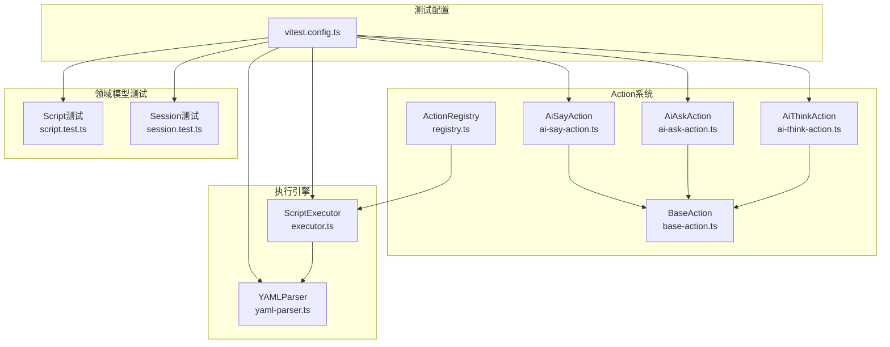
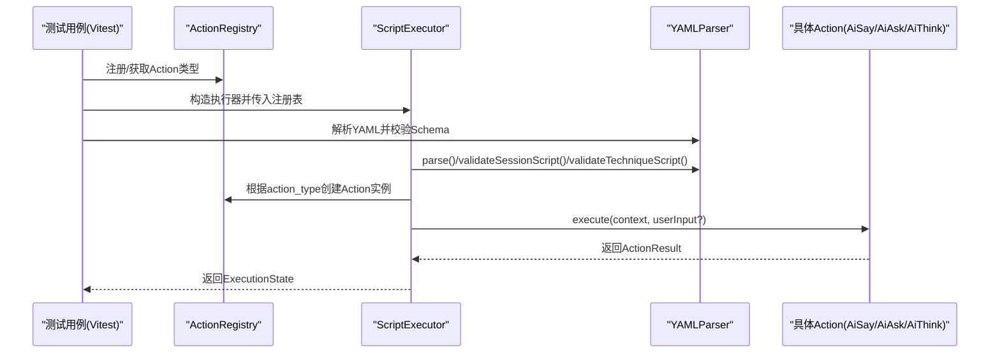
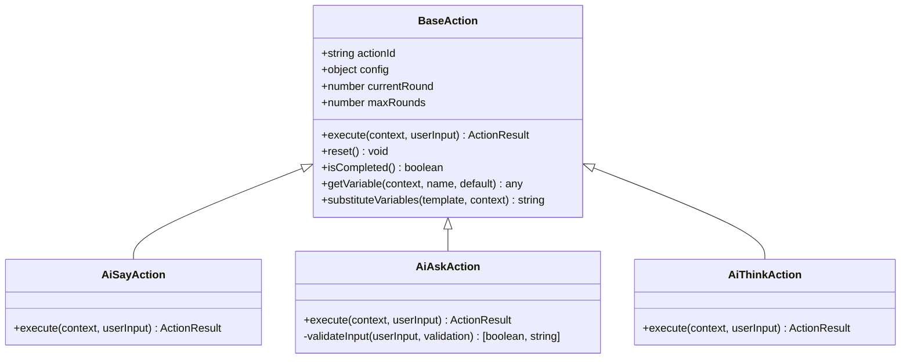
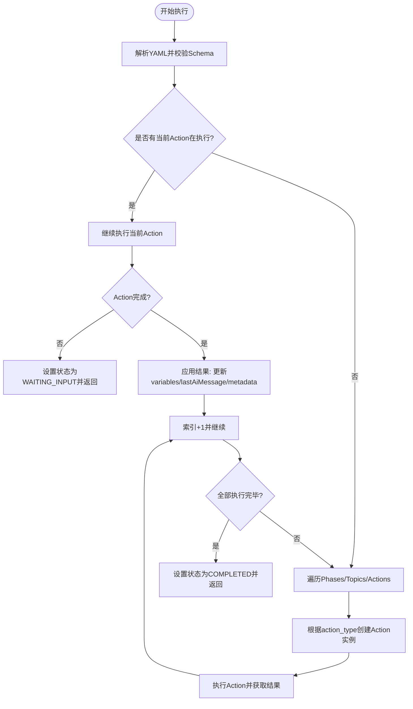
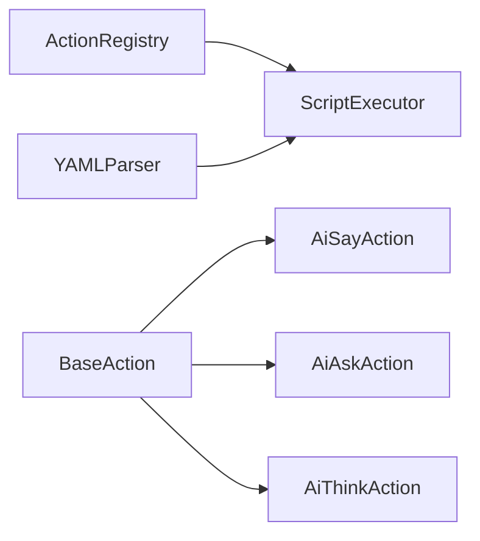

# 单元测试

<cite>
**本文引用的文件**
- [vitest.config.ts](file://vitest.config.ts)
- [ai-say-action.ts](file://packages/core-engine/src/actions/ai-say-action.ts)
- [ai-ask-action.ts](file://packages/core-engine/src/actions/ai-ask-action.ts)
- [ai-think-action.ts](file://packages/core-engine/src/actions/ai-think-action.ts)
- [base-action.ts](file://packages/core-engine/src/actions/base-action.ts)
- [registry.ts](file://packages/core-engine/src/actions/registry.ts)
- [yaml-parser.ts](file://packages/core-engine/src/engines/script-execution/yaml-parser.ts)
- [executor.ts](file://packages/core-engine/src/engines/script-execution/executor.ts)
- [script.test.ts](file://packages/core-engine/src/domain/__tests__/script.test.ts)
- [session.test.ts](file://packages/core-engine/src/domain/__tests__/session.test.ts)
- [yaml-parser.test.ts](file://packages/core-engine/src/engines/script-execution/__tests__/yaml-parser.test.ts)
</cite>

## 目录
1. [引言](#引言)
2. [项目结构](#项目结构)
3. [核心组件](#核心组件)
4. [架构总览](#架构总览)
5. [详细组件分析](#详细组件分析)
6. [依赖关系分析](#依赖关系分析)
7. [性能考量](#性能考量)
8. [故障排查指南](#故障排查指南)
9. [结论](#结论)
10. [附录](#附录)

## 引言
本文件为 HeartRule AI 咨询引擎的单元测试文档，聚焦于 Vitest 测试框架的配置与使用、Action 系统的单元测试策略、脚本执行引擎（含 YAML 解析器与执行器）的状态测试实践，并提供模拟对象、断言策略、测试数据准备、边界条件与异常处理的测试设计原则。目标是确保核心逻辑正确性与代码质量。

## 项目结构
- 测试框架采用 Vitest，全局启用环境为 Node，覆盖率由 v8 提供，报告器包含文本、JSON、HTML；排除目录覆盖了 node_modules、dist、类型声明与配置文件等。
- Action 系统位于 core-engine 的 actions 子模块，包含基类与具体 Action（ai_say、ai_ask、ai_think），并通过注册表进行动态创建。
- 执行引擎位于 engines/script-execution，包含 YAML 解析器与脚本执行器，负责解析脚本内容、校验 Schema 并驱动 Action 执行。
- domain 层的 Script 与 Session 模型也具备对应的单元测试，验证其状态转换与基本行为。

图表来源
- [vitest.config.ts](file://vitest.config.ts#L1-L20)
- [base-action.ts](file://packages/core-engine/src/actions/base-action.ts#L37-L96)
- [registry.ts](file://packages/core-engine/src/actions/registry.ts#L1-L46)
- [ai-say-action.ts](file://packages/core-engine/src/actions/ai-say-action.ts#L16-L105)
- [ai-ask-action.ts](file://packages/core-engine/src/actions/ai-ask-action.ts#L19-L207)
- [ai-think-action.ts](file://packages/core-engine/src/actions/ai-think-action.ts#L11-L57)
- [yaml-parser.ts](file://packages/core-engine/src/engines/script-execution/yaml-parser.ts#L8-L96)
- [executor.ts](file://packages/core-engine/src/engines/script-execution/executor.ts#L34-L298)
- [script.test.ts](file://packages/core-engine/src/domain/__tests__/script.test.ts#L1-L60)
- [session.test.ts](file://packages/core-engine/src/domain/__tests__/session.test.ts#L1-L88)

章节来源
- [vitest.config.ts](file://vitest.config.ts#L1-L20)

## 核心组件
- Action 基类与接口：定义 ActionContext、ActionResult、变量替换与轮次控制等通用能力。
- Action 注册表：集中管理 action_type 到构造函数的映射，支持动态创建 Action 实例。
- 具体 Action：AiSayAction、AiAskAction、AiThinkAction 分别实现不同交互模式与状态流转。
- YAML 解析器：封装 js-yaml 的解析与序列化，并通过 Zod 对会话脚本与技术脚本进行 Schema 校验。
- 执行器：负责解析脚本、遍历 Phase/Topic/Action，驱动 Action 执行并维护 ExecutionState。

章节来源
- [base-action.ts](file://packages/core-engine/src/actions/base-action.ts#L7-L96)
- [registry.ts](file://packages/core-engine/src/actions/registry.ts#L1-L46)
- [yaml-parser.ts](file://packages/core-engine/src/engines/script-execution/yaml-parser.ts#L8-L96)
- [executor.ts](file://packages/core-engine/src/engines/script-execution/executor.ts#L34-L298)

## 架构总览
下图展示测试视角下的关键交互：测试通过 Vitest 运行，对 Action 与执行引擎进行隔离与组合测试，同时对 YAML 解析与 Schema 校验进行独立验证。

图表来源
- [registry.ts](file://packages/core-engine/src/actions/registry.ts#L11-L46)
- [executor.ts](file://packages/core-engine/src/engines/script-execution/executor.ts#L34-L298)
- [yaml-parser.ts](file://packages/core-engine/src/engines/script-execution/yaml-parser.ts#L8-L96)
- [ai-say-action.ts](file://packages/core-engine/src/actions/ai-say-action.ts#L19-L103)
- [ai-ask-action.ts](file://packages/core-engine/src/actions/ai-ask-action.ts#L27-L167)
- [ai-think-action.ts](file://packages/core-engine/src/actions/ai-think-action.ts#L18-L55)

## 详细组件分析

### Vitest 配置与使用
- 全局启用：globals、environment=node。
- 覆盖率：provider=v8，输出 text/json/html 报告；排除 node_modules、dist、类型声明与配置文件。
- 测试文件组织：按功能模块划分目录，如 domain/__tests__、engines/script-execution/__tests__，便于定位与并行运行。

章节来源
- [vitest.config.ts](file://vitest.config.ts#L1-L20)

### Action 系统单元测试策略
- AiSayAction
  - 关注点：require_acknowledgment 的双态行为（需要/不需要确认）、模板变量替换、多轮状态切换、错误兜底。
  - 断言要点：completed 状态、metadata 中 waitingFor/acknowledgment/userAcknowledged 字段、aiMessage 的存在与空值变化。
  - 边界与异常：空配置、非法字段名、异常抛出时的错误信息封装。
- AiAskAction
  - 关注点：问题模板渲染、target_variable 提取、validation 规则（required/min_length/max_length/pattern）、重试计数与最大轮次。
  - 断言要点：waitingFor=answer、validationFailed、extractTo、extractionPrompt、extractedVariables。
  - 边界与异常：空输入、格式不符、达到 max_rounds 的失败路径。
- AiThinkAction
  - 关注点：MVP 占位符实现，输出变量列表的映射生成。
  - 断言要点：success=true、completed=true、extractedVariables 的键值对、metadata.note 描述。
  - 边界与异常：空输出变量列表、异常捕获与错误封装。

图表来源
- [base-action.ts](file://packages/core-engine/src/actions/base-action.ts#L37-L96)
- [ai-say-action.ts](file://packages/core-engine/src/actions/ai-say-action.ts#L16-L105)
- [ai-ask-action.ts](file://packages/core-engine/src/actions/ai-ask-action.ts#L19-L207)
- [ai-think-action.ts](file://packages/core-engine/src/actions/ai-think-action.ts#L11-L57)

章节来源
- [base-action.ts](file://packages/core-engine/src/actions/base-action.ts#L7-L96)
- [ai-say-action.ts](file://packages/core-engine/src/actions/ai-say-action.ts#L19-L103)
- [ai-ask-action.ts](file://packages/core-engine/src/actions/ai-ask-action.ts#L27-L167)
- [ai-think-action.ts](file://packages/core-engine/src/actions/ai-think-action.ts#L18-L55)

### 脚本执行引擎单元测试实践
- YAML 解析器
  - 功能：parse/stringify、会话脚本与技术脚本的 Schema 校验。
  - 断言要点：解析成功后的结构完整性、非法 YAML 的异常抛出、Schema 失败时的错误信息。
- 执行器
  - 功能：解析脚本、遍历 Phase/Topic/Action、驱动 Action 执行、维护 ExecutionState、状态机流转（WAITING_INPUT/ERROR/COMPLETED/RUNNING）。
  - 断言要点：执行前后状态变化、variables 与 lastAiMessage 的更新、metadata 的错误记录、Action 完成标志与继续执行的判断。

图表来源
- [executor.ts](file://packages/core-engine/src/engines/script-execution/executor.ts#L46-L127)
- [yaml-parser.ts](file://packages/core-engine/src/engines/script-execution/yaml-parser.ts#L12-L67)

章节来源
- [yaml-parser.ts](file://packages/core-engine/src/engines/script-execution/yaml-parser.ts#L8-L96)
- [executor.ts](file://packages/core-engine/src/engines/script-execution/executor.ts#L34-L298)

### 测试文件组织与示例
- domain/__tests__：覆盖 Script 与 Session 的状态转换与基本属性。
- engines/script-execution/__tests__：覆盖 YAMLParser 的解析与校验。
- actions：建议按 Action 类型建立测试文件，分别验证 execute 的多轮状态、变量替换、错误处理与边界条件。

章节来源
- [script.test.ts](file://packages/core-engine/src/domain/__tests__/script.test.ts#L1-L60)
- [session.test.ts](file://packages/core-engine/src/domain/__tests__/session.test.ts#L1-L88)
- [yaml-parser.test.ts](file://packages/core-engine/src/engines/script-execution/__tests__/yaml-parser.test.ts#L1-L92)

### 模拟对象与断言策略
- 模拟对象
  - 使用 ActionRegistry 注入自定义 Action 或桩对象，以隔离外部依赖。
  - 使用 Mock Map/Array 替代 ExecutionState 的内部结构，便于断言状态变化。
- 断言策略
  - 结果断言：success/completed/aiMessage/extractedVariables/error/metadata。
  - 状态断言：ExecutionStatus 的流转与 WAITING_INPUT 条件触发。
  - 行为断言：Action 的 currentRound/isCompleted/reset 的调用与状态一致性。

### 测试数据准备
- YAML 脚本样例：包含有效与无效的 session/topic/action 结构，用于验证解析与 Schema 校验。
- Action 输入样例：包含正常输入、空输入、超长/过短、格式不符等，覆盖 AiAskAction 的验证规则。
- ExecutionState 样例：初始化各索引与变量，模拟中途暂停/恢复场景。

## 依赖关系分析
- ActionRegistry 与 ScriptExecutor：执行器通过注册表创建 Action 实例，耦合度低，利于扩展新 Action。
- YAMLParser 与 ScriptExecutor：执行器依赖解析器进行脚本解析与 Schema 校验，二者职责清晰。
- BaseAction 与具体 Action：统一的接口与工具方法（变量替换、轮次控制）保证行为一致性。

图表来源
- [registry.ts](file://packages/core-engine/src/actions/registry.ts#L11-L46)
- [executor.ts](file://packages/core-engine/src/engines/script-execution/executor.ts#L34-L41)
- [yaml-parser.ts](file://packages/core-engine/src/engines/script-execution/yaml-parser.ts#L8-L18)
- [base-action.ts](file://packages/core-engine/src/actions/base-action.ts#L37-L49)

章节来源
- [registry.ts](file://packages/core-engine/src/actions/registry.ts#L1-L46)
- [executor.ts](file://packages/core-engine/src/engines/script-execution/executor.ts#L34-L41)
- [yaml-parser.ts](file://packages/core-engine/src/engines/script-execution/yaml-parser.ts#L8-L18)
- [base-action.ts](file://packages/core-engine/src/actions/base-action.ts#L37-L49)

## 性能考量
- 测试并发：Vitest 支持并行执行，建议将互不影响的测试用例拆分到不同 describe/it 中，充分利用 CPU 核心。
- 覆盖率优化：通过排除无关目录减少扫描时间；对热点路径增加用例密度，非热点路径保持最小可用覆盖。
- 模拟与桩：对外部依赖（如网络、文件系统）使用模拟，避免真实 I/O 影响测试速度。

## 故障排查指南
- YAML 解析失败
  - 现象：parse 抛出“YAML parsing failed”。
  - 排查：检查缩进、键名拼写、特殊字符转义；使用 validateSessionScript/validateTechniqueScript 定位缺失字段。
- Schema 校验失败
  - 现象：validate* 抛出“... validation failed”。
  - 排查：核对 action_type 是否在共享类型中定义；确认 action_id、config 结构完整。
- Action 执行卡住
  - 现象：状态停留在 WAITING_INPUT。
  - 排查：确认 AiSay/AiAsk 的 require_acknowledgment/userInput 传递；检查 max_rounds 与 currentRound 是否递增。
- 执行器状态异常
  - 现象：ERROR 状态未清理或 COMPLETED 未触发。
  - 排查：检查 Action 返回的 success/completed 与执行器对 metadata 的赋值逻辑。

章节来源
- [yaml-parser.test.ts](file://packages/core-engine/src/engines/script-execution/__tests__/yaml-parser.test.ts#L28-L35)
- [executor.ts](file://packages/core-engine/src/engines/script-execution/executor.ts#L73-L93)
- [ai-say-action.ts](file://packages/core-engine/src/actions/ai-say-action.ts#L56-L95)
- [ai-ask-action.ts](file://packages/core-engine/src/actions/ai-ask-action.ts#L82-L137)

## 结论
通过 Vitest 的合理配置与模块化测试文件组织，结合对 Action 系统与执行引擎的深入测试策略，能够有效保障 HeartRule 引擎的核心逻辑正确性与可维护性。建议持续完善边界与异常用例，强化覆盖率与并行执行效率，确保在新增 Action 与脚本能力时测试体系同步演进。

## 附录
- 测试用例设计原则
  - 单一职责：每个用例聚焦一个行为或分支。
  - 可重复：固定随机种子或使用稳定输入，避免非确定性。
  - 可读性：命名清晰、断言明确、前置条件充分。
- 边界条件
  - 空输入、极小/极大长度、非法正则、未知 action_type、max_rounds 边界。
- 异常处理
  - 明确捕获与包装错误信息，断言错误码与错误消息的一致性。