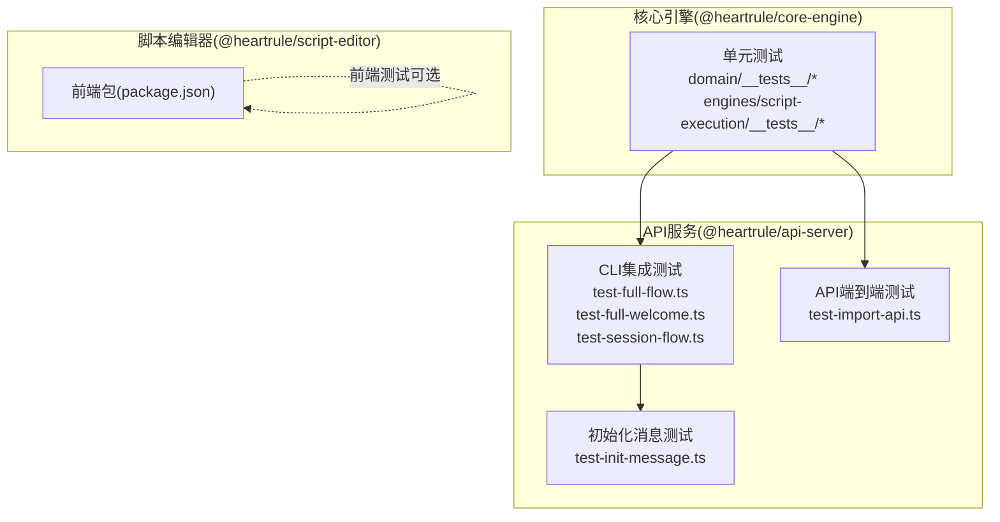
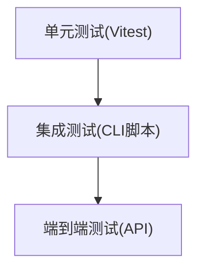
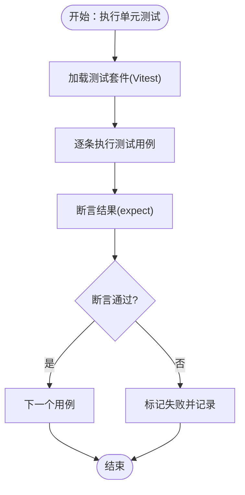
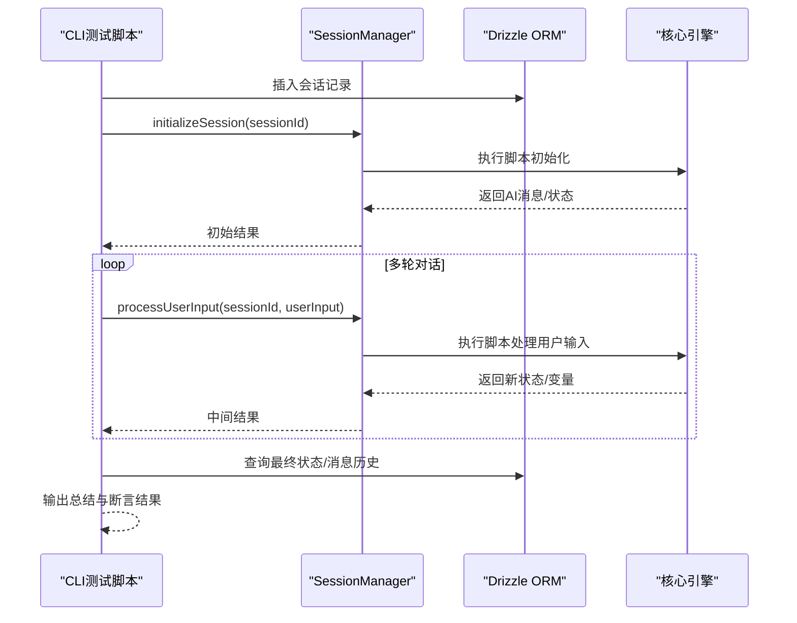
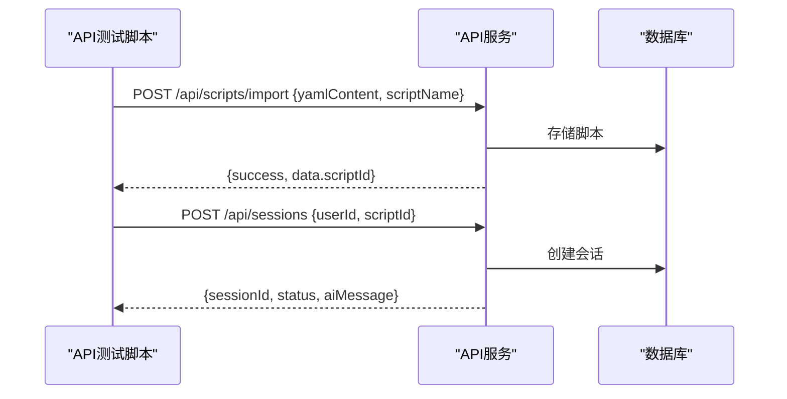
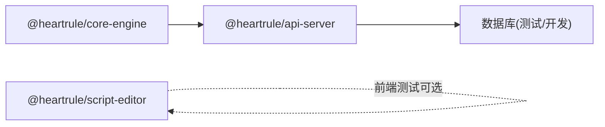

# 测试策略

<cite>
**本文引用的文件**
- [vitest.config.ts](file://vitest.config.ts)
- [packages/api-server/package.json](file://packages/api-server/package.json)
- [packages/core-engine/package.json](file://packages/core-engine/package.json)
- [packages/script-editor/package.json](file://packages/script-editor/package.json)
- [packages/core-engine/src/domain/__tests__/script.test.ts](file://packages/core-engine/src/domain/__tests__/script.test.ts)
- [packages/core-engine/src/domain/__tests__/session.test.ts](file://packages/core-engine/src/domain/__tests__/session.test.ts)
- [packages/core-engine/src/engines/script-execution/__tests__/yaml-parser.test.ts](file://packages/core-engine/src/engines/script-execution/__tests__/yaml-parser.test.ts)
- [packages/api-server/test-full-flow.ts](file://packages/api-server/test-full-flow.ts)
- [packages/api-server/test-full-welcome.ts](file://packages/api-server/test-full-welcome.ts)
- [packages/api-server/test-session-flow.ts](file://packages/api-server/test-session-flow.ts)
- [packages/api-server/test-import-api.ts](file://packages/api-server/test-import-api.ts)
- [packages/api-server/test-init-message.ts](file://packages/api-server/test-init-message.ts)
</cite>

## 目录
1. [引言](#引言)
2. [项目结构](#项目结构)
3. [核心组件](#核心组件)
4. [架构总览](#架构总览)
5. [详细组件分析](#详细组件分析)
6. [依赖分析](#依赖分析)
7. [性能考虑](#性能考虑)
8. [故障排查指南](#故障排查指南)
9. [结论](#结论)
10. [附录](#附录)

## 引言
本测试策略文档面向 HeartRule AI 咨询引擎，目标是建立覆盖单元测试、集成测试、端到端测试与 API 测试的完整测试体系，确保代码质量与系统稳定性。文档涵盖测试框架选择与配置（Vitest）、测试环境设置、覆盖率报告、断言策略、模拟对象使用、测试数据准备、测试环境隔离、测试结果分析、测试自动化与持续集成流程，以及性能测试方案。

## 项目结构
项目采用多包工作区（pnpm workspaces），核心测试分布在以下模块：
- 核心引擎（@heartrule/core-engine）：包含领域模型与脚本执行引擎的单元测试。
- API 服务（@heartrule/api-server）：包含集成测试与 API 端到端脚本。
- 脚本编辑器（@heartrule/script-editor）：前端包，可按需扩展前端测试（当前仓库未见 Vitest 配置或测试文件）。

图表来源
- [packages/core-engine/src/domain/__tests__/script.test.ts](file://packages/core-engine/src/domain/__tests__/script.test.ts#L1-L60)
- [packages/core-engine/src/domain/__tests__/session.test.ts](file://packages/core-engine/src/domain/__tests__/session.test.ts#L1-L88)
- [packages/core-engine/src/engines/script-execution/__tests__/yaml-parser.test.ts](file://packages/core-engine/src/engines/script-execution/__tests__/yaml-parser.test.ts#L1-L92)
- [packages/api-server/test-full-flow.ts](file://packages/api-server/test-full-flow.ts#L1-L208)
- [packages/api-server/test-full-welcome.ts](file://packages/api-server/test-full-welcome.ts#L1-L83)
- [packages/api-server/test-session-flow.ts](file://packages/api-server/test-session-flow.ts#L1-L140)
- [packages/api-server/test-import-api.ts](file://packages/api-server/test-import-api.ts#L1-L119)
- [packages/api-server/test-init-message.ts](file://packages/api-server/test-init-message.ts#L1-L75)
- [packages/script-editor/package.json](file://packages/script-editor/package.json#L1-L33)

章节来源
- [packages/core-engine/package.json](file://packages/core-engine/package.json#L1-L34)
- [packages/api-server/package.json](file://packages/api-server/package.json#L1-L44)
- [packages/script-editor/package.json](file://packages/script-editor/package.json#L1-L33)

## 核心组件
- 测试框架与配置
  - 使用 Vitest 作为测试运行器与断言库，全局启用、Node 环境、V8 覆盖率提供者，输出文本、JSON、HTML 报表，并排除类型声明与配置文件等目录。
- 单元测试
  - 覆盖领域模型（Script、Session）与脚本解析器（YAMLParser）的核心行为，断言状态变更、序列化、Schema 校验等。
- 集成测试
  - 通过 CLI 脚本模拟真实会话流程，验证状态推进、变量提取、数据库持久化与消息历史。
- API 端到端测试
  - 通过 HTTP 请求调用导入脚本与创建会话接口，验证响应结构与业务流程。
- 测试数据与环境
  - 使用 Drizzle ORM 访问数据库，测试前插入最小化样本数据，测试后关闭连接；脚本编辑器前端包未包含测试配置。

章节来源
- [vitest.config.ts](file://vitest.config.ts#L1-L20)
- [packages/core-engine/src/domain/__tests__/script.test.ts](file://packages/core-engine/src/domain/__tests__/script.test.ts#L1-L60)
- [packages/core-engine/src/domain/__tests__/session.test.ts](file://packages/core-engine/src/domain/__tests__/session.test.ts#L1-L88)
- [packages/core-engine/src/engines/script-execution/__tests__/yaml-parser.test.ts](file://packages/core-engine/src/engines/script-execution/__tests__/yaml-parser.test.ts#L1-L92)
- [packages/api-server/test-full-flow.ts](file://packages/api-server/test-full-flow.ts#L1-L208)
- [packages/api-server/test-full-welcome.ts](file://packages/api-server/test-full-welcome.ts#L1-L83)
- [packages/api-server/test-session-flow.ts](file://packages/api-server/test-session-flow.ts#L1-L140)
- [packages/api-server/test-import-api.ts](file://packages/api-server/test-import-api.ts#L1-L119)
- [packages/api-server/test-init-message.ts](file://packages/api-server/test-init-message.ts#L1-L75)

## 架构总览
下图展示测试金字塔与各层级测试在系统中的位置关系：单元测试位于最底层，集成测试与 API 端到端测试位于上层，共同保障核心引擎与 API 服务的稳定性。

图表来源
- [vitest.config.ts](file://vitest.config.ts#L1-L20)
- [packages/core-engine/src/domain/__tests__/script.test.ts](file://packages/core-engine/src/domain/__tests__/script.test.ts#L1-L60)
- [packages/core-engine/src/domain/__tests__/session.test.ts](file://packages/core-engine/src/domain/__tests__/session.test.ts#L1-L88)
- [packages/core-engine/src/engines/script-execution/__tests__/yaml-parser.test.ts](file://packages/core-engine/src/engines/script-execution/__tests__/yaml-parser.test.ts#L1-L92)
- [packages/api-server/test-full-flow.ts](file://packages/api-server/test-full-flow.ts#L1-L208)
- [packages/api-server/test-import-api.ts](file://packages/api-server/test-import-api.ts#L1-L119)

## 详细组件分析

### 单元测试策略与示例
- 测试框架与断言
  - 全局启用、Node 环境、V8 覆盖率、多种报表格式。
- 断言策略
  - 使用明确的 expect 断言，覆盖属性值、状态枚举、JSON 序列化字段、异常抛出等。
- 模拟对象
  - 当前单元测试直接实例化被测类，未见外部依赖注入或 Mock。建议后续引入工厂或依赖注入以增强可测试性与隔离性。
- 示例覆盖点
  - Script：创建、解析、发布、归档。
  - Session：创建默认值、启动/暂停/恢复/完成、变量存取、JSON 序列化。
  - YAMLParser：合法 YAML 解析、非法 YAML 抛错、会话/技术脚本 Schema 校验。

图表来源
- [vitest.config.ts](file://vitest.config.ts#L1-L20)
- [packages/core-engine/src/domain/__tests__/script.test.ts](file://packages/core-engine/src/domain/__tests__/script.test.ts#L1-L60)
- [packages/core-engine/src/domain/__tests__/session.test.ts](file://packages/core-engine/src/domain/__tests__/session.test.ts#L1-L88)
- [packages/core-engine/src/engines/script-execution/__tests__/yaml-parser.test.ts](file://packages/core-engine/src/engines/script-execution/__tests__/yaml-parser.test.ts#L1-L92)

章节来源
- [vitest.config.ts](file://vitest.config.ts#L1-L20)
- [packages/core-engine/src/domain/__tests__/script.test.ts](file://packages/core-engine/src/domain/__tests__/script.test.ts#L1-L60)
- [packages/core-engine/src/domain/__tests__/session.test.ts](file://packages/core-engine/src/domain/__tests__/session.test.ts#L1-L88)
- [packages/core-engine/src/engines/script-execution/__tests__/yaml-parser.test.ts](file://packages/core-engine/src/engines/script-execution/__tests__/yaml-parser.test.ts#L1-L92)

### 集成测试设计与实现
- 设计思路
  - 通过 CLI 脚本模拟 Web 端完整会话流程，验证状态推进、变量提取、数据库持久化与消息历史。
- 关键流程
  - 脚本存在性校验 → 创建会话 → 初始化会话（获取第一条 AI 消息）→ 多轮对话（输入用户名、年龄）→ 最终状态与变量校验 → 消息历史检查。
- 数据与状态
  - 使用 Drizzle ORM 插入最小化会话记录，断言 metadata.actionState、position、variables、executionStatus 等字段。
- 示例脚本
  - 完整流程测试、欢迎流程测试、会话状态恢复与推进测试、初始化消息测试。

图表来源
- [packages/api-server/test-full-flow.ts](file://packages/api-server/test-full-flow.ts#L1-L208)
- [packages/api-server/test-full-welcome.ts](file://packages/api-server/test-full-welcome.ts#L1-L83)
- [packages/api-server/test-session-flow.ts](file://packages/api-server/test-session-flow.ts#L1-L140)
- [packages/api-server/test-init-message.ts](file://packages/api-server/test-init-message.ts#L1-L75)

章节来源
- [packages/api-server/test-full-flow.ts](file://packages/api-server/test-full-flow.ts#L1-L208)
- [packages/api-server/test-full-welcome.ts](file://packages/api-server/test-full-welcome.ts#L1-L83)
- [packages/api-server/test-session-flow.ts](file://packages/api-server/test-session-flow.ts#L1-L140)
- [packages/api-server/test-init-message.ts](file://packages/api-server/test-init-message.ts#L1-L75)

### API 端到端测试最佳实践
- 接口测试要点
  - 导入脚本接口：校验请求体结构、响应 success 字段与 scriptId 返回。
  - 创建会话接口：校验会话创建成功、返回 sessionId、初始状态与 AI 消息。
- 测试数据
  - 使用内联 YAML 内容构造合法脚本，确保 metadata、session、phases、topics、actions 结构完整。
- 错误处理
  - 对非 2xx 响应记录状态码与响应体，便于定位问题。

图表来源
- [packages/api-server/test-import-api.ts](file://packages/api-server/test-import-api.ts#L1-L119)

章节来源
- [packages/api-server/test-import-api.ts](file://packages/api-server/test-import-api.ts#L1-L119)

### 测试数据准备与环境隔离
- 测试数据
  - 使用 Drizzle ORM 的 insert/find 接口插入最小化样本数据，确保测试可重复。
- 环境隔离
  - 使用独立的测试数据库或开发数据库副本，测试结束后清理或回滚。
- 资源管理
  - 在测试脚本 finally 分支中显式关闭数据库连接，避免资源泄漏。

章节来源
- [packages/api-server/test-full-flow.ts](file://packages/api-server/test-full-flow.ts#L1-L208)
- [packages/api-server/test-full-welcome.ts](file://packages/api-server/test-full-welcome.ts#L1-L83)
- [packages/api-server/test-session-flow.ts](file://packages/api-server/test-session-flow.ts#L1-L140)
- [packages/api-server/test-init-message.ts](file://packages/api-server/test-init-message.ts#L1-L75)

### 测试结果分析与覆盖率
- 覆盖率报告
  - V8 提供者生成文本、JSON、HTML 报表，便于本地与 CI 分析。
- 报告解读
  - 关注核心引擎与 API 服务关键路径覆盖率，识别未覆盖的分支与边界条件。
- 持续集成
  - 将覆盖率阈值纳入 CI，失败时阻断合并。

章节来源
- [vitest.config.ts](file://vitest.config.ts#L1-L20)

## 依赖分析
- 包与脚本
  - @heartrule/core-engine：核心引擎构建与类型检查脚本。
  - @heartrule/api-server：数据库迁移、类型检查、完整流程与欢迎流程测试脚本。
  - @heartrule/script-editor：前端包，当前未包含测试配置。
- 测试依赖
  - Vitest、Drizzle ORM、UUID、Zod、Fastify 生态等。

图表来源
- [packages/core-engine/package.json](file://packages/core-engine/package.json#L1-L34)
- [packages/api-server/package.json](file://packages/api-server/package.json#L1-L44)
- [packages/script-editor/package.json](file://packages/script-editor/package.json#L1-L33)

章节来源
- [packages/core-engine/package.json](file://packages/core-engine/package.json#L1-L34)
- [packages/api-server/package.json](file://packages/api-server/package.json#L1-L44)
- [packages/script-editor/package.json](file://packages/script-editor/package.json#L1-L33)

## 性能考虑
- 单元测试
  - 保持无外部依赖，优先使用内存数据结构，避免 I/O。
- 集成测试
  - 使用最小化样本数据与短生命周期会话，减少数据库压力。
- API 端到端测试
  - 控制并发与重试次数，避免对真实 LLM 服务造成压力。
- 覆盖率与性能平衡
  - 在保证关键路径覆盖率的前提下，避免过度测试导致 CI 时间过长。

## 故障排查指南
- 单元测试失败
  - 检查断言点与被测类的边界条件；逐步缩小范围定位问题。
- 集成测试失败
  - 核查数据库状态（position、variables、metadata.actionState）与消息历史；确认脚本 ID 与会话 ID 一致。
- API 端到端失败
  - 检查请求体结构与响应状态码；关注导入脚本接口返回的 scriptId 与创建会话接口返回的 sessionId。
- 资源泄漏
  - 确保测试脚本 finally 分支中关闭数据库连接。

章节来源
- [packages/core-engine/src/domain/__tests__/script.test.ts](file://packages/core-engine/src/domain/__tests__/script.test.ts#L1-L60)
- [packages/core-engine/src/domain/__tests__/session.test.ts](file://packages/core-engine/src/domain/__tests__/session.test.ts#L1-L88)
- [packages/core-engine/src/engines/script-execution/__tests__/yaml-parser.test.ts](file://packages/core-engine/src/engines/script-execution/__tests__/yaml-parser.test.ts#L1-L92)
- [packages/api-server/test-full-flow.ts](file://packages/api-server/test-full-flow.ts#L1-L208)
- [packages/api-server/test-import-api.ts](file://packages/api-server/test-import-api.ts#L1-L119)

## 结论
通过单元测试、集成测试与 API 端到端测试的协同，HeartRule AI 咨询引擎能够在开发早期发现缺陷、在集成阶段验证业务流程、在 API 层验证接口契约。结合 Vitest 覆盖率与 CI 流水线，可有效提升代码质量与系统稳定性。建议后续完善前端测试、引入依赖注入与 Mock、优化测试数据生成与清理流程，并在 CI 中加入覆盖率阈值与性能回归检测。

## 附录
- 测试命令参考
  - 单元测试：Vitest 默认运行（基于配置）。
  - 集成测试：在 @heartrule/api-server 下执行相应 TS 脚本。
  - API 端到端：在 @heartrule/api-server 下执行导入与会话创建脚本。
- 覆盖率报告
  - 文本、JSON、HTML 报表由 V8 提供者生成，可在本地与 CI 中查看。

章节来源
- [vitest.config.ts](file://vitest.config.ts#L1-L20)
- [packages/api-server/package.json](file://packages/api-server/package.json#L1-L44)