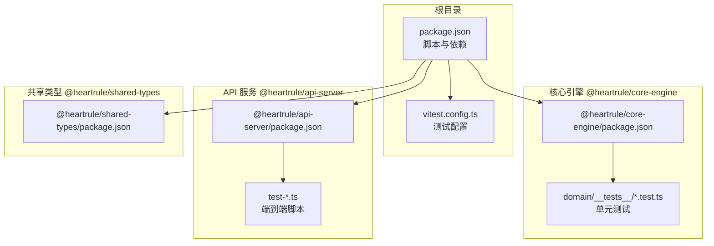
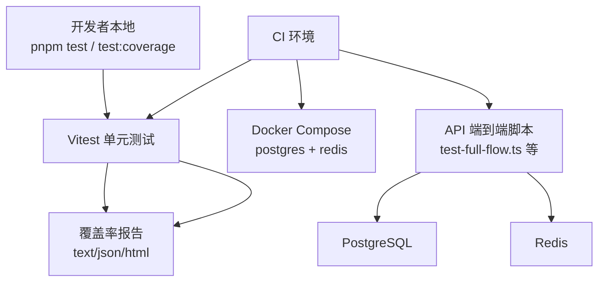
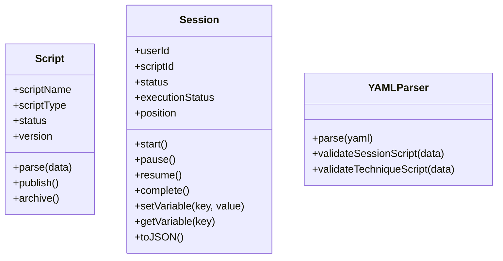
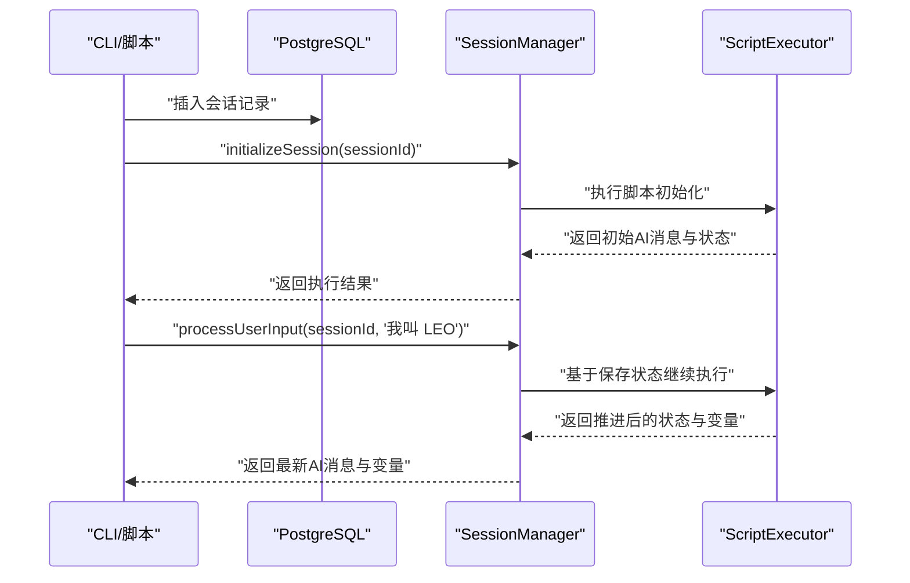
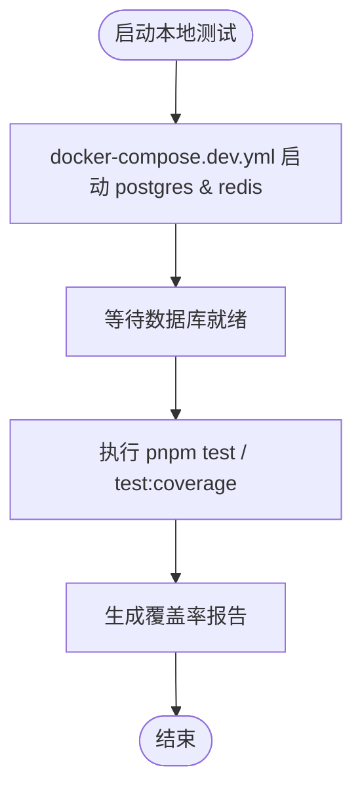
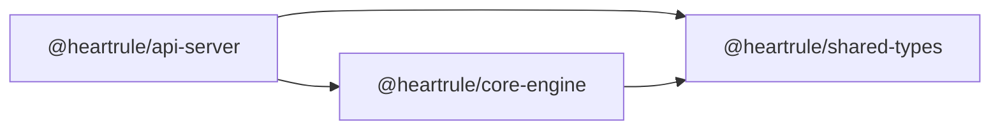

# 测试自动化

<cite>
**本文引用的文件**
- [package.json](file://package.json)
- [vitest.config.ts](file://vitest.config.ts)
- [packages/core-engine/src/domain/__tests__/script.test.ts](file://packages/core-engine/src/domain/__tests__/script.test.ts)
- [packages/core-engine/src/domain/__tests__/session.test.ts](file://packages/core-engine/src/domain/__tests__/session.test.ts)
- [packages/core-engine/src/engines/script-execution/__tests__/yaml-parser.test.ts](file://packages/core-engine/src/engines/script-execution/__tests__/yaml-parser.test.ts)
- [packages/api-server/package.json](file://packages/api-server/package.json)
- [packages/api-server/test-full-flow.ts](file://packages/api-server/test-full-flow.ts)
- [packages/api-server/test-full-welcome.ts](file://packages/api-server/test-full-welcome.ts)
- [packages/api-server/test-session-flow.ts](file://packages/api-server/test-session-flow.ts)
- [packages/api-server/test-import-api.ts](file://packages/api-server/test-import-api.ts)
- [docker-compose.dev.yml](file://docker-compose.dev.yml)
- [.env.example](file://.env.example)
</cite>

## 目录
1. [引言](#引言)
2. [项目结构](#项目结构)
3. [核心组件](#核心组件)
4. [架构总览](#架构总览)
5. [详细组件分析](#详细组件分析)
6. [依赖关系分析](#依赖关系分析)
7. [性能考量](#性能考量)
8. [故障排查指南](#故障排查指南)
9. [结论](#结论)
10. [附录](#附录)

## 引言
本指南面向 HeartRule AI 咨询引擎的测试自动化落地，目标是实现“标准化、可重复、可观测”的测试流程，覆盖本地开发与持续集成（CI）两大场景，并提供覆盖率监控、质量门禁、环境隔离、并行执行与资源管理等最佳实践建议。当前仓库已具备基础的 Vitest 单元测试与 API 层端到端脚本，本文在此基础上扩展为可直接落地的实施指南。

## 项目结构
项目采用 monorepo 结构，核心模块包括：
- 核心引擎（@heartrule/core-engine）：脚本解析、动作执行、变量抽取、会话状态机等
- API 服务（@heartrule/api-server）：Fastify 服务、数据库访问、会话管理、路由与测试脚本
- 共享类型（@heartrule/shared-types）：跨包共享的数据模型与枚举
- 测试与工具：根级 Vitest 配置、各包内单元测试、API 端到端脚本、Docker 开发环境编排

图表来源
- [package.json](file://package.json#L13-L31)
- [vitest.config.ts](file://vitest.config.ts#L1-L20)
- [packages/core-engine/package.json](file://packages/core-engine/package.json#L1-L34)
- [packages/api-server/package.json](file://packages/api-server/package.json#L1-L44)
- [packages/shared-types/package.json](file://packages/shared-types/package.json#L1-L27)

章节来源
- [package.json](file://package.json#L13-L31)
- [vitest.config.ts](file://vitest.config.ts#L1-L20)

## 核心组件
- 测试框架与覆盖率
  - 使用 Vitest 进行单元测试与覆盖率统计，配置了 v8 提供程序与多种报告格式（文本、JSON、HTML），并排除构建产物与类型声明文件。
- 单元测试
  - 在核心引擎中对领域模型（Script、Session）与 YAML 解析器进行断言测试，覆盖状态变更、序列化、Schema 校验等关键路径。
- 端到端测试
  - API 服务提供了多类脚本测试：完整会话流程、欢迎流程、会话状态恢复、导入 API 流程等，均通过 TS 脚本直接连接数据库与会话执行器，模拟真实交互。
- 开发环境编排
  - Docker Compose 提供 PostgreSQL 与 Redis 的本地开发环境，便于数据库与缓存的快速可用性验证。

章节来源
- [vitest.config.ts](file://vitest.config.ts#L4-L19)
- [packages/core-engine/src/domain/__tests__/script.test.ts](file://packages/core-engine/src/domain/__tests__/script.test.ts#L1-L60)
- [packages/core-engine/src/domain/__tests__/session.test.ts](file://packages/core-engine/src/domain/__tests__/session.test.ts#L1-L88)
- [packages/core-engine/src/engines/script-execution/__tests__/yaml-parser.test.ts](file://packages/core-engine/src/engines/script-execution/__tests__/yaml-parser.test.ts#L1-L92)
- [packages/api-server/test-full-flow.ts](file://packages/api-server/test-full-flow.ts#L1-L208)
- [packages/api-server/test-full-welcome.ts](file://packages/api-server/test-full-welcome.ts#L1-L83)
- [packages/api-server/test-session-flow.ts](file://packages/api-server/test-session-flow.ts#L1-L140)
- [packages/api-server/test-import-api.ts](file://packages/api-server/test-import-api.ts#L1-L119)
- [docker-compose.dev.yml](file://docker-compose.dev.yml#L1-L64)

## 架构总览
下图展示了测试自动化在本地与 CI 中的总体交互：本地开发者通过 npm/pnpm 脚本触发单元测试与覆盖率；CI 工作流在受控环境中拉起数据库与缓存容器，执行端到端脚本与单元测试，并输出覆盖率报告与测试结果。

图表来源
- [package.json](file://package.json#L18-L20)
- [docker-compose.dev.yml](file://docker-compose.dev.yml#L1-L64)
- [packages/api-server/test-full-flow.ts](file://packages/api-server/test-full-flow.ts#L1-L208)

## 详细组件分析

### 单元测试组件
- 脚本域模型测试
  - 验证 Script 的创建、解析、发布与归档状态转换，确保业务规则与默认值正确。
- 会话域模型测试
  - 验证 Session 的生命周期（创建、启动、暂停/恢复、完成）、变量存取、JSON 序列化等。
- YAML 解析器测试
  - 验证合法 YAML 的解析、非法 YAML 的错误处理、会话脚本与技术脚本的 Schema 校验。

图表来源
- [packages/core-engine/src/domain/__tests__/script.test.ts](file://packages/core-engine/src/domain/__tests__/script.test.ts#L6-L59)
- [packages/core-engine/src/domain/__tests__/session.test.ts](file://packages/core-engine/src/domain/__tests__/session.test.ts#L6-L87)
- [packages/core-engine/src/engines/script-execution/__tests__/yaml-parser.test.ts](file://packages/core-engine/src/engines/script-execution/__tests__/yaml-parser.test.ts#L5-L91)

章节来源
- [packages/core-engine/src/domain/__tests__/script.test.ts](file://packages/core-engine/src/domain/__tests__/script.test.ts#L1-L60)
- [packages/core-engine/src/domain/__tests__/session.test.ts](file://packages/core-engine/src/domain/__tests__/session.test.ts#L1-L88)
- [packages/core-engine/src/engines/script-execution/__tests__/yaml-parser.test.ts](file://packages/core-engine/src/engines/script-execution/__tests__/yaml-parser.test.ts#L1-L92)

### 端到端测试组件
- 完整会话流程测试
  - 通过直接操作数据库与会话执行器，模拟创建会话、初始化、多轮对话、变量提取与状态推进，最后输出数据库与消息历史，便于人工核验。
- 欢迎流程测试
  - 验证从欢迎语到收集姓名再到询问年龄的连续逻辑，确保状态机按预期推进。
- 会话状态恢复测试
  - 将执行器状态序列化后模拟恢复，验证 Action 状态持久化与后续流程正确性。
- 导入 API 测试
  - 通过 HTTP 请求调用导入接口与创建会话接口，验证端到端链路与返回结构。

图表来源
- [packages/api-server/test-full-flow.ts](file://packages/api-server/test-full-flow.ts#L67-L127)
- [packages/api-server/test-session-flow.ts](file://packages/api-server/test-session-flow.ts#L35-L108)

章节来源
- [packages/api-server/test-full-flow.ts](file://packages/api-server/test-full-flow.ts#L1-L208)
- [packages/api-server/test-full-welcome.ts](file://packages/api-server/test-full-welcome.ts#L1-L83)
- [packages/api-server/test-session-flow.ts](file://packages/api-server/test-session-flow.ts#L1-L140)
- [packages/api-server/test-import-api.ts](file://packages/api-server/test-import-api.ts#L1-L119)

### 测试环境与资源管理
- 开发环境编排
  - 使用 Docker Compose 启动 PostgreSQL 与 Redis，提供健康检查与持久化卷，便于本地快速搭建一致的数据库与缓存环境。
- 环境变量
  - .env.example 提供数据库、缓存、LLM Provider、API 主机与端口等关键配置项，确保脚本与测试能正确连接外部服务。

图表来源
- [docker-compose.dev.yml](file://docker-compose.dev.yml#L1-L64)
- [package.json](file://package.json#L18-L20)

章节来源
- [docker-compose.dev.yml](file://docker-compose.dev.yml#L1-L64)
- [.env.example](file://.env.example#L7-L25)

## 依赖关系分析
- 包间依赖
  - @heartrule/api-server 依赖 @heartrule/core-engine 与 @heartrule/shared-types，测试脚本中直接使用核心执行器与共享类型，体现了清晰的分层与职责边界。
- 测试依赖
  - 单元测试依赖 Vitest 与 v8 覆盖率提供程序；端到端脚本依赖 drizzle-orm、uuid、yaml 等库，直接连接数据库与会话执行器。

图表来源
- [packages/api-server/package.json](file://packages/api-server/package.json#L20-L34)
- [packages/core-engine/package.json](file://packages/core-engine/package.json#L19-L26)
- [packages/shared-types/package.json](file://packages/shared-types/package.json#L19-L21)

章节来源
- [packages/api-server/package.json](file://packages/api-server/package.json#L20-L34)
- [packages/core-engine/package.json](file://packages/core-engine/package.json#L19-L26)
- [packages/shared-types/package.json](file://packages/shared-types/package.json#L19-L21)

## 性能考量
- 测试执行速度
  - 单元测试应保持轻量与无副作用，优先使用内存态数据与最小化依赖注入；端到端脚本建议拆分为更小的子任务，减少数据库往返。
- 覆盖率与质量门禁
  - 建议在 CI 中设置覆盖率阈值（如语句、分支、函数、行），当低于阈值时阻断合并；同时保留 HTML 报告便于定位低覆盖区域。
- 并行与隔离
  - 单元测试可在本地并行执行；端到端测试建议使用独立数据库实例或事务回滚策略，避免并发写导致的干扰。
- 资源管理
  - Docker Compose 仅在需要时启动数据库与缓存；测试结束后停止容器或清理卷，避免资源泄漏。

## 故障排查指南
- 数据库连接失败
  - 检查 .env 中 DATABASE_URL 与 docker-compose 中的凭据是否一致；确认容器已健康运行并通过健康检查。
- 端到端脚本报错
  - 优先查看脚本输出的数据库状态与消息历史，确认会话 ID、脚本 ID 是否正确；逐步缩小到具体 Action 的状态推进。
- 覆盖率报告缺失
  - 确认 Vitest 配置中的 provider 与 reporter 已启用；检查排除规则是否误排除了测试文件。
- LLM Provider 配置
  - 若涉及外部 LLM，检查 OPENAI/Volcano 相关环境变量；必要时在本地使用模拟 Provider 或禁用网络请求。

章节来源
- [.env.example](file://.env.example#L7-L25)
- [docker-compose.dev.yml](file://docker-compose.dev.yml#L10-L21)
- [vitest.config.ts](file://vitest.config.ts#L7-L16)

## 结论
当前 HeartRule 项目已具备良好的测试基础：单元测试覆盖核心领域模型与解析器，API 端到端脚本能够模拟真实会话流程。结合本文提供的 CI/CD 配置建议、覆盖率与质量门禁策略、环境隔离与并行执行方案，可进一步提升测试效率与质量稳定性，保障引擎在迭代过程中的可靠性与可维护性。

## 附录

### 本地开发测试自动化实施清单
- 安装与准备
  - 安装 Node.js 与 pnpm，拉取代码后安装依赖。
- 启动测试环境
  - 使用 docker-compose.dev.yml 启动数据库与缓存；根据 .env.example 设置环境变量。
- 执行测试
  - 运行 pnpm test 执行单元测试；运行 pnpm test:coverage 生成覆盖率报告；针对 API 层可执行相应 test-*.ts 脚本。
- 分析结果
  - 查看控制台输出与 HTML 报告，定位失败用例与低覆盖区域。

章节来源
- [package.json](file://package.json#L18-L20)
- [docker-compose.dev.yml](file://docker-compose.dev.yml#L1-L64)
- [vitest.config.ts](file://vitest.config.ts#L7-L16)

### 持续集成（CI）测试流程配置建议
- 触发条件
  - 推送分支、打开 PR、定时任务（如每周执行性能回归）。
- 作业步骤
  - 拉取代码与依赖缓存
  - 启动 Postgres 与 Redis（可使用服务容器或托管服务）
  - 执行数据库迁移（如需要）
  - 运行 pnpm test 与 pnpm test:coverage
  - 上传覆盖率报告（支持 codecov、coveralls 等）
  - 运行端到端脚本（按需）
  - 质量门禁：若覆盖率低于阈值则失败
- 并行与缓存
  - 将单元测试与端到端测试拆分为并行 Job；缓存 Node 模块与 Docker 镜像以加速构建。

[本节为通用流程建议，不直接分析具体文件，故无章节来源]

### 测试覆盖率监控与质量门禁
- 阈值设置
  - 建议设置语句、分支、函数、行的阈值（例如 80%/85%/85%/85%），在 CI 中失败阻止合并。
- 报告生成
  - 使用 HTML 报告便于人工审查；JSON 报告可用于第三方平台集成。
- 低覆盖区域优化
  - 识别未覆盖的 Action 与边界条件，补充针对性单元测试。

章节来源
- [vitest.config.ts](file://vitest.config.ts#L7-L16)

### 测试环境隔离与资源管理
- 隔离策略
  - 端到端测试使用独立数据库实例或临时 schema；使用事务回滚或测试专用表。
- 资源管理
  - 使用 Docker Compose 生命周期管理容器；测试完成后清理卷与镜像缓存。

章节来源
- [docker-compose.dev.yml](file://docker-compose.dev.yml#L1-L64)

### 回归测试与性能测试
- 回归测试
  - 将 test-full-flow.ts、test-full-welcome.ts、test-session-flow.ts 作为回归基线，每次重大改动后执行。
- 性能测试
  - 定期执行端到端脚本并记录耗时，建立性能基线；在 CI 中对异常波动报警。

章节来源
- [packages/api-server/test-full-flow.ts](file://packages/api-server/test-full-flow.ts#L1-L208)
- [packages/api-server/test-full-welcome.ts](file://packages/api-server/test-full-welcome.ts#L1-L83)
- [packages/api-server/test-session-flow.ts](file://packages/api-server/test-session-flow.ts#L1-L140)

### 测试数据版本控制
- 建议
  - 将测试脚本与样例数据纳入版本控制；对敏感数据进行脱敏；使用固定 UUID 保证可重复性。
- 端到端脚本中的脚本 ID 与会话 ID
  - 采用常量或参数化方式，便于在不同环境复用。

章节来源
- [packages/api-server/test-full-flow.ts](file://packages/api-server/test-full-flow.ts#L13-L14)
- [packages/api-server/test-full-welcome.ts](file://packages/api-server/test-full-welcome.ts#L11-L12)
- [packages/api-server/test-session-flow.ts](file://packages/api-server/test-session-flow.ts#L28-L29)