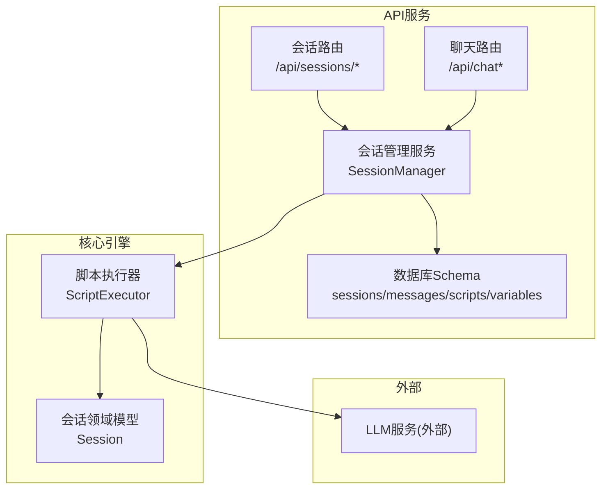
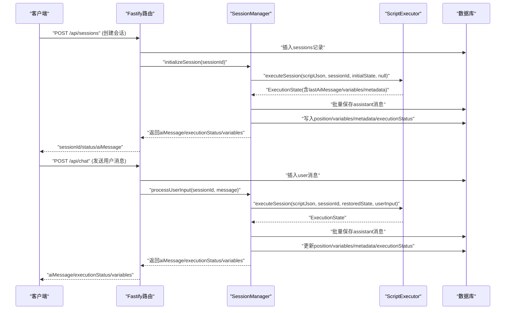
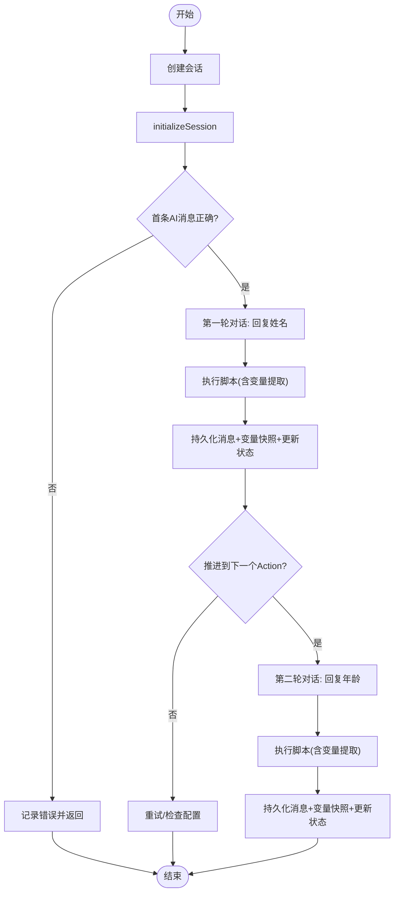
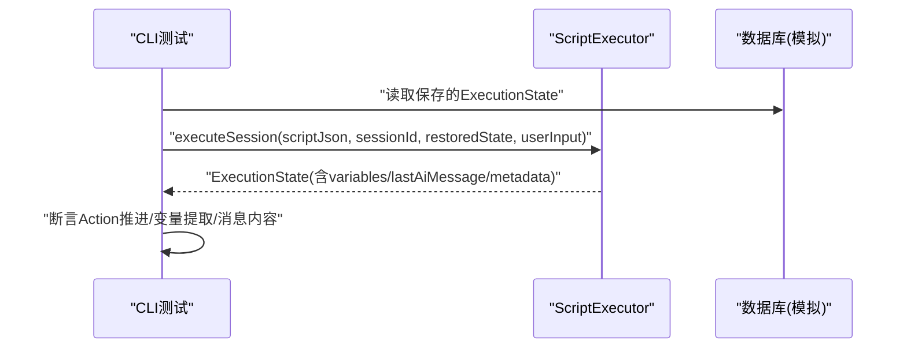
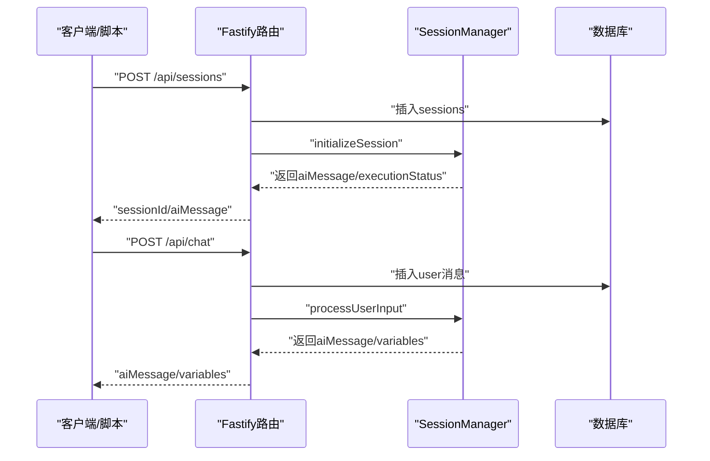
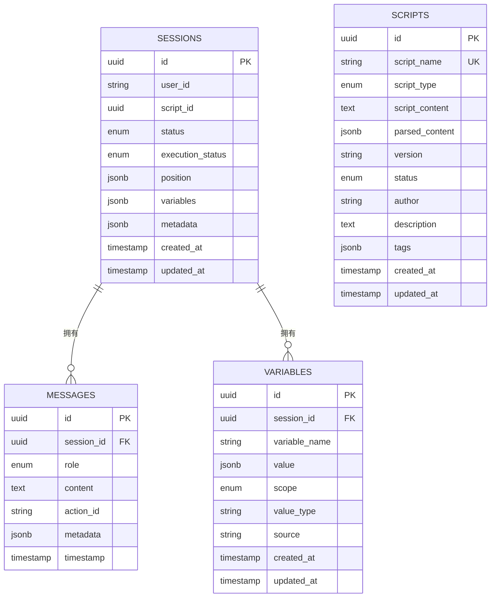
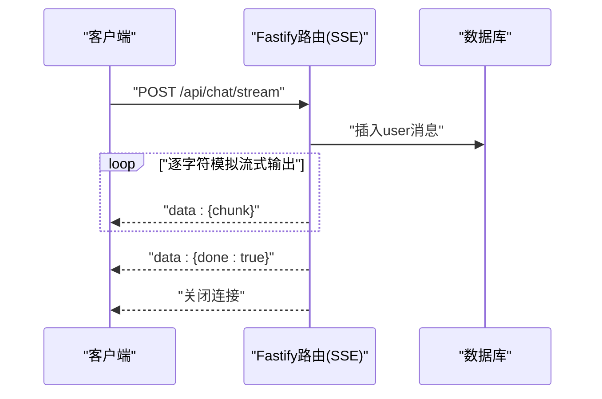
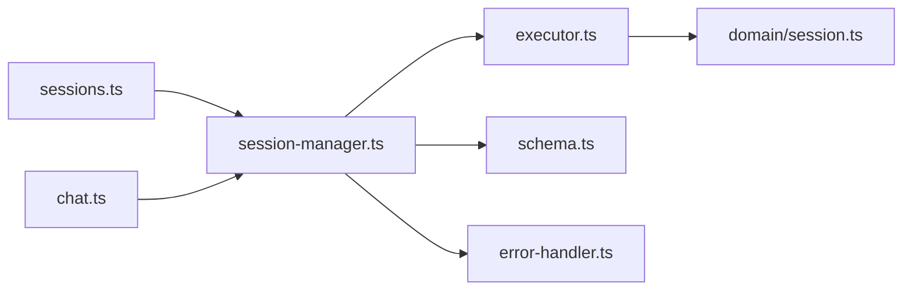

# 集成测试

<cite>
**本文引用的文件**
- [packages/api-server/test-full-flow.ts](file://packages/api-server/test-full-flow.ts)
- [packages/api-server/test-session-flow.ts](file://packages/api-server/test-session-flow.ts)
- [packages/api-server/test-full-welcome.ts](file://packages/api-server/test-full-welcome.ts)
- [packages/api-server/test-api.ps1](file://packages/api-server/test-api.ps1)
- [packages/api-server/src/services/session-manager.ts](file://packages/api-server/src/services/session-manager.ts)
- [packages/api-server/src/routes/chat.ts](file://packages/api-server/src/routes/chat.ts)
- [packages/api-server/src/routes/sessions.ts](file://packages/api-server/src/routes/sessions.ts)
- [packages/api-server/src/db/schema.ts](file://packages/api-server/src/db/schema.ts)
- [packages/api-server/src/utils/error-handler.ts](file://packages/api-server/src/utils/error-handler.ts)
- [packages/api-server/test-duplicate-import.ts](file://packages/api-server/test-duplicate-import.ts)
- [packages/api-server/test-import-api.ts](file://packages/api-server/test-import-api.ts)
- [packages/api-server/test-init-message.ts](file://packages/api-server/test-init-message.ts)
- [packages/api-server/test-new-config-import.ts](file://packages/api-server/test-new-config-import.ts)
- [packages/core-engine/src/domain/session.ts](file://packages/core-engine/src/domain/session.ts)
- [packages/core-engine/src/engines/script-execution/executor.ts](file://packages/core-engine/src/engines/script-execution/executor.ts)
</cite>

## 目录
1. [引言](#引言)
2. [项目结构](#项目结构)
3. [核心组件](#核心组件)
4. [架构总览](#架构总览)
5. [详细组件分析](#详细组件分析)
6. [依赖关系分析](#依赖关系分析)
7. [性能考虑](#性能考虑)
8. [故障排查指南](#故障排查指南)
9. [结论](#结论)
10. [附录](#附录)

## 引言
本文件面向 HeartRule AI 咨询引擎，提供一套完整的集成测试设计与实施指南。目标覆盖端到端会话流程、脚本执行流程、API 集成测试；明确会话管理服务的集成测试策略（创建、状态管理、数据持久化）；涵盖数据库连接、WebSocket 通信（SSE）、外部 API 调用等测试要点；给出测试环境搭建、测试数据准备与清理策略；设计测试场景、错误处理与性能基准测试方法，确保各组件协同工作与系统整体稳定性。

## 项目结构
本项目采用多包工作区组织，核心与 API 服务分离，便于独立演进与测试：
- packages/api-server：后端 API、数据库、会话管理与路由
- packages/core-engine：脚本解析与执行引擎
- packages/shared-types：共享类型与错误码
- packages/script-editor：前端脚本编辑器（与集成测试关联度较低）

图表来源
- [packages/api-server/src/services/session-manager.ts](file://packages/api-server/src/services/session-manager.ts#L1-L462)
- [packages/api-server/src/routes/sessions.ts](file://packages/api-server/src/routes/sessions.ts#L1-L548)
- [packages/api-server/src/routes/chat.ts](file://packages/api-server/src/routes/chat.ts#L1-L152)
- [packages/api-server/src/db/schema.ts](file://packages/api-server/src/db/schema.ts#L1-L219)
- [packages/core-engine/src/engines/script-execution/executor.ts](file://packages/core-engine/src/engines/script-execution/executor.ts#L1-L298)
- [packages/core-engine/src/domain/session.ts](file://packages/core-engine/src/domain/session.ts#L1-L137)

章节来源
- [packages/api-server/src/routes/sessions.ts](file://packages/api-server/src/routes/sessions.ts#L1-L548)
- [packages/api-server/src/routes/chat.ts](file://packages/api-server/src/routes/chat.ts#L1-L152)
- [packages/api-server/src/db/schema.ts](file://packages/api-server/src/db/schema.ts#L1-L219)
- [packages/core-engine/src/engines/script-execution/executor.ts](file://packages/core-engine/src/engines/script-execution/executor.ts#L1-L298)
- [packages/core-engine/src/domain/session.ts](file://packages/core-engine/src/domain/session.ts#L1-L137)

## 核心组件
- 会话管理服务（SessionManager）：封装脚本执行器与数据库交互，负责会话初始化、用户输入处理、状态持久化与错误包装。
- 路由层（Fastify）：提供 /api/sessions 与 /api/chat 等端点，校验请求、调用 SessionManager 并返回标准化响应。
- 数据库 Schema：定义 sessions、messages、scripts、variables 等表及索引，支撑会话状态、消息历史与变量快照。
- 脚本执行器（ScriptExecutor）：解析 YAML 脚本，按 Phase/Topic/Action 流程驱动执行，维护 ExecutionState。
- 错误处理工具：统一错误映射、上下文注入与恢复建议，保障 API 错误一致性。

章节来源
- [packages/api-server/src/services/session-manager.ts](file://packages/api-server/src/services/session-manager.ts#L1-L462)
- [packages/api-server/src/routes/sessions.ts](file://packages/api-server/src/routes/sessions.ts#L1-L548)
- [packages/api-server/src/routes/chat.ts](file://packages/api-server/src/routes/chat.ts#L1-L152)
- [packages/api-server/src/db/schema.ts](file://packages/api-server/src/db/schema.ts#L1-L219)
- [packages/core-engine/src/engines/script-execution/executor.ts](file://packages/core-engine/src/engines/script-execution/executor.ts#L1-L298)
- [packages/api-server/src/utils/error-handler.ts](file://packages/api-server/src/utils/error-handler.ts#L1-L233)

## 架构总览
下图展示从客户端到数据库的端到端调用链路，以及会话状态在 API、执行器与数据库之间的流转。

图表来源
- [packages/api-server/src/routes/sessions.ts](file://packages/api-server/src/routes/sessions.ts#L55-L133)
- [packages/api-server/src/routes/chat.ts](file://packages/api-server/src/routes/chat.ts#L44-L79)
- [packages/api-server/src/services/session-manager.ts](file://packages/api-server/src/services/session-manager.ts#L73-L253)
- [packages/core-engine/src/engines/script-execution/executor.ts](file://packages/core-engine/src/engines/script-execution/executor.ts#L46-L127)

## 详细组件分析

### 会话管理服务集成测试策略
- 目标：验证会话创建、初始化、多轮对话、状态推进与持久化、变量快照、错误包装。
- 关键路径：
  - 创建会话并初始化：检查返回的首条 AI 消息、executionStatus、position。
  - 多轮对话：用户输入触发脚本执行，验证 Action 推进、变量提取、消息持久化。
  - 状态持久化：数据库中 position、variables、metadata、executionStatus 与 conversationHistory 一致。
  - 错误处理：异常时返回 DetailedApiError，包含上下文与恢复建议。
- 测试用例参考：
  - 完整会话流程测试：[packages/api-server/test-full-flow.ts](file://packages/api-server/test-full-flow.ts#L1-L208)
  - 欢迎流程测试：[packages/api-server/test-full-welcome.ts](file://packages/api-server/test-full-welcome.ts#L1-L83)
  - 初始化消息测试：[packages/api-server/test-init-message.ts](file://packages/api-server/test-init-message.ts#L1-L75)

图表来源
- [packages/api-server/src/services/session-manager.ts](file://packages/api-server/src/services/session-manager.ts#L73-L253)
- [packages/api-server/test-full-flow.ts](file://packages/api-server/test-full-flow.ts#L16-L195)

章节来源
- [packages/api-server/src/services/session-manager.ts](file://packages/api-server/src/services/session-manager.ts#L1-L462)
- [packages/api-server/test-full-flow.ts](file://packages/api-server/test-full-flow.ts#L1-L208)
- [packages/api-server/test-full-welcome.ts](file://packages/api-server/test-full-welcome.ts#L1-L83)
- [packages/api-server/test-init-message.ts](file://packages/api-server/test-init-message.ts#L1-L75)

### 脚本执行流程测试
- 目标：验证脚本解析、Action 状态恢复、多轮对话推进、变量提取与消息生成。
- 方法：CLI 测试直接使用 ScriptExecutor，模拟从数据库恢复 ExecutionState，再执行用户输入，断言 Action 推进与消息内容。
- 测试用例参考：
  - 会话流程 CLI 测试：[packages/api-server/test-session-flow.ts](file://packages/api-server/test-session-flow.ts#L1-L140)

图表来源
- [packages/api-server/test-session-flow.ts](file://packages/api-server/test-session-flow.ts#L35-L117)
- [packages/core-engine/src/engines/script-execution/executor.ts](file://packages/core-engine/src/engines/script-execution/executor.ts#L46-L234)

章节来源
- [packages/api-server/test-session-flow.ts](file://packages/api-server/test-session-flow.ts#L1-L140)
- [packages/core-engine/src/engines/script-execution/executor.ts](file://packages/core-engine/src/engines/script-execution/executor.ts#L1-L298)

### API 集成测试
- 目标：验证 REST API 的端到端行为，包括会话创建、消息发送、SSE 流式响应占位、错误处理。
- 方法：PowerShell 脚本与 fetch 调用，覆盖创建会话、发送消息、获取消息历史、会话详情等。
- 测试用例参考：
  - PowerShell API 测试脚本：[packages/api-server/test-api.ps1](file://packages/api-server/test-api.ps1#L1-L99)
  - 导入脚本与调试流程：[packages/api-server/test-import-api.ts](file://packages/api-server/test-import-api.ts#L1-L119)
  - 重复导入（UPSERT）：[packages/api-server/test-duplicate-import.ts](file://packages/api-server/test-duplicate-import.ts#L1-L123)

图表来源
- [packages/api-server/src/routes/sessions.ts](file://packages/api-server/src/routes/sessions.ts#L55-L133)
- [packages/api-server/src/routes/chat.ts](file://packages/api-server/src/routes/chat.ts#L44-L79)
- [packages/api-server/test-api.ps1](file://packages/api-server/test-api.ps1#L20-L82)

章节来源
- [packages/api-server/test-api.ps1](file://packages/api-server/test-api.ps1#L1-L99)
- [packages/api-server/test-import-api.ts](file://packages/api-server/test-import-api.ts#L1-L119)
- [packages/api-server/test-duplicate-import.ts](file://packages/api-server/test-duplicate-import.ts#L1-L123)

### 数据库连接测试
- 目标：验证会话、消息、脚本、变量表的创建、查询与索引有效性。
- 方法：在测试中直接使用 db 查询 sessions/messages/scripts/variables，断言字段与索引存在。
- 测试用例参考：
  - 完整会话流程测试中对 sessions/messages 的查询与断言：[packages/api-server/test-full-flow.ts](file://packages/api-server/test-full-flow.ts#L148-L156)
  - Schema 定义与索引：[packages/api-server/src/db/schema.ts](file://packages/api-server/src/db/schema.ts#L22-L81)

图表来源
- [packages/api-server/src/db/schema.ts](file://packages/api-server/src/db/schema.ts#L22-L176)

章节来源
- [packages/api-server/test-full-flow.ts](file://packages/api-server/test-full-flow.ts#L148-L156)
- [packages/api-server/src/db/schema.ts](file://packages/api-server/src/db/schema.ts#L1-L219)

### WebSocket 通信测试（SSE）
- 目标：验证 /api/chat/stream 的 SSE 占位实现与错误回传。
- 方法：使用 curl 触发流式接口，观察 data: chunk 与 done 结束标记；异常时返回 data: error。
- 测试用例参考：
  - SSE 路由实现与模拟输出：[packages/api-server/src/routes/chat.ts](file://packages/api-server/src/routes/chat.ts#L82-L150)

图表来源
- [packages/api-server/src/routes/chat.ts](file://packages/api-server/src/routes/chat.ts#L82-L150)

章节来源
- [packages/api-server/src/routes/chat.ts](file://packages/api-server/src/routes/chat.ts#L1-L152)

### 外部 API 调用测试
- 目标：验证 LLM 服务可用性与错误映射，确保在执行器调用外部服务失败时返回统一错误。
- 方法：通过错误处理工具构建 DetailedApiError，并在 SessionManager 中返回，而非抛出异常。
- 测试用例参考：
  - 错误处理工具与错误映射：[packages/api-server/src/utils/error-handler.ts](file://packages/api-server/src/utils/error-handler.ts#L22-L71)
  - SessionManager 中的错误包装：[packages/api-server/src/services/session-manager.ts](file://packages/api-server/src/services/session-manager.ts#L235-L252)

章节来源
- [packages/api-server/src/utils/error-handler.ts](file://packages/api-server/src/utils/error-handler.ts#L1-L233)
- [packages/api-server/src/services/session-manager.ts](file://packages/api-server/src/services/session-manager.ts#L235-L252)

### 新配置项导入与验证测试
- 目标：验证 YAML 新配置项（如 require_acknowledgment、output 数组等）在导入后可被前端正确解析。
- 方法：读取 YAML、解析并断言关键字段存在；模拟前端解析逻辑输出结构化动作。
- 测试用例参考：
  - 新配置导入与验证：[packages/api-server/test-new-config-import.ts](file://packages/api-server/test-new-config-import.ts#L1-L126)

章节来源
- [packages/api-server/test-new-config-import.ts](file://packages/api-server/test-new-config-import.ts#L1-L126)

## 依赖关系分析
- SessionManager 依赖 ScriptExecutor、数据库 Schema、错误处理工具。
- 路由层依赖 SessionManager 与数据库 Schema。
- ScriptExecutor 依赖 Action 注册表与 YAML 解析器，间接依赖 LLM 服务。
- 数据库 Schema 定义了会话、消息、脚本、变量之间的外键关系与索引。

图表来源
- [packages/api-server/src/routes/sessions.ts](file://packages/api-server/src/routes/sessions.ts#L1-L548)
- [packages/api-server/src/routes/chat.ts](file://packages/api-server/src/routes/chat.ts#L1-L152)
- [packages/api-server/src/services/session-manager.ts](file://packages/api-server/src/services/session-manager.ts#L1-L462)
- [packages/core-engine/src/engines/script-execution/executor.ts](file://packages/core-engine/src/engines/script-execution/executor.ts#L1-L298)
- [packages/core-engine/src/domain/session.ts](file://packages/core-engine/src/domain/session.ts#L1-L137)
- [packages/api-server/src/db/schema.ts](file://packages/api-server/src/db/schema.ts#L1-L219)
- [packages/api-server/src/utils/error-handler.ts](file://packages/api-server/src/utils/error-handler.ts#L1-L233)

章节来源
- [packages/api-server/src/services/session-manager.ts](file://packages/api-server/src/services/session-manager.ts#L1-L462)
- [packages/core-engine/src/engines/script-execution/executor.ts](file://packages/core-engine/src/engines/script-execution/executor.ts#L1-L298)
- [packages/api-server/src/db/schema.ts](file://packages/api-server/src/db/schema.ts#L1-L219)

## 性能考虑
- 批量消息持久化：SessionManager 在每次执行后批量插入 assistant 消息，减少事务次数。
- 变量快照最小化：仅在变量发生变化时写入 variables 表，降低写放大。
- 索引优化：sessions 与 messages 表建立常用查询索引，提升会话详情与消息历史查询性能。
- SSE 流式输出：使用定时器模拟流式输出，实际部署中应替换为真实 LLM 流式响应。
- 并发与锁：高并发场景下注意数据库写入的幂等性与重试策略。

## 故障排查指南
- 会话未找到：检查 sessionId 是否正确，确认 /api/sessions 创建成功。
- 脚本未找到：确认脚本导入成功且 scriptId 有效。
- YAML 解析错误：检查脚本内容格式，参考新配置导入测试的断言方式。
- LLM 服务不可用：查看错误映射中的 LLM_SERVICE_ERROR，检查网络与服务可用性。
- 数据库操作失败：确认数据库连接、迁移与权限；检查索引与约束。
- 错误响应结构：统一使用 DetailedApiError，包含 code/type/message/details/context/recovery。

章节来源
- [packages/api-server/src/utils/error-handler.ts](file://packages/api-server/src/utils/error-handler.ts#L22-L71)
- [packages/api-server/src/services/session-manager.ts](file://packages/api-server/src/services/session-manager.ts#L235-L252)

## 结论
通过上述集成测试设计与实施方法，可系统性验证 HeartRule AI 咨询引擎在端到端会话流程、脚本执行、API 集成、数据库持久化、错误处理与外部服务调用等方面的稳定性与一致性。建议在 CI 中自动化执行这些测试，并结合性能基准测试持续监控系统表现。

## 附录

### 测试环境搭建
- 启动数据库与服务：使用 docker-compose 启动 PostgreSQL；启动 API 服务（监听端口见测试脚本）。
- 准备脚本：使用 import-script.ts 或导入 API 接口导入测试脚本。
- 执行测试：按需运行 PowerShell 脚本或 CLI 测试文件。

### 测试数据准备与清理
- 准备：在测试前导入所需脚本，创建会话并初始化；必要时预置初始变量。
- 清理：测试结束后删除临时会话与消息，或在测试框架中使用事务回滚（如 Vitest 支持）。

### 测试场景设计
- 正常流程：创建会话 → 初始化 → 多轮对话 → 完成。
- 边界条件：空输入、超长输入、重复输入、会话过期。
- 错误场景：脚本缺失、LLM 服务异常、数据库写入失败。
- 性能场景：高并发创建与对话、大数据量消息历史查询。

### 错误处理测试
- 断言错误码与类型：参考错误映射表，确保返回码与错误类型一致。
- 上下文注入：断言 DetailedApiError 中包含 scriptId/scriptName/sessionId/position/timestamp。
- 恢复建议：验证 canRetry/retryAction/suggestion 字段存在。

### 性能基准测试
- 场景：N 个并发会话同时进行 M 轮对话。
- 指标：平均响应时间、P95/P99 延迟、吞吐量、数据库写入 QPS。
- 工具：JMeter/Artillery/K6；结合数据库慢查询日志与服务端日志分析瓶颈。