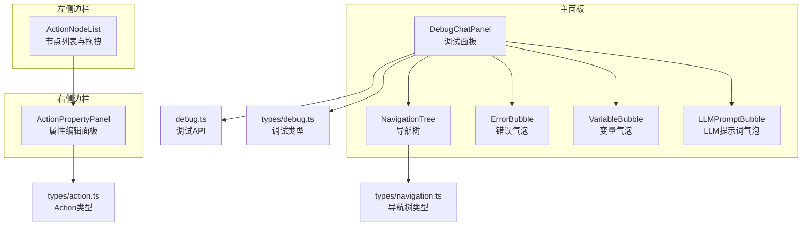
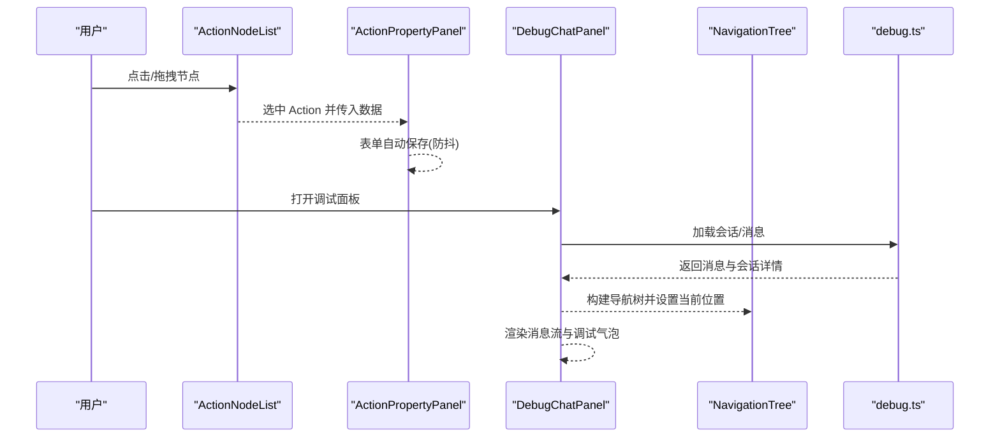
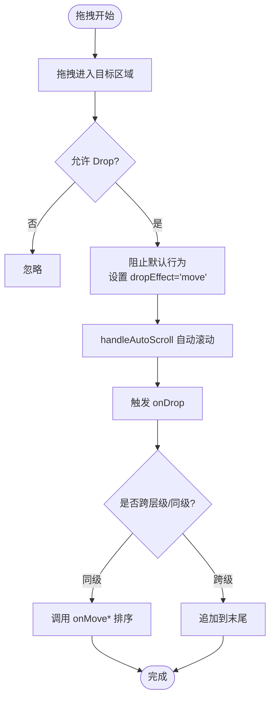
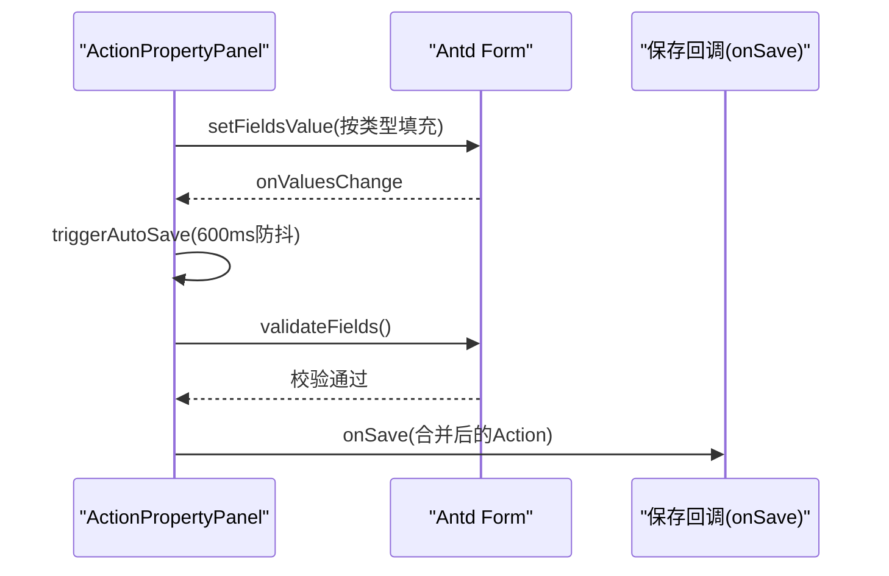
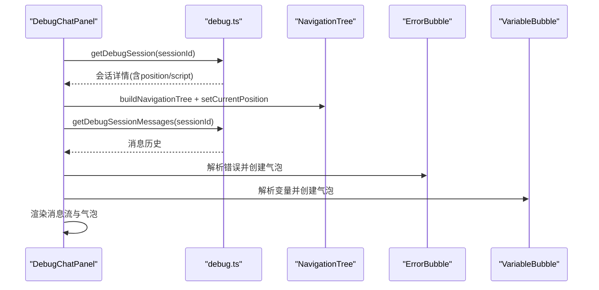
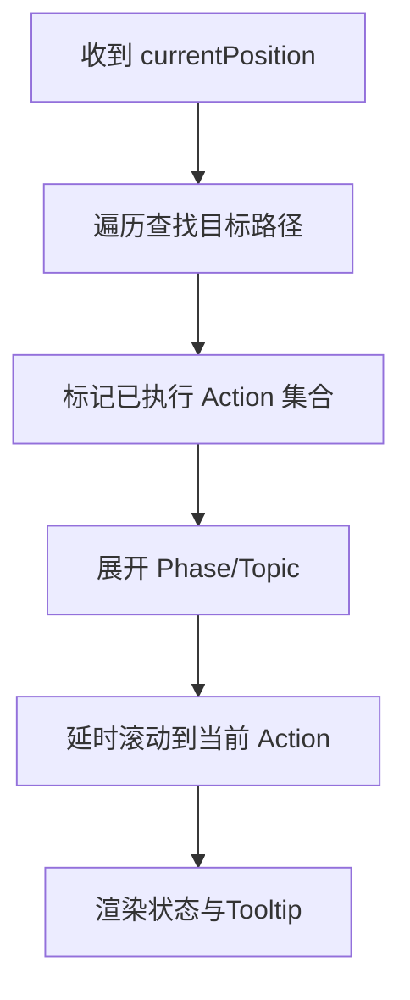
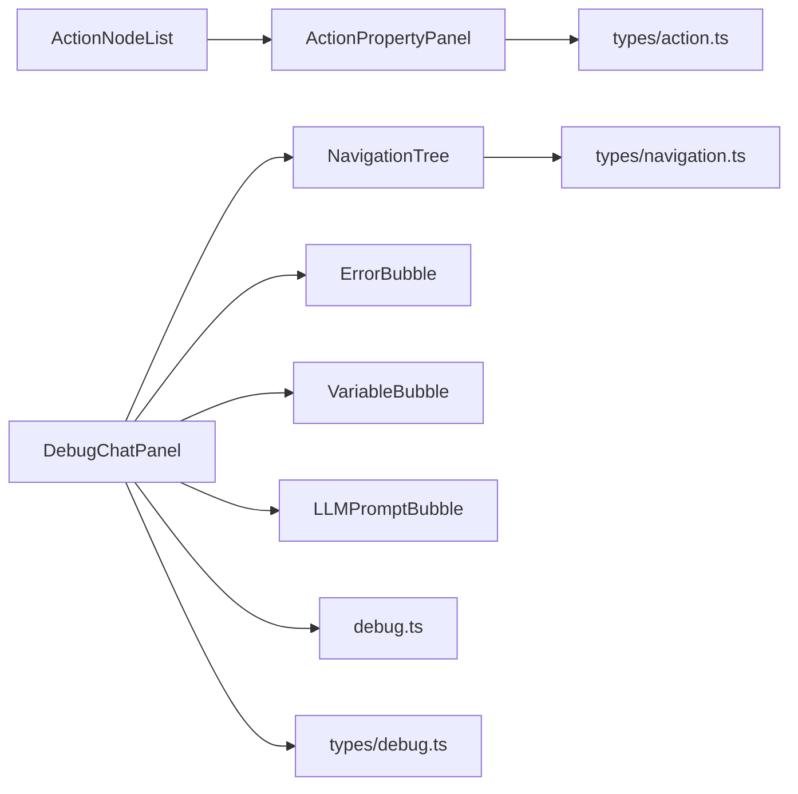

# 可视化组件

<cite>
**本文档引用的文件**
- [packages/script-editor/src/components/ActionNodeList/index.tsx](file://packages/script-editor/src/components/ActionNodeList/index.tsx)
- [packages/script-editor/src/components/ActionNodeList/style.css](file://packages/script-editor/src/components/ActionNodeList/style.css)
- [packages/script-editor/src/components/ActionPropertyPanel/index.tsx](file://packages/script-editor/src/components/ActionPropertyPanel/index.tsx)
- [packages/script-editor/src/components/ActionPropertyPanel/style.css](file://packages/script-editor/src/components/ActionPropertyPanel/style.css)
- [packages/script-editor/src/components/DebugChatPanel/index.tsx](file://packages/script-editor/src/components/DebugChatPanel/index.tsx)
- [packages/script-editor/src/components/DebugChatPanel/style.css](file://packages/script-editor/src/components/DebugChatPanel/style.css)
- [packages/script-editor/src/components/DebugBubbles/ErrorBubble.tsx](file://packages/script-editor/src/components/DebugBubbles/ErrorBubble.tsx)
- [packages/script-editor/src/components/DebugBubbles/VariableBubble.tsx](file://packages/script-editor/src/components/DebugBubbles/VariableBubble.tsx)
- [packages/script-editor/src/components/DebugBubbles/LLMPromptBubble.tsx](file://packages/script-editor/src/components/DebugBubbles/LLMPromptBubble.tsx)
- [packages/script-editor/src/components/NavigationTree/NavigationTree.tsx](file://packages/script-editor/src/components/NavigationTree/NavigationTree.tsx)
- [packages/script-editor/src/tabs/DebugFilterModal/DebugFilterModal.tsx](file://packages/script-editor/src/components/DebugFilterModal/DebugFilterModal.tsx)
- [packages/script-editor/src/api/debug.ts](file://packages/script-editor/src/api/debug.ts)
- [packages/script-editor/src/types/action.ts](file://packages/script-editor/src/types/action.ts)
- [packages/script-editor/src/types/debug.ts](file://packages/script-editor/src/types/debug.ts)
- [packages/script-editor/src/types/navigation.ts](file://packages/script-editor/src/types/navigation.ts)
- [packages/script-editor/src/utils/history-manager.ts](file://packages/script-editor/src/utils/history-manager.ts)
</cite>

## 目录
1. [简介](#简介)
2. [项目结构](#项目结构)
3. [核心组件](#核心组件)
4. [架构总览](#架构总览)
5. [详细组件分析](#详细组件分析)
6. [依赖关系分析](#依赖关系分析)
7. [性能考虑](#性能考虑)
8. [故障排查指南](#故障排查指南)
9. [结论](#结论)
10. [附录](#附录)

## 简介
本文件面向 HeartRule 脚本编辑器的可视化组件系统，聚焦以下能力：
- Action 节点列表的交互设计：节点拖拽、连接线绘制、节点类型管理
- 属性面板的数据绑定机制：表单控件、验证规则、实时预览
- 调试面板的实现原理：消息流显示、错误高亮、变量监控、导航树联动
- 导航树组件的使用指南：文件结构展示、快捷跳转、搜索定位
- 组件间通信机制、状态同步策略、性能优化方案

## 项目结构
可视化组件主要位于 packages/script-editor/src/components 下，按功能划分为：
- ActionNodeList：左侧 Action 节点列表与拖拽排序
- ActionPropertyPanel：右侧 Action 属性编辑面板
- DebugChatPanel：调试面板（含导航树、消息流、气泡）
- DebugBubbles：调试气泡（错误、变量、LLM 提示词等）
- NavigationTree：会话执行导航树
- DebugFilterModal：调试输出过滤器
- api/debug.ts：调试相关 API
- types/*：Action、调试、导航树类型定义
- utils/history-manager.ts：全局编辑历史管理（undo/redo）

图表来源
- [packages/script-editor/src/components/ActionNodeList/index.tsx](file://packages/script-editor/src/components/ActionNodeList/index.tsx#L1-L892)
- [packages/script-editor/src/components/ActionPropertyPanel/index.tsx](file://packages/script-editor/src/components/ActionPropertyPanel/index.tsx#L1-L607)
- [packages/script-editor/src/components/DebugChatPanel/index.tsx](file://packages/script-editor/src/components/DebugChatPanel/index.tsx#L1-L727)
- [packages/script-editor/src/components/NavigationTree/NavigationTree.tsx](file://packages/script-editor/src/components/NavigationTree/NavigationTree.tsx#L1-L279)
- [packages/script-editor/src/api/debug.ts](file://packages/script-editor/src/api/debug.ts#L1-L134)
- [packages/script-editor/src/types/action.ts](file://packages/script-editor/src/types/action.ts#L1-L126)
- [packages/script-editor/src/types/debug.ts](file://packages/script-editor/src/types/debug.ts#L1-L189)
- [packages/script-editor/src/types/navigation.ts](file://packages/script-editor/src/types/navigation.ts#L1-L67)

章节来源
- [packages/script-editor/src/components/ActionNodeList/index.tsx](file://packages/script-editor/src/components/ActionNodeList/index.tsx#L1-L892)
- [packages/script-editor/src/components/ActionPropertyPanel/index.tsx](file://packages/script-editor/src/components/ActionPropertyPanel/index.tsx#L1-L607)
- [packages/script-editor/src/components/DebugChatPanel/index.tsx](file://packages/script-editor/src/components/DebugChatPanel/index.tsx#L1-L727)
- [packages/script-editor/src/components/NavigationTree/NavigationTree.tsx](file://packages/script-editor/src/components/NavigationTree/NavigationTree.tsx#L1-L279)
- [packages/script-editor/src/api/debug.ts](file://packages/script-editor/src/api/debug.ts#L1-L134)
- [packages/script-editor/src/types/action.ts](file://packages/script-editor/src/types/action.ts#L1-L126)
- [packages/script-editor/src/types/debug.ts](file://packages/script-editor/src/types/debug.ts#L1-L189)
- [packages/script-editor/src/types/navigation.ts](file://packages/script-editor/src/types/navigation.ts#L1-L67)

## 核心组件
- ActionNodeList：提供四层结构（Phase/Topic/Action）的折叠面板、节点卡片、拖拽排序、自动滚动、高亮定位、图标/标签映射、内容预览与条件/输出等附加信息展示。
- ActionPropertyPanel：基于 Ant Design Form 的属性编辑器，按 Action 类型动态渲染表单域，支持自动保存（防抖）、字段校验、输出变量/输入参数的动态列表。
- DebugChatPanel：调试主面板，负责加载会话、渲染消息流、展示调试气泡、错误横幅、导航树联动、过滤器、重启会话等。
- NavigationTree：根据当前执行位置智能展开/滚动，高亮当前 Action，展示执行状态与配置摘要。
- DebugBubbles：错误、变量、LLM 提示词等气泡组件，支持展开/折叠、复制/导出、重启等操作。
- DebugFilterModal：调试输出过滤器配置，持久化存储。
- API 与类型：debug.ts 定义调试会话/消息 API；types/* 定义 Action、调试、导航树数据结构。

章节来源
- [packages/script-editor/src/components/ActionNodeList/index.tsx](file://packages/script-editor/src/components/ActionNodeList/index.tsx#L1-L892)
- [packages/script-editor/src/components/ActionPropertyPanel/index.tsx](file://packages/script-editor/src/components/ActionPropertyPanel/index.tsx#L1-L607)
- [packages/script-editor/src/components/DebugChatPanel/index.tsx](file://packages/script-editor/src/components/DebugChatPanel/index.tsx#L1-L727)
- [packages/script-editor/src/components/NavigationTree/NavigationTree.tsx](file://packages/script-editor/src/components/NavigationTree/NavigationTree.tsx#L1-L279)
- [packages/script-editor/src/components/DebugBubbles/ErrorBubble.tsx](file://packages/script-editor/src/components/DebugBubbles/ErrorBubble.tsx#L1-L205)
- [packages/script-editor/src/components/DebugBubbles/VariableBubble.tsx](file://packages/script-editor/src/components/DebugBubbles/VariableBubble.tsx#L1-L230)
- [packages/script-editor/src/components/DebugBubbles/LLMPromptBubble.tsx](file://packages/script-editor/src/components/DebugBubbles/LLMPromptBubble.tsx#L1-L176)
- [packages/script-editor/src/api/debug.ts](file://packages/script-editor/src/api/debug.ts#L1-L134)
- [packages/script-editor/src/types/action.ts](file://packages/script-editor/src/types/action.ts#L1-L126)
- [packages/script-editor/src/types/debug.ts](file://packages/script-editor/src/types/debug.ts#L1-L189)
- [packages/script-editor/src/types/navigation.ts](file://packages/script-editor/src/types/navigation.ts#L1-L67)

## 架构总览
可视化组件围绕“节点列表—属性面板—调试面板—导航树”的协作模式组织，数据自上而下传递，事件自下而上反馈，API 作为外部数据源驱动状态更新。

图表来源
- [packages/script-editor/src/components/ActionNodeList/index.tsx](file://packages/script-editor/src/components/ActionNodeList/index.tsx#L176-L445)
- [packages/script-editor/src/components/ActionPropertyPanel/index.tsx](file://packages/script-editor/src/components/ActionPropertyPanel/index.tsx#L33-L161)
- [packages/script-editor/src/components/DebugChatPanel/index.tsx](file://packages/script-editor/src/components/DebugChatPanel/index.tsx#L206-L324)
- [packages/script-editor/src/components/NavigationTree/NavigationTree.tsx](file://packages/script-editor/src/components/NavigationTree/NavigationTree.tsx#L27-L86)
- [packages/script-editor/src/api/debug.ts](file://packages/script-editor/src/api/debug.ts#L67-L114)

## 详细组件分析

### ActionNodeList 组件
- 交互设计
  - 四层折叠面板：Phase/T Topic/Action，支持头部拖拽排序与卡片内拖拽排序
  - 自动滚动：拖拽到容器边缘时自动滚动，提升长列表拖拽体验
  - 高亮定位：对外暴露 expandAndScrollTo，展开父级并滚动到目标节点，配合 focus-highlight 动画
  - 内容预览：根据 Action 类型提取内容进行截断预览，Tooltip 展示完整内容
  - 标签与图标：按 Action 类型映射图标与颜色，附加条件/退出/输出/列表/语气等标签
- 拖拽与连接线
  - 支持同级排序（Phase/Topic/Action）与跨级移动（Topic/Action 追加到末尾）
  - 通过 onDragStart/onDragOver/onDrop 事件链路实现，handleAutoScroll 控制滚动
  - 未实现可视化连线绘制，拖拽即为“移动/重组”语义
- 节点类型管理
  - 通过 getActionIcon/getActionTypeName/getActionTypeColor 实现类型到 UI 的映射
  - 通过 getActionContent 提取 Action 的主要内容用于预览
- 样式与交互细节
  - 隐藏滚动条、hover/selected 样式、拖拽光标、焦点高亮动画

图表来源
- [packages/script-editor/src/components/ActionNodeList/index.tsx](file://packages/script-editor/src/components/ActionNodeList/index.tsx#L303-L350)
- [packages/script-editor/src/components/ActionNodeList/index.tsx](file://packages/script-editor/src/components/ActionNodeList/index.tsx#L403-L444)
- [packages/script-editor/src/components/ActionNodeList/index.tsx](file://packages/script-editor/src/components/ActionNodeList/index.tsx#L556-L607)
- [packages/script-editor/src/components/ActionNodeList/index.tsx](file://packages/script-editor/src/components/ActionNodeList/index.tsx#L686-L744)
- [packages/script-editor/src/components/ActionNodeList/index.tsx](file://packages/script-editor/src/components/ActionNodeList/index.tsx#L701-L743)

章节来源
- [packages/script-editor/src/components/ActionNodeList/index.tsx](file://packages/script-editor/src/components/ActionNodeList/index.tsx#L176-L445)
- [packages/script-editor/src/components/ActionNodeList/style.css](file://packages/script-editor/src/components/ActionNodeList/style.css#L1-L158)

### ActionPropertyPanel 组件
- 数据绑定机制
  - 基于 Ant Design Form，根据 action.type 动态填充表单值与字段
  - 支持复杂结构：Form.List 动态渲染输出变量/输入参数卡片
  - 自动保存：triggerAutoSave 使用 600ms 防抖，onValuesChange 触发保存
  - 校验规则：各表单项设置 required 等规则，提交时统一校验
- 实时预览
  - 表单值变更即触发保存，无需手动点击“保存”
  - 通过 onSave 回调将更新后的 Action 传回上层，实现双向绑定
- 类型覆盖
  - 按 Action 类型合并/覆盖字段，确保仅渲染有效表单项

图表来源
- [packages/script-editor/src/components/ActionPropertyPanel/index.tsx](file://packages/script-editor/src/components/ActionPropertyPanel/index.tsx#L42-L84)
- [packages/script-editor/src/components/ActionPropertyPanel/index.tsx](file://packages/script-editor/src/components/ActionPropertyPanel/index.tsx#L144-L161)
- [packages/script-editor/src/components/ActionPropertyPanel/index.tsx](file://packages/script-editor/src/components/ActionPropertyPanel/index.tsx#L182-L141)

章节来源
- [packages/script-editor/src/components/ActionPropertyPanel/index.tsx](file://packages/script-editor/src/components/ActionPropertyPanel/index.tsx#L33-L161)
- [packages/script-editor/src/components/ActionPropertyPanel/style.css](file://packages/script-editor/src/components/ActionPropertyPanel/style.css#L1-L57)
- [packages/script-editor/src/types/action.ts](file://packages/script-editor/src/types/action.ts#L14-L87)

### DebugChatPanel 组件
- 消息流显示
  - 加载会话详情与消息历史，支持初始加载与错误兜底
  - 消息按时间顺序渲染，区分 AI/User/System 角色
- 错误高亮与横幅
  - 从响应中解析错误并创建 ErrorBubble，支持展开详情、复制、重启
  - 使用 ErrorBanner 展示错误概要，支持查看详情与重启
- 变量监控
  - 从响应中解析变量变化，创建 VariableBubble，支持导出 JSON
- 导航树联动
  - 根据会话详情构建 NavigationTree，设置 currentPosition 并智能展开
- 调试输出过滤器
  - DebugFilterModal 提供过滤器配置，支持展开/折叠全部气泡
- 重启与会话管理
  - 支持创建新会话并重置状态，保持 UI 一致性

图表来源
- [packages/script-editor/src/components/DebugChatPanel/index.tsx](file://packages/script-editor/src/components/DebugChatPanel/index.tsx#L206-L324)
- [packages/script-editor/src/components/DebugChatPanel/index.tsx](file://packages/script-editor/src/components/DebugChatPanel/index.tsx#L640-L672)
- [packages/script-editor/src/components/NavigationTree/NavigationTree.tsx](file://packages/script-editor/src/components/NavigationTree/NavigationTree.tsx#L70-L86)
- [packages/script-editor/src/api/debug.ts](file://packages/script-editor/src/api/debug.ts#L82-L113)

章节来源
- [packages/script-editor/src/components/DebugChatPanel/index.tsx](file://packages/script-editor/src/components/DebugChatPanel/index.tsx#L1-L727)
- [packages/script-editor/src/components/DebugChatPanel/style.css](file://packages/script-editor/src/components/DebugChatPanel/style.css#L1-L184)
- [packages/script-editor/src/components/DebugBubbles/ErrorBubble.tsx](file://packages/script-editor/src/components/DebugBubbles/ErrorBubble.tsx#L1-L205)
- [packages/script-editor/src/components/DebugBubbles/VariableBubble.tsx](file://packages/script-editor/src/components/DebugBubbles/VariableBubble.tsx#L1-L230)
- [packages/script-editor/src/components/DebugBubbles/LLMPromptBubble.tsx](file://packages/script-editor/src/components/DebugBubbles/LLMPromptBubble.tsx#L1-L176)
- [packages/script-editor/src/components/DebugFilterModal/DebugFilterModal.tsx](file://packages/script-editor/src/components/DebugFilterModal/DebugFilterModal.tsx#L1-L200)
- [packages/script-editor/src/api/debug.ts](file://packages/script-editor/src/api/debug.ts#L1-L134)
- [packages/script-editor/src/types/debug.ts](file://packages/script-editor/src/types/debug.ts#L1-L189)

### NavigationTree 组件
- 结构与状态
  - 四层结构：Session → Phase → Topic → Action
  - 支持智能展开：根据 currentPosition 自动展开当前路径
  - 执行状态可视化：当前执行、已执行、错误、未执行四种状态
- 交互与高亮
  - 点击展开/折叠，滚动到当前 Action
  - Tooltip 展示 Action ID、类型、状态与配置摘要
- 性能与体验
  - 延迟滚动等待 DOM 更新，避免闪烁
  - 状态集合 executedActions 用于快速判断执行历史

图表来源
- [packages/script-editor/src/components/NavigationTree/NavigationTree.tsx](file://packages/script-editor/src/components/NavigationTree/NavigationTree.tsx#L27-L86)

章节来源
- [packages/script-editor/src/components/NavigationTree/NavigationTree.tsx](file://packages/script-editor/src/components/NavigationTree/NavigationTree.tsx#L1-L279)
- [packages/script-editor/src/types/navigation.ts](file://packages/script-editor/src/types/navigation.ts#L1-L67)

### 调试气泡组件
- ErrorBubble：错误详情、堆栈、修复建议、执行位置、复制与重启
- VariableBubble：变量变化对比、分作用域展示、导出 JSON
- LLMPromptBubble：系统提示词、用户提示词、对话历史、复制

章节来源
- [packages/script-editor/src/components/DebugBubbles/ErrorBubble.tsx](file://packages/script-editor/src/components/DebugBubbles/ErrorBubble.tsx#L1-L205)
- [packages/script-editor/src/components/DebugBubbles/VariableBubble.tsx](file://packages/script-editor/src/components/DebugBubbles/VariableBubble.tsx#L1-L230)
- [packages/script-editor/src/components/DebugBubbles/LLMPromptBubble.tsx](file://packages/script-editor/src/components/DebugBubbles/LLMPromptBubble.tsx#L1-L176)

## 依赖关系分析
- 组件耦合
  - ActionNodeList 与 ActionPropertyPanel：通过选中 Action 与保存回调形成松耦合
  - DebugChatPanel 与 NavigationTree：通过会话详情构建导航树并共享 currentPosition
  - DebugChatPanel 与 DebugBubbles：按响应类型创建不同气泡，过滤器控制显示
- 外部依赖
  - Ant Design UI 组件库（Collapse、Form、Card、Button 等）
  - Axios 作为调试 API 客户端
- 类型契约
  - types/action.ts：Action 类型与字段约束
  - types/debug.ts：调试气泡与过滤器类型
  - types/navigation.ts：导航树与执行位置类型

图表来源
- [packages/script-editor/src/components/ActionNodeList/index.tsx](file://packages/script-editor/src/components/ActionNodeList/index.tsx#L1-L892)
- [packages/script-editor/src/components/ActionPropertyPanel/index.tsx](file://packages/script-editor/src/components/ActionPropertyPanel/index.tsx#L1-L607)
- [packages/script-editor/src/components/DebugChatPanel/index.tsx](file://packages/script-editor/src/components/DebugChatPanel/index.tsx#L1-L727)
- [packages/script-editor/src/components/NavigationTree/NavigationTree.tsx](file://packages/script-editor/src/components/NavigationTree/NavigationTree.tsx#L1-L279)
- [packages/script-editor/src/api/debug.ts](file://packages/script-editor/src/api/debug.ts#L1-L134)
- [packages/script-editor/src/types/action.ts](file://packages/script-editor/src/types/action.ts#L1-L126)
- [packages/script-editor/src/types/debug.ts](file://packages/script-editor/src/types/debug.ts#L1-L189)
- [packages/script-editor/src/types/navigation.ts](file://packages/script-editor/src/types/navigation.ts#L1-L67)

章节来源
- [packages/script-editor/src/types/action.ts](file://packages/script-editor/src/types/action.ts#L1-L126)
- [packages/script-editor/src/types/debug.ts](file://packages/script-editor/src/types/debug.ts#L1-L189)
- [packages/script-editor/src/types/navigation.ts](file://packages/script-editor/src/types/navigation.ts#L1-L67)

## 性能考虑
- 拖拽自动滚动
  - 使用 requestAnimationFrame 控制滚动帧率，避免高频重排
  - 停止滚动时及时 cancelAnimationFrame，防止资源泄漏
- 表单自动保存
  - 600ms 防抖降低保存频率，避免频繁写入
  - 仅在字段变更时触发，减少无效计算
- 消息与气泡渲染
  - 按过滤器条件渲染气泡，减少 DOM 节点数量
  - 滚动到底部使用延时，保证 DOM 更新后再滚动
- 导航树展开
  - 智能展开仅展开必要层级，避免一次性渲染过多节点
- 历史管理
  - HistoryManager 限制历史栈大小，避免内存膨胀
  - 深拷贝快照，避免引用污染

章节来源
- [packages/script-editor/src/components/ActionNodeList/index.tsx](file://packages/script-editor/src/components/ActionNodeList/index.tsx#L303-L350)
- [packages/script-editor/src/components/ActionPropertyPanel/index.tsx](file://packages/script-editor/src/components/ActionPropertyPanel/index.tsx#L144-L161)
- [packages/script-editor/src/components/DebugChatPanel/index.tsx](file://packages/script-editor/src/components/DebugChatPanel/index.tsx#L321-L324)
- [packages/script-editor/src/utils/history-manager.ts](file://packages/script-editor/src/utils/history-manager.ts#L44-L118)

## 故障排查指南
- 调试面板无消息
  - 检查 sessionId 是否存在，确认 getDebugSession 与 getDebugSessionMessages 请求是否成功
  - 若无历史消息，检查 initialMessage 是否注入
- 错误气泡未出现
  - 确认后端响应中是否包含 error 字段，检查 handleSendMessage 中的错误分支
- 导航树不展开
  - 检查 currentPosition 与 buildNavigationTree 的匹配逻辑
  - 确认 setExpandedPhases/setExpandedTopics 的更新时机
- 属性面板不保存
  - 检查 triggerAutoSave 是否被调用，validateFields 是否通过
  - 确认 onSave 回调是否正确接收并应用更新
- 拖拽无效
  - 检查 onMove* 回调是否传入，draggedItem 是否正确设置
  - 确认 preventDefault/stopPropagation 是否在 onDragOver/onDrop 中生效

章节来源
- [packages/script-editor/src/components/DebugChatPanel/index.tsx](file://packages/script-editor/src/components/DebugChatPanel/index.tsx#L206-L324)
- [packages/script-editor/src/components/DebugChatPanel/index.tsx](file://packages/script-editor/src/components/DebugChatPanel/index.tsx#L375-L491)
- [packages/script-editor/src/components/NavigationTree/NavigationTree.tsx](file://packages/script-editor/src/components/NavigationTree/NavigationTree.tsx#L27-L86)
- [packages/script-editor/src/components/ActionPropertyPanel/index.tsx](file://packages/script-editor/src/components/ActionPropertyPanel/index.tsx#L144-L161)
- [packages/script-editor/src/components/ActionNodeList/index.tsx](file://packages/script-editor/src/components/ActionNodeList/index.tsx#L403-L444)

## 结论
本可视化组件体系以“节点列表—属性面板—调试面板—导航树”为核心交互链路，结合类型安全与 API 驱动的状态管理，实现了高效、直观的脚本编辑与调试体验。通过防抖保存、自动滚动、智能展开与过滤器等优化手段，在复杂脚本场景下仍能保持良好性能与可用性。

## 附录
- 组件间通信机制
  - ActionNodeList 与 ActionPropertyPanel：通过选中回调与保存回调实现数据单向流动
  - DebugChatPanel 与 NavigationTree：通过会话详情与当前位置实现状态同步
  - DebugChatPanel 与 DebugBubbles：通过响应解析与过滤器实现条件渲染
- 状态同步策略
  - 以 sessionId 为边界，会话级状态集中管理
  - currentPosition 作为导航树与调试面板的同步锚点
  - 过滤器状态本地持久化，提升调试效率
- 性能优化方案
  - 防抖/节流、requestAnimationFrame、深拷贝快照、DOM 懒渲染、滚动优化