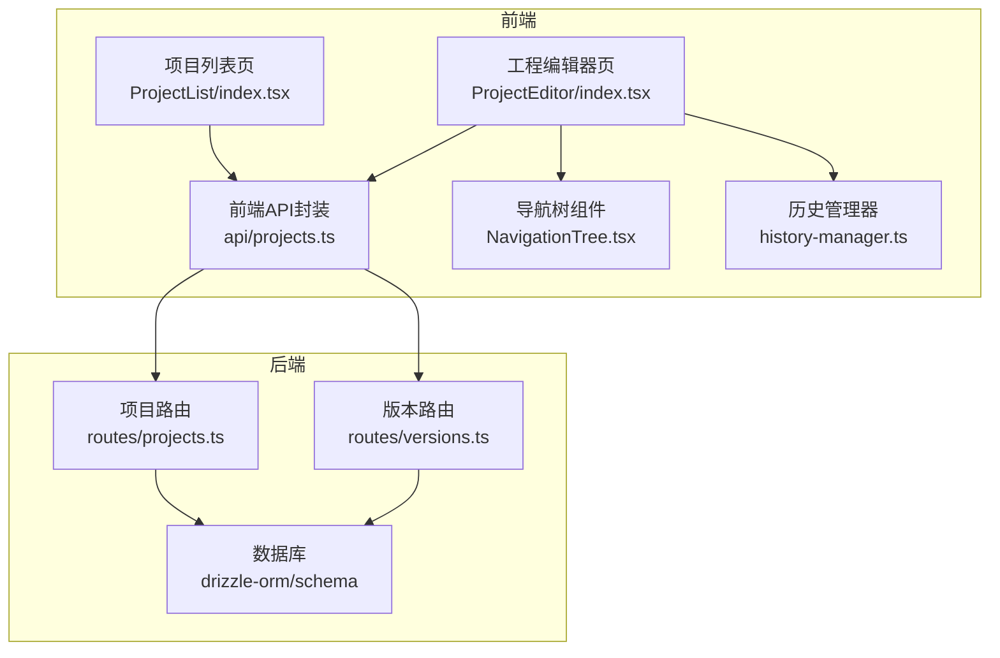
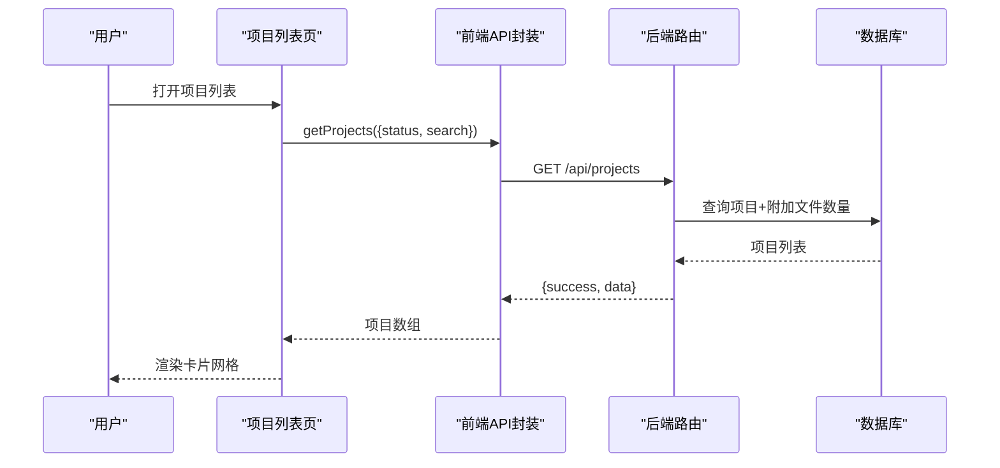
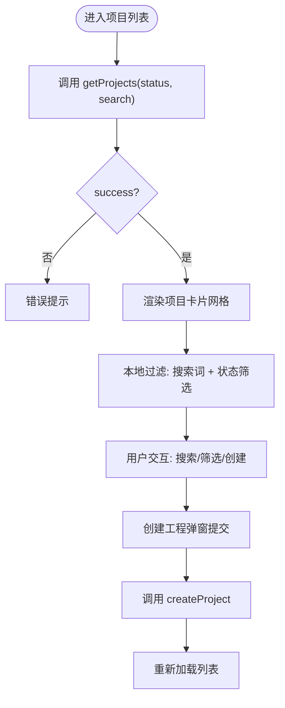
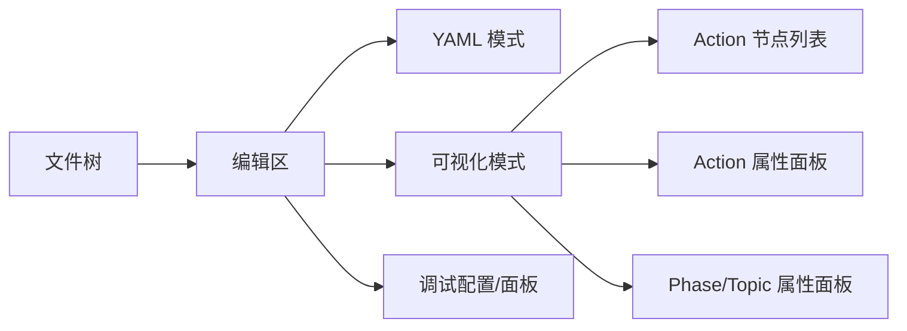
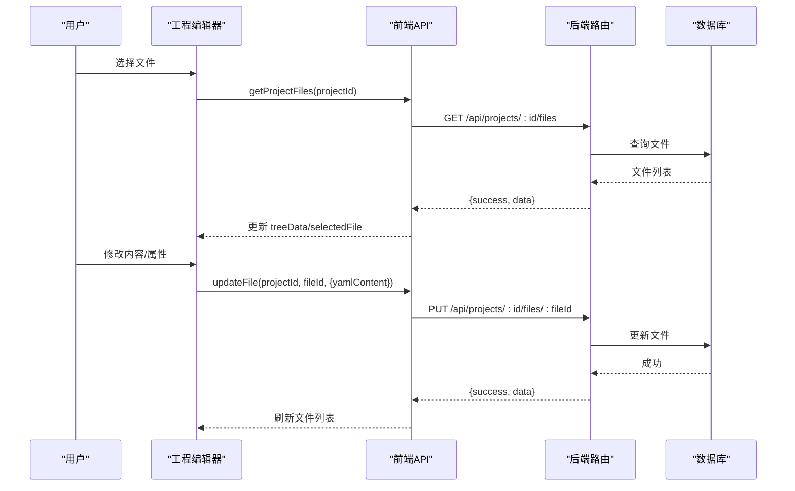
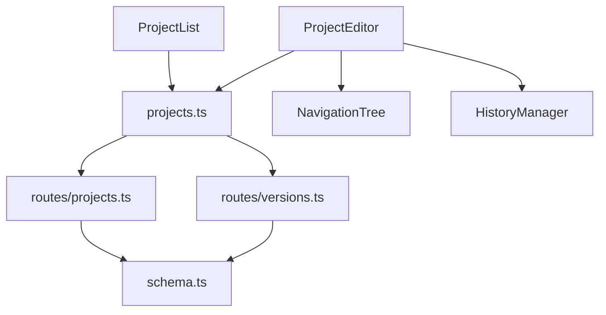

# 工程管理

<cite>
**本文引用的文件**
- [packages/script-editor/src/pages/ProjectList/index.tsx](file://packages/script-editor/src/pages/ProjectList/index.tsx)
- [packages/script-editor/src/pages/ProjectEditor/index.tsx](file://packages/script-editor/src/pages/ProjectEditor/index.tsx)
- [packages/script-editor/src/api/projects.ts](file://packages/script-editor/src/api/projects.ts)
- [packages/api-server/src/routes/projects.ts](file://packages/api-server/src/routes/projects.ts)
- [packages/api-server/src/routes/versions.ts](file://packages/api-server/src/routes/versions.ts)
- [packages/script-editor/src/components/NavigationTree/NavigationTree.tsx](file://packages/script-editor/src/components/NavigationTree/NavigationTree.tsx)
- [packages/script-editor/src/utils/history-manager.ts](file://packages/script-editor/src/utils/history-manager.ts)
- [packages/script-editor/src/types/navigation.ts](file://packages/script-editor/src/types/navigation.ts)
- [packages/script-editor/src/components/ActionNodeList/index.tsx](file://packages/script-editor/src/components/ActionNodeList/index.tsx)
- [packages/script-editor/src/components/ActionPropertyPanel/index.tsx](file://packages/script-editor/src/components/ActionPropertyPanel/index.tsx)
- [packages/script-editor/src/components/PhaseTopicPropertyPanel/index.tsx](file://packages/script-editor/src/components/PhaseTopicPropertyPanel/index.tsx)
- [packages/script-editor/src/types/action.ts](file://packages/script-editor/src/types/action.ts)
</cite>

## 目录
1. [简介](#简介)
2. [项目结构](#项目结构)
3. [核心组件](#核心组件)
4. [架构总览](#架构总览)
5. [详细组件分析](#详细组件分析)
6. [依赖关系分析](#依赖关系分析)
7. [性能考量](#性能考量)
8. [故障排查指南](#故障排查指南)
9. [结论](#结论)
10. [附录](#附录)

## 简介
本章节面向 HeartRule 脚本编辑器的“工程管理”能力，聚焦以下目标：
- 项目列表页面：项目数据获取、展示、排序、搜索过滤的实现逻辑
- 工程编辑器：可视化界面设计（文件树、编辑区、工具栏）、文件管理操作流程（创建、编辑、保存、删除）
- API 使用：项目 CRUD、文件上传/下载、版本控制（草稿、发布、回滚、对比）
- 用户体验优化与错误处理机制

## 项目结构
前端采用 React + Ant Design，后端基于 Fastify + Drizzle ORM。工程管理涉及三层：
- 前端页面层：项目列表页、工程编辑器页
- 前端 API 层：封装 /api 路由的 projects.ts、versions.ts
- 后端路由层：/api/projects、/api/projects/:id/files、/api/projects/:id/publish、/api/projects/:id/versions 等

图表来源
- [packages/script-editor/src/pages/ProjectList/index.tsx](file://packages/script-editor/src/pages/ProjectList/index.tsx#L1-L356)
- [packages/script-editor/src/pages/ProjectEditor/index.tsx](file://packages/script-editor/src/pages/ProjectEditor/index.tsx#L1-L800)
- [packages/script-editor/src/api/projects.ts](file://packages/script-editor/src/api/projects.ts#L1-L246)
- [packages/api-server/src/routes/projects.ts](file://packages/api-server/src/routes/projects.ts#L1-L500)
- [packages/api-server/src/routes/versions.ts](file://packages/api-server/src/routes/versions.ts#L1-L407)

章节来源
- [packages/script-editor/src/pages/ProjectList/index.tsx](file://packages/script-editor/src/pages/ProjectList/index.tsx#L1-L356)
- [packages/script-editor/src/pages/ProjectEditor/index.tsx](file://packages/script-editor/src/pages/ProjectEditor/index.tsx#L1-L800)
- [packages/script-editor/src/api/projects.ts](file://packages/script-editor/src/api/projects.ts#L1-L246)
- [packages/api-server/src/routes/projects.ts](file://packages/api-server/src/routes/projects.ts#L1-L500)
- [packages/api-server/src/routes/versions.ts](file://packages/api-server/src/routes/versions.ts#L1-L407)

## 核心组件
- 项目列表页：负责加载项目、搜索过滤、状态筛选、创建工程弹窗、批量操作菜单
- 工程编辑器页：负责工程与文件数据加载、文件树构建、编辑模式切换（YAML/可视化）、保存、发布版本、调试
- 前端 API 封装：统一 /api 前缀，提供项目、文件、版本相关方法
- 后端路由：实现项目 CRUD、文件 CRUD、版本草稿/发布/回滚/对比
- 导航树组件：展示脚本执行的四层结构（Phase/Topic/Action），高亮当前执行节点
- 历史管理器：跨文件的撤销/重做与焦点导航

章节来源
- [packages/script-editor/src/pages/ProjectList/index.tsx](file://packages/script-editor/src/pages/ProjectList/index.tsx#L39-L356)
- [packages/script-editor/src/pages/ProjectEditor/index.tsx](file://packages/script-editor/src/pages/ProjectEditor/index.tsx#L68-L800)
- [packages/script-editor/src/api/projects.ts](file://packages/script-editor/src/api/projects.ts#L54-L245)
- [packages/api-server/src/routes/projects.ts](file://packages/api-server/src/routes/projects.ts#L26-L497)
- [packages/api-server/src/routes/versions.ts](file://packages/api-server/src/routes/versions.ts#L20-L407)
- [packages/script-editor/src/components/NavigationTree/NavigationTree.tsx](file://packages/script-editor/src/components/NavigationTree/NavigationTree.tsx#L21-L279)
- [packages/script-editor/src/utils/history-manager.ts](file://packages/script-editor/src/utils/history-manager.ts#L44-L340)

## 架构总览
前端通过 axios 请求 /api，后端路由根据 URL 与方法映射到数据库操作，返回统一的 success/data/error 结构。

图表来源
- [packages/script-editor/src/pages/ProjectList/index.tsx](file://packages/script-editor/src/pages/ProjectList/index.tsx#L53-L74)
- [packages/script-editor/src/api/projects.ts](file://packages/script-editor/src/api/projects.ts#L54-L66)
- [packages/api-server/src/routes/projects.ts](file://packages/api-server/src/routes/projects.ts#L27-L85)

章节来源
- [packages/script-editor/src/pages/ProjectList/index.tsx](file://packages/script-editor/src/pages/ProjectList/index.tsx#L48-L74)
- [packages/script-editor/src/api/projects.ts](file://packages/script-editor/src/api/projects.ts#L54-L66)
- [packages/api-server/src/routes/projects.ts](file://packages/api-server/src/routes/projects.ts#L27-L85)

## 详细组件分析

### 项目列表页面实现逻辑
- 数据获取：首次挂载触发 loadProjects，调用 projectsApi.getProjects，支持 status/search 参数
- 展示排序：后端按 updatedAt 降序返回，前端不做二次排序
- 搜索过滤：前端本地过滤（项目名/描述包含关键词）与后端搜索条件组合
- 状态筛选：下拉选择 draft/published/archived/all
- 创建工程：弹窗收集 projectName/description/engineVersion/tags，调用 projectsApi.createProject
- 批量操作：右上角更多菜单（编辑、查看文件、复制、归档）

图表来源
- [packages/script-editor/src/pages/ProjectList/index.tsx](file://packages/script-editor/src/pages/ProjectList/index.tsx#L48-L179)
- [packages/script-editor/src/api/projects.ts](file://packages/script-editor/src/api/projects.ts#L54-L91)

章节来源
- [packages/script-editor/src/pages/ProjectList/index.tsx](file://packages/script-editor/src/pages/ProjectList/index.tsx#L39-L356)
- [packages/script-editor/src/api/projects.ts](file://packages/script-editor/src/api/projects.ts#L54-L126)

### 工程编辑器可视化界面设计
- 布局：左侧文件树（Ant Design Tree），右侧编辑区（YAML/可视化二选一）
- 文件树：按 fileType 分类，会话脚本单独文件夹；点击叶子节点加载对应文件内容
- 编辑模式：
  - YAML 模式：TextArea 直接编辑 YAML
  - 可视化模式：ActionNodeList + ActionPropertyPanel + PhaseTopicPropertyPanel
- 工具栏：保存、发布、调试、返回列表等按钮
- 调试：支持启动调试会话、显示调试面板、导航树高亮当前执行节点

图表来源
- [packages/script-editor/src/pages/ProjectEditor/index.tsx](file://packages/script-editor/src/pages/ProjectEditor/index.tsx#L68-L800)
- [packages/script-editor/src/components/ActionNodeList/index.tsx](file://packages/script-editor/src/components/ActionNodeList/index.tsx#L176-L200)
- [packages/script-editor/src/components/ActionPropertyPanel/index.tsx](file://packages/script-editor/src/components/ActionPropertyPanel/index.tsx#L33-L200)
- [packages/script-editor/src/components/PhaseTopicPropertyPanel/index.tsx](file://packages/script-editor/src/components/PhaseTopicPropertyPanel/index.tsx#L28-L200)
- [packages/script-editor/src/components/NavigationTree/NavigationTree.tsx](file://packages/script-editor/src/components/NavigationTree/NavigationTree.tsx#L21-L279)

章节来源
- [packages/script-editor/src/pages/ProjectEditor/index.tsx](file://packages/script-editor/src/pages/ProjectEditor/index.tsx#L68-L800)
- [packages/script-editor/src/components/ActionNodeList/index.tsx](file://packages/script-editor/src/components/ActionNodeList/index.tsx#L176-L200)
- [packages/script-editor/src/components/ActionPropertyPanel/index.tsx](file://packages/script-editor/src/components/ActionPropertyPanel/index.tsx#L33-L200)
- [packages/script-editor/src/components/PhaseTopicPropertyPanel/index.tsx](file://packages/script-editor/src/components/PhaseTopicPropertyPanel/index.tsx#L28-L200)
- [packages/script-editor/src/components/NavigationTree/NavigationTree.tsx](file://packages/script-editor/src/components/NavigationTree/NavigationTree.tsx#L21-L279)

### 文件管理操作流程
- 加载工程与文件：Promise.all 并行获取工程详情与文件列表，构建文件树
- 切换文件：若当前文件有未保存更改，弹出确认框；否则加载新文件并更新 URL
- 编辑与保存：
  - YAML 模式：textarea 变更后 setHasUnsavedChanges，手动保存
  - 可视化模式：Action/Topic/Phase 属性变更触发自动保存（防抖）
- 删除文件：调用 projectsApi.deleteFile，刷新文件列表
- 会话脚本特殊处理：默认进入可视化模式，支持 YAML 与可视化双向同步

图表来源
- [packages/script-editor/src/pages/ProjectEditor/index.tsx](file://packages/script-editor/src/pages/ProjectEditor/index.tsx#L419-L460)
- [packages/script-editor/src/pages/ProjectEditor/index.tsx](file://packages/script-editor/src/pages/ProjectEditor/index.tsx#L515-L538)
- [packages/script-editor/src/pages/ProjectEditor/index.tsx](file://packages/script-editor/src/pages/ProjectEditor/index.tsx#L556-L583)
- [packages/script-editor/src/api/projects.ts](file://packages/script-editor/src/api/projects.ts#L128-L173)
- [packages/api-server/src/routes/projects.ts](file://packages/api-server/src/routes/projects.ts#L340-L496)

章节来源
- [packages/script-editor/src/pages/ProjectEditor/index.tsx](file://packages/script-editor/src/pages/ProjectEditor/index.tsx#L419-L583)
- [packages/script-editor/src/api/projects.ts](file://packages/script-editor/src/api/projects.ts#L128-L173)
- [packages/api-server/src/routes/projects.ts](file://packages/api-server/src/routes/projects.ts#L340-L496)

### API 接口使用方法
- 项目 CRUD
  - GET /api/projects → 获取项目列表（支持 status/search/author）
  - GET /api/projects/:id → 获取项目详情（含 files/draft/versions）
  - POST /api/projects → 创建项目（默认生成 global/roles/skills 三类文件与草稿）
  - PUT /api/projects/:id → 更新项目
  - DELETE /api/projects/:id → 归档项目
  - POST /api/projects/:id/copy → 复制项目
- 文件 CRUD
  - GET /api/projects/:id/files → 获取文件列表
  - GET /api/projects/:id/files/:fileId → 获取单个文件
  - POST /api/projects/:id/files → 创建文件
  - PUT /api/projects/:id/files/:fileId → 更新文件（支持 yamlContent）
  - DELETE /api/projects/:id/files/:fileId → 删除文件
- 版本管理
  - GET /api/projects/:id/draft → 获取草稿
  - PUT /api/projects/:id/draft → 保存草稿
  - POST /api/projects/:id/publish → 发布版本（生成新版本并更新项目状态）
  - GET /api/projects/:id/versions → 获取版本历史
  - GET /api/projects/:id/versions/:versionId → 获取单个版本
  - POST /api/projects/:id/rollback → 回滚到指定版本
  - GET /api/projects/:id/versions/:versionId/diff → 版本对比（默认与前一版本）

章节来源
- [packages/script-editor/src/api/projects.ts](file://packages/script-editor/src/api/projects.ts#L54-L245)
- [packages/api-server/src/routes/projects.ts](file://packages/api-server/src/routes/projects.ts#L26-L497)
- [packages/api-server/src/routes/versions.ts](file://packages/api-server/src/routes/versions.ts#L20-L407)

### 用户体验优化与错误处理
- 体验优化
  - 项目列表：搜索/筛选即时生效；创建工程弹窗表单校验与默认值
  - 工程编辑器：快捷键 Ctrl+S 保存；未保存更改切换文件时确认；可视化模式自动保存（防抖）
  - 导航树：自动展开当前执行路径并滚动居中；执行中/已执行/错误状态高亮
  - 历史管理：跨文件撤销/重做，支持焦点路径记录
- 错误处理
  - 前端：try/catch 包裹 API 调用，统一 message 提示；加载/保存状态 Spin
  - 后端：Zod 校验请求体，400/404/500 统一返回 {success, error}

章节来源
- [packages/script-editor/src/pages/ProjectList/index.tsx](file://packages/script-editor/src/pages/ProjectList/index.tsx#L53-L74)
- [packages/script-editor/src/pages/ProjectEditor/index.tsx](file://packages/script-editor/src/pages/ProjectEditor/index.tsx#L617-L630)
- [packages/script-editor/src/components/NavigationTree/NavigationTree.tsx](file://packages/script-editor/src/components/NavigationTree/NavigationTree.tsx#L27-L86)
- [packages/script-editor/src/utils/history-manager.ts](file://packages/script-editor/src/utils/history-manager.ts#L53-L118)
- [packages/api-server/src/routes/projects.ts](file://packages/api-server/src/routes/projects.ts#L132-L193)
- [packages/api-server/src/routes/versions.ts](file://packages/api-server/src/routes/versions.ts#L117-L199)

## 依赖关系分析
- 页面依赖 API 封装，API 封装依赖后端路由
- 工程编辑器依赖导航树与历史管理器，可视化编辑依赖 Action/Phase/Topic 属性面板
- 后端路由依赖 Drizzle ORM 与数据库 schema

图表来源
- [packages/script-editor/src/pages/ProjectList/index.tsx](file://packages/script-editor/src/pages/ProjectList/index.tsx#L31-L32)
- [packages/script-editor/src/pages/ProjectEditor/index.tsx](file://packages/script-editor/src/pages/ProjectEditor/index.tsx#L41-L51)
- [packages/script-editor/src/api/projects.ts](file://packages/script-editor/src/api/projects.ts#L1-L246)
- [packages/api-server/src/routes/projects.ts](file://packages/api-server/src/routes/projects.ts#L1-L500)
- [packages/api-server/src/routes/versions.ts](file://packages/api-server/src/routes/versions.ts#L1-L407)

章节来源
- [packages/script-editor/src/pages/ProjectList/index.tsx](file://packages/script-editor/src/pages/ProjectList/index.tsx#L31-L32)
- [packages/script-editor/src/pages/ProjectEditor/index.tsx](file://packages/script-editor/src/pages/ProjectEditor/index.tsx#L41-L51)
- [packages/script-editor/src/api/projects.ts](file://packages/script-editor/src/api/projects.ts#L1-L246)
- [packages/api-server/src/routes/projects.ts](file://packages/api-server/src/routes/projects.ts#L1-L500)
- [packages/api-server/src/routes/versions.ts](file://packages/api-server/src/routes/versions.ts#L1-L407)

## 性能考量
- 列表加载：后端按 updatedAt 降序，前端不做额外排序；搜索在前端进行，建议大数据量时考虑后端分页与模糊索引
- 并行加载：工程详情与文件列表使用 Promise.all，减少往返时间
- 可视化编辑：YAML 实时解析仅在会话脚本场景触发，避免频繁解析影响性能
- 历史管理：限制历史栈大小（默认 100），深拷贝前后状态，注意内存占用

## 故障排查指南
- 项目列表空白
  - 检查 getProjects 请求是否返回 success=true
  - 确认后端 /api/projects 路由与数据库连接正常
- 保存失败
  - 核对 updateFile 请求体（yamlContent/fileName/fileContent）
  - 查看后端 PUT /api/projects/:id/files/:fileId 的 404/500 响应
- 发布版本异常
  - 确认草稿存在且文件齐全
  - 检查 /api/projects/:id/publish 的 Zod 校验与数据库写入
- 可视化编辑不生效
  - 确认当前文件为 session 类型且 YAML 可解析
  - 检查 ActionPropertyPanel/PhaseTopicPropertyPanel 的自动保存触发逻辑

章节来源
- [packages/script-editor/src/pages/ProjectList/index.tsx](file://packages/script-editor/src/pages/ProjectList/index.tsx#L53-L74)
- [packages/script-editor/src/pages/ProjectEditor/index.tsx](file://packages/script-editor/src/pages/ProjectEditor/index.tsx#L556-L583)
- [packages/api-server/src/routes/projects.ts](file://packages/api-server/src/routes/projects.ts#L427-L466)
- [packages/api-server/src/routes/versions.ts](file://packages/api-server/src/routes/versions.ts#L117-L199)

## 结论
工程管理模块以清晰的页面职责划分与前后端协作方式，实现了项目与文件的全生命周期管理。前端通过统一 API 封装屏蔽后端细节，后端通过路由与 Drizzle ORM 提供稳定的数据访问。可视化编辑与历史管理进一步提升了编辑效率与可靠性。建议后续在大数据量场景下引入后端分页与缓存策略，并完善版本对比的差异化算法。

## 附录
- 数据模型要点
  - 项目：包含状态、引擎版本、作者、标签、文件数量等
  - 文件：按 fileType 分类（global/roles/skills/session 等），支持 yamlContent 与 fileContent
  - 版本：记录版本号、发布说明、发布时间、发布者、回滚标记与回滚来源

章节来源
- [packages/script-editor/src/api/projects.ts](file://packages/script-editor/src/api/projects.ts#L5-L51)
- [packages/api-server/src/routes/projects.ts](file://packages/api-server/src/routes/projects.ts#L340-L362)
- [packages/api-server/src/routes/versions.ts](file://packages/api-server/src/routes/versions.ts#L201-L253)