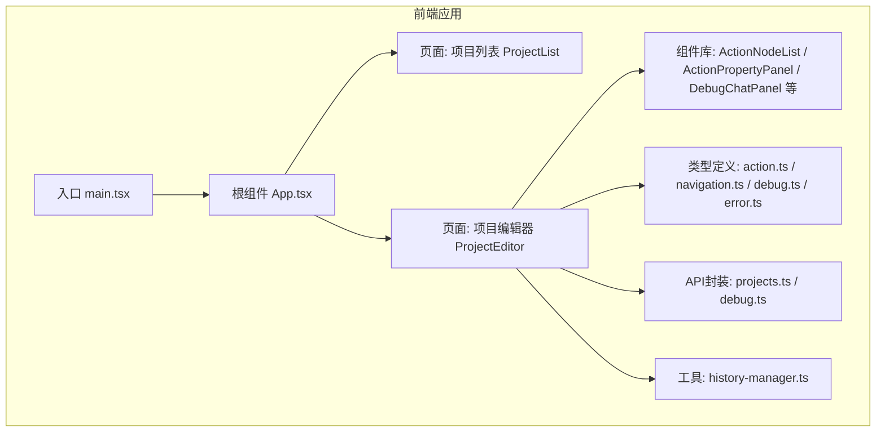
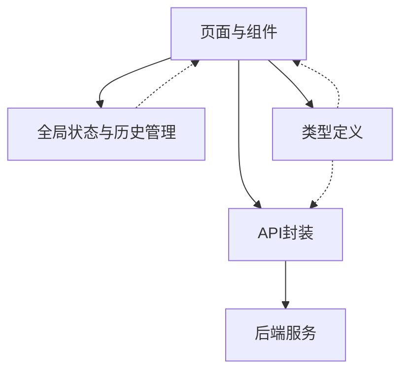
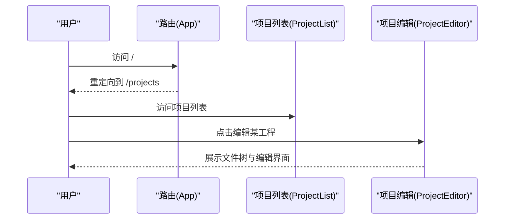
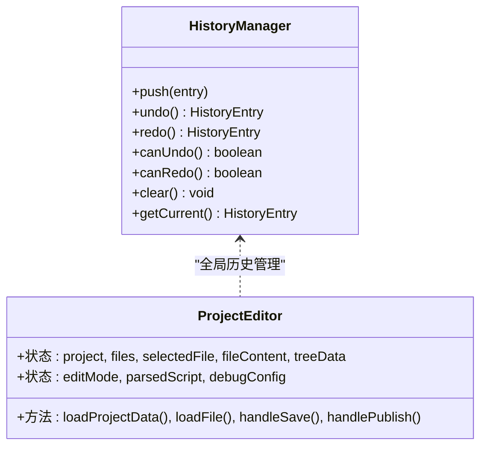
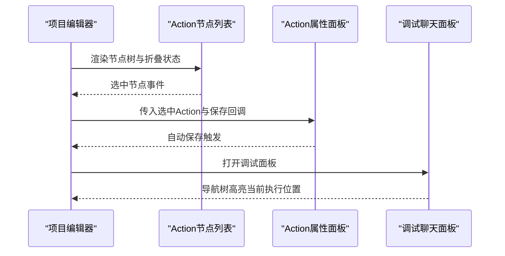
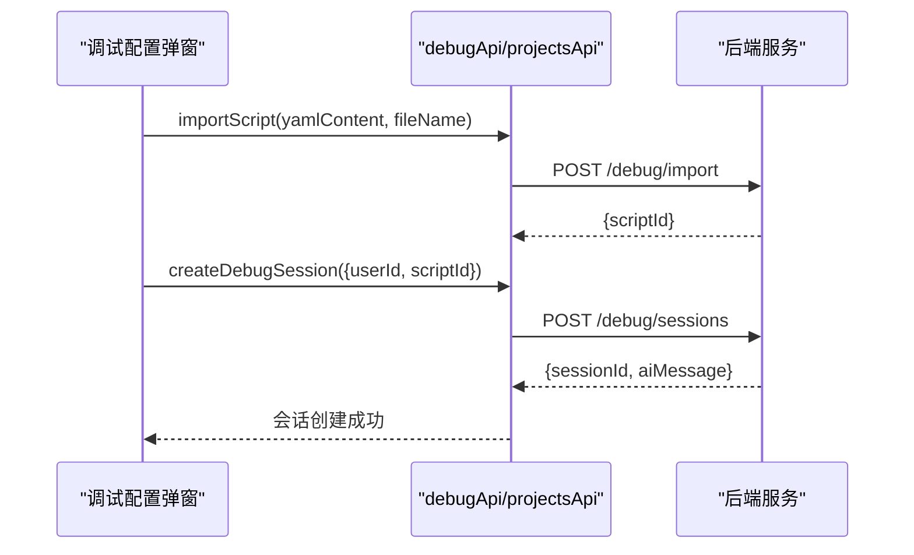
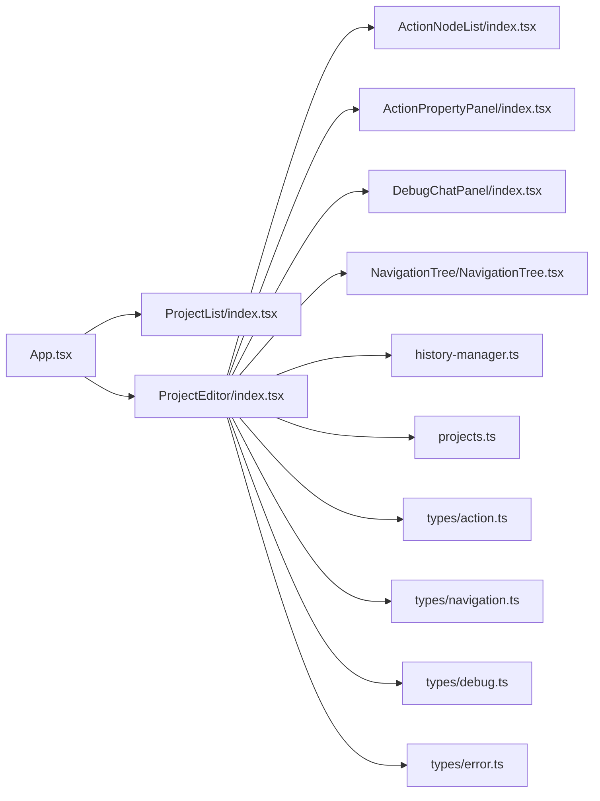

# 编辑器架构

<cite>
**本文档引用的文件**
- [packages/script-editor/package.json](file://packages/script-editor/package.json)
- [packages/script-editor/vite.config.ts](file://packages/script-editor/vite.config.ts)
- [packages/script-editor/src/main.tsx](file://packages/script-editor/src/main.tsx)
- [packages/script-editor/src/App.tsx](file://packages/script-editor/src/App.tsx)
- [packages/script-editor/src/pages/ProjectList/index.tsx](file://packages/script-editor/src/pages/ProjectList/index.tsx)
- [packages/script-editor/src/pages/ProjectEditor/index.tsx](file://packages/script-editor/src/pages/ProjectEditor/index.tsx)
- [packages/script-editor/src/utils/history-manager.ts](file://packages/script-editor/src/utils/history-manager.ts)
- [packages/script-editor/src/api/projects.ts](file://packages/script-editor/src/api/projects.ts)
- [packages/script-editor/src/types/action.ts](file://packages/script-editor/src/types/action.ts)
- [packages/script-editor/src/components/ActionNodeList/index.tsx](file://packages/script-editor/src/components/ActionNodeList/index.tsx)
- [packages/script-editor/src/components/ActionPropertyPanel/index.tsx](file://packages/script-editor/src/components/ActionPropertyPanel/index.tsx)
- [packages/script-editor/src/components/NavigationTree/NavigationTree.tsx](file://packages/script-editor/src/components/NavigationTree/NavigationTree.tsx)
- [packages/script-editor/src/components/DebugChatPanel/index.tsx](file://packages/script-editor/src/components/DebugChatPanel/index.tsx)
- [packages/script-editor/src/components/DebugConfigModal/index.tsx](file://packages/script-editor/src/components/DebugConfigModal/index.tsx)
- [packages/script-editor/src/types/navigation.ts](file://packages/script-editor/src/types/navigation.ts)
- [packages/script-editor/src/types/debug.ts](file://packages/script-editor/src/types/debug.ts)
- [packages/script-editor/src/types/error.ts](file://packages/script-editor/src/types/error.ts)
</cite>

## 目录
1. [简介](#简介)
2. [项目结构](#项目结构)
3. [核心组件](#核心组件)
4. [架构总览](#架构总览)
5. [详细组件分析](#详细组件分析)
6. [依赖关系分析](#依赖关系分析)
7. [性能考虑](#性能考虑)
8. [故障排查指南](#故障排查指南)
9. [结论](#结论)
10. [附录](#附录)

## 简介
本文件面向HeartRule脚本编辑器的架构设计，系统性阐述React前端应用的整体架构、路由与状态管理策略、组件组织方式、Vite构建与开发服务器配置、模块化与懒加载实践、以及性能优化、可维护性与扩展性的设计权衡。文档同时提供开发与生产部署的最佳实践建议。

## 项目结构
编辑器采用多包工作区（workspace）组织，核心前端位于packages/script-editor目录，包含页面、组件、类型定义、API封装与工具模块。整体采用按功能域分层的目录组织方式，便于扩展与维护。

图表来源
- [packages/script-editor/src/main.tsx](file://packages/script-editor/src/main.tsx#L1-L16)
- [packages/script-editor/src/App.tsx](file://packages/script-editor/src/App.tsx#L1-L21)
- [packages/script-editor/src/pages/ProjectList/index.tsx](file://packages/script-editor/src/pages/ProjectList/index.tsx#L1-L356)
- [packages/script-editor/src/pages/ProjectEditor/index.tsx](file://packages/script-editor/src/pages/ProjectEditor/index.tsx#L1-L800)
- [packages/script-editor/src/components/ActionNodeList/index.tsx](file://packages/script-editor/src/components/ActionNodeList/index.tsx#L1-L800)
- [packages/script-editor/src/components/ActionPropertyPanel/index.tsx](file://packages/script-editor/src/components/ActionPropertyPanel/index.tsx#L1-L607)
- [packages/script-editor/src/components/DebugChatPanel/index.tsx](file://packages/script-editor/src/components/DebugChatPanel/index.tsx#L1-L727)
- [packages/script-editor/src/types/action.ts](file://packages/script-editor/src/types/action.ts#L1-L126)
- [packages/script-editor/src/types/navigation.ts](file://packages/script-editor/src/types/navigation.ts#L1-L67)
- [packages/script-editor/src/types/debug.ts](file://packages/script-editor/src/types/debug.ts#L1-L189)
- [packages/script-editor/src/types/error.ts](file://packages/script-editor/src/types/error.ts#L1-L61)
- [packages/script-editor/src/api/projects.ts](file://packages/script-editor/src/api/projects.ts#L1-L246)
- [packages/script-editor/src/utils/history-manager.ts](file://packages/script-editor/src/utils/history-manager.ts#L1-L340)

章节来源
- [packages/script-editor/package.json](file://packages/script-editor/package.json#L1-L33)
- [packages/script-editor/vite.config.ts](file://packages/script-editor/vite.config.ts#L1-L23)
- [packages/script-editor/src/main.tsx](file://packages/script-editor/src/main.tsx#L1-L16)
- [packages/script-editor/src/App.tsx](file://packages/script-editor/src/App.tsx#L1-L21)

## 核心组件
- 页面层
  - 项目列表页：负责工程检索、筛选、创建与管理入口。
  - 项目编辑页：脚本可视化编辑、文件树导航、YAML编辑、调试面板集成。
- 组件层
  - Action节点列表：可视化展示与拖拽排序，支持节点选择与展开/折叠。
  - Action属性面板：基于不同Action类型动态渲染表单，支持自动保存。
  - 导航树：展示脚本执行的四层结构，高亮当前执行位置。
  - 调试聊天面板：消息流、调试气泡、过滤器、错误弹窗与导航树联动。
  - 调试配置弹窗：选择会话脚本、导入脚本、创建调试会话。
- 工具与类型
  - 全局历史管理器：跨文件的撤销/重做与焦点导航。
  - API封装：统一的工程与版本管理、调试接口。
  - 类型定义：Action、导航树、调试气泡、错误等强类型约束。

章节来源
- [packages/script-editor/src/pages/ProjectList/index.tsx](file://packages/script-editor/src/pages/ProjectList/index.tsx#L1-L356)
- [packages/script-editor/src/pages/ProjectEditor/index.tsx](file://packages/script-editor/src/pages/ProjectEditor/index.tsx#L1-L800)
- [packages/script-editor/src/components/ActionNodeList/index.tsx](file://packages/script-editor/src/components/ActionNodeList/index.tsx#L1-L800)
- [packages/script-editor/src/components/ActionPropertyPanel/index.tsx](file://packages/script-editor/src/components/ActionPropertyPanel/index.tsx#L1-L607)
- [packages/script-editor/src/components/NavigationTree/NavigationTree.tsx](file://packages/script-editor/src/components/NavigationTree/NavigationTree.tsx#L1-L279)
- [packages/script-editor/src/components/DebugChatPanel/index.tsx](file://packages/script-editor/src/components/DebugChatPanel/index.tsx#L1-L727)
- [packages/script-editor/src/components/DebugConfigModal/index.tsx](file://packages/script-editor/src/components/DebugConfigModal/index.tsx#L1-L230)
- [packages/script-editor/src/utils/history-manager.ts](file://packages/script-editor/src/utils/history-manager.ts#L1-L340)
- [packages/script-editor/src/api/projects.ts](file://packages/script-editor/src/api/projects.ts#L1-L246)
- [packages/script-editor/src/types/action.ts](file://packages/script-editor/src/types/action.ts#L1-L126)
- [packages/script-editor/src/types/navigation.ts](file://packages/script-editor/src/types/navigation.ts#L1-L67)
- [packages/script-editor/src/types/debug.ts](file://packages/script-editor/src/types/debug.ts#L1-L189)
- [packages/script-editor/src/types/error.ts](file://packages/script-editor/src/types/error.ts#L1-L61)

## 架构总览
编辑器采用“页面-组件-工具-类型-API”的分层架构，页面负责业务编排，组件负责UI与交互，工具提供跨文件状态与历史管理，类型确保数据一致性，API封装与后端交互解耦。

图表来源
- [packages/script-editor/src/pages/ProjectEditor/index.tsx](file://packages/script-editor/src/pages/ProjectEditor/index.tsx#L1-L800)
- [packages/script-editor/src/utils/history-manager.ts](file://packages/script-editor/src/utils/history-manager.ts#L1-L340)
- [packages/script-editor/src/api/projects.ts](file://packages/script-editor/src/api/projects.ts#L1-L246)
- [packages/script-editor/src/types/action.ts](file://packages/script-editor/src/types/action.ts#L1-L126)

## 详细组件分析

### 路由与页面组织
- 路由配置
  - 根路由重定向至项目列表。
  - 项目列表与项目编辑器两个主要页面。
  - 编辑器支持按工程与文件维度的嵌套路由。
- 页面职责
  - 项目列表：工程检索、筛选、创建、复制、归档、跳转编辑器。
  - 项目编辑器：文件树、YAML/可视化双模式、调试面板、版本发布。

图表来源
- [packages/script-editor/src/App.tsx](file://packages/script-editor/src/App.tsx#L1-L21)
- [packages/script-editor/src/pages/ProjectList/index.tsx](file://packages/script-editor/src/pages/ProjectList/index.tsx#L1-L356)
- [packages/script-editor/src/pages/ProjectEditor/index.tsx](file://packages/script-editor/src/pages/ProjectEditor/index.tsx#L1-L800)

章节来源
- [packages/script-editor/src/App.tsx](file://packages/script-editor/src/App.tsx#L1-L21)
- [packages/script-editor/src/pages/ProjectList/index.tsx](file://packages/script-editor/src/pages/ProjectList/index.tsx#L1-L356)
- [packages/script-editor/src/pages/ProjectEditor/index.tsx](file://packages/script-editor/src/pages/ProjectEditor/index.tsx#L1-L800)

### 状态管理策略
- 全局历史管理
  - 单例HistoryManager提供跨文件的撤销/重做能力，记录操作前/后状态与焦点路径。
  - 通过全局引用与防并发标志避免历史栈被中间操作污染。
- 页面内局部状态
  - 编辑器页面集中管理工程、文件、树结构、编辑模式、调试面板可见性等状态。
  - 通过useEffect监听路由参数变化与文件切换，清理与初始化状态。
- 类型驱动的状态
  - Action、导航树、调试气泡等类型确保状态结构稳定，降低运行期错误。

图表来源
- [packages/script-editor/src/utils/history-manager.ts](file://packages/script-editor/src/utils/history-manager.ts#L44-L340)
- [packages/script-editor/src/pages/ProjectEditor/index.tsx](file://packages/script-editor/src/pages/ProjectEditor/index.tsx#L1-L800)

章节来源
- [packages/script-editor/src/utils/history-manager.ts](file://packages/script-editor/src/utils/history-manager.ts#L1-L340)
- [packages/script-editor/src/pages/ProjectEditor/index.tsx](file://packages/script-editor/src/pages/ProjectEditor/index.tsx#L1-L800)

### 组件组织与交互
- Action节点列表
  - 支持Phase/Topic/Action三级折叠与展开，拖拽排序与自动滚动定位。
  - 通过ref对外暴露expandAndScrollTo方法，实现与全局历史管理的联动。
- Action属性面板
  - 基于Action类型动态渲染表单，支持自动保存与防抖。
- 调试聊天面板
  - 左侧导航树联动右侧消息流与调试气泡，支持过滤器与错误详情弹窗。
- 调试配置弹窗
  - 选择会话脚本、导入脚本、创建调试会话，串联前后端流程。

图表来源
- [packages/script-editor/src/components/ActionNodeList/index.tsx](file://packages/script-editor/src/components/ActionNodeList/index.tsx#L1-L800)
- [packages/script-editor/src/components/ActionPropertyPanel/index.tsx](file://packages/script-editor/src/components/ActionPropertyPanel/index.tsx#L1-L607)
- [packages/script-editor/src/components/DebugChatPanel/index.tsx](file://packages/script-editor/src/components/DebugChatPanel/index.tsx#L1-L727)

章节来源
- [packages/script-editor/src/components/ActionNodeList/index.tsx](file://packages/script-editor/src/components/ActionNodeList/index.tsx#L1-L800)
- [packages/script-editor/src/components/ActionPropertyPanel/index.tsx](file://packages/script-editor/src/components/ActionPropertyPanel/index.tsx#L1-L607)
- [packages/script-editor/src/components/DebugChatPanel/index.tsx](file://packages/script-editor/src/components/DebugChatPanel/index.tsx#L1-L727)

### API与数据流
- 工程与文件管理
  - 通过projectsApi封装GET/POST/PUT/DELETE等操作，统一处理响应结构。
  - 编辑器页面并行加载工程与文件列表，构建文件树。
- 调试流程
  - DebugConfigModal导入脚本并创建调试会话，DebugChatPanel拉取会话详情与消息历史，发送消息并接收AI回复与调试气泡。

图表来源
- [packages/script-editor/src/components/DebugConfigModal/index.tsx](file://packages/script-editor/src/components/DebugConfigModal/index.tsx#L1-L230)
- [packages/script-editor/src/api/projects.ts](file://packages/script-editor/src/api/projects.ts#L1-L246)

章节来源
- [packages/script-editor/src/api/projects.ts](file://packages/script-editor/src/api/projects.ts#L1-L246)
- [packages/script-editor/src/components/DebugConfigModal/index.tsx](file://packages/script-editor/src/components/DebugConfigModal/index.tsx#L1-L230)

### 模块化与代码分割
- 项目采用按功能域划分的目录结构，组件、页面、类型、API与工具分别存放，降低耦合。
- 代码分割与懒加载
  - 页面级组件（ProjectList/ProjectEditor）天然形成路由级分割。
  - 组件内部可通过React.lazy与Suspense实现更细粒度的懒加载（建议在大型组件中引入）。
- 依赖管理
  - 通过package.json集中声明依赖，使用pnpm workspace实现多包共享与去重。

章节来源
- [packages/script-editor/package.json](file://packages/script-editor/package.json#L1-L33)

### Vite构建与开发服务器
- 插件与别名
  - 使用@vitejs/plugin-react，启用React Fast Refresh。
  - 配置路径别名@指向src目录，提升导入可读性。
- 开发服务器
  - 端口3000，代理/api到后端服务（本地8000端口）。
- 构建与预览
  - 构建命令先执行类型检查再打包，保证类型安全。
  - 预览命令用于本地验证产物。

章节来源
- [packages/script-editor/vite.config.ts](file://packages/script-editor/vite.config.ts#L1-L23)
- [packages/script-editor/package.json](file://packages/script-editor/package.json#L1-L33)

### 性能优化与可维护性
- 性能优化
  - 按需渲染：Action节点列表使用Collapse与条件渲染，减少DOM数量。
  - 防抖与批处理：属性面板自动保存使用防抖，历史管理避免并发污染。
  - 拖拽与滚动：自动滚动采用requestAnimationFrame，降低主线程压力。
- 可维护性
  - 强类型：通过types/action.ts、types/navigation.ts、types/debug.ts、types/error.ts确保数据结构稳定。
  - 单一职责：HistoryManager独立于页面，API封装隔离后端细节。
  - 日志与可观测：大量console日志辅助调试，便于定位问题。
- 扩展性
  - Action类型扩展：新增Action类型只需在types与组件中补充对应表单与渲染逻辑。
  - 调试气泡：通过DebugBubbleType扩展更多调试信息类型。

章节来源
- [packages/script-editor/src/components/ActionNodeList/index.tsx](file://packages/script-editor/src/components/ActionNodeList/index.tsx#L1-L800)
- [packages/script-editor/src/components/ActionPropertyPanel/index.tsx](file://packages/script-editor/src/components/ActionPropertyPanel/index.tsx#L1-L607)
- [packages/script-editor/src/utils/history-manager.ts](file://packages/script-editor/src/utils/history-manager.ts#L1-L340)
- [packages/script-editor/src/types/action.ts](file://packages/script-editor/src/types/action.ts#L1-L126)
- [packages/script-editor/src/types/debug.ts](file://packages/script-editor/src/types/debug.ts#L1-L189)

## 依赖关系分析
编辑器的依赖关系围绕页面、组件、工具与API展开，类型定义贯穿始终，确保数据一致性与可演进性。

图表来源
- [packages/script-editor/src/App.tsx](file://packages/script-editor/src/App.tsx#L1-L21)
- [packages/script-editor/src/pages/ProjectList/index.tsx](file://packages/script-editor/src/pages/ProjectList/index.tsx#L1-L356)
- [packages/script-editor/src/pages/ProjectEditor/index.tsx](file://packages/script-editor/src/pages/ProjectEditor/index.tsx#L1-L800)
- [packages/script-editor/src/components/ActionNodeList/index.tsx](file://packages/script-editor/src/components/ActionNodeList/index.tsx#L1-L800)
- [packages/script-editor/src/components/ActionPropertyPanel/index.tsx](file://packages/script-editor/src/components/ActionPropertyPanel/index.tsx#L1-L607)
- [packages/script-editor/src/components/DebugChatPanel/index.tsx](file://packages/script-editor/src/components/DebugChatPanel/index.tsx#L1-L727)
- [packages/script-editor/src/components/NavigationTree/NavigationTree.tsx](file://packages/script-editor/src/components/NavigationTree/NavigationTree.tsx#L1-L279)
- [packages/script-editor/src/utils/history-manager.ts](file://packages/script-editor/src/utils/history-manager.ts#L1-L340)
- [packages/script-editor/src/api/projects.ts](file://packages/script-editor/src/api/projects.ts#L1-L246)
- [packages/script-editor/src/types/action.ts](file://packages/script-editor/src/types/action.ts#L1-L126)
- [packages/script-editor/src/types/navigation.ts](file://packages/script-editor/src/types/navigation.ts#L1-L67)
- [packages/script-editor/src/types/debug.ts](file://packages/script-editor/src/types/debug.ts#L1-L189)
- [packages/script-editor/src/types/error.ts](file://packages/script-editor/src/types/error.ts#L1-L61)

章节来源
- [packages/script-editor/src/pages/ProjectEditor/index.tsx](file://packages/script-editor/src/pages/ProjectEditor/index.tsx#L1-L800)
- [packages/script-editor/src/utils/history-manager.ts](file://packages/script-editor/src/utils/history-manager.ts#L1-L340)
- [packages/script-editor/src/api/projects.ts](file://packages/script-editor/src/api/projects.ts#L1-L246)

## 性能考虑
- 渲染优化
  - 使用Collapse与条件渲染减少不必要的DOM节点。
  - 表单自动保存采用防抖，避免频繁写入。
- 数据处理
  - 历史管理对状态进行深拷贝，避免引用污染。
  - YAML解析与同步采用增量更新策略，减少全量重绘。
- 网络请求
  - 并行加载工程与文件列表，缩短首屏时间。
  - 调试面板按需加载消息与导航树，避免一次性渲染大量数据。
- 构建优化
  - Vite默认开启代码分割与压缩，结合tsup（后端包）实现多包构建。

## 故障排查指南
- 调试面板无消息
  - 检查会话ID是否正确传递，确认后端会话是否存在。
  - 查看网络面板与控制台错误，确认API响应结构。
- 导航树不更新
  - 确认currentPosition与tree是否正确传入，检查展开状态逻辑。
- 历史管理异常
  - 检查是否在撤销/重做过程中再次push，确认isUndoRedoActive标志位。
- YAML解析失败
  - 检查文件内容是否为合法YAML，查看解析错误日志。

章节来源
- [packages/script-editor/src/components/DebugChatPanel/index.tsx](file://packages/script-editor/src/components/DebugChatPanel/index.tsx#L1-L727)
- [packages/script-editor/src/components/NavigationTree/NavigationTree.tsx](file://packages/script-editor/src/components/NavigationTree/NavigationTree.tsx#L1-L279)
- [packages/script-editor/src/utils/history-manager.ts](file://packages/script-editor/src/utils/history-manager.ts#L1-L340)

## 结论
该架构以清晰的分层与强类型为核心，结合全局历史管理与组件化设计，实现了脚本编辑、调试与版本管理的完整闭环。通过Vite与pnpm的现代化工具链，兼顾开发体验与构建效率。建议在后续迭代中引入组件懒加载、更完善的错误边界与状态持久化方案，进一步提升用户体验与可维护性。

## 附录
- 开发环境
  - 使用pnpm workspace统一管理依赖，启动Vite开发服务器，代理/api到后端。
- 生产部署
  - 构建后使用静态资源部署，确保代理规则与后端域名一致；在CI中加入类型检查与测试环节。