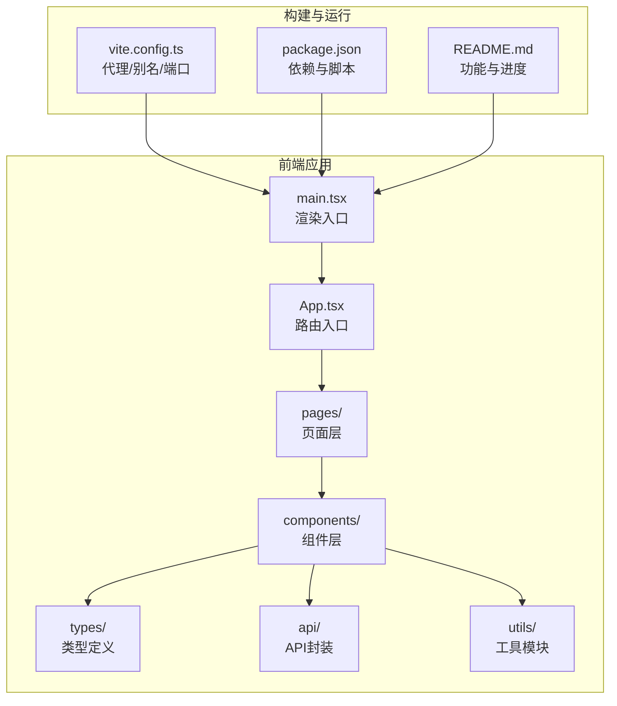
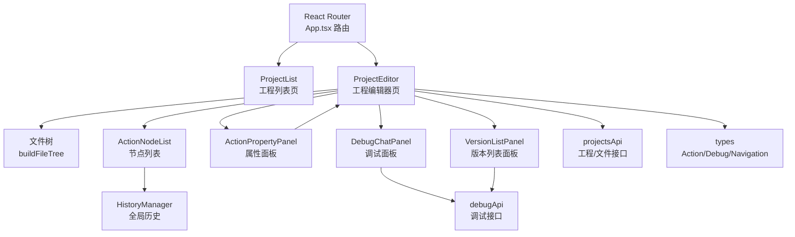
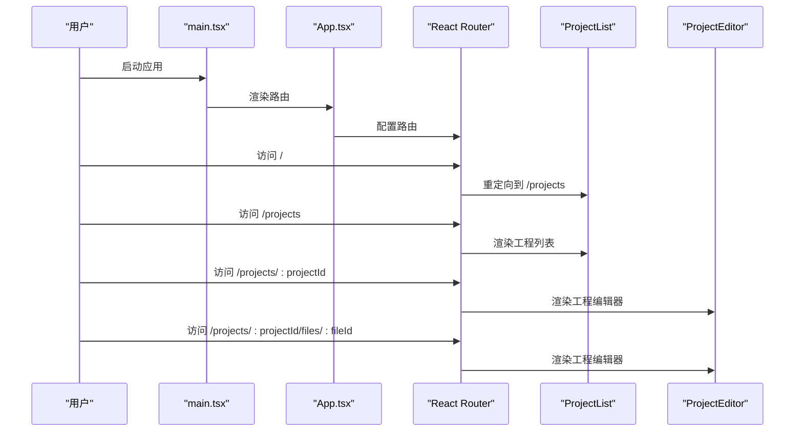
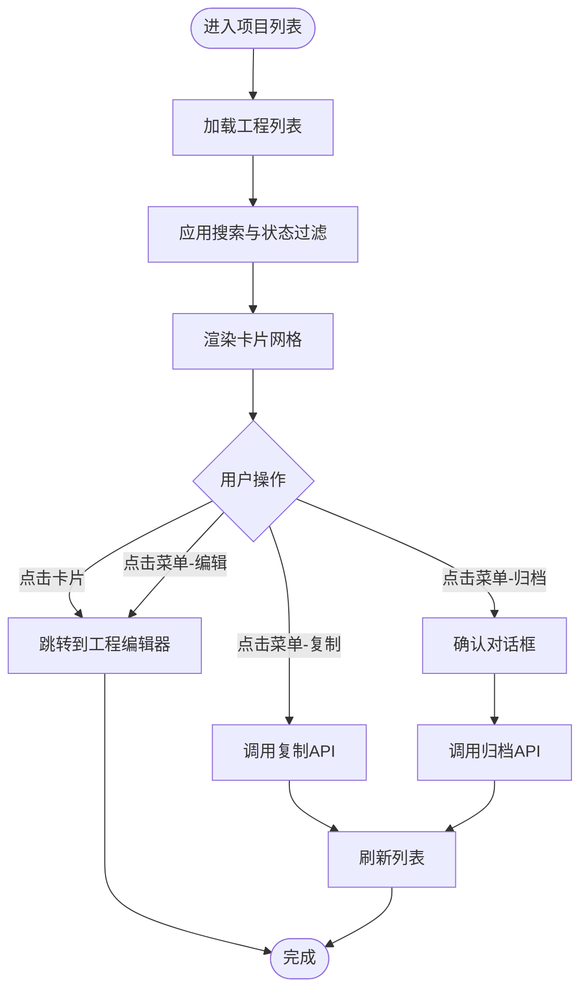
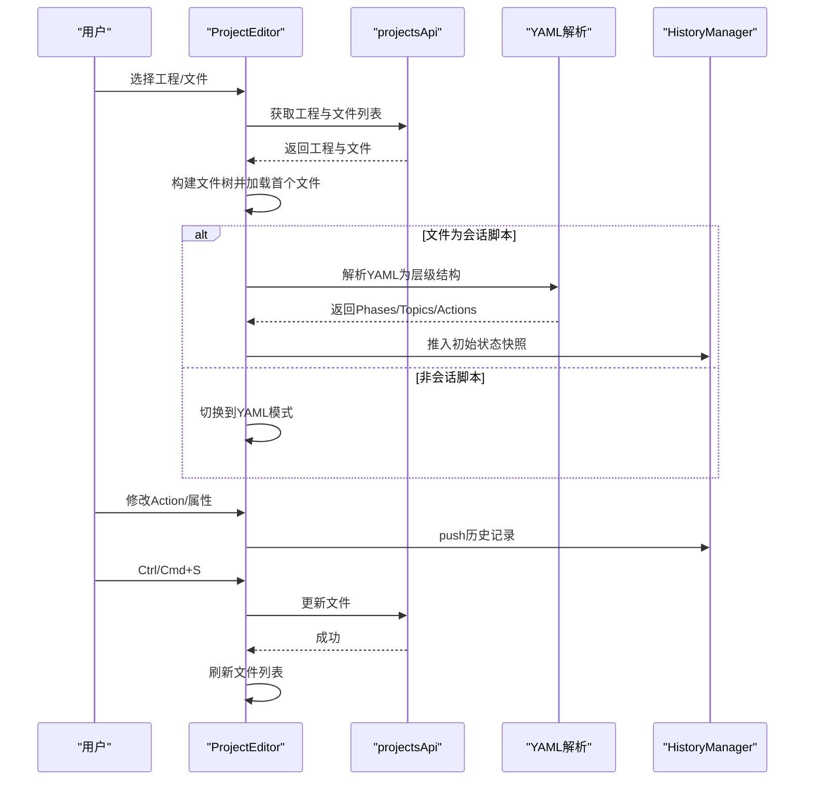
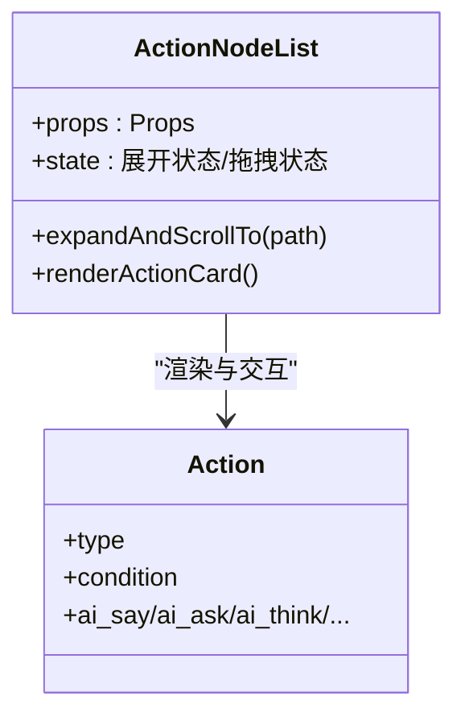
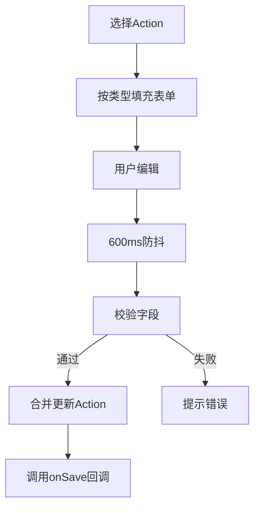
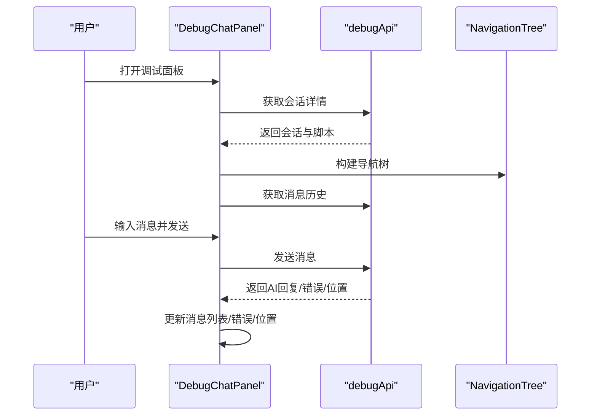
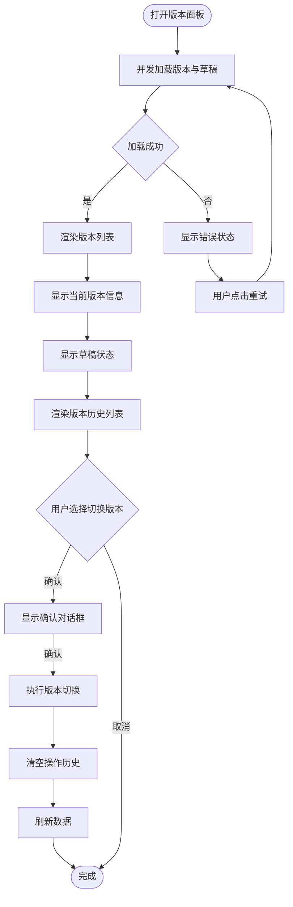
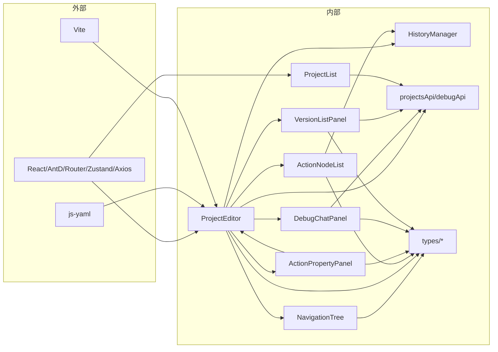

# 脚本编辑器

<cite>
**本文引用的文件**
- [App.tsx](file://packages/script-editor/src/App.tsx)
- [main.tsx](file://packages/script-editor/src/main.tsx)
- [vite.config.ts](file://packages/script-editor/vite.config.ts)
- [package.json](file://packages/script-editor/package.json)
- [README.md](file://packages/script-editor/README.md)
- [ProjectList/index.tsx](file://packages/script-editor/src/pages/ProjectList/index.tsx)
- [ProjectEditor/index.tsx](file://packages/script-editor/src/pages/ProjectEditor/index.tsx)
- [ActionNodeList/index.tsx](file://packages/script-editor/src/components/ActionNodeList/index.tsx)
- [ActionPropertyPanel/index.tsx](file://packages/script-editor/src/components/ActionPropertyPanel/index.tsx)
- [DebugChatPanel/index.tsx](file://packages/script-editor/src/components/DebugChatPanel/index.tsx)
- [VersionListPanel/VersionListPanel.tsx](file://packages/script-editor/src/components/VersionListPanel/VersionListPanel.tsx)
- [VersionListPanel/style.css](file://packages/script-editor/src/components/VersionListPanel/style.css)
- [VersionListPanel/index.ts](file://packages/script-editor/src/components/VersionListPanel/index.ts)
- [NavigationTree/NavigationTree.tsx](file://packages/script-editor/src/components/NavigationTree/NavigationTree.tsx)
- [ProjectEditor/style.css](file://packages/script-editor/src/pages/ProjectEditor/style.css)
- [DebugChatPanel/style.css](file://packages/script-editor/src/components/DebugChatPanel/style.css)
- [VersionPanel/VersionPanel.css](file://packages/script-editor/src/components/VersionPanel/VersionPanel.css)
- [ActionNodeList/style.css](file://packages/script-editor/src/components/ActionNodeList/style.css)
- [ActionPropertyPanel/style.css](file://packages/script-editor/src/components/ActionPropertyPanel/style.css)
- [history-manager.ts](file://packages/script-editor/src/utils/history-manager.ts)
- [projects.ts](file://packages/script-editor/src/api/projects.ts)
- [action.ts](file://packages/script-editor/src/types/action.ts)
- [debug.ts](file://packages/script-editor/src/types/debug.ts)
- [navigation.ts](file://packages/script-editor/src/types/navigation.ts)
</cite>

## 目录
1. [简介](#简介)
2. [项目结构](#项目结构)
3. [核心组件](#核心组件)
4. [架构总览](#架构总览)
5. [详细组件分析](#详细组件分析)
6. [依赖关系分析](#依赖关系分析)
7. [性能考虑](#性能考虑)
8. [故障排查指南](#故障排查指南)
9. [结论](#结论)
10. [附录](#附录)

## 简介
本技术文档面向 HeartRule AI 咨询引擎的脚本编辑器，系统性梳理其 React 组件架构、状态管理与路由配置，深入讲解工程管理功能（项目列表、工程编辑器、文件管理）、可视化组件设计理念（Action 节点列表交互、属性面板数据绑定、调试面板实时反馈），并提供扩展开发指南（自定义组件、主题定制、插件机制）及用户体验与性能优化建议。

**更新** 新增 VersionListPanel 组件提供可视化版本管理能力，增强导航树组件的错误处理，完善调试组件的 CSS 样式支持。

## 项目结构
脚本编辑器采用多包工作区组织，核心前端位于 packages/script-editor，包含页面、组件、类型定义、API 封装与工具模块。Vite 作为构建工具，Ant Design 提供 UI 基础组件，Zustand 用于轻量状态管理，React Router 实现前端路由，ReactFlow 用于流程图（在 README 中规划）。

**图表来源**
- [App.tsx](file://packages/script-editor/src/App.tsx#L1-L21)
- [main.tsx](file://packages/script-editor/src/main.tsx#L1-L16)
- [vite.config.ts](file://packages/script-editor/vite.config.ts#L1-L23)
- [package.json](file://packages/script-editor/package.json#L1-L33)
- [README.md](file://packages/script-editor/README.md#L80-L97)

**章节来源**
- [App.tsx](file://packages/script-editor/src/App.tsx#L1-L21)
- [main.tsx](file://packages/script-editor/src/main.tsx#L1-L16)
- [vite.config.ts](file://packages/script-editor/vite.config.ts#L1-L23)
- [package.json](file://packages/script-editor/package.json#L1-L33)
- [README.md](file://packages/script-editor/README.md#L80-L97)

## 核心组件
- 页面层
  - 工程列表页：负责项目检索、筛选、创建、编辑入口与文件浏览。
  - 工程编辑器页：负责文件树、YAML/可视化双模式编辑、Action 层级结构解析与同步、调试面板集成、版本管理面板集成。
- 组件层
  - Action 节点列表：提供层级折叠、拖拽排序、节点选择与高亮滚动。
  - Action 属性面板：按 Action 类型动态渲染表单，自动保存与校验。
  - 调试聊天面板：会话加载、消息收发、导航树联动、错误与变量气泡展示。
  - 版本列表面板：提供版本历史查看、当前版本信息展示、草稿状态管理、版本切换功能。
  - 导航树组件：增强错误处理，提供脚本执行路径的可视化展示。
- 工具与状态
  - 全局历史管理器：跨文件的撤销/重做与焦点定位。
  - API 封装：工程、文件、版本、调试接口统一管理。
  - 类型定义：Action、调试、导航树等强类型支撑。

**章节来源**
- [ProjectList/index.tsx](file://packages/script-editor/src/pages/ProjectList/index.tsx#L1-L356)
- [ProjectEditor/index.tsx](file://packages/script-editor/src/pages/ProjectEditor/index.tsx#L1-L2438)
- [ActionNodeList/index.tsx](file://packages/script-editor/src/components/ActionNodeList/index.tsx#L1-L800)
- [ActionPropertyPanel/index.tsx](file://packages/script-editor/src/components/ActionPropertyPanel/index.tsx#L1-L607)
- [DebugChatPanel/index.tsx](file://packages/script-editor/src/components/DebugChatPanel/index.tsx#L1-L581)
- [VersionListPanel/VersionListPanel.tsx](file://packages/script-editor/src/components/VersionListPanel/VersionListPanel.tsx#L1-L340)
- [NavigationTree/NavigationTree.tsx](file://packages/script-editor/src/components/NavigationTree/NavigationTree.tsx#L1-L279)
- [history-manager.ts](file://packages/script-editor/src/utils/history-manager.ts#L1-L340)
- [projects.ts](file://packages/script-editor/src/api/projects.ts#L1-L246)
- [action.ts](file://packages/script-editor/src/types/action.ts#L1-L126)
- [debug.ts](file://packages/script-editor/src/types/debug.ts#L1-L189)
- [navigation.ts](file://packages/script-editor/src/types/navigation.ts#L1-L67)

## 架构总览
前端采用"页面 + 组件 + 工具 + API + 类型"的分层架构，路由驱动页面切换，页面内组合多种可视化组件，组件间通过 props 与回调通信，状态通过全局历史管理器与本地 useState 管理，API 通过 axios 统一封装。

**图表来源**
- [App.tsx](file://packages/script-editor/src/App.tsx#L1-L21)
- [ProjectList/index.tsx](file://packages/script-editor/src/pages/ProjectList/index.tsx#L1-L356)
- [ProjectEditor/index.tsx](file://packages/script-editor/src/pages/ProjectEditor/index.tsx#L1-L2438)
- [ActionNodeList/index.tsx](file://packages/script-editor/src/components/ActionNodeList/index.tsx#L1-L800)
- [ActionPropertyPanel/index.tsx](file://packages/script-editor/src/components/ActionPropertyPanel/index.tsx#L1-L607)
- [DebugChatPanel/index.tsx](file://packages/script-editor/src/components/DebugChatPanel/index.tsx#L1-L581)
- [VersionListPanel/VersionListPanel.tsx](file://packages/script-editor/src/components/VersionListPanel/VersionListPanel.tsx#L1-L340)
- [history-manager.ts](file://packages/script-editor/src/utils/history-manager.ts#L1-L340)
- [projects.ts](file://packages/script-editor/src/api/projects.ts#L1-L246)
- [action.ts](file://packages/script-editor/src/types/action.ts#L1-L126)
- [debug.ts](file://packages/script-editor/src/types/debug.ts#L1-L189)
- [navigation.ts](file://packages/script-editor/src/types/navigation.ts#L1-L67)

## 详细组件分析

### 路由与入口
- 入口渲染：main.tsx 使用 ConfigProvider 注入 Ant Design 语言包，StrictMode 包裹保证严格模式。
- 路由配置：App.tsx 定义首页重定向、工程列表、工程编辑器（含文件级路由）。

**图表来源**
- [main.tsx](file://packages/script-editor/src/main.tsx#L1-L16)
- [App.tsx](file://packages/script-editor/src/App.tsx#L1-L21)

**章节来源**
- [main.tsx](file://packages/script-editor/src/main.tsx#L1-L16)
- [App.tsx](file://packages/script-editor/src/App.tsx#L1-L21)

### 工程管理：项目列表页面
- 功能要点
  - 列表加载：首次挂载触发 API 请求，支持状态过滤与关键词搜索。
  - 创建工程：表单校验与 API 调用，成功后刷新列表。
  - 操作菜单：编辑、查看文件、复制、归档（确认对话框）。
  - 状态标签：根据状态映射不同颜色与文案。
- 交互细节
  - 过滤器：搜索框与状态选择器联动过滤。
  - 卡片点击：支持整卡点击进入编辑器。
  - 弹窗：创建工程对话框，提交后重置表单并刷新。

**图表来源**
- [ProjectList/index.tsx](file://packages/script-editor/src/pages/ProjectList/index.tsx#L48-L123)

**章节来源**
- [ProjectList/index.tsx](file://packages/script-editor/src/pages/ProjectList/index.tsx#L1-L356)

### 工程编辑器：可视化与文件管理
- 文件树与文件加载
  - 构建文件树：区分会话文件与其他文件，会话文件聚合到"会话脚本"文件夹。
  - 切换文件：支持未保存变更的确认提示，URL 同步文件路径。
- YAML/可视化双模式
  - YAML 模式：文本编辑器，支持实时解析（针对会话脚本）。
  - 可视化模式：解析 YAML 为层级结构（Phases/Topics/Actions），默认进入可视化编辑。
- Action 层级结构与同步
  - 解析：兼容新旧两种脚本结构，规范化为前端内部结构。
  - 同步：将层级结构回写为 YAML，保留原始 config 以减少字段丢失。
- 历史与焦点
  - 全局历史管理器：跨文件撤销/重做，记录 before/after 与焦点路径。
  - 初始状态：首次加载为当前文件推入初始快照，避免重复记录。
- 调试集成
  - 调试配置与面板：支持开启调试会话、初始消息、发布版本。
  - 保存与快捷键：Ctrl/Cmd+S 保存，保存后刷新文件列表。
- 版本管理集成
  - 版本面板：固定定位右侧，提供版本历史查看与切换功能。
  - 版本切换：支持草稿与正式版本切换，带确认对话框与历史清空。

**图表来源**
- [ProjectEditor/index.tsx](file://packages/script-editor/src/pages/ProjectEditor/index.tsx#L419-L513)
- [history-manager.ts](file://packages/script-editor/src/utils/history-manager.ts#L53-L118)

**章节来源**
- [ProjectEditor/index.tsx](file://packages/script-editor/src/pages/ProjectEditor/index.tsx#L1-L2438)
- [history-manager.ts](file://packages/script-editor/src/utils/history-manager.ts#L1-L340)

### Action 节点列表：交互与拖拽
- 展示结构：Phases → Topics → Actions 三层折叠面板，支持展开/折叠与选择。
- 交互能力
  - 节点选择：点击高亮，支持滚动到目标节点并高亮。
  - 拖拽排序：支持同级排序与跨级移动（Phase/Topic/Action）。
  - 动态菜单：Action 添加菜单，支持多种 Action 类型。
- 设计理念
  - 通过 data-* 属性定位 DOM，结合自动滚动提升拖拽体验。
  - 通过 ref 暴露对外方法，便于父组件控制展开与滚动。

**图表来源**
- [ActionNodeList/index.tsx](file://packages/script-editor/src/components/ActionNodeList/index.tsx#L176-L800)
- [action.ts](file://packages/script-editor/src/types/action.ts#L14-L87)

**章节来源**
- [ActionNodeList/index.tsx](file://packages/script-editor/src/components/ActionNodeList/index.tsx#L1-L800)
- [action.ts](file://packages/script-editor/src/types/action.ts#L1-L126)

### Action 属性面板：数据绑定与自动保存
- 动态表单：根据 Action 类型渲染不同字段（如 ai_say、ai_ask、ai_think 等）。
- 数据绑定：首次选中 Action 时填充表单，保存时合并更新。
- 自动保存：防抖 600ms，减少频繁写入。
- 输出变量：支持多输出变量的动态表单项（Form.List）。

**图表来源**
- [ActionPropertyPanel/index.tsx](file://packages/script-editor/src/components/ActionPropertyPanel/index.tsx#L41-L161)

**章节来源**
- [ActionPropertyPanel/index.tsx](file://packages/script-editor/src/components/ActionPropertyPanel/index.tsx#L1-L607)

### 调试面板：实时反馈与导航树
- 会话加载：根据 sessionId 获取会话详情、消息历史、构建导航树。
- 消息交互：发送用户消息，接收 AI 回复，支持错误提示与位置更新。
- 导航树：基于脚本结构生成，展示当前执行位置。
- 错误与变量：错误气泡、变量状态气泡、执行日志与位置信息可配置过滤。
- 导航树增强：新增错误状态处理，提供更丰富的执行状态可视化。

**图表来源**
- [DebugChatPanel/index.tsx](file://packages/script-editor/src/components/DebugChatPanel/index.tsx#L168-L282)
- [debug.ts](file://packages/script-editor/src/types/debug.ts#L20-L189)
- [navigation.ts](file://packages/script-editor/src/types/navigation.ts#L14-L66)

**章节来源**
- [DebugChatPanel/index.tsx](file://packages/script-editor/src/components/DebugChatPanel/index.tsx#L1-L581)
- [debug.ts](file://packages/script-editor/src/types/debug.ts#L1-L189)
- [navigation.ts](file://packages/script-editor/src/types/navigation.ts#L1-L67)

### 版本列表面板：可视化版本管理
- 功能特性
  - 版本历史：展示所有版本的版本号、发布时间、发布人、发布说明。
  - 当前版本：突出显示当前激活的版本，显示发布时间和说明。
  - 草稿状态：显示未发布的草稿版本及其更新时间。
  - 版本切换：支持一键切换到指定版本，带确认对话框与历史清空。
  - 错误处理：加载失败时显示错误状态和重试按钮。
- 用户界面
  - 响应式设计：支持不同屏幕尺寸的适配。
  - 状态指示：使用颜色和图标清晰标识版本状态（当前、回滚、草稿）。
  - 滚动优化：版本列表支持垂直滚动，提供良好的滚动条样式。
- 技术实现
  - 并发加载：同时获取版本列表和草稿状态，提升加载效率。
  - 历史管理：版本切换后清空操作历史，防止跨版本数据错乱。
  - 确认机制：重要操作提供确认对话框，防止误操作。

**图表来源**
- [VersionListPanel/VersionListPanel.tsx](file://packages/script-editor/src/components/VersionListPanel/VersionListPanel.tsx#L43-L139)

**章节来源**
- [VersionListPanel/VersionListPanel.tsx](file://packages/script-editor/src/components/VersionListPanel/VersionListPanel.tsx#L1-L340)
- [VersionListPanel/style.css](file://packages/script-editor/src/components/VersionListPanel/style.css#L1-L141)

### 导航树组件：增强错误处理
- 执行状态可视化：提供执行中、已执行、错误、未执行四种状态的图标和颜色标识。
- 智能展开：根据当前位置自动展开相应的 Phase 和 Topic。
- 错误状态处理：当 Action 状态为 error 时，显示警告图标和红色样式。
- 工具提示：鼠标悬停显示 Action ID、类型、状态等详细信息。
- 滚动定位：自动滚动到当前执行的 Action 位置。

**章节来源**
- [NavigationTree/NavigationTree.tsx](file://packages/script-editor/src/components/NavigationTree/NavigationTree.tsx#L1-L279)

### API 与类型体系
- API 封装：工程、文件、版本、调试接口统一管理，返回标准化结构。
- 类型定义：Action、SessionScript、调试气泡、导航树等强类型，保障组件契约清晰。

**章节来源**
- [projects.ts](file://packages/script-editor/src/api/projects.ts#L1-L246)
- [action.ts](file://packages/script-editor/src/types/action.ts#L1-L126)
- [debug.ts](file://packages/script-editor/src/types/debug.ts#L1-L189)
- [navigation.ts](file://packages/script-editor/src/types/navigation.ts#L1-L67)

## 依赖关系分析
- 外部依赖
  - React 生态：React、React Router、Ant Design、Zustand、Axios。
  - 可视化：ReactFlow（规划中）。
  - 工具：js-yaml（YAML 解析）、uuid（调试会话 ID）、Vite（构建）。
- 内部耦合
  - 页面与组件：页面组合组件，组件通过回调与页面通信。
  - 组件与工具：ActionNodeList 与 HistoryManager 通过全局实例交互。
  - 组件与 API：各组件通过 projectsApi/debugApi 调用后端。

**图表来源**
- [package.json](file://packages/script-editor/package.json#L12-L23)
- [ProjectEditor/index.tsx](file://packages/script-editor/src/pages/ProjectEditor/index.tsx#L41-L51)
- [ActionNodeList/index.tsx](file://packages/script-editor/src/components/ActionNodeList/index.tsx#L1-L30)
- [ActionPropertyPanel/index.tsx](file://packages/script-editor/src/components/ActionPropertyPanel/index.tsx#L1-L21)
- [DebugChatPanel/index.tsx](file://packages/script-editor/src/components/DebugChatPanel/index.tsx#L1-L30)
- [VersionListPanel/VersionListPanel.tsx](file://packages/script-editor/src/components/VersionListPanel/VersionListPanel.tsx#L1-L12)
- [NavigationTree/NavigationTree.tsx](file://packages/script-editor/src/components/NavigationTree/NavigationTree.tsx#L1-L14)
- [history-manager.ts](file://packages/script-editor/src/utils/history-manager.ts#L1-L10)
- [projects.ts](file://packages/script-editor/src/api/projects.ts#L1-L3)

**章节来源**
- [package.json](file://packages/script-editor/package.json#L1-L33)

## 性能考虑
- 渲染优化
  - 列表虚拟化：项目列表卡片较多时，可引入虚拟列表减少 DOM。
  - 组件拆分：将 Action 节点卡片与属性面板独立渲染，避免不必要的重绘。
  - 版本面板优化：使用固定定位和溢出滚动，避免影响主界面渲染。
- 网络与缓存
  - API 请求去抖：项目列表搜索建议增加防抖，降低请求频率。
  - 本地缓存：对常用工程/文件元数据进行内存缓存，减少重复请求。
  - 并发加载：版本面板使用 Promise.allSettled 并发加载多个数据源。
- 解析与同步
  - YAML 解析：仅在会话脚本切换或输入停止后解析，避免高频解析。
  - 同步策略：增量同步层级结构到 YAML，避免全量替换。
- 历史管理
  - 历史栈上限：限制最大条目，定期清理旧快照。
  - 深拷贝优化：对大体量数据进行浅拷贝 + 需要时深拷贝，降低内存峰值。
  - 版本切换清空：版本切换时清空历史栈，防止内存泄漏。

## 故障排查指南
- 路由与入口
  - 若页面空白：检查 main.tsx 渲染与 App.tsx 路由配置。
- 工程列表
  - 加载失败：检查 API 代理配置与后端连通性；查看控制台错误。
  - 创建失败：确认表单校验与后端返回的 success 字段。
- 工程编辑器
  - 文件树不显示：确认返回的文件列表与 buildFileTree 逻辑。
  - YAML 解析报错：检查脚本格式与解析分支（新/旧结构）。
  - 撤销/重做无效：确认 HistoryManager 的 isUndoRedoActive 标记与 canUndo/canRedo。
  - 版本面板异常：检查版本 API 调用和数据格式。
- 调试面板
  - 无消息：检查 sessionId、API 返回与消息拼接逻辑。
  - 导航树异常：检查脚本结构与 buildNavigationTree 的解析分支。
  - 导航树错误状态：确认 Action 状态字段和错误处理逻辑。
- 代理与环境
  - 前端 3000 端口代理到后端 8000，确保后端服务已启动。

**章节来源**
- [main.tsx](file://packages/script-editor/src/main.tsx#L1-L16)
- [App.tsx](file://packages/script-editor/src/App.tsx#L1-L21)
- [ProjectList/index.tsx](file://packages/script-editor/src/pages/ProjectList/index.tsx#L48-L74)
- [ProjectEditor/index.tsx](file://packages/script-editor/src/pages/ProjectEditor/index.tsx#L419-L513)
- [history-manager.ts](file://packages/script-editor/src/utils/history-manager.ts#L125-L173)
- [DebugChatPanel/index.tsx](file://packages/script-editor/src/components/DebugChatPanel/index.tsx#L168-L282)
- [VersionListPanel/VersionListPanel.tsx](file://packages/script-editor/src/components/VersionListPanel/VersionListPanel.tsx#L82-L117)
- [NavigationTree/NavigationTree.tsx](file://packages/script-editor/src/components/NavigationTree/NavigationTree.tsx#L129-L140)
- [vite.config.ts](file://packages/script-editor/vite.config.ts#L13-L21)

## 结论
脚本编辑器以清晰的分层架构与强类型体系为基础，实现了工程管理、文件树、可视化编辑、调试面板和版本管理的协同工作。通过全局历史管理器与防抖保存等机制，兼顾了易用性与性能。新增的 VersionListPanel 组件提供了完整的版本管理能力，增强了导航树组件的错误处理，完善了调试组件的样式支持。后续可在可视化流程图、插件机制与主题定制方面进一步扩展，持续提升用户体验与可扩展性。

## 附录
- 开发与运行
  - 前置条件与安装、数据库迁移与前后端启动流程见 README。
- 扩展开发指南
  - 自定义组件：遵循现有组件模式（props + 回调 + 类型约束），接入 ActionNodeList/ActionPropertyPanel。
  - 主题定制：通过 Ant Design 主题变量与 CSS 变量覆盖实现。
  - 插件机制：预留扩展点（如 Action 类型注册、调试气泡类型扩展），通过配置与工厂模式注入。
  - 版本管理扩展：可基于 VersionListPanel 的架构模式开发更多版本控制功能。

**章节来源**
- [README.md](file://packages/script-editor/README.md#L42-L78)