# 调试工具

<cite>
**本文引用的文件**
- [packages/script-editor/src/components/DebugChatPanel/index.tsx](file://packages/script-editor/src/components/DebugChatPanel/index.tsx)
- [packages/script-editor/src/components/DebugBubbles/PositionBubble.tsx](file://packages/script-editor/src/components/DebugBubbles/PositionBubble.tsx)
- [packages/script-editor/src/components/DebugBubbles/ErrorBubble.tsx](file://packages/script-editor/src/components/DebugBubbles/ErrorBubble.tsx)
- [packages/script-editor/src/components/DebugBubbles/LLMPromptBubble.tsx](file://packages/script-editor/src/components/DebugBubbles/LLMPromptBubble.tsx)
- [packages/script-editor/src/components/DebugBubbles/LLMResponseBubble.tsx](file://packages/script-editor/src/components/DebugBubbles/LLMResponseBubble.tsx)
- [packages/script-editor/src/components/DebugBubbles/VariableBubble.tsx](file://packages/script-editor/src/components/DebugBubbles/VariableBubble.tsx)
- [packages/script-editor/src/components/DebugFilterModal/DebugFilterModal.tsx](file://packages/script-editor/src/components/DebugFilterModal/DebugFilterModal.tsx)
- [packages/script-editor/src/utils/debug-filter-storage.ts](file://packages/script-editor/src/utils/debug-filter-storage.ts)
- [packages/script-editor/src/api/debug.ts](file://packages/script-editor/src/api/debug.ts)
- [packages/script-editor/src/types/debug.ts](file://packages/script-editor/src/types/debug.ts)
- [packages/script-editor/src/components/DebugConfigModal/index.tsx](file://packages/script-editor/src/components/DebugConfigModal/index.tsx)
- [packages/script-editor/src/utils/history-manager.ts](file://packages/script-editor/src/utils/history-manager.ts)
</cite>

## 更新摘要
**变更内容**
- 新增位置气泡(PositionBubble)组件，提供详细的执行位置跟踪功能
- DebugChatPanel增强664行功能，包括实时执行跟踪、变量检查、交互式调试会话
- 完善调试过滤器系统，支持位置信息显示控制
- 增强错误处理机制，集成ErrorBanner组件
- 优化导航树与位置信息的联动显示

## 目录
1. [简介](#简介)
2. [项目结构](#项目结构)
3. [核心组件](#核心组件)
4. [架构总览](#架构总览)
5. [详细组件分析](#详细组件分析)
6. [依赖分析](#依赖分析)
7. [性能考量](#性能考量)
8. [故障排查指南](#故障排查指南)
9. [结论](#结论)
10. [附录](#附录)

## 简介
本文件面向HeartRule脚本编辑器的调试工具系统，围绕"调试气泡""调试过滤器""实时调试工作流"三大主题进行系统化说明。重点覆盖：
- 错误气泡的错误信息展示与交互
- LLM提示词气泡与响应气泡的内容呈现与复制能力
- 变量气泡的状态监控与导出能力
- 位置气泡的执行路径跟踪与导航树集成
- 调试过滤器的存储与管理（本地持久化、用户偏好）
- 实时调试工作流（会话创建、消息收发、状态变更追踪、问题诊断辅助）
- 扩展开发指南（自定义调试气泡、过滤器规则、调试事件处理）
- 效率优化与用户体验建议

## 项目结构
调试工具主要分布在前端脚本编辑器包中，采用"组件 + 类型 + 工具 + API"的分层组织方式：
- 类型定义：统一的调试气泡类型、内容结构、过滤器配置
- 组件层：错误/提示词/响应/变量/位置气泡；调试聊天面板；过滤器弹窗；调试配置弹窗
- 工具层：调试过滤器本地存储
- API层：调试会话、消息、脚本导入等接口封装

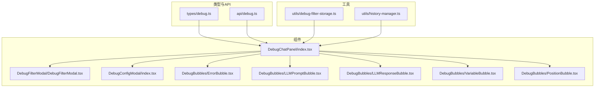

**图表来源**
- [packages/script-editor/src/types/debug.ts](file://packages/script-editor/src/types/debug.ts#L1-L189)
- [packages/script-editor/src/api/debug.ts](file://packages/script-editor/src/api/debug.ts#L1-L185)
- [packages/script-editor/src/components/DebugChatPanel/index.tsx](file://packages/script-editor/src/components/DebugChatPanel/index.tsx#L1-L1178)
- [packages/script-editor/src/components/DebugFilterModal/DebugFilterModal.tsx](file://packages/script-editor/src/components/DebugFilterModal/DebugFilterModal.tsx#L1-L162)
- [packages/script-editor/src/components/DebugConfigModal/index.tsx](file://packages/script-editor/src/components/DebugConfigModal/index.tsx#L1-L230)
- [packages/script-editor/src/components/DebugBubbles/ErrorBubble.tsx](file://packages/script-editor/src/components/DebugBubbles/ErrorBubble.tsx#L1-L205)
- [packages/script-editor/src/components/DebugBubbles/LLMPromptBubble.tsx](file://packages/script-editor/src/components/DebugBubbles/LLMPromptBubble.tsx#L1-L176)
- [packages/script-editor/src/components/DebugBubbles/LLMResponseBubble.tsx](file://packages/script-editor/src/components/DebugBubbles/LLMResponseBubble.tsx#L1-L190)
- [packages/script-editor/src/components/DebugBubbles/VariableBubble.tsx](file://packages/script-editor/src/components/DebugBubbles/VariableBubble.tsx#L1-L230)
- [packages/script-editor/src/components/DebugBubbles/PositionBubble.tsx](file://packages/script-editor/src/components/DebugBubbles/PositionBubble.tsx#L1-L282)
- [packages/script-editor/src/utils/debug-filter-storage.ts](file://packages/script-editor/src/utils/debug-filter-storage.ts#L1-L51)
- [packages/script-editor/src/utils/history-manager.ts](file://packages/script-editor/src/utils/history-manager.ts#L1-L340)

**章节来源**
- [packages/script-editor/src/types/debug.ts](file://packages/script-editor/src/types/debug.ts#L1-L189)
- [packages/script-editor/src/api/debug.ts](file://packages/script-editor/src/api/debug.ts#L1-L185)
- [packages/script-editor/src/components/DebugChatPanel/index.tsx](file://packages/script-editor/src/components/DebugChatPanel/index.tsx#L1-L1178)

## 核心组件
- 调试气泡类型与内容结构：统一定义气泡类型枚举、联合内容类型及各类型内容字段，确保组件间契约一致。
- 错误气泡：展示错误代码、类型、消息、位置、恢复建议、堆栈跟踪，支持复制与"从错误重新开始"。
- LLM提示词/响应气泡：展示系统提示词、用户提示词、对话历史、模型信息、Token用量、原始响应JSON等，支持复制与展开。
- 变量气泡：按作用域分组展示session/phase/topic变量，突出变化项，支持导出为JSON。
- 位置气泡：显示详细的执行路径信息（Phase → Topic → Action），支持复制路径与导航树集成。
- 调试过滤器：控制各类气泡的显示/隐藏、一键展开/折叠、仅错误模式、显示全部、重置默认。
- 调试聊天面板：承载消息列表与气泡渲染，负责会话加载、消息发送、错误/变量/LLM/位置气泡生成、位置更新。
- 调试配置弹窗：选择工程与入口会话脚本，导入脚本获取scriptId，创建调试会话并启动聊天。
- 过滤器存储：基于localStorage持久化用户偏好，提供加载/保存/清除。

**章节来源**
- [packages/script-editor/src/types/debug.ts](file://packages/script-editor/src/types/debug.ts#L1-L189)
- [packages/script-editor/src/components/DebugBubbles/ErrorBubble.tsx](file://packages/script-editor/src/components/DebugBubbles/ErrorBubble.tsx#L1-L205)
- [packages/script-editor/src/components/DebugBubbles/LLMPromptBubble.tsx](file://packages/script-editor/src/components/DebugBubbles/LLMPromptBubble.tsx#L1-L176)
- [packages/script-editor/src/components/DebugBubbles/LLMResponseBubble.tsx](file://packages/script-editor/src/components/DebugBubbles/LLMResponseBubble.tsx#L1-L190)
- [packages/script-editor/src/components/DebugBubbles/VariableBubble.tsx](file://packages/script-editor/src/components/DebugBubbles/VariableBubble.tsx#L1-L230)
- [packages/script-editor/src/components/DebugBubbles/PositionBubble.tsx](file://packages/script-editor/src/components/DebugBubbles/PositionBubble.tsx#L1-L282)
- [packages/script-editor/src/components/DebugFilterModal/DebugFilterModal.tsx](file://packages/script-editor/src/components/DebugFilterModal/DebugFilterModal.tsx#L1-L162)
- [packages/script-editor/src/components/DebugChatPanel/index.tsx](file://packages/script-editor/src/components/DebugChatPanel/index.tsx#L1-L1178)
- [packages/script-editor/src/components/DebugConfigModal/index.tsx](file://packages/script-editor/src/components/DebugConfigModal/index.tsx#L1-L230)
- [packages/script-editor/src/utils/debug-filter-storage.ts](file://packages/script-editor/src/utils/debug-filter-storage.ts#L1-L51)

## 架构总览
调试工具的端到端流程如下：
- 用户通过"调试配置弹窗"选择工程与会话脚本，导入脚本并创建调试会话，获得sessionId。
- "调试聊天面板"加载会话详情与消息历史，渲染消息与对应气泡。
- 用户发送消息后，后端返回AI回复与调试信息（错误、变量、LLM提示词/响应、位置），前端据此生成相应气泡并更新UI。
- 用户可通过过滤器弹窗调整显示策略，或一键展开/折叠气泡。

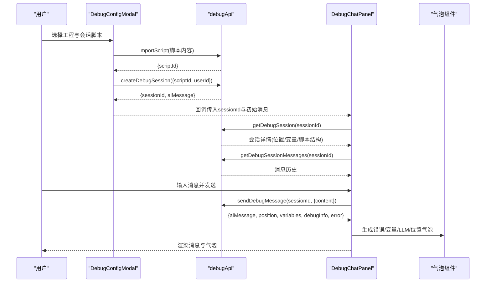

**图表来源**
- [packages/script-editor/src/components/DebugConfigModal/index.tsx](file://packages/script-editor/src/components/DebugConfigModal/index.tsx#L88-L131)
- [packages/script-editor/src/api/debug.ts](file://packages/script-editor/src/api/debug.ts#L120-L132)
- [packages/script-editor/src/components/DebugChatPanel/index.tsx](file://packages/script-editor/src/components/DebugChatPanel/index.tsx#L210-L316)
- [packages/script-editor/src/components/DebugChatPanel/index.tsx](file://packages/script-editor/src/components/DebugChatPanel/index.tsx#L330-L541)
- [packages/script-editor/src/api/debug.ts](file://packages/script-editor/src/api/debug.ts#L67-L114)

## 详细组件分析

### 位置气泡（PositionBubble）
- 展示维度：执行路径（Phase → Topic → Action）、索引信息、ID标识、摘要文本。
- 交互能力：折叠/展开、复制完整路径信息。
- 设计要点：黄色/橙色主题容器，执行路径以层级卡片形式展示，支持复制路径到剪贴板。

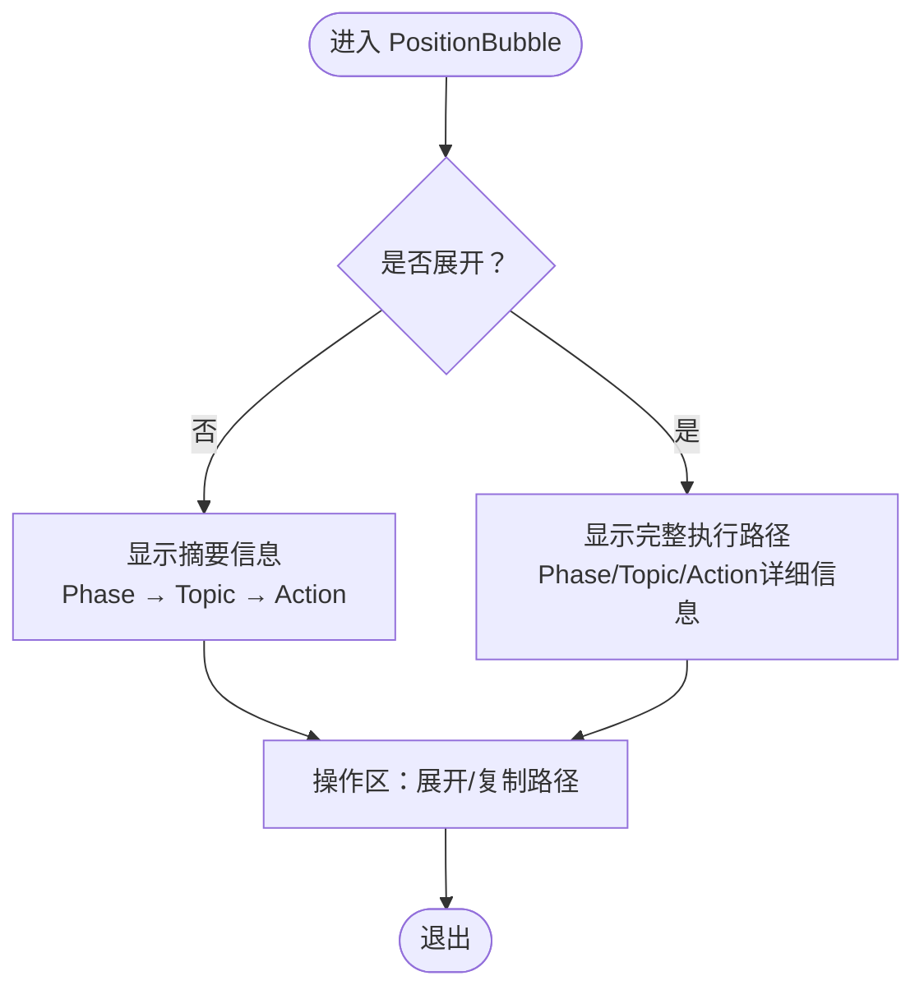

**图表来源**
- [packages/script-editor/src/components/DebugBubbles/PositionBubble.tsx](file://packages/script-editor/src/components/DebugBubbles/PositionBubble.tsx#L56-L282)

**章节来源**
- [packages/script-editor/src/components/DebugBubbles/PositionBubble.tsx](file://packages/script-editor/src/components/DebugBubbles/PositionBubble.tsx#L1-L282)
- [packages/script-editor/src/types/debug.ts](file://packages/script-editor/src/types/debug.ts#L135-L156)

### 错误气泡（ErrorBubble）
- 展示维度：时间戳、错误代码、错误类型、简要消息、执行位置（Phase/Topic/Action）、技术详情、堆栈跟踪、恢复建议。
- 交互能力：折叠/展开、复制错误信息、从错误重新开始。
- 设计要点：红色主题容器，关键信息加粗，技术详情与堆栈跟踪提供滚动容器，便于阅读。

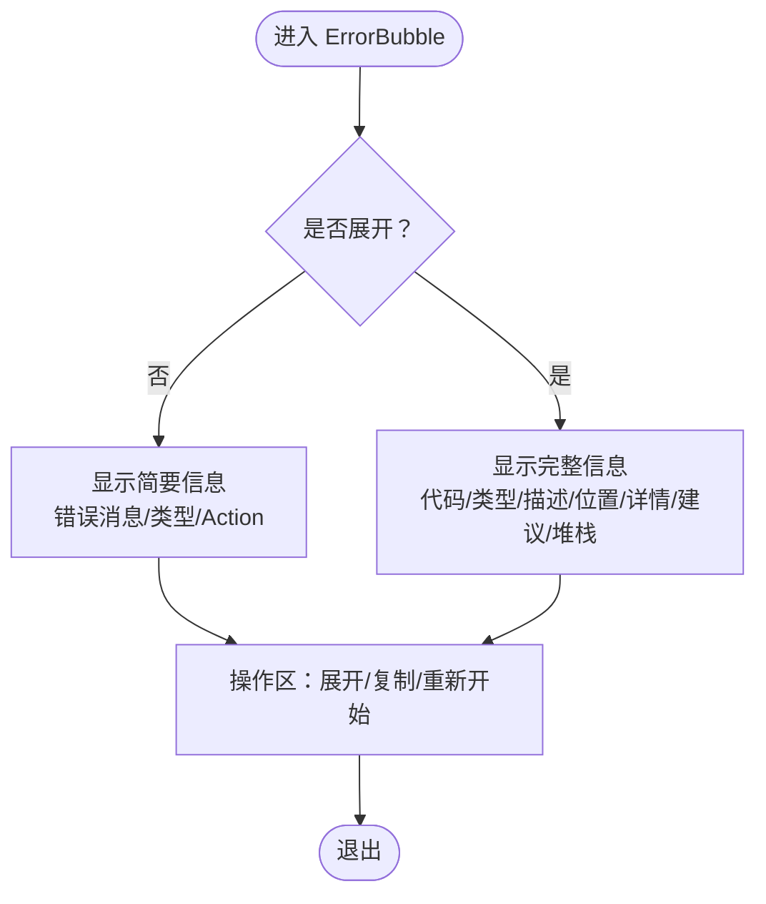

**图表来源**
- [packages/script-editor/src/components/DebugBubbles/ErrorBubble.tsx](file://packages/script-editor/src/components/DebugBubbles/ErrorBubble.tsx#L56-L205)

**章节来源**
- [packages/script-editor/src/components/DebugBubbles/ErrorBubble.tsx](file://packages/script-editor/src/components/DebugBubbles/ErrorBubble.tsx#L1-L205)
- [packages/script-editor/src/types/debug.ts](file://packages/script-editor/src/types/debug.ts#L42-L67)

### LLM提示词气泡（LLMPromptBubble）
- 展示维度：系统提示词、用户提示词、对话历史（角色与内容）、预览文本。
- 交互能力：折叠/展开、复制提示词（含系统与用户提示词、历史）。
- 设计要点：蓝色主题容器，对话历史以列表形式展示，预览文本截断处理。

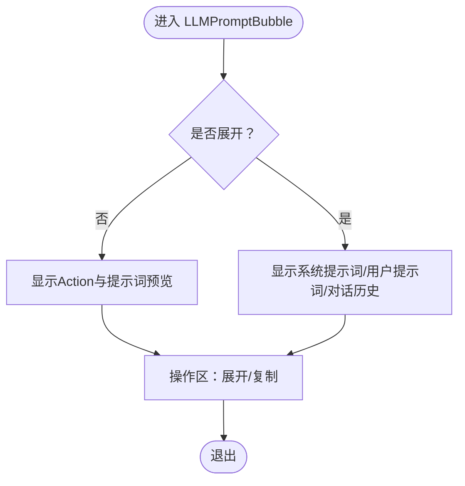

**图表来源**
- [packages/script-editor/src/components/DebugBubbles/LLMPromptBubble.tsx](file://packages/script-editor/src/components/DebugBubbles/LLMPromptBubble.tsx#L50-L176)

**章节来源**
- [packages/script-editor/src/components/DebugBubbles/LLMPromptBubble.tsx](file://packages/script-editor/src/components/DebugBubbles/LLMPromptBubble.tsx#L1-L176)
- [packages/script-editor/src/types/debug.ts](file://packages/script-editor/src/types/debug.ts#L69-L82)

### LLM响应气泡（LLMResponseBubble）
- 展示维度：模型名、Token使用量/上限、预览文本、原始响应JSON。
- 交互能力：折叠/展开、复制原始响应JSON。
- 设计要点：深蓝主题容器，原始响应以等宽字体展示并提供滚动，便于核对结构。

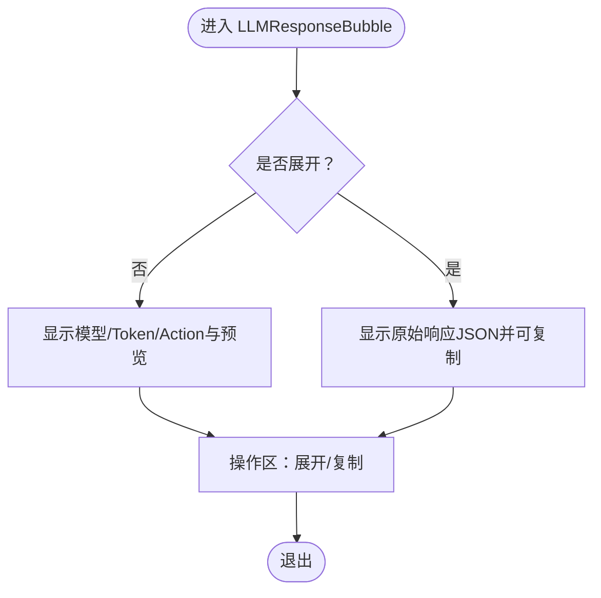

**图表来源**
- [packages/script-editor/src/components/DebugBubbles/LLMResponseBubble.tsx](file://packages/script-editor/src/components/DebugBubbles/LLMResponseBubble.tsx#L47-L190)

**章节来源**
- [packages/script-editor/src/components/DebugBubbles/LLMResponseBubble.tsx](file://packages/script-editor/src/components/DebugBubbles/LLMResponseBubble.tsx#L1-L190)
- [packages/script-editor/src/types/debug.ts](file://packages/script-editor/src/types/debug.ts#L84-L95)

### 变量气泡（VariableBubble）
- 展示维度：变化变量（名称、旧值→新值）、按作用域分组的全量变量（session/phase/topic）。
- 交互能力：折叠/展开、导出为JSON（包含时间戳、Action、变化与全量变量）。
- 设计要点：绿色主题容器，变化项高亮显示，全量变量以键值对列表展示，支持monospace字体便于对齐。

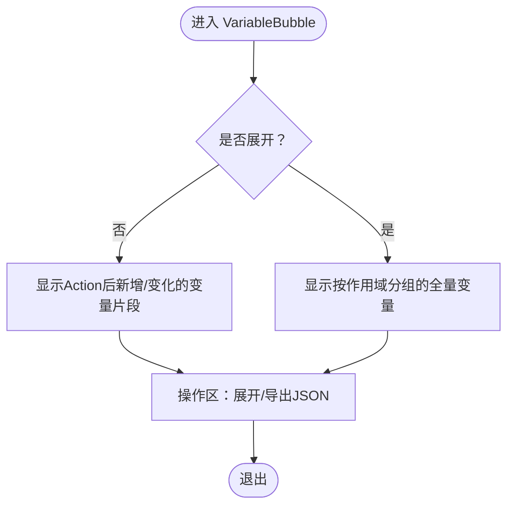

**图表来源**
- [packages/script-editor/src/components/DebugBubbles/VariableBubble.tsx](file://packages/script-editor/src/components/DebugBubbles/VariableBubble.tsx#L64-L230)

**章节来源**
- [packages/script-editor/src/components/DebugBubbles/VariableBubble.tsx](file://packages/script-editor/src/components/DebugBubbles/VariableBubble.tsx#L1-L230)
- [packages/script-editor/src/types/debug.ts](file://packages/script-editor/src/types/debug.ts#L97-L116)

### 调试过滤器（DebugFilterModal + 本地存储）
- 过滤器配置：控制错误、LLM提示词、LLM响应、变量、执行日志、位置信息的显示。
- 本地持久化：使用localStorage保存用户偏好，默认值来自类型定义。
- 快捷操作：全部展开、全部折叠、仅错误、显示全部、重置默认。

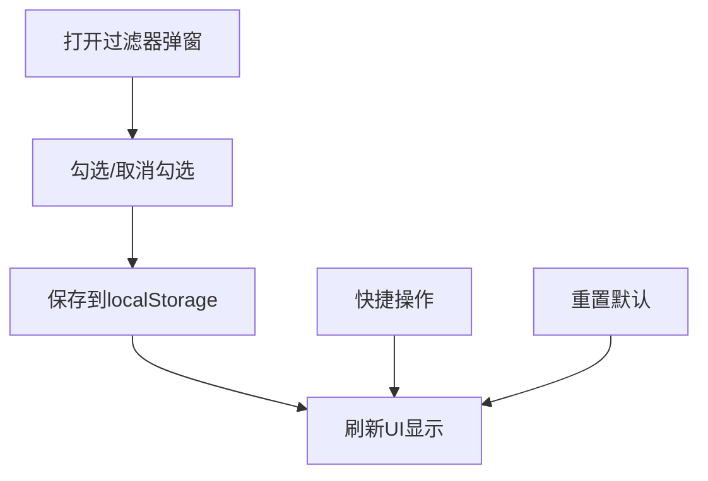

**图表来源**
- [packages/script-editor/src/components/DebugFilterModal/DebugFilterModal.tsx](file://packages/script-editor/src/components/DebugFilterModal/DebugFilterModal.tsx#L69-L158)
- [packages/script-editor/src/utils/debug-filter-storage.ts](file://packages/script-editor/src/utils/debug-filter-storage.ts#L9-L39)
- [packages/script-editor/src/types/debug.ts](file://packages/script-editor/src/types/debug.ts#L173-L180)

**章节来源**
- [packages/script-editor/src/components/DebugFilterModal/DebugFilterModal.tsx](file://packages/script-editor/src/components/DebugFilterModal/DebugFilterModal.tsx#L1-L162)
- [packages/script-editor/src/utils/debug-filter-storage.ts](file://packages/script-editor/src/utils/debug-filter-storage.ts#L1-L51)
- [packages/script-editor/src/types/debug.ts](file://packages/script-editor/src/types/debug.ts#L158-L189)

### 调试聊天面板（DebugChatPanel）
- 会话加载：获取会话详情、构建导航树、设置当前位置、加载消息历史。
- 消息发送：添加用户消息到UI，调用后端API，解析响应中的错误、变量、LLM调试信息与位置，生成对应气泡。
- 气泡渲染：根据过滤器配置决定显示哪些气泡，支持展开/折叠、复制/导出等操作。
- 重启调试：从错误重新开始或创建新会话重启。
- 导航树集成：位置气泡与导航树组件联动，提供可视化执行路径跟踪。

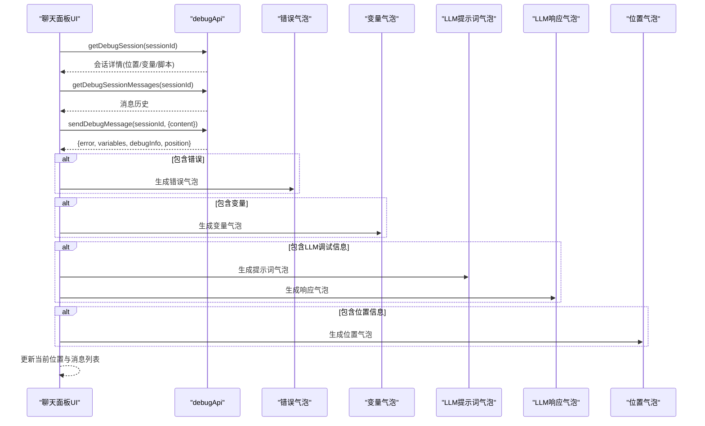

**图表来源**
- [packages/script-editor/src/components/DebugChatPanel/index.tsx](file://packages/script-editor/src/components/DebugChatPanel/index.tsx#L210-L316)
- [packages/script-editor/src/components/DebugChatPanel/index.tsx](file://packages/script-editor/src/components/DebugChatPanel/index.tsx#L330-L541)
- [packages/script-editor/src/components/DebugChatPanel/index.tsx](file://packages/script-editor/src/components/DebugChatPanel/index.tsx#L691-L746)

**章节来源**
- [packages/script-editor/src/components/DebugChatPanel/index.tsx](file://packages/script-editor/src/components/DebugChatPanel/index.tsx#L1-L1178)

### 调试配置弹窗（DebugConfigModal）
- 功能：选择工程与会话脚本，导入脚本获取scriptId，创建调试会话并返回sessionId与初始AI消息。
- 流程：导入脚本→创建会话→成功回调→启动调试聊天面板。

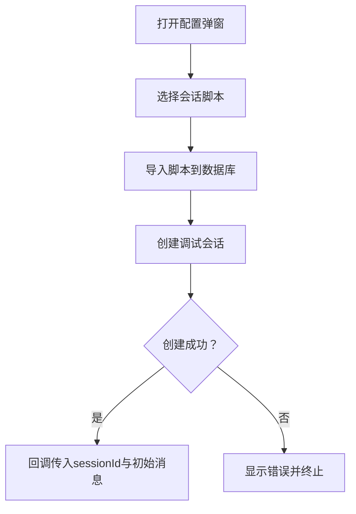

**图表来源**
- [packages/script-editor/src/components/DebugConfigModal/index.tsx](file://packages/script-editor/src/components/DebugConfigModal/index.tsx#L88-L131)

**章节来源**
- [packages/script-editor/src/components/DebugConfigModal/index.tsx](file://packages/script-editor/src/components/DebugConfigModal/index.tsx#L1-L230)
- [packages/script-editor/src/api/debug.ts](file://packages/script-editor/src/api/debug.ts#L120-L132)

## 依赖分析
- 组件耦合
  - DebugChatPanel依赖类型定义、API封装、气泡组件、过滤器弹窗与本地存储工具。
  - 气泡组件彼此独立，仅依赖类型定义与UI库。
  - 过滤器弹窗与本地存储工具解耦，便于扩展其他偏好项。
- 外部依赖
  - UI库：Ant Design组件（Button、Space、Modal、Alert、Empty、Spin等）。
  - HTTP客户端：Axios用于API调用。
  - 本地存储：localStorage用于调试过滤器持久化。
- 潜在循环依赖
  - 当前结构清晰，组件间为单向依赖（面板→组件/工具），未见循环。

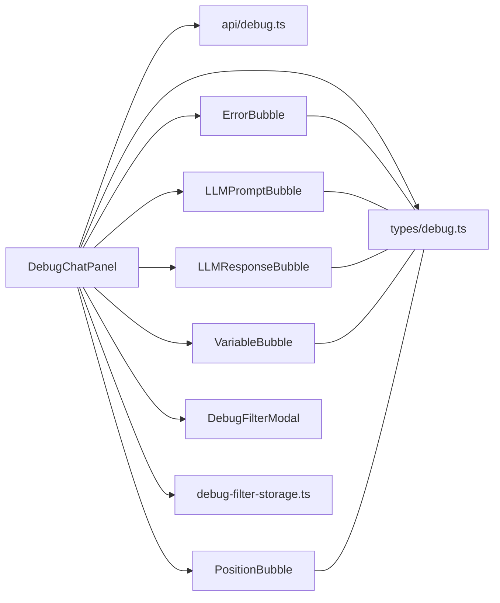

**图表来源**
- [packages/script-editor/src/components/DebugChatPanel/index.tsx](file://packages/script-editor/src/components/DebugChatPanel/index.tsx#L1-L1178)
- [packages/script-editor/src/types/debug.ts](file://packages/script-editor/src/types/debug.ts#L1-L189)
- [packages/script-editor/src/api/debug.ts](file://packages/script-editor/src/api/debug.ts#L1-L185)
- [packages/script-editor/src/utils/debug-filter-storage.ts](file://packages/script-editor/src/utils/debug-filter-storage.ts#L1-L51)

**章节来源**
- [packages/script-editor/src/components/DebugChatPanel/index.tsx](file://packages/script-editor/src/components/DebugChatPanel/index.tsx#L1-L1178)
- [packages/script-editor/src/types/debug.ts](file://packages/script-editor/src/types/debug.ts#L1-L189)

## 性能考量
- 气泡数量与渲染
  - 建议限制气泡数量（如最近100条），超出时自动清理旧气泡，避免DOM膨胀。
  - 对大量气泡场景，可引入虚拟滚动优化渲染性能。
- 展开策略
  - 默认折叠，仅在用户主动展开时渲染完整内容，降低首屏压力。
- 网络与状态
  - 消息发送时启用加载态，避免重复提交；错误时显示简洁提示，必要时提供详细错误弹窗。
- 本地存储
  - 过滤器配置读写需捕获异常并降级为默认值，保证稳定性。
- 位置信息更新
  - 位置气泡与导航树联动时，避免频繁重渲染，可使用React.memo优化性能。

## 故障排查指南
- 无法加载会话
  - 检查sessionId是否有效；查看网络请求错误与后端响应；若无消息历史，可使用初始消息兜底。
- 发送消息失败
  - 查看错误响应中的error对象，必要时在错误详情弹窗中查看堆栈与恢复建议；检查网络超时与权限。
- 气泡未显示
  - 检查过滤器配置是否勾选对应类型；尝试"显示全部"或"仅错误"模式；确认localStorage未被清理。
- 变量导出异常
  - 确认导出JSON的blob创建与下载链接触发正常；检查浏览器下载权限。
- 重启调试无效
  - 确认会话scriptId有效；检查新会话创建是否成功；注意sessionId变更由父组件控制，面板内仅提示。
- 位置信息显示异常
  - 检查导航树构建是否成功；确认位置信息格式正确；验证位置气泡渲染逻辑。

**章节来源**
- [packages/script-editor/src/components/DebugChatPanel/index.tsx](file://packages/script-editor/src/components/DebugChatPanel/index.tsx#L292-L316)
- [packages/script-editor/src/components/DebugChatPanel/index.tsx](file://packages/script-editor/src/components/DebugChatPanel/index.tsx#L508-L541)
- [packages/script-editor/src/utils/debug-filter-storage.ts](file://packages/script-editor/src/utils/debug-filter-storage.ts#L10-L39)

## 结论
调试工具通过"气泡化"的方式将复杂调试信息（错误、LLM提示词/响应、变量状态、执行位置）以直观、可交互的形式呈现，配合灵活的过滤器与本地持久化，显著提升了脚本调试的效率与可维护性。聊天面板作为中枢，串联起会话生命周期、消息流转与气泡生成，形成闭环的实时调试工作流。新增的位置气泡组件进一步增强了执行路径的可视化跟踪能力，配合导航树组件提供了更完善的调试体验。后续可在现有基础上扩展执行日志与位置气泡，并进一步优化大规模气泡场景下的性能与交互体验。

## 附录

### 扩展开发指南
- 自定义调试气泡
  - 新增类型：在类型定义中扩展DebugBubbleType与DebugBubbleContent联合类型，并补充对应内容接口。
  - 新增组件：参考现有气泡组件的结构（时间戳、折叠/展开、操作区），实现渲染与交互。
  - 集成面板：在聊天面板的消息渲染处增加类型判断与组件映射，并在过滤器中添加开关。
- 自定义过滤器规则
  - 在类型定义中扩展DebugOutputFilter字段；在过滤器弹窗中添加UI控件；在本地存储工具中处理默认值与兼容性。
- 调试事件处理
  - 在聊天面板中监听后端返回的调试信息（错误、变量、LLM、位置），构造DebugBubble并加入队列；结合导航树组件实现快速定位。
- 位置信息集成
  - 位置气泡与导航树组件联动，提供可视化执行路径跟踪；支持点击跳转到具体执行位置。

**章节来源**
- [packages/script-editor/src/types/debug.ts](file://packages/script-editor/src/types/debug.ts#L9-L189)
- [packages/script-editor/src/components/DebugChatPanel/index.tsx](file://packages/script-editor/src/components/DebugChatPanel/index.tsx#L691-L746)
- [packages/script-editor/src/components/DebugFilterModal/DebugFilterModal.tsx](file://packages/script-editor/src/components/DebugFilterModal/DebugFilterModal.tsx#L69-L158)
- [packages/script-editor/src/utils/debug-filter-storage.ts](file://packages/script-editor/src/utils/debug-filter-storage.ts#L9-L39)