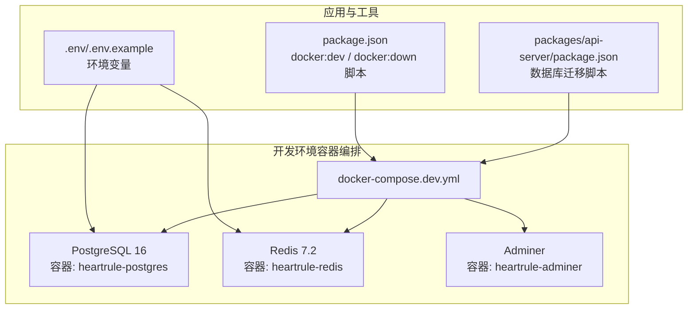
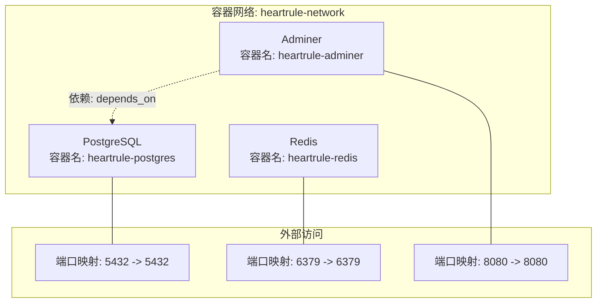
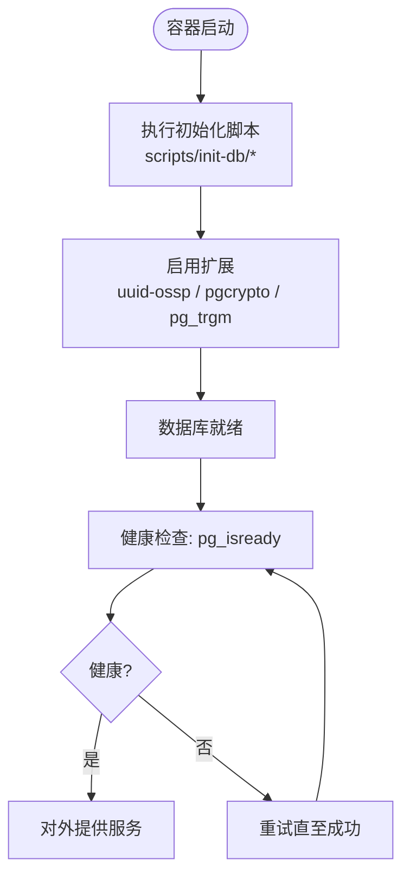
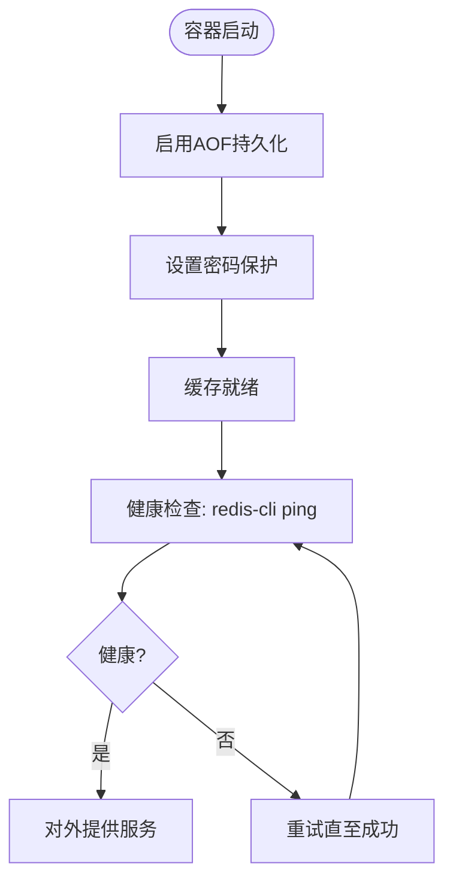
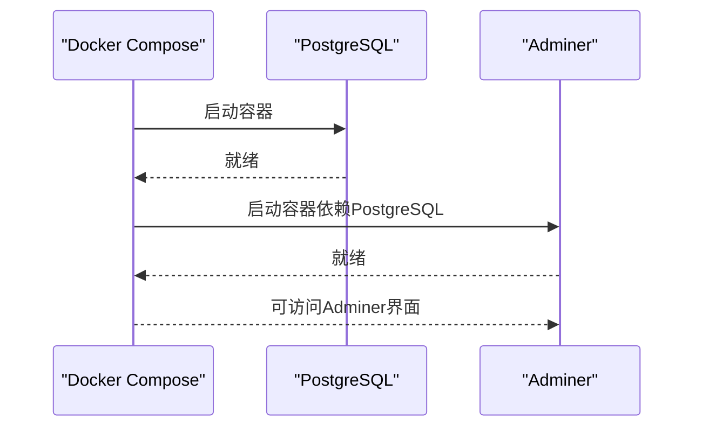
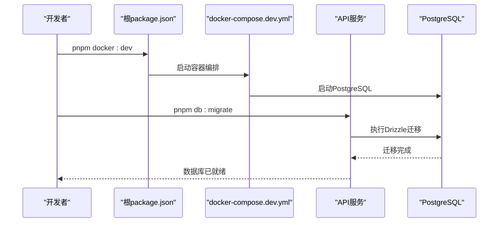
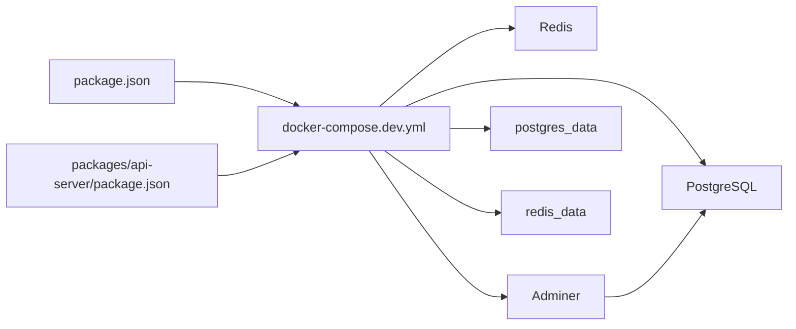

# Docker容器化部署

<cite>
**本文引用的文件**
- [docker-compose.dev.yml](file://docker-compose.dev.yml)
- [README.md](file://README.md)
- [DEV_START_GUIDE.md](file://DEV_START_GUIDE.md)
- [QUICK_START_GUIDE.md](file://QUICK_START_GUIDE.md)
- [.env](file://.env)
- [.env.example](file://.env.example)
- [package.json](file://package.json)
- [packages/api-server/package.json](file://packages/api-server/package.json)
- [scripts/init-db/01-extensions.sql](file://scripts/init-db/01-extensions.sql)
- [packages/api-server/src/db/schema.ts](file://packages/api-server/src/db/schema.ts)
</cite>

## 目录
1. [简介](#简介)
2. [项目结构](#项目结构)
3. [核心组件](#核心组件)
4. [架构总览](#架构总览)
5. [详细组件分析](#详细组件分析)
6. [依赖关系分析](#依赖关系分析)
7. [性能考虑](#性能考虑)
8. [故障排查指南](#故障排查指南)
9. [结论](#结论)
10. [附录](#附录)

## 简介
本文件面向HeartRule AI咨询引擎的Docker容器化部署，聚焦开发环境的docker-compose编排，详细说明PostgreSQL数据库、Redis缓存与Adminer管理界面的配置要点，解释容器间网络通信、数据卷挂载、环境变量设置、健康检查与日志查看方法，并给出数据库初始化脚本的使用说明与数据持久化策略。同时对比开发与生产环境的差异，帮助读者快速搭建稳定可靠的本地开发与测试环境。

## 项目结构
本项目采用monorepo结构，Docker开发环境通过docker-compose.dev.yml集中编排数据库、缓存与管理界面，配合根目录与各包的package.json脚本实现一键启动与数据库迁移。

图表来源
- [docker-compose.dev.yml](file://docker-compose.dev.yml#L1-L64)
- [package.json](file://package.json#L28-L29)
- [packages/api-server/package.json](file://packages/api-server/package.json#L12-L15)
- [.env](file://.env#L6-L10)

章节来源
- [docker-compose.dev.yml](file://docker-compose.dev.yml#L1-L64)
- [README.md](file://README.md#L63-L94)
- [QUICK_START_GUIDE.md](file://QUICK_START_GUIDE.md#L14-L40)

## 核心组件
- PostgreSQL 16数据库：提供会话、消息、脚本、工程、变量、记忆等核心数据的持久化存储；通过初始化脚本启用必要扩展；使用健康检查保障服务可用性。
- Redis 7.2缓存：提供会话状态、临时数据与键值缓存；开启AOF持久化与密码保护；健康检查确保连接可用。
- Adminer：PostgreSQL管理界面，通过依赖关系自动等待数据库就绪后启动，便于本地调试与数据校验。

章节来源
- [docker-compose.dev.yml](file://docker-compose.dev.yml#L5-L23)
- [docker-compose.dev.yml](file://docker-compose.dev.yml#L26-L40)
- [docker-compose.dev.yml](file://docker-compose.dev.yml#L43-L53)

## 架构总览
开发环境容器网络采用自定义桥接网络，PostgreSQL与Redis通过容器名在内部网络互通，Adminer依赖PostgreSQL启动。根脚本负责启动/关闭容器编排，API服务通过环境变量连接数据库与缓存。

图表来源
- [docker-compose.dev.yml](file://docker-compose.dev.yml#L8-L9)
- [docker-compose.dev.yml](file://docker-compose.dev.yml#L29-L30)
- [docker-compose.dev.yml](file://docker-compose.dev.yml#L46-L47)
- [docker-compose.dev.yml](file://docker-compose.dev.yml#L50-L51)

## 详细组件分析

### PostgreSQL数据库服务配置
- 镜像与端口映射：使用postgres:16-alpine，将容器5432端口映射到主机5432端口。
- 环境变量：设置数据库用户、密码与默认数据库名，用于首次初始化与连接。
- 数据卷挂载：
  - postgres_data：持久化数据库数据目录。
  - scripts/init-db：将初始化SQL脚本挂载到容器的初始化目录，容器启动时自动执行。
- 健康检查：使用pg_isready检测数据库是否可连接，间隔与超时、重试次数合理设置。
- 网络：加入自定义桥接网络，便于与其他服务通信。

图表来源
- [docker-compose.dev.yml](file://docker-compose.dev.yml#L14-L21)
- [scripts/init-db/01-extensions.sql](file://scripts/init-db/01-extensions.sql#L4-L11)

章节来源
- [docker-compose.dev.yml](file://docker-compose.dev.yml#L5-L23)
- [scripts/init-db/01-extensions.sql](file://scripts/init-db/01-extensions.sql#L1-L17)

### Redis缓存服务配置
- 镜像与端口映射：使用redis:7.2-alpine，将容器6379端口映射到主机6379端口。
- 命令参数：开启AOF持久化与密码保护，提升数据安全性与可靠性。
- 数据卷挂载：redis_data持久化RDB/AOF文件。
- 健康检查：通过redis-cli ping并携带密码进行检测。
- 网络：加入自定义桥接网络。

图表来源
- [docker-compose.dev.yml](file://docker-compose.dev.yml#L27-L38)
- [docker-compose.dev.yml](file://docker-compose.dev.yml#L32-L33)

章节来源
- [docker-compose.dev.yml](file://docker-compose.dev.yml#L26-L40)

### Adminer管理界面配置
- 镜像与端口映射：使用adminer:latest，将容器8080端口映射到主机8080端口。
- 环境变量：设置默认服务器为postgres，便于直接连接数据库。
- 依赖关系：通过depends_on确保在PostgreSQL就绪后再启动。
- 网络：加入自定义桥接网络，可直接通过容器名访问数据库。

图表来源
- [docker-compose.dev.yml](file://docker-compose.dev.yml#L43-L53)

章节来源
- [docker-compose.dev.yml](file://docker-compose.dev.yml#L42-L53)

### 环境变量与连接配置
- 数据库连接：通过DATABASE_URL指向本地PostgreSQL，格式包含用户、密码、主机、端口与数据库名。
- Redis连接：通过REDIS_URL指向本地Redis，包含密码与端口。
- API服务端口：API_PORT=8000，API_HOST=0.0.0.0，便于容器外访问。
- 日志级别与调试：LOG_LEVEL与DEBUG便于本地调试与问题定位。

章节来源
- [.env](file://.env#L6-L10)
- [.env](file://.env#L27-L35)
- [.env.example](file://.env.example#L7-L21)

### 数据库初始化脚本与迁移
- 初始化脚本：scripts/init-db/01-extensions.sql启用uuid-ossp、pgcrypto、pg_trgm等扩展，为后续Drizzle迁移与业务表结构奠定基础。
- 迁移执行：通过packages/api-server/package.json中的db:migrate脚本执行Drizzle迁移，生成并应用数据库结构变更。
- 根脚本联动：package.json提供docker:dev与docker:down，一键启动/关闭开发环境容器。

图表来源
- [package.json](file://package.json#L28-L29)
- [packages/api-server/package.json](file://packages/api-server/package.json#L12-L15)
- [scripts/init-db/01-extensions.sql](file://scripts/init-db/01-extensions.sql#L1-L17)

章节来源
- [scripts/init-db/01-extensions.sql](file://scripts/init-db/01-extensions.sql#L1-L17)
- [packages/api-server/package.json](file://packages/api-server/package.json#L12-L15)
- [package.json](file://package.json#L28-L29)

### 数据持久化策略
- PostgreSQL：通过postgres_data命名卷持久化/var/lib/postgresql/data，避免容器重建导致数据丢失。
- Redis：通过redis_data命名卷持久化/data目录，结合AOF开启确保数据落盘。
- 初始化脚本：通过挂载scripts/init-db到/docker-entrypoint-initdb.d，容器首次启动时自动执行，确保扩展与基础结构一致。

章节来源
- [docker-compose.dev.yml](file://docker-compose.dev.yml#L14-L16)
- [docker-compose.dev.yml](file://docker-compose.dev.yml#L32-L33)

### 开发环境与生产环境差异
- 开发环境（docker-compose.dev.yml）：
  - 使用本地命名卷（local driver）持久化数据。
  - Adminer用于本地数据库管理。
  - 健康检查用于容器自愈与可观测性。
- 生产环境（README中提及）：
  - 基于TypeScript技术栈与Docker Compose部署。
  - 使用PostgreSQL作为数据存储。
  - 未在仓库中提供生产环境compose文件，需另行准备（如使用外部数据库、Redis集群、负载均衡、SSL等）。

章节来源
- [README.md](file://README.md#L208-L216)
- [docker-compose.dev.yml](file://docker-compose.dev.yml#L55-L63)

## 依赖关系分析
- 容器依赖：Adminer通过depends_on依赖PostgreSQL，确保数据库可用后再启动管理界面。
- 网络依赖：三个服务均加入自定义桥接网络，容器间可通过容器名互相访问。
- 数据卷依赖：PostgreSQL与Redis分别挂载本地卷，实现数据持久化。
- 脚本依赖：根package.json提供docker:dev与docker:down，API服务提供db:migrate脚本。

图表来源
- [docker-compose.dev.yml](file://docker-compose.dev.yml#L50-L53)
- [docker-compose.dev.yml](file://docker-compose.dev.yml#L55-L63)
- [package.json](file://package.json#L28-L29)
- [packages/api-server/package.json](file://packages/api-server/package.json#L12-L15)

章节来源
- [docker-compose.dev.yml](file://docker-compose.dev.yml#L50-L53)
- [docker-compose.dev.yml](file://docker-compose.dev.yml#L55-L63)
- [package.json](file://package.json#L28-L29)
- [packages/api-server/package.json](file://packages/api-server/package.json#L12-L15)

## 性能考虑
- 健康检查频率与超时：合理的interval、timeout与retries有助于快速发现并恢复异常，降低服务不可用时间。
- 数据卷选择：使用本地卷满足开发场景；生产环境建议使用更可靠的存储后端与备份策略。
- 缓存与数据库：Redis开启AOF与密码保护，提升可靠性与安全性；数据库扩展启用有助于查询与索引优化。

[本节为通用指导，无需列出具体文件来源]

## 故障排查指南
- 端口冲突：若启动失败提示端口被占用，可查找占用进程并终止，或调整映射端口。
- Docker未启动：确认Docker Desktop已启动且状态正常，再重新执行启动命令。
- 数据库连接失败：检查PostgreSQL容器状态与日志，必要时重启容器。
- 健康检查失败：查看容器健康状态与日志，确认数据库与缓存服务可用性。

章节来源
- [DEV_START_GUIDE.md](file://DEV_START_GUIDE.md#L67-L113)
- [QUICK_START_GUIDE.md](file://QUICK_START_GUIDE.md#L225-L283)

## 结论
通过docker-compose.dev.yml，HeartRule项目实现了PostgreSQL、Redis与Adminer的一键编排，配合根与API服务的脚本，形成从容器启动到数据库迁移的完整开发流水线。开发环境强调易用性与可观测性，生产环境则需进一步强化安全、高可用与监控策略。建议在生产部署前补充专用的生产环境编排文件，并对数据库与缓存进行更严格的配置与备份。

[本节为总结性内容，无需列出具体文件来源]

## 附录

### 容器启动与停止命令
- 启动开发环境：通过根脚本一键启动PostgreSQL与Redis。
- 停止开发环境：通过根脚本一键停止并清理容器。
- 手动启动/停止：可直接使用docker-compose命令指定compose文件。

章节来源
- [package.json](file://package.json#L28-L29)
- [DEV_START_GUIDE.md](file://DEV_START_GUIDE.md#L93-L101)

### 服务健康检查配置
- PostgreSQL健康检查：使用pg_isready检测数据库连接。
- Redis健康检查：使用redis-cli ping并携带密码。
- Adminer健康检查：依赖PostgreSQL就绪后启动。

章节来源
- [docker-compose.dev.yml](file://docker-compose.dev.yml#L17-L21)
- [docker-compose.dev.yml](file://docker-compose.dev.yml#L34-L38)
- [docker-compose.dev.yml](file://docker-compose.dev.yml#L50-L51)

### 日志查看方法
- 查看PostgreSQL容器日志：通过容器名查看日志，定位连接与初始化问题。
- 查看Redis容器日志：确认AOF与密码配置是否生效。
- 查看Adminer容器日志：确认其依赖的数据库连接状态。

章节来源
- [QUICK_START_GUIDE.md](file://QUICK_START_GUIDE.md#L279-L282)

### 数据库初始化与迁移
- 初始化脚本：启用uuid-ossp、pgcrypto、pg_trgm等扩展。
- 迁移执行：通过API服务脚本执行Drizzle迁移，生成业务表结构。
- Schema参考：数据库表结构定义位于API服务的schema.ts文件中。

章节来源
- [scripts/init-db/01-extensions.sql](file://scripts/init-db/01-extensions.sql#L1-L17)
- [packages/api-server/package.json](file://packages/api-server/package.json#L12-L15)
- [packages/api-server/src/db/schema.ts](file://packages/api-server/src/db/schema.ts#L1-L200)