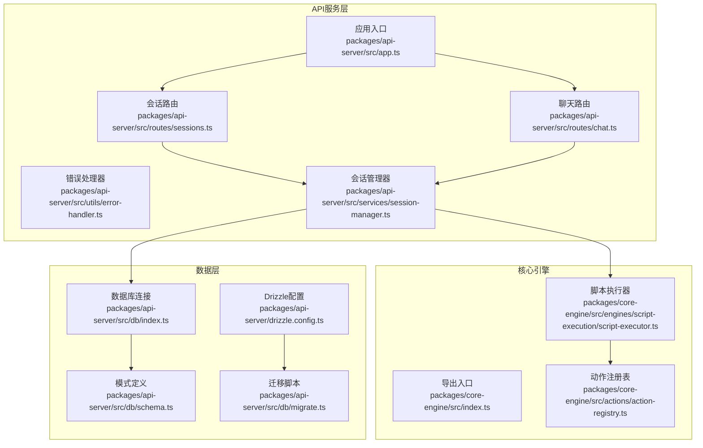
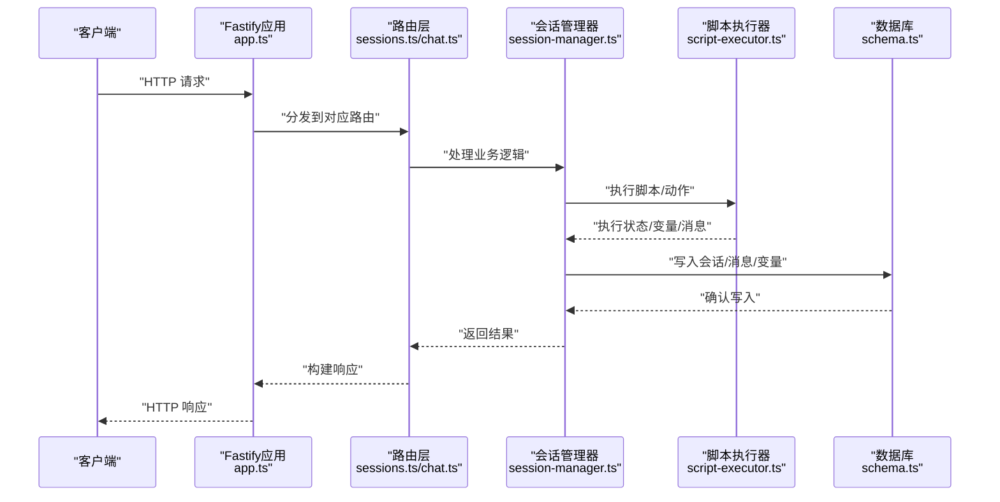
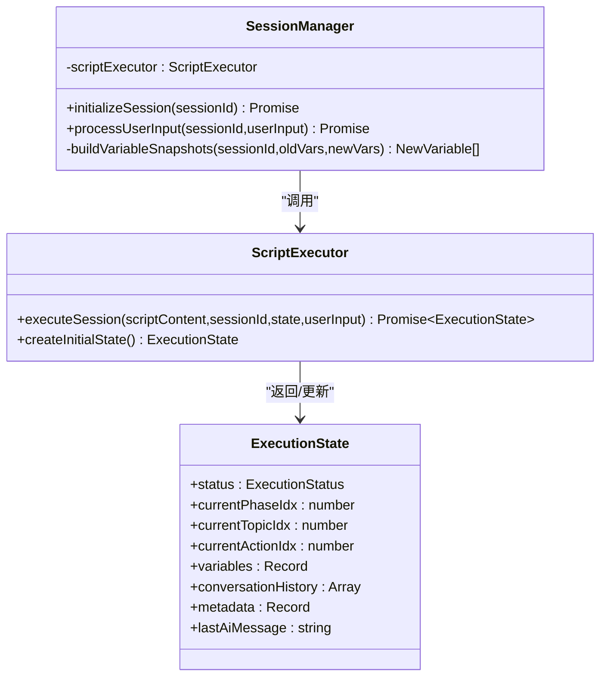
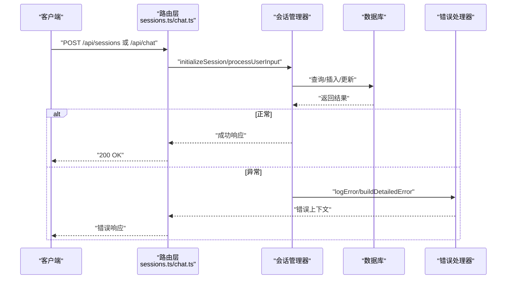
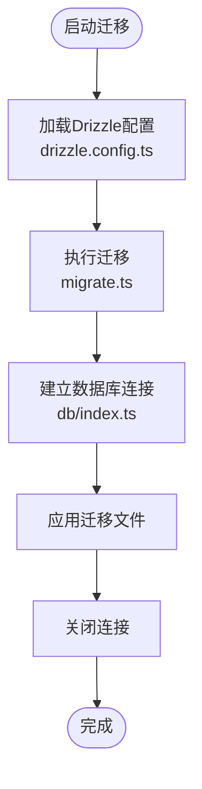
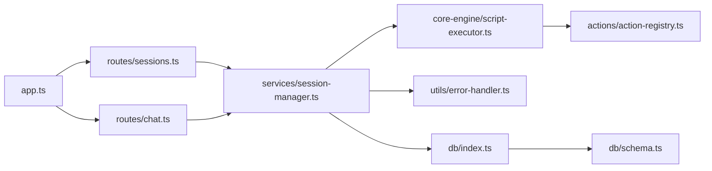

# 故障排除与维护

<cite>
**本文引用的文件**
- [packages/api-server/src/app.ts](file://packages/api-server/src/app.ts)
- [packages/api-server/src/db/index.ts](file://packages/api-server/src/db/index.ts)
- [packages/api-server/src/utils/error-handler.ts](file://packages/api-server/src/utils/error-handler.ts)
- [packages/api-server/src/routes/chat.ts](file://packages/api-server/src/routes/chat.ts)
- [packages/api-server/src/routes/sessions.ts](file://packages/api-server/src/routes/sessions.ts)
- [packages/api-server/src/services/session-manager.ts](file://packages/api-server/src/services/session-manager.ts)
- [packages/api-server/src/db/schema.ts](file://packages/api-server/src/db/schema.ts)
- [packages/api-server/drizzle.config.ts](file://packages/api-server/drizzle.config.ts)
- [packages/api-server/src/db/migrate.ts](file://packages/api-server/src/db/migrate.ts)
- [packages/core-engine/src/index.ts](file://packages/core-engine/src/index.ts)
- [packages/core-engine/src/engines/script-execution/script-executor.ts](file://packages/core-engine/src/engines/script-execution/script-execution/script-executor.ts)
- [packages/core-engine/src/actions/action-registry.ts](file://packages/core-engine/src/actions/action-registry.ts)
- [.env.example](file://.env.example)
- [package.json](file://package.json)
</cite>

## 目录
1. [简介](#简介)
2. [项目结构](#项目结构)
3. [核心组件](#核心组件)
4. [架构总览](#架构总览)
5. [详细组件分析](#详细组件分析)
6. [依赖关系分析](#依赖关系分析)
7. [性能考量](#性能考量)
8. [故障排除指南](#故障排除指南)
9. [结论](#结论)
10. [附录](#附录)

## 简介
本指南面向HeartRule AI咨询引擎的运维与开发人员，聚焦于系统运行期的故障排除与日常维护。内容覆盖数据库连接失败、API服务异常、内存泄漏排查、错误日志分析与调试技巧，并提供系统维护最佳实践（定期清理、索引优化、性能调优）、紧急故障处理流程（快速恢复、数据修复、系统回滚），以及版本升级注意事项与兼容性检查方法。

## 项目结构
系统采用Monorepo组织，核心模块包括：
- API服务层：基于Fastify，提供会话、聊天、脚本等REST接口
- 核心引擎：负责脚本解析、动作执行、变量提取与记忆管理
- 数据层：基于Drizzle ORM + PostgreSQL，定义会话、消息、脚本、变量等表结构
- 共享类型：统一领域模型与API请求/响应类型
- 脚本编辑器：可视化脚本编辑与调试界面

**图示来源**
- [packages/api-server/src/app.ts](file://packages/api-server/src/app.ts#L21-L105)
- [packages/api-server/src/routes/sessions.ts](file://packages/api-server/src/routes/sessions.ts#L13-L133)
- [packages/api-server/src/routes/chat.ts](file://packages/api-server/src/routes/chat.ts#L15-L151)
- [packages/api-server/src/services/session-manager.ts](file://packages/api-server/src/services/session-manager.ts#L21-L465)
- [packages/api-server/src/db/index.ts](file://packages/api-server/src/db/index.ts#L10-L25)
- [packages/api-server/src/db/schema.ts](file://packages/api-server/src/db/schema.ts#L22-L219)
- [packages/api-server/drizzle.config.ts](file://packages/api-server/drizzle.config.ts#L6-L15)
- [packages/api-server/src/db/migrate.ts](file://packages/api-server/src/db/migrate.ts#L8-L22)
- [packages/core-engine/src/index.ts](file://packages/core-engine/src/index.ts#L8-L27)
- [packages/core-engine/src/engines/script-execution/script-executor.ts](file://packages/core-engine/src/engines/script-execution/script-executor.ts#L62-L519)
- [packages/core-engine/src/actions/action-registry.ts](file://packages/core-engine/src/actions/action-registry.ts#L17-L45)

**章节来源**
- [packages/api-server/src/app.ts](file://packages/api-server/src/app.ts#L21-L105)
- [packages/api-server/src/db/schema.ts](file://packages/api-server/src/db/schema.ts#L22-L219)
- [packages/core-engine/src/index.ts](file://packages/core-engine/src/index.ts#L8-L27)

## 核心组件
- 应用入口与健康检查：负责启动Fastify、注册CORS/Swagger/WebSocket、根路径与健康检查端点
- 会话管理器：封装脚本执行、消息持久化、变量快照与位置信息更新
- 错误处理：统一错误映射、构建详细错误响应、记录结构化日志
- 数据库连接与迁移：加载环境变量、建立PostgreSQL连接、执行迁移
- 脚本执行引擎：按阶段/主题/动作顺序驱动执行，支持等待输入与状态序列化

**章节来源**
- [packages/api-server/src/app.ts](file://packages/api-server/src/app.ts#L21-L105)
- [packages/api-server/src/services/session-manager.ts](file://packages/api-server/src/services/session-manager.ts#L21-L465)
- [packages/api-server/src/utils/error-handler.ts](file://packages/api-server/src/utils/error-handler.ts#L95-L232)
- [packages/api-server/src/db/index.ts](file://packages/api-server/src/db/index.ts#L10-L25)
- [packages/core-engine/src/engines/script-execution/script-executor.ts](file://packages/core-engine/src/engines/script-execution/script-executor.ts#L62-L519)

## 架构总览
下图展示从客户端到API、数据库与核心引擎的调用链路与数据流向。

**图示来源**
- [packages/api-server/src/app.ts](file://packages/api-server/src/app.ts#L91-L102)
- [packages/api-server/src/routes/sessions.ts](file://packages/api-server/src/routes/sessions.ts#L55-L132)
- [packages/api-server/src/routes/chat.ts](file://packages/api-server/src/routes/chat.ts#L44-L79)
- [packages/api-server/src/services/session-manager.ts](file://packages/api-server/src/services/session-manager.ts#L73-L255)
- [packages/core-engine/src/engines/script-execution/script-executor.ts](file://packages/core-engine/src/engines/script-execution/script-executor.ts#L66-L216)
- [packages/api-server/src/db/schema.ts](file://packages/api-server/src/db/schema.ts#L22-L81)

## 详细组件分析

### 组件A：会话管理器（SessionManager）
- 职责：初始化会话、处理用户输入、驱动脚本执行、持久化消息与变量、更新会话位置与状态
- 关键流程：读取会话与脚本 → 构造执行状态 → 调用执行器 → 批量写入AI消息 → 写入变量快照 → 更新会话状态
- 错误处理：捕获异常并转换为统一错误结构，保留上下文信息（脚本ID/名称、会话ID、位置）

**图示来源**
- [packages/api-server/src/services/session-manager.ts](file://packages/api-server/src/services/session-manager.ts#L21-L465)
- [packages/core-engine/src/engines/script-execution/script-executor.ts](file://packages/core-engine/src/engines/script-execution/script-executor.ts#L62-L519)

**章节来源**
- [packages/api-server/src/services/session-manager.ts](file://packages/api-server/src/services/session-manager.ts#L73-L255)
- [packages/api-server/src/services/session-manager.ts](file://packages/api-server/src/services/session-manager.ts#L260-L464)

### 组件B：API路由与错误处理
- 会话路由：创建会话、获取会话详情、消息历史、变量、列出用户会话；对异常进行结构化错误响应
- 聊天路由：非流式与SSE流式聊天；保存用户消息并返回AI响应或事件流
- 错误处理：根据错误消息关键字映射到统一错误码与类型，生成带上下文的错误对象，记录结构化日志

**图示来源**
- [packages/api-server/src/routes/sessions.ts](file://packages/api-server/src/routes/sessions.ts#L55-L132)
- [packages/api-server/src/routes/chat.ts](file://packages/api-server/src/routes/chat.ts#L44-L79)
- [packages/api-server/src/utils/error-handler.ts](file://packages/api-server/src/utils/error-handler.ts#L95-L232)

**章节来源**
- [packages/api-server/src/routes/sessions.ts](file://packages/api-server/src/routes/sessions.ts#L135-L547)
- [packages/api-server/src/routes/chat.ts](file://packages/api-server/src/routes/chat.ts#L15-L151)
- [packages/api-server/src/utils/error-handler.ts](file://packages/api-server/src/utils/error-handler.ts#L95-L232)

### 组件C：数据库连接与迁移
- 连接：从环境变量读取DATABASE_URL，创建PostgreSQL客户端与Drizzle实例
- 迁移：通过drizzle-kit配置与迁移脚本执行数据库结构变更
- 模式：定义会话、消息、脚本、变量、记忆等表及索引

**图示来源**
- [packages/api-server/drizzle.config.ts](file://packages/api-server/drizzle.config.ts#L6-L15)
- [packages/api-server/src/db/migrate.ts](file://packages/api-server/src/db/migrate.ts#L8-L22)
- [packages/api-server/src/db/index.ts](file://packages/api-server/src/db/index.ts#L10-L25)

**章节来源**
- [packages/api-server/src/db/index.ts](file://packages/api-server/src/db/index.ts#L10-L25)
- [packages/api-server/src/db/schema.ts](file://packages/api-server/src/db/schema.ts#L22-L219)
- [packages/api-server/drizzle.config.ts](file://packages/api-server/drizzle.config.ts#L6-L15)
- [packages/api-server/src/db/migrate.ts](file://packages/api-server/src/db/migrate.ts#L8-L22)

## 依赖关系分析
- API服务依赖核心引擎的脚本执行能力
- 会话管理器依赖数据库访问与错误处理工具
- 路由层依赖会话管理器与错误处理工具
- 数据层依赖Drizzle ORM与PostgreSQL驱动

**图示来源**
- [packages/api-server/src/app.ts](file://packages/api-server/src/app.ts#L91-L102)
- [packages/api-server/src/routes/sessions.ts](file://packages/api-server/src/routes/sessions.ts#L13-L133)
- [packages/api-server/src/routes/chat.ts](file://packages/api-server/src/routes/chat.ts#L15-L151)
- [packages/api-server/src/services/session-manager.ts](file://packages/api-server/src/services/session-manager.ts#L21-L465)
- [packages/core-engine/src/engines/script-execution/script-executor.ts](file://packages/core-engine/src/engines/script-execution/script-executor.ts#L62-L519)
- [packages/core-engine/src/actions/action-registry.ts](file://packages/core-engine/src/actions/action-registry.ts#L17-L45)
- [packages/api-server/src/db/index.ts](file://packages/api-server/src/db/index.ts#L10-L25)
- [packages/api-server/src/db/schema.ts](file://packages/api-server/src/db/schema.ts#L22-L219)

**章节来源**
- [packages/api-server/src/app.ts](file://packages/api-server/src/app.ts#L91-L102)
- [packages/api-server/src/services/session-manager.ts](file://packages/api-server/src/services/session-manager.ts#L21-L465)

## 性能考量
- 数据库层面
  - 索引策略：会话表按用户ID、状态、创建时间建立索引；消息表按会话ID与时间戳建立索引；脚本表按类型+状态、名称建立索引；变量表按会话ID与变量名建立索引。建议定期审查慢查询，必要时增加复合索引或分区。
  - 连接池与超时：确保数据库连接字符串参数合理，避免长事务与阻塞查询。
  - 批量写入：消息与变量写入采用批量插入以减少往返开销。
- 应用层面
  - 脚本执行：动作执行器支持等待输入与状态序列化，避免长时间阻塞；建议控制单次执行的Action数量与深度。
  - 缓存与外部服务：Redis可用于会话状态缓存与限流，LLM服务需考虑重试与降级策略。
- 监控与日志
  - 结构化日志：统一错误上下文，便于定位问题；建议接入集中式日志平台。
  - 健康检查：/health端点返回运行时信息，便于容器编排与自动恢复。

[本节为通用指导，无需具体文件引用]

## 故障排除指南

### 一、数据库连接失败
- 现象
  - 启动时报错提示DATABASE_URL未设置或连接被拒绝
  - 迁移执行失败或无法连接数据库
- 诊断步骤
  - 检查环境变量是否正确加载：确认.DOTENV文件存在且包含DATABASE_URL
  - 使用命令行验证连接字符串可用性
  - 查看数据库服务状态与网络连通性
- 解决方案
  - 完善.DOTENV文件，确保DATABASE_URL格式正确
  - 如使用容器，请确认端口映射与网络策略
  - 对于迁移失败，先手动执行一次迁移，再重启服务
- 相关文件
  - [packages/api-server/src/db/index.ts](file://packages/api-server/src/db/index.ts#L10-L14)
  - [packages/api-server/src/db/migrate.ts](file://packages/api-server/src/db/migrate.ts#L8-L22)
  - [.env.example](file://.env.example#L7-L8)

**章节来源**
- [packages/api-server/src/db/index.ts](file://packages/api-server/src/db/index.ts#L10-L14)
- [packages/api-server/src/db/migrate.ts](file://packages/api-server/src/db/migrate.ts#L8-L22)
- [.env.example](file://.env.example#L7-L8)

### 二、API服务异常
- 常见症状
  - /health不可达、路由4xx/5xx、响应超时
- 诊断步骤
  - 查看应用日志中的错误堆栈与上下文
  - 使用Swagger UI验证请求体与参数
  - 检查会话是否存在、脚本是否有效
- 解决方案
  - 修复请求参数校验不通过的问题
  - 若会话不存在或过期，引导重新创建会话
  - 对LLM服务异常，提供重试建议与网络检查指引
- 相关文件
  - [packages/api-server/src/app.ts](file://packages/api-server/src/app.ts#L82-L89)
  - [packages/api-server/src/routes/sessions.ts](file://packages/api-server/src/routes/sessions.ts#L55-L132)
  - [packages/api-server/src/utils/error-handler.ts](file://packages/api-server/src/utils/error-handler.ts#L95-L232)

**章节来源**
- [packages/api-server/src/app.ts](file://packages/api-server/src/app.ts#L82-L89)
- [packages/api-server/src/routes/sessions.ts](file://packages/api-server/src/routes/sessions.ts#L55-L132)
- [packages/api-server/src/utils/error-handler.ts](file://packages/api-server/src/utils/error-handler.ts#L95-L232)

### 三、内存泄漏排查
- 现象
  - 进程RSS持续增长、GC不回收、偶发OOM
- 排查要点
  - 检查会话管理器与脚本执行器是否持有闭包引用
  - 关注Action状态序列化与元数据累积
  - 监控消息与变量写入频率，避免大量中间态堆积
- 优化建议
  - 控制会话生命周期，及时清理已完成会话
  - 限制ConversationHistory长度，定期归档
  - 使用WeakRef或手动释放大对象引用
- 相关文件
  - [packages/api-server/src/services/session-manager.ts](file://packages/api-server/src/services/session-manager.ts#L192-L200)
  - [packages/core-engine/src/engines/script-execution/script-executor.ts](file://packages/core-engine/src/engines/script-execution/script-executor.ts#L498-L517)

**章节来源**
- [packages/api-server/src/services/session-manager.ts](file://packages/api-server/src/services/session-manager.ts#L192-L200)
- [packages/core-engine/src/engines/script-execution/script-executor.ts](file://packages/core-engine/src/engines/script-execution/script-executor.ts#L498-L517)

### 四、错误日志分析与调试技巧
- 统一日志结构
  - 包含错误名称、消息、堆栈、上下文（脚本ID/名称、会话ID、时间戳、位置信息）
- 分类与恢复建议
  - 脚本解析/校验错误：建议修正YAML并重启调试
  - LLM服务异常：检查网络与服务可用性后重试
  - 会话不存在：重新创建会话
  - 动作执行/变量提取错误：检查动作配置与输入
- 调试技巧
  - 在会话管理器与执行器中启用详细日志
  - 使用SSE流式接口观察实时响应片段
  - 通过Swagger UI逐步验证各端点
- 相关文件
  - [packages/api-server/src/utils/error-handler.ts](file://packages/api-server/src/utils/error-handler.ts#L216-L232)
  - [packages/api-server/src/routes/chat.ts](file://packages/api-server/src/routes/chat.ts#L116-L149)

**章节来源**
- [packages/api-server/src/utils/error-handler.ts](file://packages/api-server/src/utils/error-handler.ts#L216-L232)
- [packages/api-server/src/routes/chat.ts](file://packages/api-server/src/routes/chat.ts#L116-L149)

### 五、系统维护最佳实践
- 定期清理
  - 归档长期未活动的会话与消息
  - 清理过期的变量快照与调试元数据
- 索引优化
  - 基于慢查询分析，补充必要的复合索引
  - 对高频查询字段保持索引有效性
- 性能调优
  - 限制单次执行的Action数量，拆分长流程
  - 使用批处理写入消息与变量
  - 评估并调整数据库连接池大小
- 相关文件
  - [packages/api-server/src/db/schema.ts](file://packages/api-server/src/db/schema.ts#L34-L176)

**章节来源**
- [packages/api-server/src/db/schema.ts](file://packages/api-server/src/db/schema.ts#L34-L176)

### 六、紧急故障处理流程
- 快速恢复
  - 重启API服务，检查健康检查端点
  - 回滚最近一次数据库迁移（如有必要）
- 数据修复
  - 修复脚本YAML语法与结构
  - 重建会话或恢复会话状态（基于变量快照）
- 系统回滚
  - 使用项目版本管理与发布记录进行版本回退
  - 回滚前备份数据库与关键配置
- 相关文件
  - [packages/api-server/src/db/migrate.ts](file://packages/api-server/src/db/migrate.ts#L8-L22)
  - [packages/api-server/src/routes/sessions.ts](file://packages/api-server/src/routes/sessions.ts#L410-L470)

**章节来源**
- [packages/api-server/src/db/migrate.ts](file://packages/api-server/src/db/migrate.ts#L8-L22)
- [packages/api-server/src/routes/sessions.ts](file://packages/api-server/src/routes/sessions.ts#L410-L470)

### 七、版本升级注意事项与兼容性检查
- 升级步骤
  - 备份数据库与配置文件
  - 更新依赖并执行数据库迁移
  - 重启服务并通过健康检查与关键端点验证
- 兼容性检查
  - 核对Node版本要求与包管理器版本
  - 检查LLM提供商配置是否变更
  - 验证脚本格式与动作类型是否兼容
- 相关文件
  - [package.json](file://package.json#L8-L11)
  - [.env.example](file://.env.example#L13-L21)

**章节来源**
- [package.json](file://package.json#L8-L11)
- [.env.example](file://.env.example#L13-L21)

## 结论
通过统一的错误处理、结构化日志与完善的数据库模式设计，HeartRule AI咨询引擎具备良好的可观测性与可维护性。遵循本文提供的故障排除与维护指南，可有效降低系统运行风险，提升稳定性与可扩展性。

## 附录
- 常用命令
  - 启动开发服务：参见工作区根目录脚本
  - 执行数据库迁移：参见工作区根目录脚本
- 环境变量参考
  - DATABASE_URL、REDIS_URL、LLM_PROVIDER、OPENAI_API_KEY、VOLCANO_*、API_PORT/HOST、JWT_SECRET、LOG_LEVEL

**章节来源**
- [package.json](file://package.json#L13-L31)
- [.env.example](file://.env.example#L4-L31)