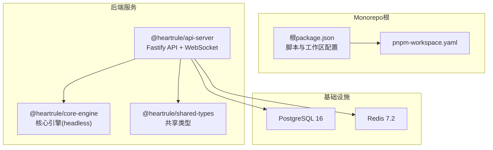
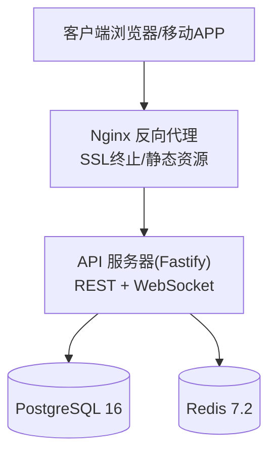
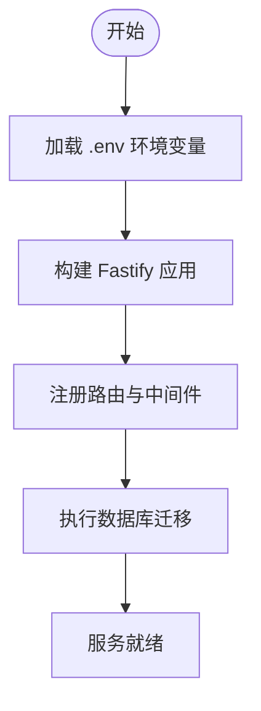
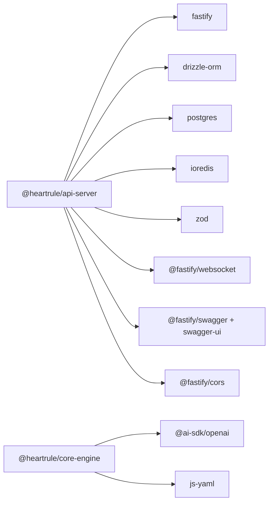

# 生产环境部署

<cite>
**本文引用的文件**
- [README.md](file://README.md)
- [package.json](file://package.json)
- [.env.example](file://.env.example)
- [packages/api-server/package.json](file://packages/api-server/package.json)
- [packages/core-engine/package.json](file://packages/core-engine/package.json)
- [packages/script-editor/package.json](file://packages/script-editor/package.json)
- [docker-compose.dev.yml](file://docker-compose.dev.yml)
- [packages/api-server/src/app.ts](file://packages/api-server/src/app.ts)
- [packages/api-server/src/index.ts](file://packages/api-server/src/index.ts)
- [packages/api-server/src/db/init-dev.ts](file://packages/api-server/src/db/init-dev.ts)
- [packages/api-server/drizzle.config.ts](file://packages/api-server/drizzle.config.ts)
- [pnpm-workspace.yaml](file://pnpm-workspace.yaml)
- [config/dev.yaml](file://config/dev.yaml)
- [scripts/sessions/cbt_depression_assessment.yaml](file://scripts/sessions/cbt_depression_assessment.yaml)
</cite>

## 目录
1. [简介](#简介)
2. [项目结构](#项目结构)
3. [核心组件](#核心组件)
4. [架构总览](#架构总览)
5. [详细组件分析](#详细组件分析)
6. [依赖分析](#依赖分析)
7. [性能考虑](#性能考虑)
8. [故障排查指南](#故障排查指南)
9. [结论](#结论)
10. [附录](#附录)

## 简介
本指南面向生产环境部署 HeartRule AI咨询引擎，涵盖系统要求、依赖安装、环境配置、数据库初始化、服务启动顺序、健康检查验证、环境变量配置（数据库、LLM API密钥、Redis）、Nginx反向代理与SSL证书、域名绑定，以及PM2进程管理、自动重启与日志轮转配置。部署对象为基于 TypeScript 的 Monorepo 架构，后端采用 Fastify + Drizzle ORM + PostgreSQL + Redis，AI集成通过 Vercel AI SDK 与火山引擎/OpenAI Provider。

## 项目结构
项目采用 pnpm workspace 的 Monorepo 结构，核心模块包括：
- packages/shared-types：共享类型与 Zod Schema
- packages/core-engine：六大核心引擎（headless）
- packages/api-server：Fastify REST API + WebSocket + Drizzle ORM
- packages/script-editor：脚本编辑器前端（可选）

图表来源
- [pnpm-workspace.yaml](file://pnpm-workspace.yaml#L1-L3)
- [packages/api-server/package.json](file://packages/api-server/package.json#L1-L44)
- [packages/core-engine/package.json](file://packages/core-engine/package.json#L1-L34)
- [packages/shared-types/package.json](file://packages/shared-types/package.json#L1-L200)

章节来源
- [README.md](file://README.md#L97-L129)
- [pnpm-workspace.yaml](file://pnpm-workspace.yaml#L1-L3)

## 核心组件
- API 服务器：基于 Fastify，提供 REST API 与 WebSocket，内置 Swagger 文档与健康检查端点。
- 核心引擎：headless 六大引擎（脚本执行、LLM编排、变量提取、记忆、话题调度、意识触发）。
- 数据持久化：PostgreSQL 16 + Drizzle ORM；开发环境提供内存模拟初始化脚本。
- 缓存与会话：Redis 7.2，用于会话状态与缓存。
- AI Provider：Vercel AI SDK + OpenAI Provider + 火山引擎 DeepSeek Provider。

章节来源
- [packages/api-server/src/app.ts](file://packages/api-server/src/app.ts#L18-L105)
- [packages/api-server/src/index.ts](file://packages/api-server/src/index.ts#L1-L10)
- [packages/api-server/src/db/init-dev.ts](file://packages/api-server/src/db/init-dev.ts#L1-L56)
- [README.md](file://README.md#L133-L164)

## 架构总览
生产环境推荐使用容器编排（如 Docker Compose），将 API 服务、PostgreSQL、Redis 三者解耦并独立扩展。API 服务暴露健康检查与文档端点，前端通过 Nginx 反向代理访问。

图表来源
- [packages/api-server/src/app.ts](file://packages/api-server/src/app.ts#L72-L89)
- [docker-compose.dev.yml](file://docker-compose.dev.yml#L3-L41)

## 详细组件分析

### 系统要求与依赖安装
- 运行时与包管理
  - Node.js：20+（LTS）
  - pnpm：9+
- 数据库与缓存
  - PostgreSQL：16
  - Redis：7.2
- 构建与运行
  - 使用 pnpm workspace 管理多包
  - 后端使用 Fastify + Drizzle ORM
  - 前端脚本编辑器可选

章节来源
- [README.md](file://README.md#L65-L71)
- [package.json](file://package.json#L8-L12)
- [packages/api-server/package.json](file://packages/api-server/package.json#L20-L35)

### 环境变量配置
生产环境必需的 .env 关键项（基于示例模板）：
- NODE_ENV：production
- DATABASE_URL：PostgreSQL 连接串
- REDIS_URL：Redis 连接串
- LLM_PROVIDER：volcano_deepseek 或 openai
- OPENAI_API_KEY：可选（当 LLM_PROVIDER=openai）
- VOLCANO_API_KEY/VOLCANO_ENDPOINT_ID/VOLCANO_BASE_URL：火山引擎配置
- API_PORT/API_HOST：服务监听端口与主机
- JWT_SECRET：生产环境必须修改为强密钥
- LOG_LEVEL：日志级别（生产建议 info 或更高）

章节来源
- [.env.example](file://.env.example#L1-L31)
- [packages/api-server/src/app.ts](file://packages/api-server/src/app.ts#L15-L26)

### 数据库初始化与迁移
- 开发环境：提供内存模拟初始化脚本，便于演示。
- 生产环境：使用 Drizzle ORM 执行迁移，确保数据库结构一致。
- 迁移命令（在根目录执行）：
  - pnpm --filter @heartrule/api-server db:migrate

图表来源
- [packages/api-server/src/app.ts](file://packages/api-server/src/app.ts#L91-L104)
- [packages/api-server/src/db/init-dev.ts](file://packages/api-server/src/db/init-dev.ts#L23-L52)
- [packages/api-server/drizzle.config.ts](file://packages/api-server/drizzle.config.ts#L1-L16)

章节来源
- [packages/api-server/src/db/init-dev.ts](file://packages/api-server/src/db/init-dev.ts#L1-L56)
- [packages/api-server/drizzle.config.ts](file://packages/api-server/drizzle.config.ts#L1-L16)

### 服务启动顺序与健康检查
- 启动顺序
  1) PostgreSQL 与 Redis 容器可用（健康检查通过）
  2) 执行数据库迁移
  3) 启动 API 服务器
- 健康检查端点
  - GET /health 返回状态、时间戳与运行时长
- 启动方式
  - 开发：pnpm dev（根目录）
  - 生产：容器内以生产模式启动（见附录）

章节来源
- [packages/api-server/src/app.ts](file://packages/api-server/src/app.ts#L82-L89)
- [package.json](file://package.json#L13-L32)

### Nginx 反向代理、SSL 与域名绑定
- 反向代理
  - 将 /api 前缀转发至 API 服务器
  - 将静态资源（如脚本编辑器）托管于同一域名下
- SSL 证书
  - 使用 Let’s Encrypt 或商业证书
  - 在 Nginx 中配置证书链与私钥
- 域名绑定
  - 将域名指向服务器公网 IP
  - 配置 A/AAAA 记录与 DNS 解析

章节来源
- [packages/api-server/src/app.ts](file://packages/api-server/src/app.ts#L72-L89)

### PM2 进程管理、自动重启与日志轮转
- 进程管理
  - 使用 PM2 启动 API 服务器（生产模式）
  - 设置自动重启策略（异常退出、CPU/内存阈值）
- 日志轮转
  - 配置 PM2 日志轮转参数（最大文件大小、保留份数）
  - 输出到统一日志目录，便于集中采集与分析

章节来源
- [packages/api-server/src/index.ts](file://packages/api-server/src/index.ts#L1-L10)
- [packages/api-server/src/app.ts](file://packages/api-server/src/app.ts#L110-L134)

## 依赖分析
后端服务的关键依赖与版本约束：
- Fastify：高性能 Web 框架
- Drizzle ORM：零运行时开销的 ORM
- PostgreSQL：持久化存储
- Redis：缓存与会话存储
- Vercel AI SDK + @ai-sdk/openai：统一 LLM 调用接口
- 火山引擎 Provider：自定义 Provider

图表来源
- [packages/api-server/package.json](file://packages/api-server/package.json#L20-L35)
- [packages/core-engine/package.json](file://packages/core-engine/package.json#L19-L26)

章节来源
- [packages/api-server/package.json](file://packages/api-server/package.json#L20-L35)
- [packages/core-engine/package.json](file://packages/core-engine/package.json#L19-L26)

## 性能考虑
- 连接池与超时
  - PostgreSQL 与 Redis 连接池参数需按并发量调整
- 缓存策略
  - 利用 Redis 缓存会话与热点数据，降低数据库压力
- 日志级别
  - 生产环境建议 info 或更高，避免过多 debug 日志
- 健康检查
  - 定期探测数据库与缓存连通性，及时发现异常

## 故障排查指南
- 健康检查失败
  - 检查 /health 是否返回正常状态
  - 核对数据库与 Redis 连接串与密码
- 数据库迁移失败
  - 确认 DATABASE_URL 正确且数据库可达
  - 执行迁移脚本并查看输出
- LLM 调用异常
  - 校验 OPENAI_API_KEY 或火山引擎密钥
  - 检查网络与代理设置
- CORS 与跨域
  - 生产环境需配置允许的源列表，避免 *
- 日志定位
  - 查看 PM2 日志轮转后的文件位置与内容

章节来源
- [packages/api-server/src/app.ts](file://packages/api-server/src/app.ts#L82-L89)
- [packages/api-server/src/db/init-dev.ts](file://packages/api-server/src/db/init-dev.ts#L23-L52)
- [.env.example](file://.env.example#L7-L28)

## 结论
通过本指南，可在生产环境中稳定部署 HeartRule AI咨询引擎。建议遵循“容器化 + 反向代理 + 进程管理”的架构，严格配置环境变量与安全密钥，并建立完善的健康检查与日志轮转机制，确保系统高可用与可运维性。

## 附录

### A. 生产部署步骤清单
- 准备服务器与系统
  - 安装 Node.js 20+ 与 pnpm 9+
  - 安装 PostgreSQL 16 与 Redis 7.2
- 配置环境变量
  - 复制 .env.example 为 .env，填写数据库、Redis、LLM、JWT、端口等
- 构建与迁移
  - pnpm install
  - pnpm --filter @heartrule/api-server build
  - pnpm --filter @heartrule/api-server db:migrate
- 启动服务
  - 使用 PM2 启动 API 服务器
  - 配置 Nginx 反向代理与 SSL
- 验证
  - 访问 /health 与 /docs 确认服务可用

章节来源
- [README.md](file://README.md#L65-L94)
- [package.json](file://package.json#L13-L32)
- [packages/api-server/package.json](file://packages/api-server/package.json#L8-L18)

### B. 环境变量对照表（生产必备）
- 数据库
  - DATABASE_URL：PostgreSQL 连接串
- 缓存
  - REDIS_URL：Redis 连接串
- LLM Provider
  - LLM_PROVIDER：openai 或 volcano_deepseek
  - OPENAI_API_KEY：当 Provider 为 openai
  - VOLCANO_API_KEY/VOLCANO_ENDPOINT_ID/VOLCANO_BASE_URL：火山引擎配置
- 服务
  - API_PORT/API_HOST：监听端口与主机
  - JWT_SECRET：强随机密钥
  - LOG_LEVEL：日志级别

章节来源
- [.env.example](file://.env.example#L7-L28)

### C. API 端点概览（生产验证）
- GET /health：健康检查
- GET /docs：Swagger 文档
- 会话管理：/api/sessions
- 聊天交互：/api/chat, /api/chat/stream
- 脚本管理：/api/scripts

章节来源
- [packages/api-server/src/app.ts](file://packages/api-server/src/app.ts#L72-L89)
- [README.md](file://README.md#L267-L291)