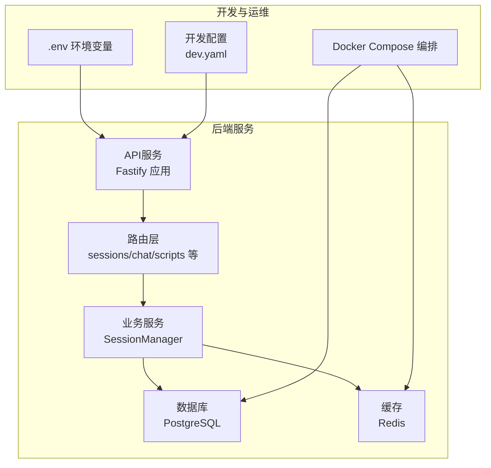
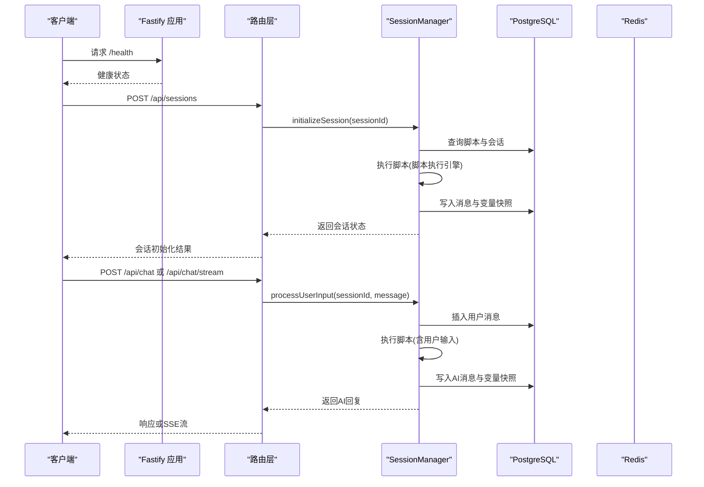
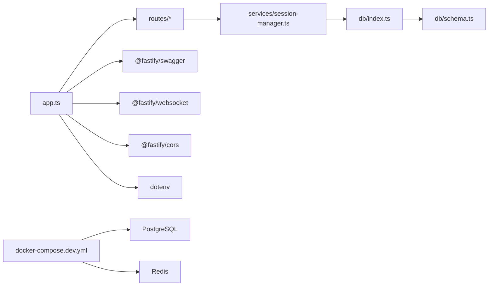

# 监控与运维

<cite>
**本文引用的文件**
- [packages/api-server/src/app.ts](file://packages/api-server/src/app.ts)
- [packages/api-server/src/utils/error-handler.ts](file://packages/api-server/src/utils/error-handler.ts)
- [packages/api-server/src/db/index.ts](file://packages/api-server/src/db/index.ts)
- [packages/api-server/src/db/schema.ts](file://packages/api-server/src/db/schema.ts)
- [packages/api-server/src/routes/sessions.ts](file://packages/api-server/src/routes/sessions.ts)
- [packages/api-server/src/routes/chat.ts](file://packages/api-server/src/routes/chat.ts)
- [packages/api-server/src/services/session-manager.ts](file://packages/api-server/src/services/session-manager.ts)
- [config/dev.yaml](file://config/dev.yaml)
- [.env](file://.env)
- [docker-compose.dev.yml](file://docker-compose.dev.yml)
- [packages/api-server/package.json](file://packages/api-server/package.json)
- [package.json](file://package.json)
</cite>

## 目录
1. [简介](#简介)
2. [项目结构](#项目结构)
3. [核心组件](#核心组件)
4. [架构总览](#架构总览)
5. [详细组件分析](#详细组件分析)
6. [依赖关系分析](#依赖关系分析)
7. [性能监控与指标采集](#性能监控与指标采集)
8. [日志管理策略](#日志管理策略)
9. [告警机制配置](#告警机制配置)
10. [性能监控工具使用指南](#性能监控工具使用指南)
11. [系统维护与备份策略](#系统维护与备份策略)
12. [容量规划方法](#容量规划方法)
13. [故障排查指南](#故障排查指南)
14. [结论](#结论)

## 简介
本文件面向HeartRule AI咨询引擎的监控与运维团队，提供系统监控指标采集方法、日志管理策略、告警机制配置、性能监控工具使用、系统维护与备份策略以及容量规划方法。文档以仓库现有实现为基础，结合可扩展的最佳实践，帮助保障系统稳定性与可维护性。

## 项目结构
系统采用Monorepo结构，后端API服务位于packages/api-server，数据库通过PostgreSQL与Redis提供持久化与缓存能力，开发环境通过Docker Compose编排数据库与可视化工具。

图表来源
- [packages/api-server/src/app.ts](file://packages/api-server/src/app.ts#L21-L105)
- [docker-compose.dev.yml](file://docker-compose.dev.yml#L3-L64)
- [.env](file://.env#L1-L39)
- [config/dev.yaml](file://config/dev.yaml#L1-L63)

章节来源
- [packages/api-server/src/app.ts](file://packages/api-server/src/app.ts#L1-L135)
- [docker-compose.dev.yml](file://docker-compose.dev.yml#L1-L64)
- [.env](file://.env#L1-L39)
- [config/dev.yaml](file://config/dev.yaml#L1-L63)

## 核心组件
- 应用入口与健康检查：提供根路径、健康检查接口与优雅关闭信号处理。
- 统一日志与错误处理：集中化的错误映射、上下文增强与错误响应。
- 数据库连接与Schema：PostgreSQL连接、Drizzle ORM初始化与表结构定义。
- 会话与聊天路由：会话生命周期管理、消息历史查询与流式聊天占位实现。
- 会话管理器：脚本执行引擎集成、变量快照、状态持久化与错误包装。

章节来源
- [packages/api-server/src/app.ts](file://packages/api-server/src/app.ts#L72-L135)
- [packages/api-server/src/utils/error-handler.ts](file://packages/api-server/src/utils/error-handler.ts#L1-L233)
- [packages/api-server/src/db/index.ts](file://packages/api-server/src/db/index.ts#L1-L26)
- [packages/api-server/src/db/schema.ts](file://packages/api-server/src/db/schema.ts#L1-L219)
- [packages/api-server/src/routes/sessions.ts](file://packages/api-server/src/routes/sessions.ts#L1-L548)
- [packages/api-server/src/routes/chat.ts](file://packages/api-server/src/routes/chat.ts#L1-L152)
- [packages/api-server/src/services/session-manager.ts](file://packages/api-server/src/services/session-manager.ts#L1-L466)

## 架构总览
后端API服务基于Fastify，注册CORS、Swagger、WebSocket等插件；路由层负责会话与聊天交互；业务逻辑由SessionManager封装，调用脚本执行引擎并持久化状态；数据库采用PostgreSQL，缓存采用Redis；开发环境通过Docker Compose一键拉起。

图表来源
- [packages/api-server/src/app.ts](file://packages/api-server/src/app.ts#L72-L105)
- [packages/api-server/src/routes/sessions.ts](file://packages/api-server/src/routes/sessions.ts#L14-L133)
- [packages/api-server/src/routes/chat.ts](file://packages/api-server/src/routes/chat.ts#L16-L152)
- [packages/api-server/src/services/session-manager.ts](file://packages/api-server/src/services/session-manager.ts#L73-L255)

## 详细组件分析

### 应用与健康检查
- 根路径返回系统基本信息与文档地址。
- 健康检查接口返回运行状态、时间戳与进程运行时长。
- 优雅关闭：监听SIGINT/SIGTERM，关闭HTTP服务并退出进程。

章节来源
- [packages/api-server/src/app.ts](file://packages/api-server/src/app.ts#L72-L135)

### 统一日志与错误处理
- 错误映射：根据错误消息关键字匹配错误类型、HTTP状态码与模板消息。
- 上下文增强：在错误响应中注入脚本、会话、位置与时间戳等上下文信息。
- 恢复建议：针对不同错误类型提供是否可重试、重试动作与建议。
- 日志记录：统一记录错误对象与上下文，便于审计与排查。

章节来源
- [packages/api-server/src/utils/error-handler.ts](file://packages/api-server/src/utils/error-handler.ts#L12-L181)
- [packages/api-server/src/utils/error-handler.ts](file://packages/api-server/src/utils/error-handler.ts#L215-L233)

### 数据库连接与Schema
- 连接：通过DATABASE_URL建立PostgreSQL连接，导出db实例与关闭函数。
- Schema：定义会话、消息、脚本、工程、变量、记忆等表及索引，支持JSONB字段与枚举类型。

章节来源
- [packages/api-server/src/db/index.ts](file://packages/api-server/src/db/index.ts#L10-L26)
- [packages/api-server/src/db/schema.ts](file://packages/api-server/src/db/schema.ts#L22-L176)

### 会话与聊天路由
- 会话创建：校验脚本存在性，初始化会话并返回首条AI消息与执行状态。
- 会话详情：返回会话元数据与脚本解析内容，并增强位置信息（带ID）。
- 消息历史：按时间排序返回消息列表，转换角色为前端友好格式。
- 用户输入：处理用户消息，调用SessionManager执行脚本并返回AI回复与位置信息。
- 聊天接口：非流式与SSE流式占位实现，便于后续接入真实LLM流式输出。

章节来源
- [packages/api-server/src/routes/sessions.ts](file://packages/api-server/src/routes/sessions.ts#L14-L548)
- [packages/api-server/src/routes/chat.ts](file://packages/api-server/src/routes/chat.ts#L16-L152)

### 会话管理器
- 初始化会话：加载脚本与会话状态，执行脚本生成首条AI消息，批量写入消息与变量快照，更新会话位置与元数据。
- 处理用户输入：保存用户消息，恢复执行状态，执行脚本，批量写入AI消息与变量快照，更新会话状态。
- 错误包装：捕获异常并构建详细错误响应，不抛出异常，保证接口稳定。

章节来源
- [packages/api-server/src/services/session-manager.ts](file://packages/api-server/src/services/session-manager.ts#L73-L255)
- [packages/api-server/src/services/session-manager.ts](file://packages/api-server/src/services/session-manager.ts#L257-L466)

## 依赖关系分析
- 应用依赖Fastify生态与Drizzle ORM，使用dotenv加载环境变量。
- 路由层依赖数据库与会话管理器，会话管理器依赖脚本执行引擎与数据库。
- Docker Compose提供PostgreSQL与Redis容器，Adminer用于数据库可视化。

图表来源
- [packages/api-server/src/app.ts](file://packages/api-server/src/app.ts#L4-L10)
- [packages/api-server/src/db/index.ts](file://packages/api-server/src/db/index.ts#L1-L26)
- [packages/api-server/src/db/schema.ts](file://packages/api-server/src/db/schema.ts#L1-L219)
- [docker-compose.dev.yml](file://docker-compose.dev.yml#L3-L64)

章节来源
- [packages/api-server/src/app.ts](file://packages/api-server/src/app.ts#L1-L135)
- [packages/api-server/src/db/index.ts](file://packages/api-server/src/db/index.ts#L1-L26)
- [packages/api-server/src/db/schema.ts](file://packages/api-server/src/db/schema.ts#L1-L219)
- [docker-compose.dev.yml](file://docker-compose.dev.yml#L1-L64)

## 性能监控与指标采集
以下为建议的监控指标采集方案，结合现有实现与可扩展点：

- CPU使用率
  - 宿主机/容器层面：通过操作系统监控工具（如Prometheus Node Exporter）采集。
  - 应用层面：可在应用启动时记录进程PID，结合系统指标进行关联分析。
  - 关联点：应用启动与优雅关闭信号处理，便于评估重启对资源的影响。

- 内存占用
  - 使用Node.js内置指标或第三方库（如heapdump）在开发环境进行采样。
  - 结合Docker容器内存限制与cgroup统计，定位内存泄漏风险。

- 数据库连接数
  - 通过PostgreSQL内置视图与连接池状态统计当前活跃连接数。
  - 在数据库连接初始化处埋点，记录连接创建与释放事件，便于追踪连接泄漏。

- API响应时间
  - 在路由层对关键端点（如会话创建、消息处理）增加请求-响应计时。
  - 将响应时间、状态码、路径、用户ID等维度纳入指标，便于分组分析。

- LLM调用延迟与成功率
  - 在会话管理器中对脚本执行引擎调用前后打点，记录LLM调用耗时与错误。
  - 对外部服务调用失败进行计数与重试统计，辅助SLA评估。

- 缓存命中率
  - 通过Redis命令统计命中与未命中次数，计算命中率并设定阈值告警。

- 会话并发与队列长度
  - 通过会话创建与处理速率统计，评估系统承载能力与瓶颈。

章节来源
- [packages/api-server/src/app.ts](file://packages/api-server/src/app.ts#L110-L135)
- [packages/api-server/src/db/index.ts](file://packages/api-server/src/db/index.ts#L16-L25)
- [packages/api-server/src/services/session-manager.ts](file://packages/api-server/src/services/session-manager.ts#L148-L154)

## 日志管理策略
- 日志分级
  - DEBUG：开发调试与详细执行链路日志（如会话初始化与用户输入处理）。
  - INFO：常规业务操作与状态变更（如会话创建、消息写入）。
  - WARN：潜在问题（如会话不存在、脚本解析警告）。
  - ERROR：错误与异常（统一错误映射与上下文记录）。

- 日志分类与存储
  - 访问日志：HTTP请求路径、方法、状态码、响应时间、客户端IP等，建议落盘并按日期切分。
  - 错误日志：包含错误堆栈、上下文信息与恢复建议，便于快速定位。
  - 业务日志：会话状态变更、变量快照、消息写入等，支持审计与回溯。

- 日志保留与轮转
  - 按天/月切分文件，保留周期根据合规要求设定（如90天）。
  - 压缩归档与冷热分层存储，降低长期成本。

- 日志检索与聚合
  - 使用集中式日志平台（如ELK/EFK）进行检索与仪表板展示。
  - 关键字段建立索引，支持按会话ID、脚本ID、错误类型等维度过滤。

章节来源
- [packages/api-server/src/app.ts](file://packages/api-server/src/app.ts#L22-L26)
- [packages/api-server/src/utils/error-handler.ts](file://packages/api-server/src/utils/error-handler.ts#L215-L233)
- [packages/api-server/src/routes/sessions.ts](file://packages/api-server/src/routes/sessions.ts#L97-L131)
- [packages/api-server/src/routes/chat.ts](file://packages/api-server/src/routes/chat.ts#L123-L143)

## 告警机制配置
- 阈值设置
  - 健康检查失败：连续多次失败触发告警。
  - API错误率：对4xx/5xx错误率设定阈值，区分脚本错误与系统错误。
  - 响应时间：P95/P99超时阈值，区分不同端点。
  - 数据库连接：连接池耗尽或长时间空闲连接过多。
  - LLM可用性：服务不可用或超时比例过高。
  - 缓存命中率：低于阈值触发告警。

- 通知渠道
  - 邮件、短信、企业微信/钉钉机器人、Slack等。
  - 不同严重级别对应不同通知策略（静默时段、升级策略）。

- 故障处理流程
  - 自动化降级：当LLM服务不可用时，切换到本地Mock或降级提示。
  - 快速回滚：版本发布失败时自动回滚至上一稳定版本。
  - 限流与熔断：对下游依赖实施限流与熔断，避免雪崩效应。
  - 事后复盘：生成故障报告，沉淀改进措施。

章节来源
- [packages/api-server/src/utils/error-handler.ts](file://packages/api-server/src/utils/error-handler.ts#L143-L181)
- [packages/api-server/src/routes/sessions.ts](file://packages/api-server/src/routes/sessions.ts#L70-L77)

## 性能监控工具使用指南
- Prometheus
  - 部署Node Exporter与自定义指标抓取器，暴露CPU、内存、网络、磁盘与应用自定义指标。
  - 配置服务发现与标签管理，确保多实例指标可区分。

- Grafana
  - 建立仪表板：系统资源、API性能、数据库与缓存、错误趋势、会话并发等。
  - 设置面板联动与注释标记，便于事件关联分析。

- APM工具（如OpenTelemetry）
  - 在Fastify路由层与会话管理器中埋点，采集Span与Trace。
  - 关联日志与指标，实现端到端性能分析。

章节来源
- [packages/api-server/src/app.ts](file://packages/api-server/src/app.ts#L21-L105)
- [packages/api-server/src/services/session-manager.ts](file://packages/api-server/src/services/session-manager.ts#L148-L154)

## 系统维护与备份策略
- 数据库备份
  - 定时全量备份与增量备份结合，验证恢复流程。
  - 备份保留周期遵循合规要求，异地容灾。

- 配置与密钥管理
  - 环境变量集中管理，敏感信息加密存储，定期轮换。
  - 配置变更走发布流程，灰度验证后再全量上线。

- 缓存清理
  - 清理过期会话与无用键，控制缓存膨胀。
  - 监控缓存淘汰率，优化键空间设计。

- 版本升级
  - 采用蓝绿/金丝雀发布，逐步切换流量。
  - 升级前做兼容性测试与压测，升级后观察关键指标。

章节来源
- [docker-compose.dev.yml](file://docker-compose.dev.yml#L17-L21)
- [docker-compose.dev.yml](file://docker-compose.dev.yml#L34-L38)
- [.env](file://.env#L6-L22)

## 容量规划方法
- 会话并发容量
  - 基于峰值QPS与平均响应时间估算所需实例数量。
  - 通过压力测试确定CPU/内存/数据库连接的瓶颈点。

- 存储容量
  - 估算消息与变量快照增长速率，预留扩容空间。
  - 分层存储策略：近期热数据与历史冷数据分离。

- 缓存容量
  - 依据会话生命周期与热点数据比例，估算Redis容量需求。
  - 监控命中率与内存使用，动态调整缓存策略。

- LLM调用成本
  - 估算Token消耗与调用次数，制定预算与配额策略。
  - 优化提示词与上下文长度，降低单位成本。

章节来源
- [config/dev.yaml](file://config/dev.yaml#L45-L48)
- [packages/api-server/src/db/schema.ts](file://packages/api-server/src/db/schema.ts#L22-L40)
- [packages/api-server/src/services/session-manager.ts](file://packages/api-server/src/services/session-manager.ts#L164-L217)

## 故障排查指南
- 健康检查失败
  - 检查进程状态与端口占用，确认优雅关闭流程是否正常。
  - 查看最近日志与错误映射，定位具体错误类型。

- 会话创建失败
  - 校验脚本是否存在与解析是否成功。
  - 检查数据库连接与权限，确认会话表与脚本表状态。

- 消息处理异常
  - 查看用户输入处理日志，确认会话是否存在与位置信息是否正确。
  - 检查变量快照与消息写入是否成功。

- LLM服务不可用
  - 检查API密钥与网络连通性，查看错误映射中的恢复建议。
  - 临时降级或重试策略，避免影响整体服务。

- 数据库连接问题
  - 查看连接池状态与慢查询日志，优化SQL与索引。
  - 控制事务时长，避免锁等待与连接泄漏。

章节来源
- [packages/api-server/src/app.ts](file://packages/api-server/src/app.ts#L82-L89)
- [packages/api-server/src/routes/sessions.ts](file://packages/api-server/src/routes/sessions.ts#L64-L74)
- [packages/api-server/src/routes/chat.ts](file://packages/api-server/src/routes/chat.ts#L104-L114)
- [packages/api-server/src/utils/error-handler.ts](file://packages/api-server/src/utils/error-handler.ts#L143-L181)
- [packages/api-server/src/db/index.ts](file://packages/api-server/src/db/index.ts#L16-L25)

## 结论
通过在现有Fastify应用基础上完善指标采集、日志分级与集中化管理、建立完善的告警与故障处理流程，并配合Prometheus/Grafana/APM工具与容量规划方法，HeartRule AI咨询引擎可以在保障用户体验的同时，持续提升系统的可观测性与可维护性。建议尽快落地以下关键步骤：接入应用指标、完善错误映射与上下文、建立日志平台与告警规则、制定备份与发布流程。