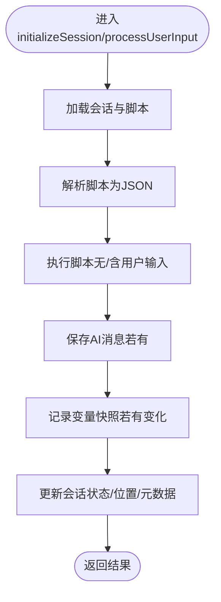

# 部署与运维

<cite>
**本文引用的文件**
- [README.md](file://README.md)
- [QUICK_START_GUIDE.md](file://QUICK_START_GUIDE.md)
- [docker-compose.dev.yml](file://docker-compose.dev.yml)
- [.env.example](file://.env.example)
- [package.json](file://package.json)
- [packages/api-server/package.json](file://packages/api-server/package.json)
- [packages/api-server/src/app.ts](file://packages/api-server/src/app.ts)
- [packages/api-server/src/index.ts](file://packages/api-server/src/index.ts)
- [packages/api-server/src/route/sessions.ts](file://packages/api-server/src/routes/sessions.ts)
- [packages/api-server/src/routes/chat.ts](file://packages/api-server/src/routes/chat.ts)
- [packages/api-server/src/services/session-manager.ts](file://packages/api-server/src/services/session-manager.ts)
- [config/dev.yaml](file://config/dev.yaml)
- [packages/core-engine/src/index.ts](file://packages/core-engine/src/index.ts)
- [packages/shared-types/src/index.ts](file://packages/shared-types/src/index.ts)
</cite>

## 目录
1. [简介](#简介)
2. [项目结构](#项目结构)
3. [核心组件](#核心组件)
4. [架构总览](#架构总览)
5. [详细组件分析](#详细组件分析)
6. [依赖关系分析](#依赖关系分析)
7. [性能考虑](#性能考虑)
8. [故障排除指南](#故障排除指南)
9. [结论](#结论)
10. [附录](#附录)

## 简介
本文件面向生产环境与运维团队，提供HeartRule AI咨询引擎的容器化部署与运维指南。内容涵盖Docker编排、网络与数据卷管理、生产环境准备与服务启动、健康检查、负载均衡与反向代理、SSL证书配置、监控与日志、告警、故障排除、性能调优、容量规划、备份恢复、版本升级与灾难恢复等。

## 项目结构
项目采用monorepo结构，核心后端为Fastify API服务，配合PostgreSQL与Redis，核心引擎与共享类型以独立包形式提供。开发与生产均通过Docker Compose编排。

图表来源
- [docker-compose.dev.yml](file://docker-compose.dev.yml#L1-L64)
- [packages/api-server/src/app.ts](file://packages/api-server/src/app.ts#L1-L135)
- [packages/api-server/src/index.ts](file://packages/api-server/src/index.ts#L1-L10)
- [packages/api-server/src/routes/sessions.ts](file://packages/api-server/src/routes/sessions.ts#L1-L548)
- [packages/api-server/src/routes/chat.ts](file://packages/api-server/src/routes/chat.ts#L1-L152)
- [packages/api-server/src/services/session-manager.ts](file://packages/api-server/src/services/session-manager.ts#L1-L462)
- [packages/core-engine/src/index.ts](file://packages/core-engine/src/index.ts#L1-L27)
- [packages/shared-types/src/index.ts](file://packages/shared-types/src/index.ts#L1-L19)

章节来源
- [README.md](file://README.md#L97-L129)
- [docker-compose.dev.yml](file://docker-compose.dev.yml#L1-L64)
- [package.json](file://package.json#L1-L60)

## 核心组件
- API服务（Fastify）：提供REST与WebSocket接口，内置Swagger文档与健康检查端点。
- 会话管理器：封装脚本执行、变量与消息持久化、位置状态更新。
- 数据库（PostgreSQL）：Drizzle ORM驱动，迁移脚本与Schema定义。
- 缓存（Redis）：会话与认证相关缓存。
- 核心引擎与共享类型：脚本执行、动作注册、领域模型与API类型定义。

章节来源
- [packages/api-server/src/app.ts](file://packages/api-server/src/app.ts#L18-L105)
- [packages/api-server/src/services/session-manager.ts](file://packages/api-server/src/services/session-manager.ts#L1-L462)
- [packages/api-server/src/routes/sessions.ts](file://packages/api-server/src/routes/sessions.ts#L1-L548)
- [packages/api-server/src/routes/chat.ts](file://packages/api-server/src/routes/chat.ts#L1-L152)
- [packages/core-engine/src/index.ts](file://packages/core-engine/src/index.ts#L1-L27)
- [packages/shared-types/src/index.ts](file://packages/shared-types/src/index.ts#L1-L19)

## 架构总览
下图展示生产环境典型拓扑：反向代理（Nginx/HAProxy）前置，多实例API服务后端，共享PostgreSQL与Redis。

## 详细组件分析

### Docker容器化与编排
- 开发编排：使用Compose定义PostgreSQL、Redis与Adminer；定义本地卷与网络。
- 环境变量：通过.env加载，包含数据库、Redis、LLM提供商、API端口与JWT密钥等。
- 健康检查：PostgreSQL与Redis均配置健康检查探针，便于编排器自动重启与服务发现。

图表来源
- [docker-compose.dev.yml](file://docker-compose.dev.yml#L17-L21)
- [docker-compose.dev.yml](file://docker-compose.dev.yml#L34-L38)

章节来源
- [docker-compose.dev.yml](file://docker-compose.dev.yml#L1-L64)
- [.env.example](file://.env.example#L1-L31)
- [package.json](file://package.json#L28-L29)

### API服务启动与健康检查
- 启动入口：index.ts调用app.ts中的startServer，监听环境变量配置的主机与端口。
- 健康检查：/health返回运行状态与运行时信息。
- Swagger文档：/docs提供OpenAPI文档界面。

图表来源
- [packages/api-server/src/app.ts](file://packages/api-server/src/app.ts#L82-L89)
- [packages/api-server/src/app.ts](file://packages/api-server/src/app.ts#L110-L134)

章节来源
- [packages/api-server/src/index.ts](file://packages/api-server/src/index.ts#L1-L10)
- [packages/api-server/src/app.ts](file://packages/api-server/src/app.ts#L18-L105)
- [QUICK_START_GUIDE.md](file://QUICK_START_GUIDE.md#L84-L98)

### 会话管理与脚本执行
- 初始化会话：根据脚本内容执行一次，生成初始AI消息并持久化。
- 处理用户输入：保存用户消息，恢复执行状态，执行脚本，持久化AI消息与变量快照，更新会话位置与状态。
- 错误处理：捕获异常并返回结构化错误信息，避免服务崩溃。

图表来源
- [packages/api-server/src/services/session-manager.ts](file://packages/api-server/src/services/session-manager.ts#L72-L253)
- [packages/api-server/src/services/session-manager.ts](file://packages/api-server/src/services/session-manager.ts#L258-L461)

章节来源
- [packages/api-server/src/services/session-manager.ts](file://packages/api-server/src/services/session-manager.ts#L1-L462)
- [packages/api-server/src/routes/sessions.ts](file://packages/api-server/src/routes/sessions.ts#L1-L548)

### 路由与端点
- 会话管理：创建会话、获取会话详情、消息历史、变量、列出用户会话。
- 聊天交互：非流式与SSE流式聊天端点。
- 版本与项目：版本与项目相关端点在API前缀下注册。

章节来源
- [packages/api-server/src/routes/sessions.ts](file://packages/api-server/src/routes/sessions.ts#L1-L548)
- [packages/api-server/src/routes/chat.ts](file://packages/api-server/src/routes/chat.ts#L1-L152)

### 配置与环境
- 环境变量模板：包含Node环境、数据库URL、Redis URL、LLM提供商、API端口、JWT密钥与日志级别等。
- 开发配置：dev.yaml包含应用、服务器、LLM、脚本、记忆、会话、WebSocket与CORS等配置项。

章节来源
- [.env.example](file://.env.example#L1-L31)
- [config/dev.yaml](file://config/dev.yaml#L1-L63)

## 依赖关系分析
- API服务依赖核心引擎与共享类型，使用Drizzle ORM访问PostgreSQL，使用ioredis访问Redis。
- 会话管理器负责与数据库交互，并协调脚本执行引擎。
- 路由层对请求进行Schema校验与响应包装。

图表来源
- [packages/api-server/package.json](file://packages/api-server/package.json#L20-L35)
- [packages/api-server/src/routes/sessions.ts](file://packages/api-server/src/routes/sessions.ts#L1-L13)
- [packages/api-server/src/routes/chat.ts](file://packages/api-server/src/routes/chat.ts#L1-L10)
- [packages/api-server/src/services/session-manager.ts](file://packages/api-server/src/services/session-manager.ts#L7-L16)

章节来源
- [packages/api-server/package.json](file://packages/api-server/package.json#L1-L44)
- [packages/core-engine/src/index.ts](file://packages/core-engine/src/index.ts#L1-L27)
- [packages/shared-types/src/index.ts](file://packages/shared-types/src/index.ts#L1-L19)

## 性能考虑
- 连接池与超时：合理配置数据库与Redis连接池参数，避免高并发下的连接争用。
- SSE流式：当前流式端点为占位实现，建议接入真实LLM流式输出，降低首字节延迟。
- 缓存策略：利用Redis缓存热点会话与脚本解析结果，减少重复计算。
- 日志级别：生产环境建议调整日志级别，避免过多I/O开销。
- 健康检查：缩短探测间隔与超时，提升故障感知速度。

## 故障排除指南
- 端口冲突：若8000端口被占用，查找并终止占用进程后重试。
- Docker未启动：确认Docker Desktop运行后再执行编排命令。
- CORS错误：确保前端地址与CORS白名单一致。
- 数据库连接失败：检查PostgreSQL容器状态与日志，必要时重启数据库服务。

章节来源
- [QUICK_START_GUIDE.md](file://QUICK_START_GUIDE.md#L225-L283)

## 结论
本文提供了从容器编排到生产部署、从健康检查到故障排除的完整运维指南。建议在生产环境中引入反向代理、负载均衡、SSL证书、集中化日志与监控告警体系，并制定完善的备份恢复与版本升级流程，确保系统的高可用与可维护性。

## 附录

### 生产环境部署清单
- 准备工作
  - 安装Docker与Docker Compose
  - 准备SSL证书与域名解析
  - 配置反向代理（Nginx/HAProxy），开启HTTP/2与TLS
  - 准备生产环境变量文件（复制.env.example并填入生产值）
- 依赖安装
  - PostgreSQL集群/主从与备份策略
  - Redis集群/哨兵与持久化
  - DNS与防火墙开放必要端口
- 服务启动
  - 构建镜像并启动编排
  - 运行数据库迁移
  - 启动多个API实例并加入负载均衡
- 健康检查
  - /health端点与数据库/Redis探活
  - 定义探针超时与重试策略

章节来源
- [README.md](file://README.md#L193-L216)
- [docker-compose.dev.yml](file://docker-compose.dev.yml#L1-L64)
- [packages/api-server/src/app.ts](file://packages/api-server/src/app.ts#L82-L89)

### 负载均衡与反向代理
- 反向代理建议：Nginx或HAProxy，启用HTTP/2与TLS，配置上游为多个API实例。
- 会话粘性：WebSocket长连接可采用IP哈希或一致性哈希策略，避免跨节点会话丢失。
- SSL证书：使用Let’s Encrypt或企业CA签发，定期续期。

### 监控与日志
- 指标采集：Prometheus抓取API与基础设施指标，结合Grafana可视化。
- 日志管理：集中化日志（如ELK/EFK），按服务与级别分类存储。
- 告警机制：基于阈值与异常模式设置告警，联动通知渠道。

### 备份与恢复
- 数据库备份：定时逻辑备份与增量备份，验证恢复流程。
- Redis备份：开启AOF/RDB持久化，定期快照与异地容灾。
- 配置与脚本：版本化管理，变更审批与回滚策略。

### 版本升级与灾难恢复
- 升级策略：蓝绿/金丝雀发布，逐步切换流量，回滚机制。
- 灾难恢复：RTO/RPO目标明确，演练恢复流程，定期验证。