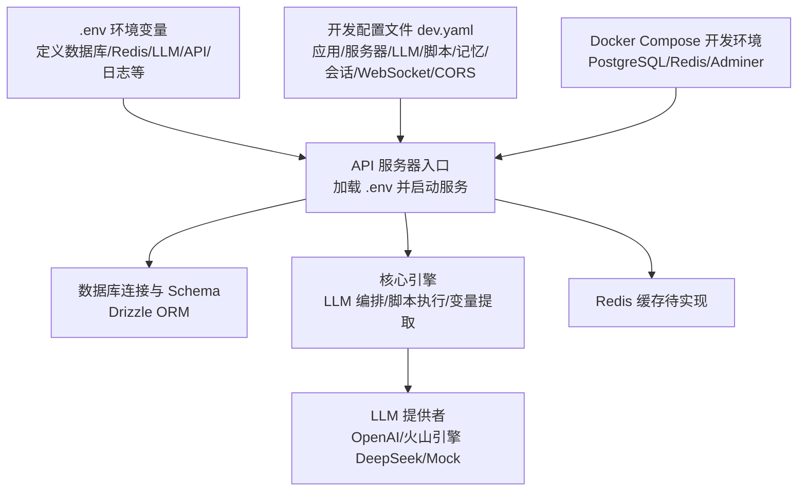
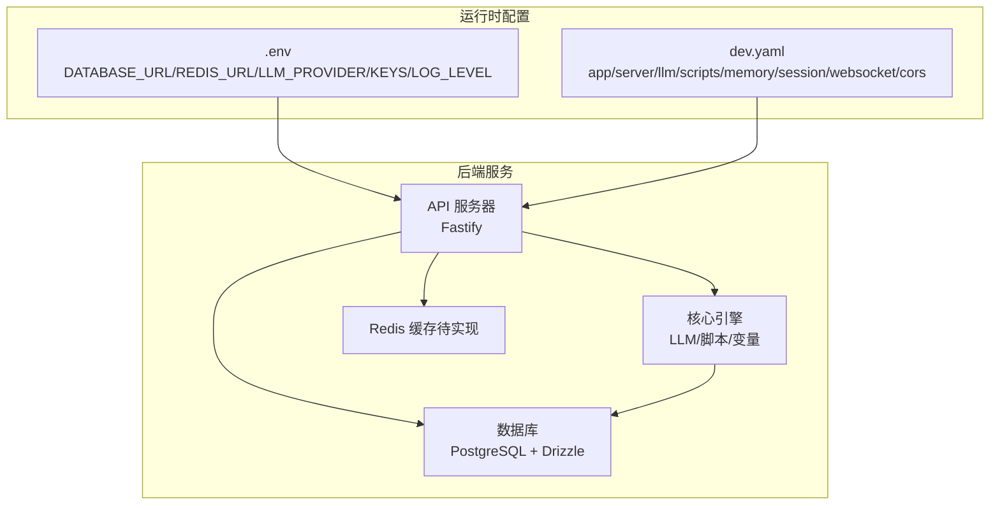
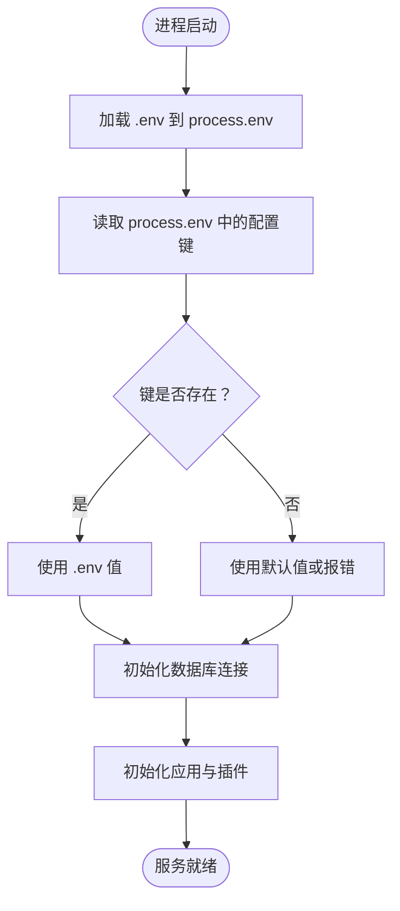
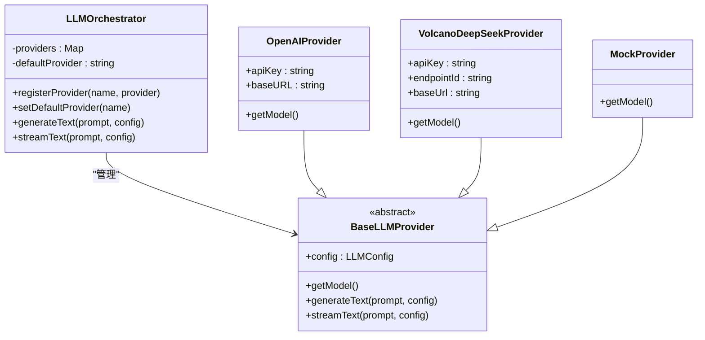
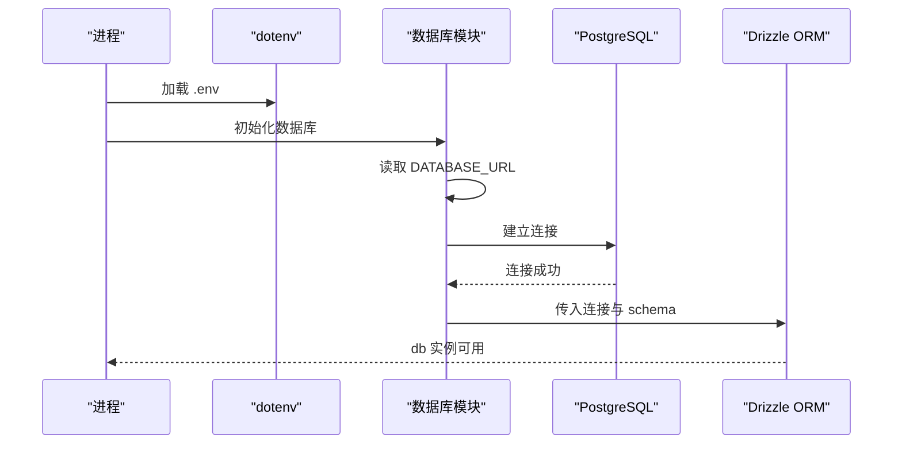
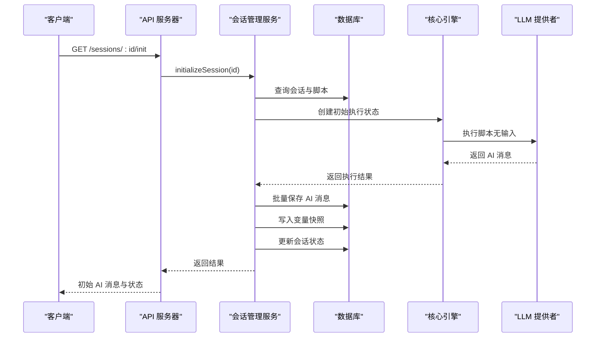
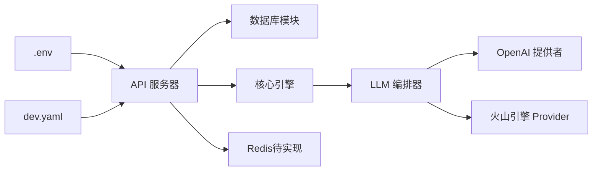

# 配置管理

<cite>
**本文引用的文件**
- [.env 示例文件](file://.env.example)
- [.env 环境变量文件](file://.env)
- [开发环境配置文件](file://config/dev.yaml)
- [Docker Compose 开发环境](file://docker-compose.dev.yml)
- [API 服务器入口](file://packages/api-server/src/app.ts)
- [数据库连接与初始化](file://packages/api-server/src/db/index.ts)
- [数据库 Schema 定义](file://packages/api-server/src/db/schema.ts)
- [Drizzle 配置](file://packages/api-server/drizzle.config.ts)
- [会话管理服务](file://packages/api-server/src/services/session-manager.ts)
- [LLM 编排器接口](file://packages/core-engine/src/engines/llm-orchestration/orchestrator.ts)
- [OpenAI 提供者](file://packages/core-engine/src/engines/llm-orchestration/openai-provider.ts)
- [火山引擎 Provider](file://packages/core-engine/src/engines/llm-orchestration/providers.ts)
- [火山引擎 DeepSeek Provider](file://packages/core-engine/src/engines/llm-orchestration/volcano-provider.ts)
- [变量提取器](file://packages/core-engine/src/engines/variable-extraction/extractor.ts)
- [共享类型与校验](file://packages/shared-types/src/domain/variable.ts)
- [错误处理工具](file://packages/api-server/src/utils/error-handler.ts)
- [脚本执行 YAML 解析与校验](file://packages/core-engine/src/engines/script-execution/yaml-parser.ts)
</cite>

## 目录
1. [简介](#简介)
2. [项目结构](#项目结构)
3. [核心组件](#核心组件)
4. [架构总览](#架构总览)
5. [详细组件分析](#详细组件分析)
6. [依赖关系分析](#依赖关系分析)
7. [性能考量](#性能考量)
8. [故障排查指南](#故障排查指南)
9. [结论](#结论)
10. [附录](#附录)

## 简介
本文件面向 HeartRule AI 咨询引擎的配置管理，系统性梳理开发环境配置的结构与用途，覆盖 LLM 提供者配置、数据库连接、Redis 缓存设置、环境变量定义与加载顺序、不同环境（开发/测试/生产）的差异与切换方法、配置验证与默认值、错误处理策略、安全与敏感信息保护、以及配置热更新与优化建议。文档同时提供可视化图示与分层讲解，帮助开发者与运维人员快速理解并正确配置系统。

## 项目结构
本项目的配置相关要素主要分布在以下位置：
- 环境变量：根目录下的 .env 与 .env.example，用于声明运行时参数（数据库、Redis、LLM、API 服务、日志级别等）。
- 应用配置：config/dev.yaml，用于定义应用、服务器、LLM、脚本、记忆、会话、WebSocket、CORS 等运行参数。
- 服务容器：docker-compose.dev.yml，定义开发环境所需的 PostgreSQL 与 Redis 容器及其健康检查。
- 代码加载：API 服务器入口与数据库模块负责加载 .env 并建立连接；核心引擎模块负责 LLM 提供者与脚本解析校验。

图表来源
- [API 服务器入口](file://packages/api-server/src/app.ts#L15-L26)
- [开发环境配置文件](file://config/dev.yaml#L1-L63)
- [Docker Compose 开发环境](file://docker-compose.dev.yml#L1-L64)
- [数据库连接与初始化](file://packages/api-server/src/db/index.ts#L7-L20)

章节来源
- [API 服务器入口](file://packages/api-server/src/app.ts#L15-L26)
- [开发环境配置文件](file://config/dev.yaml#L1-L63)
- [Docker Compose 开发环境](file://docker-compose.dev.yml#L1-L64)
- [数据库连接与初始化](file://packages/api-server/src/db/index.ts#L7-L20)

## 核心组件
- 环境变量与加载
  - .env 与 .env.example 提供统一的键名与默认值模板，API 服务器入口与数据库模块分别显式加载 .env。
  - 关键键值包括 NODE_ENV、DATABASE_URL、REDIS_URL、LLM_PROVIDER、OPENAI_API_KEY、VOLCANO_*、API_PORT、API_HOST、LOG_LEVEL、DEBUG 等。
- 应用配置（dev.yaml）
  - app：应用名称、版本、调试开关、日志级别。
  - server：主机、端口、热重载。
  - llm：提供者、模型、温度、最大 tokens、超时、重试、火山引擎 DeepSeek 的 endpoint_id、base_url。
  - scripts：脚本基础路径、缓存与校验开关。
  - memory：短期记忆窗口大小与最大 tokens。
  - session：暂停/挂起超时、并发会话上限。
  - websocket：心跳间隔与超时。
  - cors：允许来源、凭证、方法与头。
- 数据库与 Schema
  - DATABASE_URL 由 .env 提供，Drizzle ORM 连接 PostgreSQL，定义会话、消息、脚本、工程、变量、记忆等表及索引。
- LLM 提供者
  - 支持 OpenAI 与火山引擎 DeepSeek（通过 OpenAI 兼容接口），Mock 提供者用于测试。
- 会话与脚本执行
  - 会话管理服务负责加载脚本、执行脚本、持久化消息与变量快照、维护会话状态。
- 错误处理与校验
  - 错误映射与上下文增强；Zod 校验脚本结构与变量状态。

章节来源
- [.env 环境变量文件](file://.env#L1-L39)
- [.env 示例文件](file://.env.example#L1-L31)
- [开发环境配置文件](file://config/dev.yaml#L1-L63)
- [数据库连接与初始化](file://packages/api-server/src/db/index.ts#L7-L20)
- [数据库 Schema 定义](file://packages/api-server/src/db/schema.ts#L1-L219)
- [LLM 编排器接口](file://packages/core-engine/src/engines/llm-orchestration/orchestrator.ts#L1-L57)
- [OpenAI 提供者](file://packages/core-engine/src/engines/llm-orchestration/openai-provider.ts#L1-L27)
- [火山引擎 Provider](file://packages/core-engine/src/engines/llm-orchestration/providers.ts#L1-L69)
- [火山引擎 DeepSeek Provider](file://packages/core-engine/src/engines/llm-orchestration/volcano-provider.ts#L1-L41)
- [会话管理服务](file://packages/api-server/src/services/session-manager.ts#L1-L462)
- [错误处理工具](file://packages/api-server/src/utils/error-handler.ts#L19-L140)
- [共享类型与校验](file://packages/shared-types/src/domain/variable.ts#L1-L58)
- [脚本执行 YAML 解析与校验](file://packages/core-engine/src/engines/script-execution/yaml-parser.ts#L59-L95)

## 架构总览
下图展示配置在系统中的作用与流向：环境变量驱动应用启动与数据库连接；应用根据 dev.yaml 初始化 LLM 提供者与业务参数；会话管理服务在执行脚本时读取配置并进行校验与持久化。

图表来源
- [API 服务器入口](file://packages/api-server/src/app.ts#L15-L26)
- [开发环境配置文件](file://config/dev.yaml#L1-L63)
- [数据库连接与初始化](file://packages/api-server/src/db/index.ts#L7-L20)

## 详细组件分析

### 环境变量与加载顺序
- 加载位置
  - API 服务器入口在构建应用时显式加载 .env。
  - 数据库模块同样显式加载 .env。
  - Drizzle 配置在生成迁移时也加载 .env。
- 优先级与覆盖
  - 代码中显式调用 dotenv.config 会将 .env 注入到 process.env，后续代码读取 process.env 即可获得最新值。
  - 若宿主机环境变量与 .env 同键，dotenv 默认不会覆盖已存在的环境变量；如需覆盖，请确保在启动前清理或调整环境。
- 关键键名与用途
  - 数据库：DATABASE_URL（PostgreSQL 连接串）
  - 缓存：REDIS_URL（Redis 连接串）
  - LLM：LLM_PROVIDER、OPENAI_API_KEY、VOLCANO_API_KEY、VOLCANO_ENDPOINT_ID、VOLCANO_BASE_URL
  - 服务：API_PORT、API_HOST、LOG_LEVEL、DEBUG
  - 安全：JWT_SECRET（生产环境必须修改）

图表来源
- [API 服务器入口](file://packages/api-server/src/app.ts#L15-L26)
- [数据库连接与初始化](file://packages/api-server/src/db/index.ts#L7-L20)
- [.env 示例文件](file://.env.example#L1-L31)

章节来源
- [API 服务器入口](file://packages/api-server/src/app.ts#L15-L26)
- [数据库连接与初始化](file://packages/api-server/src/db/index.ts#L7-L20)
- [.env 示例文件](file://.env.example#L1-L31)
- [.env 环境变量文件](file://.env#L1-L39)

### LLM 提供者配置与选择
- 提供者注册与默认提供者
  - LLM 编排器支持注册多个提供者并设置默认提供者。
- OpenAI 提供者
  - 基于 @ai-sdk/openai，支持自定义 baseURL 与模型名称。
- 火山引擎 DeepSeek 提供者
  - 通过 OpenAI 兼容接口，使用 endpoint_id 作为模型名，baseURL 指向火山 Ark API。
- Mock 提供者
  - 用于测试，返回模拟响应。
- 配置来源
  - dev.yaml 中 llm.provider 指定提供者名称；具体 API Key 与端点由 .env 提供。

图表来源
- [LLM 编排器接口](file://packages/core-engine/src/engines/llm-orchestration/orchestrator.ts#L1-L57)
- [OpenAI 提供者](file://packages/core-engine/src/engines/llm-orchestration/openai-provider.ts#L1-L27)
- [火山引擎 DeepSeek Provider](file://packages/core-engine/src/engines/llm-orchestration/volcano-provider.ts#L1-L41)
- [火山引擎 Provider](file://packages/core-engine/src/engines/llm-orchestration/providers.ts#L1-L69)

章节来源
- [LLM 编排器接口](file://packages/core-engine/src/engines/llm-orchestration/orchestrator.ts#L1-L57)
- [OpenAI 提供者](file://packages/core-engine/src/engines/llm-orchestration/openai-provider.ts#L1-L27)
- [火山引擎 DeepSeek Provider](file://packages/core-engine/src/engines/llm-orchestration/volcano-provider.ts#L1-L41)
- [火山引擎 Provider](file://packages/core-engine/src/engines/llm-orchestration/providers.ts#L1-L69)
- [开发环境配置文件](file://config/dev.yaml#L16-L31)

### 数据库连接与 Schema
- 连接建立
  - 从 DATABASE_URL 读取连接串，使用 postgres 与 drizzle-orm 建立连接。
  - 若未设置 DATABASE_URL，直接抛出错误，防止静默失败。
- Schema 设计
  - 定义会话、消息、脚本、工程、变量、记忆等表，包含枚举类型、索引与 JSONB 字段，支撑会话状态、变量快照与元数据存储。
- 迁移与配置
  - drizzle.config.ts 读取 .env 中 DATABASE_URL 以生成迁移文件。

图表来源
- [数据库连接与初始化](file://packages/api-server/src/db/index.ts#L7-L20)
- [Drizzle 配置](file://packages/api-server/drizzle.config.ts#L4-L12)

章节来源
- [数据库连接与初始化](file://packages/api-server/src/db/index.ts#L7-L20)
- [数据库 Schema 定义](file://packages/api-server/src/db/schema.ts#L1-L219)
- [Drizzle 配置](file://packages/api-server/drizzle.config.ts#L4-L12)

### Redis 缓存设置（现状与规划）
- 现状
  - docker-compose.dev.yml 提供 Redis 服务与健康检查，但核心引擎暂未实现 Redis 短期记忆与会话缓存。
- 规划
  - 记忆引擎（短期记忆）应使用 Redis；中期/长期记忆可结合 PostgreSQL 与向量检索扩展。
- 建议
  - 在 dev.yaml 中增加 redis 节点，定义连接参数与过期策略；在核心引擎中引入 ioredis 客户端并实现短期记忆存取。

章节来源
- [Docker Compose 开发环境](file://docker-compose.dev.yml#L25-L40)
- [核心引擎内存占位](file://packages/core-engine/src/engines/memory/index.ts#L1-L25)

### 应用与服务器配置（dev.yaml）
- app：调试与日志级别控制。
- server：主机、端口、热重载（开发场景）。
- llm：提供者、模型、温度、tokens、超时、重试、火山引擎端点与基础 URL。
- scripts：脚本基础路径、缓存与校验开关。
- memory：短期记忆窗口大小与最大 tokens。
- session：暂停/挂起超时、并发会话上限。
- websocket：心跳间隔与超时。
- cors：允许来源、凭证、方法与头。

章节来源
- [开发环境配置文件](file://config/dev.yaml#L1-L63)

### 会话与脚本执行流程
- 初始化会话：加载脚本 YAML -> 解析 JSON -> 执行脚本（无用户输入）-> 持久化 AI 消息与变量快照 -> 更新会话状态。
- 处理用户输入：保存用户消息 -> 恢复执行状态 -> 执行脚本（含用户输入）-> 持久化新增 AI 消息与变量快照 -> 更新会话状态。
- 错误处理：捕获异常并映射为详细错误，包含脚本、会话、位置等上下文。

图表来源
- [会话管理服务](file://packages/api-server/src/services/session-manager.ts#L70-L253)
- [核心引擎内存占位](file://packages/core-engine/src/engines/memory/index.ts#L1-L25)

章节来源
- [会话管理服务](file://packages/api-server/src/services/session-manager.ts#L70-L253)

### 配置验证机制、默认值与错误处理
- 配置验证
  - Zod 校验脚本结构（会话与技术脚本）与变量状态 Schema。
  - 变量提取器在提取后使用 Zod Schema 进行二次验证。
- 默认值
  - dev.yaml 中提供各项参数默认值；process.env 未设置时，应用层可提供兜底逻辑（例如日志级别、端口等）。
- 错误处理
  - 错误映射表将常见错误分类为配置、语法、运行时、系统等类型，并附加上下文信息（脚本、会话、位置、时间戳）。

章节来源
- [脚本执行 YAML 解析与校验](file://packages/core-engine/src/engines/script-execution/yaml-parser.ts#L59-L95)
- [变量提取器](file://packages/core-engine/src/engines/variable-extraction/extractor.ts#L60-L76)
- [共享类型与校验](file://packages/shared-types/src/domain/variable.ts#L38-L58)
- [错误处理工具](file://packages/api-server/src/utils/error-handler.ts#L19-L140)

### 不同环境（开发/测试/生产）的差异与切换
- 开发环境
  - 使用 .env 与 docker-compose.dev.yml 启动本地 PostgreSQL 与 Redis；dev.yaml 提供调试与日志级别。
- 测试环境
  - 可复用 .env 示例模板，替换为测试数据库与 LLM 凭据；必要时通过环境变量覆盖 dev.yaml 中的非敏感参数。
- 生产环境
  - 必须修改 JWT_SECRET；数据库与缓存使用外部托管实例；禁用 DEBUG；严格限制 CORS 白名单；开启更严格的日志级别。
- 切换方法
  - 通过环境变量覆盖 .env；在 CI/CD 中注入 secrets；使用不同的 .env 文件（如 .env.production）配合 dotenv 的 path 参数。

章节来源
- [.env 示例文件](file://.env.example#L1-L31)
- [Docker Compose 开发环境](file://docker-compose.dev.yml#L1-L64)
- [API 服务器入口](file://packages/api-server/src/app.ts#L15-L26)

### 配置安全管理与敏感信息保护
- 敏感信息
  - OPENAI_API_KEY、VOLCANO_API_KEY、REDIS_URL、DATABASE_URL、JWT_SECRET 等均来自 .env，不应提交到版本库。
- 保护措施
  - .gitignore 已忽略 .env；建议在生产环境使用密钥管理服务（如云厂商 KMS 或 Secret Manager）注入。
  - 对外暴露的 API 文档与日志中避免打印敏感字段。
- 审计与变更
  - 通过 Git 提交记录追踪配置变更；对关键配置（如数据库、缓存、LLM 凭据）进行最小权限与轮换策略。

章节来源
- [.env 示例文件](file://.env.example#L1-L31)
- [.env 环境变量文件](file://.env#L1-L39)

### 配置热更新机制
- 当前能力
  - 应用启动时一次性读取 .env 与 dev.yaml；数据库连接在启动时建立。
- 可行方案
  - 对于非连接类配置（如日志级别、LLM 超时、脚本缓存开关），可在运行时通过管理接口动态刷新。
  - 对于连接类配置（数据库、Redis、LLM 凭据），建议重启服务以确保一致性。
- 建议
  - 将可热更新的配置放入独立模块并通过事件/钩子触发刷新；对不可热更新的配置提供健康检查与回滚策略。

章节来源
- [API 服务器入口](file://packages/api-server/src/app.ts#L15-L26)
- [开发环境配置文件](file://config/dev.yaml#L1-L63)

## 依赖关系分析
- 组件耦合
  - API 服务器依赖 dotenv 加载 .env；依赖数据库模块建立连接；依赖核心引擎执行脚本。
  - 核心引擎依赖 LLM 提供者与脚本解析器；变量提取器依赖 LLM 编排器。
- 外部依赖
  - PostgreSQL（数据库）、Redis（缓存）、OpenAI 兼容 API（LLM）。
- 潜在风险
  - .env 未设置 DATABASE_URL 会导致启动失败；LLM 凭据缺失会导致编排器无法生成文本。
  - CORS 未正确配置可能导致跨域访问失败。

图表来源
- [API 服务器入口](file://packages/api-server/src/app.ts#L15-L26)
- [开发环境配置文件](file://config/dev.yaml#L1-L63)
- [LLM 编排器接口](file://packages/core-engine/src/engines/llm-orchestration/orchestrator.ts#L1-L57)
- [OpenAI 提供者](file://packages/core-engine/src/engines/llm-orchestration/openai-provider.ts#L1-L27)
- [火山引擎 Provider](file://packages/core-engine/src/engines/llm-orchestration/providers.ts#L1-L69)

章节来源
- [API 服务器入口](file://packages/api-server/src/app.ts#L15-L26)
- [开发环境配置文件](file://config/dev.yaml#L1-L63)
- [LLM 编排器接口](file://packages/core-engine/src/engines/llm-orchestration/orchestrator.ts#L1-L57)

## 性能考量
- LLM 调用
  - 控制 temperature、max_tokens 与超时；合理设置 max_retries 与重试退避。
- 数据库
  - 为高频查询列建立索引；使用 JSONB 查询时注意性能；批量插入消息与变量快照。
- 缓存
  - Redis 用于短期记忆与会话状态缓存，减少重复计算与数据库压力。
- 日志
  - 生产环境降低日志级别，避免高频写入影响性能。

## 故障排查指南
- 启动失败（数据库未配置）
  - 现象：启动时报错提示未设置 DATABASE_URL。
  - 处理：检查 .env 中 DATABASE_URL；确认 PostgreSQL 容器已启动且可通过 docker-compose 健康检查。
- LLM 调用失败
  - 现象：LLM 服务不可用或返回错误。
  - 处理：检查 OPENAI_API_KEY/VOLCANO_API_KEY 与 endpoint_id；确认网络可达与 baseURL 正确。
- CORS 跨域问题
  - 现象：浏览器跨域请求被拒绝。
  - 处理：核对 dev.yaml 中 cors.allow_origins 与 credentials；生产环境仅保留可信来源。
- 变量提取失败
  - 现象：变量提取器校验失败或返回空值。
  - 处理：检查变量提取方法与正则表达式；确认 Zod Schema 与类型转换逻辑。
- 会话状态异常
  - 现象：会话状态未更新或消息丢失。
  - 处理：查看会话管理服务的日志与错误映射；确认数据库写入与事务一致性。

章节来源
- [数据库连接与初始化](file://packages/api-server/src/db/index.ts#L12-L14)
- [错误处理工具](file://packages/api-server/src/utils/error-handler.ts#L19-L140)
- [会话管理服务](file://packages/api-server/src/services/session-manager.ts#L235-L252)

## 结论
本配置体系以 .env 与 dev.yaml 为核心，结合 Docker Compose 提供了可复现的开发环境；通过 LLM 编排器与核心引擎实现了灵活的脚本执行与变量提取。建议在生产环境中强化安全与可观测性，完善 Redis 缓存与配置热更新能力，并持续优化 LLM 与数据库性能。

## 附录
- 环境变量清单（节选）
  - NODE_ENV、DATABASE_URL、REDIS_URL、LLM_PROVIDER、OPENAI_API_KEY、ANTHROPIC_API_KEY、VOLCANO_API_KEY、VOLCANO_ENDPOINT_ID、VOLCANO_BASE_URL、API_PORT、API_HOST、LOG_LEVEL、DEBUG、JWT_SECRET、API_SECRET_KEY
- 关键配置键说明
  - LLM_PROVIDER：选择 llm.provider（如 volcano_deepseek、openai、mock）
  - LOG_LEVEL：日志级别（DEBUG/INFO/WARNING/ERROR）
  - DEBUG：调试模式开关
  - JWT_SECRET：生产环境必须修改