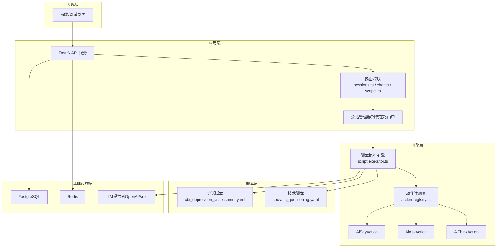
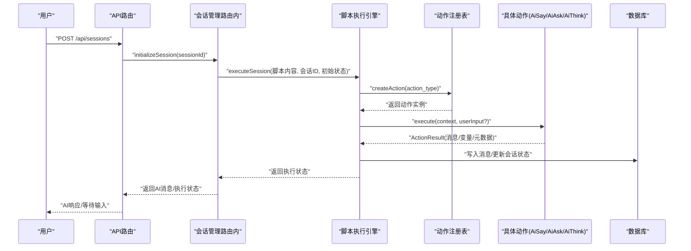
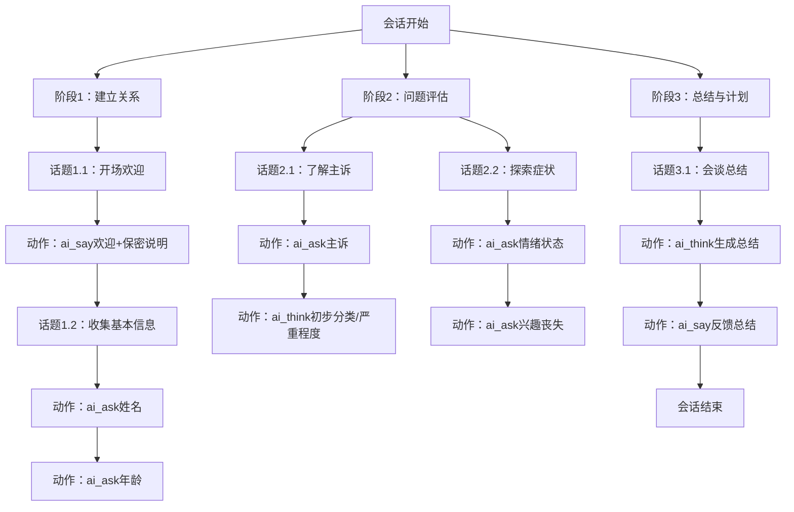
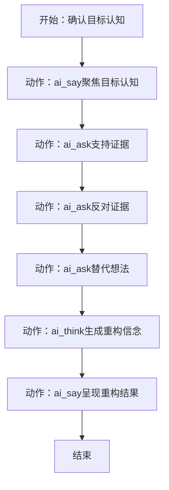
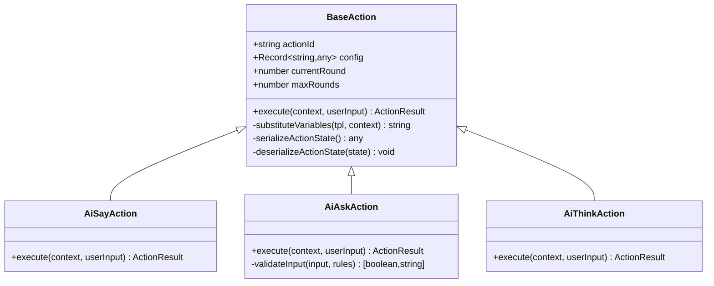
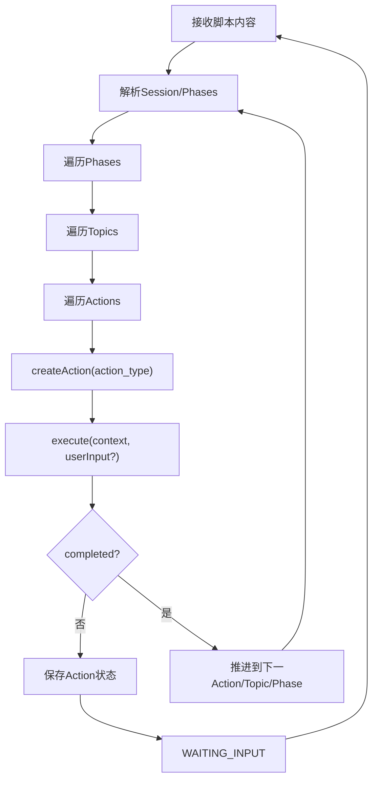
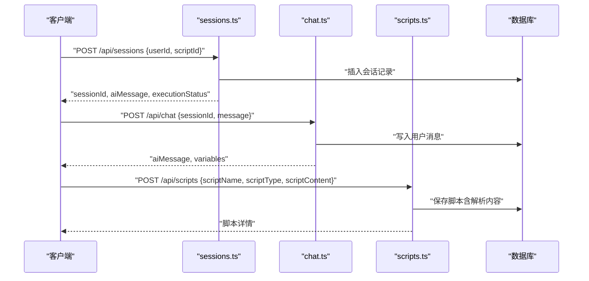
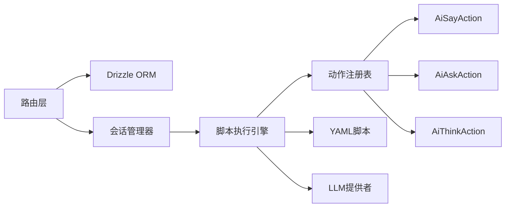

# 应用场景与案例

<cite>
**本文引用的文件**
- [README.md](file://README.md)
- [cbt_depression_assessment.yaml](file://scripts/sessions/cbt_depression_assessment.yaml)
- [socratic_questioning.yaml](file://scripts/techniques/socratic_questioning.yaml)
- [app.ts](file://packages/api-server/src/app.ts)
- [sessions.ts](file://packages/api-server/src/routes/sessions.ts)
- [chat.ts](file://packages/api-server/src/routes/chat.ts)
- [scripts.ts](file://packages/api-server/src/routes/scripts.ts)
- [script-executor.ts](file://packages/core-engine/src/engines/script-execution/script-executor.ts)
- [action-registry.ts](file://packages/core-engine/src/actions/action-registry.ts)
- [ai-say-action.ts](file://packages/core-engine/src/actions/ai-say-action.ts)
- [ai-ask-action.ts](file://packages/core-engine/src/actions/ai-ask-action.ts)
- [ai-think-action.ts](file://packages/core-engine/src/actions/ai-think-action.ts)
- [session.ts](file://packages/core-engine/src/domain/session.ts)
- [script.ts](file://packages/core-engine/src/domain/script.ts)
</cite>

## 目录
1. [引言](#引言)
2. [项目结构](#项目结构)
3. [核心组件](#核心组件)
4. [架构总览](#架构总览)
5. [详细组件分析](#详细组件分析)
6. [依赖分析](#依赖分析)
7. [性能考虑](#性能考虑)
8. [故障排查指南](#故障排查指南)
9. [结论](#结论)
10. [附录](#附录)

## 引言
本文件围绕 HeartRule AI咨询引擎的首个应用场景：CBT（认知行为疗法）心理咨询，系统阐述如何将专业咨询流程转化为可执行的YAML脚本，并通过六大核心引擎驱动的执行链路实现“脚本化+LLM”的智能咨询体验。文档将：
- 详解会话评估、技术应用、进度跟踪等关键环节；
- 展示脚本示例与实现效果；
- 总结该架构在其他心理咨询领域的扩展潜力（如DBT、人本主义疗法等）；
- 提供实用的实施参考与落地建议。

## 项目结构
HeartRule 采用 Monorepo 架构，核心由三大包组成：
- shared-types：共享类型与枚举（会话、消息、脚本、变量等）
- core-engine：六大核心引擎（脚本执行、LLM编排、变量提取、记忆、话题调度、意识触发）
- api-server：Fastify REST API + WebSocket，提供会话、聊天、脚本管理等接口

图表来源
- [app.ts](file://packages/api-server/src/app.ts#L92-L104)
- [sessions.ts](file://packages/api-server/src/routes/sessions.ts#L14-L133)
- [chat.ts](file://packages/api-server/src/routes/chat.ts#L15-L79)
- [scripts.ts](file://packages/api-server/src/routes/scripts.ts#L12-L84)
- [script-executor.ts](file://packages/core-engine/src/engines/script-execution/script-executor.ts#L62-L216)
- [action-registry.ts](file://packages/core-engine/src/actions/action-registry.ts#L17-L23)

章节来源
- [README.md](file://README.md#L97-L129)
- [app.ts](file://packages/api-server/src/app.ts#L21-L105)

## 核心组件
- 脚本执行引擎：按 Session → Phase → Topic → Action 的层级顺序执行，支持 Action 状态持久化与恢复，处理等待输入、完成、错误等状态流转。
- 动作系统：AiSayAction（传达信息）、AiAskAction（引导提问并提取变量）、AiThinkAction（内部思考/占位推理），并通过注册表统一创建与调度。
- 会话与脚本领域模型：Session 管理状态、位置、变量；Script 管理脚本元数据与解析内容。
- API 层：提供会话创建/查询、消息历史、变量查询、聊天交互（含 SSE）、脚本创建/导入/校验等端点。

章节来源
- [script-executor.ts](file://packages/core-engine/src/engines/script-execution/script-executor.ts#L62-L216)
- [action-registry.ts](file://packages/core-engine/src/actions/action-registry.ts#L17-L45)
- [ai-say-action.ts](file://packages/core-engine/src/actions/ai-say-action.ts#L16-L104)
- [ai-ask-action.ts](file://packages/core-engine/src/actions/ai-ask-action.ts#L19-L206)
- [ai-think-action.ts](file://packages/core-engine/src/actions/ai-think-action.ts#L11-L56)
- [session.ts](file://packages/core-engine/src/domain/session.ts#L7-L44)
- [script.ts](file://packages/core-engine/src/domain/script.ts#L7-L47)

## 架构总览
下图展示了从用户发起会话到脚本执行、动作执行、变量提取与消息回传的完整链路。

图表来源
- [sessions.ts](file://packages/api-server/src/routes/sessions.ts#L14-L133)
- [script-executor.ts](file://packages/core-engine/src/engines/script-execution/script-executor.ts#L66-L216)
- [action-registry.ts](file://packages/core-engine/src/actions/action-registry.ts#L35-L45)
- [ai-say-action.ts](file://packages/core-engine/src/actions/ai-say-action.ts#L19-L103)
- [ai-ask-action.ts](file://packages/core-engine/src/actions/ai-ask-action.ts#L27-L167)
- [ai-think-action.ts](file://packages/core-engine/src/actions/ai-think-action.ts#L18-L54)

## 详细组件分析

### CBT 初次评估会话脚本（YAML 结构与执行）
CBT 初次评估脚本以“建立关系—问题评估—总结与计划”三阶段组织，每个阶段包含若干话题，话题内由一系列动作构成。动作类型包括：
- ai_say：传达信息、建立安全感、总结反馈
- ai_ask：收集人口学信息、主诉、症状描述等，并提取变量
- ai_think：内部分析与生成摘要（MVP占位）

图表来源
- [cbt_depression_assessment.yaml](file://scripts/sessions/cbt_depression_assessment.yaml#L13-L166)

章节来源
- [cbt_depression_assessment.yaml](file://scripts/sessions/cbt_depression_assessment.yaml#L4-L166)

### 苏格拉底式提问技术脚本（可复用咨询技术）
该技术脚本以“目标认知—支持证据—反对证据—替代想法—重构信念—反馈”为主线，通过一系列 ai_ask + ai_think + ai_say 的组合，引导来访者自我觉察与认知重构。

图表来源
- [socratic_questioning.yaml](file://scripts/techniques/socratic_questioning.yaml#L31-L110)

章节来源
- [socratic_questioning.yaml](file://scripts/techniques/socratic_questioning.yaml#L4-L110)

### 动作执行与状态机（AiSay/AiAsk/AiThink）
- AiSayAction：支持“需要确认/无需确认”两种模式；无需确认时立即推进脚本，但仍发送消息；需要确认时第一轮发送消息并等待，第二轮视为确认完成。
- AiAskAction：支持必填、长度、正则等校验；多轮重试机制；成功后提取变量并清空状态。
- AiThinkAction：MVP占位实现，直接生成占位变量，后续可接入真实LLM进行推理。

图表来源
- [ai-say-action.ts](file://packages/core-engine/src/actions/ai-say-action.ts#L16-L104)
- [ai-ask-action.ts](file://packages/core-engine/src/actions/ai-ask-action.ts#L19-L206)
- [ai-think-action.ts](file://packages/core-engine/src/actions/ai-think-action.ts#L11-L56)

章节来源
- [ai-say-action.ts](file://packages/core-engine/src/actions/ai-say-action.ts#L16-L104)
- [ai-ask-action.ts](file://packages/core-engine/src/actions/ai-ask-action.ts#L19-L206)
- [ai-think-action.ts](file://packages/core-engine/src/actions/ai-think-action.ts#L11-L56)

### 脚本执行引擎（Session → Phase → Topic → Action）
- 执行状态：RUNNING/WAITING_INPUT/PAUSED/COMPLETED/ERROR
- 位置信息：phaseIndex/topicIndex/actionIndex 与对应的ID映射
- 持久化：Action内部状态（currentRound/maxRounds）序列化保存，断点续跑
- 对话历史：每条动作产生的AI消息与元数据写入历史

图表来源
- [script-executor.ts](file://packages/core-engine/src/engines/script-execution/script-executor.ts#L66-L216)
- [action-registry.ts](file://packages/core-engine/src/actions/action-registry.ts#L35-L45)

章节来源
- [script-executor.ts](file://packages/core-engine/src/engines/script-execution/script-executor.ts#L62-L519)

### API 与会话生命周期
- 会话创建：POST /api/sessions，返回sessionId、初始AI消息、执行状态
- 消息历史：GET /api/sessions/:id/messages
- 变量查询：GET /api/sessions/:id/variables
- 聊天交互：POST /api/chat（非流式）、POST /api/chat/stream（SSE）
- 脚本管理：POST /api/scripts、GET /api/scripts、POST /api/scripts/:id/validate

图表来源
- [sessions.ts](file://packages/api-server/src/routes/sessions.ts#L14-L133)
- [chat.ts](file://packages/api-server/src/routes/chat.ts#L16-L79)
- [scripts.ts](file://packages/api-server/src/routes/scripts.ts#L13-L84)

章节来源
- [sessions.ts](file://packages/api-server/src/routes/sessions.ts#L14-L548)
- [chat.ts](file://packages/api-server/src/routes/chat.ts#L15-L152)
- [scripts.ts](file://packages/api-server/src/routes/scripts.ts#L12-L325)

## 依赖分析
- 路由层依赖 Drizzle ORM 访问数据库，依赖 SessionManager 封装执行逻辑
- 执行引擎依赖动作注册表创建具体动作实例，动作之间通过上下文共享变量与历史
- 脚本层通过 YAML 文件定义流程，API 层负责解析与持久化

图表来源
- [sessions.ts](file://packages/api-server/src/routes/sessions.ts#L6-L7)
- [script-executor.ts](file://packages/core-engine/src/engines/script-execution/script-executor.ts#L8-L10)
- [action-registry.ts](file://packages/core-engine/src/actions/action-registry.ts#L7-L9)

章节来源
- [sessions.ts](file://packages/api-server/src/routes/sessions.ts#L1-L548)
- [script-executor.ts](file://packages/core-engine/src/engines/script-execution/script-executor.ts#L1-L519)
- [action-registry.ts](file://packages/core-engine/src/actions/action-registry.ts#L1-L46)

## 性能考虑
- 执行引擎采用异步事件循环与状态持久化，避免长阻塞；Action 状态序列化仅在需要时保存，降低IO压力。
- API 层使用 Fastify，SSE 流式响应为未来真实流式输出预留通道。
- 建议：对高频变量提取与LLM调用进行缓存与批量化；对脚本解析结果进行内存缓存；对数据库查询增加索引（如按userId、scriptId）。

## 故障排查指南
- 会话创建失败：检查 scriptId 是否存在、userId 格式、initialVariables 结构；查看错误响应中的上下文字段。
- 等待输入状态：确认客户端是否正确传递上一轮用户输入；检查 Action 的 max_rounds 与 require_acknowledgment 配置。
- 变量提取异常：核对 AiAskAction 的 target_variable 与 extraction_prompt；检查 validation 规则是否导致重试。
- 脚本解析失败：确认 YAML 语法正确；通过 /api/scripts/:id/validate 进行验证；必要时使用 /api/scripts/import 导入调试。

章节来源
- [sessions.ts](file://packages/api-server/src/routes/sessions.ts#L55-L133)
- [chat.ts](file://packages/api-server/src/routes/chat.ts#L44-L78)
- [scripts.ts](file://packages/api-server/src/routes/scripts.ts#L280-L323)
- [ai-ask-action.ts](file://packages/core-engine/src/actions/ai-ask-action.ts#L169-L205)
- [script-executor.ts](file://packages/core-engine/src/engines/script-execution/script-executor.ts#L323-L342)

## 结论
HeartRule 将专业CBT流程结构化为YAML脚本，借助脚本执行引擎与动作系统，实现了“可执行、可维护、可追溯”的智能咨询体验。通过会话评估、技术应用与进度跟踪的闭环，系统既保留了咨询的专业性，又具备了规模化与可扩展性。未来可在以下方向演进：
- 完善记忆引擎与长期追踪；
- 引入真实LLM进行AiThink推理；
- 扩展至DBT、人本主义等其他疗法的脚本体系；
- 前端可视化编辑器与调试面板完善。

## 附录

### CBT 应用场景实施清单
- 准备脚本：基于 cbt_depression_assessment.yaml 与 socratic_questioning.yaml，按机构规范调整模板与变量。
- 部署与联调：启动 API 服务，导入脚本，创建会话，验证消息历史与变量提取。
- 业务集成：在现有咨询平台嵌入 /api/chat 与 /api/chat/stream，实现无缝对话体验。
- 质量保障：使用 /api/scripts/:id/validate 与调试端点进行脚本校验与问题定位。

章节来源
- [README.md](file://README.md#L321-L327)
- [scripts.ts](file://packages/api-server/src/routes/scripts.ts#L171-L278)
- [chat.ts](file://packages/api-server/src/routes/chat.ts#L16-L79)