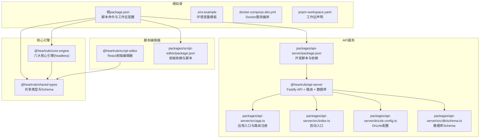
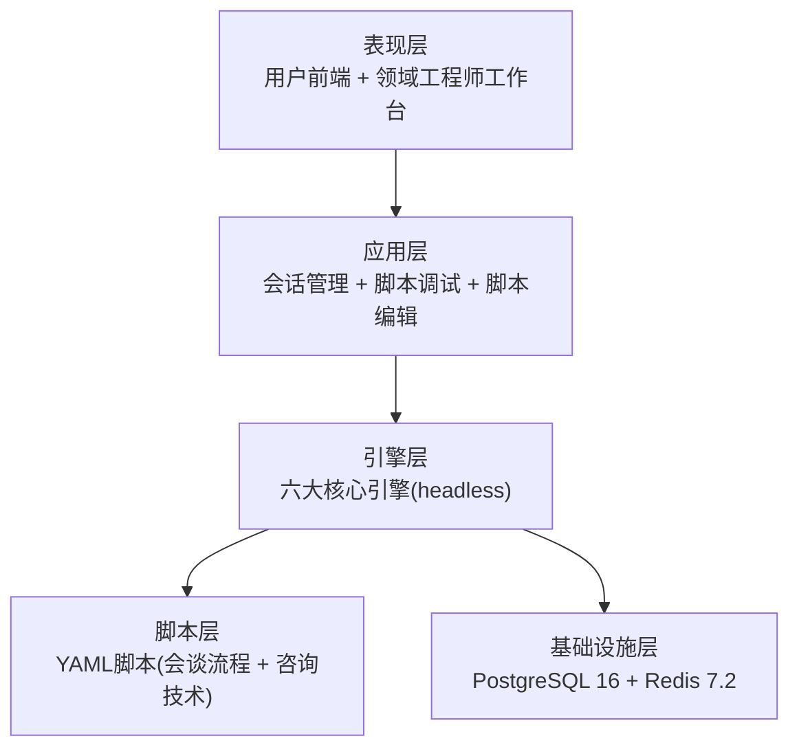
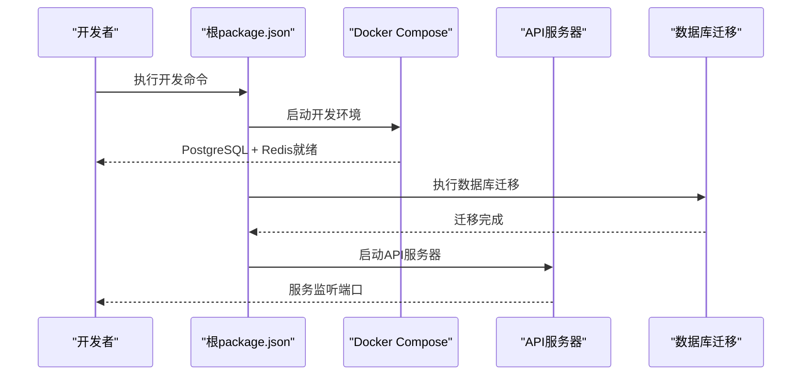
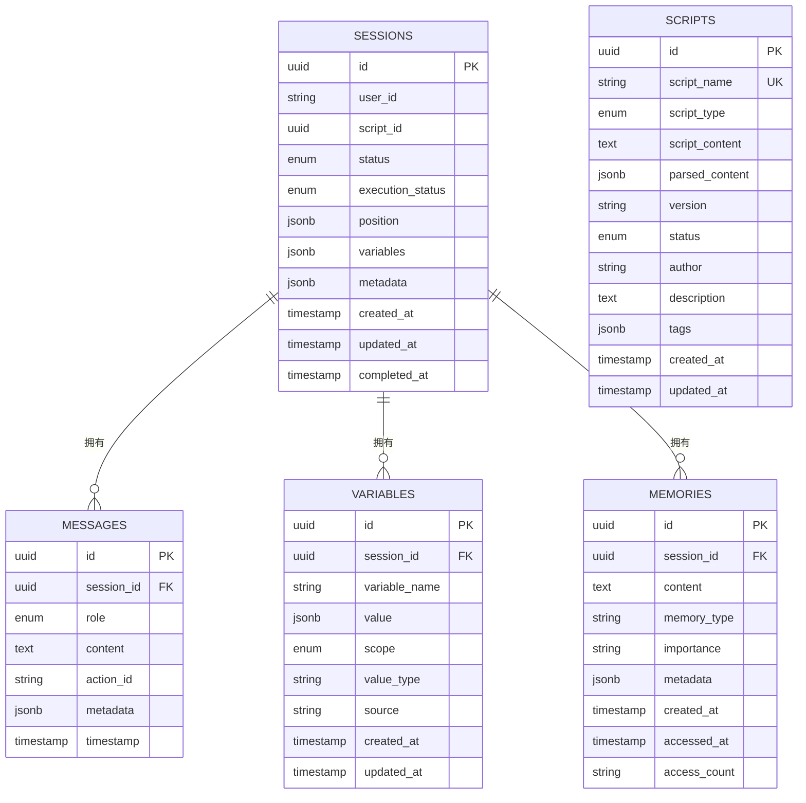
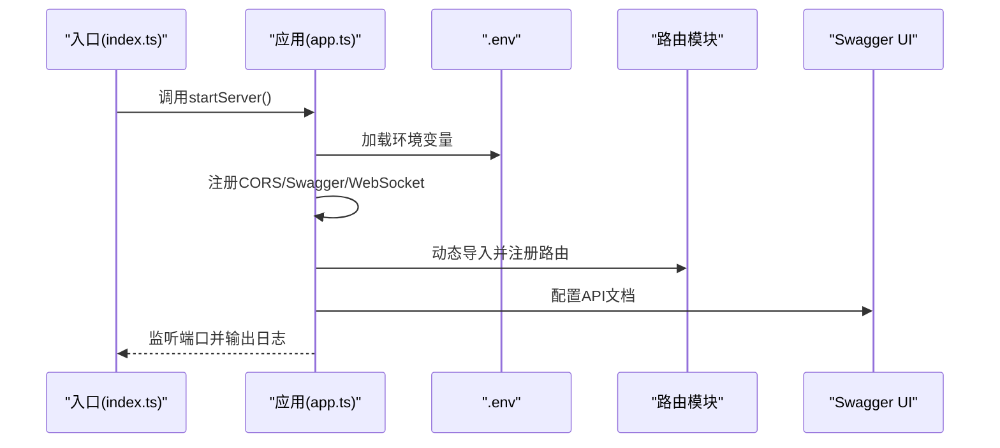
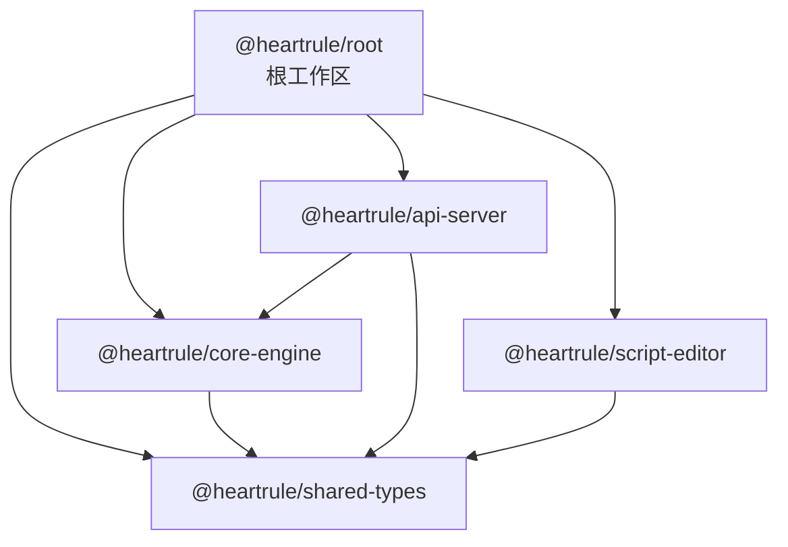

# 快速开始指南

<cite>
**本文引用的文件**
- [README.md](file://README.md)
- [QUICK_START_GUIDE.md](file://QUICK_START_GUIDE.md)
- [DEV_START_GUIDE.md](file://DEV_START_GUIDE.md)
- [package.json](file://package.json)
- [.env.example](file://.env.example)
- [docker-compose.dev.yml](file://docker-compose.dev.yml)
- [pnpm-workspace.yaml](file://pnpm-workspace.yaml)
- [packages/api-server/package.json](file://packages/api-server/package.json)
- [packages/api-server/src/app.ts](file://packages/api-server/src/app.ts)
- [packages/api-server/src/index.ts](file://packages/api-server/src/index.ts)
- [packages/api-server/drizzle.config.ts](file://packages/api-server/drizzle.config.ts)
- [packages/api-server/src/db/schema.ts](file://packages/api-server/src/db/schema.ts)
- [packages/script-editor/package.json](file://packages/script-editor/package.json)
- [packages/core-engine/package.json](file://packages/core-engine/package.json)
- [packages/shared-types/package.json](file://packages/shared-types/package.json)
- [start-dev.ps1](file://start-dev.ps1)
</cite>

## 目录
1. [简介](#简介)
2. [项目结构](#项目结构)
3. [核心组件](#核心组件)
4. [架构总览](#架构总览)
5. [详细组件分析](#详细组件分析)
6. [依赖关系分析](#依赖关系分析)
7. [性能考虑](#性能考虑)
8. [故障排除指南](#故障排除指南)
9. [结论](#结论)
10. [附录](#附录)

## 简介
HeartRule AI咨询引擎是一个基于“LLM + YAML脚本”的智能咨询框架，首个应用场景为CBT心理咨询。系统采用混合架构，结合大语言模型的语言理解与生成能力，以及结构化脚本的流程控制能力，将专业咨询师的经验沉淀为可执行、可维护的脚本化知识库。

本指南面向新用户，提供从环境准备到一键启动的完整流程，涵盖依赖安装、Docker服务启动、数据库迁移、API服务器启动、访问系统方法以及常见问题排查，确保您能在最短时间内成功运行项目。

## 项目结构
项目采用monorepo结构，使用pnpm workspace管理多个包，核心模块包括：
- packages/shared-types：共享TypeScript类型定义与Zod Schema
- packages/core-engine：六大核心引擎（headless）
- packages/api-server：Fastify REST API + WebSocket
- packages/script-editor：脚本编辑器前端（React + Ant Design）

**图表来源**
- [package.json](file://package.json#L1-L60)
- [pnpm-workspace.yaml](file://pnpm-workspace.yaml#L1-L3)
- [packages/api-server/package.json](file://packages/api-server/package.json#L1-L44)
- [packages/api-server/src/app.ts](file://packages/api-server/src/app.ts#L1-L135)
- [packages/api-server/src/index.ts](file://packages/api-server/src/index.ts#L1-L10)
- [packages/api-server/drizzle.config.ts](file://packages/api-server/drizzle.config.ts#L1-L16)
- [packages/api-server/src/db/schema.ts](file://packages/api-server/src/db/schema.ts#L1-L219)
- [packages/core-engine/package.json](file://packages/core-engine/package.json#L1-L34)
- [packages/shared-types/package.json](file://packages/shared-types/package.json#L1-L27)
- [packages/script-editor/package.json](file://packages/script-editor/package.json#L1-L33)

**章节来源**
- [README.md](file://README.md#L97-L129)
- [package.json](file://package.json#L1-L60)
- [pnpm-workspace.yaml](file://pnpm-workspace.yaml#L1-L3)

## 核心组件
- API服务器：基于Fastify，提供REST API与WebSocket，内置Swagger文档与健康检查端点
- 核心引擎：headless的六大核心引擎（脚本执行、LLM编排、变量提取、记忆、话题调度、意识触发）
- 脚本编辑器：React前端，支持可视化脚本工程管理与版本控制
- 数据库：PostgreSQL 16 + Drizzle ORM，提供完整的Schema定义与迁移能力
- 缓存：Redis 7.2，用于会话与缓存管理

**章节来源**
- [README.md](file://README.md#L133-L164)
- [packages/api-server/package.json](file://packages/api-server/package.json#L1-L44)
- [packages/core-engine/package.json](file://packages/core-engine/package.json#L1-L34)
- [packages/script-editor/package.json](file://packages/script-editor/package.json#L1-L33)

## 架构总览
系统采用五层分层架构与monorepo组织方式，基础设施层提供PostgreSQL与Redis，应用层负责会话管理与脚本调试，表现层包含用户前端与领域工程师工作台。

**图表来源**
- [README.md](file://README.md#L26-L58)

**章节来源**
- [README.md](file://README.md#L26-L58)

## 详细组件分析

### 环境要求与前置条件
- Node.js：20+（LTS）
- pnpm：9+
- PostgreSQL：16
- Redis：7.2
- Docker Desktop：用于本地开发环境编排

**章节来源**
- [README.md](file://README.md#L65-L71)
- [DEV_START_GUIDE.md](file://DEV_START_GUIDE.md#L3-L28)
- [docker-compose.dev.yml](file://docker-compose.dev.yml#L1-L64)

### 一键启动流程
推荐使用根目录提供的脚本命令完成一键启动，流程如下：

**图表来源**
- [package.json](file://package.json#L13-L32)
- [docker-compose.dev.yml](file://docker-compose.dev.yml#L1-L64)
- [packages/api-server/package.json](file://packages/api-server/package.json#L8-L18)

**章节来源**
- [README.md](file://README.md#L72-L86)
- [QUICK_START_GUIDE.md](file://QUICK_START_GUIDE.md#L14-L40)
- [DEV_START_GUIDE.md](file://DEV_START_GUIDE.md#L5-L28)

### 访问系统
- API文档：http://localhost:8000/docs（Swagger UI）
- 健康检查：http://localhost:8000/health
- PostgreSQL管理：http://localhost:8080（Adminer）
- Redis管理：http://localhost:8081（Redis Commander）
- 脚本编辑器：http://localhost:3000（前端编辑器）
- 测试对话界面：web/index.html

**章节来源**
- [README.md](file://README.md#L88-L94)
- [QUICK_START_GUIDE.md](file://QUICK_START_GUIDE.md#L49-L55)
- [docker-compose.dev.yml](file://docker-compose.dev.yml#L42-L54)

### 数据库Schema与迁移
API服务器使用Drizzle ORM定义完整的数据库Schema，并通过迁移脚本初始化数据库结构。

**图表来源**
- [packages/api-server/src/db/schema.ts](file://packages/api-server/src/db/schema.ts#L22-L219)

**章节来源**
- [packages/api-server/drizzle.config.ts](file://packages/api-server/drizzle.config.ts#L1-L16)
- [packages/api-server/src/db/schema.ts](file://packages/api-server/src/db/schema.ts#L1-L219)

### API服务器启动流程
API服务器通过Fastify框架启动，注册CORS、Swagger、WebSocket等插件，并加载环境变量与路由。

**图表来源**
- [packages/api-server/src/index.ts](file://packages/api-server/src/index.ts#L1-L10)
- [packages/api-server/src/app.ts](file://packages/api-server/src/app.ts#L15-L105)

**章节来源**
- [packages/api-server/src/index.ts](file://packages/api-server/src/index.ts#L1-L10)
- [packages/api-server/src/app.ts](file://packages/api-server/src/app.ts#L1-L135)

### 脚本编辑器前端
脚本编辑器基于React与Ant Design构建，提供可视化脚本工程管理与版本控制能力。

**章节来源**
- [packages/script-editor/package.json](file://packages/script-editor/package.json#L1-L33)

## 依赖关系分析
项目使用pnpm workspace统一管理依赖，各包之间的依赖关系如下：

**图表来源**
- [pnpm-workspace.yaml](file://pnpm-workspace.yaml#L1-L3)
- [packages/api-server/package.json](file://packages/api-server/package.json#L20-L34)
- [packages/core-engine/package.json](file://packages/core-engine/package.json#L14-L26)
- [packages/script-editor/package.json](file://packages/script-editor/package.json#L12-L22)
- [packages/shared-types/package.json](file://packages/shared-types/package.json#L14-L21)

**章节来源**
- [pnpm-workspace.yaml](file://pnpm-workspace.yaml#L1-L3)
- [package.json](file://package.json#L1-L60)

## 性能考虑
- 使用Fastify框架替代Express，获得更优的性能表现
- Drizzle ORM零运行时开销，提供高性能数据库访问
- Monorepo结构减少重复依赖，提升构建与运行效率
- Docker容器化部署，隔离环境并简化运维

**章节来源**
- [README.md](file://README.md#L135-L146)

## 故障排除指南

### 端口被占用
现象：启动时出现端口占用错误
解决：
- 查找占用端口的进程并结束
- 修改服务端口配置以避免冲突

**章节来源**
- [QUICK_START_GUIDE.md](file://QUICK_START_GUIDE.md#L225-L244)

### Docker未启动
现象：Docker连接错误
解决：
- 启动Docker Desktop并等待完全启动
- 重新执行Docker开发环境启动命令

**章节来源**
- [QUICK_START_GUIDE.md](file://QUICK_START_GUIDE.md#L245-L258)

### Web界面无法连接API
现象：浏览器控制台显示CORS错误
解决：
- 确认API服务器正在运行
- 检查前端API地址配置
- 查看浏览器控制台具体错误信息

**章节来源**
- [QUICK_START_GUIDE.md](file://QUICK_START_GUIDE.md#L259-L268)

### 数据库连接失败
现象：数据库连接错误
解决：
- 确认Docker正在运行
- 检查PostgreSQL容器状态
- 查看数据库日志并重启服务

**章节来源**
- [QUICK_START_GUIDE.md](file://QUICK_START_GUIDE.md#L269-L283)

### 依赖安装问题
现象：依赖安装失败
解决：
- 清理依赖后重新安装
- 检查网络与缓存配置

**章节来源**
- [DEV_START_GUIDE.md](file://DEV_START_GUIDE.md#L103-L114)

### 环境变量配置
确保复制.env.example为.env并正确填写数据库、Redis、LLM等配置项。

**章节来源**
- [.env.example](file://.env.example#L1-L31)

## 结论
通过本快速开始指南，您已经完成了HeartRule AI咨询引擎的环境准备、一键启动与基本验证。建议在开发过程中：
- 使用根目录脚本命令统一管理服务启动
- 通过Swagger文档了解API接口规范
- 利用Drizzle Studio进行数据库调试
- 参考开发指南进行功能扩展与贡献

## 附录

### 环境变量模板
- DATABASE_URL：PostgreSQL连接字符串
- REDIS_URL：Redis连接字符串
- LLM_PROVIDER：LLM提供者选择
- OPENAI_API_KEY：OpenAI API密钥
- VOLCANO_API_KEY：火山引擎API密钥
- API_PORT/API_HOST：API服务端口与主机
- JWT_SECRET：JWT密钥（生产环境务必修改）

**章节来源**
- [.env.example](file://.env.example#L7-L28)

### 常用命令速查
- pnpm install：安装依赖
- pnpm docker:dev：启动Docker开发环境
- pnpm --filter @heartrule/api-server db:migrate：运行数据库迁移
- pnpm dev：启动API服务器
- pnpm run dev:all：同时启动API服务器与脚本编辑器
- pnpm run db:studio：打开Drizzle Studio

**章节来源**
- [package.json](file://package.json#L13-L32)
- [packages/api-server/package.json](file://packages/api-server/package.json#L8-L18)