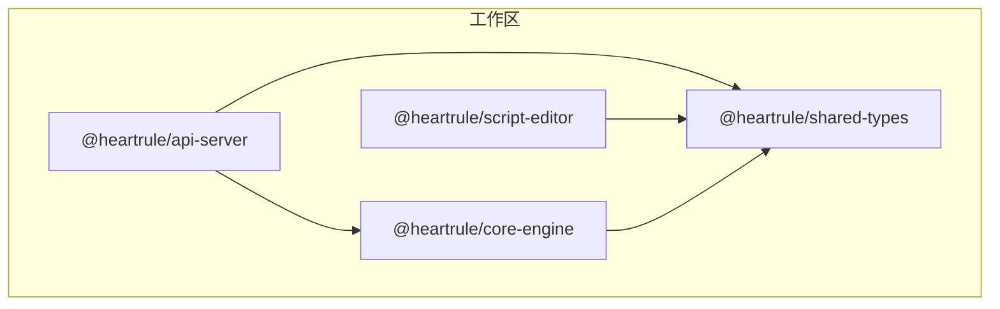
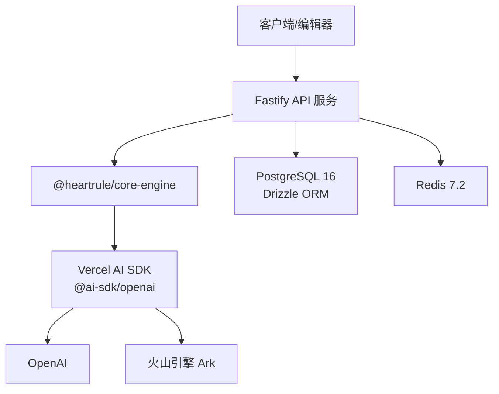
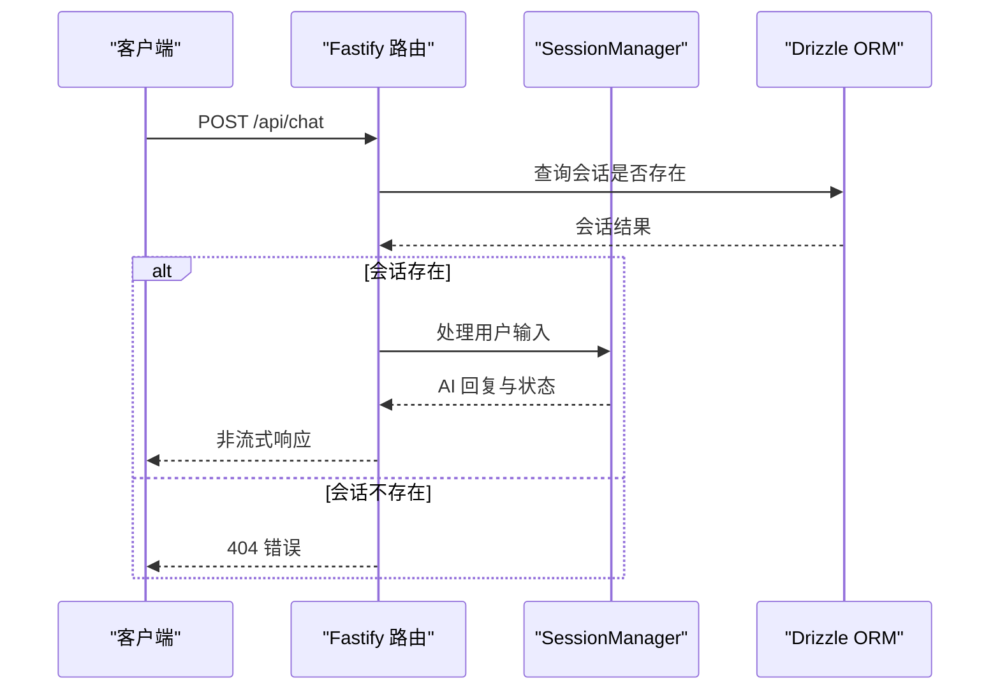
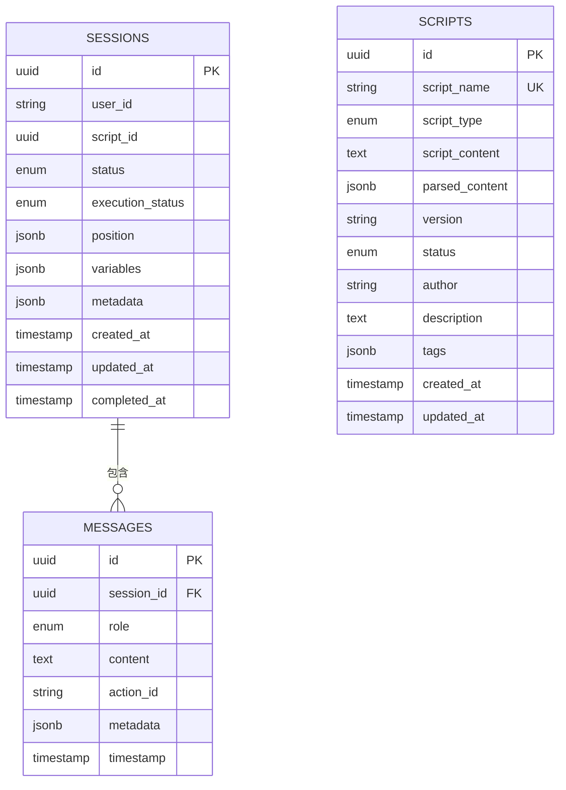
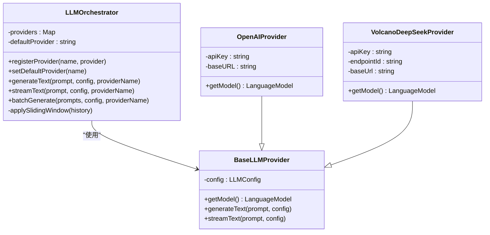
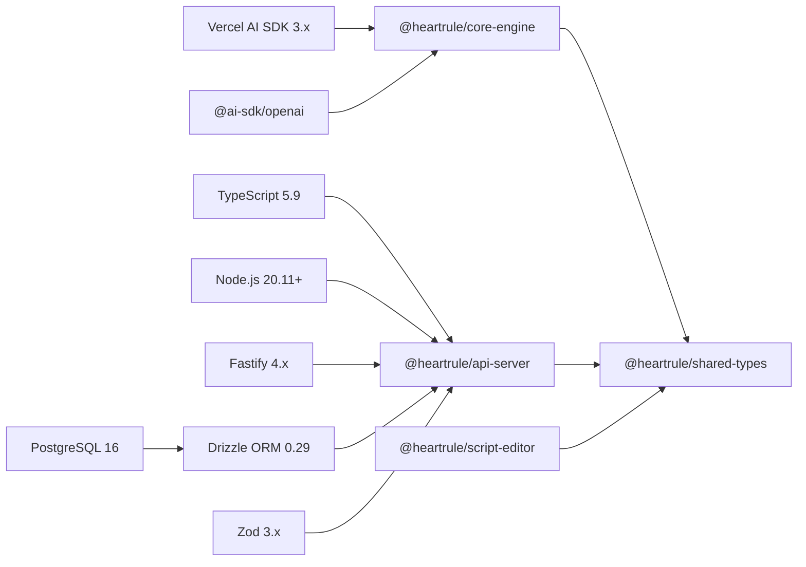

# 技术栈介绍

<cite>
**本文档引用的文件**
- [package.json](file://package.json)
- [pnpm-workspace.yaml](file://pnpm-workspace.yaml)
- [tsconfig.json](file://tsconfig.json)
- [vitest.config.ts](file://vitest.config.ts)
- [.eslintrc.cjs](file://.eslintrc.cjs)
- [packages/api-server/package.json](file://packages/api-server/package.json)
- [packages/api-server/src/app.ts](file://packages/api-server/src/app.ts)
- [packages/api-server/drizzle.config.ts](file://packages/api-server/drizzle.config.ts)
- [packages/api-server/src/routes/chat.ts](file://packages/api-server/src/routes/chat.ts)
- [packages/api-server/src/db/schema.ts](file://packages/api-server/src/db/schema.ts)
- [packages/core-engine/package.json](file://packages/core-engine/package.json)
- [packages/core-engine/src/index.ts](file://packages/core-engine/src/index.ts)
- [packages/core-engine/src/engines/llm-orchestration/orchestrator.ts](file://packages/core-engine/src/engines/llm-orchestration/orchestrator.ts)
- [packages/core-engine/src/engines/llm-orchestration/openai-provider.ts](file://packages/core-engine/src/engines/llm-orchestration/openai-provider.ts)
- [packages/core-engine/src/engines/llm-orchestration/volcano-provider.ts](file://packages/core-engine/src/engines/llm-orchestration/volcano-provider.ts)
- [packages/script-editor/package.json](file://packages/script-editor/package.json)
- [packages/shared-types/package.json](file://packages/shared-types/package.json)
</cite>

## 目录
1. [引言](#引言)
2. [项目结构](#项目结构)
3. [核心组件](#核心组件)
4. [架构总览](#架构总览)
5. [详细组件分析](#详细组件分析)
6. [依赖关系分析](#依赖关系分析)
7. [性能考虑](#性能考虑)
8. [故障排除指南](#故障排除指南)
9. [结论](#结论)
10. [附录](#附录)

## 引言
本文件系统性梳理 HeartRule AI 咨询引擎的技术栈与架构设计，重点覆盖后端核心技术栈（TypeScript 5.9、Node.js 20 LTS、Fastify 4.x、Drizzle ORM 0.29、PostgreSQL 16、Redis 7.2、Zod 3.x）、AI 集成方案（Vercel AI SDK、@ai-sdk/openai、Volcengine Ark）、以及开发工具链（pnpm 9+、tsup、Vitest、ESLint + Prettier、Husky）。文档同时给出技术选型理由、版本兼容性说明与升级路径建议，帮助开发者在理解整体架构的同时，快速定位关键实现。

## 项目结构
项目采用 pnpm workspace 的 monorepo 结构，核心包包括：
- api-server：基于 Fastify 的后端 API 服务，负责路由、数据库访问与业务编排
- core-engine：核心引擎，包含 LLM 编排、脚本执行、变量提取与记忆模块
- script-editor：前端可视化脚本编辑器
- shared-types：跨包共享的类型与 Zod 模式定义
- docs、config、scripts：文档、配置与辅助脚本

图表来源
- [pnpm-workspace.yaml](file://pnpm-workspace.yaml#L1-L3)
- [packages/api-server/package.json](file://packages/api-server/package.json#L1-L44)
- [packages/core-engine/package.json](file://packages/core-engine/package.json#L1-L34)
- [packages/script-editor/package.json](file://packages/script-editor/package.json#L1-L33)
- [packages/shared-types/package.json](file://packages/shared-types/package.json#L1-L27)

章节来源
- [pnpm-workspace.yaml](file://pnpm-workspace.yaml#L1-L3)
- [package.json](file://package.json#L1-L60)

## 核心组件
- 后端运行时与构建
  - Node.js 20.11+（满足 engines 要求），TypeScript 5.9.2，ESNext 模块解析
  - pnpm 9+ 作为包管理器，统一工作区依赖与脚本
- Web 框架与路由
  - Fastify 4.x，注册 CORS、Swagger/OpenAPI 文档、WebSocket 支持
  - 路由按功能拆分（sessions、chat、scripts、projects、versions）
- 数据持久层
  - Drizzle ORM 0.29 + PostgreSQL 16，使用 JSONB 存储复杂数据，枚举类型与索引优化
  - 提供迁移与 Studio 工具链
- 类型与校验
  - Zod 3.x 用于请求/响应模式校验与类型推断
- AI 集成
  - Vercel AI SDK（ai ^3）+ @ai-sdk/openai，统一 LLM 调用接口
  - 支持 OpenAI 与火山引擎 Ark（通过 OpenAI 兼容接口）
- 前端与共享类型
  - React 18 + Ant Design + Zustand + Axios + ReactFlow
  - shared-types 通过 tsup 构建，提供跨包共享类型与 Zod 模式

章节来源
- [package.json](file://package.json#L8-L12)
- [tsconfig.json](file://tsconfig.json#L1-L30)
- [packages/api-server/package.json](file://packages/api-server/package.json#L20-L42)
- [packages/core-engine/package.json](file://packages/core-engine/package.json#L19-L32)
- [packages/script-editor/package.json](file://packages/script-editor/package.json#L12-L31)
- [packages/shared-types/package.json](file://packages/shared-types/package.json#L19-L26)

## 架构总览
系统采用“API 层 + 核心引擎 + 数据层”的分层架构。API 层负责接入与编排，核心引擎负责 LLM 编排、脚本执行与状态管理，数据层通过 Drizzle ORM 访问 PostgreSQL。

图表来源
- [packages/api-server/src/app.ts](file://packages/api-server/src/app.ts#L21-L105)
- [packages/api-server/src/db/schema.ts](file://packages/api-server/src/db/schema.ts#L1-L219)
- [packages/core-engine/src/engines/llm-orchestration/orchestrator.ts](file://packages/core-engine/src/engines/llm-orchestration/orchestrator.ts#L50-L161)
- [packages/core-engine/src/engines/llm-orchestration/openai-provider.ts](file://packages/core-engine/src/engines/llm-orchestration/openai-provider.ts#L9-L27)
- [packages/core-engine/src/engines/llm-orchestration/volcano-provider.ts](file://packages/core-engine/src/engines/llm-orchestration/volcano-provider.ts#L11-L41)

## 详细组件分析

### 后端 API 服务（Fastify）
- 应用初始化与中间件
  - 日志级别可配置，CORS 允许跨域，Swagger/OpenAPI 文档与 UI
  - WebSocket 插件启用，支持 SSE/WS 场景
- 路由与业务编排
  - 根路径与健康检查
  - 会话、聊天、脚本、项目、版本等路由注册
  - 聊天路由支持非流式与 SSE 流式两种模式
- 数据访问
  - 使用 Drizzle ORM 查询 sessions 表，验证会话存在性
  - 消息写入 messages 表，支持元数据与时间戳
- 错误处理
  - 统一错误日志记录与 5xx 响应
  - 流式场景中异常通过 SSE 返回

图表来源
- [packages/api-server/src/routes/chat.ts](file://packages/api-server/src/routes/chat.ts#L15-L79)
- [packages/api-server/src/db/schema.ts](file://packages/api-server/src/db/schema.ts#L22-L40)

章节来源
- [packages/api-server/src/app.ts](file://packages/api-server/src/app.ts#L21-L105)
- [packages/api-server/src/routes/chat.ts](file://packages/api-server/src/routes/chat.ts#L15-L152)

### 数据层（Drizzle ORM + PostgreSQL 16）
- Schema 设计
  - 会话表（sessions）：状态枚举、执行状态、位置指针、变量快照、元数据
  - 消息表（messages）：角色枚举、内容、动作标识、时间戳
  - 脚本与工程相关表：脚本类型/状态、工程草稿/版本、文件类型等
  - 变量表（variables）：作用域枚举、值类型、来源与时间戳
  - 记忆表（memories）：重要性与元数据，预留向量字段
- 索引与约束
  - 为高频查询字段建立索引（如 sessions_user_id_idx）
  - 外键约束保证数据一致性（如 messages.session_id -> sessions.id）
- 迁移与工具
  - drizzle.config.ts 指定 schema、输出目录与连接字符串
  - 提供 generate、studio、push 命令

图表来源
- [packages/api-server/src/db/schema.ts](file://packages/api-server/src/db/schema.ts#L22-L198)

章节来源
- [packages/api-server/drizzle.config.ts](file://packages/api-server/drizzle.config.ts#L1-L16)
- [packages/api-server/src/db/schema.ts](file://packages/api-server/src/db/schema.ts#L1-L219)

### 核心引擎（LLM 编排与脚本执行）
- LLM 编排器（LLMOrchestrator）
  - 统一管理多个 LLM 提供者，支持默认提供者切换与批量调用
  - 构建提示词（system + sliding window 对话历史），支持流式与非流式生成
  - 提供调试信息（prompt、response、tokens 使用量等）
- 基类提供者（BaseLLMProvider）
  - 合并配置（temperature、maxTokens、topP 等），封装 generateText/streamText
- OpenAI 提供者（OpenAIProvider）
  - 基于 @ai-sdk/openai，支持自定义 baseURL
- 火山引擎提供者（VolcanoDeepSeekProvider）
  - 通过 OpenAI 兼容接口对接火山 Ark API，使用 endpointId 作为模型名
- 脚本执行与动作
  - 新版脚本执行器与动作注册机制，替代旧版 base.js/registry.js
  - 支持 ai-say、ai-ask 等动作

图表来源
- [packages/core-engine/src/engines/llm-orchestration/orchestrator.ts](file://packages/core-engine/src/engines/llm-orchestration/orchestrator.ts#L50-L238)
- [packages/core-engine/src/engines/llm-orchestration/openai-provider.ts](file://packages/core-engine/src/engines/llm-orchestration/openai-provider.ts#L9-L27)
- [packages/core-engine/src/engines/llm-orchestration/volcano-provider.ts](file://packages/core-engine/src/engines/llm-orchestration/volcano-provider.ts#L11-L41)

章节来源
- [packages/core-engine/src/index.ts](file://packages/core-engine/src/index.ts#L1-L27)
- [packages/core-engine/src/engines/llm-orchestration/orchestrator.ts](file://packages/core-engine/src/engines/llm-orchestration/orchestrator.ts#L1-L238)
- [packages/core-engine/src/engines/llm-orchestration/openai-provider.ts](file://packages/core-engine/src/engines/llm-orchestration/openai-provider.ts#L1-L28)
- [packages/core-engine/src/engines/llm-orchestration/volcano-provider.ts](file://packages/core-engine/src/engines/llm-orchestration/volcano-provider.ts#L1-L42)

### 类型与校验（Zod 3.x）
- 共享类型与模式
  - shared-types 包含 API 请求/响应类型与领域模型，使用 Zod 进行运行时校验
- API 层类型安全
  - fastify-type-provider-zod 将 Zod 模式注入 Fastify，实现路由级别的输入/输出校验
- 核心引擎类型
  - LLM 配置、调试信息、动作与脚本模型均以 Zod 模式定义，确保跨包一致性

章节来源
- [packages/shared-types/package.json](file://packages/shared-types/package.json#L19-L26)
- [packages/api-server/package.json](file://packages/api-server/package.json#L30-L30)

### 前端与共享类型（React + Ant Design）
- 脚本编辑器
  - React 18 + Vite，Ant Design + Zustand 状态管理
  - 支持项目列表与编辑器页面，使用 axios 与后端 API 通信
- 共享类型
  - 通过 tsup 构建，提供跨包类型导出，减少重复定义

章节来源
- [packages/script-editor/package.json](file://packages/script-editor/package.json#L12-L31)
- [packages/shared-types/package.json](file://packages/shared-types/package.json#L1-L27)

## 依赖关系分析
- 版本与兼容性
  - Node.js >= 20.11.0，TypeScript 5.9.x，确保语言特性与类型系统稳定
  - Fastify 4.x 与 @fastify/swagger/@fastify/swagger-ui/@fastify/websocket 兼容
  - Drizzle ORM 0.29 与 PostgreSQL 16，配合 JSONB 与枚举类型
  - Zod 3.x 与 fastify-type-provider-zod 协同实现类型安全
  - Vercel AI SDK 与 @ai-sdk/openai 提供统一 LLM 接口
- 工作区依赖
  - api-server 依赖 core-engine 与 shared-types
  - script-editor 依赖 shared-types
  - core-engine 依赖 shared-types 与 ai、@ai-sdk/openai

图表来源
- [packages/api-server/package.json](file://packages/api-server/package.json#L20-L34)
- [packages/core-engine/package.json](file://packages/core-engine/package.json#L19-L26)
- [packages/script-editor/package.json](file://packages/script-editor/package.json#L12-L23)
- [packages/shared-types/package.json](file://packages/shared-types/package.json#L19-L21)

章节来源
- [packages/api-server/package.json](file://packages/api-server/package.json#L20-L42)
- [packages/core-engine/package.json](file://packages/core-engine/package.json#L19-L32)
- [packages/script-editor/package.json](file://packages/script-editor/package.json#L12-L31)
- [packages/shared-types/package.json](file://packages/shared-types/package.json#L19-L26)

## 性能考虑
- 数据层
  - 使用 JSONB 存储动态结构，结合枚举与索引提升查询效率
  - 对高频字段建立索引，减少全表扫描
- LLM 调用
  - Orchestrator 支持批量调用与滑动窗口提示词，降低上下文开销
  - 流式输出（SSE）提升用户体验，避免长阻塞
- 运行时
  - Fastify 4.x 以高性能路由与插件体系著称，适合高并发 API
  - TypeScript 严格模式与 ESLint 规则保障代码质量与可维护性

## 故障排除指南
- 启动与环境
  - 确认 Node.js 与 pnpm 版本满足 engines 要求
  - 环境变量（DATABASE_URL、API_PORT、LOG_LEVEL 等）正确配置
- 数据库
  - 使用 drizzle-kit 生成迁移与启动 Studio 进行调试
  - 检查 schema 定义与索引是否匹配查询需求
- API 路由
  - Swagger UI 路径 /docs，确认路由注册顺序与前缀
  - 聊天流式响应需正确设置 SSE 头部，注意异常时的终止写入
- LLM 集成
  - OpenAI 与火山 Ark 的 API Key 与 baseURL 正确
  - 调试信息包含 tokens 使用量，便于成本与性能分析

章节来源
- [packages/api-server/src/app.ts](file://packages/api-server/src/app.ts#L110-L135)
- [packages/api-server/drizzle.config.ts](file://packages/api-server/drizzle.config.ts#L1-L16)
- [packages/api-server/src/routes/chat.ts](file://packages/api-server/src/routes/chat.ts#L81-L151)
- [packages/core-engine/src/engines/llm-orchestration/orchestrator.ts](file://packages/core-engine/src/engines/llm-orchestration/orchestrator.ts#L182-L236)

## 结论
HeartRule AI 咨询引擎采用现代化、模块化的技术栈：以 Fastify 与 Drizzle 构建高性能 API 与数据层，以 Vercel AI SDK 与 @ai-sdk/openai 实现统一的 LLM 集成，并通过 Zod 保障类型安全。monorepo 结构清晰分离前后端与共享类型，辅以完善的开发工具链（pnpm、tsup、Vitest、ESLint/Prettier、Husky），形成可扩展、可维护且易于演进的工程体系。

## 附录

### 版本兼容性与升级路径
- Node.js 与 TypeScript
  - 当前使用 Node.js 20.11+ 与 TypeScript 5.9.x，建议保持主版本一致，逐步升级 minor 版本
- Fastify 4.x
  - 与插件生态兼容良好；升级时优先查看官方迁移指南与变更日志
- Drizzle ORM 0.29 与 PostgreSQL 16
  - 保持 ORM 与驱动版本同步；升级前先运行迁移与测试
- Zod 3.x
  - 语义版本控制严格；升级时关注模式变更与类型推断差异
- Vercel AI SDK 与 @ai-sdk/openai
  - 保持与 ai 包版本一致；新增模型或接口时更新 Provider 实现
- Redis 7.2
  - 作为缓存/会话存储使用；升级时评估配置与持久化策略

### 开发工具链
- 包管理：pnpm 9+，工作区统一管理
- 构建：tsup（核心与共享类型）、Vite（前端）
- 测试：Vitest，覆盖率报告
- 质量：ESLint + Prettier，Husky 钩子
- 类型：严格 TypeScript 配置，bundler 模块解析

章节来源
- [package.json](file://package.json#L8-L12)
- [vitest.config.ts](file://vitest.config.ts#L1-L20)
- [.eslintrc.cjs](file://.eslintrc.cjs#L1-L62)
- [tsconfig.json](file://tsconfig.json#L1-L30)