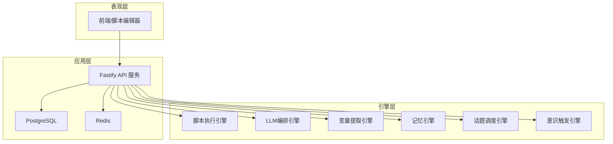
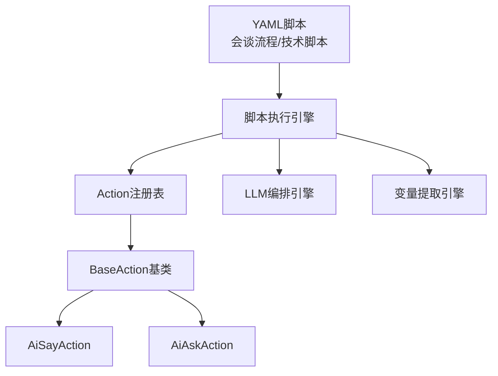
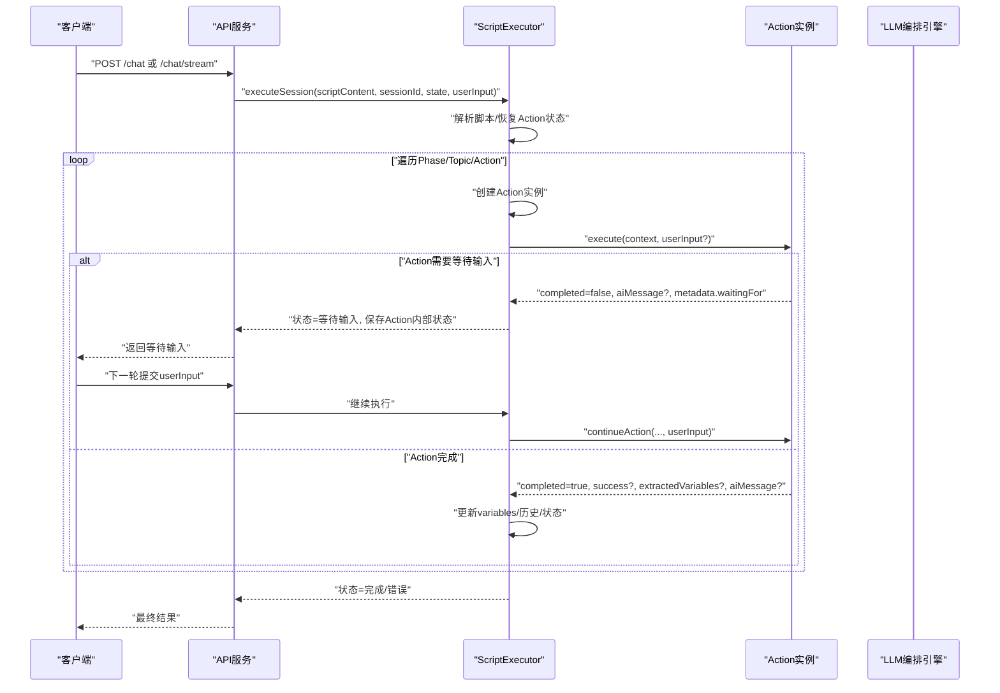
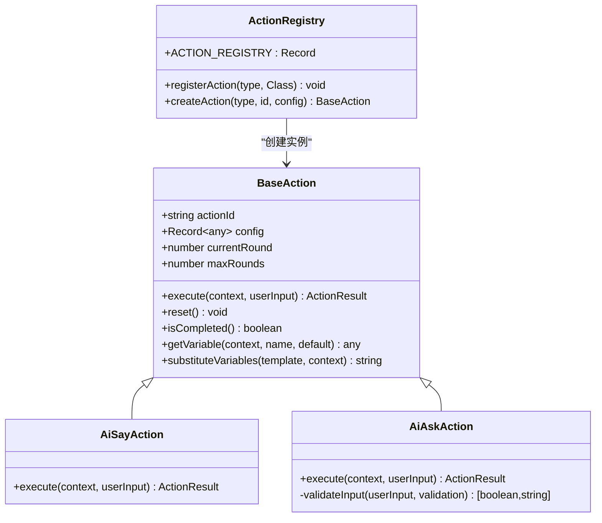
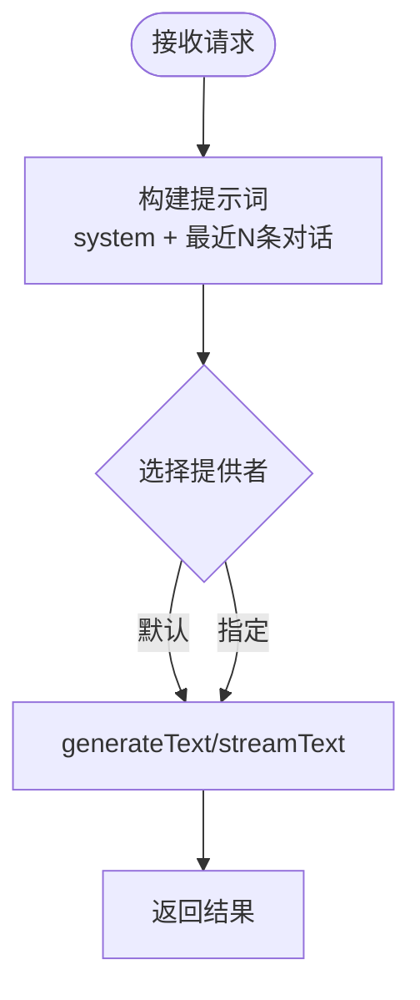
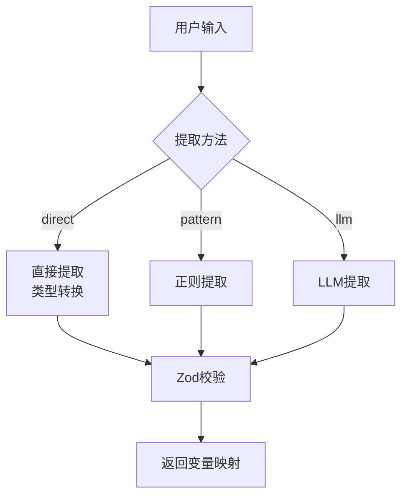
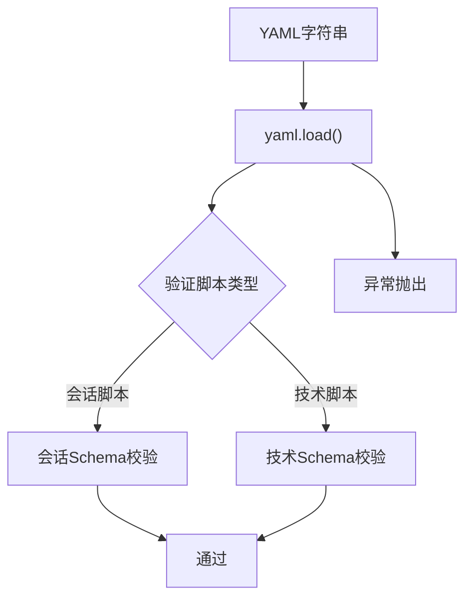
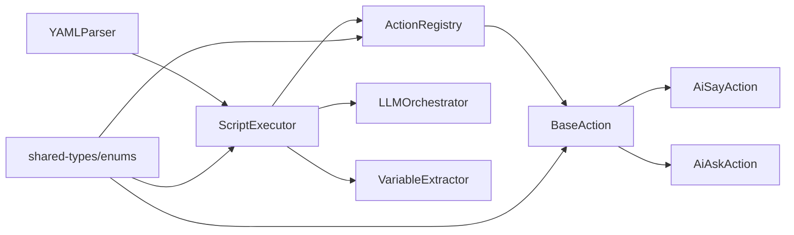

# 核心价值与特性

<cite>
**本文引用的文件**
- [README.md](file://README.md)
- [packages/core-engine/src/index.ts](file://packages/core-engine/src/index.ts)
- [packages/core-engine/src/domain/script.ts](file://packages/core-engine/src/domain/script.ts)
- [packages/core-engine/src/actions/action-registry.ts](file://packages/core-engine/src/actions/action-registry.ts)
- [packages/core-engine/src/actions/base-action.ts](file://packages/core-engine/src/actions/base-action.ts)
- [packages/core-engine/src/actions/ai-say-action.ts](file://packages/core-engine/src/actions/ai-say-action.ts)
- [packages/core-engine/src/actions/ai-ask-action.ts](file://packages/core-engine/src/actions/ai-ask-action.ts)
- [packages/core-engine/src/engines/script-execution/yaml-parser.ts](file://packages/core-engine/src/engines/script-execution/yaml-parser.ts)
- [packages/core-engine/src/engines/script-execution/script-executor.ts](file://packages/core-engine/src/engines/script-execution/script-executor.ts)
- [packages/core-engine/src/engines/llm-orchestration/orchestrator.ts](file://packages/core-engine/src/engines/llm-orchestration/orchestrator.ts)
- [packages/core-engine/src/engines/variable-extraction/extractor.ts](file://packages/core-engine/src/engines/variable-extraction/extractor.ts)
- [packages/core-engine/src/engines/memory/index.ts](file://packages/core-engine/src/engines/memory/index.ts)
- [packages/shared-types/src/enums.ts](file://packages/shared-types/src/enums.ts)
- [scripts/sessions/cbt_depression_assessment.yaml](file://scripts/sessions/cbt_depression_assessment.yaml)
- [scripts/techniques/socratic_questioning.yaml](file://scripts/techniques/socratic_questioning.yaml)
</cite>

## 目录
1. [引言](#引言)
2. [项目结构](#项目结构)
3. [核心组件](#核心组件)
4. [架构总览](#架构总览)
5. [详细组件分析](#详细组件分析)
6. [依赖分析](#依赖分析)
7. [性能考量](#性能考量)
8. [故障排查指南](#故障排查指南)
9. [结论](#结论)
10. [附录](#附录)

## 引言
HeartRule AI咨询引擎以“LLM + YAML脚本”混合架构为核心，旨在将专业咨询师的经验、技术、流程与数据沉淀为可执行、可维护的脚本化知识库。其六大核心特性——经验结构化沉淀、灵活性与可控性平衡、领域知识可扩展、质量可追溯、类型安全、高性能——共同构成了系统在心理咨询场景下的高价值实践路径。本文面向初学者与资深开发者，既提供清晰的概念理解，又给出技术深度分析与可视化图示。

## 项目结构
项目采用Monorepo组织方式，核心分为三层：
- 表现层：前端与脚本编辑器工作台（由脚本与API驱动）
- 应用层：会话管理、脚本调试与编辑（API服务与数据库）
- 引擎层：六大核心引擎（脚本执行、LLM编排、变量提取、记忆、话题调度、意识触发）

图表来源
- [README.md](file://README.md#L26-L58)
- [packages/core-engine/src/index.ts](file://packages/core-engine/src/index.ts#L7-L27)

章节来源
- [README.md](file://README.md#L26-L58)
- [packages/core-engine/src/index.ts](file://packages/core-engine/src/index.ts#L7-L27)

## 核心组件
- 脚本执行引擎：解析YAML脚本，按Phase → Topic → Action顺序执行，支持多轮对话与状态持久化。
- LLM编排引擎：统一管理多个LLM提供者，支持非流式与流式调用，并内置滑动窗口上下文截断。
- 变量提取引擎：支持direct/pattern/llm三种提取策略，结合Zod Schema进行运行时校验。
- 记忆引擎：短期/中期/长期记忆规划（当前实现短期记忆）。
- 话题调度引擎：动态话题切换（计划驱动 + 意识驱动）。
- 意识触发引擎：监控对话情境，按优先级干预。

章节来源
- [README.md](file://README.md#L256-L264)
- [packages/core-engine/src/engines/script-execution/script-executor.ts](file://packages/core-engine/src/engines/script-execution/script-executor.ts#L59-L208)
- [packages/core-engine/src/engines/llm-orchestration/orchestrator.ts](file://packages/core-engine/src/engines/llm-orchestration/orchestrator.ts#L30-L141)
- [packages/core-engine/src/engines/variable-extraction/extractor.ts](file://packages/core-engine/src/engines/variable-extraction/extractor.ts#L25-L77)
- [packages/core-engine/src/engines/memory/index.ts](file://packages/core-engine/src/engines/memory/index.ts#L16-L25)

## 架构总览
系统采用“脚本驱动 + LLM增强”的双轨架构：YAML脚本确保流程的专业性与可审计性，LLM提供自然语言理解与生成能力，二者协同实现“可控性与灵活性的平衡”。

图表来源
- [packages/core-engine/src/engines/script-execution/yaml-parser.ts](file://packages/core-engine/src/engines/script-execution/yaml-parser.ts#L8-L95)
- [packages/core-engine/src/engines/script-execution/script-executor.ts](file://packages/core-engine/src/engines/script-execution/script-executor.ts#L59-L208)
- [packages/core-engine/src/actions/action-registry.ts](file://packages/core-engine/src/actions/action-registry.ts#L17-L45)
- [packages/core-engine/src/actions/base-action.ts](file://packages/core-engine/src/actions/base-action.ts#L37-L95)
- [packages/core-engine/src/actions/ai-say-action.ts](file://packages/core-engine/src/actions/ai-say-action.ts#L16-L105)
- [packages/core-engine/src/actions/ai-ask-action.ts](file://packages/core-engine/src/actions/ai-ask-action.ts#L19-L207)
- [packages/core-engine/src/engines/llm-orchestration/orchestrator.ts](file://packages/core-engine/src/engines/llm-orchestration/orchestrator.ts#L30-L141)
- [packages/core-engine/src/engines/variable-extraction/extractor.ts](file://packages/core-engine/src/engines/variable-extraction/extractor.ts#L25-L77)

## 详细组件分析

### 组件A：脚本执行引擎（ScriptExecutor）
职责与流程
- 解析YAML脚本，按Phase → Topic → Action顺序推进
- 支持Action多轮执行与状态持久化（序列化/反序列化）
- 维护执行状态（ExecutionState），包含变量、对话历史、元数据等
- 对Action执行结果进行汇总（变量更新、AI消息入历史、错误处理）

图表来源
- [packages/core-engine/src/engines/script-execution/script-executor.ts](file://packages/core-engine/src/engines/script-execution/script-executor.ts#L63-L208)
- [packages/core-engine/src/engines/script-execution/script-executor.ts](file://packages/core-engine/src/engines/script-execution/script-executor.ts#L394-L448)
- [packages/core-engine/src/engines/script-execution/script-executor.ts](file://packages/core-engine/src/engines/script-execution/script-executor.ts#L490-L509)

章节来源
- [packages/core-engine/src/engines/script-execution/script-executor.ts](file://packages/core-engine/src/engines/script-execution/script-executor.ts#L59-L208)
- [packages/core-engine/src/engines/script-execution/script-executor.ts](file://packages/core-engine/src/engines/script-execution/script-executor.ts#L394-L448)
- [packages/core-engine/src/engines/script-execution/script-executor.ts](file://packages/core-engine/src/engines/script-execution/script-executor.ts#L490-L509)

### 组件B：Action体系（ActionRegistry + BaseAction + AiSayAction/AiAskAction）
职责与关系
- BaseAction定义Action通用接口与生命周期（round控制、变量替换、模板渲染）
- ActionRegistry集中注册与创建Action实例
- AiSayAction负责消息发送与确认机制
- AiAskAction负责提问、校验、变量提取与重试逻辑

图表来源
- [packages/core-engine/src/actions/base-action.ts](file://packages/core-engine/src/actions/base-action.ts#L37-L95)
- [packages/core-engine/src/actions/ai-say-action.ts](file://packages/core-engine/src/actions/ai-say-action.ts#L16-L105)
- [packages/core-engine/src/actions/ai-ask-action.ts](file://packages/core-engine/src/actions/ai-ask-action.ts#L19-L207)
- [packages/core-engine/src/actions/action-registry.ts](file://packages/core-engine/src/actions/action-registry.ts#L17-L45)

章节来源
- [packages/core-engine/src/actions/base-action.ts](file://packages/core-engine/src/actions/base-action.ts#L37-L95)
- [packages/core-engine/src/actions/ai-say-action.ts](file://packages/core-engine/src/actions/ai-say-action.ts#L16-L105)
- [packages/core-engine/src/actions/ai-ask-action.ts](file://packages/core-engine/src/actions/ai-ask-action.ts#L19-L207)
- [packages/core-engine/src/actions/action-registry.ts](file://packages/core-engine/src/actions/action-registry.ts#L17-L45)

### 组件C：LLM编排引擎（LLMOrchestrator）
职责与能力
- 统一管理多个LLM提供者，支持默认提供者切换
- 提供非流式与流式文本生成
- 构建提示词（支持system提示与滑动窗口对话历史）
- 批量调用（并行）

图表来源
- [packages/core-engine/src/engines/llm-orchestration/orchestrator.ts](file://packages/core-engine/src/engines/llm-orchestration/orchestrator.ts#L84-L114)
- [packages/core-engine/src/engines/llm-orchestration/orchestrator.ts](file://packages/core-engine/src/engines/llm-orchestration/orchestrator.ts#L162-L196)

章节来源
- [packages/core-engine/src/engines/llm-orchestration/orchestrator.ts](file://packages/core-engine/src/engines/llm-orchestration/orchestrator.ts#L30-L141)
- [packages/core-engine/src/engines/llm-orchestration/orchestrator.ts](file://packages/core-engine/src/engines/llm-orchestration/orchestrator.ts#L84-L114)

### 组件D：变量提取引擎（VariableExtractor）
职责与策略
- 支持direct/pattern/llm三种提取方法
- 结合Zod Schema进行类型校验
- 批量提取：非LLM快速提取 + LLM批量提取

图表来源
- [packages/core-engine/src/engines/variable-extraction/extractor.ts](file://packages/core-engine/src/engines/variable-extraction/extractor.ts#L35-L77)
- [packages/core-engine/src/engines/variable-extraction/extractor.ts](file://packages/core-engine/src/engines/variable-extraction/extractor.ts#L152-L176)

章节来源
- [packages/core-engine/src/engines/variable-extraction/extractor.ts](file://packages/core-engine/src/engines/variable-extraction/extractor.ts#L25-L77)
- [packages/core-engine/src/engines/variable-extraction/extractor.ts](file://packages/core-engine/src/engines/variable-extraction/extractor.ts#L152-L176)

### 组件E：脚本解析与Schema校验（YAMLParser）
职责与能力
- 解析YAML为JSON，序列化回YAML
- 验证会谈流程脚本与技术脚本Schema，确保结构一致性

图表来源
- [packages/core-engine/src/engines/script-execution/yaml-parser.ts](file://packages/core-engine/src/engines/script-execution/yaml-parser.ts#L12-L18)
- [packages/core-engine/src/engines/script-execution/yaml-parser.ts](file://packages/core-engine/src/engines/script-execution/yaml-parser.ts#L34-L67)
- [packages/core-engine/src/engines/script-execution/yaml-parser.ts](file://packages/core-engine/src/engines/script-execution/yaml-parser.ts#L72-L94)

章节来源
- [packages/core-engine/src/engines/script-execution/yaml-parser.ts](file://packages/core-engine/src/engines/script-execution/yaml-parser.ts#L8-L95)

### 组件F：脚本与Action的实际应用（示例）
- 会谈脚本示例：cbt_depression_assessment.yaml 展示了Session → Phase → Topic → Action的完整结构，包含ai_say、ai_ask、ai_think等Action的组合使用。
- 技术脚本示例：socratic_questioning.yaml 展示了可复用的咨询技术脚本结构，强调输入参数与输出变量的规范化。

章节来源
- [scripts/sessions/cbt_depression_assessment.yaml](file://scripts/sessions/cbt_depression_assessment.yaml#L1-L166)
- [scripts/techniques/socratic_questioning.yaml](file://scripts/techniques/socratic_questioning.yaml#L1-L110)

## 依赖分析
- 脚本执行引擎依赖Action注册表与Action基类，通过工厂模式创建具体Action实例
- Action执行过程中可调用LLM编排引擎与变量提取引擎
- YAML解析器为脚本执行提供Schema校验保障
- 类型系统由shared-types中的枚举与Zod Schema统一约束

图表来源
- [packages/core-engine/src/engines/script-execution/yaml-parser.ts](file://packages/core-engine/src/engines/script-execution/yaml-parser.ts#L8-L95)
- [packages/core-engine/src/engines/script-execution/script-executor.ts](file://packages/core-engine/src/engines/script-execution/script-executor.ts#L59-L208)
- [packages/core-engine/src/actions/action-registry.ts](file://packages/core-engine/src/actions/action-registry.ts#L17-L45)
- [packages/core-engine/src/actions/base-action.ts](file://packages/core-engine/src/actions/base-action.ts#L37-L95)
- [packages/shared-types/src/enums.ts](file://packages/shared-types/src/enums.ts#L107-L118)

章节来源
- [packages/core-engine/src/engines/script-execution/yaml-parser.ts](file://packages/core-engine/src/engines/script-execution/yaml-parser.ts#L8-L95)
- [packages/core-engine/src/engines/script-execution/script-executor.ts](file://packages/core-engine/src/engines/script-execution/script-executor.ts#L59-L208)
- [packages/core-engine/src/actions/action-registry.ts](file://packages/core-engine/src/actions/action-registry.ts#L17-L45)
- [packages/shared-types/src/enums.ts](file://packages/shared-types/src/enums.ts#L107-L118)

## 性能考量
- 异步事件循环与流式处理：LLM编排引擎支持流式文本生成，降低首字节延迟
- 滑动窗口上下文：限制对话历史长度，平衡上下文质量与性能
- 批量调用：提供并行批量生成能力，提升吞吐
- Action多轮状态持久化：避免重复计算，提高中断恢复效率
- 类型安全与Schema校验：在编译期与运行期双重约束，减少无效调用与回滚成本

## 故障排查指南
常见问题与定位思路
- 脚本解析失败：检查YAML语法与Schema字段（session_id、phases、topics、actions等）
- Action执行异常：查看Action返回的error字段与metadata，确认require_acknowledgment、max_rounds、validation配置
- LLM调用失败：确认提供者名称与默认提供者设置，检查网络与密钥配置
- 变量提取失败：核对extractionMethod与schema，确认输入格式与正则表达式

章节来源
- [packages/core-engine/src/engines/script-execution/yaml-parser.ts](file://packages/core-engine/src/engines/script-execution/yaml-parser.ts#L34-L67)
- [packages/core-engine/src/engines/script-execution/script-executor.ts](file://packages/core-engine/src/engines/script-execution/script-executor.ts#L203-L207)
- [packages/core-engine/src/actions/ai-ask-action.ts](file://packages/core-engine/src/actions/ai-ask-action.ts#L169-L205)
- [packages/core-engine/src/engines/llm-orchestration/orchestrator.ts](file://packages/core-engine/src/engines/llm-orchestration/orchestrator.ts#L119-L128)
- [packages/core-engine/src/engines/variable-extraction/extractor.ts](file://packages/core-engine/src/engines/variable-extraction/extractor.ts#L62-L76)

## 结论
HeartRule通过“LLM + YAML脚本”的混合架构，将咨询师经验沉淀为可执行、可维护的知识资产。六大核心特性在工程实践中相互支撑：经验结构化沉淀奠定可扩展与可追溯基础；灵活性与可控性平衡确保专业流程与自然交互并存；领域知识可扩展与质量可追溯保障产品演进；类型安全与高性能则为系统稳定性与用户体验提供坚实保障。

## 附录
- 快速开始与开发指南参见项目根README
- 示例脚本位于scripts目录，可作为二次开发的起点

章节来源
- [README.md](file://README.md#L63-L95)
- [README.md](file://README.md#L295-L327)